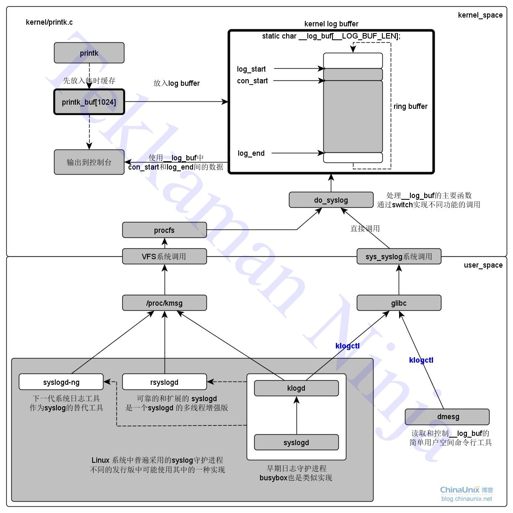
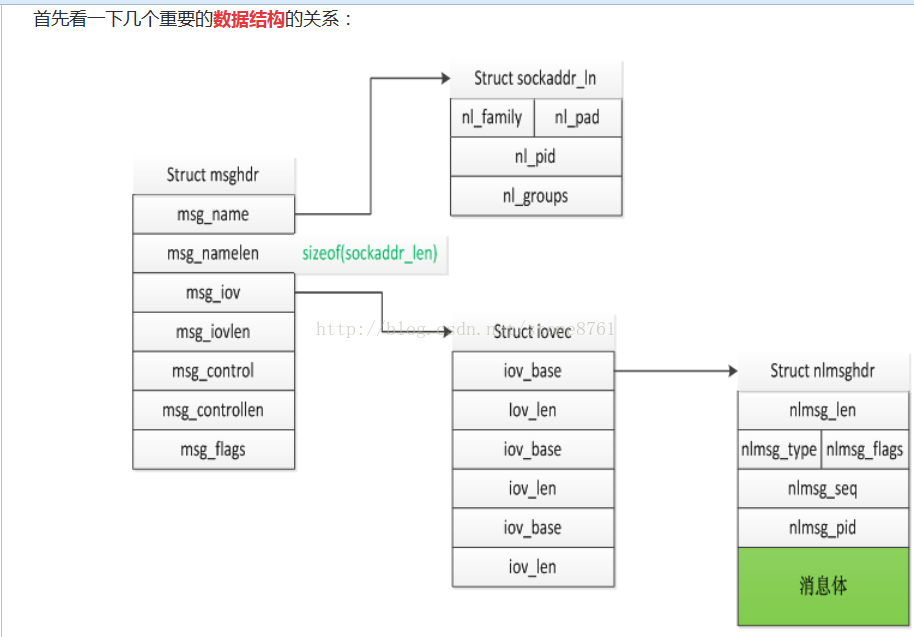

## linux调试诊断

###  修订记录
| 修订说明 | 日期 | 作者 | 额外说明 |
| --- |
| 初版 | 2018/07/25 | 员清观 |  |

## 1 基础
内核中有三个常用的伪文件系统：procfs，debugfs和sysfs。它们都用于Linux内核和用户空间的数据交换，但是适用的场景有所差异：
- procfs 历史最早，最初就是用来跟内核交互的唯一方式，用来获取处理器、内存、设备驱动、进程等各种信息。应该是系统级别的，比如fr内存管理
- sysfs 跟 kobject 框架紧密联系，而 kobject 是为设备驱动模型而存在的，所以 sysfs 是为具体的设备驱动服务的，kobject和device一一对应。和procfs应该是互补的存在。
- debugfs 从名字来看就是为debug而生，所以更加灵活。我的理解，procfs是不可去除的，debugfs去除应该不能影响到系统工作，他只是为了debug。上层功能不应该基于此开发。

procfs, sysfs, debugfs默认情况下，分别挂载在/proc，/sys/，/sys/kernel/debug/。可以改变挂载点，如`mount -t proc none /myproc`，也可以在`/etc/fstab`中加入如下一行使系统在启动时自动加载procfs(大多数系统中也是默认如此)：`none /proc proc defaults 0 0`

有些程序的操作难以量化cpu开销，可以调用10次，平均统计。

参考文档：  [Linux内核调试的方式以及工具集锦] https://blog.csdn.net/gatieme/article/details/68948080

### 1.1 基本的printk
可以通过CONFIG_LOG_BUF_SHIFT宏控制printk对应的ring_buffer的大小，一般128kbytes. 实际的实现就不关注了。代码中可以通过 klogctl(8,NULL,level) 函数直接修改。或者`echo 5 > /proc/sys/kernel/printk`
```cpp
//#define __LOG_BUF_LEN (1 << CONFIG_LOG_BUF_SHIFT)
static char __log_buf[__LOG_BUF_LEN] __aligned(LOG_ALIGN);
static char *log_buf = __log_buf;
static u32 log_buf_len = __LOG_BUF_LEN;
static unsigned log_start; /* log_buf中的索引: 指向由syslog()读取的下一个字符 */
static unsigned con_start; /* log_buf中的索引: 指向发送到console的下一个字符 */
static unsigned log_end; /* log_buf中的索引:最近写入的字符地址 + 1 */

//#define KERN_SOH	"\001"
//#define KERN_EMERG	KERN_SOH "0"	/* system is unusable */
//#define KERN_ALERT	KERN_SOH "1"	/* action must be taken immediately */
//#define KERN_CRIT	KERN_SOH "2"	/* critical conditions */
//#define KERN_ERR	KERN_SOH "3"	/* error conditions */
//#define KERN_WARNING	KERN_SOH "4"	/* warning conditions */
//#define KERN_INFO	KERN_SOH "6"	/* informational */
//#define KERN_NOTICE	KERN_SOH "5"	/* normal but significant condition */
//#define KERN_DEBUG	KERN_SOH "7"	/* debug-level messages */

//#define KERN_DEFAULT	KERN_SOH "d"	/* the default kernel loglevel */
```


在用户空间有专门用于记录系统日志的程序，统称为“syslog守护进程”。早期及现在的大部分嵌入式系统使用的是klogd+syslogd组合，现在大多数发行版都使用rsyslogd或者syslogd-ng了。这些用户空间的程序我这里就不分析了，我不擅长，运维的可能比较清楚。我只知道一下他们大致的调用关系就好。

## 2 procfs/sysfs
一个 proc 虚拟文件可能有内部格式，如 /proc/scsi/scsi ，它是可读可写的，并且读写格式不一样，代表不同的操作，应用程序中读到了这个文件的内容一般还需要进行字符串解析，而在写入时需要先用字符串格式化按指定的格式写入字符串进行操作; sysfs 的设计原则是一个属性文件只做一件事情， sysfs属性文件一般只有一个值，直接读取或写入。新设计的内核机制应该尽量使用 sysfs 机制，而将 proc 保留给纯净的“进程文件系统”。

### 2.1 sysfs
/sys 下的目录结构是经过精心设计的：在 /sys/devices 下是所有设备的真实对象，包括如视频卡和以太网卡等真实的设备，也包括 ACPI 等不那么显而易见的真实设备、还有 tty, bonding 等纯粹虚拟的设备；在其它目录如 class, bus 等中则在分类的目录中含有大量对 devices 中真实对象引用的符号链接文件。可以用`ls -F /sys`命令显示sys的下层目录。

增加sysfs属性文件，可以使用下面宏，分别应用于总线/类别/驱动/设备四种内核数据结构对象上
```cpp
//包含<include/linux/sysfs.h>：
	//#define __ATTR(_name,_mode,_show,_store) { \
	        .attr = {.name = __stringify(_name), .mode = _mode },   \
	        .show   = _show,                                        \
	    .store  = _store,                                       \
	}
//包含<include/linux/device.h>：
	//#define BUS_ATTR(_name, _mode, _show, _store)   \
	struct bus_attribute bus_attr_##_name = __ATTR(_name, _mode, _show, _store)
	//#define CLASS_ATTR(_name, _mode, _show, _store)                 \
	struct class_attribute class_attr_##_name = __ATTR(_name, _mode, _show, _store)
	//#define DRIVER_ATTR(_name, _mode, _show, _store)        \
	struct driver_attribute driver_attr_##_name =           \
	        __ATTR(_name, _mode, _show, _store)
	//#define DEVICE_ATTR(_name, _mode, _show, _store) \
	struct device_attribute dev_attr_##_name = __ATTR(_name, _mode, _show, _store)

//几种简单类型，不需要额外定义新的show和store函数.
ssize_t device_show_ulong(struct device *dev, struct device_attribute *attr, char *buf);
ssize_t device_store_ulong(struct device *dev, struct device_attribute *attr, const char *buf, size_t count);
ssize_t device_show_int(struct device *dev, struct device_attribute *attr, char *buf);
ssize_t device_store_int(struct device *dev, struct device_attribute *attr, const char *buf, size_t count);
ssize_t device_show_bool(struct device *dev, struct device_attribute *attr, char *buf);
ssize_t device_store_bool(struct device *dev, struct device_attribute *attr, const char *buf, size_t count);

static int test_int;
static DEVICE_INT_ATTR(aecv2_int, 0666, test_int);
device_create_file(device, &dev_attr_aecv2_int);//这最好放在device的probe函数中调用

int device_create_file(struct device *dev, const struct device_attribute *attr)；
int class_create_file(struct class *cls, const struct class_attribute *attr);
int bus_create_file(struct bus_type *bus, struct bus_attribute *attr);
```
总线(BUS)和类别(CLASS)属性一般用于新设计的总线和新设计的类别，这两者一般是不用的；因为你的设备一般是以PCI等成熟的常规方式连接到主机，而不会去新发明一种类型；使用驱动属性和设备属性的区别就在于：看你的 sysfs 属性设计是针对整个驱动有效的还是针对这份驱动所可能支持的每个设备分别有效。从头文件中还可以找到 show/store 函数的原型，注意到它和虚拟字符设备或 proc 项的 read/write 的作用很类似，但有一点不同是 show/store 函数上的 buf/count 参数是在 sysfs 层已作了用户区/内核区的内存复制，虚拟字符设备上常见的 __user 属性在这里并不需要，因而也不需要多一次 copy_from_user/copy_to_user, 在 show/store 函数参数上的 buf/count 参数已经是内核区的地址，可以直接操作。

`cd /sys/devices/platform/soc-audio;ls -l` 可以发现每个文件的大小是4096，一个page。
`echo '- - -' >/sys/...`的方式传递有中间间隔的参数。

```cpp
static ssize_t aecv2_attr_show(struct device *dev, struct device_attribute *attr, char *buf)
{
	if(0 == strcmp(attr->attr.name, "aecv2_ctrl")) {
		printk(KERN_EMERG "%s: %d\n", attr->attr.name, aecv2_controler.control);
	} else if(0 == strcmp(attr->attr.name, "aecv2_offset")) {
		printk(KERN_EMERG "%s: %d\n", attr->attr.name, aecv2_controler.preset_offset);
	}
    return 0;
}
static ssize_t aecv2_attr_store(struct device *dev, struct device_attribute *attr, const char *buf, size_t count)
{
	if(0 == strcmp(attr->attr.name, "aecv2_ctrl")) {
		aecv2_controler.control = simple_strtol(buf, NULL, 10);
	} else if(0 == strcmp(attr->attr.name, "aecv2_offset")) {
		aecv2_controler.preset_offset = simple_strtol(buf, NULL, 10);
	}
    return count;
}
static DEVICE_ATTR(aecv2_offset, 0666, aecv2_attr_show, aecv2_attr_store);
static DEVICE_ATTR(aecv2_ctrl, 0666, aecv2_attr_show, aecv2_attr_store);

void aecv2_set_soc_card(struct device *device, char* card_name)
{
	device_create_file(device, &dev_attr_aecv2_ctrl);
	device_create_file(device, &dev_attr_aecv2_offset);

	strcpy(aecv2_controler.card_name, card_name);
}
```
### 2.2 seqfile和procfs
procfs在处理大文件时有点笨拙。为了清理procfs文件系统并且使内核编程简单些，引入了seq_file机制。seq_file机制提供了大量简单的接口去实现大内核虚拟文件。也可以配合用于debugfs.使用方法简单，你必须包含头文件<linux/seq_file.h>。接下来，你必须创建迭代器方法：start, next, stop, show。seq_file机制适用于你利用结构序列去创建一个返回给用户空间的虚拟文件。要使用seq_file机制，你必须创建一个”iterator”对象，这个对象指向这个序列，并且能逐个指向这个序列中的对象，此外还要能输出这个序列中的任一个对象。它听起来复杂，实际上，操作过程相当简单。接下来将用实际的例子展示到底怎么做。 参考文档： https://blog.csdn.net/ranwei693532/article/details/62888246

```cpp
//#include <linux/seq_file.h>
//#include <linux/proc_fs.h>

static void *wing_seq_start(struct seq_file *s, loff_t *pos)
{
    if (*pos >= g_iWingDevicesNum)
        return NULL; /* No more to read */
    return g_pstWingDevices + *pos;
}
static void* wing_seq_next(struct seq_file *s, void *v, loff_t *pos)
{
    (*pos)++;
    if (*pos >= g_iWingDevicesNum)
        return NULL;
    return g_pstWingDevices + *pos;
}
void wing_seq_stop(struct seq_file *sfile, void *v)
{}
static int wing_seq_show(struct seq_file *s, void *v)
{
    ST_Wing_Dev_Type* pDev = (ST_Wing_Dev_Type* ) v;
    seq_printf(s, "\nThis Device is %i\n", pDev->iData);
    return 0;
}
static struct seq_operations s_stWingSeqOps = {
    .start = wing_seq_start,
    .next = wing_seq_next,
    .stop = wing_seq_stop,
    .show = wing_seq_show
};
static int wing_proc_open(struct inode *inode, struct file *file)
{
    return seq_open(file, &s_stWingSeqOps);
}
static struct file_operations s_stWingProcFops = {
    .owner = THIS_MODULE,
    .open = wing_proc_open,
    .read = seq_read,
    .llseek = seq_lseek,
    .release = seq_release
};
struct proc_dir_entry* my_dir;
static int test_proc_init(void) {
	my_dir = proc_mkdir("wingdir", NULL);
	if(!my_dir)
		return -1;
	proc_create("wingdevices", 0644, my_dir, &s_stWingProcFops);
	return 0;
}
static int test_proc_exit(void) {
	if(my_dir) {
		remove_proc_entry("wingdevices", my_dir);
		proc_remove(my_dir);
	}
}

/* void *start(struct seq_file *sfile, loff_t *pos); */
//start方法通常被首先调用。s 没什么作用，通常被忽略。pos参数是一个整型，表示从哪个位置开始读。关于位置的定义完全取决于函数实现；它不一定要是结果文件中的一个字节位置。 由于seq_file机制通常是利用一个特定的结构序列实现的，所以位置通常是一个指向序列中下一个结构体的指针。在wing驱动中，每一个设备表示序列中的一个结构，所以，入参pos代表g_pstWingDevices数组的索引。返回值如果不为NULL，代表一个可以被迭代器使用的私有数据

/* void *next(struct seq_file *sfile, void *v, loff_t *pos); */
//next函数应该移动迭代器到下一个位置，如果序列中没有数据，返回NULL。参数v代表上一个函数调用（可能是start函数，或者是next函数）返回的迭代器，, 参数pos是文件中的当前位置。next函数应该改变pos的指向，具体是逐步改变还是跳跃改变取决于迭代器的工作机制

/* void stop(struct seq_file *sfile, void *v); */
//stop函数清理现场，可能做一些统计和打印。要是seq_file代码在调用start和stop时不执行睡眠或是非原子的操作，那么这种机制将毫无意义。你要保证从start函数调用到stop函数调用是很短暂的。因此，在开始函数中获得一个信号量或者自旋锁是比较安全的做法。要是seq_file其他方法是原子的，整个调用链必须是原子的。

/* int show(struct seq_file *sfile, void *v); */
//在这些函数调用中，内核调用call函数向内核空间输出特性的信息这个方法应该创建序列中由指示器v指定项的输出。不能使用printk，而是使用以下这些特定函数：
//int seq_printf(struct seq_file *sfile, const char *fmt, ...)  这个函数是seq_file机制中类似于printf的实现；它使用通常的格式字符串和参数组成输出字符串。你必须把show函数中的seq_file结构体传给这个函数。如果它返回一个非零的值，表示buffer已经填充好，输出被丢出去了。在大多数实现中，都选择忽略返回值。
//int seq_putc(struct seq_file *sfile, char c);
//int seq_puts(struct seq_file *sfile, const char *s); 这两个函数相当于用户层的putc和puts。
//int seq_escape(struct seq_file *m, const char *s, const char *esc); 这个函数是 seq_puts 的对等体, 除了 s 中的任何也在 esc 中出现的字符以八进制格式打印. esc 的一个通用值是”\t\n\”, 它使内嵌的空格不会搞乱输出和可能搞乱 shell 脚本.
//int seq_path(struct seq_file *sfile, struct vfsmount *m, struct dentry *dentry, char *esc);  这个函数能够用来输出和给定命令项关联的文件名子. 它在设备驱动中不可能有用;我们是为了完整在此包含它

/* struct proc_dir_entry *proc_create(const char *name, umode_t mode, struct proc_dir_entry *parent, const struct file_operations *proc_fops) */
//

/* struct proc_dir_entry *proc_mkdir(const char *name, struct proc_dir_entry *parent) */
//在/proc下创建目录，name 要创建的目录名称； parent 父目录，如果为NULL，表示直接在/proc下面创建目录

```

**主要procfs接口**<br>
```cpp
struct proc_dir_entry *proc_symlink(const char *name, struct proc_dir_entry *parent, const char *dest);
//这个函数在procfs目录下创建一个从name指向dest的符号链接. 它在用户空间等效为ln -s dest name。
struct proc_dir_entry *proc_mkdir(const char *name, struct proc_dir_entry *parent)；
struct proc_dir_entry *proc_mkdir_data(const char *name, umode_t mode, struct proc_dir_entry *parent, void *data);//创建完整目录

struct proc_dir_entry *proc_create_data(const char *name, umode_t mode, struct proc_dir_entry *parent, const struct file_operations *proc_fops, void *data);
//访问的话使用struct seq_file指针参数的private成员，如 int test_proc_show(struct seq_file *m, void *v)函数中，ST_Data_Info_Type* pInfo = (ST_Data_Info_Type*)m->private;好处是，可以避开使用全局变量，使得代码结构更加清晰
struct proc_dir_entry *proc_create(const char *name, umode_t mode, struct proc_dir_entry *parent, const struct file_operations *proc_fops);
//proc_create() 一般在创建使用 seq_file 接口的proc 文件时使用
void remove_proc_entry(const char *name, struct proc_dir_entry *parent)
//删除procfs文件系统中的文件或者目录。
proc_mkdir_mode
remove_proc_subtree
proc_set_size
proc_set_user
PDE_DATA
proc_get_parent_data
proc_remove

struct proc_dir_entry *create_proc_entry( const char *name,  mode_t mode, struct proc_dir_entry *parent );
//好像没用了,当前代码中都找不到范例

```

## 3 debugfs

**debugfs的blob结构**<br>
blob信息只读，只能导出，不能导入

```cpp
//#include <linux/debugfs.h>

//可以定义大的数据区，填写调试信息，应用程序读取解析和显示；shell下 hexdump命令显示
struct debugfs_blob_wrapper {
    void *data;
    unsigned long size;
};
static struct debugfs_blob_wrapper blob; //最好放 global.
char data[100];
sprintf(data, "Data Pointer is : %08X \n", data);
blob.data = data;
blob.size = 100;
debugfs_create_blob("blob", S_IRUSR, pcie_dir, &blob);

//shell下答应：  hexdump --/debugfs/pcie/blob -c
```

```cpp
//#include <linux/debugfs.h>

static ssize_t  imapx_spi_show_regs(struct file *file, char __user *user_buf, size_t count, loff_t *ppos)
	struct imapx_spi *host = file->private_data;
	pr_err("SPI_EN(%x)	0x%x\n", SPI_EN, spi_readl(host, SPI_EN));
	pr_err("SPI_CTL(%x)	0x%x\n", SPI_CTL, spi_readl(host, SPI_CTL));
  ... ...

static ssize_t  imapx_spi_show_loglevel(struct file *file, char __user *user_buf,	size_t count, loff_t *ppos)
	pr_info("[spimul] spi_log_enable - %d\n", spi_log_enable);

static ssize_t imapx_spi_store_loglevel(struct file *file, const char __user *user_buf,	size_t count, loff_t *ppos)
	char buf[16];
	if (copy_from_user(buf, user_buf, count))		return -EFAULT;
	spi_log_enable = simple_strtoul(buf, NULL, 10);	return count;

static const struct file_operations imapx_spi_regs_ops = {
	.owner          = THIS_MODULE,
	.open           = simple_open,
	.read           = imapx_spi_show_regs,
	.llseek         = default_llseek,
};

static const struct file_operations imapx_spi_log_ops = {
	.owner          = THIS_MODULE,
	.open           = simple_open,
	.read           = imapx_spi_show_loglevel,
	.write          = imapx_spi_store_loglevel,
	.llseek         = default_llseek,
};

//在sys/kernel/debug/目录下生成spi-imapx子目录并创建两个文件，重定义read和write两个函数
static int state = 0;
static int imapx_spi_debugfs_init(struct imapx_spi *host)
  struct dentry *debugfs = debugfs_create_dir("spi-imapx", NULL);//NULL表示在debug根目录下创建
  debugfs_create_file("registers", S_IFREG | S_IRUGO, debugfs, host, &imapx_spi_regs_ops);
	debugfs_create_file("log", S_IFREG | S_IRUGO | S_IWUGO, debugfs, host, &imapx_spi_log_ops);
  debugfs_create_u32("state", S_IRUSR, debugfs, (u32 *)&state); //绑定简单类型

struct dentry *debugfs_create_dir(const char *name, struct dentry *parent);
struct dentry *debugfs_create_file(const char *name, umode_t mode, struct dentry *parent, void *data, const struct file_operations *fops);
struct dentry *debugfs_create_blob(const char *name, mode_t mode, struct dentry *parent, struct debugfs_blob_wrapper *blob);
struct dentry *debugfs_rename(struct dentry *old_dir, struct dentry *old_dentry, struct dentry *new_dir, constchar *new_name);
struct dentry *debugfs_create_symlink(const char *name, struct dentry *parent, const char *target);   

```

**创建单值文件函数原型**<br>
```cpp
struct dentry *debugfs_create_u8(constchar *name, mode_t mode, struct dentry *parent, u8 *value);
struct dentry *debugfs_create_u16(constchar *name, mode_t mode, struct dentry *parent, u16 *value);
struct dentry *debugfs_create_u32(constchar *name, mode_t mode, struct dentry *parent, u32 *value);
struct dentry *debugfs_create_u64(constchar *name, mode_t mode, struct dentry *parent, u64 *value);
struct dentry *debugfs_create_x8(constchar *name, mode_t mode, struct dentry *parent, u8 *value);
struct dentry *debugfs_create_x16(constchar *name, mode_t mode, struct dentry *parent, u16 *value);
struct dentry *debugfs_create_x32(constchar *name, mode_t mode, struct dentry *parent, u32 *value);       
struct dentry *debugfs_create_size_t(constchar *name, mode_t mode, struct dentry *parent, size_t*value);   
struct dentry *debugfs_create_bool(constchar *name, mode_t mode, struct dentry *parent, u32 *value);   

```

## 4 内核和用户大量数据交互
### 4.1 netlink机制
相对于ioctl、系统调用、procfs、sysfs、debugfs和共享内存，主要优点：1. 添加新功能方便;2. 内核和用户双工同步异步;3. 支持大缓冲区;4. 支持多播。 netlink在内核端可用于进程上下文与中断上下文。



**重要数据结构**<br>
```cpp
struct iovec {
	void __user *iov_base;	/* BSD uses caddr_t (1003.1g requires void *) */
	__kernel_size_t iov_len; /* Must be size_t (1003.1g) */
};

struct msghdr {
    void         *msg_name;       /* 数据的目的地址: 网络包指向sockaddr_in, netlink指向sockaddr_nl */
    socklen_t     msg_namelen;    /* msg_name 所代表的地址长度 */
    struct iovec *msg_iov;        /* scatter/gather array */
    size_t        msg_iovlen;     /* # elements in msg_iov */
    void         *msg_control;    /* ancillary data, see below */
    size_t        msg_controllen; /* ancillary data buffer len */
    int           msg_flags;      /* flags (unused) */
};

//sockaddr_nl是netlink通信地址，和我们通常socket编程中的sockaddr_in作用一样。pid表示通信端口，groups表示组, 注意这里为希望加入多播组号的掩码，也就是说最多只支持32个组
struct sockaddr_nl {
    sa_family_t nl_family; /*该字段总是为AF_NETLINK */
    unsigned short nl_pad; /* 目前未用到，填充为0*/
    __u32 nl_pid; /* process pid */
    __u32 nl_groups; /* multicast groups mask */
};

//Netlink报文的数据区由消息头和消息体构成，struct nlmsghdr即为消息头，消息体接在消息头后。
struct nlmsghdr {
    __u32 nlmsg_len; /* Length of message including header */
    __u16 nlmsg_type; /* 消息类型: NLMSG_NOOP：不执行任何动作，必须将该消息丢弃；	NLMSG_ERROR：消息发生错误；	NLMSG_DONE：标识分组消息的末尾；	NLMSG_OVERRUN：缓冲区溢出，表示某些消息已经丢失。 	NLMSG_MIN_TYPEK：预留 */
    __u16 nlmsg_flags; /* 消息标记：NLM_F_REQUEST NLM_F_MULTI NLM_F_ACK NLM_F_ECHO NLM_F_DUMP_INTR NLM_F_ROOT NLM_F_MATCH NLM_F_ATOMIC NLM_F_DUMP等 */
    __u32 nlmsg_seq; /* Sequence number */
    __u32 nlmsg_pid; /* Sending process PID，对于内核这是0 */
};

/* optional Netlink kernel configuration parameters */
struct netlink_kernel_cfg {
	unsigned int	groups; //
	unsigned int	flags;
	void		(*input)(struct sk_buff *skb); //接收回调函数，接收一个sk_buff结构，数据包含一个nlmsghdr协议头
	struct mutex	*cb_mutex;
	int		(*bind)(struct net *net, int group);
};

//kernel空间api:
static inline struct sock *netlink_kernel_create(struct net *net, int unit, struct netlink_kernel_cfg *cfg);//返回一个sock结构，返回NULL表示创建失败
int netlink_unicast(struct sock *ssk, struct sk_buff *skb, __u32 portid, int nonblock);//(1) ssk：为函数 netlink_kernel_create()返回的socket。(2) skb：存放消息，它的data字段指向要发送的netlink消息结构，而 skb的控制块保存了消息的地址信息，宏NETLINK_CB(skb)就用于方便设置该控制块。(3) portid：pid端口。(4) nonblock：表示该函数是否为非阻塞，如果为1，该函数将在没有接收缓存可利用时立即返回；而如果为0，该函数在没有接收缓存可利用定时睡眠。
int netlink_broadcast(struct sock *ssk, struct sk_buff *skb, __u32 portid, __u32 group, gfp_t allocation);// allocation：内存分配类型，一般地为GFP_ATOMIC或GFP_KERNEL，GFP_ATOMIC用于原子的上下文（即不可以睡眠），而GFP_KERNEL用于非原子上下文。

//用户空间api:
ssize_t sendmsg(int sockfd, const struct msghdr *msg, int flags);
ssize_t recvmsg(int sockfd, struct msghdr *msg, int flags);
ssize_t sendto(int sockfd, const void *buf, size_t len, int flags, const struct sockaddr *dest_addr, socklen_t addrlen);
ssize_t recvfrom(int sockfd, void *buf, size_t len, int flags, struct sockaddr *src_addr, socklen_t *addrlen);

//用户层操作, nlmsghdr结构常见操作： NLMSG_SPACE(len): 将len加上nlmsghdr头长度，并按4字节对齐； NLMSG_DATA(nlh): 返回数据区首地址；
```

**多播group对应**<br>
一个应用，可以归属于多个组吧？应用使用`netlink_group_mask()`函数，而kernel使用`group`作为参数发送到单个多播组。
```cpp
static int netlink_group_mask(int group)
{
 return group ? 1 << (group - 1) : 0;
}

```

**内核部分实现**<br>
```cpp
//#include <linux/init.h>
//#include <linux/module.h>
//#include <linux/stat.h>
//#include <linux/kdev_t.h>
//#include <linux/fs.h>
//#include <linux/device.h>
//#include <linux/cdev.h>
//#include <asm/uaccess.h>

//#include <net/netlink.h>
//#include <net/sock.h>

//#define NETLINK_TEST (25)
//#define SHARED_GROUP_ID 	5
static dev_t devId;
static struct class *cls = NULL;
struct sock *nl_sk = NULL;

static void
hello_cleanup(void)
{
        netlink_kernel_release(nl_sk);
        device_destroy(cls, devId);
        class_destroy(cls);
        unregister_chrdev_region(devId, 1);
}

static void
netlink_send(int pid, uint8_t *message, int len)
{
        struct sk_buff *skb_1;
        struct nlmsghdr *nlh;

        if(!message || !nl_sk) {
                return;
        }

        skb_1 = alloc_skb(NLMSG_SPACE(len), GFP_KERNEL);
        if( !skb_1 ) {
                printk(KERN_ERR "alloc_skb error!\n");
        }

        nlh = nlmsg_put(skb_1, 0, 0, 0, len, 0);
        NETLINK_CB(skb_1).portid = 0;
        memcpy(NLMSG_DATA(nlh), message, len);
				#if 1
				NETLINK_CB(skb_1).dst_group = 0;
        netlink_unicast(nl_sk, skb_1, pid, MSG_DONTWAIT);
				#else
				NETLINK_CB(skb_1).dst_group = SHARED_GROUP_ID; //bit0 and bit2 set
	 			netlink_broadcast(nl_sk, skb_1, 0, SHARED_GROUP_ID, GFP_KERNEL);
				#endif
}

static void
netlink_input(struct sk_buff *__skb)
{
        struct sk_buff *skb;
        char str[100];
        struct nlmsghdr *nlh;

        if( !__skb ) {
                return;
        }

        skb = skb_get(__skb);
        if( skb->len < NLMSG_SPACE(0)) {
                return;
        }

        nlh = nlmsg_hdr(skb);
        memset(str, 0, sizeof(str));
        memcpy(str, NLMSG_DATA(nlh), sizeof(str));
        printk(KERN_INFO "receive message (pid:%d):%s\n", nlh->nlmsg_pid, str);
        printk(KERN_INFO "space:%d\n", NLMSG_SPACE(0));
        printk(KERN_INFO "size:%d\n", nlh->nlmsg_len);
        netlink_send(nlh->nlmsg_pid, NLMSG_DATA(nlh), nlh->nlmsg_len - NLMSG_SPACE(0));

        return;
}

static __init int netlink_init(void)
{
        int result;
        struct netlink_kernel_cfg nkc;

        printk(KERN_WARNING "netlink init start!\n");

        //动态注册设备号
        if(( result = alloc_chrdev_region(&devId, 0, 1, "stone-alloc-dev") ) != 0) {
                printk(KERN_WARNING "register dev id error:%d\n", result);
                goto err;
        } else {
                printk(KERN_WARNING "register dev id success!\n");
        }
        //动态创建设备节点
        cls = class_create(THIS_MODULE, "stone-class");
        if(IS_ERR(cls)) {
                printk(KERN_WARNING "create class error!\n");
                goto err;
        }
        if(device_create(cls, NULL, devId, "", "hello%d", 0) == NULL) {
                printk(KERN_WARNING "create device error!\n");
                goto err;
        }

        //初始化netlink
        nkc.groups = 0;
        nkc.flags = 0;
        nkc.input = netlink_input;
        nkc.cb_mutex = NULL;
        nkc.bind = NULL;
        nkc.unbind = NULL;
        nkc.compare = NULL;
        nl_sk = netlink_kernel_create(&init_net, NETLINK_TEST, &nkc);
        if( !nl_sk ) {
                printk(KERN_ERR "[netlink] create netlink socket error!\n");
                goto err;
        }

        printk(KERN_ALERT "netlink init success!\n");
        return 0;
err:
        hello_cleanup();
        return -1;
}

static __exit void netlink_exit(void)
{
        hello_cleanup();
        printk(KERN_WARNING "netlink exit!\n");
}

module_init(netlink_init);
module_exit(netlink_exit);

MODULE_LICENSE("GPL");
MODULE_AUTHOR("Stone");
```

**应用部分实现**<br>
```cpp
//#include <sys/stat.h>
//#include <unistd.h>
//#include <stdio.h>
//#include <stdlib.h>
//#include <sys/socket.h>
//#include <string.h>
//#include <asm/types.h>
//#include <linux/netlink.h>
//#include <linux/socket.h>
//#include <errno.h>

//#define NETLINK_TEST    (25)
//#define MAX_PAYLOAD     (1024)
//#define SHARED_GROUP_ID 	5

int netlink_create_socket(void)
{
        return socket(AF_NETLINK, SOCK_RAW, NETLINK_TEST);
}

int netlink_bind(int sock_fd)
{
        struct sockaddr_nl addr;

        memset(&addr, 0, sizeof(struct sockaddr_nl));
        addr.nl_family = AF_NETLINK;
        addr.nl_pid = getpid();
        addr.nl_groups = netlink_group_mask(SHARED_GROUP_ID);

        return bind(sock_fd, (struct sockaddr *)&addr, sizeof(struct sockaddr_nl));
}

int netlink_send_message(int sock_fd, const unsigned char *message, int len, unsigned int pid, unsigned int group)
{
        struct nlmsghdr *nlh = NULL;
        struct sockaddr_nl dest_addr;
        struct iovec iov;
        struct msghdr msg;

        if( !message ) {
                return -1;
        }

        //create message
        nlh = (struct nlmsghdr *)malloc(NLMSG_SPACE(len));
        if( !nlh ) {
                perror("malloc");
                return -2;
        }
        nlh->nlmsg_len = NLMSG_SPACE(len);
        nlh->nlmsg_pid = getpid();
        nlh->nlmsg_flags = 0;
        memcpy(NLMSG_DATA(nlh), message, len);

        iov.iov_base = (void *)nlh;
        iov.iov_len = nlh->nlmsg_len;
        memset(&dest_addr, 0, sizeof(struct sockaddr_nl));
        dest_addr.nl_family = AF_NETLINK;
        dest_addr.nl_pid = pid;
        dest_addr.nl_groups = group;

        memset(&msg, 0, sizeof(struct msghdr));
        msg.msg_name = (void *)&dest_addr;
        msg.msg_namelen = sizeof(struct sockaddr_nl);
        msg.msg_iov = &iov;
        msg.msg_iovlen = 1;

        //send message
        if( sendmsg(sock_fd, &msg, 0) < 0 )
        {
                printf("send error!\n");
                free(nlh);
                return -3;
        }

        free(nlh);
        return 0;
}

int netlink_recv_message(int sock_fd, unsigned char *message, int *len)
{
        struct nlmsghdr *nlh = NULL;
        struct sockaddr_nl source_addr;
        struct iovec iov;
        struct msghdr msg;

        if( !message || !len ) {
                return -1;
        }

        //create message
        nlh = (struct nlmsghdr *)malloc(NLMSG_SPACE(MAX_PAYLOAD));
        if( !nlh ) {
                perror("malloc");
                return -2;
        }
        iov.iov_base = (void *)nlh;
        iov.iov_len = NLMSG_SPACE(MAX_PAYLOAD);
        memset(&source_addr, 0, sizeof(struct sockaddr_nl));
        memset(&msg, 0, sizeof(struct msghdr));
        msg.msg_name = (void *)&source_addr;
        msg.msg_namelen = sizeof(struct sockaddr_nl);
        msg.msg_iov = &iov;
        msg.msg_iovlen = 1;

        if ( recvmsg(sock_fd, &msg, 0) < 0 ) {
                printf("recvmsg error!\n");
                return -3;
        }
        *len = nlh->nlmsg_len - NLMSG_SPACE(0);
        memcpy(message, (unsigned char *)NLMSG_DATA(nlh), *len);

        free(nlh);
        return 0;
}

int main(int argc, char **argv)
{
        int sock_fd;
        char buf[MAX_PAYLOAD];
        int len;

        if( argc < 2) {
                printf("enter message!\n");
                exit(EXIT_FAILURE);
        }

        sock_fd = netlink_create_socket();
        if (sock_fd == -1) {
                printf("socket error!\n");
                return -1;
        }

        if( netlink_bind(sock_fd) < 0 ) {
                perror("bind");
                close(sock_fd);
                exit(EXIT_FAILURE);
        }

        netlink_send_message(sock_fd, argv[1], strlen(argv[1]) + 1, 0, 0);
        if( netlink_recv_message(sock_fd, buf, &len) == 0 ) {
                printf("recv:%s len:%d\n", buf, len);
        }

        close(sock_fd);
        return 0;
}
```

### 4.2 内核中读写文件
相关函数的执行依赖于进程环境，所以不要在中断上下文或者kernel中不属于任何进程的代码中执行；最好能够创建一个内核线程，完成文件系统相关的操作，以避免可能未考虑到的因素导致致命问题。另外需要注意，需要保证file所在文件系统已经加载。KERNEL_DS范围很大，到0xffffffffffffffff，意味着可以访问整个内存所有空间，USER_DS范围较小，到0x7ffffffff000，只能访问用户空间内存。通过set_fs可以改变thread_info->addr_limit的大小。

另外，int kernel_read(struct file *file, loff_t offset,	char *addr, unsigned long count) 函数，关注一下。

| 基本功能 	| 函数原型 |
| --- |
| 打开文件 	| struct file *filp_open(const char *filename, int flags, int mode); 返回值用IS_ERR()来检验其有效性 |
| set_fs  | 　　void set_fs(mm_segment_t fs);改变内核对读写函数中 __user 属性的buf指针内存地址检查的方式  |
| 读取文件 	| ssize_t vfs_read(struct file *file, char __user *buf, size_t count, loff_t *pos); |
| 写文件 	| ssize_t vfs_write(struct file *file, const char __user *buf, size_t count, loff_t *pos); |
| 关闭文件 	| int filp_close(struct file *filp, fl_owner_t id); |


**set_fs()作用方式**<br>
```cpp
//在include/asm/uaccess.h中，有如下定义：
//	#define MAKE_MM_SEG(s) ((mm_segment_t) { (s) })
//	#define KERNEL_DS MAKE_MM_SEG(0xFFFFFFFF)
//	#define USER_DS MAKE_MM_SEG(PAGE_OFFSET)
//	#define get_ds() (KERNEL_DS)
//	#define get_fs() (current->addr_limit)
//	#define set_fs(x) (current->addr_limit = (x))

	mm_segment_t old_fs;
	old_fs = get_fs();
	set_fs(KERNEL_DS);//将当前线程能访问的空间限制扩大到KERNEL_DS
	//与内存有关的操作
	set_fs(old_fs);
```

```cpp
//#include <linux/module.h>
//#include <linux/init.h>

//#include <linux/fs.h>
//#include <linux/uaccess.h>

static char buf[] = "good morning!";
static char buf1[32];

int __init hello_init(void)
{
    struct file *fp;
    mm_segment_t fs;
    loff_t pos;
    printk("hello enter\n");
    fp = filp_open("/home/niutao/kernel_file", O_RDWR | O_CREAT, 0644);
    if (IS_ERR(fp)) {
        printk("create file error\n");
        return -1;
    }
    fs = get_fs();
    set_fs(KERNEL_DS);
    pos = 0;
    vfs_write(fp, buf, sizeof(buf), &pos);
    pos = 0;
    vfs_read(fp, buf1, sizeof(buf), &pos);
    printk("read: %s\n", buf1);
    filp_close(fp, NULL);
    set_fs(fs);
    return 0;
}
void __exit hello_exit(void)
{
    printk("hello exit\n");
}

module_init(hello_init);
module_exit(hello_exit);

MODULE_LICENSE("GPL");
```
## 5 支持的调试工具
`make menuconfig` -> `Target packages` -> `Debugging, profiling and benchmark`, 禁止 `dropwatch` `ktap` `perf`, 其他工具都可以编译完成。

找时间测试，那些工具方便
**strace**<br>

**trace-cmd**<br>
**stress**<br>
**memstat**<br>
**memstat**<br>
```cpp
//可以看到，结果很不准确，仅供参考
    212k: PID     1 (/bin/busybox)
    196k: PID   453 (/bin/busybox)
    192k: PID   456 (/bin/busybox)
    464k: PID   498 (/usr/sbin/sshd)
   8484k: PID   505 (/usr/bin/eventhub)
    404k: PID   506 (/usr/bin/cepd)
    208k: PID   511 (/bin/busybox)
    212k: PID   515 (/usr/bin/memstat)
    448k(    432k): /bin/umount 453 456 511 1 511 453 1 456
     40k(     32k): /lib/libm.so.0 506
     32k(      8k): /lib/libdl-0.9.33.2.so 505 498 506 505 498 506 498 506 505
     84k(     20k): /lib/ld-uClibc.so.0 511 456 498 506 1 505 515 453 456 50...
    104k(     96k): /lib/libgcc_s.so.1 498 506 498 506
    276k(    212k): /lib/libc.so.0 498 515 456 1 506 453 505 511 506 453 498...
      8k(      4k): /lib/libutil.so.0 498
     12k(      8k): /lib/libcrypt-0.9.33.2.so 498
     68k(     52k): /lib/libpthread.so.0 506 505 506 505
     12k(      8k): /usr/bin/memstat 515
     16k(     12k): /usr/bin/eventhub 505
     12k(      8k): /usr/bin/cepd 506
     20k(     12k): /usr/lib/libevent.so 505 506 505 506
     24k(     20k): /usr/lib/libsys.so.1 506
     16k(     12k): /usr/lib/libcJSON.so 506
    968k(    888k): /usr/lib/libcrypto.so 498
     56k(     52k): /usr/lib/libz.so 498
      8k(      4k): /usr/lib/libitems.so.1 506
    268k(    264k): /usr/sbin/sshd 498
--------
  12844k (   2144k)
```

### 4.1 buildroot中编译ftrace

**ftrace编译问题**<br>
```cpp
make linux-menuconfig --> kernel hacking --> 使能HAVE_FUNCTION_TRACER Tracers --> 使能 Kernel Function Tracer
编译出现 -pg 和 -fomit-frame-pointer 不匹配的问题,修改kernel/trace/Kconfig文件:
	config HAVE_FUNCTION_TRACER 条目下增加 select FRAME_POINTER, 这样用 -fno-omit-frame-pointer 替换 -fomit-frame-pointer
仍然有问题,make menuconfig --> Build Options --> gcc optimization level (optimization level 0) --> 取消 optimize for size
仍然有问题,打印 " kernel/arch/arm/lib/backtrace.S:41: Error: PC not allowed in register list -- `stmfd sp!,{pc}'", kernel/arch/arm/lib/Makefile中去掉 backtrace.o, 编译通过
```

**-fomit-frame-pointer**<br>
```cpp
//a.c
//#include <stdio.h>

int add(int a, int b)
{
  return a + b;
}

int main(void)
{
  int sum = 0;
  sum = add(1, 2);
  printf("%d\n", sum);
  return 0;
}
/home/yuan/work/bak_5_repo/output/host/usr/bin/arm-buildroot-linux-uclibcgnueabihf-gcc -o a.s -S a.c -fno-omit-frame-pointer
/home/yuan/work/bak_5_repo/output/host/usr/bin/arm-buildroot-linux-uclibcgnueabihf-gcc -o a.s -S a.c -fomit-frame-pointer
//比较差异,后者节省了r7的push/pop,但sp不能用来回溯函数调用<br>
```

**配置和安装**<br>
```cpp
sudo apt-get -y install trace-cmd
man trace-cmd-record

```

**valgrind**<br>
Valgrind 是一套类似于 gprof 的动态检测的工具集，由于使用方便，不需修改目标程序源码，输出清晰图文并茂等优势，常被用作后台(特别是linux后台)服务内存泄漏检测、性能打点、竞态检测等。 参考：  https://cloud.tencent.com/developer/article/1006199


名称：pc-lint	功能：C/C++的静态代码检测工具
名称：splint   说明：splint是一个动态检查C语言程序安全弱点和编写错误的程序
名称： Purify  功能：内存检查工具
stress是一个linux下的压力测试工具，专门为那些想要测试自己的系统，完全高负荷和监督这些设备运行的用户。

## 6 cpu占用分析小工具
**替代top的计算工具**<br>
```cpp
//#include <pthread.h>
static pthread_mutex_t   counter_lock;
static int time_counter = 0;

void thread_cal_counter(void* arg)
{
	long long counter, percent;
	while(1) {
		sleep(20);
		pthread_mutex_lock(&counter_lock);
		counter = time_counter;
		time_counter = 0;
		pthread_mutex_unlock(&counter_lock);

		percent = (counter*1000)/25375;
		printf("~~~%lld tick in last 20 seconds, idle:(%lld.%lld)\n"
			, counter, percent/10, percent%10);
	}
}
void thread_inc_counter(void* arg)
{
	volatile static int index = 0;
	volatile static int value = 0;
	pthread_t pid_calculator;

	pthread_create(&pid_calculator, NULL,(void *)thread_cal_counter, NULL);

	while(1) {
		index = 0;
		while(index++ < 0x8000) {
			value = 0xff;
		}
		pthread_mutex_lock(&counter_lock);
		time_counter++;
		pthread_mutex_unlock(&counter_lock);
	}
}
int main(void)
{
	pthread_t pid_counter;
	pthread_create(&pid_counter, NULL,(void *)thread_inc_counter, NULL);
	while(1);
	return 0;
}
```

**通过/proc分析资源占用**<br>
- /proc/cpuinfo文件
	- 该文件中存放了有关 cpu的相关信息(型号，缓存大小等)
- /proc/stat文件
	- 该文件包含了所有CPU活动的信息，该文件中的所有值都是从系统启动开始累计到当前时刻。不同内核版本中该文件的格式可能不大一致
- /proc/<pid>/stat文件
	- 该文件包含了某一进程所有的活动的信息，该文件中的所有值都是从系统启动开始累计
- /proc/<pid>/task/<tid>/stat文件
	- 该文件包含了某一进程所有的活动的信息，该文件中的所有值都是从系统启动开始累计到当前时刻。该文件的内容格式以及各字段的含义同/proc/<pid>/stat文件。注意，该文件中的tid字段表示的不再是进程号，而是linux中的轻量级进程(lwp)，即我们通常所说的线程。
参考文档：  http://www.blogjava.net/fjzag/articles/317773.html
服务器： 微信20区 机关魔爪
账号：小熊爸爸322
皮肤：后羿精灵王
