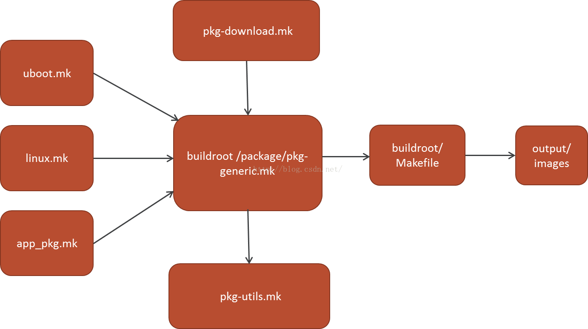

## buildroot和makefile

###  修订记录
| 修订说明 | 日期 | 作者 | 额外说明 |
| --- |
| 初版 | 2018/09/16 | 员清观 |  |

## 0 基础

cmake和automake没有什么优劣之分，存在就是合理。系统相关的，automake用的多些。Automake: 以eventhub为例，对照output/build/eventhub-1.0.0目录学习。Cmake: 以audiobox为例，对照output/build/audiobox-1.0.0目录学习。cmake相比automake, 编译快，使用简单，缺陷: cmake跟已有体系的配合并不是特别理想，比如pkgconfig

.lo文件: 使用libtool编译出的目标文件，其实就是在o文件中添加了一些信息
.la文件: 使用libtool编译出的库文件，其实是个文本文件，记录同名动态库和静态库的相关信息

automake手册
    http://www.gnu.org/software/automake/manual/html_node/index.html#SEC_Contents
陈浩 makefile：　
    http://blog.csdn.net/haoel/article/details/2886
    http://blog.csdn.net/ruglcc/article/details/7814546/
cmake参考文档:
    http://blog.csdn.net/wzzfeitian/article/details/40963457/
    https://www.cnblogs.com/ph829/p/4759124.html
    http://www.hahack.com/codes/cmake/#issuecomment-349513663
    http://sewm.pku.edu.cn/src/paradise/reference/CMake%20Practice.pdf
    http://www.cmake.org/HTML/Download.html

make参数“-s”或“--slient”则是全面禁止命令的显示。
make参数“-n”或“--just-print”，那么其只是显示命令，但不会执行命令
@echo 正在编译XXX模块...... : @显示当前执行的命令．

## 1 Automake
### 1.1 configure.ac文件
configure.ac范例一：　　http://blog.csdn.net/john_crash/article/details/50110481
编写configure.ac：　　　http://blog.csdn.net/john_crash/article/details/49889949

解析configure的过程，应该到output/build/hlibfr-1.0.0等这样的目录中查看编译过程信息。

configure.ac由一些宏组成（如果已经有源代码，你可以运行autoscan来产生一个configure.scan文件，在此基础修改成configure.ac将更加方便）

**最基本的组成**<br>
```cpp
AC_INIT([PACKAGE], [VERSION], [BUG-REPORT-ADDRESS])
AC_PREREQ([2.68])
// Checks fr programs.
// Checks fr libraries.
// Checks fr header les.
// fr typedefs, structures, and compiler characteristics.
// Checks fr library functions.
// Output les.
AC_CONFIG_FILES([FILES])
AC_OUTPUT
//configure.ac 文件要求 AC_INIT 宏必须放在开头位置，AC_OUTPUT 放在文件末，中间用来检测编译环境的各种宏没有特别的先后次序要求，由宏之间相互关系决定

//hlibfr模块中config.h文件部分定义：
// #define HAVE_MMAP 1
// #define HAVE_SYS_PARAM_H
// #define HAVE_UNISTD_H
// #define PACKAGE "hlibfr"
// #define PACKAGE_BUGREPORT "ps_bug@infotm.com"
// #define PACKAGE_NAME "hlibfr"
// #define PACKAGE_STRING "hlibfr 1.0.0"
// #define PACKAGE_TARNAME "hlibfr"
// #define PACKAGE_URL ""
// #define PACKAGE_VERSION "1.0.0"
```
- AC_INIT：autoconf 强制性初始化。告诉autoconf包名称，版本，一个bug报告email。例如： AC_INIT([eventhub], [1.0.0], [bug@infotm.com]),并且这些名称将出现在 config.h，你可以在程序中如上面定义的那样直接引用这些PACKAGE_*宏
- AC_PREREQ：这个宏用于声明本文件要求的最低autoconf版本,如：AC_PREREQ([2.68])
- AM_INIT_AUTOMAKE ：检查automake尝试Makefile时的必要的工具。例如：AM_INIT_AUTOMAKE([foreign -Wall -Werror]); 一些可选的选项： -Wall 	打开全部警告  -Werror 	将警告当错误处理    -foreign 	放宽一些GNU标准需求  -1.11.1 	需要automake的最低版本  -dist-bzip2 	在使用make dist和make distcheck期间同时创建tar.bz2存档 -tar-ustar 	使用ustar格式创建tar存档
- AC_CONFIG_SRCDIR ：一个安全的检查。FILE将是一个发布的源文件。这让configure脚本通过检查指定路径的文件确保自己运行在正确的目录中
- AC_PROG_CXX / AC_PROG_CC 编译器检测。使配置脚本搜索C编译器并使用其名称定义变量CC。Automake生成的src / Makefile.in文件使用变量CC构建hello，因此当配置从src/Makefile.in，创建src / Makefile时，它将使用它找到的值定义CC。如果要求Automake创建一个使用CC的Makefile.in，但是configure.ac没有定义它，它会建议你添加一个调用 AC_PROG_CC
- AC_CONFIG_FILES([Makefile sub/Makefile]) 根据Makefile.am和sub/Makefile.am文件产生makefile的相对路径，由于每个Makefile都需要一个Makefile.am作参数，所以该选项中Makefile的数量和路径应与当前工程中Makefile.am的状态一致。
- AC_OUTPUT([Makefile])：是一个关闭命令，实际上产生脚本的一部分，负责创建用AC_CONFIG_HEADERS和AC_CONFIG_FILES注册的文件
- PKG_CHECK_MODULES(EVENT,event == 1.0.0)

- AC_FUNC_MALLOC  AC_FUNC_MMAP # 检查malloc mmap 等函数

**源代码编译定制**<br>
可以通过config.h文件中宏定义来控制源代码级别编译：
- AC_CONFIG_HEADERS([config.h])  创建头文件的HEADER.in，HEADERS包含使用AC_DEFINE的定义，然后将从config.h.in创建config.h。configure.ac文件中，可以使用 AC_DEFINE 指令添加宏定义到config.h文件中
- AC_CHECK_HEADERS ：检查头HEADERS并且给每一个发现的头文件定义#define HAVE_HEADER_H。如：AC_CHECK_HEADERS([sys/param.h unistd.h])，两个头文件都存在，那么增加两个宏定义 ，然后在你的头文件这么使用 ： `#if HAVE_UNISTD_H -- #include <unistd.h> -- #endif`
- AC_CHECK_FUNC AC_CHECK_FUNCS ： 如AC_CHECK_FUNCS([mmap])，检查C标准库中是否存在指定的函数。 如果找到，则在config.h文件中定义预处理器宏HAVE_[function]。它生成一个测试程序，声明一个具有相同名称的函数，然后编译并链接它。更改函数名称中的几个字符（使测试失败）并检查config.log，当测试程序失败时，您将看到测试程序的源代码。假如缺失这个宏，会遇到警告。如果没发现将不会定义。但是也会有一个注释行/* #undef HAVE_MMAP */
- AC_DEFINE(VARIABLE, VALUE, DESCRIPTION) , 输出到config.h中:  #define VARIABLE VALUE
- 还可以在am文件中根据ac文件中条件变量在*_CFLAGS中增加-Dxxxx=1的宏定义

动态判决，可以提供其他操作的依据：
- AC_CHECK_HEADER(HEADER, [ACT-IF-FOUND], [ACT-IF-NOT]) 检查一个头文件，如果存在执行动作，一般是一个变量赋值，之后可以根据其值判断
- AC_CHECK_LIB(LIBRARY, FUNCT, [ACT-IF-FOUND], [ACT-IF-NOT])  用来检查库是否存在并且包括函数FUNCT。如果发现库就执行ACT-IF-FOUND，否则执行ACT-IF-NOT。例如：AC_CHECK_LIB([efence], [malloc], [EFENCELIB=-lefence]) AC_SUBST([EFENCELIB])//定义并导出变量进入Makefile。这个应该是有用的，比如speexdsp，编译了就链接它；不然就不要求链接。

**定义makefile域变量**<br>
- AC_SUBST(ERIC_DEFINITION, [VALUE])  定义一个可以被外部引用的变量(如在Makefile.am中)，格式如： `hello=nihao AC_SUBST(hello)` ，然后Makefile.am中就可以通过对它的引用来完成对某些可变因子的替换，可以使用[VALUE]赋初值
- AM_CONDITIONAL(NAME, CONDITION) 定义一个可以在makefile.am访问的条件名NAME，CONDITION将由shell解释执行，如果成功NAME将被启用。范例：只有存在bar.h文件时，定义变量： AC_CHECK_HEADER([bar.h], [use_bar=yes]) AM_CONDITIONAL([WANT_BAR], [test "$use_bar" = yes])
- AC_ARG_VAR 为代码中定义一个宏，可以初始化为任意常量(包括字符串)，而不是单纯的0/1

```cpp
//qlibvplay.mk文件中
QLIBVPLAY_CONF_OPT += logger_level=$(BR2_PACKAGE_QLIBVPLAY_LOGLEVEL)
//configure.ac文件中
AC_ARG_VAR(logger_level,"Log level 5:ERR > 4:WARN > 3:INFO > 2:DBG > 1:TRC")
//Makefile.am文件中
COMMON_CXXFLAGS += -DLOGGER_LEVEL_SET=$(logger_level)
```

**解析configure新配置项**<br>
- AC_ARG_WITH (package, help-string, [action-if-given], [action-if-not-given]) 这个宏可以给configure增加–with-package这样模式的参数。很多软件都有可选项用来打开扩展功能，AC_ARG_WITH就是干这个的。它的第一参数给出扩展包的名称，出现在–with-后面。第二个参数给出一个参数说明，用在./configure –help中。[action-if-given]如果有该选项就被执行，[action-if-not-given]如果没有加这个选项就执行。
- AC_ARG_ENABLE (feature, help-string, [action-if-given], [action-if-not-given]) 如果configure中加了给定的选项，就执行action-if-given，否则执行action-if-not-given，feature- AC_ARG_ENABLE (feature, help-string, [action-if-given], [action-if-not-given]) 如果configure中加了给定的选项，就执行action-if-given，否则执行action-if-not-given，feature

```cpp
AC_ARG_WITH([militant], [AS_HELP_STRING([--with-militant], [Enable militant API assertions])], [zmq_militant="yes"], [])
if test "x$zmq_militant" = "xyes"; then AC_DEFINE(ZMQ_ACT_MILITANT, 1, [Enable militant API assertions]) fi

AC_ARG_ENABLE([eventfd], [AS_HELP_STRING([--disable-eventfd], [disable eventfd [default=no]])], [zmq_enable_eventfd=$enableval], [zmq_enable_eventfd=yes])
if test "x$zmq_enable_eventfd" = "xyes"; then AC_CHECK_HEADERS(sys/eventfd.h, [AC_DEFINE(ZMQ_HAVE_EVENTFD, 1, [Have eventfd extension.])]) fi

AC_ARG_ENABLE([debug], [AS_HELP_STRING([--enable-debug],[output debug log (default is no)])],
    [if test "$enableval" == "yes"; then AC_DEFINE([DEBUG],[1],[Define if --enable-debug])
    else AC_DEFINE([DEBUG],[0],[Define if --disable-debug]) fi], [AC_DEFINE([DEBUG],[0],[Define if need to output debug log])])

//更简单的范例：
AC_ARG_ENABLE([debug], [AS_HELP_STRING([--enable-debug],[debug program(default is no)])], [CFLAGS="${CFLAGS} -DDEBUG -g"],[CFLAGS="-O2"])
```

**条件编译，给eventhub增加调式选项-enable-testing**<br>
_CONF_OPT的后缀将会出现在configure命令行中
```cpp
//eventhub.mk文件中：
  ifeq ($(BR2_PACKAGE_TESTING_EVENT), y)
  EVENTHUB_CONF_OPT += --enable-testing
  endif
//configure.ac文件中：
  AC_ARG_ENABLE(testing, AS_HELP_STRING([--enable-testing], [enable testing]), [set_testing="yes"], [set_testing="no"])
  AM_CONDITIONAL(EVENT_TESTING, test x$set_testing = xyes)  //定义am文件中可以使用的宏,testing是定义标记，set_testing是临时控制变量，它只能在ac文件中以AM_CONDITIONAL的方式使用
//Makefile.am文件中：
  if EVENT_TESTING
  ...
  endif
```

**编译动态库或者静态库**<br>
LT_PREREQ给出一个版本需求检查。LT_INIT可以实现一些配置，例如win32-dll允许建造动态库，disable-static默认关闭静态库的建造。默认动态库和静态库是同时打开的。 AC_PROG_LIBTOOL检查libtool脚本。做完这些在你的configure中会增加一些选项–enable-static , –enable-shared。你需要在你的configure.ac中加入下面的宏：
```cpp
LT_PREREQ([2.4.0])
LT_INIT([disable-static win32-dll dlopen])
AC_PROG_LIBTOOL
```

**不常用变量**
- AC_CONFIG_AUX_DIR(DIRECTORY) 配置辅助脚本位置，如install-sh和depcomp等。如：AC_CONFIG_AUX_DIR([build-aux])
- AC_PROG_SED, AC_PROG_YACC, AC_PROG_LEX, …   发现好的实现并且设置变量SED,YACC,$LEX等
- AC_CHECK_PROGS(VAR, PROGS, [VAL-IF-NOT-FOUND]) 将VAR定义为第一个发现的程序，如果没有发现就设置为VAL-IF-NOT-FOUND
- AC_MSG_WARN(ERROR-DESCRIPTION) 打印但是不退出
- AC_MSG_ERROR(ERROR-DESCRIPTION, [EXIT-STATUS]) 打印错误信息ERROR-DESCRIPTION并退出，EXIT-STATUS设置退出状态
- AC_PROG_AWK / AC_PROG_F77 / AC_PROG_RANLIB  编译器检测
- AC_HEADER_TIME ：这个不是必要宏，当源代码中有依赖于time.h和sys/time.h时，则定义TIME_WITH_SYS_TIME,这个宏在使用例如struct timeval和struct  tm的程序中，很有用，它最好结合HAVE_SYS_TIME_H一起使用，可以使用AC_CHECK_HEADERS检查它
- AC_PROG_RANLIB / AC_PROG_LIBTOOL 这里的意义是：当前目录时中间库使用静态库还是使用共享库，表示构建当前目录时需要生成静态库文件;对应makefile.am中的noinst_LIBRARIES=libhello.a 还是 noinst_LIBRARIES=libhello.a，注意使用的时候动态库 xxxx = -lhello

```cpp
//如果发现tar或gtar，就设置到变量$TAR中，如果没有发现就是设置为‘：’
AC_CHECK_PROGS([TAR], [tar gtar], [:])
if test "$TAR" = :; then
AC_MSG_ERROR([This package needs tar.])
fi
```

### 1.2 mk文件
cmake和autotools的mk看不出什么语法上的差别

****audiobox基于cmake**<br>**<br>
```shell
AUDIOBOX_VERSION = 1.0.0
AUDIOBOX_SOURCE =
AUDIOBOX_SITE  =

AUDIOBOX_LICENSE =
AUDIOBOX_LICENSE_FILES = README

AUDIOBOX_MAINTAINED = YES
AUDIOBOX_AUTORECONF = YES
AUDIOBOX_INSTALL_STAGING = YES
VIDEOBOX_MAKE = make -s
AUDIOBOX_DEPENDENCIES = host-pkgconf hlibfr eventhub alsa-lib hlibvcp7g hlibunitrace

//...

ifeq ($(BR2_PACKAGE_AUDIOBOX_OPTIMIZATION), y)
AUDIOBOX_CONF_OPT += -DCOMPILE_AUDIOBOX_OPTIMIZATION=yes
endif

define AUDIOBOX_POST_INSTALL_STAGING_HEADERS
	mkdir -p $(STAGING_DIR)/usr/include/qsdk
	mkdir -p $(STAGING_DIR)/usr/lib/pkgconfig
	cp -rfv $(AUDIOBOX_SRCDIR)/include/audiobox.h  $(STAGING_DIR)/usr/include/qsdk
	cp -rfv $(AUDIOBOX_SRCDIR)/audiobox.pc  $(STAGING_DIR)/usr/lib/pkgconfig/
endef

AUDIOBOX_POST_INSTALL_STAGING_HOOKS += AUDIOBOX_POST_INSTALL_STAGING_HEADERS

$(eval $(cmake-package))
```

audiobox.mk中，$(STAGING_DIR)代表./output/staging，这是一个软链接，代表临时的目标根文件系统根目录staging ->/home/yuan/work/wifi_ring/output/host/usr/arm-buildroot-linux-uclibcgnueabihf/sysroot/ ;AUDIOBOX_SRCDIR : _SRCDIR结尾表示当前模块目录。

**eventhub基于autotools**<br>
```shell
EVENTHUB_VERSION = 1.0.0
EVENTHUB_SOURCE =
EVENTHUB_SITE  =

EVENTHUB_LICENSE =
EVENTHUB_LICENSE_FILES = README

EVENTHUB_MAINTAINED = YES
EVENTHUB_AUTORECONF = YES
EVENTHUB_INSTALL_STAGING = YES
EVENTHUB_DEPENDENCIES = host-pkgconf

ifeq ($(BR2_PACKAGE_TESTING_EVENT), y)
EVENTHUB_CONF_OPT += --enable-testing
endif

define EVENTHUB_POST_INSTALL_STAGING_HEADERS
	echo "+++++++++++++++++++++++++++++++++++++++"
	mkdir -p $(STAGING_DIR)/usr/include/qsdk
	cp -rfv $(@D)/event.h  $(STAGING_DIR)/usr/include/qsdk
	cp -rfv $(@D)/qsdk/*  $(STAGING_DIR)/usr/include/qsdk
	cp -rfv $(@D)/event.pc  $(STAGING_DIR)/usr/lib/pkgconfig/
endef

EVENTHUB_POST_INSTALL_STAGING_HOOKS  += EVENTHUB_POST_INSTALL_STAGING_HEADERS

$(eval $(autotools-package))
```

### 1.3 pc文件
主要用于指定库和头文件的位置．

Pkgconfig提供了下面几个功能：
1. 检查库的版本号。如果所需要的库的版本不满足要求，它会打印出错误信息，避免链接错误版本的库文件。
2. 获得编译预处理参数，如宏定义，头文件的位置。
3. 获得链接参数，如库及依赖的其它库的位置，文件名及其它一些连接参数。
4. 自动加入所依赖的其它库的设置。

cat audiobox.pc ::
prefix=/usr
exec_prefix=/usr
libdir=${exec_prefix}/lib
includedir=${prefix}/include

Name: libaudiobox
Description: libaudiobox  infotm
Version: 1.0.0
Requires:
Libs: -L${libdir} -laudiobox -levent -lfr -lcodecs
Libs.private: -lm -ldl -lpthread -lrt
//# -I${includedir}/alsa below is just for backward compatibility
//# (it was set so mistakely in the older version)
//# Cflags:  -I${includedir}/qsdk
表示这个库如何被使用

**一个pc文件定义的例子:**<br>
Libs: -L${libdir} -lz
Cflags: -I${includedir}

$ pkg-config.exe --cflags zlib
-ID:/msys64/mingw64/include

$ pkg-config.exe --libs zlib
-LD:/msys64/mingw64/lib -lz

$gcc main.c `pkg-config --cflags --libs zlib` -o main
    其中 pkg-config --cflags --libs zlib 自动被替换为 “-ID:/msys64/mingw64/include -LD:/msys64/mingw64/lib -lz

### 1.4 am文件
Makefile.am将指明工程需要哪些源文件，建造的是什么，如何安装它们。每个必需的am文件都应该在configure.ac中使用AC_CONFIG_FILES包含其路径如src/dirb/Makefile

**makefile.am语法参考网页**<br>
  http://blog.csdn.net/john_crash/article/details/49889969

**target定义语法option_where_PRIMARY = targets …**<br>
- targets是要建造的目标;
- PRIMARY可以是下面的一个：1. PROGRAMS 可执行程序；2.LIBRARIES 静态库；3.LTLIBRARIES 动态库；4.HEADERS 头文件；5.SCRIPTS 目标是脚本
- where 表示目标被安装那里，可以是下面的值:；1.DATA 目标是数据；2.bin $(bindir)；3.lib $(libdir)；4.custom 自定义目录；5.noinst 不安装；6.check 由’make check’建造

**Makefile.am中的变量**<br>
- INCLUDES :  编译时所需头文件
- LDADD : 链接程序时所需链接的库文件
- LIBADD : 链接生成库时所需链接的库文件
- LDFLAGS : 链接时的选项
- AM_CXXFLAGS : 编译.cpp文件时的选项
- AM_CFLAGS : 编译.c文件时的选项
- CPPFLAGS 附加的预处理选项
- EXTRA_DIST : 除源代码和一些默认的文件以外，其它需要打如发布包.tar.gz中的文件
- SUBDIRS : 在处理本目录之前要递归处理的子目录，以此为基础形成树状编译结构
- top_srcdir : 工程源码的最顶层目录
- top_builddir : 工程目标文件的最顶层目录


有了以上的规则和变量，我们可以完成最基本的Makefile.am编写，但在某些情况下，我们需要定义一些变量来控制工程中某些目标的生成：比如库的版本号是不断变化的，需要定义一个变量来指代。Makefile.am可以使用宏替换来实现这种功能，可以通过以下方式来引用一个宏： @宏名@ .这个宏的的定义是在configure.in中的

**am文件中基本格式**<br>
```cpp
//可执行文件
bin_PROGRAMS = foo
//PROGRAMS知道这是一个可执行文件; foo表示编译的目标文件; bin表示目录文件被安装到系统的目录
foo_SOURCES = xxx.c xxxx.c
foo_LDADD =
foo_LDFLAGS =
foo_DEPENDENCIES =

//静态库
lib_LIBRARIES = foo.a //制定了安装到lib目录的静态库文件
foo_a_SOURCES = xxx.c xxxx.c
foo_a_LDADD =
foo_a_LIBADD =
foo_a_LDFLAGS =

//动态库
lib_LTLIBRARIES = foo.la
foo_la_SOURCES = xxx.c xxxx.c
foo_la_LDADD =
foo_la_LIBADD =
foo_la_LDFLAGS =

//需要安装的和不需要安装的头文件
include_HEADERS = foo.h
noinst_HEADERS = foo2.h //一般是只在编译过程中使用的头文件

//数据文件
data_DATA = data1 data2
```

```shell
bin_PROGRAMS = client

AUTOMAKE_OPTIONS = foreign
bin_PROGRAMS = client
client_SOURCES = key.c connect.c client.c main.c session.c hash.c
client_CPPFLAGS = -DCONFIG_DIR=\“$(sysconfdir)\” -DLIBRARY_DIR=\”$(pkglibdir)\”
client_LDFLAGS = -export-dynamic -lmemcached

noinst_HEADERS = client.h
INCLUDES = -I/usr/local/libmemcached/include/
client_LDADD = $(top_builddir)/sx/libsession.la $(top_builddir)/util/libutil.la
```

上述定义解释：
- client_SOURCES：表示生成可执行应用程序所用的源文件，这里注意，client_是由前面的bin_PROGRAMS指定的，如果前面是生成example,那么这里就是example_SOURCES，其它的类似标识也是一样。
- client_CPPFLAGS：这和Makefile文件中一样，表示C语言预处理器参数，这里指定了DCONFIG_DIR，以后在程序中，就可以直接使用CONFIG_DIR,不要把这个和另一个CFLAGS混淆，后者表示编译器参数。
- client_LDFLAGS：这个表示在连接时所需要的库文件选项标识。这个也就是对应一些如-l,-shared等选项。
- noinst_HEADERS：这个表示该头文件只是参加可执行文件的编译，而不用安装到安装目录下。如果需要安装到系统中，可以用include_HEADERS来代替。
- INCLUDES：指定连接时所需要的头文件所在路径
- client_LDADD：连接时所需要的库文件,这里表示需要两个库文件的支持，下面会看到这个库文件又是怎么用Makefile.am文件后成的。
- AM_CPPFLAGS 预定义变量，g++编译器的附加参数
- AM_CFLAGS 预定义变量，gcc编译器的附加参数
- LDADD 和上面AM_CPPFLAGS，AM_CFLAGS一样，在所有的链接时都附加此选项。不过你可以给LDADD和CPPFLAGS增加前缀，将它们限定在特定的编译和链接中。如：run_me_LDADD = ../lib/libcompat.a  run_me_CPPFLAGS = -I$(srcdir)/../lib

对于可执行文件和静态库类型，如果只想编译，不想安装到系统中，可以用 noinst_PROGRAMS 代替 bin_PROGRAMS， noinst_LIBRARIES 代替 lib_LIBRARIES

**全局变量引用和安装**<br>
可能有人注意到$(top_builddir)等全局变量（因为这个文件之前没有定义），其实这个变量是Makefile.am系统定义的一个基本路径变量，表示生成目标文件的最上层目录，如果这个Makefile.am文件被其它的Makefile.am文件递归调用，这个会表示其它的目录，而不是这个当前目录。还可以使用$(top_srcdir)，这个表示工程的最顶层目录，其实也是第一个Makefile.am的入口目录，因为Makefile.am文件可以被递归性的调用。

在系统安装时，我们都记得先配置安装路径，如./configure --prefix=/install/apache 其实在调用这个之后，就定义了一个变量`$(prefix)`,表示安装的路径，如果没有指定安装的路径，会被安装到默认的路径，一般都是/usr/local。在定义$(prefix)，还有一些预定义好的目录,其实这一些定义都可以在顶层的Makefile文件中可以看到，如下面一些值：bindir = $(prefix)/bin libdir = $(prefix)/lib datadir=$(prefix)/share sysconfdir=$(prefix)/etc includedir=$(prefix)/include

这些量还可以用于定义其它目录，例如我想将client.h安装到include/client目录下，这样写Makefile.am文件：
```cpp
clientincludedir=$(includedir)/client
clientinclude_HEADERS=$(top_srcdir)/client/client.h
//这相当于定义了一个安装类型，这种安装类型是将第二行指定的client.h文件安装到第一行指定的include/client目录下。
```

我们自己也可以定义新的安装目录下的路径，如我在应用中简单定义的：
```shell
devicedir = ${prefix}/device
device_DATA = package
```
这样的话，package文件会作为数据文件安装到device目录之下，这样一个可执行文件就定义好了。注意，这也相当于定义了一种安装类型：devicedir，所以你想怎么安装就怎么安装，后面的XXXXXdir，dir是固定不变的。


**生成静态库文件**<br>
编译静态库和编译动态库是不一样的，我们先看静态库的例子，这个比较简单。直接指定 XXXX_LTLIBRARIES或者XXXX_LIBRARIES就可以了。如果不需要安装到系统，将XXXX换成noinst就可以。还是再罗嗦一下： 一般推荐使用libtool库编译目标，因为automake包含libtool，这对于跨平台可移植的库来说，肯定是一个福音。
```shell
noinst_LTLIBRARIES = libutil.la
noinst_HEADERS = inaddr.h util.h compat.h pool.h xhash.h url.h device.h
libutil_la_SOURCES = access.c config.c datetime.c hex.c inaddr.c log.c device.c pool.c rate.c sha1.c stanza.c str.c xhash.c
libutil_la_LIBADD = @LDFLAGS@
```
第一行的noinst_LTLIBRARIES，这里要注意的是LTLIBRARIES，另外还有LIBRARIES，两个都表示库文件。前者表示libtool库，用法上基本是一样的。如果需要安装到系统中的话，用lib_LTLIBRARIES。注意：静态库编译连接时需要其它的库的话，采用XXXX_LIBADD选项，而不是前面的XXXX_LDADD。编译静态库是比较简单的，因为直接可以指定其类型。

**生成动态库文件**<br>
想要编译XXX.so文件，需要用_PROGRAMS类型，这里一个关于安装路径要注意的问题是，我们一般希望将动态库安装到lib目录下，按照前面所讨论的，只需要写成lib_PROGRAMS就可以了，因为前面的lib表示安装路径，但是automake不允许这么直接定义，可以采用下面的办法，也是将动态库安装到lib目录下.
```shell
projectlibdir=$(libdir) //新建一个目录，就是该目录就是lib目录

projectlib_PROGRAMS=project.so
project_so_SOURCES=xxx.C
project_so_LDFLAGS=-shared -fpic //GCC编译动态库的选项
```

**SUBDIRS定义**<br>
`SUBDIRS`表示在处理目录之前，要递归处理哪些子目录，这里还要注意处理的顺序。比如我的client对sessions和utils这两上目标文件有依赖，就在client之前需要处理这两个目标文件.下面例子中`EXTRA_DIST`表示将哪些文件一起打包

```shell
EXTRA_DIST = Doxyfile.in README.win32 README.protocol contrib UPGRADE

devicedir = ${prefix}/device
device_DATA = package
SUBDIRS = etc man

//am文件中支持条件编译
if USE_LIBSUBST
  SUBDIRS += subst
endif
SUBDIRS += tools io sessions util client dispatch server hash storage sms
```

**关于打包**<br>
Automake会自动的打包，自动打包的内容如下：
- 所有源文件。
- 所有的Makefile.am文件。
- configure读取的文件。
- Makefile.am中包含的文件。
- EXTRA_DIST指定的文件。
- 采用dist及nodist指定的文件，如可以将某一源文件指定为不打包： nodist_client_SOURCES = client.c

AC_CONFIG_FILES([Makefile lib/Makefile src/Makefile src/dira/Makefile src/dirb/Makefile])  //需要添加配置makefile.am
 Makefile.am 中 需要递归增加子目录： SUBDIRS=lib src  src/Makefile.am ： SUBDIRS = dira dirb

**noinst_LIBRARIES创建中间库**<br>
你可以使用noinst_LIBRARIES创建一个不安装的库，该库仅用在随后的链接中。如：lib/Makefile.am
    noinst_LIBRARIES = libcompat.a
    libcompat_a_SOURCES = xalloc.c xalloc.h
另一个要编译的程序使用这个库。如：src/Makefile.am
    LDADD = ../lib/libcompat.a           //LDADD在所有的链接时都附加该选项。
    AM_CPPFLAGS = -I$(srcdir)/../lib     //AM_CFFLAGS在所有的编译中使用附加的预处理选项
    bin_PROGRAMS = foo run-me
    foo_SOURCES = foo.c foo.h print.c print.h
    run_me_SOURCES = run.c run.h print.c
你可以给LDADD和CFFLAGS增加前缀，将它们限定在特定的编译和链接中。如：
    run_me_LDADD = ../lib/libcompat.a
    run_me_CPPFLAGS = -I$(srcdir)/../lib

假设foo是一个程序或者库：
  foo_CFLAGS 	  为foo附加编译选项
  foo_CPPFLAGS 	为foo附加预处理选项（-Is and -Ds）
  foo_LDADD 	  为foo链接附加库，-ls 和 -Ls (foo必须是一个程序)
  foo_LIBADD 	  为foo链接附加库，-ls 和 -Ls (foo必须是一个库)
  foo_LDFLAGS 	为foo链接选项

通过使用AC_CHECK_LIB可以判断库是否存在，并在这里附加它们。例如：
  configure.ac文件中：
      AC_CHECK_LIB([efence], [malloc], [EFENCELIB=-lefence])
      AC_SUBST([EFENCELIB])
  .am文件中
      run_me_LDADD = ../lib/libcompat.a $(EFENCELIB)

## 2 CMake机制

存在就是合理，没有什么优劣之分。系统相关的，automake用的多些。 Automake: 以eventhub为例，对照output/build/eventhub-1.0.0目录学习。Cmake: 以audiobox为例，对照output/build/audiobox-1.0.0目录学习。

https://blog.csdn.net/z_h_s/article/details/50699905
automake手册：　http://www.gnu.org/software/automake/manual/html_node/index.html#SEC_Contents
陈浩 makefile　基础文档：　 http://blog.csdn.net/haoel/article/details/2886     http://blog.csdn.net/ruglcc/article/details/7814546/

make参数“-s”或“--slient”则是全面禁止命令的显示。
make参数“-n”或“--just-print”，那么其只是显示命令，但不会执行命令
@echo 正在编译XXX模块...... : @显示当前执行的命令．


在CMakeLists.txt中增加：link_libraries(GL)　解决问题

set(CMAKE_EXE_LINKER_FLAGS "-export-dynamic -lclang `pkg-config --libs gtk+-2.0 gdl-1.0 scintilla`")
set(CMAKE_EXE_LINKER_FLAGS "${CMAKE_EXE_LINKER_FLAGS} -static-libgcc -static-libstdc++")

**将其他平台的项目迁移到 CMake**<br>
CMake 可以很轻松地构建出在适合各个平台执行的工程环境。而如果当前的工程环境不是 CMake ，而是基于某个特定的平台，是否可以迁移到 CMake
 呢？答案是可能的。下面针对几个常用的平台，列出了它们对应的迁移方案。
- autotools am2cmake 可以将 autotools 系的项目转换到 CMake，这个工具的一个成功案例是 KDE 。
- Alternative Automake2CMake 可以转换使用 automake 的 KDevelop 工程项目。
- Converting autoconf tests
- qmake converter 可以转换使用 QT 的 qmake 的工程。
- CMakeLists.txt 自动推导  gencmake 根据现有文件推导 CMakeLists.txt 文件。
- CMakeListGenerator 应用一套文件和目录分析创建出完整的 CMakeLists.txt 文件。仅支持 Win32 平台。

**cmake调用环境变量的方式**
使用$ENV{NAME}指令就可以调用系统的环境变量了。比如MESSAGE(STATUS "HOME dir: $ENV{HOME}")设置环境变量的方式是SET(ENV{变量名} 值)
- CMAKE_INCLUDE_CURRENT_DIR   自动添加CMAKE_CURRENT_BINARY_DIR和CMAKE_CURRENT_SOURCE_DIR到当前处理的CMakeLists.txt，相当于在每个CMakeLists.txt加入：INCLUDE_DIRECTORIES(${CMAKE_CURRENT_BINARY_DIR} ${CMAKE_CURRENT_SOURCE_DIR})
- CMAKE_INCLUDE_DIRECTORIES_PROJECT_BEFORE   将工程提供的头文件目录始终置于系统头文件目录的前面,当定义的头文件确实跟系统发生冲突时可以提供一些帮助。
- CMAKE_INCLUDE_PATH 和 CMAKE_LIBRARY_PATH 环境变量,非cmake变量


**简单的项目:**<br>
```cpp
  //cat ./system/app-demos/uvc/001/CMakeLists.txt
project(deom_uvc002)
cmake_minimum_required(VERSION 2.8)

include(FindPkgConfig)

set(CMAKE_VERBOSE_MAKEFILE on)
set(CMAKE_CXX_FLAGS "-std=c++11 -Wall -Werror -Wl,--as-needed")

if (COMPILE_AUDIOBOX_WITH_DSPLIB STREQUAL "yes")
  add_definitions(-DAEC_DSP_SUPPORT)
endif ()

if (COMPILE_AUDIOBOX_OPTIMIZATION STREQUAL "yes")
    set(CMAKE_EXE_LINKER_FLAGS "${CMAKE_EXE_LINKER_FLAGS} -static-libgcc -static-libstdc++")
endif()

OPTION(COMPILE_FFPHOTO_SWSCALE "Enable ffphoto swscale" "no") //编译过程中手工选择控制
if (COMPILE_IPU_FFPHOTO STREQUAL "yes")
endif()

pkg_check_modules(LIBVIDEOBOX REQUIRED videobox)
pkg_check_modules(HLIBGUVC REQUIRED hlibguvc)
include_directories(./ ${LIBVIDEOBOX_INCLUDE_DIRS}) //添加头文件路径
link_libraries("D:/OSGEARTH/lib")   //添加库路径，仅对它后面的起作用
link_libraries(${HLIBGUVC_LIBRARIES})
link_libraries(pthread)

add_executable(demo_uvc_001 demo_main.c)

install(TARGETS demo_uvc_001 DESTINATION bin)
```

**条件编译**
```cpp
if(expression)
  COMMAND1(ARGS ...)
elseif(expression2)
  COMMAND1(ARGS ...)
else(expression)
  COMMAND2(ARGS ...)
endif(expression)

//expression有多种表达方式: 布尔比较，字符串比较，数值比较，复合表达式等。 数字比较LESS、GREATER、EQUAL，字串比STRLESS、STRGREATER、STREQUAL
if(${var} STREQUAL "ON")
elseif(${var} STREQUAL "OFF")
endif()
//但是需要注意的是在这个时候，你的脚本已经假设你对于var已经有了 已被定义的默认要求 ！如果没有定义，脚本会报错退出。那有没有解决方法给个默认值呢？有！option(address "This is a default option for var" ON) 这样就对var设置了默认值，即使命令行没有定义var，脚本里面也有默认值ON。用户若想更改，就在命令行显示定义： cmake -Dvar=OFF . 但是在脚本中，这个var是在option之后才会被认为定义，在此之前依然是未定义的！
```

### 2.2 内部变量
- CMAKE_C_COMPILER ：指定C编译器
- CMAKE_CXX_COMPILER ：
- CMAKE_C_FLAGS CMAKE_CXX_FLAGS：编译C C++文件时的选项，如-g；也可以通过add_definitions添加编译选项
- EXECUTABLE_OUTPUT_PATH ：可以指定可执行文件的存放路径， set(EXECUTABLE_OUTPUT_PATH <your_specified_path>)
- LIBRARY_OUTPUT_PATH ：可以指定目标库文件路径， set(LIBRARY_OUTPUT_PATH <your_specified_path>)
- CMAKE_BUILD_TYPE :：build 类型(Debug, Release, ...)，CMAKE_BUILD_TYPE=Debug
- BUILD_SHARED_LIBS ： 这个开关用来控制默认的库编译方式。如果不进行设置，使用ADD_LIBRARY并没有指定库类型的情况下，默认编译生成的库都是静态库；如果SET(BUILD_SHARED_LIBSON)后,默认生成的为动态库。如cmake -DBUILD_SHARED_LIBS=OFF
-　CMAKE_BINARY_DIR　PROJECT_BINARY_DIR　< projectname >_BINARY_DIR　这三个变量指代的内容是一致的，如果是in-source编译，指得就是工程顶层目录；如果是out-of-source编译，指的是工程编译发生的目录。PROJECT_BINARY_DIR跟其它指令稍有区别，目前可以认为它们是一致的。
- CMAKE_SOURCE_DIR　PROJECT_SOURCE_DIR　< projectname >_SOURCE_DIR　这三个变量指代的内容是一致的，不论采用何种编译方式，都是工程顶层目录。也就是在in-source编译时,他跟CMAKE_BINARY_DIR等变量一致。PROJECT_SOURCE_DIR跟其它指令稍有区别,目前可以认为它们是一致的。　（out-of-source build与in-source build相对，指是否在CMakeLists.txt所在目录进行编译。）
- CMAKE_CURRENT_SOURCE_DIR　当前处理的CMakeLists.txt所在的路径，比如上面我们提到的src子目录。
- CMAKE_CURRENT_BINARY_DIR　target编译目录， 如果是in-source编译，它跟CMAKE_CURRENT_SOURCE_DIR一致；如果是out-of-source编译，指的是target编译目录。使用ADD_SUBDIRECTORY(src bin)可以更改这个变量的值。使用SET(EXECUTABLE_OUTPUT_PATH <新路径>)并不会对这个变量造成影响,它仅仅修改了最终目标文件存放的路径。
- CMAKE_CURRENT_LIST_FILE　输出调用这个变量的CMakeLists.txt的完整路径
- CMAKE_CURRENT_LIST_LINE　输出这个变量所在的行　
- CMAKE_MODULE_PATH　这个变量用来定义自己的cmake模块所在的路径。如果工程比较复杂，有可能会自己编写一些cmake模块，这些cmake模块是随工程发布的，为了让cmake在处理CMakeLists.txt时找到这些模块，你需要通过SET指令将cmake模块路径设置一下。比如SET(CMAKE_MODULE_PATH,${PROJECT_SOURCE_DIR}/cmake)这时候就可以通过INCLUDE指令来调用自己的模块了。
- EXECUTABLE_OUTPUT_PATH　　新定义最终结果的存放目录
- LIBRARY_OUTPUT_PATH　新定义最终结果的存放目录
- PROJECT_NAME　返回通过PROJECT指令定义的项目名称。

**内置变量的使用**
- 在CMakeLists.txt中指定，使用selink_librariest
- cmake命令中使用，如cmake -DBUILD_SHARED_LIBS=OFF

### 2.3 cmake内部命令和语句
- project (HELLO)   #指定项目名称，生成的VC项目的名称；使用${HELLO_SOURCE_DIR}表示项目根目录
- 相对路径指定 >> ${projectname_SOURCE_DIR}表示根源文件目录，${ projectname _BINARY_DIR}表示根二进制文件目录？
- include_directories：指定头文件的搜索路径，相当于指定gcc的-I参数>> include_directories (${HELLO_SOURCE_DIR}/Hello)  #增加Hello为include目录
- link_directories：动态链接库或静态链接库的搜索路径，相当于gcc的-L参数 >> link_directories (${HELLO_BINARY_DIR}/Hello)     #增加Hello为link目录
- add_subdirectory：包含子目录     >> add_subdirectory (Hello)
- add_executable：编译可执行程序，指定编译，好像也可以添加.o文件 >> add_executable (helloDemo demo.cxx demo_b.cxx)   #将cxx编译成可执行文件——
- add_definitions：添加编译参数 >> add_definitions(-DDEBUG)将在gcc命令行添加DEBUG宏定义； >> add_definitions( “-Wall -ansi –pedantic –g”)
- add_dependencies  添加编译依赖项, 用于确保编译目标项目前依赖项必须先构建好
- target_link_libraries：添加链接库,相同于指定-l参数 >> target_link_libraries(demo Hello) #将可执行文件与Hello连接成最终文件demo
- add_library: >> add_library(Hello hello.cxx)  #将hello.cxx编译成静态库如libHello.a
- add_custom_target:
- message( status|fatal_error, “message”):
- set_target_properties( ... ): lots of properties... OUTPUT_NAME, VERSION, ....
- link_libraries( lib1 lib2 ...): All targets link with the same set of libs

- 注释的语法：在CMake中注释使用#字符开始到此行结束；内部命令不区分大小写
- 变量：使用set命令显式定义及赋值，在非if语句中，使用${}引用，if中直接使用变量名引用；后续的set命令会清理变量原来的值
- command (args ...)  #命令不分大小写，参数使用空格分隔，使用双引号引起参数中空格
- set(var a;b;c) <=> set(var a b c)  #定义变量var并赋值为a;b;c这样一个string list
- Add_executable(${var}) <=> Add_executable(a b c)   #变量使用${xxx}引用
- 条件语句： if(var) … else()/elseif() … endif(var)
- WHILE() … ENDWHILE()
- 要显示执行构建过程中详细的信息(比如为了得到更详细的出错信息)，可以: 1. 在CMakeList.txt内加入： SET( CMAKE_VERBOSE_MAKEFILE on ); 2. make VERBOSE=1


**INSTALL指令**<br>
FIND_系列指令主要包含一下指令:
- FIND_FILE(<VAR>name1 path1 path2 …)    VAR变量代表找到的文件全路径,包含文件名
- FIND_LIBRARY(<VAR>name1 path1 path2 …)    VAR变量表示找到的库全路径,包含库文件名
- FIND_PATH(<VAR>name1 path1 path2 …)   VAR变量代表包含这个文件的路径
- FIND_PROGRAM(<VAR>name1 path1 path2 …)   VAR变量代表包含这个程序的全路径
- FIND_PACKAGE(<name>[major.minor] [QUIET] [NO_MODULE] [[REQUIRED|COMPONENTS][componets...]])   用来调用预定义在CMAKE_MODULE_PATH下的Find<name>.cmake模块，也可以自己定义Find<name>模块，通过SET(CMAKE_MODULE_PATH dir)将其放入工程的某个目录中供工程使用，后面会详细介绍FIND_PACKAGE的使用方法和Find模块的编写。

**FILE指令**<br>
文件操作指令，基本语法为:
- FILE(WRITEfilename "message to write"... )
- FILE(APPENDfilename "message to write"... )
- FILE(READfilename variable)
- FILE(GLOBvariable [RELATIVE path] [globbing expression_r_rs]...)
- FILE(GLOB_RECURSEvariable [RELATIVE path] [globbing expression_r_rs]...)
- FILE(REMOVE[directory]...)
- FILE(REMOVE_RECURSE[directory]...)
- FILE(MAKE_DIRECTORY[directory]...)
- FILE(RELATIVE_PATHvariable directory file)
- FILE(TO_CMAKE_PATHpath result)
- FILE(TO_NATIVE_PATHpath result)

**EXEC_PROGRAM**
在CMakeLists.txt处理过程中执行命令，并不会在生成的Makefile中执行。具体语法为: EXEC_PROGRAM(Executable [directory in which to run] [ARGS <arguments to executable>] [OUTPUT_VARIABLE <var>] [RETURN_VALUE <var>])。用于在指定的目录运行某个程序，通过ARGS添加参数，如果要获取输出和返回值，可通过OUTPUT_VARIABLE和RETURN_VALUE分别定义两个变量。这个指令可以帮助在CMakeLists.txt处理过程中支持任何命令，比如根据系统情况去修改代码文件等等。举个简单的例子，我们要在src目录执行ls命令，并把结果和返回值存下来，可以直接在src/CMakeLists.txt中添加：
```cpp
EXEC_PROGRAM(ls ARGS "*.c" OUTPUT_VARIABLE LS_OUTPUT RETURN_VALUE LS_RVALUE)
IF(not LS_RVALUE)
    MESSAGE(STATUS "ls result: " ${LS_OUTPUT})
ENDIF(not LS_RVALUE)
```
在cmake生成Makefile过程中，就会执行ls命令，如果返回0，则说明成功执行，那么就输出ls *.c的结果。关于IF语句，后面的控制指令会提到。

### 2.4 循环语句

**foreach语句**
```cpp
AUX_SOURCE_DIRECTORY(.SRC_LIST)
FOREACH(F ${SRC_LIST})
    MESSAGE(${F})
ENDFOREACH(F)

Set(VAR a b c)
Foreach(f ${VAR})
...
Endforeach(f)

FOREACH(VARRANGE 10) //0 ~ 10
    MESSAGE(${VAR})
ENDFOREACH(VAR)

//带range的foreach:  FOREACH(loop_var RANGE start stop [step])　...　ENDFOREACH(loop_var)，从start开始到stop结束，以step为步进
FOREACH(A RANGE 5 15 3)
    MESSAGE(${A})
ENDFOREACH(A)
```

**while语句**
```cpp
WHILE(condition)
    COMMAND1(ARGS…)
    COMMAND2(ARGS…)
    …
ENDWHILE(condition)
```

## 3 configure选项
可以在.mk文件中设置选项，应该会替换缺省的吧，需要验证一下。
- 增加-V，是否可以强制显示编译过程
-

## 4 Makefile规则
### 4.1 kbuild
kernel目录下Kconfig文件： `source "arch/$SRCARCH/Kconfig"`，直接索引了 `arch/arm/Kconfig`文件，这个文件描述了linux-menuconfig的主体框架。

### 4.1 基本规则
**自动化变量**<br>
- $@ 表示规则中的目标文件集。在模式规则中，如果有多个目标，那么，"$@"就是匹配于目标中模式定义的集合。
- $% 仅当目标是函数库文件中，表示规则中的目标成员名。例如，如果一个目标是"foo.a(bar.o)"，那么，"$%"就是"bar.o"，"$@"就是"foo.a"。如果目标不是函数库文件（Unix下是[.a]，Windows下是[.lib]），那么，其值为空。
- $< 依赖目标中的第一个目标名字。如果依赖目标是以模式（即"%"）定义的，那么"$<"将是符合模式的一系列的文件集。注意，其是一个一个取出来的。在规则中使用：gcc -o $@ -c $<
- $? 所有比目标新的依赖目标的集合。以空格分隔。
- $^ 所有的依赖目标的集合。以空格分隔。如果目标是静态库文件名，它所代表的只能是所有库成员（.o文件）名。如果在依赖目标中有多个重复的，那个这个变量会去除重复的依赖目标，只保留一份。 gcc -o $@  $^
- $+ 这个变量很像"$^"，也是所有依赖目标的集合。只是它不去除重复的依赖目标。
- $* 这个变量表示目标模式中"%"及其之前的部分。如果目标是"dir/a.foo.b"，并且目标的模式是"a.%.b"，那么，"$*"的值就是"dir/a.foo"。这个变量对于构造有关联的文件名是比较有较。如果目标中没有模式的定义，那么"$*"也就不能被推导出，但是，如果目标文件的后缀是make所识别的，那么"$*"就是除了后缀的那一部分。例如：如果目标是"foo.c"，因为".c"是make所能识别的后缀名，所以，"$*"的值就是"foo"。这个特性是GNU make的，很有可能不兼容于其它版本的make，所以，你应该尽量避免使用"$*"，除非是在隐含规则或是静态模式中。如果目标中的后缀是make所不能识别的，那么"$*"就是空值。
- $(@D) 代表目标文件的目录部分（去掉目录部分的最后一个斜杠）。如果“$@”是“dir/foo.o”，那么“$(@D)”的值为“dir”。如果“$@”不存在斜杠，其值就是“.”（当前目录）。注意它和函数“dir”的区别！
- $(@F) 目标文件的完整文件名中除目录以外的部分（实际文件名）。如果“$@”为“dir/foo.o”，那么“$(@F)”只就是“foo.o”。“$(@F)”等价于函数“$(notdir $@)”。
- $(%D) $(%F) 当以如“archive(member)”形式静态库为目标时，分别表示库文件成员“member”名中的目录部分和文件名部分。它仅对这种形式的规则目标有效。
- $(<D) $(<F) 分别表示规则中第一个依赖文件的目录部分和文件名部分。
- $(^D) $(^F) 分别表示所有依赖文件的目录部分和文件部分（不存在同一文件）
- $(+D) $(+F) 分别表示所有依赖文件的目录部分和文件部分（可存在重复文件）
- $(?D) $(?F) 分别表示被更新的依赖文件的目录部分和文件部分。
- 通配符%  %.cc表示工程里的.cc文件
- 变量替换

```cpp
OBJS = kang.o yul.o
CC = gcc
CFLAGS =-Wall -O -g
david : $ (OBJS)
$(CC) $^ -o $@
kang.o : kang.c kang.h
$(CC) $(CFLAGS) -c $< -o $@
yul.o : yul.c yul.h

$(CC) $(CFLAGS) -c $< -o $@
```

**赋值**<br>
 = 当它的右边赋值是变量时，这个变量的定义在本条语句之前或之后都可以，即可以递归展开。
:= 它右边赋得值如果是变量，只能使用在这条语句之前定义好的，而不能使用本条语句之后定义的变量，即不可以递归展开。
?= 该符号左边的变量，如果在本条语句之前没有定义过，则执行本语句，如果已经定义，那么本语句什么都不做。
+= 是添加等号后面的值

**变量替换**<br>
$(VAR:A=B)  同${VAR:A=B}
${VAR:A=B} 替换变量“VAR”中所有“A”字符结尾的字为“B”结尾的字。“结尾”的含义是空格之前（变量值的多个字以空格分开）

**关键字/命令**<br>
- include 在Makefile使用include关键字可以把别的Makefile包含进来，这很像C语言的#include，被包含的文件会原模原样的放在当前文件的包含位置
- -include 其表示，无论include过程中出现什么错误，都不要报错继续执行。和其它版本make兼容的相关命令是sinclude，其作用和这一个是一样的。
- sinclude 同上
- basename 取变量的前缀部分

```cpp
//1
SOURCE = $(wildcard ${SRC}/*.c)
OBJECT = $(patsubst %.c,${OBJ}/%.o,$(notdir ${SOURCE}))

//2
src_cc = $(shell find ./aec -iname "*.cc" ! -name "*unittest*.cc" ! -name "*mips.cc")
obj = $(src_cc:%.cc=%.o)

//patsubst 这是匹配替换函数， patsubst（需要匹配的文件样式，匹配替换成什么文件，需要匹配的源文件）函数。比如：用src下的*.c替换成对应的 *.o文件存放到obj中：$(patsubst  %.c, ${OBJ}/%.o, $(notdir $(SOURCE))); notdir 这是去除路径函数，在上面patsubst函数中已经使用过，去除SOURCE中文件的所有目录，只留下文件名

```

```cpp
//FOO ?= bar //如果FOO没有被定义过，那么变量FOO的值就是“bar”，如果FOO先前被定义过，那么这条语将什么也不做，其等价于：
//    ifeq ($(origin FOO), undefined)
//      FOO = bar
//    endif

TOPDIR =$(shell pwd)  //取得当前路径：
cd /home/hchen; pwd　　//中间的;表示，后者在前者之后执行，而不能并行执行．
```


下面是对于上面的七个变量分别加上"D"或是"F"的含义：
$(@D) 表示"$@"的目录部分（不以斜杠作为结尾），如果"$@"值是"dir/foo.o"，那么"$(@D)"就是"dir"，而如果"$@"中没有包含斜杠的话，其值就是"."（当前目录）。

## 5.buildtoot
权威官方文档： https://buildroot.org/downloads/manual/manual.html#writing-rules-config-in

关注 .config 和 include/generated/autoconf.h 文件，这是自动产生的配置文件，之后看看如何拓展应用

output目录的介绍：
- product, 当前product的拷贝
- host目录：存放交叉编译器，如果指定是外部编译器，会把外部编译器拷贝到此处。buildroot编译生成的也是存放在此。~/work/ipc_dev/output/host/usr为交叉工具，可以在host上查询控制目标板上软件
- images目录：存放根文件系统的打包好的各个格式，比如：ext，yaffs等…..
- target目录：编译出来的根文件系统存放的路径（也就是待会生成根文件系统的路径，用nfs挂载即可）
- root   制作升级用分的rootfs
- system 制作rootfs的，里面放着Linux系统基本的目录结构，以及各种编译好的应用库和bin可执行文件。

$(TOPDIR) 当前project根目录
$(CONFIG_DIR)
    ./output/build/linux-local/include/config/defconfig
$(BASE_DIR)
    ./output，不确定
$(ARCH)
哪里定义的




**常用make选项**

```cpp
//一封邮件：
先参考一个典型的烧录脚本burn.ixl内容：
    //#images:
    i run 0x08000200 0x08000000 ../../output/images/uboot0.isi
    r flash 0x0  ../../output/images/uboot0.isi
    r flash 0x1  ../../output/images/items.itm
    r flash 0x2  ../../output/images/ramdisk.img
    r flash 0x3  ../../output/images/uImage
    r flash 0x5  ../../output/images/rootfs.squashfs

其中，rootfs.squashfs基于output/system生成，它包含完整的最终商用的rootfs；ramdisk.img基于output/root生成，它只包含烧录相关的内容，主要是busybox、mkfs utilities、upgrade程序以及所有的依赖库。烧录卡基于此burn.ixl脚本制作。从烧录卡启动时，内核加载ramdisk.img对应的根文件系统，执行其upgrade程序完成烧录uImage和rootfs.squashfs，然后拔出烧录卡，重启，完成烧录过程。

output/root和output/system生成的根文件系统都是只读的，如果需要产生一个可读写的文件系统，应该通过配置items.itm实现。例如，"part7 config.512.fs.jffs2"将会增加一个新的512k大小的jffs2分区，具体操作请参考items文档。

如果需要配置最终rootfs采用squashfs文件系统，首先通过"make menuconfig"，开启"Filesystem images"-->"squashfs target filesystem"，这样make的时候就会在output/images目录产生rootfs.squashfs，并确认burn.ixl文件中配置了"r flash 0x5  ../../output/images/rootfs.squashfs"，然后制作烧录卡即可。
```

### 5.1 基础

在package/Config.in文件中添加config: `source "package/helloworld/Config.in"`
```cpp
config BR2_PACKAGE_HELLOWORLD
    bool "helloworld"
    help
      This is a demo to add local app.
```

**helloworld.mk文件：**
```cpp
//helloworld模块的mk文件
HELLOWORLD_VERSION:= 1.0.0
HELLOWORLD_SITE:= /home/userpc/Downloads/helloworld/
HELLOWORLD_SITE_METHOD:=local
HELLOWORLD_INSTALL_TARGET:=YES

define HELLOWORLD_BUILD_CMDS
        $(MAKE) CC="$(TARGET_CC)" LD="$(TARGET_LD)" -C $(@D) all
endef

define HELLOWORLD_INSTALL_TARGET_CMDS
        $(INSTALL) -D -m 0755 $(@D)/helloworld $(TARGET_DIR)/bin
endef

define HELLOWORLD_PERMISSIONS
       /bin/helloworld f 4755 0 0 - - - - -
endef

$(eval $(generic-package))
```

_BUILD_CMDS结尾的变量会在buildroot框架编译的时候执行，用于给源码的Makefile传递编译选项和链接选项，调用源码的Makefile。 _INSTALL_TARGET_CMDS结尾的变量是在编译完之后，自动安装执行，一般是让buildroot把编译出来的的bin或lib拷贝到指定目录。 $(eval$(generic-package)) 最核心的就是这个东西了，一定不能够漏了，不然源码不会被编译，这个函数就是把整个.mk构建脚本，通过Buildroot框架的方式，展开到Buildroot/目录下的Makfile中，生成的构建目标(构建目标是什么，还记得Makefile中的定义吗？)。

**自动重新编译指定模块**<br>
buildroot在编译之前会根据.config 文件来检查output/build/package 的6个文件，想要从新执行哪一步，就把对应的.stamp_文件删除就行：
- .stamp_configured,  此文件表示已经配置过
- .stamp_downloaded, 此文件表示源码已经下载过，没有此文件会重新下载
- .stamp_patched, 此文件表示已经打过补丁
- .stamp_extracted  此文件表示已经压过
- .stamp_builted 此文件表示源码已经编译过，这个是最常用的吧
- .stamp_target_installed  此文件表示软件已经安装过

能否控制在修改了config之后自动重新编译指定模块呢？

**gdb多线程支持：**<br>
- make menuconfig
- toolchain中使能多线程gdb
- 改变toolchain,使用4.7.3_old
- ncurse.h 找不到，直接打开.config配置文件，禁止 ncurses，编译继续。

**基本分支：**
- Target options : 目标（也就是制作出来的工具给什么平台使用）
- Build options ：配置（也就是buildroot一些配置项，比如下载的文件放在哪里，编译生成的文件放在哪里等）
- Toolchain：编译器（可以配置生成交叉编译器或者引用已有的交叉编译），如果是配置生成交叉编译器则按照Target options生成对应的编译器。
- System configuration：系统配置（其实就是是否配置制作根文件系统）
- Kernel：存放Linux内核和Linux内核的配置
- Target packages：目标包，简单来说就是里面可以配置生成根文件系统的busybox和其他的一些第三方库，比如：是否支持qt、mplayer等。

**配置重要路径的build选项**<br>
- QSDK Options->App->Busybox lite -- ( ${TOPDIR}/output/product/configs/bblite_defconfig )
- Bootloader->Local source -- ( ${TOPDIR}/bootloader/apollo3 )
- Filesystem image->INITRD overlay directories -- ( ${TOPDIR}/output/product/root )
- Target packages->Busybox version -- ( ${TOPDIR}/output/product/configs/busybox_defconfig )
- Kernel->Configuration file path -- ( ${TOPDIR}/output/product/configs/linux_defconfig )
- Kernel->Local path of linux source -- ( ${TOPDIR}/kernel )
- System Configuration->Path to the permission tables -- ( ${TOPDIR}/output/product/device_table.txt )
- System Configuration->Path to the permission tables -- ( ${TOPDIR}/buildroot/system/ramdisk_device_table.txt )
- System Configuration->Root filesystem overlay directories -- ( $(TOPDIR)/output/product/system )，所以可以把自己特定编译的程序和数据放到这里，自动加载到rootfs中，当然，另外一个办法是tools增加一个新的目录保存新的内容，制作启动卡时拷贝进去就好了。
- System Configuration->Custom scripts to run before creating filesystem images -- ( ${TOPDIR}/tools/prepare-script.sh )
- System Configuration->Custom scripts to run after creating filesystem images -- ( ${TOPDIR}/tools/post-scripts.sh )
- Toolchain->Toolchain path -- ( ${TOPDIR}/buildroot/prebuilts/uclibc-4.7.3 )
- Toolchain->Toolchain prefix -- ( $(ARCH)-buildroot-linux-uclibcgnueabihf )
- Build options->Location to save buildroot config -- ( $(CONFIG_DIR)/defconfig )
- Build options->Download dir -- ( $(TOPDIR)/buildroot/download )
- Build options->Compiler cache location -- ( $(TOPDIR)/.ccache )
- Build options->Host dir -- ( $(BASE_DIR)/host )
- Build options->location of a package override file -- ( $(TOPDIR)/local.mk )

### 5.2 menuconfig语法

**config语句**
```cpp
config BR2_PACKAGE_HLIBVCP7G
  bool  "ENABLE PACKAGE HLIBVCP7G"
  default n
  depends on ...
  select ...
  range A B //表示当前值不小于A，不大于B
  help
    ...

//实际使用中，好像select和depend on针对同一个模块

//config的类型有5种，分别是bool(y/n)，tristate(y/m/n)，string(字符串)，hex(十六进 制)，integer(整数)。其中，需要特别介绍一下bool和tristate，bool只能表示选中和不选，而tristate还可以配置成模块 (m)，特别对于驱动程序的开发非常有用
//
```

**menuconfig语句**
```cpp
menuconfig MODULES
  bool "Enable loadable module support"config
  if MODULES
  xx
  endif
```

**choise语句**
```cpp
//choice的范例，无法使能的选项，使用comment来标示依赖关系
choice
    prompt "Chose AEC algorithm"
    default BR2_PACKAGE_HLIBVCP7G_NO_SUPPORT

    config BR2_PACKAGE_HLIBVCP7G_NO_SUPPORT
        bool "none"
        default n

    config BR2_PACKAGE_HLIBVCP7G_ARM_SUPPORT
        bool "enable arm-lib support"
        default n
        help
            say y if you want to use ARM library for AEC

    config BR2_PACKAGE_HLIBVCP7G_DSP_SUPPORT
        bool "enable dsp-lib support"
        depends on BR2_PACKAGE_HLIBDSP_AEC
        default n
        help
            say y if you want to use DSP library for AEC

    comment "dsp-lib Not selectable"
        depends on !BR2_PACKAGE_HLIBDSP_AEC
    comment "----depend on BR2_PACKAGE_HLIBDSP_AEC"
        depends on !BR2_PACKAGE_HLIBDSP_AEC
endchoice
```
