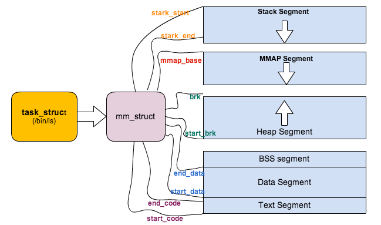

## 进程与调度管理

###  修订记录
| 修订说明 | 日期 | 作者 | 额外说明 |
| --- |
| 初版 | 2018/04/26 | 员清观 |  |


**参考索引**<br>
https://blog.csdn.net/npy_lp/article/category/1209083
**wowo**<br>
http://www.wowotech.net/sort/process_management/page/2

**进程调优**
https://blog.csdn.net/ljianhui/article/details/46718835

## 1 task_struct 定义

`task_struct`结构体内容不会全部在这个小节中描述，成员变量和功能定义在单独的小节中绑定
https://blog.csdn.net/gatieme/article/details/51872618
https://blog.csdn.net/sailor_8318/article/details/2460177


```cpp
struct task_struct {
	volatile long state;	/* -1 unrunnable, 0 runnable, >0 stopped */
	int exit_state; 	//#define EXIT_DEAD 16		//#define EXIT_ZOMBIE 32
	pid_t pid, tgid; //在CONFIG_BASE_SMALL配置为0的情况下，PID的取值范围是0到32767，即系统中的进程数最大为32768个
	int exit_code, exit_signal;
	void *stack;
	atomic_t usage;
	unsigned int flags;	/* per process flags, defined below */
	unsigned int ptrace;
	...
	char comm[TASK_COMM_LEN]; //程序名称
	int link_count, total_link_count;
	struct fs_struct *fs;    //fs用来表示进程与文件系统的联系，包括当前目录和根目录
	struct files_struct *files; //opened file information
	...
	struct list_head tasks;
};

```
**state状态定义**

state域能够取5个互为排斥的值（通俗一点就是这五个值任意两个不能一起使用，只能单独使用）。系统中的每个进程都必然处于以上所列进程状态中的一种。

| 状态 | 描述 |
| --- |
| TASK_RUNNING | 表示进程要么正在执行，要么正要准备执行（已经就绪），正在等待cpu时间片的调度 |
| TASK_INTERRUPTIBLE | 进程因为等待一些条件而被挂起（阻塞）而所处的状态。这些条件主要包括：硬中断、资源、一些信号……，一旦等待的条件成立，进程就会从该状态（阻塞）迅速转化成为就绪状态TASK_RUNNING |
| TASK_UNINTERRUPTIBLE | 意义与TASK_INTERRUPTIBLE类似，除了不能通过接受一个信号来唤醒以外，对于处于TASK_UNINTERRUPIBLE状态的进程，哪怕我们传递一个信号或者有一个外部中断都不能唤醒他们。只有它所等待的资源可用的时候，他才会被唤醒。这个标志很少用，但是并不代表没有任何用处，其实他的作用非常大，特别是对于驱动刺探相关的硬件过程很重要，这个刺探过程不能被一些其他的东西给中断，否则就会让进城进入不可预测的状态 |
| TASK_STOPPED | 进程被停止执行，当进程接收到SIGSTOP、SIGTTIN、SIGTSTP或者SIGTTOU信号之后就会进入该状态 |
| TASK_TRACED | 表示进程被debugger等进程监视，进程执行被调试程序所停止，当一个进程被另外的进程所监视，每一个信号都会让进城进入该状态 |

Linux 内核提供了两种方法将进程置为睡眠状态。将进程置为睡眠状态的普通方法是将进程状态设置为 TASK_INTERRUPTIBLE 或 TASK_UNINTERRUPTIBLE 并调用调度程序的 schedule() 函数。这样会将进程从 CPU 运行队列中移除。如果进程处于可中断模式的睡眠状态（通过将其状态设置为 TASK_INTERRUPTIBLE），那么可以通过显式的唤醒呼叫（wakeup_process()）或需要处理的信号来唤醒它。当处于可中断睡眠模式的任务接收到信号时，它需要处理该信号（除非它已被屏弊），离开之前正在处理的任务（此处需要清除代码），并将 -EINTR 返回给用户空间。再一次，检查这些返回代码和采取适当操作的工作将由程序员完成。

虽然引入了TASK_UNINTERRUPTIBLE/TASK_WAKEKILL(接收到致命信号时唤醒进程)/TASK_KILLABLE 这几个状态，但qsdk驱动中很少使用，可以忽略。只需要关心TASK_RUNNING/TASK_INTERRUPTIBLE/TASK_STOPPED这三个状态就可以了

**exit_state状态定义**

| 状态 | 描述 |
| --- |
| EXIT_ZOMBIE | 进程的执行被终止，但是其父进程还没有使用wait()等系统调用来获知它的终止信息，此时进程成为僵尸进程 |
| EXIT_DEAD | 进程的最终状态 |

```cpp
//在Linux系统中，一个线程组中的所有线程使用和该线程组的领头线程（该组中的第一个轻量级进程）相同的PID，并被存放在tgid成员中。只有线程组的领头线程的pid成员才会被设置为与tgid相同的值。注意，getpid()系统调用返回的是当前进程的tgid值而不是pid值。

//获取当前主线程(内核中管理的id):
pid_t getpid(void); //获取当前进程的tgid值
//获取当前线程(内核中管理的id):
pid_t gettid(void); //获取当前线程的pid值
//获取当前posix线程id(posix中管理的id):获取的id实际上是主线程分配给子线程的线程描述符的地址而已，只是在当前进程空间中是唯一的
pthread_t pthread_self(void);
```
## 2 进程加载和退出

新的进程是通过fork和execve创建的，首先通过fork从父进程分叉出一个基本一致的副本，然后通过execve来加载新的应用程序镜像

### 2.1 进程加载
```cpp
//常用的可执行文件格式为ELF格式以及使用#!机制的脚本格式。每一种格式都使用struct linux_binfmt结构体来表示
struct linux_binfmt {
	struct list_head lh; //用于formats构建链表
	struct module *module;
	int (*load_binary)(struct linux_binprm *, struct  pt_regs * regs);  //用于执行普通程序
	int (*load_shlib)(struct file *);   //用于加载共享库
	int (*core_dump)(struct coredump_params *cprm);  //用于程序出错时输出内存转储
	unsigned long min_coredump;	/* minimal dump size */
};
//ELF格式的linux_binfmt实例定义在fs/binfmt_elf.c文件中, 其中，load_elf_binary就是用来执行ELF格式可执行文件的函数
static struct linux_binfmt elf_format = {
	.module		= THIS_MODULE,
	.load_binary	= load_elf_binary,
	.load_shlib	= load_elf_library,
	.core_dump	= elf_core_dump,
	.min_coredump	= ELF_EXEC_PAGESIZE,
};
struct linux_binprm {
	char buf[BINPRM_BUF_SIZE];
	struct vm_area_struct *vma;
	unsigned long vma_pages;
	struct mm_struct *mm;
	unsigned long p; /* current top of mem */
	unsigned int
		cred_prepared:1,/* true if creds already prepared (multiple
				 * preps happen for interpreters) */
		cap_effective:1;/* true if has elevated effective capabilities,
				 * false if not; except for init which inherits
				 * its parent's caps anyway */
	unsigned int recursion_depth;
	struct file * file;
	struct cred *cred;	/* new credentials */
	int unsafe;		/* how unsafe this exec is (mask of LSM_UNSAFE_*) */
	unsigned int per_clear;	/* bits to clear in current->personality */
	int argc, envc;
	const char * filename;	/* Name of binary as seen by procps */
	const char * interp;	/* Name of the binary really executed. Most
				   of the time same as filename, but could be different for binfmt_{misc,script} */
	unsigned interp_flags, interp_data;
	unsigned long loader, exec;
	char tcomm[TASK_COMM_LEN];
};
```
```cpp
int load_elf_binary(struct linux_binprm *bprm)
  struct {	struct elfhdr elf_ex;	struct elfhdr interp_elf_ex; } *loc;
  loc = kmalloc(sizeof(*loc), GFP_KERNEL); loc->elf_ex = *((struct elfhdr *)bprm->buf);
  size = loc->elf_ex.e_phnum * sizeof(struct elf_phdr);   elf_phdata = kmalloc(size, GFP_KERNEL);
  retval = kernel_read(bprm->file, loc->elf_ex.e_phoff, (char *)elf_phdata, size); elf_ppnt = elf_phdata;
  //解析依赖库，全部读取到一个buffer中。
  for (i = 0; i < loc->elf_ex.e_phnum; i++) {
    if (elf_ppnt->p_type == PT_INTERP)   {
      elf_interpreter = kmalloc(elf_ppnt->p_filesz, GFP_KERNEL);
      retval = kernel_read(bprm->file, elf_ppnt->p_offset, elf_interpreter, elf_ppnt->p_filesz);
      interpreter = open_exec(elf_interpreter);  retval = kernel_read(interpreter, 0, bprm->buf, BINPRM_BUF_SIZE);
      loc->interp_elf_ex = *((struct elfhdr *)bprm->buf);
    }
    elf_ppnt++;
  }
  retval = flush_old_exec(bprm);  current->mm->def_flags = def_flags;
  SET_PERSONALITY(loc->elf_ex);

static int do_execve_common(const char *filename, struct user_arg_ptr argv, struct user_arg_ptr envp)
	struct linux_binprm *bprm = kzalloc(sizeof(*bprm), GFP_KERNEL); //用于维护程序执行过程中所使用的各种数据
	prepare_bprm_creds(bprm); check_unsafe_exec(bprm); current->in_execve = 1;
  file = open_exec(filename); sched_exec();//确定最小负载CPU以执行新程序，并把当前进程转移过去
	bprm->file = file; 	bprm->filename = filename; 	bprm->interp = filename;
  |--> retval = bprm_mm_init(bprm);//创建并且初始化mm_struct, 分配新的进程地址空间
		struct mm_struct *mm = NULL; bprm->mm = mm = mm_alloc();
		init_new_context(current, mm);
		|--> __bprm_mm_init(bprm); //int __bprm_mm_init(struct linux_binprm *bprm)
			struct vm_area_struct *vma = NULL; 	struct mm_struct *mm = bprm->mm;
			bprm->vma = vma = kmem_cache_zalloc(vm_area_cachep, GFP_KERNEL);
			down_write(&mm->mmap_sem);
			vma->vm_mm = mm; vma->vm_end = STACK_TOP_MAX;	vma->vm_start = vma->vm_end - PAGE_SIZE;
			vma->vm_flags = VM_STACK_FLAGS | VM_STACK_INCOMPLETE_SETUP;
			vma->vm_page_prot = vm_get_page_prot(vma->vm_flags);
			INIT_LIST_HEAD(&vma->anon_vma_chain); insert_vm_struct(mm, vma); mm->stack_vm = mm->total_vm = 1;
			up_write(&mm->mmap_sem);
			bprm->p = vma->vm_end - sizeof(void *);
  retval = prepare_binprm(bprm); //return kernel_read(bprm->file, 0, bprm->buf, BINPRM_BUF_SIZE); 填充linux_binprm结构体变量*bprm的某些字段
  |--> retval = search_binary_handler(bprm); //扫描formats链表（当前Linux系统支持的所有可执行文件格式的链表），并不断地尝试调用找到的每种可执行文件格式的load_binary函数（先只是比较魔数而已，不匹配则返回），直到找到匹配的格式为止;如果都未找到匹配的可执行文件格式，则返回错误码-ENOEXEC，表示当前的Linux系统不能执行此种格式的程序
    int (*fn)(struct linux_binprm *) = fmt->load_binary;  retval = fn(bprm);//load_binary:: load_elf_binary()
  current->fs->in_exec = current->in_execve = 0;
	acct_update_integrals(current);  free_bprm(bprm);

int do_execve(const char *filename,	const char __user *const __user *__argv, const char __user *const __user *__envp)
  struct user_arg_ptr argv = { .ptr.native = __argv };
	struct user_arg_ptr envp = { .ptr.native = __envp };
  return do_execve_common(filename, argv, envp);

SYSCALL_DEFINE3(execve, const char __user *, filename, const char __user *const __user *, argv,	const char __user *const __user *, envp)
	struct filename *path = getname(filename);
	int error = PTR_ERR(path);
	if (!IS_ERR(path)) { 		error = do_execve(path->name, argv, envp); 		putname(path); 	}

int run_init_process(const char *init_filename)//内核态创建的用户进程
  argv_init[0] = init_filename;
  return do_execve(init_filename,(const char __user *const __user *)argv_init,(const char __user *const __user *)envp_init);

```
### 2.2 进程退出
```cpp
//例如 pr_detect.c中调用 profile_event_register(PROFILE_TASK_EXIT, &my_task_exit_nb); 注册了一个cb到进程退出处理流程
void do_exit(long code)
	struct task_struct *tsk = current;
	profile_task_exit(tsk); //-->blocking_notifier_call_chain(&task_exit_notifier, 0, task); --> notifier_call_chain(&nh->head, val, v, nr_to_call, nr_calls); 处理之前注册的退出cb
	set_fs(USER_DS); //设定进程可以使用的虚拟地址的上限（用户空间）
	exit_sem(tsk); 	exit_shm(tsk); 	exit_files(tsk); 	exit_fs(tsk); 	exit_task_namespaces(tsk);
	exit_task_work(tsk); 	check_stack_usage(); 	exit_thread();
	disassociate_ctty(1); //脱离控制终端
	exit_notify(tsk, group_dead); //通知所有子进程的父进程
	tsk->state = TASK_DEAD; tsk->flags |= PF_NOFREEZE; schedule();//设置tsk状态然后主动触发调度,这是标准的调度方式
```
### 2.3 内核线程的创建
内核线程kthreadd用来创建其它的内核线程.kthreadd函数通过死循环不断地检查kthread_create_list链表是否为空，如果不为空，则调用`create_kthread`函数来创建新的内核线程。
```cpp
|--> #define kthread_create(threadfn, data, namefmt, arg...)
	|--> kthread_create_on_node(threadfn, data, -1, namefmt, ##arg)
		struct kthread_create_info create;
		create.threadfn = threadfn; create.data = data;	create.node = node;	init_completion(&create.done);
		list_add_tail(&create.list, &kthread_create_list); //添加到待创建线程链表中
		wake_up_process(kthreadd_task); wait_for_completion(&create.done); //确认唤醒后台kthreadd线程(pid 2),并等待本线程创建完成.
		sched_setscheduler_nocheck(create.result, SCHED_NORMAL, &param);
		set_cpus_allowed_ptr(create.result, cpu_all_mask);

|--> #define kthread_run(threadfn, data, namefmt, ...) //创建并且直接执行内核线程
	struct task_struct *__k = kthread_create(threadfn, data, namefmt, ## __VA_ARGS__); wake_up_process(__k);

//在kthreadd()函数中会调用 create_kthread() 函数创建新的进程
int kthreadd(void *unused)
	struct task_struct *tsk = current; set_task_comm(tsk, "kthreadd"); ignore_signals(tsk);
	set_cpus_allowed_ptr(tsk, cpu_all_mask); set_mems_allowed(node_states[N_MEMORY]); current->flags |= PF_NOFREEZE;
	for (;;)
		set_current_state(TASK_INTERRUPTIBLE);//首先将线程状态设置为 TASK_INTERRUPTIBLE,
		if (list_empty(&kthread_create_list))  schedule(); //如果当前没有要创建的线程则主动放弃 CPU 完成调度.此进程变为阻塞态
		__set_current_state(TASK_RUNNING);//运行到此表示 kthreadd 线程被唤醒(就是我们当前)设置进程运行状态为 TASK_RUNNING
		while (!list_empty(&kthread_create_list))
			struct kthread_create_info *create = list_entry(kthread_create_list.next, struct kthread_create_info, list);
			list_del_init(&create->list);
			|--> create_kthread(create);
				|--> pid = kernel_thread(kthread, create, CLONE_FS | CLONE_FILES | SIGCHLD); //do_fork
				  |--> do_fork(flags|CLONE_VM|CLONE_UNTRACED, (unsigned long)fn,(unsigned long)arg, NULL, NULL);
						//复制进程描述符，copy_process()的返回值是一个 task_struct 指针
						|--> p = copy_process(clone_flags, stack_start, stack_size, child_tidptr, NULL, trace);
							|--> struct task_struct *p = dup_task_struct(current);
								int node = tsk_fork_get_node(orig);//分配一个内存节点
								tsk = alloc_task_struct_node(node);//分配一个 task_struct 节点
								ti = alloc_thread_info_node(tsk, node);//分配一个 thread_info 节点，包含进程的内核栈，ti 为栈底
								err = arch_dup_task_struct(tsk, orig);
								tsk->stack = ti; //将栈底的值赋给新节点的栈
								|--> setup_thread_stack(tsk, orig); return tsk;//void setup_thread_stack(struct task_struct *p, struct task_struct *org) 关联了内核栈和struct task_struct
									//#define task_thread_info(task)	((struct thread_info *)(task)->stack)
									//#define task_stack_page(task)	((task)->stack)
									*task_thread_info(p) = *task_thread_info(org);
									task_thread_info(p)->task = p;
							//设置子进程调度相关的参数，即子进程的运行CPU、初始时间片长度和静态优先级等
							|--> sched_fork(p); //初始化进程数据结构，并把进程状态设置为 TASK_RUNNING
								__sched_fork(p);//初始化p->se, p->rt,主要是调度相关的
								p->state = TASK_RUNNING;
								p->prio = current->normal_prio; //子进程的动态优先级被设置为父进程普通优先级
								p->sched_class = &fair_sched_class; //或者 p->sched_class->task_fork(p);
								cpu = get_cpu(); set_task_cpu(p, cpu); put_cpu(); //为子进程分配 CPU
							copy_semundo(clone_flags, p);//复制父进程的semaphore undo_list到子进程
							copy_files(clone_flags, p); copy_fs(clone_flags, p);//复制父进程文件系统相关的环境到子进程
							copy_sighand(clone_flags, p); copy_signal(clone_flags, p); //复制父进程信号处理相关的环境到子进程
							copy_namespaces(clone_flags, p);
							copy_mm(clone_flags, p);//复制父进程内存管理相关的环境到子进程，包括页表、地址空间和代码数据。
							copy_io(clone_flags, p);
							copy_thread(clone_flags, stack_start, stack_size, p);//设置子进程的执行环境，如子进程运行时各CPU寄存器的值、子进程的kernel栈的起始地址
							pid = alloc_pid(p->nsproxy->pid_ns); p->pid = pid_nr(pid); p->tgid = p->pid; //以及其他乱七八糟的初始化
						|--> wake_up_new_task(p); //将子进程加入到调度器中，为其分配 CPU，准备执行
							activate_task(rq, p, 0);//-->enqueue_task()--> p->sched_class->enqueue_task(rq, p, flags); 执行调度类enqueue任务队列
							p->on_rq = 1;
							|--> check_preempt_curr(rq, p, WF_FORK);

						return nr = task_pid_vnr(p);
int __ref kernel_init(void *unused)
	|--> kernel_init_freeable(); //完成设备初始化以及模块加载等工作
		wait_for_completion(&kthreadd_done);  //等待kthreadd起来
		do_basic_setup();
		sys_open((const char __user *) "/dev/console", O_RDWR, 0);
		sys_dup(0); sys_dup(0);
	async_synchronize_full();
	free_initmem(); //释放所有init.段中的内存
	mark_rodata_ro();
	system_state = SYSTEM_RUNNING; //设置系统状态为系统运行状态
	numa_default_policy();
	flush_delayed_fput();
	run_init_process("/sbin/init");

//一般来说，用户抢占发生几下情况: 1. 从系统调用返回用户空间; 2. 从中断(异常)处理程序返回用户空间

clear_tsk_need_resched() //清除指定进程中的need_resched标志
	__schedule()
	dup_task_struct()
test_tsk_need_resched() //当内核即将返回用户空间时, 内核会检查need_resched是否设置，如果设置，则调用schedule()，此时，发生用户抢占。
	need_resched()
	resched_task()
	check_preempt_curr()
	check_preempt_wakeup()
	check_preempt_curr_rt()
set_tsk_need_resched() //set_tsk_thread_flag(tsk,TIF_NEED_RESCHED); 设置指定进程中的need_resched标志
  resched_task()
  wake_up_idle_cpu()
    wake_up_nohz_cpu()
  task_tick_rt()

//kernel_thread() 函数最重要的用处就是初始化过程中rest_init()函数中创建两个内核线程：
void __init_refok rest_init(void)
	kernel_thread(kernel_init, NULL, CLONE_FS | CLONE_SIGHAND); //-->do_fork()
	pid = kernel_thread(kthreadd, NULL, CLONE_FS | CLONE_FILES);
	kthreadd_task = find_task_by_pid_ns(pid, &init_pid_ns);
	complete(&kthreadd_done); //task 1,2已经启动
	init_idle_bootup_task(current); //--> idle->sched_class = &idle_sched_class; 设定调度类
	schedule_preempt_disabled(); //-->schedule(); 这里应该会调度到kernel_init线程
	|--> cpu_startup_entry(CPUHP_ONLINE);//-->cpu_idle_loop();
		while (1) //看起来,中断等过程中设置 TIF_NEED_RESCHED 可以唤醒idle
			while(!need_resched())
				if (cpu_idle_force_poll || tick_check_broadcast_expired()) cpu_idle_poll();
				else arch_cpu_idle(); //-->if(cpuidle_idle_call()) default_idle(); --> cpu_v7_do_idle()
			schedule_preempt_disabled();

ENTRY(cpu_v7_do_idle)
	dsb					@ WFI may enter a low-power mode
	wfi
	mov	pc, lr
ENDPROC(cpu_v7_do_idle)

```


## 4
### 4.1 进程栈 线程栈 中断栈 内核栈
	https://blog.csdn.net/yangkuanqaz85988/article/details/52403726

task的管理数据结构中, mm为进程所拥有的用户空间内存描述符, active_mm 指向进程运行时所使用的内存描述符，对于普通进程而言，这两个指针变量的值相同。但是内核线程kernel thread是没有进程地址空间的，所以内核线程的tsk->mm域是空（NULL）。但是内核必须知道用户空间包含了什么，因此它的active_mm成员被初始化为前一个运行进程的active_mm值.

```cpp
/* 虚拟内存管理的操作函数 - 对VMA做打开、关闭和
 * 取消映射操作, (需要保持文件在磁盘上的同步更新等),
 * 当一个缺页或交换页异常发生时，这些函数指针指向实际的函数调用。 */
struct vm_operations_struct {
    void (*open)(struct vm_area_struct * area);
   /* 被内核调用以实现 VMA 的子系统来初始化一个VMA.当对 VMA 产生一个新的引用时( 如fork进程时)，则调用这个方法
    * 唯一的例外是当该 VMA 第一次被 mmap 创建时;在这个情况下, 则需要调用驱动的 mmap 方法.  */

    void (*close)(struct vm_area_struct * area);
   /* 当一个VMA被销毁时, 内核调用此操作.注意：由于没有相应的 VMA使用计数; VMA只被每个使用它的进程打开和关闭一次. */

    int (*fault)(struct vm_area_struct *vma, struct vm_fault *vmf);
   /* 重要的函数调用，当一个进程试图存取使用一个有效的、但当前不在内存中 VMA 的页,自动触发的缺页异常处理程序就调用该方法。
    * 将对应的数据读取到一个映射在用户地址空间的物理内存页中（替代原有的nopage）*/


    /* 通知一个之前只读的页将要变为可写，如果返回错误，将会引发SIGBUS（总线错误） */
    int (*page_mkwrite)(struct vm_area_struct *vma, struct vm_fault *vmf);

    /* 当get_user_pages() 失败，被access_process_vm调用，一般用于特殊的VMA（可以在硬件和内存间交换的VMA）*/
    int (*access)(struct vm_area_struct *vma, unsigned long addr, void *buf, int len, int write);
		/* called by sys_remap_file_pages() to populate non-linear mapping */
		int (*remap_pages)(struct vm_area_struct *vma, unsigned long addr,
	   		 unsigned long size, pgoff_t pgoff);
};

struct vm_area_struct {
	 struct mm_struct * vm_mm;/* 所属的进程虚拟地址空间的结构体指针，就是我们上面看到的结构体 */
	 /* 被该VMA 覆盖的虚拟地址范围. 也就是在 /proc/*/maps中出现的头 2 个字段 */
   unsigned long vm_start;        /* vm_mm内的起始地址 */
   unsigned long vm_end;          /* 在vm_mm内的结束地址之后的第一个字节的地址 */
   struct vm_area_struct *vm_next, *vm_prev;		/* 用来链接进程的VMA结构体的指针, 按地址排序 */
	 struct rb_node vm_rb; 	 unsigned long rb_subtree_gap;
	 struct mm_struct *vm_mm;	/* The address space we belong to. */
	 pgprot_t vm_page_prot;		/* Access permissions of this VMA. */
	 unsigned long vm_flags;		/* Flags, see mm.h. */
	 union {
		 struct {
			 struct list_head list;
			 void *parent;
			 struct vm_area_struct *head;
		 } vm_set;
		 struct raw_prio_tree_node prio_tree_node;
	 } shared;
	 //上面union shared 则与文件映射页面使用的优先级搜索树相关；union shared 中的 prio_tree_node 结构用于表示优先级搜索树的一个节点；在某些情况下，比如不同的进程的内存区域可能映射到了同一个文件的相同部分，也就是说这些内存区域具有相同的 （radix,size,heap）值，这个时候 Linux 就会在树上相应的节点（树上原来那个具有相同 （radix,size,heap） 值的内存区域）上接一个双向链表用来存放这些内存区域，这个链表用 vm_set.list 来表示；树上那个节点指向的链表中的第一个节点是表头，用 vm_set.head 表示；vm_set.parent 用于表示是否是树结点
	 //与 匿名页面的双向链表相关的字段是 anon_vma_node 和 anon_vma；字段 anon_vma 指向 anon_vma 表；字段 anon_vma_node 将映射该页面的所有虚拟内存区域链接起来
	 struct list_head anon_vma_node;
	 struct anon_vma *anon_vma;
	 const struct vm_operations_struct *vm_ops;//ops回调函数
	 unsigned long vm_pgoff;
	 struct file * vm_file;		/* File we map to (can be NULL). */
	 void * vm_private_data;		/* was vm_pte (shared mem) */
 };

struct mm_struct {
	struct vm_area_struct *mmap; /* 内存区域链表 */
	struct rb_root mm_rb; 			 /* VMA 形成的红黑树 */
	struct vm_area_struct * mmap_cache;    /* 指向最近找到的虚拟区间 */
	unsigned long (*get_unmapped_area) (struct file *filp, unsigned long addr, unsigned long len, unsigned long pgoff, unsigned long flags);
  void (*unmap_area) (struct mm_struct *mm, unsigned long addr);
	unsigned long mmap_base;        /* mmap区域的基地址 */
  unsigned long task_size;        /* 进程虚拟地址空间的大小 */
	unsigned long cached_hole_size;     /* if non-zero, the largest hole below free_area_cache */
	unsigned long free_area_cache;        /* first hole of size cached_hole_size or larger */
	pgd_t * pgd;                   /* 指向进程的页目录 */
	atomic_t mm_users;             /* 用户空间中的有多少用户? */
	atomic_t mm_count;             /* 本数据结构的引用计数 (users count as 1) */
	int map_count;                 /* 虚拟内存区（VMA）的计数 */

	spinlock_t page_table_lock;        /* 页表和计数器的保护自旋锁 */
	struct rw_semaphore mmap_sem;
	struct list_head mmlist; 		 /* 所有 mm_struct 形成的链表 */
	...
	unsigned long total_vm; 		 /* 全部页面数目 */
	unsigned long locked_vm; 		 /* 上锁的页面数据 */
	unsigned long pinned_vm; 		 /* Refcount permanently increased */
	unsigned long shared_vm; 	 	 /* 共享页面数目 Shared pages (files) */
	unsigned long exec_vm; 			 /* 可执行页面数目 VM_EXEC & ~VM_WRITE */
	unsigned long stack_vm; 		 /* 栈区页面数目 VM_GROWSUP/DOWN */
	unsigned long def_flags;
	unsigned long start_code, end_code, start_data, end_data; /* 代码段、数据段 起始地址和结束地址 */
	unsigned long start_brk, brk, start_stack; /* 栈区 的起始地址，堆区 起始地址和结束地址 */
	unsigned long arg_start, arg_end, env_start, env_end; /* 命令行参数 和 环境变量的 起始地址和结束地址 */
	... /* Architecture-specific MM context */
	mm_context_t context; 		   /* 体系结构特殊数据 */
	/* Must use atomic bitops to access the bits */
	unsigned long flags; 				 /* 状态标志位 */
	...
	/* Coredumping and NUMA and HugePage 相关结构体 */
};

struct cpu_context_save {__u32	r4,r5,r6,r7,r8,r9,sl,fp,sp,pc;	__u32	extra[2]; };
struct thread_info {
    unsigned long       flags;        /* low level flags */
    int            			preempt_count;    /* 0 => preemptable, <0 => bug */
    mm_segment_t        addr_limit;    /* address limit */
    struct task_struct  *task;        /* main task structure */
    struct exec_domain  *exec_domain;    /* execution domain */
    __u32            		cpu;        /* cpu */
    __u32            		cpu_domain;    /* cpu domain */
    struct cpu_context_save    cpu_context;    /* cpu context */
    __u32            		syscall;    /* syscall number */
    __u8            		used_cp[16];    /* thread used copro */
    unsigned long       tp_value;
    struct crunch_state crunchstate;
    union fp_state      fpstate __attribute__((aligned(8)));
    union vfp_state     vfpstate;
    unsigned long       thumbee_state;    /* ThumbEE Handler Base register */
    struct restart_block    restart_block;
};

//#define THREAD_SIZE		8192
union thread_union {
    struct thread_info thread_info;
    unsigned long stack[THREAD_SIZE/sizeof(long)];
};

//进程0 只有这个进程是静态分配的, 通过INIT_TASK宏初始化init_task结构体，通过INIT_THREAD_INFO宏初始化thread_info结构体
struct mm_struct init_mm = {
	.mm_rb		= RB_ROOT,
	.pgd		= swapper_pg_dir,
	...
};
--> #define INIT_TASK(tsk)	\
{									\
	.state		= 0,						\
	.stack		= &init_thread_info,				\
	.usage		= ATOMIC_INIT(2),				\
	.flags		= PF_KTHREAD,					\
	.prio		= MAX_PRIO-20,					\
	.static_prio	= MAX_PRIO-20,					\
	.normal_prio	= MAX_PRIO-20,					\
	.policy		= SCHED_NORMAL,					\
	.cpus_allowed	= CPU_MASK_ALL,					\
	.nr_cpus_allowed= NR_CPUS,					\
	.mm		= NULL,						\
	.active_mm	= &init_mm,					\ //init_mm 详细定义见linux内存管理文档中, 最主要的成员是pgd和mm_rb
	.se		= {						\
		.group_node 	= LIST_HEAD_INIT(tsk.se.group_node),	\
	},								\
	.rt		= {						\
		.run_list	= LIST_HEAD_INIT(tsk.rt.run_list),	\
		.time_slice	= RR_TIMESLICE,				\
	},								\
	.tasks		= LIST_HEAD_INIT(tsk.tasks),			\
	INIT_PUSHABLE_TASKS(tsk)					\
	INIT_CGROUP_SCHED(tsk)						\
	.ptraced	= LIST_HEAD_INIT(tsk.ptraced),			\
	.ptrace_entry	= LIST_HEAD_INIT(tsk.ptrace_entry),		\
	.real_parent	= &tsk,						\
	.parent		= &tsk,						\
	.children	= LIST_HEAD_INIT(tsk.children),			\
	.sibling	= LIST_HEAD_INIT(tsk.sibling),			\
	.group_leader	= &tsk,						\
	RCU_POINTER_INITIALIZER(real_cred, &init_cred),			\
	RCU_POINTER_INITIALIZER(cred, &init_cred),			\
	.comm		= INIT_TASK_COMM,				\
	.thread		= INIT_THREAD,					\
	.fs		= &init_fs,					\
	.files		= &init_files,					\
	.signal		= &init_signals,				\
	.sighand	= &init_sighand,				\
	.nsproxy	= &init_nsproxy,				\ //通过nsproxy->pid_ns获取当前task所在Pid名字空间
	.pending	= {						\
		.list = LIST_HEAD_INIT(tsk.pending.list),		\
		.signal = {{0}}},					\
	.blocked	= {{0}},					\
	.alloc_lock	= __SPIN_LOCK_UNLOCKED(tsk.alloc_lock),		\
	.journal_info	= NULL,						\
	.cpu_timers	= INIT_CPU_TIMERS(tsk.cpu_timers),		\
	.pi_lock	= __RAW_SPIN_LOCK_UNLOCKED(tsk.pi_lock),	\
	.timer_slack_ns = 50000, /* 50 usec default slack */		\
	.pids = {							\
		[PIDTYPE_PID]  = INIT_PID_LINK(PIDTYPE_PID),		\
		[PIDTYPE_PGID] = INIT_PID_LINK(PIDTYPE_PGID),		\
		[PIDTYPE_SID]  = INIT_PID_LINK(PIDTYPE_SID),		\
	},								\
	.thread_group	= LIST_HEAD_INIT(tsk.thread_group),		\
	INIT_IDS							\
	INIT_PERF_EVENTS(tsk)						\
	INIT_TRACE_IRQFLAGS						\
	INIT_LOCKDEP							\
	INIT_FTRACE_GRAPH						\
	INIT_TRACE_RECURSION						\
	INIT_TASK_RCU_PREEMPT(tsk)					\
	INIT_CPUSET_SEQ							\
	INIT_VTIME(tsk)							\
}
--> #define INIT_THREAD_INFO(tsk)						\

{									\
	.task		= &tsk,						\
	.exec_domain	= &default_exec_domain,				\
	.flags		= 0,						\
	.preempt_count	= INIT_PREEMPT_COUNT,				\
	.addr_limit	= KERNEL_DS,					\
	.cpu_domain	= domain_val(DOMAIN_USER, DOMAIN_MANAGER) |	\
			  domain_val(DOMAIN_KERNEL, DOMAIN_MANAGER) |	\
			  domain_val(DOMAIN_IO, DOMAIN_CLIENT),		\
	.restart_block	= {						\
		.fn	= do_no_restart_syscall,			\
	},								\
}

struct task_struct init_task = INIT_TASK(init_task);
union thread_union init_thread_union =	{ INIT_THREAD_INFO(init_task) };
//内核栈被放在特殊的段中：__(".data.init_task")))
union thread_union init_thread_union __attribute__((__section__(".data.init_task"))) = { INIT_THREAD_INFO(init_task) };
ENTRY(stack_start)
    .long init_thread_union+THREAD_SIZE
    .long __BOOT_DS

默认跟中断栈共享，可以通过内核配置项修改。它属于进程，即每个进程都有自己的内核栈

--> #define init_thread_info	(init_thread_union.thread_info)
--> #define init_stack		(init_thread_union.stack)


```

**内核栈的产生**<br>
在进程被创建的时候，fork族的系统调用中会分别为内核栈和`struct task_struct`分配空间，调用过程是：fork族的系统调用--->do_fork--->copy_process--->dup_task_struct
在`dup_task_struct`函数中:



**进程栈的动态增长实现**<br>
进程在运行的过程中，通过不断向栈区压入数据，当超出栈区容量时，就会耗尽栈所对应的内存区域，这将触发一个 缺页异常 (page fault)。通过异常陷入内核态后，异常会被内核的 expand_stack() 函数处理，进而调用 acct_stack_growth() 来检查是否还有合适的地方用于栈的增长。如果栈的大小低于 RLIMIT_STACK（通常为8MB），那么一般情况下栈会被加长，程序继续执行，感觉不到发生了什么事情，这是一种将栈扩展到所需大小的常规机制。然而，如果达到了最大栈空间的大小，就会发生 栈溢出（stack overflow），进程将会收到内核发出的 段错误（segmentation fault） 信号。动态栈增长是唯一一种访问未映射内存区域而被允许的情形，其他任何对未映射内存区域的访问都会触发页错误，从而导致段错误。一些被映射的区域是只读的，因此企图写这些区域也会导致段错误。

### 4.2 重要函数解析

 整个系统的内存由一个名为node_data 的struct pglist_data（page_data_t） 指针数组来管理。分析可以开始于此．

```cpp
unsigned long vm_brk(unsigned long addr, unsigned long len)
unsigned long do_mmap_pgoff(struct file *file, unsigned long addr,unsigned long len, unsigned long prot, unsigned long flags, unsigned long pgoff,	unsigned long *populate)

```

## 5 信号处理

```cpp
struct task_struct {
/* signal handlers */
	struct signal_struct *signal;
	struct sighand_struct *sighand;

	sigset_t blocked, real_blocked;
	sigset_t saved_sigmask;	/* restored if set_restore_sigmask() was used */
	struct sigpending pending;

	unsigned long sas_ss_sp;
	size_t sas_ss_size;
	int (*notifier)(void *priv);
	void *notifier_data;
	sigset_t *notifier_mask;
};
```

### 5.1 内核进程调度初始化

```cpp
void __init start_kernel(void)
	sched_init();

```

## 6 进程调度
当一个进程在执行时,CPU的所有寄存器中的值、进程的状态以及堆栈中的内容被称 为该进程的上下文。当内核需要切换到另一个进程时，它需要保存当前进程的 所有状态，即保存当前进程的上下文，以便在再次执行该进程时，能够必得到切换时的状态执行下去。在LINUX中，当前进程上下文均保存在进程的任务数据结 构中。在发生中断时,内核就在被中断进程的上下文中，在内核态下执行中断服务例程。但同时会保留所有需要用到的资源，以便中继服务结束时能恢复被中断进程 的执行.

实时优先级范围是0到MAX_RT_PRIO-1（即99），而普通进程的静态优先级范围是从MAX_RT_PRIO到MAX_PRIO-1（即100到139）。值越大静态优先级越低

调度类优先级顺序: stop_sched_class -> dl_sched_class -> rt_sched_class -> fair_sched_class -> idle_sched_class

用户层应用程序无法直接与调度类交互, 他们只知道上下文定义的常量SCHED_XXX(用task_struct->policy表示), 这些常量提供了调度类之间的映射。SCHED_NORMAL, SCHED_IDLE被映射到fair_sched_class; SCHED_RR和SCHED_FIFO则与rt_schedule_class相关联

调度器不限于调度进程, 还可以调度更大的实体, 比如实现组调度: 可用的CPUI时间首先在一半的进程组(比如, 所有进程按照所有者分组)之间分配, 接下来分配的时间再在组内进行二次分配. 对当前学习来讲,不需要了解进程组的调用,所以默认进程和调度实体为1对1的关系.

### 6.1 进程优先级和调度

```cpp
//#define MAX_USER_RT_PRIO	100
//#define MAX_RT_PRIO				MAX_USER_RT_PRIO
//#define MAX_PRIO					(MAX_RT_PRIO + 40)
//#define DEFAULT_PRIO			(MAX_RT_PRIO + 20)
struct sched_entity {
	struct load_weight	load;	/* 指定了权重, 决定了各个实体占队列总负荷的比重, 计算负荷权重是调度器的一项重任, 因为CFS所需的虚拟时钟的速度最终依赖于负荷, 权重通过优先级转换而成，是vruntime计算的关键 */
	struct rb_node		run_node; //调度实体在红黑树对应的结点信息, 使得调度实体可以在红黑树上排序
	struct list_head	group_node; /* 实体所在的进程组 */
	unsigned int		on_rq;  /* 实体是否处于红黑树运行队列中 */
	u64			exec_start; /* 开始运行时间 */
	u64			prev_sum_exec_runtime;/* 进程在切换进CPU时的sum_exec_runtime值 */
	u64			sum_exec_runtime; //记录程序运行所消耗的CPU时间, 以用于完全公平调度器CFS
	u64			vruntime; //虚拟运行时间，调度的关键，其计算公式：一次调度间隔的虚拟运行时间 = 实际运行时间 * (NICE_0_LOAD / 权重)。可以看出跟实际运行时间和权重有关，红黑树就是以此作为排序的标准，优先级越高的进程在运行时其vruntime增长的越慢，其可运行时间相对就长，而且也越有可能处于红黑树的最左结点，调度器每次都选择最左边的结点为下一个调度进程。注意其值为单调递增，在每个调度器的时钟中断时当前进程的虚拟运行时间都会累加。单纯的说就是进程们都在比谁的vruntime最小，最小的将被调度
	u64			nr_migrations;
};
struct sched_rt_entity {
	struct list_head run_list;
	unsigned long timeout;
	unsigned long watchdog_stamp;
	unsigned int time_slice;
	struct sched_rt_entity *back;
};
struct task_struct {
	...

  int on_rq;/* 表示是否在运行队列 */
	int prio; //用于保存动态优先级
	int static_prio; //用于保存静态优先级，可以通过nice系统调用来进行修改
	int normal_prio; //他的值取决于静态优先级和调度策略
	unsigned int rt_priority; //用于保存实时优先级
	const struct sched_class *sched_class;
	//se和rt都是调用实体，一个用于普通进程，一个用于实时进程，每个进程都有其中之一的实体。
	struct sched_entity se;
	struct sched_rt_entity rt;
	...
	unsigned int policy;
	int nr_cpus_allowed;
	cpumask_t cpus_allowed; //用于控制进程可以在哪些处理器上运行
};

/* policy			表示进程的调度策略，目前主要有以下五种: */
//#define SCHED_NORMAL	0 //用于普通进程，通过CFS调度器实现
//#define SCHED_FIFO		1 //实时调度策略
//#define SCHED_RR			2 //实时调度策略
//#define SCHED_BATCH		3 //用于非交互的处理器消耗型进程
//#define SCHED_IDLE		5 //在系统负载很低时使用

struct sched_class {
	const struct sched_class *next;
	/* 向就绪队列中添加一个进程, 某个任务进入可运行状态时，该函数将得到调用。它将调度实体（进程）放入红黑树中，并对 nr_running 变量加 1 */
	void (*enqueue_task) (struct rq *rq, struct task_struct *p, int flags);
	/* 将一个进程从就就绪队列中删除, 当某个任务退出可运行状态时调用该函数，它将从红黑树中去掉对应的调度实体，并从 nr_running 变量中减 1 */
	void (*dequeue_task) (struct rq *rq, struct task_struct *p, int flags);
	/* 在进程想要资源放弃对处理器的控制权的时, 可使用在sched_yield系统调用, 会调用内核API yield_task完成此工作. compat_yield sysctl 关闭的情况下，该函数实际上执行先出队后入队；在这种情况下，它将调度实体放在红黑树的最右端 */
	void (*yield_task) (struct rq *rq);
	bool (*yield_to_task) (struct rq *rq, struct task_struct *p, bool preempt);
	void (*check_preempt_curr) (struct rq *rq, struct task_struct *p, int flags); //检查当前进程是否可被新进程抢占
	struct task_struct * (*pick_next_task) (struct rq *rq); //该函数选择接下来要运行的最合适的进程
	void (*put_prev_task) (struct rq *rq, struct task_struct *p);//将进程放回运行队列, 用另一个进程代替当前运行的进程
	void (*set_curr_task) (struct rq *rq); //当进程改变它的调度类或进程组时被调用
	/* 该函数通常调用自 time tick 函数；它可能引起进程切换。这将驱动运行时（running）抢占 */
	void (*task_tick) (struct rq *rq, struct task_struct *p, int queued);
	void (*task_fork) (struct task_struct *p); //在进程创建时调用，不同调度策略的进程初始化不一样
	void (*switched_from) (struct rq *this_rq, struct task_struct *task);//用于进程切换
	void (*switched_to) (struct rq *this_rq, struct task_struct *task);//用于进程切换
	void (*prio_changed) (struct rq *this_rq, struct task_struct *task, int oldprio); //改变优先级

	unsigned int (*get_rr_interval) (struct rq *rq, struct task_struct *task);
};

--> #define sched_class_highest (&stop_sched_class)
--> #define for_each_class(class) for (class = sched_class_highest; class; class = class->next)

//优先级最高的线程，会中断所有其他线程，且不会被其他任务打断。作用：1.发生在cpu_stop_cpu_callback进行cpu间任务migration；2.HOTPLUG_CPU情况关闭任务。
static const struct sched_class stop_sched_class;/* linux-2.6.38.8/kernel/sched_stoptask.c */
//每个cup的第一个pid=0线程：swapper，是一个静态线程。调度类属于：idel_sched_class，所以在ps里面是看不到的。一般运行在开机过程和cpu异常的时候做dump
static const struct sched_class rt_sched_class;/* linux-2.6.38.8/kernel/sched_rt.c */
static const struct sched_class fair_sched_class;/* linux-2.6.38.8/kernel/sched_fair.c */
static const struct sched_class idle_sched_class;/* linux-2.6.38.8/kernel/sched_idletask.c */

```

```cpp
//通过红黑树管理所有的cfs进程
struct cfs_rq {
	struct load_weight load;
	unsigned int nr_running, h_nr_running;
	u64 exec_clock;
	u64 min_vruntime;
	struct rb_root tasks_timeline;
	struct rb_node *rb_leftmost;
	struct sched_entity *curr, *next, *last, *skip;
};
//bitmap控制的链表数组,管理所有rt的进程调度
struct rt_prio_array {
	DECLARE_BITMAP(bitmap, MAX_RT_PRIO+1); /* include 1 bit for delimiter */
	struct list_head queue[MAX_RT_PRIO];
};
struct rt_rq {
	struct rt_prio_array active;
	unsigned int rt_nr_running;
	int rt_throttled;
	u64 rt_time, rt_runtime;
	raw_spinlock_t rt_runtime_lock; /* Nests inside the rq lock: */
};
struct rq {
	raw_spinlock_t lock;
	unsigned int nr_running;
	unsigned long cpu_load[CPU_LOAD_IDX_MAX]; //#define CPU_LOAD_IDX_MAX 5
	unsigned long last_load_update_tick;
	int skip_clock_update;

	u64 nr_last_stamp; /* time-based average load */
	unsigned int ave_nr_running;
	seqcount_t ave_seqcnt;
	struct load_weight load; /* capture load from *all* tasks on this cpu: */
	unsigned long nr_load_updates;
	u64 nr_switches;
	struct cfs_rq cfs;
	struct rt_rq rt;
	unsigned long nr_uninterruptible;
	struct task_struct *curr, *idle, *stop;
	unsigned long next_balance;
	struct mm_struct *prev_mm;
	u64 clock, clock_task;
	atomic_t nr_iowait;
	unsigned long calc_load_update;
	long calc_load_active;
	struct sched_avg avg;
};

DECLARE_PER_CPU(struct rq, runqueues); //一个rq结构数组,每个cpu一个请求队列.
--> #define cpu_rq(cpu)		(&per_cpu(runqueues, (cpu)))
--> #define this_rq()		(&__get_cpu_var(runqueues))
--> #define task_rq(p)		cpu_rq(task_cpu(p))
--> #define cpu_curr(cpu)		(cpu_rq(cpu)->curr)
--> #define raw_rq()		(&__raw_get_cpu_var(runqueues))

static inline struct thread_info *current_thread_info(void)
	register unsigned long sp asm ("sp");	return (struct thread_info *)(sp & ~(THREAD_SIZE - 1));
//#define get_current() (current_thread_info()->task)
//#define current get_current()

--> #define raw_smp_processor_id() (current_thread_info()->cpu)
--> #define smp_processor_id() raw_smp_processor_id()
--> #define get_cpu()		({ preempt_disable(); smp_processor_id(); })
--> #define put_cpu()		preempt_enable()

void __sched __schedule(void)
	preempt_disable(); rcu_note_context_switch(cpu);
	cpu = smp_processor_id(); struct rq *rq = cpu_rq(cpu); prev = rq->curr;
	switch_count = &prev->nivcsw;
	if (prev->state && !(preempt_count() & PREEMPT_ACTIVE))
		if (unlikely(signal_pending_state(prev->state, prev))) prev->state = TASK_RUNNING;
		else
			deactivate_task(rq, prev, DEQUEUE_SLEEP);	//-->dequeue_task()-->p->sched_class->dequeue_task(),将当前进程从runqueue中删除
			prev->on_rq = 0; //标识当前进程不在runqueue中
			if (prev->flags & PF_WQ_WORKER) ...;//不考虑这种场景
		switch_count = &prev->nvcsw;
	put_prev_task(rq, prev); //-->prev->sched_class->put_prev_task()
	|--> next = pick_next_task(rq); //会从按照优先级遍历所有调度器类的pick_next_task函数, 去查找最优的那个进程, 其执行流程如下: 1.如果当前cpu上所有的进程都是cfs调度的普通非实时进程, 则直接用cfs调度, 如果无程序可调度则调度idle进程;2. 否则从优先级最高的调度器类sched_class_highest(目前是stop_sched_class)开始依次遍历所有调度器类的pick_next_task函数, 选择最优的那个进程执行
		if (likely(rq->nr_running == rq->cfs.h_nr_running)) p = fair_sched_class.pick_next_task(rq); if (p) return p;
		for_each_class(class) p = class->pick_next_task(rq); if (p) return p;
	clear_tsk_need_resched(prev); //老进程不需要再调度了
	rq->nr_switches++; rq->curr = next;	++*switch_count;
	|--> context_switch(rq, prev, next);
		prepare_task_switch(rq, prev, next); //完成进程切换的准备工作
		/* 如果next是内核线程，则线程使用prev所使用的地址空间 schedule( )函数把该线程设置为懒惰TLB模式内核线程并不拥有自己的页表集(task_struct->mm = NULL)
     *  它使用一个普通进程的页表集, 不过，没有必要使一个用户态线性地址对应的TLB表项无效, 因为内核线程不访问用户态地址空间 */
		mm = next->mm; oldmm = prev->active_mm; arch_start_context_switch(prev);
		|--> switch_mm(oldmm, mm, next);//-->check_and_switch_context(next, tsk);-->cpu_switch_mm(mm->pgd, mm);-->cpu_v7_switch_mm()
		//通过task_struct->mm描述的内存管理上下文,该工作的细节取决于处理器,主要包括加载页表,刷出地址转换后备缓冲器(部分或全部), 向MMU提供新的信息
			mov	r2, #0 ; mmid	r1, r1	 // get mm->context.id
			mcr	p15, 0, r1, c13, c0, 1 // set context ID ; isb
			mcr	p15, 0, r0, c2, c0, 0	 // set TTB 0 ; isb
		|--> switch_to(prev, next, prev); //-->__switch_to() 从上一个进程的处理器状态切换到新进程的处理器状态。这包括保存、恢复栈信息和寄存器信息
			ARM(	stmia	ip!, {r4 - sl, fp, sp, lr} )	@ Store most regs on stack
			mov	r5, r0 ; add	r4, r2, #TI_CPU_SAVE ; ldr	r0, =thread_notify_head ; mov	r1, #THREAD_NOTIFY_SWITCH
			bl	atomic_notifier_call_chain ; ARM(	ldmia	r4, {r4 - sl, fp, sp, pc}  )	@ Load all regs saved previously
		 /* 切换进程的执行环境, 包括堆栈和寄存器同时返回上一个执行的程序. switch_to之后的代码只有在当前进程再次被选择运行(恢复执行)时才会运行, 而此时当前进程恢复执行时的上一个进程可能跟参数传入时的prev不同, 甚至可能是系统中任意一个随机的进程, 因此通过switch_to()函数第三个参数将此待清理的进程返回 */
		barrier(); //路障同步, 一般用编译器指令实现,确保了switch_to和finish_task_switch的执行顺序,不会因为任何可能的优化而改变
		finish_task_switch(this_rq(), prev);//进程切换之后的处理工作
	sched_preempt_enable_no_resched();

	...

//scheduler_tick函数主要任务:1.管理内核中的与整个系统和各个进程的调度相关的统计量. 其间执行的主要操作是对各种计数器+1; 2.激活负责当前进程调度类的周期性调度方法,这里会检查进程执行的时间是否超过了它对应的ideal_runtime，如果超过了，则告诉系统，需要启动主调度器(schedule)进行进程切换。(注意thread_info:preempt_count、thread_info:flags (TIF_NEED_RESCHED))
void scheduler_tick(void)
	/*  1.  获取当前cpu上的全局就绪队列rq和当前运行的进程curr  */
	/*  1.1 在于SMP的情况下，获得当前CPU的ID。如果不是SMP，那么就返回0  */
	int cpu = smp_processor_id();
	/*  1.2 获取cpu的全局就绪队列rq, 每个CPU都有一个就绪队列rq  */
	struct rq *rq = cpu_rq(cpu);
	/*  1.3 获取就绪队列上正在运行的进程curr  */
	struct task_struct *curr = rq->curr;
	/*  2 更新rq上的统计信息, 并执行进程对应调度类的周期性的调度  */
	sched_clock_tick();
	raw_spin_lock(&rq->lock); /*  加锁 */
	/*  2.1 更新rq的当前时间戳.即使rq->clock变为当前时间戳  */
	update_rq_clock(rq);//处理就绪队列时钟的更新, 本质上就是增加struct rq当前实例的时钟时间戳
	/*  2.2 执行当前运行进程所在调度类的task_tick函数进行周期性调度  */
	curr->sched_class->task_tick(rq, curr, 0);
	/*  2.3 负责更新就绪队列的cpu_load数组, 其本质上相当于将数组中先前存储的负荷值向后移动一个位置, 将当前就绪队列的符合记入数组的第一个位置. 另外该函数还引入一些取平均值的技巧, 以确保符合数组的内容不会呈现太多的不联系跳读 */
	update_cpu_load_active(rq);
	/*  2.4 更新cpu的active count活动计数主要是更新全局cpu就绪队列的calc_load_update*/
	calc_global_load_tick(rq);
	raw_spin_unlock(&rq->lock);/* 解锁 */
	perf_event_task_tick();/* 与perf计数事件相关 */
	rq_last_tick_reset(rq);

```

### 6.1 pid管理
```cpp
struct pid {
	atomic_t count; //
	unsigned int level;
	struct hlist_head tasks[PIDTYPE_MAX];/* lists of tasks that use this pid */
	struct rcu_head rcu;
	struct upid numbers[1]; //一个upid的实例数组，每个数组项代表一个命名空间，用来表示一个PID可以属于不同的命名空间，该元素在末尾可以向数组添加附加项
	//--> struct upid {	int nr /* 本层ns 分配的 id */;	struct pid_namespace *ns;	struct hlist_node pid_chain; };
};

int pid_max = PID_MAX_DEFAULT; // 0x8000 最大进程ID 32k
--#define RESERVED_PIDS		560
int pid_max_min = RESERVED_PIDS + 1; //561
int pid_max_max = PID_MAX_LIMIT; //
struct pidmap { atomic_t nr_free;	void *page; };
struct pid_namespace init_pid_ns = {
	.kref = {	.refcount = ATOMIC_INIT(2), }, //表示指向pid_namespace的个数
	.pidmap = {[ 0 ... PIDMAP_ENTRIES-1] = {ATOMIC_INIT(BITS_PER_PAGE), NULL}}, //pidmap结构体表示分配pid的位图。当需要分配一个新的pid时只需查找位图，找到bit为0的位置并置1，然后更新统计数据域（nr_free)
	.last_pid = 0, //用于pidmap的分配。指向最后一个分配的pid的位置。
	.level = 0, //代表当前命名空间的等级，初始命名空间的level为0，它的子命名空间level为1，依次递增，而且子命名空间对父命名空间是可见的。从给定的level设置，内核即可推断进程会关联到多少个ID。
	.child_reaper = &init_task, //指向的是当前命名空间的init进程，每个命名空间都有一个作用相当于全局init进程的进程
	.user_ns = &init_user_ns, .proc_inum = PROC_PID_INIT_INO, };

struct pid *alloc_pid(struct pid_namespace *ns)//从指定的pid_namespace分配一个新的id
	pid = kmem_cache_alloc(ns->pid_cachep, GFP_KERNEL); tmp = ns; pid->level = ns->level;
	for (i = ns->level; i >= 0; i--) //从最下一层向上逐层分配pid
		nr = alloc_pidmap(tmp); pid->numbers[i].nr = nr; pid->numbers[i].ns = tmp; tmp = tmp->parent;

void __init pidmap_init(void)
	init_pid_ns.pidmap[0].page = kzalloc(PAGE_SIZE, GFP_KERNEL);
	set_bit(0, init_pid_ns.pidmap[0].page);
	atomic_dec(&init_pid_ns.pidmap[0].nr_free);
	init_pid_ns.nr_hashed = PIDNS_HASH_ADDING;
	init_pid_ns.pid_cachep = KMEM_CACHE(pid, SLAB_HWCACHE_ALIGN | SLAB_PANIC);


```


## 7 kernel tick初始化和配置
```cpp
void tick_handle_periodic(struct clock_event_device *dev)
	int cpu = smp_processor_id();
	|--> tick_periodic(cpu); //--> update_process_times(user_mode(get_irq_regs()));
		struct task_struct *p = current; int cpu = smp_processor_id();
		account_process_tick(p, user_tick);/* Note: this timer irq context must be accounted for as well. */
		run_local_timers();	rcu_check_callbacks(cpu, user_tick);
		scheduler_tick(); //周期性调度器
		run_posix_cpu_timers(p);
int tick_notify(struct notifier_block *nb, unsigned long reason, void *dev)
	|--> if (reason == CLOCK_EVT_NOTIFY_ADD)	return tick_check_new_device(dev);
		|--> tick_setup_device(td, newdev, cpu, cpumask_of(cpu));
  		|--> if (td->mode == TICKDEV_MODE_PERIODIC) tick_setup_periodic(newdev, 0);//--> tick_set_periodic_handler(dev, broadcast);
  			dev->event_handler = tick_handle_periodic;
			else	tick_setup_oneshot(newdev, handler, next_event);
static struct notifier_block tick_notifier = { .notifier_call = tick_notify, };
void __init tick_init(void)
	clockevents_register_notifier(&tick_notifier);

//调用流程:
q3f_cmn_timer_init()-->clockevents_register_device(evt)-->clockevents_do_notify(CLOCK_EVT_NOTIFY_ADD,)-->raw_notifier_call_chain()-->__raw_notifier_call_chain()-->notifier_call_chain()-->nb->notifier_call(nb, val, v)-->tick_notify(), 配置好了这个timer的超时回调函数


```
