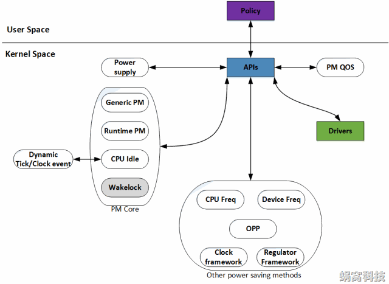
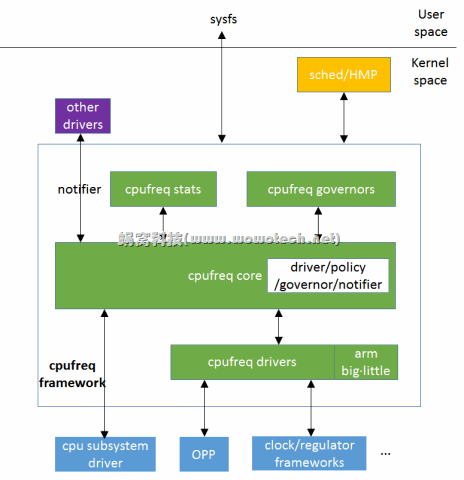

## cpu电源管理

###  修订记录
| 修订说明 | 日期 | 作者 | 额外说明 |
| --- |
| 初版 | 2020/04/07 | 员清观 |  |

x15支持： `cat /sys/power/state` 显示 freeze mem

## 1 电源管理概述
**参考信息**<br>
	http://www.wowotech.net/pm_subsystem/pm_architecture.html

电源管理（Power Management）在Linux Kernel中，是一个比较庞大的子系统，涉及到供电（Power Supply）、充电（Charger）、时钟（Clock）、频率（Frequency）、电压（Voltage）、睡眠/唤醒（Suspend/Resume）等方方面面（如下图），蜗蜗会在Linux电源管理系列文章中，对它们一一讲述。



**主要内容**<br>
- Power Supply，是一个供用户空间程序监控系统的供电状态（电池供电、USB供电、AC供电等等）的class。通俗的讲，它是一个Battery&Charger驱动的Framework
- Clock Framework，Clock驱动的Framework，用于统一管理系统的时钟资源
- Regulator Framework，Voltage/Current Regulator驱动的Framework。该驱动用于调节CPU等模块的电压和电流值
- Dynamic Tick/Clock Event，在传统的Linux Kernel中，系统Tick是固定周期（如10ms）的，因此每隔一个Tick，就会产生一个Timer中断。这会唤醒处于Idle或者Sleep状态的CPU，而很多时候这种唤醒是没有意义的。因此新的Kernel就提出了Dynamic Tick的概念，Tick不再是周期性的，而是根据系统中定时器的情况，不规律的产生，这样可以减少很多无用的Timer中断
- CPU Idle，用于控制CPU Idle状态的Framework
- Generic PM，传统意义上的Power Management，如Power Off、Suspend to RAM、Suspend to Disk、Hibernate等
- Runtime PM and Wakelock，运行时的Power Management，不再需要用户程序的干涉，由Kernel统一调度，实时的关闭或打开设备，以便在使用性能和省电性能之间找到最佳的平衡. Runtime PM是Linux Kernel亲生的运行时电源管理机制，Wakelock是由Android提出的机制。这两种机制的目的是一样的，因此只需要支持一种即可。另外，由于Wakelock机制路子太野了，饱受Linux社区的鄙视，因此我们不会对该机制进行太多的描述。
- CPU Freq/Device Freq，用于实现CPU以及Device频率调整的Framework
- OPP（Operating Performance Point），是指可以使SOCs或者Devices正常工作的电压和频率组合。内核提供这一个Layer，是为了在众多的电压和频率组合中，筛选出一些相对固定的组合，从而使事情变得更为简单一些
- PM QOS，所谓的PM QOS，是指系统在指定的运行状态下（不同电压、频率，不同模式之间切换，等等）的工作质量，包括latency、timeout、throughput三个参数，单位分别为us、us和kb/s。通过QOS参数，可以分析、改善系统的性能

**电源管理相关源码**<br>
	kernel/power/ *
	drivers/power/
	drivers/base/power/*
	drivers/cpuidle/*
	drivers/cpufreq/*
	drivers/devfreq/*
	include/linux/power_supply.h
	include/linux/cpuidle.h
	include/linux/cpufreq.h
	include/linux/cpu_pm.h
	include/linux/device.h
	include/linux/pm.h
	include/linux/pm domain.h
	include/linux/pm runtime.h
	include/linux/pm wakeup.h
	include/linux/suspend.h

## 2 cpu电源管理
### 2.1 topology
在多数的ARM处理器中（不排除后续ARM服务器又不同实现），CPU topology如下： Cluster-->Core-->Threads. 但目前为止，ARM没有明显提出多线程的概念

```cpp
struct cputopo_arm {
	int thread_id;
	int core_id;
	int socket_id;
	cpumask_t thread_sibling;
	cpumask_t core_sibling;
};
struct cputopo_arm cpu_topology[NR_CPUS];
```

**linux kernel主要通过三类机制实现SMP系统CPU core的电源管理功能：**<br>
- 1）cpu hotplug。根据应用场景，enable/disable CPU core，具体可参考“Linux CPU core的电源管理(4)_cpu control”。
- 2）cpuidle framework。在没有进程调度的时候，让CPU core进入idle状态，具体可参考“cpuidle framework系列文章”。
- 3）cpufreq framework。根据使用场景和系统负荷，调整CPU core的电压（voltage）和频率（frequency），具体可参考本文以及后续cpufreq相关的。

### 2.2 cpuidle
### 2.3 cpufreq
对CPU core来说，功耗和性能是一对不可调和的矛盾，通过调整CPU的电压和频率，可以在功耗和性能之间找一个平衡点。由于调整是在系统运行的过程中，因此cpufreq framework的功能也称作动态电压/频率调整（Dynamic Voltage/Frequency Scaling，DVFS）。

cpufreq framework的核心功能，是通过调整CPU core的电压和频率，兼顾系统的性能和功耗。在不需要高性能时，降低电压和频率，以降低功耗；在需要高性能时，提高电压和频率，以提高性能。要达到此目的，有两个关键点： 1）如果控制CPU core的电压和频率。 2）何时改变CPU core的电压和频率。针对这两个关键点，CPU core有两种实现。实现1：CPU core根据自身的负荷，自动调整电压和频率，不需要OS级别的软件参与。实现2：CPU core不参与任何的逻辑动作，由OS软件根据系统运行情况，调整电压和频率。这种实现2，几乎完全由软件掌控DVFS行为：关键点1，基于clock framework和regulator framework提供的接口，控制CPU core的频率和电压；关键点2，根据应用场景，手动（用户发起，例如省电模式）或者自动（软件自动调整，例如HMP）的调整。注2：对关键点2来说，如果调整比较频繁，则需要CPU core在不同频率之间转换的速度足够快，后面会详细介绍。



有些平台，所有cpu core的频率和电压时统一控制的，即改变某个core上的频率，其它core同样受影响。此时只需要实现其中一个core（通常为cpu0）的cpufreq即可，其它core的cpufreq直接是cpu0的符号链接。因此，使用这些API时，随便进入某一个cpu下面的cpufreq目录即可。

但是现在x15的cpu1显然不是符号链接，而是真正独立的控制，和硬件的表现不一致，需要更改。到底某一个cpufreq可以控制多少cpu core呢？可以通过cpufreq/affected_cpus和cpufreq/related_cpus两个文件查看，其中的区别是：affected_cpus表示该cpufreq影响到哪些cpu core（没有显示处于offline状态的cpu），related_cpus则包括了online+offline的所有core。

**缺陷：**<br>
related_cpus应该修改一下。
cat scaling_available_frequencies，应该标示不稳定的范围

**如何修改cpu频率**<br>
cd /sys/devices/system/cpu/cpu0/cpufreq/
cat cpuinfo_max_freq; cat cpuinfo_min_freq              #获取“物理”上的频率范围
cat scaling_available_frequencies                       #获取可用的频率列表
cat scaling_available_governors                         #获取可用的governors
cat scaling_governor                                    #当前的governor
cat cpuinfo_cur_freq; cat scaling_cur_freq              #获取当前的频率信息，可以比较一下是否不同
cat scaling_max_freq; cat scaling_min_freq              #获取当前调频策略所限定的频率范围
 #假设CPU不可以自动调整频率
echo userspace > scaling_governor                       #governor切换为userspace
 #如果需要切换的频率值在scaling_available_frequencies内，且在cpuinfo_max_freq/cpuinfo_min_freq的范围内。
 #如果需要切换的频率不在scaling_max_freq/scaling_min_freq的范围内，修改这两个值
echo xxx > scaling_max_freq; echo xxx > scaling_min_freq
 #最后，设置频率值
echo xxx > scaling_setspeed

## 5 reset framework
复杂IC内部有很多具有独立功能的硬件模块，例如CPU cores、GPU cores、USB控制器、MMC控制器、等等，出于功耗、稳定性等方面的考虑，有些IC在内部为这些硬件模块设计了复位信号（reset signals），软件可通过寄存器（一般1个bit控制1个硬件）控制这些硬件模块的复位状态。Linux kernel为了方便设备驱动的编写，抽象出一个简单的软件框架----reset framework，为reset的provider提供统一的reset资源管理手段，并为reset的consumer（各个硬件模块）提供便捷、统一的复位控制API。

reset framework的思路、实现和使用都非常简单、易懂（参考kernel有关的API--include/linux/reset-controller.h、include/linux/reset.h可知），不过麻雀虽小，五脏俱全，通过它可以加深对Linux kernel的设备模型、驱动框架、分层设计、provider/consumer等设计思想的理解，因此本文将对其进行一个简单的罗列和总结。

### 5.1 数据结构和api
```cpp
struct reset_control_ops {
  int (*reset)(struct reset_controller_dev *rcdev, unsigned long id);
  int (*assert)(struct reset_controller_dev *rcdev, unsigned long id);
  int (*deassert)(struct reset_controller_dev *rcdev, unsigned long id);
};
struct reset_controller_dev {
  struct reset_control_ops *ops;
  struct module *owner;
  struct list_head list; //若干个reset的链表，上层逐个调用它们的ops
  struct device_node *of_node;
  int of_reset_n_cells;
  int (*of_xlate)(struct reset_controller_dev *rcdev, const struct of_phandle_args *reset_spec);
  unsigned int nr_resets;
};
```

**只有一个reset信号的话，可以使用最简单的device_reset API**<br>
int device_reset(struct device *dev);
**如果需要更为复杂的控制（例如有多个reset信号、需要控制处于reset状态的长度的等），可以使用稍微复杂的API**<br>
/* 通过reset_control_get或者devm_reset_control_get获得reset句柄 */
struct reset_control *reset_control_get(struct device *dev, const char *id);
void reset_control_put(struct reset_control *rstc);
struct reset_control *devm_reset_control_get(struct device *dev, const char *id);
/* 通过reset_control_reset进行复位，或者通过reset_control_assert使设备处于复位生效状态，通过reset_control_deassert使复位失效 */
int reset_control_reset(struct reset_control *rstc);
int reset_control_assert(struct reset_control *rstc);
int reset_control_deassert(struct reset_control *rstc);

### 5.2　重启流程

```cpp
//SYSCALL_DEFINE4(reboot, int, magic1, int, magic2, unsigned int, cmd, void __user *, arg)
//void kernel_halt(void)
//void kernel_power_off(void)
void kernel_restart(char *cmd)
  |--> kernel_restart_prepare(cmd);
    blocking_notifier_call_chain(&reboot_notifier_list, SYS_RESTART, cmd);//调用blocking_notifier_call_chain接口，向关心reboot事件的进程，发送SYS_RESTART、SYS_HALT或者SYS_POWER_OFF事件。对RESTART来说，还好将cmd参数一并发送出去
  	system_state = SYSTEM_RESTART; //将系统状态设置为相应的状态
  	usermodehelper_disable(); //禁止User mode helper
  	device_shutdown(); //关闭所有的设备
	|--> migrate_to_reboot_cpu(); //将当前的进程（task）移到一个CPU上. 对于多CPU的机器，无论哪个CPU触发了当前的系统调用，代码都可以运行在任意的CPU上。这个接口将代码分派到一个特定的CPU上，并禁止调度器分派代码到其它CPU上。也就是说，这个接口被执行后，只有一个CPU在运行，用于完成后续的reboot动作。
    cpu_hotplug_disable();
		cpu = cpumask_first(cpu_online_mask); //选择一个online的cpu
    current->flags |= PF_NO_SETAFFINITY;
    set_cpus_allowed_ptr(current, cpumask_of(cpu));
	imapx15_restart(0, cmd);
	syscore_shutdown(); //将系统核心器件关闭（例如中断等)
	kmsg_dump(KMSG_DUMP_RESTART); //打印日志信息
	machine_restart(cmd); //由machine-core的代码，接管后续的处理

int hibernate(void)

```
### 5.1
### 5.1
### 5.1
## 6. runtime PM
```cpp
 #define SIMPLE_DEV_PM_OPS(name, suspend_fn, resume_fn) \
const struct dev_pm_ops name = { \
	SET_SYSTEM_SLEEP_PM_OPS(suspend_fn, resume_fn) \
}
 #define UNIVERSAL_DEV_PM_OPS(name, suspend_fn, resume_fn, idle_fn) \
const struct dev_pm_ops name = { \
	SET_SYSTEM_SLEEP_PM_OPS(suspend_fn, resume_fn) \
	SET_RUNTIME_PM_OPS(suspend_fn, resume_fn, idle_fn) \
}
```
## 7. runtime PM
```cpp
//可以控制动态的开关runtime pm功能
extern void pm_runtime_enable(struct device *dev);
extern void pm_runtime_disable(struct device *dev);

 //#ifdef CONFIG_PM_RUNTIME
static int pl022_runtime_suspend(struct device *dev)
	struct pl022 *pl022 = dev_get_drvdata(dev);
	clk_disable(pl022->clk);
 	return 0;

static int pl022_runtime_resume(struct device *dev)
	struct pl022 *pl022 = dev_get_drvdata(dev);
	clk_enable(pl022->clk);
	return 0;

static int pl022_runtime__idle(struct device *dev)
	int err = pm_schedule_suspend(dev, 500); //在指定的时间后（delay，单位是ms），suspend设备。该接口为异步调用，不会更改设备的引用计数，可在driver的.rpm_idle中调用，免去driver自己再启一个timer的烦恼。
	dev_dbg(dev, "runtime_idle called\n");
	if (err != 0) return 0;
	return -EBUSY;

static const struct dev_pm_ops pl022_dev_pm_ops = {
	SET_SYSTEM_SLEEP_PM_OPS(pl022_suspend, pl022_resume)
	SET_RUNTIME_PM_OPS(pl022_runtime_suspend, pl022_runtime_resume, pl022_runtime__idle)
};
```
