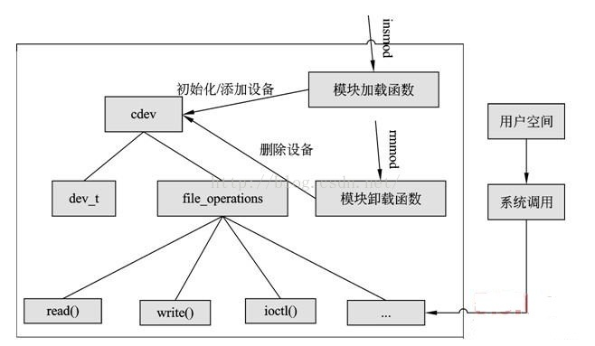

## 字符和块设备驱动

###  修订记录
| 修订说明 | 日期 | 作者 | 额外说明 |
| --- |
| 初版 | 2018/04/10 | 员清观 |  |

## 1 基础
对于字符设备和块设备来说，在/dev目录下都有对应的设备文件。linux用户程序通过设备文件或叫做设备节点来使用驱动程序操作字符设备和块设备。网络设备：网络设备比较特殊，不在是对文件进行操作，而是由专门的网络接口来实现。应用程序不能直接访问网络设备驱动程序。在/dev目录下也没有文件来表示网络设备。参考文档: https://blog.csdn.net/zqixiao_09/article/details/50839042


## 2 字符设备
在`kernel/fs/char_dev.c`文件中提供接口.
```cpp
//#include <include/linux/cdev.h>
struct cdev {
	struct kobject kobj;                  //内嵌的内核对象.
	struct module *owner;                 //该字符设备所在的内核模块的对象指针.
	const struct file_operations *ops;    //该结构描述了字符设备所能实现的方法，是极为关键的一个结构体.
	struct list_head list;                //用来将已经向内核注册的所有字符设备形成链表.
	dev_t dev;                            //字符设备的设备号，由主设备号和次设备号构成.
	unsigned int count;                   //隶属于同一主设备号的次设备号的个数.
};
```

在linux内核中使用`cdev`结构体来描述字符设备，通过其成员`dev_t`来定义设备号，以确定字符设备的唯一性。通过其成员`file_operations`来定义字符设备驱动提供给VFS的接口函数，如常见的open()、read()、write()等。

在Linux字符设备驱动中，模块加载函数通过`register_chrdev_region()` 或`alloc_chrdev_region()`来静态或者动态获取设备号，通过`cdev_init()`建立cdev与file_operations之间的连接，通过`cdev_add()`向系统添加一个cdev以完成注册。模块卸载函数通过`cdev_del( )`来注销cdev，通过`unregister_chrdev_region( )`来释放设备号。

用户空间访问该设备的程序通过Linux系统调用，如`open( )、read( )、write( )`，来“调用”file_operations来定义字符设备驱动提供给VFS的接口函数。



这张图基本表示了字符驱动所需要的模板，只是缺少class的相关内容，class主要是用来自动创建设备节点的，还有就是一个比较常用的ioctl()函数没有列上。


**cdev初始化**<br>
```cpp
//静态内存定义初始化：
struct cdev my_cdev;
cdev_init(&my_cdev, &fops);
my_cdev.owner = THIS_MODULE;

//动态内存定义初始化：
struct cdev *my_cdev = cdev_alloc();
my_cdev->ops = &fops;
my_cdev->owner = THIS_MODULE;

//两种使用方式的功能是一样的，cdev_init()还多赋了一个 cdev->ops的值, 只是使用的内存区不一样，一般视实际的数据结构需求而定
```
**接口函数:**<br>

**完整的范例:**<br>
```cpp
/*在内存中申请1k 大小的内存做为简单的一个设备来访问*/
//#include<linux/cdev.h>
//#include<linux/module.h>
//#include<linux/types.h>
//#include<linux/fs.h>
//#include<linux/errno.h>
//#include<linux/mm.h>
//#include<linux/sched.h>
//#include<linux/init.h>
//#include<asm/io.h>
//#include<asm/system.h>
//#include<asm/uaccess.h>

/*设备空间大小*/
//#define MYCHAR_MEM_SIZE 0x0400
/*缺省主设备号*/
//#define MYCHAR_MAJOR	260
/*自定义的清除内存的命令*/
//#define MYCHAR_MEN_CLR	0x01
/*主设备号变量*/
static int mychar_major = MYCHAR_MAJOR;

/*习惯上将内部数据空间与cdev 绑定，与其封装*/
struct mychar_dev{
	struct cdev cdev;
	unsigned char mem[MYCHAR_MEM_SIZE];
};

/*一个实例*/
struct mychar_dev* mychar_devp;

int mychar_open(struct inode *inode,struct file * filp)
{
	filp->private_data = mychar_devp;
	return 0;
}
int mychar_release(struct inode *inode,struct file* filp)
{
	return 0;
}

ssize_t mychar_read(struct file *filp,char __user *buf,size_t size ,loff_t *ppos )
{
	unsigned long p=*ppos;
	unsigned int count = size;
	int ret = 0;
	struct mychar_dev *dev = filp->private_data;
	if(p>MYCHAR_MEM_SIZE)
		return 0;
	if(count > MYCHAR_MEM_SIZE-p)
		count = MYCHAR_MEM_SIZE-p;
	if( copy_to_user(buf,(void*)(dev->mem+p),count)){
		ret= -EFAULT;
	}else{
		*ppos +=count;
		ret = count;
		printk(KERN_INFO "read %u bytes(s) from %1u\n",count,p);
	}
	return ret;
}

ssize_t mychar_write(struct file *filp ,const char __user *buf,size_t size,loff_t *ppos)
{
	unsigned long p=*ppos;
	unsigned int count=size;
	int ret = 0;
	struct mychar_dev *dev = filp->private_data;
	if(p > MYCHAR_MEM_SIZE)
		return 0;
	if(count > MYCHAR_MEM_SIZE-p)
		count = MYCHAR_MEM_SIZE-p;
	if(copy_from_user((void*)(dev->mem),buf,count)){
		ret = -EFAULT;
	}else{
		*ppos +=count;
		ret = count;
		printk(KERN_INFO "written %u byte(s) from %1u\n",count,p);
	}
	return ret;
}
/*llseek*/
static loff_t mychar_llseek(struct file *filp,loff_t offset,int orig)
{
	loff_t ret = 0;
	switch(orig){
	case 0:	/*相对于文件开始位置偏移*/
		if(offset < 0)
			ret = -EINVAL;
		break;
		if((unsigned int)offset > MYCHAR_MEM_SIZE){
			ret = -EINVAL;
			break;
		}
		filp->f_pos =(unsigned int )offset;
		ret = filp->f_pos;
		break;
	case 1:	/*相对于文件当前位置*/
		if((filp->f_pos+offset)>MYCHAR_MEM_SIZE){
			ret = -EINVAL;
			break;
		}
		if((filp->f_pos+offset)< 0){
			ret = -EINVAL;
			break;
		}
		filp->f_pos +=offset;
		ret = filp->f_pos;
		break;
	default:
		ret = - EINVAL;
		break;
	}
	return ret;
}
int mychar_ioctl(struct inode * inodep ,struct file *filp ,unsigned int cmd ,unsigned long arg)
{
	struct mychar_dev *dev =filp->private_data;
	switch(cmd){
	case MYCHAR_MEM_CLR:
		memset(dev->mem,0,MYCHAR_MEM_SIZE);
		printk(KERN_INFO "mychar memery is set to zero\n");
		break;
	default:
		return -EINVAL;
	}
	return 0;
}
static const struct file_operations mychar_fops = {
	.owner = THIS_MODULE,
	.llseek = mychar_llseek,
	.read = mychar_read,
	.write = mychar_write,
	.ioctl = mychar_ioctl,
	.open = mychar_open,
	.release =mychar_release,
};

static void mychar_setup_cdev(struct mychar_dev *dev,int index)
{
	int err;
	int devno = MKDEV(mychar_major,index);
	cdev_init(&dev->cdev,&mychar_fops);
	dev->cdev.owner = THIS_MODULE;
	err = cdev_add(&dev->cdev,devno,1);
	if(err)
		printk(KERN_NOTICE " Error %d adding mychar %d",err,index);

}

static int __init mychar_init(void)
{
	int result;
	dev_t devno = MKDEV(mychar_major,0);
	if(mychar_major)
		result = register_chrdev_region(devno,1,"mychar");
	else{
		result = alloc_chrdev_region(&devno,0,1,"mychar");
		mychar_major = MAJOR(devno);
	}
	if(result<0)
		return result;
	mychar_devp = kmalloc(sizeof(struct mychar_dev),GFP_KERNEL);
	if(!mychar_devp){
		result = -ENOMEM;
		goto fall_malloc;

	}
	memset(mychar_devp,0,sizeof(struct mychar_dev));
	mychar_setup_cdev(mychar_devp,0);
	return 0;

fall_malloc:
	unregister_chrdev_region(devno,1);
	return result;
}

static void __exit mychar_exit(void)
{
	cdev_del(&mychar_devp->cdev);
	kfree(mychar_devp);
	unregister_chrdev_region(MKDEV(mychar_major,0),1);
}

module_param(mychar_major,int,S_IRUGO);

MODULE_LICENSE("Dual BSD/GPL");
MODULE_AUTHOR("ghostyu");
module_init(mychar_init);
module_exit(mychar_exit);
```

## 3 模块
**Linux 驱动开发之内核模块开发--知秋一叶**<br>
　　https://blog.csdn.net/zqixiao_09/article/details/50837708

内核模块是一些可以让操作系统内核在需要时载入和执行的代码，同时在不需要的时候可以卸载。这是一个好的功能，扩展了操作系统的内核功能，却不需要重新启动系统，是一种动态加载的技术。动态加载卸载方便调试新的驱动模块，不需要每次重新启动kernel，而且也方便nfs等方式的引入．

```cpp
//最简单内核模块
//#include <linux/module.h>  //所有内核模块都必须包含这个头文件
//＃include<linux/kernel.h>    //使用内核信息优先级时要包含这个
//＃include<linux/init.h>         //一些初始化的函数如module_init()

int hello_show(void)
{
    printk("hello_show");
}
MODULE_EXPORT(hello_show);

static int hello_init(void)
{
    printk("hello_init");
}
static void hello_exit(void)
{
    printk("hello_exit \n");
}

module_init(hello_init); 加载时候调用该函数insmod
module_exit(hello_exit);卸载时候 rmmod

MODULE_LICENSE("GPL");  //模块许可声明
//MODULE_LICENSE("GPL v2");
MODULE_DESCRIPTION("DW Multimedia Card Interface driver");
MODULE_AUTHOR("NXP Semiconductor VietNam");
MODULE_AUTHOR("Imagination Technologies Ltd");
```

```cpp
//make 相关
obj-$(CONFIG_HELLO_MODULE) += hello.o　//obj-m 编译为模块，obj-y编译进内核
//多目标
obj-$(CONFIG_ISDN) += isdn.o
isdn-objs := isdn_net_lib.o isdn_v110.o isdn_common.o
//目录的迭代
obj-$(CONFIG_EXT2_FS) += ext2/
//不同的模块编译方式,外部编译需要用到
  ifneq  ($(KERNELRELEASE),)
  obj-m:=hello.o
  else
  KDIR := /lib/modules/$(shell uname -r)/build
  PWD:=$(shell pwd)
  all:
      make -C $(KDIR) M=$(PWD) modules
  clean:
      rm -f *.ko *.o *.symvers *.cmd *.cmd.o
  endif
  //make 的的执行步骤
  a -- 第一次进来的时候，宏“KERNELRELEASE”未定义，因此进入 else；
  b -- 记录内核路径，记录当前路径；
       由于make 后面没有目标，所以make会在Makefile中的第一个不是以.开头的目标作为默认的目标执行。默认执行all这个规则
  c -- make -C $(KDIR) M=$(PWD) modules
     -C 进入到内核的目录执行Makefile ，在执行的时候KERNELRELEASE就会被赋值，M=$(PWD)表示返回当前目录，再次执行makefile，modules 编译成模块的意思
     所以这里实际运行的是
     make -C /lib/modules/2.6.13-study/build M=/home/fs/code/1/module/hello/ modules
  d -- 再次执行该makefile，KERNELRELEASE就有值了，就会执行obj-m:=hello.o
     obj-m：表示把hello.o 和其他的目标文件链接成hello.ko模块文件，编译的时候还要先把hello.c编译成hello.o文件
//模块安装
当你需要将模块安装到非默认位置的时候，你可以用INSTALL_MOD_PATH 指定一个前缀，如：
     make INSTALL_MOD_PATH=/foo modules_install
模块将被安装到 /foo/lib/modules目录下
```

```cpp
//模块参数
module_param(name, type, perm);
参数的意义：
  name    既是用户看到的参数名，又是模块内接受参数的变量；
  type    表示参数的数据类型，是下列之一：byte, short, ushort, int, uint, long, ulong, charp, bool, invbool；
  perm    指定了在sysfs中相应文件的访问权限。访问权限与linux文件访问权限相同的方式管理，如0644，或使用stat.h中的宏如S_IRUGO表示。
              0表示完全关闭在sysfs中相对应的项。
static unsigned int int_var = 0;
module_param(int_var, uint, S_IRUGO);
static char *name;
module_param(name, charp, 0);
  同时向指针传递字符串的时候，不能传递这样的字符串 who="hello world!".即字符串中间不能有空格
module_param_array(name, type, num, perm);
  name  数组的名子(也是参数名),
  type     数组元素的类型,
  num    一个整型变量,
  perm   通常的权限值.
//加载模块时带参数
insmod hello.ko who="world" times=5
  /sys/module/hello/parameters  该目录下生成变量对应的文件节点
```

```cpp
//current指向当前cpu当前进程
//＃include<linux/sched.h>
static inline struct thread_info *current_thread_info(void) __attribute_const__;
static inline struct thread_info *current_thread_info(void)
{
	register unsigned long sp asm ("sp");
	return (struct thread_info *)(sp & ~(THREAD_SIZE - 1));
}
//#define get_current() (current_thread_info()->task)
//#define current get_current()
```

## 4 __attribute__详解
http://blog.sina.com.cn/s/blog_661314940100qujt.html

__attribute__((section(“section_name”)))的作用是将指定的函数或变量放入到名为”section_name”的段中。

通常在宏定义中使用#来创建字符串 #abc就表示字符串”abc”等；##运算符称为预处理器的粘合剂，用来替换粘合两个不同的符号

```cpp
//#define __iomem    __attribute__((noderef, address_space(2)))
//attribute是用来修饰一个变量的，这个变量必须是非解除参考（no dereference）的，即这个变量地址必须是有效的，而且变量所在的地址空间必须是2，即io存储空间。地址空间的定义：  v: 0 内核空间 v: 1 用户空间 v: 2 io存储空间 v: 3 cpu空间

//#define __rcu      __attribute__((noderef, address_space(4)))

//#define module_init(x) __initcall(x)
//#define module_exit(x) __exitcall(x)
```
## 5
### 5.1

## 6
