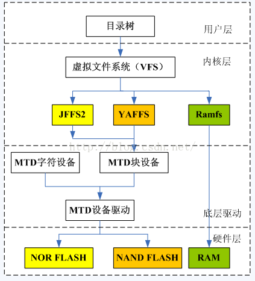
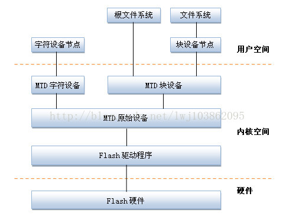

##

###  修订记录
| 修订说明 | 日期 | 作者 | 额外说明 |
| --- |
| 初版 | 2018/04/10 | 员清观 |  |

## 1. flash文件系统概述




### 1.1 文件系统选择
flash文件系统基于MTD驱动程序，主要优点在于，它是专门针对各种非易失性存储器(以闪存为主)而设计的，因而它对Flash有更好的支持、管理和基于扇区的擦除、读/写操作接口．

**JFFS2日志闪存文件系统版本2 (Journalling Flash FileSystem v2)**<br>
主要用于NOR型闪存，基于MTD驱动层。
优点：可读写的、支持数据压缩的、基于哈希表的日志型文件系统，并提供了崩溃/掉电安全保护，提供“写平衡”支持等。
缺点：主要是当文件系统已满或接近满时，因为垃圾收集的关系而使jffs2的运行速度大大放慢。
目前jffs3正在开发中。
jffsx不适合用于NAND闪存，主要是因为NAND闪存的容量一般较大，这样导致jffs为维护日志节点所占用的内存空间迅速增大，另外，jffsx文件系统在挂载时需要扫描整个FLASH的内容，以找出所有的日志节点，建立文件结构，对于大容量的NAND闪存会耗费大量时间。

Norflash一般使用jffs2

**yaffs2 (Yet Another Flash File System )**<br>
yaffs/yaffs2是专为嵌入式系统使用NAND型闪存而设计的一种日志型文件系统。与jffs2相比，它减少了一些功能(例如不支持数据压缩)，所以速度更快，挂载时间很短，对内存的占用较小。另外，它还是跨平台的文件系统，除了Linux和eCos，还支持WinCE, pSOS和ThreadX等。
yaffs/yaffs2自带NAND芯片的驱动，并且为嵌入式系统提供了直接访问文件系统的API，用户可以不使用Linux中的MTD与VFS，直接对文件系统操作。当然，yaffs也可与MTD驱动程序配合使用。
yaffs与yaffs2的主要区别：yaffs仅支持小页(512 Bytes) NAND闪存，yaffs2则可支持大页(2KB) NAND闪存。同时，yaffs2在内存空间占用、垃圾回收速度、读/写速度等方面均有大幅提升
Nandflash早期使用的是yaffs2，现在一般使用ubifs，因为随着技术的进步Nandflash的容量越来越大，yaffs2已经hold不住了

**ubifs(UnsortedBlock Image File System,UBIFS)无排序区块图像文件系统**<br>
UBIFS可以认为是JFFS2文件系统的下一代。最早在2006年由IBM与Nokia的工程师ThomasGleixner，ArtemBityutskiy所设计，专门为了解决MTD（MemoryTechnology Device）设备所遇到的瓶颈。由于NandFlash容量的暴涨，YAFFS等皆无法再去控制NandFlash的空间。UBIFS通过子系统UBI处理与MTDdevice之间的动作。
UBIFS在设计与性能上均较YAFFS2、JFFS2更适合NAND FLASH。UBIFS支持write-back,其写入的数据会被cache,直到有必要写入时才写到flash,大大地降低分散小区块数量并提高I/O效率。UBIFSUBIFS文件系统目录存储在flash上，UBIFSmount时不需要scan整个flash的数据来重新创建文件目录。支持on-the-flight压缩文件数据，而且可选择性压缩部份文件。另外UBIFS使用日志（journal），可减少对flashindex的更新频率。

**squashfs**<br>

　　


## ramdisk制作
ramdisk 有二种 , 一种（initrd）就是可以格式化并加载, 在 linux 内核 2.0/2.2 就已经支持 , 其不足之处是大小固定 ; 另一种（initramfs）是2.4 的内核才支持 , 通过ramfs 来实现 , 他不能被格式化 , 但用起来方便 , 其大小随所需要的空间增加或减少 , 是目前 linux 常用的 ramdisk 技术

   制作ramdiblsk需要genext2fs, 该工具可以用buildroot来编译出来:
   Host utilities
         [*] host genext2fs 选上这个,编译出来的genext2fs在output/build/host-genext2fs-1.4.1目录下


   到output/image目录下,解压文件系统到rootfs目录下
   tom@v:images$ mkdir rootfs
   tom@v:images$ sudo tar -xvf rootfs.tar -C rootfs


   生成ramdisk文件
   tom@v:images$ sudo ./genext2fs -b 8192 -d rootfs ramdisk.image
   tom@v:images$ ls
      genext2fs  ramdisk.image  rootfs  rootfs.tar


   用 gzip 压缩  ramdisk.image，生成  ramdisk.image.gz
   tom@v:images$ gzip -9 ramdisk.image
   tom@v:images$ ls
      genext2fs  ramdisk.image.gz  rootfs  rootfs.tar

   用 mkimage 添加文件头，生成新的uramdisk.image.gz供u-boot使用
tom@v:images$ mkimage -A arm -T ramdisk -C gzip -n Ramdisk -d ramdisk.image.gz uramdisk.image.gz
Image Name:   Ramdisk
Created:      Fri Jan  9 18:07:48 2015
Image Type:   ARM Linux RAMDisk Image (gzip compressed)
Data Size:    2376529 Bytes = 2320.83 kB = 2.27 MB
Load Address: 00000000
Entry Point:  00000000

  将uramdisk.image.gz copy到SD卡上,从SD卡启动,设置内核参数挂载ramdisk文件系统即可.

## 2.squashfs
### 2.1 squashfs基础
  　　官方网站: www.squashfs.org
　　Squashfs是Linux下的一种只读压缩文件系统类型。它使用zlib/lzo/xz等压缩算法来压缩文件，节点及目录。Squashfs文件系统内的节点非常小巧并且所有的数据块都排列紧凑，通过这种方式来降低数据存储开销。数据块大小可以取在4KB到1MB，但默认大小为128KB。(解压时stream_in_out大小都是128k)最大文件2TB，文件系统大小2^64
　　Squashfs 会将数据、节点及目录进行压缩。另外，节点和目录数据是字节对齐并且是高度紧凑的。每个压缩的节点平均仅占用8字节长度（确切长度会因为文件类型而不同，比如普通文件、目录、符号链接及块/字符设备节点等）。
　　squashfs作为一种只读文件，必须用mksquashfs工具来创建压缩的squashfs文件系统。mksquash工具及unsquashfs等工具可以从http://www.squashfs.org网站获取。这些squashfs相关工具代码树现在已经被集成到kernel.org内：git://git.kernel.org/pub/scm/fs/squashfs/squashfs-tools.git
　　Squashfs 文件系统最多包含9种字节对齐的模块，压缩的数据块就像从某个目录里读文件一样写到文件系统并进行冗余检查。当文件数据被写入到文件系统， completed inode, directory, fragment, export, uid/gid lookup 和xattr tables也会同时被写入到文件系统里面，其他模块定义：superblock,datablock,fragments.

unlock_page(page)，普通意义上，这应该是一个独立的page的临界区管理；但在squashfs中，这被用作一系列page的锁定管理，这样的先决条件是，后面的一系列page不会被挪用．但多个进程同时加载的情况，好像破坏了这个场景．实际上，这是squashfs的一个设计问题，它不能有效的使用page cache来作为cache,所以定义了一个且只有一个内部的数据缓存，所以，可以考虑增加这个cache的大小到一定程度，或者增加临界区保护它．


```cpp
int squashfs_fill_super(struct super_block *sb, void *data, int silent)
  struct squashfs_sb_info *msblk;
  msblk->devblksize = sb_min_blocksize(sb, SQUASHFS_DEVBLK_SIZE);
  msblk->devblksize_log2 = ffz(~msblk->devblksize);
  struct squashfs_super_block *sblk = squashfs_read_table(sb, SQUASHFS_START, sizeof(*sblk));
  msblk->decompressor = supported_squashfs_filesystem(le16_to_cpu(sblk->s_major),le16_to_cpu(sblk->s_minor),le16_to_cpu(sblk->compression));
  msblk->block_size = le32_to_cpu(sblk->block_size);
  msblk->inode_table = le64_to_cpu(sblk->inode_table_start);
  msblk->directory_table = le64_to_cpu(sblk->directory_table_start);
  msblk->inodes = le32_to_cpu(sblk->inodes);
  msblk->block_cache = squashfs_cache_init("metadata",SQUASHFS_CACHED_BLKS, SQUASHFS_METADATA_SIZE);//8*8192的cache
  msblk->read_page = squashfs_cache_init("data", 1, msblk->block_size);//1*128k
  msblk->stream = squashfs_decompressor_init(sb, flags);
  xattr_id_table_start = le64_to_cpu(sblk->xattr_id_table_start);
  msblk->xattr_id_table = squashfs_read_xattr_id_table(sb,xattr_id_table_start, &msblk->xattr_table, &msblk->xattr_ids);
  msblk->id_table = squashfs_read_id_index_table  (sb,le64_to_cpu(sblk->id_table_start), next_table,le16_to_cpu(sblk->no_ids));
  msblk->inode_lookup_table = squashfs_read_inode_lookup_table(sb,lookup_table_start, next_table, msblk->inodes);
  msblk->fragment_cache = squashfs_cache_init("fragment",SQUASHFS_CACHED_FRAGMENTS, msblk->block_size);//3*128k

//squashfs的软件cache机制，减少读取和解压操作，是可以在别的地方模拟的
struct squashfs_cache_entry *squashfs_cache_get(struct super_block *sb,struct squashfs_cache *cache, u64 block, int length)
void squashfs_cache_put(struct squashfs_cache_entry *entry)

struct squashfs_cache *squashfs_cache_init(char *name, int entries,int block_size)
```

## 3 mtd系统

MTD，Memory Technology Device即内存技术设备，在Linux内核中，引入MTD层为NOR FLASH和NAND FLASH设备提供统一接口。MTD将文件系统与底层FLASH存储器进行了隔离。



MTD设备通常可分为四层，从上到下依次是：设备节点、MTD设备层、MTD原始设备层、硬件驱动层。
- Flash硬件驱动层：Flash硬件驱动层负责对Flash硬件的读、写和擦除操作。MTD设备的Nand Flash芯片的驱动则drivers/mtd/nand/子目录下,Nor Flash芯片驱动位于drivers/mtd/chips/子目录下。
- MTD原始设备层：用于描述MTD原始设备的数据结构是mtd_info，定义了大量的关于MTD的数据和操作函数。mtdcore.c:MTD原始设备接口相关实现，mtdpart.c:MTD分区接口相关实现。
- MTD设备层：基于MTD原始设备，linux系统可以定义出MTD的块设备（主设备号31）和字符设备（设备号90）。其中mtdchar.c:MTD字符设备接口相关实现， mtdblock.c:MTD块设备接口相关实现。
- 设备节点：通过mknod在/dev子目录下建立MTD块设备节点（主设备号为31）和MTD字符设备节点（主设备号为90）。通过访问此设备节点即可访问MTD字符设备和块设备

```cpp
struct mtd_part {
    struct mtd_info mtd;        /* 分区信息, 大部分由master决定 */
    struct mtd_info *master;    /* 分区的主分区 */
    uint64_t offset;            /* 分区的偏移地址 */
    int index;                  /* 分区号 (Linux3.0后不存在该字段) */
    struct list_head list;      /* 将mtd_part链成一个链表mtd_partitons */
    int registered;
};
```

### 3.1 spi-nftl

```cpp
//每个oob中保存了一个INFOTM_NFTL_MAGIC 加一个struct nftl_oobinfo_t
//#define INFOTM_NFTL_MAGIC			 "infotm"
struct nftl_oobinfo_t{
	addr_sect_t    sect;
    erase_count_t  ec;
    addr_vtblk_t   vtblk;
    int16_t        timestamp;
    int8_t       status_page;
};
```

## 4 系统升级libupgrade

### 4.1 主流程

```cpp
//普通升级，为全空参数
int system_update_upgrade(char *path, int offset, int dump, void (*state_cb)(void *arg, int image_type, int state, int state_arg), void *arg)

```
