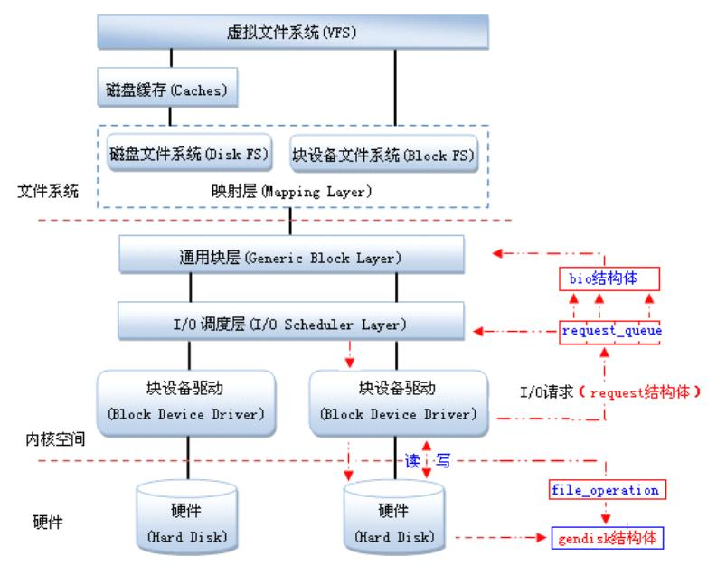

  ##

###  修订记录
| 修订说明 | 日期 | 作者 | 额外说明 |
| --- |
| 初版 | 2018/04/10 | 员清观 |  |

## 1. flash文件系统概述


### 1.1 文件系统选择
flash文件系统基于MTD驱动程序，主要优点在于，它是专门针对各种非易失性存储器(以闪存为主)而设计的，因而它对Flash有更好的支持、管理和基于扇区的擦除、读/写操作接口．

**JFFS2日志闪存文件系统版本2 (Journalling Flash FileSystem v2)**<br>
主要用于NOR型闪存，基于MTD驱动层。
优点：可读写的、支持数据压缩的、基于哈希表的日志型文件系统，并提供了崩溃/掉电安全保护，提供“写平衡”支持等。
缺点：主要是当文件系统已满或接近满时，因为垃圾收集的关系而使jffs2的运行速度大大放慢。
目前jffs3正在开发中。
jffsx不适合用于NAND闪存，主要是因为NAND闪存的容量一般较大，这样导致jffs为维护日志节点所占用的内存空间迅速增大，另外，jffsx文件系统在挂载时需要扫描整个FLASH的内容，以找出所有的日志节点，建立文件结构，对于大容量的NAND闪存会耗费大量时间。

Norflash一般使用jffs2

**yaffs2 (Yet Another Flash File System )**<br>
yaffs/yaffs2是专为嵌入式系统使用NAND型闪存而设计的一种日志型文件系统。与jffs2相比，它减少了一些功能(例如不支持数据压缩)，所以速度更快，挂载时间很短，对内存的占用较小。另外，它还是跨平台的文件系统，除了Linux和eCos，还支持WinCE, pSOS和ThreadX等。
yaffs/yaffs2自带NAND芯片的驱动，并且为嵌入式系统提供了直接访问文件系统的API，用户可以不使用Linux中的MTD与VFS，直接对文件系统操作。当然，yaffs也可与MTD驱动程序配合使用。
yaffs与yaffs2的主要区别：yaffs仅支持小页(512 Bytes) NAND闪存，yaffs2则可支持大页(2KB) NAND闪存。同时，yaffs2在内存空间占用、垃圾回收速度、读/写速度等方面均有大幅提升
Nandflash早期使用的是yaffs2，现在一般使用ubifs，因为随着技术的进步Nandflash的容量越来越大，yaffs2已经hold不住了

**ubifs(UnsortedBlock Image File System,UBIFS)无排序区块图像文件系统**<br>
UBIFS可以认为是JFFS2文件系统的下一代。最早在2006年由IBM与Nokia的工程师ThomasGleixner，ArtemBityutskiy所设计，专门为了解决MTD（MemoryTechnology Device）设备所遇到的瓶颈。由于NandFlash容量的暴涨，YAFFS等皆无法再去控制NandFlash的空间。UBIFS通过子系统UBI处理与MTDdevice之间的动作。
UBIFS在设计与性能上均较YAFFS2、JFFS2更适合NAND FLASH。UBIFS支持write-back,其写入的数据会被cache,直到有必要写入时才写到flash,大大地降低分散小区块数量并提高I/O效率。UBIFSUBIFS文件系统目录存储在flash上，UBIFSmount时不需要scan整个flash的数据来重新创建文件目录。支持on-the-flight压缩文件数据，而且可选择性压缩部份文件。另外UBIFS使用日志（journal），可减少对flashindex的更新频率。

**squashfs**<br>

　　


## ramdisk制作
ramdisk 有二种 , 一种（initrd）就是可以格式化并加载, 在 linux 内核 2.0/2.2 就已经支持 , 其不足之处是大小固定 ; 另一种（initramfs）是2.4 的内核才支持 , 通过ramfs 来实现 , 他不能被格式化 , 但用起来方便 , 其大小随所需要的空间增加或减少 , 是目前 linux 常用的 ramdisk 技术

   制作ramdiblsk需要genext2fs, 该工具可以用buildroot来编译出来:
   Host utilities
         [*] host genext2fs 选上这个,编译出来的genext2fs在output/build/host-genext2fs-1.4.1目录下


   到output/image目录下,解压文件系统到rootfs目录下
   tom@v:images$ mkdir rootfs
   tom@v:images$ sudo tar -xvf rootfs.tar -C rootfs


   生成ramdisk文件
   tom@v:images$ sudo ./genext2fs -b 8192 -d rootfs ramdisk.image
   tom@v:images$ ls
      genext2fs  ramdisk.image  rootfs  rootfs.tar


   用 gzip 压缩  ramdisk.image，生成  ramdisk.image.gz
   tom@v:images$ gzip -9 ramdisk.image
   tom@v:images$ ls
      genext2fs  ramdisk.image.gz  rootfs  rootfs.tar

   用 mkimage 添加文件头，生成新的uramdisk.image.gz供u-boot使用
tom@v:images$ mkimage -A arm -T ramdisk -C gzip -n Ramdisk -d ramdisk.image.gz uramdisk.image.gz
Image Name:   Ramdisk
Created:      Fri Jan  9 18:07:48 2015
Image Type:   ARM Linux RAMDisk Image (gzip compressed)
Data Size:    2376529 Bytes = 2320.83 kB = 2.27 MB
Load Address: 00000000
Entry Point:  00000000

  将uramdisk.image.gz copy到SD卡上,从SD卡启动,设置内核参数挂载ramdisk文件系统即可.

## 2.squashfs
### 2.1 squashfs基础
  　　官方网站: www.squashfs.org
　　Squashfs是Linux下的一种只读压缩文件系统类型。它使用zlib/lzo/xz等压缩算法来压缩文件，节点及目录。Squashfs文件系统内的节点非常小巧并且所有的数据块都排列紧凑，通过这种方式来降低数据存储开销。数据块大小可以取在4KB到1MB，但默认大小为128KB。(解压时stream_in_out大小都是128k)最大文件2TB，文件系统大小2^64
　　Squashfs 会将数据、节点及目录进行压缩。另外，节点和目录数据是字节对齐并且是高度紧凑的。每个压缩的节点平均仅占用8字节长度（确切长度会因为文件类型而不同，比如普通文件、目录、符号链接及块/字符设备节点等）。
　　squashfs作为一种只读文件，必须用mksquashfs工具来创建压缩的squashfs文件系统。mksquash工具及unsquashfs等工具可以从http://www.squashfs.org网站获取。这些squashfs相关工具代码树现在已经被集成到kernel.org内：git://git.kernel.org/pub/scm/fs/squashfs/squashfs-tools.git
　　Squashfs 文件系统最多包含9种字节对齐的模块，压缩的数据块就像从某个目录里读文件一样写到文件系统并进行冗余检查。当文件数据被写入到文件系统， completed inode, directory, fragment, export, uid/gid lookup 和xattr tables也会同时被写入到文件系统里面，其他模块定义：superblock,datablock,fragments.

unlock_page(page)，普通意义上，这应该是一个独立的page的临界区管理；但在squashfs中，这被用作一系列page的锁定管理，这样的先决条件是，后面的一系列page不会被挪用．但多个进程同时加载的情况，好像破坏了这个场景．实际上，这是squashfs的一个设计问题，它不能有效的使用page cache来作为cache,所以定义了一个且只有一个内部的数据缓存，所以，可以考虑增加这个cache的大小到一定程度，或者增加临界区保护它．


```cpp
//对于基于块设备的文件系统，简化流程，以方便理解基本回调流程
struct dentry *squashfs_mount(struct file_system_type *fs_type, int flags, const char *dev_name, void *data)
  |--> return mount_bdev(fs_type, flags, dev_name, data, squashfs_fill_super);//int squashfs_fill_super(struct super_block *sb, void *data, int silent)
    ...
    root = new_inode(sb);
    |--> squashfs_read_inode(root, root_inode);//int squashfs_read_inode(struct inode *inode, long long ino)
      ...
      |--> init_special_inode(inode, inode->i_mode, 0);
        ...
        if (S_ISBLK(mode)) {
      		inode->i_fop = &def_blk_fops; //见下文详细介绍
      		inode->i_rdev = rdev;
      	}
        ...

    insert_inode_hash(root);  sb->s_root = d_make_root(root);


static struct file_system_type squashfs_fs_type = {
	.owner = THIS_MODULE, 	.name = "squashfs", 	.mount = squashfs_mount, 	.kill_sb = kill_block_super, 	.fs_flags = FS_REQUIRES_DEV
};


int squashfs_fill_super(struct super_block *sb, void *data, int silent)
  struct squashfs_sb_info *msblk;
  msblk->devblksize = sb_min_blocksize(sb, SQUASHFS_DEVBLK_SIZE);
  msblk->devblksize_log2 = ffz(~msblk->devblksize);
  struct squashfs_super_block *sblk = squashfs_read_table(sb, SQUASHFS_START, sizeof(*sblk));
  msblk->decompressor = supported_squashfs_filesystem(le16_to_cpu(sblk->s_major),le16_to_cpu(sblk->s_minor),le16_to_cpu(sblk->compression));
  msblk->block_size = le32_to_cpu(sblk->block_size);
  msblk->inode_table = le64_to_cpu(sblk->inode_table_start);
  msblk->directory_table = le64_to_cpu(sblk->directory_table_start);
  msblk->inodes = le32_to_cpu(sblk->inodes);
  msblk->block_cache = squashfs_cache_init("metadata",SQUASHFS_CACHED_BLKS, SQUASHFS_METADATA_SIZE);//8*8192的cache
  msblk->read_page = squashfs_cache_init("data", 1, msblk->block_size);//1*128k
  msblk->stream = squashfs_decompressor_init(sb, flags);
  xattr_id_table_start = le64_to_cpu(sblk->xattr_id_table_start);
  msblk->xattr_id_table = squashfs_read_xattr_id_table(sb,xattr_id_table_start, &msblk->xattr_table, &msblk->xattr_ids);
  msblk->id_table = squashfs_read_id_index_table  (sb,le64_to_cpu(sblk->id_table_start), next_table,le16_to_cpu(sblk->no_ids));
  msblk->inode_lookup_table = squashfs_read_inode_lookup_table(sb,lookup_table_start, next_table, msblk->inodes);
  msblk->fragment_cache = squashfs_cache_init("fragment",SQUASHFS_CACHED_FRAGMENTS, msblk->block_size);//3*128k

//squashfs的软件cache机制，减少读取和解压操作，是可以在别的地方模拟的
struct squashfs_cache_entry *squashfs_cache_get(struct super_block *sb,struct squashfs_cache *cache, u64 block, int length)
void squashfs_cache_put(struct squashfs_cache_entry *entry)

struct squashfs_cache *squashfs_cache_init(char *name, int entries,int block_size)
```

## 3 mtd系统

MTD，Memory Technology Device即内存技术设备，在Linux内核中，引入MTD层为NOR FLASH和NAND FLASH设备提供统一接口。MTD将文件系统与底层FLASH存储器进行了隔离。


MTD设备通常可分为四层，从上到下依次是：设备节点、MTD设备层、MTD原始设备层、硬件驱动层。
- Flash硬件驱动层：Flash硬件驱动层负责对Flash硬件的读、写和擦除操作。MTD设备的Nand Flash芯片的驱动则drivers/mtd/nand/子目录下,Nor Flash芯片驱动位于drivers/mtd/chips/子目录下。
- MTD原始设备层：用于描述MTD原始设备的数据结构是mtd_info，定义了大量的关于MTD的数据和操作函数。mtdcore.c:MTD原始设备接口相关实现，mtdpart.c:MTD分区接口相关实现。
- MTD设备层：基于MTD原始设备，linux系统可以定义出MTD的块设备（主设备号31）和字符设备（设备号90）。其中mtdchar.c:MTD字符设备接口相关实现， mtdblock.c:MTD块设备接口相关实现。
- 设备节点：通过mknod在/dev子目录下建立MTD块设备节点（主设备号为31）和MTD字符设备节点（主设备号为90）。通过访问此设备节点即可访问MTD字符设备和块设备

```cpp
struct mtd_part {
    struct mtd_info mtd;        /* 分区信息, 大部分由master决定 */
    struct mtd_info *master;    /* 分区的主分区 */
    uint64_t offset;            /* 分区的偏移地址 */
    int index;                  /* 分区号 (Linux3.0后不存在该字段) */
    struct list_head list;      /* 将mtd_part链成一个链表mtd_partitons */
    int registered;
};
//

```

### 3.1 mtdblock.c

```cpp
static struct mtd_blktrans_ops mtdblock_tr = {
	.name		= "mtdblock", 	.major		= 31, 	.part_bits	= 0, 	.blksize 	= 512,
	.open		= mtdblock_open, 	.flush		= mtdblock_flush, 	.release	= mtdblock_release,
	.readsect	= mtdblock_readsect, 	.writesect	= mtdblock_writesect, 	.add_mtd	= mtdblock_add_mtd,
	.remove_dev	= mtdblock_remove_dev, 	.owner		= THIS_MODULE,
};
struct mtd_blktrans_dev {
	struct mtd_blktrans_ops *tr;
	struct list_head list;
	struct mtd_info *mtd;
	struct mutex lock;
	int devnum;
	bool bg_stop;
	unsigned long size;
	int readonly;
	int open;
	struct kref ref;
	struct gendisk *disk;
	struct attribute_group *disk_attributes;
	struct workqueue_struct *wq;
	struct work_struct work;

	struct request_queue *rq;
	spinlock_t queue_lock;
	void *priv;
	fmode_t file_mode;
};
struct mtdblk_dev {//可以看做对 mtd_blktrans_dev 的继承，增加了缓冲的功能
	struct mtd_blktrans_dev mbd;　//应该是作为基类
	int count;
	struct mutex cache_mutex;
	unsigned char *cache_data;
	unsigned long cache_offset;
	unsigned int cache_size;
	enum { STATE_EMPTY, STATE_CLEAN, STATE_DIRTY } cache_state;
};

void mtdblock_add_mtd(struct mtd_blktrans_ops *tr, struct mtd_info *mtd)
  struct mtdblk_dev *dev = kzalloc(sizeof(*dev), GFP_KERNEL);
  dev->mbd.mtd = mtd; dev->mbd.devnum = mtd->index; dev->mbd.size = mtd->size >> 9;
  dev->mbd.tr = tr; mutex_init(&dev->cache_mutex);
  add_mtd_blktrans_dev(&dev->mbd)

void mtdblock_remove_dev(struct mtd_blktrans_dev *dev)
  del_mtd_blktrans_dev(dev);

```

### 3.2 mtdchar.c介绍

```cpp
//下文中：//file->private_data = mfi; 将struct mtd_file_info的变量设置为file的私有结构
struct mtd_file_info {
	struct mtd_info *mtd;
	struct inode *ino;
	enum mtd_file_modes mode;
};

static const struct file_operations mtd_fops = {
	.owner		= THIS_MODULE,	.llseek		= mtdchar_lseek,	.read		= mtdchar_read,	.write		= mtdchar_write,
	.unlocked_ioctl	= mtdchar_unlocked_ioctl,　	.compat_ioctl	= mtdchar_compat_ioctl,
	.open		= mtdchar_open,　	.release	= mtdchar_close,　	.mmap		= mtdchar_mmap,　};

static loff_t mtdchar_lseek(struct file *file, loff_t offset, int orig)
  //根据orig计算并更新offset的值
  return file->f_pos = offset;

static int mtdchar_open(struct inode *inode, struct file *file)
  struct mtd_info *mtd = get_mtd_device(NULL, devnum);
  struct inode *mtd_ino = iget_locked(mnt->mnt_sb, devnum);
  mtd_ino->i_private = mtd;　mtd_ino->i_mode = S_IFCHR;　mtd_ino->i_data.backing_dev_info = mtd->backing_dev_info;
  file->f_mapping = mtd_ino->i_mapping;
  struct mtd_file_info *mfi = kzalloc(sizeof(*mfi), GFP_KERNEL);
  mfi->ino = mtd_ino; mfi->mtd = mtd;   file->private_data = mfi;

static int mtdchar_close(struct inode *inode, struct file *file)
  struct mtd_file_info *mfi = file->private_data;     struct mtd_info *mtd = mfi->mtd;
  iput(mfi->ino); put_mtd_device(mtd);  file->private_data = NULL;  kfree(mfi); simple_release_fs(&mnt, &count);

ssize_t mtdchar_read(struct file *file, char __user *buf, size_t count, loff_t *ppos)
  struct mtd_file_info *mfi = file->private_data;     struct mtd_info *mtd = mfi->mtd;　　　struct mtd_oob_ops ops;
  char *kbuf = mtd_kmalloc_up_to(mtd, &size);
  ops.mode = MTD_OPS_RAW; ops.datbuf = kbuf;  ops.oobbuf = NULL;  ops.len = len; mtd_read_oob(mtd, *ppos, &ops);

ssize_t mtdchar_write(struct file *file, const char __user *buf, size_t count, loff_t *ppos)
  struct mtd_file_info *mfi = file->private_data;     struct mtd_info *mtd = mfi->mtd;　　　struct mtd_oob_ops ops;
  char *kbuf = mtd_kmalloc_up_to(mtd, &size);
  ops.mode = MTD_OPS_RAW; ops.datbuf = kbuf;  ops.oobbuf = NULL;  ops.len = len;  mtd_write_oob(mtd, *ppos, &ops);

static const struct file_operations mtd_fops = {
	.owner		= THIS_MODULE,	.llseek		= mtdchar_lseek,	.read		= mtdchar_read,	.write		= mtdchar_write,
	.unlocked_ioctl	= mtdchar_unlocked_ioctl,	.open		= mtdchar_open,	.release	= mtdchar_close,.mmap		= mtdchar_mmap, };
static struct file_system_type mtd_inodefs_type = {
  .name = "mtd_inodefs",  .mount = mtd_inodefs_mount,    .kill_sb = kill_anon_super, };
int __init init_mtdchar(void)
  ret = __register_chrdev(MTD_CHAR_MAJOR, 0, 1 << MINORBITS, "mtd", &mtd_fops);
  ret = register_filesystem(&mtd_inodefs_type);

```

### 3.3 mtdcore.c和mtdpart.c

这个文件中提供大量接口，最终还是会调用mtd的回调函数，这里主要是增加了参数校验和临界区同步等

```cpp
struct mtd_info {
	u_char type;
	uint32_t flags;
	uint64_t size; // Total size of the MTD
	uint32_t erasesize, writesize, writebufsize, oobsize, oobavail;
	unsigned int erasesize_shift, writesize_shift, erasesize_mask, writesize_mask;
	// Kernel-only stuff starts here.
	const char *name;  	int index;

	/* ECC layout structure pointer - read only! */
	struct nand_ecclayout *ecclayout;

	/* max number of correctible bit errors per writesize */
	unsigned int ecc_strength;
	int numeraseregions;
	struct mtd_erase_region_info *eraseregions;
	int (*_erase) (struct mtd_info *mtd, struct erase_info *instr);
	int (*_point) (struct mtd_info *mtd, loff_t from, size_t len, size_t *retlen, void **virt, resource_size_t *phys);
	int (*_unpoint) (struct mtd_info *mtd, loff_t from, size_t len);
	unsigned long (*_get_unmapped_area) (struct mtd_info *mtd, unsigned long len, unsigned long offset, unsigned long flags);
	int (*_read) (struct mtd_info *mtd, loff_t from, size_t len, size_t *retlen, u_char *buf);
	int (*_write) (struct mtd_info *mtd, loff_t to, size_t len, size_t *retlen, const u_char *buf);
	int (*_panic_write) (struct mtd_info *mtd, loff_t to, size_t len, size_t *retlen, const u_char *buf);
	int (*_read_oob) (struct mtd_info *mtd, loff_t from, struct mtd_oob_ops *ops);
	int (*_write_oob) (struct mtd_info *mtd, loff_t to, struct mtd_oob_ops *ops);
	int (*_get_fact_prot_info) (struct mtd_info *mtd, struct otp_info *buf, size_t len);
	int (*_read_fact_prot_reg) (struct mtd_info *mtd, loff_t from, size_t len, size_t *retlen, u_char *buf);
	int (*_get_user_prot_info) (struct mtd_info *mtd, struct otp_info *buf, size_t len);
	int (*_read_user_prot_reg) (struct mtd_info *mtd, loff_t from, size_t len, size_t *retlen, u_char *buf);
	int (*_write_user_prot_reg) (struct mtd_info *mtd, loff_t to, size_t len, size_t *retlen, u_char *buf);
	int (*_lock_user_prot_reg) (struct mtd_info *mtd, loff_t from, size_t len);
	int (*_writev) (struct mtd_info *mtd, const struct kvec *vecs, unsigned long count, loff_t to, size_t *retlen);
	void (*_sync) (struct mtd_info *mtd);
  int (*_lock) (struct mtd_info *mtd, loff_t ofs, uint64_t len); 	int (*_unlock) (struct mtd_info *mtd, loff_t ofs, uint64_t len);
	int (*_is_locked) (struct mtd_info *mtd, loff_t ofs, uint64_t len);
	int (*_block_isbad) (struct mtd_info *mtd, loff_t ofs); 	int (*_block_markbad) (struct mtd_info *mtd, loff_t ofs);
	int (*_suspend) (struct mtd_info *mtd);   	void (*_resume) (struct mtd_info *mtd);
	int (*_get_device) (struct mtd_info *mtd); 	void (*_put_device) (struct mtd_info *mtd);

	struct backing_dev_info *backing_dev_info;
	struct notifier_block reboot_notifier;  /* default mode before reboot */
	/* ECC status information */
	struct mtd_ecc_stats ecc_stats;
	/* Subpage shift (NAND) */
	int subpage_sft;
	void *priv;
	struct module *owner;
	struct device dev;
	int usecount;
};

static LIST_HEAD(mtd_partitions);
static DEFINE_MUTEX(mtd_partitions_mutex);
struct mtd_part {
	struct mtd_info mtd;
	struct mtd_info *master;
	uint64_t offset;
	struct list_head list;
};

static DEFINE_IDR(mtd_idr);
DEFINE_MUTEX(mtd_table_mutex);
struct mtd_info *__mtd_next_device(int i)
	return idr_get_next(&mtd_idr, &i);

struct mtd_info 中定义的大部分part回调函数，对于partition来讲，就是加上 part->offset

struct mtd_part *allocate_partition(struct mtd_info *master, const struct mtd_partition *part, int partno, uint64_t cur_offset)
  struct mtd_part *slave = kzalloc(sizeof(*slave), GFP_KERNEL);
  slave->mtd.type = master->type; slave->mtd.flags = master->flags & ~part->mask_flags;
  slave->mtd.size = part->size; slave->mtd.writesize = master->writesize; ...
  slave->mtd._read = part_read; slave->mtd._write = part_write; ... //partition callbacks
  slave->offset = cur_offset; slave->mtd.size = master->size - slave->offset;

int add_mtd_device(struct mtd_info *mtd)
  int i = idr_alloc(&mtd_idr, mtd, 0, 0, GFP_KERNEL);
  mtd->index = i; mtd->usecount = 0;
  mtd->dev.type = &mtd_devtype; mtd->dev.class = &mtd_class;  mtd->dev.devt = MTD_DEVT(i);
  dev_set_name(&mtd->dev, "mtd%d", i);  dev_set_drvdata(&mtd->dev, mtd);
  device_register(&mtd->dev);
  if (MTD_DEVT(i))
		device_create(&mtd_class, mtd->dev.parent, MTD_DEVT(i) + 1, NULL, "mtd%dro", i);
  __module_get(THIS_MODULE);

int add_mtd_partitions(struct mtd_info *master, const struct mtd_partition *parts, int nbparts)
  for (i = 0; i < nbparts; i++)
    slave = allocate_partition(master, parts + i, i, cur_offset);
    list_add(&slave->list, &mtd_partitions); add_mtd_device(&slave->mtd);  cur_offset = slave->offset + slave->mtd.size;

int del_mtd_device(struct mtd_info *mtd)
  idr_find(&mtd_idr, mtd->index) != mtd)
  device_unregister(&mtd->dev); idr_remove(&mtd_idr, mtd->index); module_put(THIS_MODULE);

//一般在device probe
int mtd_device_parse_register(struct mtd_info *mtd, const char * const *types, struct mtd_part_parser_data *parser_data,
        const struct mtd_partition *parts, int nr_parts)
  struct mtd_partition *real_parts;
  err = parse_mtd_partitions(mtd, types, &real_parts, parser_data);
  real_parts = kmemdup(parts, sizeof(*parts) * nr_parts, GFP_KERNEL); err = nr_parts;
  if (err > 0)　	err = add_mtd_partitions(mtd, real_parts, err);		kfree(real_parts);
	else if (err == 0) err = add_mtd_device(mtd);

int __init init_mtd(void)
  ret = class_register(&mtd_class);
  |--> ret = mtd_bdi_init(&mtd_bdi_unmappable, "mtd-unmap");
    ret = bdi_init(bdi);　    ret = bdi_register(bdi, NULL, name);
  ret = mtd_bdi_init(&mtd_bdi_ro_mappable, "mtd-romap");  ret = mtd_bdi_init(&mtd_bdi_rw_mappable, "mtd-rwmap");
  proc_mtd = proc_create("mtd", 0, NULL, &mtd_proc_ops);
  ret = init_mtdchar();
```

### 3.4 mtdblk_dev.c

```cpp

static LIST_HEAD(blktrans_majors);
static DEFINE_MUTEX(blktrans_ref_mutex);

//工作队列处理函数，从设备队列上获取req并调用tr回调处理
void mtd_blktrans_work(struct work_struct *work)
  struct mtd_blktrans_dev *dev =	container_of(work, struct mtd_blktrans_dev, work);
	struct mtd_blktrans_ops *tr = dev->tr;
	struct request_queue *rq = dev->rq;
  while(1)
    |--> req = blk_fetch_request(rq);//-- blk_peek_request() -- __elv_next_request() 获取有效请求．
      struct request *rq = blk_peek_request(q);
      if (rq)
        |--> blk_start_request(rq);
          blk_dequeue_request(req);  blk_add_timer(req);
      return rq;
    tr->do_blktrans_request(tr, dev, req);

void mtd_blktrans_request(struct request_queue *rq)
  struct mtd_blktrans_dev *dev = rq->queuedata;
  queue_work(dev->wq, &dev->work);

static struct mtd_blktrans_ops infotm_nftl_tr = {
	.name		= "snndblock", 	.major		= INFOTM_NFTL_MAJOR, 	.part_bits	= 1, 	.blksize 	= 512,
	.open		= infotm_nftl_open,  	.release	= infotm_nftl_release, 	.init_bounce_buf = infotm_nftl_init_bounce_buf,
	.erase_data = infotm_nftl_erase_data, 	.do_blktrans_request = do_nftltrans_request,
	.writesect	= infotm_nftl_writesect, 	.discard 	= infotm_nftl_discard, 	.flush		= infotm_nftl_flush,
  .add_mtd	= infotm_nftl_add_mtd, 	.remove_dev	= infotm_nftl_remove_dev, 	.owner		= THIS_MODULE, };

void infotm_nftl_creat_part(struct infotm_nftl_blk_t *infotm_nftl_blk, struct mtd_blktrans_ops *tr)
  struct mtd_info *mtd = infotm_nftl_blk->mtd;
  struct infotm_nftl_part_t *nftl_part = infotm_nftl_malloc(sizeof(struct infotm_nftl_part_t));
  nftl_part->size = 0; nftl_part->offset = 0; nftl_part->mbd.mtd = mtd;
  nftl_part->mbd.devnum = dev_num++;  nftl_part->mbd.tr = tr; nftl_part->mbd.size = (nftl_part->size >> 9);
  nftl_part->priv = infotm_nftl_blk;  tr->part_bits = 0;
  |--> add_mtd_blktrans_dev(&nftl_part->mbd)//int add_mtd_blktrans_dev(struct mtd_blktrans_dev *new)
    struct mtd_blktrans_ops *tr = new->tr;   struct gendisk *gd = alloc_disk(1 << tr->part_bits);
    int last_devnum; //遍历获取tr->devs链表上的所有struct mtd_blktrans_dev设备中最大设备号
    new->devnum = last_devnum+1;     list_add_tail(&new->list, &tr->devs);
    new->disk = gd; gd->private_data = new; gd->major = tr->major;  gd->first_minor = (new->devnum) << tr->part_bits;
    gd->fops = &mtd_block_ops;  snprintf(gd->disk_name, sizeof(gd->disk_name), "%s%d", tr->name, new->devnum);
    set_capacity(gd, (new->size * tr->blksize) >> 9);
    new->rq = blk_init_queue(mtd_blktrans_request, &new->queue_lock);
    new->rq->queuedata = new; blk_queue_logical_block_size(new->rq, tr->blksize);　gd->queue = new->rq;
    new->wq = alloc_workqueue("%s%d", 0, 0, tr->name, new->devnum);
    INIT_WORK(&new->work, mtd_blktrans_work);
    gd->driverfs_dev = &new->mtd->dev;  tr->init_bounce_buf(new, new->rq);
    add_disk(gd);

int __init init_infotm_nftl(void)
  |--> return register_mtd_blktrans(&infotm_nftl_tr);//int register_mtd_blktrans(struct mtd_blktrans_ops *tr)
    tr->major = register_blkdev(tr->major, tr->name);//申请一个块设备，在major_names[]数组中占用之
    tr->blkshift = ffs(tr->blksize) - 1;
    INIT_LIST_HEAD(&tr->devs);  list_add(&tr->list, &blktrans_majors);
    mtd_for_each_device(mtd)  if (mtd->type != MTD_ABSENT) tr->add_mtd(tr, mtd);
```

## 4 块设备驱动
一种具有一定结构的随机存取设备，对这种设备的读写是按块进行的，他使用缓冲区来存放暂时的数据，待条件成熟后，从缓存一次性写入设备或者从设备一次性读到缓冲区。可以随机访问，块设备的访问位置必须能够在介质的不同区间前后移动



**访问层次：**<br>
- 1. 首先块设备驱动是以何种方式对块设备进行访问的。在Linux中，驱动对块设备的输入或输出(I/O)操作，都会向块设备发出一个请求，在驱动中用request结构体描述。但对于一些磁盘设备而言请求的速度很慢，这时候内核就提供一种队列的机制把这些I/O请求添加到队列中(即：请求队列)，在驱动中用request_queue结构体描述。在向块设备提交这些请求前内核会先执行请求的合并和排序预操作，以提高访问的效率，然后再由内核中的I/O调度程序子系统(即：上图中的I/O调度层)来负责提交I/O请求，I/O调度程序将磁盘资源分配给系统中所有挂起的块I/O请求，其工作是管理块设备的请求队列，决定队列中的请求的排列顺序以及什么时候派发请求到设备，关于更多详细的I/O调度知识这里就不深加研究了
- 2. 块设备驱动又是怎样维持一个I/O请求在上层文件系统与底层物理磁盘之间的关系呢？这就是上图中通用块层(Generic Block Layer)要做的事情了。在通用块层中，通常用一个bio结构体来对应一个I/O请求，它代表了正在活动的以段(Segment)链表形式组织的块IO操作，对于它所需要的所有段又用bio_vec结构体表示
- 3. 块设备驱动又是怎样对底层物理磁盘进行反问的呢？上面讲的都是对上层的访问对上层的关系。Linux提供了一个gendisk数据结构体，用他来表示一个独立的磁盘设备或分区。在gendisk中有一个类似字符设备中file_operations的硬件操作结构指针，他就是block_device_operations结构体，他的作用相信大家已经很清楚了

```cpp
struct disk_stats {
	unsigned long sectors[2];	/* READs and WRITEs */
	unsigned long ios[2], merges[2], ticks[2], io_ticks, time_in_queue;
};
struct disk_part_tbl {
	struct rcu_head rcu_head;  int len;
	struct hd_struct __rcu *last_lookup, *part[];
};
//分区的数据结构
struct hd_struct {
	sector_t start_sect, nr_sects, alignment_offset;   //定义分区在整个gendisk中的偏移位置
	seqcount_t   nr_sects_seq;
  int policy, partno;
	unsigned int discard_alignment;
	struct device __dev;
	struct kobject *holder_dir;
	struct partition_meta_info *info;
	unsigned long stamp;
	atomic_t ref, in_flight[2];
	struct disk_stats dkstats;
	struct rcu_head rcu_head;
};
struct block_device {
  struct gendisk *	bd_disk;
	struct request_queue *  bd_queue;

  dev_t	  bd_dev;  /* not a kdev_t - it's a search key */
	int			bd_openers;
	struct inode *		bd_inode;	/* will die，分区节点 */
	struct super_block *	bd_super;
	void		*bd_claiming,*bd_holder;
	int			bd_holders;
	bool			bd_write_holder;
	struct block_device *	bd_contains;
	unsigned		bd_block_size;
	struct hd_struct *	bd_part;
	unsigned		bd_part_count;/* number of times partitions within this device have been opened. */
	int			bd_invalidated;

	struct list_head	bd_holder_disks, bd_inodes, bd_list;
	unsigned long		bd_private;
	int			bd_fsfreeze_count;/* The counter of freeze processes */
	struct mutex		bd_mutex, bd_fsfreeze_mutex;/* open/close mutex, and Mutex for freeze */
};
struct gendisk {
	/* major, first_minor and minors are input parameters only, don't use directly.  Use disk_devt() and disk_max_parts(). */
	int major, first_minor, minors;	/* major number of driver, maximum number of minors, =1 for disks that can't be partitioned */

  char disk_name[DISK_NAME_LEN];	/* name of major driver */
	char *(*devnode)(struct gendisk *gd, umode_t *mode);
	unsigned int events, async_events;		/* supported events, and async events, subset of all*/
	struct disk_part_tbl __rcu *part_tbl; //最终指向一个RCU的链表
	struct hd_struct part0; //至少也会包含一个分区，这是首个分区．
	const struct block_device_operations *fops;
	struct request_queue *queue;
	void *private_data;
	int flags;
	struct device *driverfs_dev;  // FIXME: remove
	struct kobject *slave_dir;
	struct timer_rand_state *random;
	atomic_t sync_io;		/* RAID */
	struct disk_events *ev;
	int node_id;
};
const struct file_operations def_blk_fops = {
	.open		= blkdev_open,　	.release	= blkdev_close,　	.llseek		= block_llseek,　	.read		= do_sync_read,　	.write		= do_sync_write,
	.aio_read	= blkdev_aio_read,　	.aio_write	= blkdev_aio_write,　	.mmap		= generic_file_mmap,　	.fsync		= blkdev_fsync,
	.unlocked_ioctl	= block_ioctl,　	.splice_read	= generic_file_splice_read,　	.splice_write	= generic_file_splice_write,　};
//struct gendisk 中的 struct block_device_operations 结构是块设备对应的操作接口，是连接抽象的块设备操作与具体块设备操作之间的枢纽；但是它并不能完全提供文件操作全部的API，实际上只提供了open、release等函数，其他的文件操作依赖于def_blk_fops
//
```

### 4.1 队列
```cpp
struct request_queue {
	struct list_head	queue_head;/*	 * Together with queue_head for cacheline sharing */
	struct request		*last_merge;
	struct elevator_queue	*elevator;
	int			nr_rqs[2];	/* # allocated [a]sync rqs */
	int			nr_rqs_elvpriv;	/* # allocated rqs w/ elvpriv */

	struct request_list	root_rl;

	request_fn_proc		*request_fn; 	//两种：１．从队列中取request并处理，２．queue_work然后在工作线程中处理，见到的mmc和mtd都是后者方式
  make_request_fn		*make_request_fn;
  prep_rq_fn		*prep_rq_fn;
	unprep_rq_fn		*unprep_rq_fn; 	merge_bvec_fn		*merge_bvec_fn; 	softirq_done_fn		*softirq_done_fn;
	rq_timed_out_fn		*rq_timed_out_fn; 	dma_drain_needed_fn	*dma_drain_needed;	lld_busy_fn		*lld_busy_fn;

	/*	 * Dispatch queue sorting  */
	sector_t		end_sector;
	struct request		*boundary_rq;

	struct delayed_work	delay_work;/* Delayed queue handling	 */
	struct backing_dev_info	backing_dev_info;
	void			*queuedata;/* The queue owner gets to use this for whatever they like. ll_rw_blk doesn't touch it. */
	unsigned long		queue_flags;/* various queue flags, see QUEUE_* below */
	int			id;/* ida allocated id for this queue.  Used to index queues from ioctx. */
	gfp_t			bounce_gfp;/* queue needs bounce pages for pages above this limit */

	spinlock_t		__queue_lock, *queue_lock;
	struct kobject kobj;/* queue kobject	 */

	/* queue settings */
	unsigned long		nr_requests;	/* Max # of requests */
	unsigned int		nr_congestion_on, nr_congestion_off, nr_batching;

  void			*dma_drain_buffer;
	unsigned int		dma_drain_size, dma_pad_mask, dma_alignment;

	struct blk_queue_tag	*queue_tags;
	struct list_head	tag_busy_list;

	unsigned int		nr_sorted, in_flight[2], request_fn_active, rq_timeout;

	struct timer_list	timeout;
	struct list_head	timeout_list;
	struct list_head	icq_list;
	struct queue_limits	limits;

  int			node, bypass_depth;
	unsigned int		sg_reserved_size, sg_timeout;/* sg stuff */
	unsigned int		flush_flags, flush_not_queueable:1, flush_queue_delayed:1, flush_pending_idx:1, flush_running_idx:1;
	unsigned long		flush_pending_since;
	struct list_head	flush_queue[2], flush_data_in_flight;
	struct request		flush_rq;
	struct mutex		sysfs_lock;
	struct rcu_head		rcu_head;
};

//请求队列相关的处理函数包括：
request_queue_t *blk_init_queue(request_fn_proc *rfn, spinlock_t *lock)；//创建队列时提供了一个自旋锁。
  |--> blk_init_queue_node(rfn, lock, NUMA_NO_NODE);
    |--> struct request_queue *uninit_q = blk_alloc_queue_node(GFP_KERNEL, node_id);
      struct request_queue *q = kmem_cache_alloc_node(blk_requestq_cachep, gfp_mask | __GFP_ZERO, node_id);
      q->id = ida_simple_get(&blk_queue_ida, 0, 0, gfp_mask); q->node = node_id;
      bdi_init(&q->backing_dev_info); setup_timer(&q->backing_dev_info.laptop_mode_wb_timer, laptop_mode_timer_fn, q);
      INIT_DELAYED_WORK(&q->delay_work, blk_delay_work);
      return q;
    |--> return q = blk_init_allocated_queue(uninit_q, rfn, lock);//设置最重要的两个回调函数
      q->request_fn		= rfn; ...
      |--> blk_queue_make_request(q, blk_queue_bio);
        q->make_request_fn = mfn; ...// ec: blk_queue_bio()
      elevator_init(q, NULL); return q;


struct request *elv_next_request(request_queue_t *q)；//获得队列中第一个未完成的请求。
void blk_start_queue(request_queue_t *queue); //开始请求
void blk_stop_queue(request_queue_t *queue); //停止请求
void blk_cleanup_queue(request_queue_t *);//清除请求队列

int submit_bh(int rw, struct buffer_head *bh) //从VS文件系统中访问
  struct bio *bio = bio_alloc(GFP_NOIO, 1);　//分配并使用bh初始化bio
  bio->bi_sector = bh->b_blocknr * (bh->b_size >> 9); bio->bi_bdev = bh->b_bdev;
  bio->bi_io_vec[0].bv_page = bh->b_page; bio->bi_io_vec[0].bv_len = bh->b_size;  bio->bi_io_vec[0].bv_offset = bh_offset(bh);
  bio->bi_vcnt = 1; bio->bi_size = bh->b_size;  bio->bi_end_io = end_bio_bh_io_sync; bio->bi_private = bh;
  |--> submit_bio(rw, bio); //|--> generic_make_request(bio);
    struct request_queue *q;
    if (current->bio_list)  { bio_list_add(current->bio_list, bio); return; }
    bio_list_init(&bio_list_on_stack);  current->bio_list = &bio_list_on_stack;
    do
      q = bdev_get_queue(bio->bi_bdev);
      |--> q->make_request_fn(q, bio); //void blk_queue_bio(struct request_queue *q, struct bio *bio)
        if (attempt_plug_merge(q, bio, &request_count))	return; //尝试合并到current's plugged list
        //然后再次尝试合并到当前队列中，合并成功就返回
        req = get_request(q, bio_data_dir(bio), bio, GFP_NOIO);
        init_request_from_bio(req, bio);    plug = current->plug;
        if (plug) list_add_tail(&req->queuelist, &plug->list);
        else
          add_acct_request(q, req, where);
          |--> __blk_run_queue(q); //__blk_run_queue_uncond(q);
            |--> q->request_fn(q); //void mtd_blktrans_request(struct request_queue *rq)
              struct mtd_blktrans_dev *dev = rq->queuedata;
              if (!dev)
		            while ((req = blk_fetch_request(rq)) != NULL)
                  __blk_end_request_all(req, -ENODEV);//__blk_end_bidi_request()-->blk_finish_request()-->req->end_io();
              else queue_work(dev->wq, &dev->work);//void mtd_blktrans_work(struct work_struct *work)

      bio = bio_list_pop(current->bio_list);
    while(bio);
    current->bio_list = NULL;
```

### 4.2 blk_core.c & genhd.c

genhd.c文件中，还集成了`cat /proce/diskstats`和`cat /proce/partitions`的procfs显示．

```cpp
//blk_core.c主要函数

//#define disk_to_dev(disk)	(&(disk)->part0.__dev)

DEFINE_IDA(blk_queue_ida);
static struct kmem_cache *request_cachep;  struct kmem_cache *blk_requestq_cachep; static struct workqueue_struct *kblockd_workqueue;

static DEFINE_MUTEX(block_class_lock);  static DEFINE_MUTEX(ext_devt_mutex); static DEFINE_IDR(ext_devt_idr);
static struct device_type disk_type;

void add_disk(struct gendisk *disk)
  |--> blk_alloc_devt(&disk->part0, &devt);
    if (part->partno < disk->minors) *devt = MKDEV(disk->major, disk->first_minor + part->partno); return;
    idx = idr_alloc(&ext_devt_idr, part, 0, NR_EXT_DEVT, GFP_KERNEL);
    *devt = MKDEV(BLOCK_EXT_MAJOR, blk_mangle_minor(idx));
  disk_to_dev(disk)->devt = devt;
  disk->major = MAJOR(devt);
	disk->first_minor = MINOR(devt);
  disk_alloc_events(disk);
  bdi = &disk->queue->backing_dev_info;
	bdi_register_dev(bdi, disk_devt(disk));
  blk_register_region(disk_devt(disk), disk->minors, NULL, exact_match, exact_lock, disk);
	|--> register_disk(disk);//void register_disk(struct gendisk *disk)
    struct device *ddev = disk_to_dev(disk);
    ddev->parent = disk->driverfs_dev;  dev_set_name(ddev, disk->disk_name);  dev_set_uevent_suppress(ddev, 1);
    device_add(ddev); ... //后续过程暂时忽略
	blk_register_queue(disk);
  sysfs_create_link(&disk_to_dev(disk)->kobj, &bdi->dev->kobj, "bdi");
  disk_add_events(disk);

int __init genhd_device_init(void)
  block_class.dev_kobj = sysfs_dev_block_kobj;
  error = class_register(&block_class);
  bdev_map = kobj_map_init(base_probe, &block_class_lock);
  |--> blk_dev_init();
    kblockd_workqueue = alloc_workqueue("kblockd", WQ_MEM_RECLAIM | WQ_HIGHPRI, 0);
    request_cachep = kmem_cache_create("blkdev_requests", sizeof(struct request), 0, SLAB_PANIC, NULL);
    blk_requestq_cachep = kmem_cache_create("blkdev_queue",	sizeof(struct request_queue), 0, SLAB_PANIC, NULL);
  |--> register_blkdev(BLOCK_EXT_MAJOR, "blkext"); //在块设备的major_names[]数组中，注册主设备号和名称
    p = kmalloc(sizeof(struct blk_major_name), GFP_KERNEL); p->major = major; strlcpy(p->name, name, sizeof(p->name));
    index = major_to_index(major); major_names[index] = p;
subsys_initcall(genhd_device_init);

void blk_start_plug(struct blk_plug *plug)
  struct task_struct *tsk = current;
  plug->magic = PLUG_MAGIC; INIT_LIST_HEAD(&plug->list); 	INIT_LIST_HEAD(&plug->cb_list);
  if (!tsk->plug) tsk->plug = plug;

void blk_finish_plug(struct blk_plug *plug)
  |--> blk_flush_plug_list(plug, false);//void blk_flush_plug_list(struct blk_plug *plug, bool from_schedule)
    flush_plug_callbacks(plug, from_schedule);
    LIST_HEAD(list);   list_splice_init(&plug->list, &list);    list_sort(NULL, &list, plug_rq_cmp);
    while (!list_empty(&list))
      rq = list_entry_rq(list.next);  list_del_init(&rq->queuelist);  q = rq->q;
      |--> queue_unplugged(q, depth, from_schedule);
        |--> __blk_run_queue(q);//--> __blk_run_queue_uncond()--> q->request_fn(q);如 mtd_blktrans_request()
  if (plug == current->plug)		current->plug = NULL;
```

### 4.3 buffer.c

```cpp

```

### 4.4 队列
### 4.5 队列
### 4.6 队列
### 4.7 概念

```cpp
//普通升级，为全空参数
int system_update_upgrade(char *path, int offset, int dump, void (*state_cb)(void *arg, int image_type, int state, int state_arg), void *arg)

```

### 4.8 IDR机制

IDR机制适用于关联一个整型ID和指针的地方。例如，在IIC总线中，每个设备都有自己的地址，为了在总线上找到特定的设备必须先发送设备地址。当适配器访问IIC总线设备时必须知道这些设备的地址，并在内核中创建一个用于描述设备的结构体，以及驱动程序。如果使用数组索引将ID号和结构体关联起来，一旦ID号非常大，使用数组索引将占用大量的内存空间。这种方法显然不可能实现，还有一种方法是链表，但是如果存在大量总线设备，那么链表查询效率将非常低。此时，IDR机制就应运而生，其内部机制由红黑数实现。该机制可以很方便将整型ID和指针关联起来，并具有很高的搜索效率

```cpp
struct idr_layer {
    unsigned long        bitmap; /* A zero bit means "space here" */
    struct idr_layer    *ary[1<<IDR_BITS];
    int          count;  /* When zero, we can release it */
    int          layer;  /* distance from leaf */ /*层次数*/
    struct rcu_head      rcu_head;
};

struct idr {
    struct idr_layer *top;  /*idr_layer树顶部，即树的根*/
    struct idr_layer *id_free;  /*指向idr_layer空闲链表*/
    int       layers; /* only valid without concurrent changes */ /*在IDR树中所处的层次数*/
    int       id_free_cnt;
    spinlock_t    lock;
};
//#define IDR_INIT(name)							\
{									\
	.lock			= __SPIN_LOCK_UNLOCKED(name.lock),	\
}

//常用的函数一般是　DEFINE_IDR　idr_alloc　idr_get_next　idr_remove　idr_find
//#define DEFINE_IDR(name)	struct idr name = IDR_INIT(name)
int idr_alloc(struct idr *idp, void *ptr, int start, int end, gfp_t gfp_mask);
//int idr_for_each(struct idr *idp, int (*fn)(int id, void *p, void *data), void *data);
void *idr_get_next(struct idr *idp, int *nextid);
void *idr_find(struct idr *idr, int id);
void idr_remove(struct idr *idp, int id);
//void idr_free(struct idr *idp, int id);
//void idr_destroy(struct idr *idp);
//void idr_init(struct idr *idp);

```

## 5 vfat文件主要系统调用层次分析

系统调用统一入口： `kernel/arm/calls.S`

移植fsck程序来实现fat32文件系统的分析，学习，改进．百度搜索: read()/write()的生命旅程

!!!! 使用延时分配策略,所有的簇分配集中进行,会产生资源的burst. 另外,分配簇需要读取fat表,fat表中一个扇区对应512k的数据区,2m的数据,对应4个扇区,可以考虑一次读取4个扇区应该可以减少一点点时间吧

多个文件并行写入的过程就是不同文件的元数据和数据交叉写入的过程，而元数据和数据在存储设备上位于不同的位置，优化的目标就是尽量安排好他们的次序，以符合效率两原则。
数据就是文件内容数据，而元数据主要包括有：1. fsinfo扇区(空闲帧数等信息)　2. 目录项信息　3. fat表簇号

buffer相关的大量无法索引到的symbol，实际上是一些宏而已，在buffer_head.h中定义；linux大部分文件中定义的变量和函数是static的，所以，我们只要关注文件中被 EXPORT 或者被注册的ops就好.再结合数据结构，架构就很清晰了。

Writeback机制的好处总结起来主要是两点：
1.加快write()的响应速度。因为media的读写相对于内存访问是较慢的。如果每个write()都访问media，势必很慢。将较慢的media访问交给writeback thread，而write()本身的thread里只在内存里操作数据，将数据交到writeback queue即返回。
2.便于合并和排序 (merge and sort) 多个write，merge是将多个少量数据的write合并成几个大量数据的write，减少访问media的次数；sort是将无序的write按照其访问media上的block的顺序排序，减少磁头在media上的移动距离。

自下而上，函数调用关系逆向跟踪的例子，有时候很方便解析函数调用逻辑：


### 5.1 mount和open

linux vfat没有存储inode,需要根据dentry信息调用`fat_build_inode()`函数动态生成．

```cpp
struct dentry {/* RCU lookup touched fields */
	unsigned int d_flags;		/* protected by d_lock */
	seqcount_t d_seq;		/* per dentry seqlock */
	struct hlist_bl_node d_hash;	/* lookup hash list */
	struct dentry *d_parent;	/* parent directory */
	struct qstr d_name;
	struct inode *d_inode;		/* Where the name belongs to - NULL is negative */
	unsigned char d_iname[DNAME_INLINE_LEN];	/* small names */

	/* Ref lookup also touches following */
	unsigned int d_count;		/* protected by d_lock */
	spinlock_t d_lock;		/* per dentry lock */
	const struct dentry_operations *d_op;
	struct super_block *d_sb;	/* The root of the dentry tree */
	unsigned long d_time;		/* used by d_revalidate */
	void *d_fsdata;			/* fs-specific data */

	struct list_head d_lru;		/* LRU list */
	/* d_child and d_rcu can share memory */
	union {
		struct list_head d_child;	/* child of parent list */
	 	struct rcu_head d_rcu;
	} d_u;
	struct list_head d_subdirs;	/* our children */
	struct hlist_node d_alias;	/* inode alias list */
};

struct super_block {
  struct list_head s_list; /* Keep this first */
  dev_t s_dev; /* search index; _not_ kdev_t */
  unsigned char s_blocksize_bits;
  unsigned long s_blocksize;
  loff_t s_maxbytes; /* Max file size */ //初始化为0xffffffff
  struct file_system_type *s_type;
  const struct super_operations *s_op;//超级块函数集
  const struct dquot_operations *dq_op;
  const struct quotactl_ops *s_qcop;
  const struct export_operations *s_export_op;
  unsigned long s_flags; //|=MS_NODIRATIME，不需要更新目录更新时间
  unsigned long s_magic; //MSDOS_SUPER_MAGIC,fat32文件系统
  struct dentry *s_root;     ／／根目录的dentry，链接"/"和对应boot扇区0的inode
  struct rw_semaphore s_umount;
  int s_count;
  atomic_t s_active;
  const struct xattr_handler **s_xattr;

  struct list_head s_inodes; /* all inodes */
  struct hlist_bl_head s_anon; /* anonymous dentries for (nfs) exporting */
  struct list_head s_files;
  struct list_head s_mounts; /* list of mounts; _not_ for fs use */
  /* s_dentry_lru, s_nr_dentry_unused protected by dcache.c lru locks */
  struct list_head s_dentry_lru; /* unused dentry lru */
  int s_nr_dentry_unused; /* # of dentry on lru */

  /* s_inode_lru_lock protects s_inode_lru and s_nr_inodes_unused */
  spinlock_t s_inode_lru_lock ____cacheline_aligned_in_smp;
  struct list_head s_inode_lru; /* unused inode lru */
  int s_nr_inodes_unused; /* # of inodes on lru */

  struct block_device *s_bdev;
  struct backing_dev_info *s_bdi;
  struct mtd_info *s_mtd;
  struct hlist_node s_instances;
  struct quota_info s_dquot; /* Diskquota specific options */

  struct sb_writers s_writers;

  char s_id[32]; /* Informational name */
  u8 s_uuid[16]; /* UUID */

  void *s_fs_info; /* Filesystem private info */     //指向struct msdos_sb_info结构，fat32的管理信息
  unsigned int s_max_links;
  fmode_t s_mode;

  /* Granularity of c/m/atime in ns.
  Cannot be worse than a second */
  u32 s_time_gran;

  /* The next field is for VFS *only*. No filesystems have any business even looking at it. You had been warned. */
  struct mutex s_vfs_rename_mutex; /* Kludge */

  /* Filesystem subtype. If non-empty the filesystem type field in /proc/mounts will be "type.subtype" */
  char *s_subtype;

  /* Saved mount options for lazy filesystems using generic_show_options() */
  char __rcu *s_options;
  const struct dentry_operations *s_d_op; /* default d_op for dentries */

  /* Saved pool identifier for cleancache (-1 means none) */
  int cleancache_poolid;

  struct shrinker s_shrink; /* per-sb shrinker handle */

  /* Number of inodes with nlink == 0 but still referenced */
  atomic_long_t s_remove_count;

  /* Being remounted read-only */
  int s_readonly_remount;
};
static struct file_system_type vfat_fs_type = {
    .owner        = THIS_MODULE,    .name        = "vfat",    .mount        = vfat_mount,
    .kill_sb    = kill_block_super,    .fs_flags    = FS_REQUIRES_DEV,
};
const struct file_operations fat_dir_operations = {
    .llseek = generic_file_llseek, .read = generic_read_dir, .readdir = fat_readdir,
    .unlocked_ioctl    = fat_dir_ioctl, .fsync = fat_file_fsync,};
static const struct inode_operations vfat_dir_inode_operations = {
    .create = vfat_create, .lookup = vfat_lookup, .unlink = vfat_unlink, .mkdir = vfat_mkdir,
    .rmdir = vfat_rmdir,　.rename = vfat_rename, .setattr = fat_setattr, .getattr = fat_getattr,
};
static const struct super_operations fat_sops = {
    .alloc_inode    = fat_alloc_inode,　  .destroy_inode    = fat_destroy_inode,
    .write_inode    = fat_write_inode,  //用于文件缓存的回写回调
    .evict_inode    = fat_evict_inode,    .put_super    = fat_put_super,
　 .statfs        = fat_statfs,     .remount_fs    = fat_remount,     .show_options    = fat_show_options,
};
struct inode *fat_alloc_inode(struct super_block *sb)
  struct msdos_inode_info *ei　= kmem_cache_alloc(fat_inode_cachep, GFP_NOFS);
  init_rwsem(&ei->truncate_lock);　return &ei->vfs_inode;
int fat_write_inode(struct inode *inode, struct writeback_control *wbc)
  struct super_block *sb = inode->i_sb;
  if (inode->i_ino == MSDOS_FSINFO_INO)
		mutex_lock(&MSDOS_SB(sb)->s_lock); err = fat_clusters_flush(sb); mutex_unlock(&MSDOS_SB(sb)->s_lock);
	|--> else __fat_write_inode(inode, wbc->sync_mode == WB_SYNC_ALL);
    i_pos = fat_i_pos_read(sbi, inode); fat_get_blknr_offset(sbi, i_pos, &blocknr, &offset);
    bh = sb_bread(sb, blocknr); raw_entry = &((struct msdos_dir_entry *) (bh->b_data))[offset];
    raw_entry->size = cpu_to_le32(inode->i_size); raw_entry->attr = fat_make_attrs(inode);
    fat_set_start(raw_entry, MSDOS_I(inode)->i_logstart);
    mark_buffer_dirty(bh); sync_dirty_buffer(bh);
int vfat_mkdir(struct inode *dir, struct dentry *dentry, umode_t mode)
  cluster = fat_alloc_new_dir(dir, &ts);
    fat_alloc_clusters(dir, &cluster, 1); blknr = fat_clus_to_blknr(sbi, cluster); bhs[0] = sb_getblk(sb, blknr);
    de = (struct msdos_dir_entry *)bhs[0]->b_data;//开始在新分配的cluster上填写目录信息
    memcpy(de[0].name, MSDOS_DOT, MSDOS_NAME); memcpy(de[1].name, MSDOS_DOTDOT, MSDOS_NAME); ...;
    fat_set_start(&de[0], cluster); //.指向新分配的的开始cluster
    fat_set_start(&de[1], MSDOS_I(dir)->i_logstart); //..指向父目录的开始cluster
    de[0].size = de[1].size = 0; //基于第一个block创建并初始化.和..两个目录项，包括设置start cluster
    memset(de + 2, 0, sb->s_blocksize - 2 * sizeof(*de)); set_buffer_uptodate(bhs[0]);
    mark_buffer_dirty_inode(bhs[0], dir);
    fat_zeroed_cluster(dir, blknr, 1, bhs, MAX_BUF_PER_PAGE); //零初始化cluster剩余的空间
    return cluster;
  vfat_add_entry(dir, &dentry->d_name, 1, cluster, &ts, &sinfo); dir->i_version++; inc_nlink(dir);
  inode = fat_build_inode(sb, sinfo.de, sinfo.i_pos); brelse(sinfo.bh); inode->i_version++; set_nlink(inode, 2);
  inode->i_mtime = inode->i_atime = inode->i_ctime = ts; dentry->d_time = dentry->d_parent->d_inode->i_version;
  d_instantiate(dentry, inode);

int fat_get_entry(struct inode *dir, loff_t *pos, struct buffer_head **bh, struct msdos_dir_entry **de)
  //如果老的扇区的目录项没有遍历到结尾
  if (*bh && *de && (*de - (struct msdos_dir_entry *)(*bh)->b_data) <	MSDOS_SB(dir->i_sb)->dir_per_block - 1)
		*pos += sizeof(struct msdos_dir_entry); (*de)++; return 0;
  //否则优先使用当前目录已经分配的簇中的空闲或者标记为删除的位置，可能会需要找到连续多个位置才能满足需求
  |--> return fat__get_entry(dir, pos, bh, de);
    *bh = NULL; iblock = *pos >> sb->s_blocksize_bits;
    fat_bmap(dir, iblock, &phys, &mapped_blocks, 0);//逻辑iblock换算成物理phys,称之为block mapping
    fat_dir_readahead(dir, iblock, phys); //预读phys所在整个簇的目录项
    *bh = sb_bread(sb, phys);//获取phys扇区的buffer head
    offset = *pos & (sb->s_blocksize - 1);
    *pos += sizeof(struct msdos_dir_entry); *de = (struct msdos_dir_entry *)((*bh)->b_data + offset); return 0;
int vfat_create(struct inode *dir, struct dentry *dentry, umode_t mode,bool excl)//创建并且初始化inode,更新dentry信息
  |--> vfat_add_entry(dir, &dentry->d_name, 0, 0, &ts, &sinfo);
    slots = kmalloc(sizeof(*slots) * MSDOS_SLOTS, GFP_NOFS);//分配临时缓冲区来保存目录信息
    |--> vfat_build_slots(dir, qname->name, len, is_dir, cluster, ts, slots, &nr_slots);//在缓存区中填充短名信息 struct msdos_dir_entry
      //初始化若干msdos_dir_slot，如果是短名，nr_slots为１,msdos_dir_entry就够不需要额外的msdos_dir_slot定义
      //初始化新的目录文件的内容，之后写入
      de->attr = ..;de->lcase = lcase;;de->time = de->ctime = time;
      de->date = de->cdate = de->adate = date; de->ctime_cs = time_cs; de->size = 0;
      fat_set_start(de, cluster);     //vfat_build_slots函数对短名只有设置地址这个重要的动作，在slots指针返回一个目录项
    //step 1:找到一个空闲的dir_entry, step 2:把缓冲区中目录信息拷贝过去 step 3:在sinfo中返回关键控制信息
    |--> fat_add_entries(dir, slots, nr_slots, sinfo);//只考虑短名字的场景，nr_slots这里为１
      while (fat_get_entry(dir, &pos, &bh, &de) > -1) //遍历寻找空闲的dir_entry
        if (IS_FREE(de->name))　get_bh(bh); bhs[nr_bhs] = prev = bh; nr_bhs++; free_slots++; break;
      int offset = pos & (sb->s_blocksize - 1);
      memcpy(bhs[i]->b_data + offset, slots, copy); //写入目录项
      mark_buffer_dirty_inode(bhs[i], dir);
      if (IS_DIRSYNC(dir)) err = sync_dirty_buffer(bhs[i]);
      sinfo->slot_off = pos; sinfo->de = de; sinfo->bh = bh;
      sinfo->i_pos = fat_make_i_pos(sb, sinfo->bh, sinfo->de);//计算目录项指针偏移索引，单位为目录项(32byte)；表示这是分区上第几个目录项
    dir->i_ctime = dir->i_mtime = dir->i_atime = *ts;
    if (IS_DIRSYNC(dir)) fat_sync_inode(dir); else mark_inode_dirty(dir);
  |--> inode = fat_build_inode(sb, sinfo.de, sinfo.i_pos);
    //为目录文件创建并且初始化inode，主要是几个ops，链接到hash中
    inode = fat_iget(sb, i_pos);  if(inode == null)  inode = new_inode(sb);//找到已有的inode，否则新建一个
    |--> fat_fill_inode(inode, de);               //用de目录项的内容填充Ｉｎｏｄｅ信息
      inode->i_op = &fat_file_inode_operations;
      inode->i_fop = &fat_file_operations;
      inode->i_mapping->a_ops = &fat_aops;
      MSDOS_I(inode)->i_start = fat_get_start(sbi, de); //ｆｉｌｌ文件开始位置和长度以及ｏｐｓ操作函数集
      //inode并没有实际在磁盘上存放．从磁盘上文件目录项中获取开始簇信息，存在inode中．
      inode->i_size = le32_to_cpu(de->size);　以及其他信息的填充
    fat_attach(inode, i_pos); insert_inode_hash(inode);
  inode->i_version++; inode->i_mtime = inode->i_atime = inode->i_ctime = ts;
  dentry->d_time = dentry->d_parent->d_inode->i_version;
  |--> d_instantiate(dentry, inode);
    hlist_add_head(&dentry->d_alias, &inode->i_dentry); //inode通过自己的i_dentry节点链接到dentry
    dentry->d_inode = inode; //可以通过dentry索引到inode

void setup(struct super_block *sb)
  MSDOS_SB(sb)->dir_ops = &vfat_dir_inode_operations;
	if (MSDOS_SB(sb)->options.name_check != 's') sb->s_d_op = &vfat_ci_dentry_ops;
	else sb->s_d_op = &vfat_dentry_ops;
//设定ｆａｔ３２文件系统加载超级快的函数为vfat_fill_super
static int vfat_fill_super(struct super_block *sb, void *data, int silent)
  return fat_fill_super(sb, data, silent, 1, setup);
    struct msdos_sb_info* sbi = kzalloc(sizeof(struct msdos_sb_info), GFP_KERNEL); //分配超级块扩展fs信息
    sb->s_fs_info = sbi; //超级块私有信息设定为fat32结构体
    sb->s_op = &fat_sops; //fat32超级块函数集
    sb->s_export_op = &fat_export_ops;　//fat32 nfs?
    setup(sb); sb_min_blocksize(sb, 512); bh = sb_bread(sb, 0);　读取超级快管理信息并用bh的内容初始化sbi结构;
    struct fat_boot_sector *b = (struct fat_boot_sector *) bh->b_data;
    media = b->media; logical_sector_size = get_unaligned_le16(&b->sector_size); sbi->sec_per_clus = b->sec_per_clus;
    sbi->cluster_size = sb->s_blocksize * sbi->sec_per_clus; sbi->cluster_bits = ffs(sbi->cluster_size) - 1;
    sbi->fats = b->fats; sbi->fat_start = le16_to_cpu(b->reserved); sbi->fat_length = le16_to_cpu(b->fat_length);
    sbi->root_cluster = sbi->fat_bits = sbi->free_clus_valid = 0; sbi->free_clusters = -1;
    sbi->prev_free = FAT_START_ENT; sb->s_maxbytes = 0xffffffff;
    if (!sbi->fat_length && b->fat32.length)
      struct fat_boot_fsinfo *fsinfo; struct buffer_head *fsinfo_bh;
      sbi->fat_bits = 32; sbi->fat_length = le32_to_cpu(b->fat32.length); sbi->root_cluster = le32_to_cpu(b->fat32.root_cluster);
      sbi->fsinfo_sector = le16_to_cpu(b->fat32.info_sector);
      if (sbi->fsinfo_sector == 0)	sbi->fsinfo_sector = 1;
      fsinfo_bh = sb_bread(sb, sbi->fsinfo_sector); fsinfo = (struct fat_boot_fsinfo *)fsinfo_bh->b_data;
      if (sbi->options.usefree)	sbi->free_clus_valid = 1;
      sbi->free_clusters = le32_to_cpu(fsinfo->free_clusters); sbi->prev_free = le32_to_cpu(fsinfo->next_cluster);
      brelse(fsinfo_bh);
    sbi->dir_per_block = sb->s_blocksize / sizeof(struct msdos_dir_entry);
    sbi->dir_per_block_bits = ffs(sbi->dir_per_block) - 1;
    sbi->dir_start = sbi->fat_start + sbi->fats * sbi->fat_length;
    sbi->dir_entries = get_unaligned_le16(&b->dir_entries);
    rootdir_sectors = sbi->dir_entries * sizeof(struct msdos_dir_entry) / sb->s_blocksize;
    sbi->data_start = sbi->dir_start + rootdir_sectors; total_sectors = get_unaligned_le16(&b->sectors);
    if (total_sectors == 0)	total_sectors = le32_to_cpu(b->total_sect);
    total_clusters = (total_sectors - sbi->data_start) / sbi->sec_per_clus;
    sbi->dirty = b->fat32.state & FAT_STATE_DIRTY;
    fat_clusters = calc_fat_clusters(sb); total_clusters = min(total_clusters, fat_clusters - FAT_START_ENT);
    sbi->max_cluster = total_clusters + FAT_START_ENT;
    brelse(bh); fat_hash_init(sb); dir_hash_init(sb); |--> fat_ent_access_init(sb);
      sbi->fatent_shift = 2;          //表示cluster的index占用４个字节
      sbi->fatent_ops = &fat32_ops;     //fat表函数集
    fat_set_state(sb, 1, 0);     //DPB, 分区的ｂｏｏｔ信息只有一个扇区，直接通过buffer机制操作
      bh = sb_bread(sb, 0);　b = (struct fat_boot_sector *) bh->b_data;
      b->fat32.state |= FAT_STATE_DIRTY; or b->fat32.state &= ~FAT_STATE_DIRTY;
      mark_buffer_dirty(bh);     sync_dirty_buffer(bh);
    fat_inode = new_inode(sb); MSDOS_I(fat_inode)->i_pos = 0; sbi->fat_inode = fat_inode;
    fsinfo_inode = new_inode(sb); fsinfo_inode->i_ino = MSDOS_FSINFO_INO; sbi->fsinfo_inode = fsinfo_inode;
    insert_inode_hash(fsinfo_inode);
    root_inode = new_inode(sb); root_inode->i_ino = MSDOS_ROOT_INO; root_inode->i_version = 1;
    |--> fat_read_root(root_inode); //root inode初始化
      MSDOS_I(inode)->i_pos = MSDOS_ROOT_INO; inode->i_uid = sbi->options.fs_uid;
      inode->i_gid = sbi->options.fs_gid; inode->i_version++; inode->i_generation = 0;
      inode->i_mode = fat_make_mode(sbi, ATTR_DIR, S_IRWXUGO); inode->i_op = sbi->dir_ops; inode->i_fop = &fat_dir_operations;
      MSDOS_I(inode)->i_start = sbi->root_cluster; fat_calc_dir_size(inode);
      inode->i_blocks = ((inode->i_size + (sbi->cluster_size - 1)) & ~((loff_t)sbi->cluster_size - 1)) >> 9;
      MSDOS_I(inode)->i_logstart = 0;　MSDOS_I(inode)->mmu_private = inode->i_size;
    insert_inode_hash(root_inode); fat_attach(root_inode, 0);
    sb->s_root = d_make_root(root_inode);//生成根目录对应的inode和dentry并初始化，"/"对应１扇区

static struct dentry *vfat_mount(struct file_system_type *fs_type,...) //in namei_vfat.c文件中
  return mount_bdev(fs_type, flags, dev_name, data, vfat_fill_super);
    struct block_device * bdev = blkdev_get_by_path(dev_name, mode, fs_type);//找到设备
    struct super_block *s= sget(fs_type, test_bdev_super, set_bdev_super, flags | MS_NOSEC, bdev);//分配并初始化超级块
      s = alloc_super(type, flags);  s->s_type = type;     //文件系统struct file_system_type *fs_type
      strlcpy(s->s_id, type->name, sizeof(s->s_id));
      list_add_tail(&s->s_list, &super_blocks);     //添加到超级块链表
      hlist_add_head(&s->s_instances, &type->fs_supers);　//添加到文件系统链表
      get_filesystem(type);
      register_shrinker(&s->s_shrink);
    s->s_mode = mode;　          strlcpy(s->s_id, bdevname(bdev, b), sizeof(s->s_id));
    sb_set_blocksize(s, block_size(bdev));
    s->s_flags |= MS_ACTIVE;     //继续mount_bdev函数
    bdev->bd_super = s;
    return dget(s->s_root);

//sys_mount() namespace.c文件
SYSCALL_DEFINE5(mount, char __user* dev_name, char __user* dir_name,char __user * type, unsigned long flags, void __user* data)
  copy_mount_string(type, &kernel_type); struct filename *kernel_dir = getname(dir_name);
  copy_mount_string(dev_name, &kernel_dev); copy_mount_options(data, &data_page); ((char *)data_page)[PAGE_SIZE - 1] = 0;
  |--> do_mount(kernel_dev, kernel_dir->name, kernel_type, flags,(void *) data_page);
    kern_path(dir_name, LOOKUP_FOLLOW, &path);
    |--> do_new_mount(&path, type_page, flags, mnt_flags,dev_name, data_page);
      struct file_system_type *type = get_fs_type(fstype);//获取文件系统登记的信息，主要是ops操作函数集,包括vfat_mount()函数
      |--> mnt = vfs_kern_mount(type, flags, name, data);
        mnt = alloc_vfsmnt(name);     //分配vfs的mount节点
        |--> root = mount_fs(type, flags, name, data);     //读取磁盘上超级块信息，初始化文件系统和超级块
          root = type->mount(type, flags, name, data);   //调用 vfat_mount()
          sb = root->d_sb;
        mnt->mnt_mountpoint = mnt->mnt.mnt_root = root; mnt->mnt.mnt_sb = root->d_sb; mnt->mnt_parent = mnt;
        br_write_lock(&vfsmount_lock); list_add_tail(&mnt->mnt_instance, &root->d_sb->s_mounts);//添加到超级块的mount节点链表中
      put_filesystem(type);
      |--> do_add_mount(real_mount(mnt), path, mnt_flags);//把新mount节点挂载到路径对应的父节点上
        parent = real_mount(path->mnt);         //获得路径对应的parent挂载点
        newmnt->mnt.mnt_flags = mnt_flags;
        err = graft_tree(newmnt, parent, mp); //把newmnt挂载到parent的树

long sys_mknod(const char __user *filename, umode_t mode,unsigned dev);//SYSCALL_DEFINE3(mknod
  |--> return sys_mknodat(AT_FDCWD, filename, mode, dev);     //SYSCALL_DEFINE4(mknodat
    dentry = user_path_create(dfd, filename, &path, lookup_flags); //创建Ｐａｔｈ和页目录项

SYSCALL_DEFINE3(open, const char __user *, filename, int, flags, umode_t, mode) //sys_open()-->do_sys_open
long do_sys_open(int dfd, const char __user *filename, int flags, umode_t mode)
  int lookup = build_open_flags(flags, mode, &op);
  struct filename *tmp = getname(filename); struct file *f;
  fd = get_unused_fd_flags(flags); //找一个空闲fd
  |--> f = do_filp_open(dfd, tmp, &op, lookup);
    filp = path_openat(dfd, pathname, &nd, op, flags | LOOKUP_RCU);
      file = get_empty_filp(); path_init(dfd, pathname->name, flags | LOOKUP_PARENT, nd, &base); link_path_walk(pathname->name, nd);
      |--> do_last(nd, &path, file, op, &opened, pathname);
        |--> lookup_open(nd, path, file, op, got_write, opened);//Look up and maybe create and open the last component.
          struct dentry *dentry = lookup_dcache(&nd->last, dir, nd->flags, &need_lookup);
          //先lookup文件，找不到的话可能需要新建文件
          vfs_create(dir->d_inode, dentry, mode, nd->flags & LOOKUP_EXCL);//-->dir->i_op->create()-->vfat_create()
          path->dentry = dentry; path->mnt = nd->path.mnt;
        |--> finish_open(file, nd->path.dentry, NULL, opened);
          file->f_path.dentry = dentry;
          |--> do_dentry_open(file, open, current_cred());
            f->f_mode = OPEN_FMODE(f->f_flags) | FMODE_LSEEK | FMODE_PREAD | FMODE_PWRITE;
            path_get(&f->f_path); inode = f->f_path.dentry->d_inode; f->f_mapping = inode->i_mapping;
            file_sb_list_add(f, inode->i_sb);
            f->f_op = fops_get(inode->i_fop); f->f_op->open(inode, f);//获取ops并调用open()接口
            f->f_flags &= ~(O_CREAT | O_EXCL | O_NOCTTY | O_TRUNC); file_ra_state_init(&f->f_ra, f->f_mapping->host->i_mapping);
      return file;
  fsnotify_open(f); fd_install(fd, f); putname(tmp); return fd

```

### 5.2 cache.c和inode.c和fatent.c

fatent应该是管理fat表中数据的，`sbi->fat_start`对应fat表的开始扇区

cache.c文件主要提供下面两个函数接口：
- `int fat_get_cluster(struct inode *inode, int cluster, int *fclus, int *dclus)`，获取指定cluster对应的物理cluster
- `int fat_bmap(struct inode *inode, sector_t sector, sector_t *phys, unsigned long *mapped_blocks, int create)`，

misc.c中提供两个打印vfat调试信息的接口：
- `void __fat_fs_error(struct super_block *sb, int report, const char *fmt, ...)`
- `void fat_msg(struct super_block *sb, const char *level, const char *fmt, ...)`

misc.c中提供unix和vfat时间格式的转化：
- `void fat_time_fat2unix(struct msdos_sb_info *sbi, struct timespec *ts, __le16 __time, __le16 __date, u8 time_cs)`
- `void fat_time_unix2fat(struct msdos_sb_info *sbi, struct timespec *ts, __le16 *time, __le16 *date, u8 *time_cs)`

file.c中主要提供`struct file_operations fat_file_operations`的定义，`struct inode_operations fat_file_inode_operations`的定义暂时不解析

```cpp
//part 1 :: fatent.c 解析，只考虑32bits的vfat
static struct fatent_operations fat32_ops = {
     .ent_blocknr = fat_ent_blocknr,　//计算fat表中簇entry对应4个byte的物理block号和block内offset
     .ent_set_ptr = fat32_ent_set_ptr,//簇对象指针改变块内offset位置
     .ent_bread = fat_ent_bread,      //簇对象根据物理位置信息获得buffer head信息，指针定位到offset
     .ent_get = fat32_ent_get,　      //读取簇对象内容，就是簇对象指针指向的内容
     .ent_put = fat32_ent_put,　      //设定簇对象内容，就是它的下一个簇的簇号
     .ent_next = fat32_ent_next,      //簇对象重置为下一个簇号
};
struct fat_entry {
     int entry;　                    // 代表当前的簇索引
     union {  　u8 *ent12_p[2];__le16 *ent16_p;__le32 *ent32_p;　　} u;// 簇索引表指针
     int nr_bhs;                    // buffer_head数目，可能是1也可能是2，FAT32是1
     struct buffer_head *bhs[2];          // FAT表的扇区的buffer_head
     struct inode *fat_inode;            //超级块的inode
};

int fat_alloc_clusters(struct inode *inode, int *cluster, int nr_cluster) //找到nr_cluster个空闲cluster,保存在cluster[]数组中
  struct buffer_head *bhs[MAX_BUF_PER_PAGE];
  BUG_ON(nr_cluster > (MAX_BUF_PER_PAGE / 2)); /* fixed limit 限制一次最多分配４个*/
  fatent_init(&prev_ent); fatent_init(&fatent); fatent_set_entry(&fatent, sbi->prev_free + 1);     //一个可能不错的开始点
  while (count < sbi->max_cluster)
    fat_ent_read_block(sb, &fatent);  //读取entry所在块
    do
      //跳过dirty的cluster;     //(ops->ent_get(&fatent) != FAT_ENT_FREE)
      ops->ent_put(&fatent, FAT_ENT_EOF); ops->ent_put(&prev_ent, entry); //标示当前entry为最后一个；上一个块，指向当前entry
      fat_collect_bhs(bhs, &nr_bhs, &fatent);//bhs[]数组保存dirty的buffer head指针,之后fat_sync_bhs　fat_mirror_bhs brelse使用
      sbi->prev_free = entry; cluster[idx_clus++] = entry; //cluster[]保存分配的几个entry
      prev_ent = fatent;
    while (fat_ent_next(sbi, &fatent));
  mark_fsinfo_dirty(sb);　//mark元数据为dirty
  if (inode_needs_sync(inode))
    |--> err = fat_sync_bhs(bhs, nr_bhs);
      for (i = 0; i < nr_bhs; i++)     write_dirty_buffer(bhs[i], WRITE);
      for (i = 0; i < nr_bhs; i++)     wait_on_buffer(bhs[i]);
  if (!err)               err = fat_mirror_bhs(sb, bhs, nr_bhs);

int fat_free_clusters(struct inode *inode, int cluster)  //free指定的以及之后的所有cluster
  fatent_init(&fatent);
  do
    cluster = fat_ent_read(inode, &fatent, cluster);//获取当前cluster的下一个cluster
    ops->ent_put(&fatent, FAT_ENT_FREE);
    sbi->free_clusters++;
    //一些bhs操作：　fat_sync_bhs　fat_mirror_bhs　fat_collect_bhs
  while (cluster != FAT_ENT_EOF); //一直到文件结束
  if (dirty_fsinfo)     mark_fsinfo_dirty(sb);

int fat_ent_write(struct inode *inode, struct fat_entry *fatent, int new, int wait)//设定fatent的下一个是new
     ops->ent_put(fatent, new);          //当前entry项next cluster设定为new
     if (wait)     err = fat_sync_bhs(fatent->bhs, fatent->nr_bhs);
     return fat_mirror_bhs(sb, fatent->bhs, fatent->nr_bhs);

int fat_count_free_clusters(struct super_block *sb)//解析 fat表获得空闲cluster个数
  fatent_init(&fatent);     fatent_set_entry(&fatent, FAT_START_ENT);     //初始化fatent到fat表起始位置
  fat_ent_reada(sb, &fatent, min(reada_blocks, rest));//多读点效率高,调用sb_breadahead()函数，提前读取磁盘数据到文件内存映射中
  |--> fat_ent_read_block(sb, &fatent);//如果fatent没有有效内容信息，就获取fatent.entry对应簇所在扇区
      ops->ent_blocknr(sb, fatent->entry, &offset, &blocknr);
      return ops->ent_bread(sb, fatent, offset, blocknr);
  do  //处理读取的一个块，对应一个buf_head，一般包含了512/4个cluster entry
    if (ops->ent_get(&fatent) == FAT_ENT_FREE) {
      free++; if (sbi->options.discard) sb_issue_discard(sb, fat_clus_to_blknr(sbi, fatent.entry), sbi->sec_per_clus, GFP_NOFS, 0);
    }
  while(fat_ent_next(sbi, &fatent));　//遍历同一个buffer_head管理的块上的fat表簇号区域
  sbi->free_clusters = free;  sbi->free_clus_valid = 1;
  mark_fsinfo_dirty(sb);
      __mark_inode_dirty(sbi->fsinfo_inode, I_DIRTY_SYNC);
  return free;
```

```cpp
//part 2 :: inode.c cache.c 解析
//实际上，为了更快从整体理解代码架构，先忽略cache的中间作用
static struct kmem_cache *fat_cache_cachep, *fat_inode_cachep;

int fat_file_release(struct inode *inode, struct file *filp)
  if ((filp->f_mode & FMODE_WRITE) && MSDOS_SB(inode->i_sb)->options.flush)
		|--> fat_flush_inodes(inode->i_sb, inode, NULL);
      writeback_inode(i1); writeback_inode(i2); //回写元数据和文件数据
        sync_inode_metadata(inode, 0); --> sync_inode　//回写元数据
        filemap_fdatawrite(inode->i_mapping); //-->__filemap_fdatawrite()-->__filemap_fdatawrite_range()
      filemap_flush(sb->s_bdev->bd_inode->i_mapping);
    congestion_wait(BLK_RW_ASYNC, HZ/10);


const struct file_operations fat_file_operations = {
	.llseek		= generic_file_llseek, .read		= do_sync_read,	.write		= do_sync_write,
	.aio_read	= generic_file_aio_read,	.aio_write	= generic_file_aio_write,	.mmap		= generic_file_mmap,
	.release	= fat_file_release,	.unlocked_ioctl	= fat_generic_ioctl,	.fsync		= fat_file_fsync,
	.splice_read	= generic_file_splice_read, };

static const struct address_space_operations fat_aops = {
	.readpage	= fat_readpage, //mpage_readpage(page, fat_get_block);
	.readpages = fat_readpages, //mpage_readpages(mapping, pages, nr_pages, fat_get_block);
	.writepage = fat_writepage, //block_write_full_page(page, fat_get_block, wbc);
	.writepages	= fat_writepages, //mpage_writepages(mapping, wbc, fat_get_block);
	.write_begin = fat_write_begin, //cont_write_begin(file, mapping, pos, len, flags,　pagep, fsdata,
          fat_get_block,&MSDOS_I(mapping->host)->mmu_private);
	.write_end = fat_write_end, //generic_write_end(file, mapping, pos, len, copied, pagep, fsdata);
	.direct_IO = fat_direct_IO, //blockdev_direct_IO(rw, iocb, inode, iov, offset, nr_segs, fat_get_block);
	.bmap = _fat_bmap //return (blocknr = generic_block_bmap(mapping, block, fat_get_block));
};

int __init init_fat_fs(void)
  |--> err = fat_cache_init();
    fat_cache_cachep = kmem_cache_create("fat_cache", sizeof(struct fat_cache),	0, SLAB_RECLAIM_ACCOUNT|SLAB_MEM_SPREAD, init_once);
  |--> err = fat_init_inodecache();
    fat_inode_cachep = kmem_cache_create("fat_inode_cache", sizeof(struct msdos_inode_info), 0, ..., init_once);
module_init(init_fat_fs)
int __init init_vfat_fs(void)
  return register_filesystem(&vfat_fs_type);
module_init(init_vfat_fs)

//建立从文件块号到设备扇区号的映射，实际上就是验证指定的iblock是否对应有效的文件内容,并bh_result结构和设备对应
static int fat_get_block(struct inode *inode, sector_t iblock,struct buffer_head *bh_result, int create)
  unsigned long max_blocks = bh_result->b_size >> inode->i_blkbits;
  err = __fat_get_block(inode, iblock, &max_blocks, bh_result, create);
    err = fat_bmap(inode, iblock, &phys, &mapped_blocks, create);//获取文件内偏移iblock对应的物理扇区
    if (phys){map_bh(bh_result, sb, phys);               *max_blocks = min(mapped_blocks, *max_blocks);return 0;}
      set_buffer_mapped(bh); bh->b_bdev = sb->s_bdev;　bh->b_blocknr = block;bh->b_size = sb->s_blocksize;
    //申请的扇区包含在现有文件内，返回物理扇区信息；否则，为文件增加一个簇，再返回对应扇区
    offset = (unsigned long)iblock & (sbi->sec_per_clus - 1);
    |--> fat_add_cluster(inode); //如果新的扇区是新的簇的开始扇区，就给文件添加一个新的簇再重新建立映射
      fat_alloc_clusters(inode, &cluster, 1);     //找到1个空闲的cluster,保存在cluster变量中
      |--> fat_chain_add(inode, cluster, 1);     //把cluster添加到文件的最后一个节点
        fat_get_cluster(inode, FAT_ENT_EOF, &fclus, &dclus);　//找到文件最后一个cluster
        new_fclus = fclus + 1; last = dclus; fatent_init(&fatent);
        ret = fat_ent_read(inode, &fatent, last); //好像没有用
        int wait = inode_needs_sync(inode); fat_ent_write(inode, &fatent, new_dclus, wait); //文件cluster chain添加一项
        inode->i_blocks += nr_cluster << (sbi->cluster_bits - 9);
    err = fat_bmap(inode, iblock/sector, &phys, &mapped_blocks, create);//
      last_block = (i_size_read(inode) + (blocksize - 1)) >> blocksize_bits;//文件实际使用的最后一个块
      //根据文件长度计算文件当前需要占用多少扇区，文件长度是应用实际写入的数据的长度
      //长度为０,sector 0就能触发，所以sector是从０开始计数的．
      if (sector >= last_block){//要写的sector超出当前文件大小,计算是否可以从文件实际分配的簇中找到可用块
        last_block = (MSDOS_I(inode)->mmu_private + (blocksize - 1))>> blocksize_bits;
        if (sector >= last_block)     return 0;
      }
      cluster = sector >> (sbi->cluster_bits - sb->s_blocksize_bits);//计算文件cluster id,代表文件内部偏移簇位置
      offset = sector & (sbi->sec_per_clus - 1);                                        //计算cluster内偏移多少个sector
      cluster = fat_bmap_cluster(inode, cluster);    //返回文件逻辑簇号对应的磁盘物理cluster id
        |--> ret = fat_get_cluster(inode, cluster, &fclus, &dclus);
          fatent_init(&fatent);
          while (*fclus < cluster)
            nr = fat_ent_read(inode, &fatent, *dclus);  //获取当前entry: *dclus位置保存的next cluster的entry
      *phys = fat_clus_to_blknr(sbi, cluster) + offset;        //返回磁盘sector id
      mapped_blocks = sbi->sec_per_clus - offset;        　//当前簇中在*phys扇区之后还有多少块
    *max_blocks = min(mapped_blocks, *max_blocks);
  bh_result->b_size = max_blocks << sb->s_blocksize_bits;　//计算映射的实际bytes
  if (phys)     map_bh(bh_result, sb, phys);     //搜索到有效的扇区，设置bh->b_bdev为设备
```

### 5.3 write()

参考文档:　http://blog.sina.com.cn/s/blog_a558c25a0102vgid.html

`page_writeback.c`主要提供下面函数接口，提供：
- page_writeback_init(void) //初始化rate limit数据
- do_writepages()
- generic_writepages()
- write_cache_pages()
- balance_dirty_pages_ratelimited()

```cpp
struct mpage_data {
	struct bio *bio;
	sector_t last_block_in_bio;
	get_block_t *get_block;
	unsigned use_writepage;
};
int mpage_writepage(struct page *page, get_block_t get_block, struct writeback_control *wbc)
  struct mpage_data mpd = {.bio = NULL, .last_block_in_bio = 0,	.get_block = get_block,	.use_writepage = 0,	};
  |--> __mpage_writepage(page, wbc, &mpd);
    bio = mpage_alloc(bdev, blocks[0] << (blkbits - 9), bio_get_nr_vecs(bdev), GFP_NOFS|__GFP_HIGH);
    bio_add_page(bio, page, length, 0);
    |--> bio = mpage_bio_submit(WRITE, bio);
      bio->bi_end_io = mpage_end_io; submit_bio(rw, bio);
int mpage_writepages(struct address_space *mapping, struct writeback_control *wbc, get_block_t get_block)
  struct mpage_data mpd = {.bio = NULL, .last_block_in_bio = 0,	.get_block = get_block,	.use_writepage = 1,	};
  blk_start_plug(&plug); //把紧密耦合的数据块先plug，全部request完毕后unplug，再一起加入到块设备的queue唤醒处理thread，request_queue线程取request需要spin_lock_irq(q->queue_lock);如果每个request进入queue也都要lock，必然导致频繁的竞争，所以通过plug的方式，减少竞争
  |--> write_cache_pages(mapping, wbc, __mpage_writepage, &mpd);//构建脏页链表，逐个写入
    nr_pages = pagevec_lookup_tag(&pvec, mapping, &index, tag, min(end - index, (pgoff_t)PAGEVEC_SIZE-1) + 1);
    for (i = 0; i < nr_pages; i++)
      struct page *page = pvec.pages[i];
      (*writepage)(page, wbc, data); //__mpage_writepage()
  blk_finish_plug(&plug); //阻塞调用

int fat_write_begin(struct file *file, struct address_space *mapping, loff_t pos, unsigned len, unsigned flags, struct page **pagep, void **fsdata)
  |--> cont_write_begin(file, mapping, pos, len, flags, pagep, fsdata, fat_get_block, &MSDOS_I(mapping->host)->mmu_private);
    |--> return block_write_begin(mapping, pos, len, flags, pagep, get_block);//--> __block_write_begin()
      //保证所有的buffer_head已经分配物理扇区，保证数据同步
      unsigned from = pos & (PAGE_CACHE_SIZE - 1), to = from + len; struct inode *inode = page->mapping->host;
      head = create_page_buffers(page, inode, 0); blocksize = head->b_size; bbits = block_size_bits(blocksize);
      block = (sector_t)page->index << (PAGE_CACHE_SHIFT - bbits);
      for(bh = head, block_start = 0; bh != head || !block_start; block++, block_start=block_end, bh = bh->b_this_page)
        block_end = block_start + blocksize;
        if (buffer_new(bh))	clear_buffer_new(bh);
		    if (!buffer_mapped(bh))
          get_block(inode, block, bh, 1);　
          if (buffer_new(bh)) unmap_underlying_metadata(bh->b_bdev,bh->b_blocknr); continue;
        if (!buffer_uptodate(bh) && !buffer_delay(bh) && !buffer_unwritten(bh) && (block_start < from || block_end > to))
          |--> ll_rw_block(READ, 1, &bh);//void ll_rw_block(int rw, int nr, struct buffer_head *bhs[])
            for (i = 0; i < nr; i++) bh = bhs[i]; get_bh(bh); submit_bh(rw, bh);
           *wait_bh++=bh; //make sure data ready in buffer
      while(wait_bh > wait) wait_on_buffer(*--wait_bh); //同步访问

void __mark_inode_dirty(struct inode *inode, int flags)
  bdi = inode_to_bdi(inode);
  int was_dirty = inode->i_state & I_DIRTY;//trace中，每writeback_interval，被清除一次，
  if (!was_dirty)
    inode->dirtied_when = jiffies; //inode最早page被写入的时间是inode的dirty时间
    list_move(&inode->i_wb_list, &bdi->wb.b_dirty); //添加到bdi的writeback数据结构脏inode链表中
    if (wakeup_bdi)     bdi_wakeup_thread_delayed(bdi); //5s后第一次启动回写线程
int fat_write_end(struct file *file, struct address_space *mapping,　loff_t pos, unsigned len, unsigned copied,　struct page *pagep, void *fsdata)
  |--> generic_write_end(file, mapping, pos, len, copied, pagep, fsdata);
    |--> copied = block_write_end(file, mapping, pos, len, copied, page, fsdata);
      struct inode *inode = mapping->host; start = pos & (PAGE_CACHE_SIZE - 1); flush_dcache_page(page);
      |--> __block_commit_write(inode, page, start, start+copied);
        if (写入不完整页) mark_buffer_dirty(bh);-->__set_page_dirty();-->__mark_inode_dirty();
        if (整个页都是最新) SetPageUptodate(page);
      return copied;
    if (pos+copied > inode->i_size) i_size_write(inode, pos+copied); mark_inode_dirty(inode);
    unlock_page(page); page_cache_release(page);
    return copied;

//大部分实质性的工作都是在aops.write_begin()和aops.write_end()里做的.write_begin()之后page就ready了，用户的数据就可以copy到page中了。
SYSCALL_DEFINE3(write, unsigned int, fd, const char __user *, buf, size_t, count)
  struct fd f = fdget(fd);
  loff_t pos = file_pos_read(f.file);
  |--> vfs_write(f.file, buf, count, &pos);
    file_start_write(file);
    |--> file->f_op->write(file, buf, count, pos);//do_sync_write() --> filp->f_op->aio_write();-->generic_file_aio_write()
      |--> __generic_file_aio_write(iocb, iov, nr_segs, &iocb->ki_pos);
        |--> return generic_file_buffered_write(iocb, iov, nr_segs,	pos, ppos, count, written);
          |--> generic_perform_write(file, &i, pos);
            while (next page valid)
              a_ops->write_begin(file, mapping, pos, bytes, flags, &page, &fsdata); //fat32: fat_write_begin
              copied = iov_iter_copy_from_user_atomic(page, i, offset, bytes); //完成从用户缓冲区到page cache的复制
              a_ops->write_end(file, mapping, pos, bytes, copied,page, fsdata); //fat32: fat_write_end
              |--> balance_dirty_pages_ratelimited(mapping);
                int ratelimit = current->nr_dirtied_pause; nr_pages_dirtied = min(*p, ratelimit - current->nr_dirtied);
                current->nr_dirtied += nr_pages_dirtied;
                if (unlikely(current->nr_dirtied >= ratelimit))
                  |--> balance_dirty_pages(mapping, current->nr_dirtied);
                    struct backing_dev_info *bdi = mapping->backing_dev_info;
                    bdi_start_background_writeback(bdi); //满足特定条件时调用
    inc_syscw(current); file_end_write(file);
  file_pos_write(f.file, pos); fdput(f);

```

### 5.4 read()
参考文档: http://blog.sina.com.cn/s/blog_a558c25a0102v7pq.html

```cpp
int mpage_readpage(struct page *page, get_block_t get_block)
  |--> do_mpage_readpage(NULL, page, 1, &last_block_in_bio, &map_bh, &first_logical_block, get_block);
     mpage_alloc(bdev, blocks[0] << (blkbits - 9), min_t(int, nr_pages, bio_get_nr_vecs(bdev)),	GFP_KERNEL);
     bio_add_page(bio, page, length, 0);
     mpage_bio_submit(READ, bio);
int mpage_readpages(struct address_space *mapping, struct list_head *pages,	unsigned nr_pages, get_block_t get_block)
  for (page_idx = 0; page_idx < nr_pages; page_idx++)
    struct page *page = list_entry(pages->prev, struct page, lru);
    prefetchw(&page->flags); list_del(&page->lru);
    for (page_idx = 0; page_idx < nr_pages; page_idx++)
      struct page *page = list_entry(pages->prev, struct page, lru);
      |--> add_to_page_cache_lru(page, mapping, page->index, GFP_KERNEL);
        |--> add_to_page_cache(page, mapping, offset, gfp_mask); //-->add_to_page_cache_locked()
          radix_tree_insert(&mapping->page_tree, offset, page); //插入rb树
          mapping->nrpages++;
        lru_cache_add_file(page);//page添加到lru中，方便之后的搜寻
      bio = do_mpage_readpage(bio, page, nr_pages - page_idx,	&last_block_in_bio, &map_bh, &first_logical_block, get_block);

SYSCALL_DEFINE3(read, unsigned int, fd, char __user *, buf, size_t, count)
  struct fd f = fdget(fd); loff_t pos = file_pos_read(f.file);
  |--> vfs_read(f.file, buf, count, &pos);
    |--> file->f_op->read(file, buf, count, pos);//do_sync_read-->filp->f_op->aio_read()-->generic_file_aio_read()
      |--> do_generic_file_read(filp, ppos, &desc, file_read_actor);
        for(;;)
          page = find_get_page(mapping, index);
          mapping->a_ops->readpage(filp, page);//fat_readpage()
          actor(desc, page, offset, nr); //-->file_read_actor() 将读入内容传入用户空间
  file_pos_write(f.file, pos); fdput(f);
```
### 5.6 sync()

```cpp
//不需要回写线程的快速同步方式
SYSCALL_DEFINE3(msync, unsigned long, start, size_t, len, int, flags)//-->vfs_fsync(vma->vm_file, 0);
SYSCALL_DEFINE1(fsync, unsigned int, fd) //--> do_fsync(fd, 0);
SYSCALL_DEFINE1(fdatasync, unsigned int, fd) //--> do_fsync(fd, 1);
int do_fsync(unsigned int fd, int datasync)//vfs_fsync(f.file, datasync);-->vfs_fsync_range(file, 0, LLONG_MAX, datasync);
  |--> file->f_op->fsync(file, start, end, datasync);//int fat_file_fsync(struct file *, loff_t , loff_t , int )
    |--> generic_file_fsync(filp, start, end, datasync);
      |--> filemap_write_and_wait_range(inode->i_mapping, start, end);//写入范围内所有page,然后等待所有page回写完成后再返回
        |-->__filemap_fdatawrite_range(mapping, lstart, lend, WB_SYNC_ALL);
          do_writepages(mapping, &wbc);
        |--> filemap_fdatawait_range(mapping, lstart, lend);
          struct pagevec pvec; pagevec_init(&pvec, 0);
          nr_pages = pagevec_lookup_tag(&pvec, mapping, &index,...);
          for (i = 0; i < nr_pages; i++) wait_on_page_writeback(pvec.pages[i]);//遍历等待范围内所有page回写完毕
      sync_mapping_buffers(MSDOS_SB(inode->i_sb)->fat_inode->i_mapping);//文件系统级别回写同步
      |--> sync_inode_metadata(inode, 1);
        |-->sync_inode(inode, &wbc);
          |-->writeback_single_inode(inode, &inode_to_bdi(inode)->wb, wbc);  //__writeback_single_inode()
            |--> do_writepages(mapping, wbc);
              mapping->a_ops->writepages(mapping, wbc);//fat_writepages()
            if (wbc->sync_mode == WB_SYNC_ALL) filemap_fdatawait(mapping);//等待完成，下面判断是否写inode
            if (inode->i_state&(I_DIRTY|I_DIRTY_SYNC|I_DIRTY_DATASYNC)) write_inode(inode, wbc);
              // inode->i_sb->s_op->write_inode(inode, wbc); //fat_write_inode
    |--> sync_mapping_buffers(MSDOS_SB(inode->i_sb)->fat_inode->i_mapping);
      |--> fsync_buffers_list(&buffer_mapping->private_lock, &mapping->private_list);
        foreach buf_head write_dirty_buffer(bh, WRITE_SYNC);//调用write_dirty_buffer()写入所有buf_head
        osync_buffers_list(lock, list); //对每一个bh,　wait_on_buffer(bh);　等待回写结束
```

### 5.7 mmap()

mmap()系统调用在调用进程的虚拟地址空间中创建一个新的内存映射。munmap()系统调用执行逆操作，即从进程的地址空间删除一个映射。

映射可以分为两种：基于文件的映射和匿名映射。文件映射将一个文件区域中的内容映射到进程的虚拟地址空间中。匿名映射（通过使用MAP_ANONYMOUS）标记或映射/dev/zero来创建）并没有对应的文件区域，该映射中的字节会被初始化为0。

映射既可以是私有的（MAP_PRIVATE），也可以是共享的（MAP_SHARED）。这种差别确定了在共享内存上发生的变更的可见性，对于文件映射来讲，这种差别还确定了内核是否会将映射内容上发生的变更传递到底层文件上。当一个进程使用MAP_PAIVATE映射一个文件之后，在映射内容上发生的变更对其他进程是不可见的，并且也不会反应到映射文件上。MAP_SHARED文件映射的做法则相反——在映射上发生的变更对其他进程可见并且会反应到映射文件上。

在访问一个映射的内容时可能会遇到两个信号。如果在访问映射时违反了映射之上的保护规则（或访问一个当前未被映射的地址），那么就会产生一个SIGSEGV信号。对于基于文件的映射来讲，如果访问的映射部分在文件中没有相关区域与之对应（即映射大于底层文件，但仍算映射了，而不是未映射），那么就会产生一个SIGBUS信号。

交换空间过度利用允许系统给进程分配比实际可用的RAM与交换空间之和更多的内存。过度利用之所以可能是因为所有进程都不会全部用完为其分配的内存。使用MAP_NORESERVE标记可以控制每个mmap()调用的过度利用情况，而是用/proc文件则可以控制整个系统的过度利用情况。

mremap()系统调用允许调整一个既有映射的大小。remap_file_pages()系统调用允许创建非线性文件映射

对于mmap()映射文件和read()文件来说，read()在读次数少的情况下比mmap()快。因为虽然mmap()不需要read()的那一次内存拷贝，但是硬件的发展，使得内存拷贝消耗时间极大降低了。而且mmap()的开销在于缺页中断，处理任务比较多。并且，mmap之后，再有读操作不会经过系统调用，所以在LRU比较最近使用的页时并不占优势，容易被换出内存。所以，普通读的情况下（排除反复读），read()通常比mmap()来得更快。

**malloc**<br>
用户程序申请内存空间时，如果库函数本身的内存池不能满足分配，会调用brk系统调用向系统申请扩大堆空间。但此时扩大的只是线性空间，直到真正使用到那块线性空间时，系统才会通过data abort分配物理页面。所以，malloc返回不为NULL只能说明得到了线性空间的资源，真正物理内存分配失败时，进程还是会以资源不足为由，直接退出。

```cpp
int filemap_page_mkwrite(struct vm_area_struct *vma, struct vm_fault *vmf)//触发vma区域文件回写，并等待回写
  file_update_time(vma->vm_file);
  |--> set_page_dirty(page); //-->__set_page_dirty_buffers(page);
    foreach buf_head_in_this_page set_buffer_dirty(bh);
    |--> __set_page_dirty(page, mapping, 1);
      radix_tree_tag_set(&mapping->page_tree,	page_index(page), PAGECACHE_TAG_DIRTY);
      __mark_inode_dirty(mapping->host, I_DIRTY_PAGES);
  wait_for_stable_page(page); //-->wait_on_page_writeback(page);
int generic_file_remap_pages(struct vm_area_struct *vma, addr, size, pgoff)//更新页表
  while (size>0)
    install_file_pte(vma->vm_mm, vma, addr, pgoff, vma->vm_page_prot);//-->set_pte_at(mm, addr, pte, pgoff_to_pte(pgoff));
    size -= PAGE_SIZE; addr += PAGE_SIZE; pgoff++;

//内核中，vma->vm_ops 的几个定义： 1. 文件映射主要对应线性映射　２．共享内存映射
const struct vm_operations_struct generic_file_vm_ops = {　
	.fault = filemap_fault,	.page_mkwrite	= filemap_page_mkwrite,	.remap_pages	= generic_file_remap_pages,};
//用于共享内存
const struct vm_operations_struct shm_vm_ops = {
	.open	= shm_open,	.close	= shm_close,　.fault	= shm_fault,};
const struct vm_operations_struct relay_file_mmap_ops = {
	.fault = relay_buf_fault,	.close = relay_file_mmap_close,};
const struct vm_operations_struct special_mapping_vmops = {
	.close = special_mapping_close,	.fault = special_mapping_fault,};
const struct vm_operations_struct mmap_mem_ops = {
	.access = generic_access_phys　};

struct vm_area_struct *　find_extend_vma(struct mm_struct* mm, unsigned long addr)
  struct vm_area_struct *vma = find_vma(mm,addr); if (!vma)　return NULL;
  start = vma->vm_start; if (vma->vm_start <= addr)　return vma;　//条件满足
  if (!(vma->vm_flags & VM_GROWSDOWN)) return NULL;//这个vma无法扩展
  |-->expand_stack(vma, addr); //-->expand_downwards(vma, address) 更改vma->vm_start和相关参数，实现扩展
    size = vma->vm_end - address; grow = (vma->vm_start - address) >> PAGE_SHIFT;
    anon_vma_interval_tree_pre_update_vma(vma);
    vma->vm_start = address; vma->vm_pgoff -= grow;
    anon_vma_interval_tree_post_update_vma(vma);　vma_gap_update(vma);　validate_mm(vma->vm_mm);
static struct vm_area_struct gate_vma = {
	.vm_start	= 0xffff0000,	.vm_end		= 0xffff0000 + PAGE_SIZE,	.vm_flags	= VM_READ | VM_EXEC | VM_MAYREAD | VM_MAYEXEC,};
int in_gate_area(struct mm_struct *mm, unsigned long addr)//addr 在指定的gate_vma范围内
	return (addr >= gate_vma.vm_start) && (addr < gate_vma.vm_end);

//CALL(sys_mmap2)-->sys_mmap_pgoff()-->SYSCALL_DEFINE6(mmap_pgoff, addr, len, prot, flags, fd, pgoff)
unsigned long vm_mmap_pgoff(struct file *file, unsigned long addr, unsigned long len, ..., unsigned long pgoff)
  |--> ret = do_mmap_pgoff(file, addr, len, prot, flag, pgoff, &populate);
    addr = get_unmapped_area(file, addr, len, pgoff, flags);
    |--> return addr = mmap_region(file, addr, len, vm_flags, pgoff);
      vma = vma_merge(mm, prev, addr, addr + len, vm_flags, NULL, file, pgoff, NULL, NULL);
      if (vma) return addr; //如果可以和现有的vma合并，就不需要重新创建
      vma = kmem_cache_zalloc(vm_area_cachep, GFP_KERNEL);
      vma->vm_mm = mm; vma->vm_start = addr; vma->vm_end = addr + len; vma->vm_pgoff = pgoff; vma->vm_file = get_file(file);
      |--> file->f_op->mmap(file, vma); //-->generic_file_mmap()
        struct address_space *mapping = file->f_mapping;
        file_accessed(file); vma->vm_ops = &generic_file_vm_ops;
      vma_link(mm, vma, prev, rb_link, rb_parent); vm_stat_account(mm, vm_flags, file, len >> PAGE_SHIFT);
  |--> mm_populate(ret, populate); //-->__mm_populate()//如果是vm_locked属性，直接polute，一般应该是以一个个vma范围为单位吧
    for (nstart = start; nstart < end; nstart = nend)
      |--> __mlock_vma_pages_range(vma, nstart, nend, &locked);//-->__get_user_pages()
        vma = find_extend_vma(mm, start);
        if (!vma && in_gate_area(mm, start))//这是很特殊的处理了，可以忽略
          pte = pte_offset_map(pmd, pg);//获取pte信息
          vma = get_gate_vma(mm);　page = vm_normal_page(vma, start, *pte); pages[i] = page;
        else
          |--> page = follow_page_mask(vma, start,	foll_flags, &page_mask);
            ptep = pte_offset_map_lock(mm, pmd, address, &ptl); pte = *ptep;//获取pte信息
            page = vm_normal_page(vma, address, pte);//从pte获取page
          handle_mm_fault(mm, vma, start,	fault_flags);

unsigned long vm_brk(unsigned long addr, unsigned long len)
  struct mm_struct *mm = current->mm;
  do_brk(addr, len); mm_populate(addr, len);　//如果是vm_locked属性，直接polute

//SYSCALL_DEFINE1(brk, unsigned long, brk) //sys_brk
  newbrk = PAGE_ALIGN(brk); oldbrk = PAGE_ALIGN(mm->brk);
  if (brk <= mm->brk)
    do_munmap(mm, newbrk, oldbrk-newbrk); return;
  else
    |--> do_brk(oldbrk, newbrk-oldbrk);
      vma = vma_merge(mm, prev, addr, addr + len, flags, NULL, NULL, pgoff, NULL, NULL); //try merge
      vma = kmem_cache_zalloc(vm_area_cachep, GFP_KERNEL);
      vma->vm_mm = mm; vma->vm_start = addr; vma->vm_end = addr + len; vma->vm_pgoff = pgoff;
      vma_link(mm, vma, prev, rb_link, rb_parent); mm->total_vm += len >> PAGE_SHIFT;
    mm_populate(oldbrk, newbrk - oldbrk);　//如果是vm_locked属性，直接polute

SYSCALL_DEFINE5(remap_file_pages, start, size, prot, pgoff, flags) //fremap.c
  struct mm_struct *mm = current->mm; vma = find_vma(mm, start); file = get_file(vma->vm_file); mapping = file->f_mapping;
  if (mapping_cap_account_dirty(mapping))
    addr = mmap_region(file, start, size, vma->vm_flags, pgoff);
  else
    vma->vm_ops->remap_pages(vma, start, size, pgoff); //-->generic_file_remap_pages()
    mm_populate(start, size);　//如果是vm_locked属性，直接polute

SYSCALL_DEFINE5(mremap, addr, old_len, new_len, flags, new_addr) //mremap.c

SYSCALL_DEFINE2(munmap, unsigned long, addr, size_t, len)
  profile_munmap(addr);
  |--> vm_munmap(addr, len); //-->do_munmap(mm, start, len);
    vma = find_vma(mm, start);//返回第一个保证vma->vm_end > addr的vma
    |--> unmap_region(mm, vma, prev, start, end);
      lru_add_drain(); tlb_gather_mmu(&tlb, mm, 0); update_hiwater_rss(mm);
      unmap_vmas(&tlb, vma, start, end);
      free_pgtables(&tlb, vma, prev ? prev->vm_end : FIRST_USER_ADDRESS, next ? next->vm_start : USER_PGTABLES_CEILING);
      tlb_finish_mmu(&tlb, start, end); remove_vma_list(mm, vma);
    remove_vma_list(mm, vma);

struct fsr_info {
	int	(*fn)(unsigned long addr, unsigned int fsr, struct pt_regs *regs);
	int	sig;	int	code;	const char *name; };
__dabt_svc()-->dabt_helper()-->bl	CPU_DABORT_HANDLER-->v7_early_abort()-->do_DataAbort()
  //|--> v7_early_abort()
    mrc	p15, 0, r1, c5, c0, 0		@ get FSR //mmu失效状态寄存器
  	mrc	p15, 0, r0, c6, c0, 0		@ get FAR //mmu失效地址寄存器
    |--> do_DataAbort(ro, r1);//void do_DataAbort(unsigned long addr, unsigned int fsr, struct pt_regs *regs)
      const struct fsr_info *inf = fsr_info + fsr_fs(fsr);
      |--> inf->fn(addr, fsr & ~FSR_LNX_PF, regs); //do_translation_fault()
        if (addr < TASK_SIZE) //如果是用户空间fault ,#define TASK_SIZE	(0xB0000000UL)
        	|--> return do_page_fault(addr, fsr, regs);
            //|--> handle_mm_fault(mm, find_vma(mm, addr), addr & PAGE_MASK, flags);
            //|--> handle_pte_fault(mm, vma, address, pte_offset_map(pgd_offset(mm, address), address), pmd, flags);
              __do_fault(mm, vma, address, pmd, pgoff, flags, orig_pte);//called by do_nonlinear_fault() or do_linear_fault()
              do_anonymous_page(mm, vma, address, pte, pmd, flags); //匿名page

              //do_swap_page()不需要关注，和交换机制相关的．
        pgd = cpu_get_pgd() + index; //直接读取mmu寄存器得到当前进程的pmd
        pgd_k = init_mm.pgd + index; //由内核init_mm得到内核pmd_k
        //如果是内核空间fault,直接拷贝内核页表
        pmd = pmd_offset(pgd, addr); pmd_k = pmd_offset(pgd_k, addr); copy_pmd(pmd, pmd_k);//每个进程都有自己的16k一级页表
        //如果是内核空间地址，会判断该地址对应的二级页表指针是否在init_mm中。如果在init_mm里面，www.linuxidc.com那么复制该二级页表指针到当前进程的一级页表；否则，调用do_bad_area处理（可能会调用到fixup）
int __init exceptions_init(void) //绑定了data_abort处理函数
  hook_fault_code(4, do_translation_fault, SIGSEGV, SEGV_MAPERR, "I-cache maintenance fault");
  hook_fault_code(3, do_bad, SIGSEGV, SEGV_MAPERR, "section access flag fault");
	hook_fault_code(6, do_bad, SIGSEGV, SEGV_MAPERR, "section access flag fault");
arch_initcall(exceptions_init);

//下面应该是在应对vmalloc() area的场景
  index = pgd_index(addr); pgd = cpu_get_pgd() + index; pgd_k = init_mm.pgd + index;
  pud = pud_offset(pgd, addr); pud_k = pud_offset(pgd_k, addr); pmd = pmd_offset(pud, addr); pmd_k = pmd_offset(pud_k, addr);
  copy_pmd(pmd, pmd_k);//#define copy_pmd(pmdpd,pmdps) do { pmdpd[0] = pmdps[0]; pmdpd[1] = pmdps[1];	flush_pmd_entry(pmdpd);	} while (0)
```

### 5.8 文件回写
文件缓存回写的时机<br>
- (1)周期性回写，周期为dirty_writeback_interval，默认5s；
- (2)块设备首次出现脏数据；
- (3)脏页达到限额，包括dirty_bytes、dirty_background_bytes、dirty_ratio、dirty_background_ratio；
- (4)剩余内存过少，唤醒所有回写线程；
- (5)syscall sync，同步所有超级块
- (6)syscall syncfs，同步某个超级块对应的文件系统
- (7)syscall fsync/fdatasync，同步某个文件
- (8)laptop模式，完成blk io request之后，启动laptop_mode_wb_timer；
- (9)arm_dma_alloc() 导致的强制回写部分page.这个需要继续跟踪．

通过`bdi_queue_work()`进入回写队列统一调度，或者通过`fsync`在用户进程中完成．

```cpp
LIST_HEAD(bdi_list); //所有的bdi通过 struct list_head bdi_list 成员链接在一起

//使用反向引用树，解析bdi_init()函数，
int bdi_init(struct backing_dev_info *bdi)
  //bdi_setup_and_register
  blk_alloc_queue_node()
    //blk_alloc_queue(gfp_t gfp_mask)
    blk_init_queue_node(rfn, lock, NUMA_NO_NODE);
      blk_init_queue(mtd_blktrans_request, &new->queue_lock);//对应了nor/nand等mtd设备
        add_mtd_blktrans_dev(struct mtd_blktrans_dev *new)
      blk_init_queue(mmc_request_fn, lock);//对应了sd卡等设备
        mmc_init_queue(struct mmc_queue *mq, struct mmc_card *card, spinlock_t *lock, const char *subname)
          mmc_blk_alloc_req()
            mmc_blk_alloc()
              mmc_blk_probe()
  bdi_init(&default_backing_dev_info);// default
  bdi_init(&noop_backing_dev_info);// noop
    default_bdi_init(void)
  bdi_init(&directly_mappable_cdev_bdi);　//字符设备
    chrdev_init(void)
  bdi_init(bdi);
    mtd_bdi_init(&mtd_bdi_unmappable, "mtd-unmap");
    mtd_bdi_init(&mtd_bdi_ro_mappable, "mtd-romap");
    mtd_bdi_init(&mtd_bdi_rw_mappable, "mtd-rwmap");
      init_mtd(void) //不了解什么情况
  bdi_init(&shmem_backing_dev_info);
    shmem_init(void) //shared memory

int bdi_init(struct backing_dev_info *bdi)
  |--> bdi_wb_init(&bdi->wb, bdi);
    INIT_DELAYED_WORK(&wb->dwork, bdi_writeback_workfn);

bdi_queue_work() //反向引用树，添加新的work到bdi的work_list
  sync_inodes_sb()  //.sync_mode = WB_SYNC_ALL,.sb = sb,.reason = WB_REASON_SYNC,
      //sync()系列接口调用
  writeback_inodes_sb_nr() //.sb = sb,.sync_mode = WB_SYNC_NONE, .tagged_writepages = 1,指定sb写入若干page，不等待io完成
    //sync()系列接口调用
    writeback_inodes_sb //写入get_nr_dirty_pages()个page，好像是所有的page
      sync_filesystem-->__sync_filesystem //reason: WB_REASON_SYNC
    try_to_writeback_inodes_sb //ext4调用
  __bdi_start_writeback() //sync_mode: WB_SYNC_NONE
    wakeup_flusher_threads
      free_more_memory //要求回写1024个page！！效率？range_cyclic：false
        alloc_page_buffers
        __getblk_slow-->__getblk() //短期大量写入，导致回写释放的内存无法满足需要，强制flush.
      SYSCALL_DEFINE0(sync)
      do_try_to_free_pages
        __alloc_pages_slowpath()
      //不需要关注laptop <--- laptop_mode_timer_fn
```

```cpp
struct bdi_writeback {//某个bdi的控制回写的数据结构，包含3个io链表，包含回写cb的work，并指向归属的bdi
  struct backing_dev_info *bdi; /* our parent bdi */
  unsigned int nr;
  unsigned long last_old_flush; /* last old data flush */
  struct delayed_work dwork; /* work item used for writeback *///实际控制回写timer和cb
  struct list_head b_dirty; //inode通过__mark_inode_dirty()进入此队列
  struct list_head b_io; //从b_dirty中取合适的(比如最老，指定文件，指定sb)放入此队列，回写过程只从这里读取
  struct list_head b_more_io; //还想写，但是配额已满，只好扔到这个队列，应该是要合并到下一次回写的
  spinlock_t list_lock; /* protects the b_* lists */
};
struct wb_writeback_work {//怎么没看到具体的文件信息？
  long nr_pages;
  struct super_block *sb;
  unsigned long *older_than_this;//有点疑问，为何指向stack中局部变量
  enum writeback_sync_modes sync_mode;
  unsigned int tagged_writepages:1, for_kupdate:1, range_cyclic:1, for_background:1;//ratio下限写
  enum wb_reason reason; /* why was writeback initiated */

  struct list_head list; /* pending work list 所有的work通过list建立链表加入到bdi的work_list */
  struct completion *done; //set if the caller waits
};
struct backing_dev_info {
  struct list_head bdi_list;//系统中所有bdi通过此node链接到global_bdi_list指针的链表
  unsigned long ra_pages; /* max readahead in PAGE_CACHE_SIZE units */
  unsigned long state; /* Always use atomic bitops on this */
  unsigned int capabilities; /* Device capabilities */
  congested_fn *congested_fn; /* Function pointer if device is md/dm */
  void *congested_data; /* Pointer to aux data for congested func */
  char *name;
  struct percpu_counter bdi_stat[NR_BDI_STAT_ITEMS];
  unsigned long bw_time_stamp, dirtied_stamp, written_stamp, write_bandwidth, avg_write_bandwidth;
  unsigned long dirty_ratelimit, balanced_dirty_ratelimit;
  struct fprop_local_percpu completions;
  int dirty_exceeded;
  unsigned int min_ratio, max_ratio, max_prop_frac;
  struct bdi_writeback wb; /* default writeback info for this bdi */控制回写的结构，定义io链表和回写操作
  spinlock_t wb_lock; /* protects work_list */
  struct list_head work_list; //wb_writeback_work通过list节点链接到链表。
  struct device *dev;
  struct timer_list laptop_mode_wb_timer;
};
//每个 struct backing_dev_info 包含一个 struct bdi_writeback wb, 后者又包含一个 struct delayed_work dwork，所以实现上使用mod_delay_work()来调整work执行的时间．但是一个work可以对应很多个inode，脏文件挂到 struct list_head b_dirty 队列上．

struct workqueue_struct *bdi_wq; //所有的回写work都queue到这个工作队列中
enum wb_reason {	WB_REASON_BACKGROUND, ... };
void wakeup_flusher_threads(long nr_pages, enum wb_reason reason)
  list_for_each_entry_rcu(bdi, &bdi_list, bdi_list)
    if (bdi_has_dirty_io(bdi))
      |--> __bdi_start_writeback(bdi, nr_pages, false, reason);
        struct wb_writeback_work *work = kzalloc(sizeof(*work), GFP_ATOMIC);
        work->sync_mode = WB_SYNC_NONE; work->nr_pages = nr_pages; work->range_cyclic = range_cyclic;  work->reason = reason;
        |--> bdi_queue_work(bdi, work);
          list_add_tail(&work->list, &bdi->work_list);
          mod_delayed_work(bdi_wq, &bdi->wb.dwork, 0);//之后立刻启动work

long wb_writeback(struct bdi_writeback *wb, struct wb_writeback_work *work)
  如果worklist非空，暂时不处理for_background和for_kupdate的work
  跳过不满足for_background阈值条件的for_background work
  if (work->for_kupdate) 强制设置dirty_expire_interval使能超时场景//怎么没有计算历史时间
    if (list_empty(&wb->b_io)) //b_io完毕，现在处理老龄数据和之前被延迟到b_more_io的inode(之前没有sync要求)
    list_splice_init(&wb->b_more_io, &wb->b_io); //合并b_more_io到b_io
    queue_io(wb, work);//如果上个b_io已清空，从b_dirty移动超时回写到b_io链表
      moved = move_expired_inodes(&wb->b_dirty, &wb->b_io, work);
  |--> if (work->sb) progress = __writeback_inodes_wb(wb, work);//一般情况下，b_io中内容是对应work的，之前刚刚添加。
    wrote += writeback_sb_inodes(sb, wb, work);//文件系统层面的sync()，sb是有效的
      foreach inode in b_io链表//如果inode锁定，可能想和其他inode一起回写提高效率，扔进b_more_io.
        if ((inode->i_state & I_SYNC) && wbc.sync_mode != WB_SYNC_ALL) requeue_io(inode, wb);
        if ((inode->i_state & I_SYNC) && wbc.sync_mode == WB_SYNC_ALL)
          inode_sleep_on_writeback(inode);continue;//解锁后重新检查回写inode
        inode->i_state |= I_SYNC;
        wbc.nr_to_write = write_chunk = writeback_chunk_size(wb->bdi, work);
        wbc.pages_skipped = 0;
        |--> __writeback_single_inode(inode, &wbc);//回写inode文件所有的脏页。
          ret = do_writepages(mapping, wbc);
          if (wbc->sync_mode == WB_SYNC_ALL) filemap_fdatawait(mapping);//等待完成，下面判断是否写inode
          if (inode->i_state&(I_DIRTY|I_DIRTY_SYNC|I_DIRTY_DATASYNC)) write_inode(inode, wbc);
            ret = inode->i_sb->s_op->write_inode(inode, wbc); //fat_write_inode
        if (time_is_before_jiffies(start_time + HZ / 10UL))    break; //最多写100ms就需要退出
        if (work->nr_pages <= 0) break;
   else progress = __writeback_inodes_wb(wb, work);//文件层次的操作

void bdi_writeback_workfn(struct work_struct *work)         //文件系统回写
  while (!list_empty(&bdi->work_list))
    |--> pages_written = wb_do_writeback(wb, 0);//多层循环，内层循环写入某类work,从而实现高优先级的work先写入
    //work_list上只有强制行的work,没有ratio和时间回写
      while ((work = get_next_work_item(bdi)) != NULL)
        wrote += wb_writeback(wb, work); complete(work->done);
      |--> wrote += wb_check_old_data_flush(wb);//
        struct wb_writeback_work work = {.nr_pages = nr_pages,.sync_mode = WB_SYNC_NONE,.for_kupdate = 1,.range_cyclic = 1,
              .reason = WB_REASON_PERIODIC, };//检查如果wb->last_old_flush为5s前的jifflies，启动回写
        return wb_writeback(wb, &work);
      |--> wrote += wb_check_background_flush(wb);
        if (over_bground_thresh(wb->bdi))
          struct wb_writeback_work work = {.nr_pages = LONG_MAX,.sync_mode = WB_SYNC_NONE,.for_background = 1,.range_cyclic = 1,
              .reason = WB_REASON_BACKGROUND,};//超过回写下限
          return wb_writeback(wb, &work);
      clear_bit(BDI_writeback_running, &wb->bdi->state);
  if (!list_empty(&bdi->work_list) ||(wb_has_dirty_io(wb) && dirty_writeback_interval))//可能再次定时启动
    queue_delayed_work(bdi_wq, &wb->dwork,msecs_to_jiffies(dirty_writeback_interval * 10));

```

### 5.6 v
