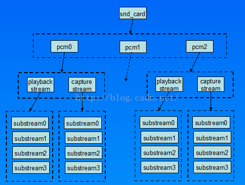
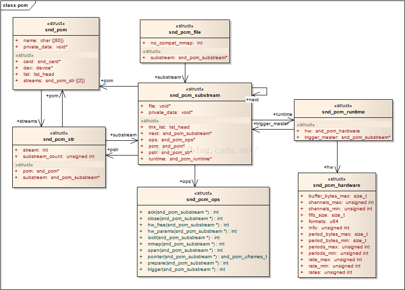
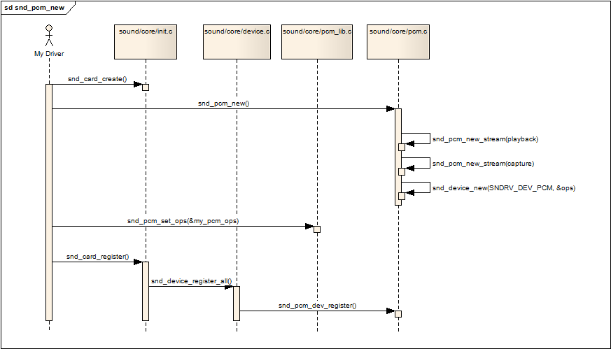
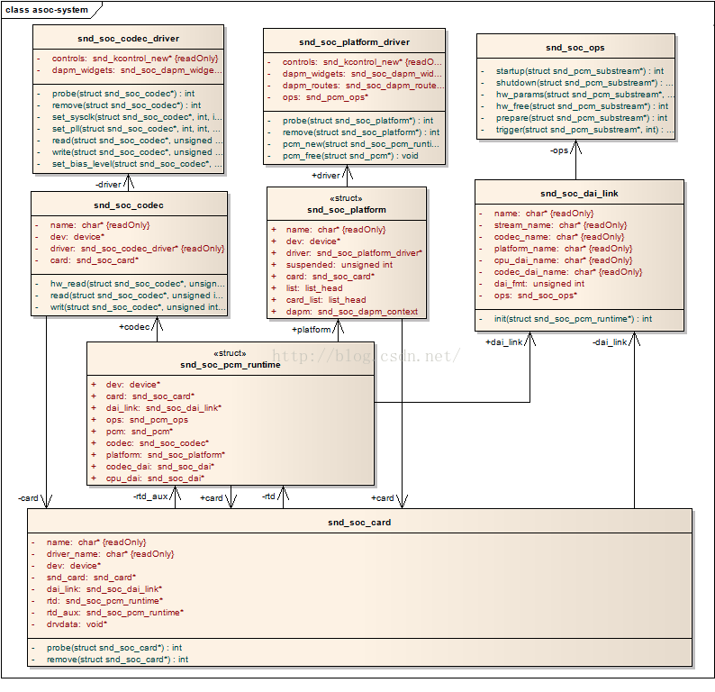
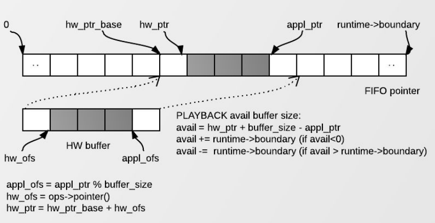

##

###  修订记录
| 修订说明 | 日期 | 作者 | 额外说明 |
| --- |
| 初版 | 2018/06/28 | 员清观 |  |


## 1 alsa应用层编程
ALSA是Advanced Linux Sound Architecture 的缩写，目前已经成为了linux的主流音频体系结构。在内核设备驱动层，ALSA提供了alsa-driver，同时在应用层，ALSA为我们提供了alsa-lib，应用程序只要调用alsa-lib提供的API，即可以完成对底层音频硬件的控制。内核空间中，alsa-soc其实是对alsa-driver的进一步封装，他针对嵌入式设备提供了一些列增强的功能

目前alsa内核提供给用户空间的接口有：
1) information interface(/proc/asound)
2) control interface(/dev/snd/controlCx)
3) Mixer interfacce(/dev/snd/mixerCxDx)
4) PCM interface(/dev/snd/pcmCxDx)
5) Raw MIDI interface(/dev/snd/midiCxDx)
6) Sequencer interface(/dev/snd/seq)
7) Timer interface(/dev/snd/timer)

/dev/snd目录下有效设备文件：
- controlC0 用于声卡的控制，例如通道选择，混音，麦克风的控制等
- pcmC0D0c 用于录音的pcm设备，C0D0代表的是声卡0中的设备0
- pcmC0D0p 用于播放的pcm设备
- timer 定时器

/kernel/sound目录下待学习文件夹:
- core 该目录包含了ALSA驱动的中间层，它是整个ALSA驱动的核心部分
- soc  针对system-on-chip体系的中间层代码
- soc/codecs  针对soc体系的各种codec的代码，与平台无关

重要需要走读文件：
- /sound/core/init.c
-

### 1.1 配置conf
配置文件解析： /usr/share/alsa/alsa.conf /usr/share/alsa/pcm/default.conf /etc/

从正常逻辑考虑，一个PCM设备应该包含录音和放音两个部分，包含两个方向的substream吧？`snd_pcm_new()`应该包含一个录音一个放音

```cpp
// 打开一路pcm,刷新config配置如果是"default",同时type等于SND_CONFIG_TYPE_COMPOUND那么这里对应"empty"
static const char *const build_in_pcms[] = {
    "adpcm", "alaw", "copy", "dmix", "file", "hooks", "hw", "ladspa", "lfloat",
    "linear", "meter", "mulaw", "multi", "null", "empty", "plug", "rate", "route", "share",
    "shm", "dsnoop", "dshare", "asym", "iec958", "softvol", "mmap_emul",
    NULL
};
int snd_pcm_open(snd_pcm_t **pcmp, const char *name, snd_pcm_stream_t stream, int mode)
	int err = snd_config_update();//刷新/system/usr/share/alsa/alsa.conf文件内容到snd_config_t结构中，构建配置树
	|--> return snd_pcm_open_noupdate(pcmp, snd_config, name, stream, mode, 0);//真正执行树创建的例程:构建配置树，创建PCM流
		snd_pcm_open_conf(pcmp, name, root, pcm_conf, stream, mode);
			err = snd_config_get_string(conf, &str);
			open_name = buf;	sprintf(buf, "_snd_pcm_%s_open", str);//根据conf找到str,然后生成回调函数名称
			open_func = snd_dlobj_cache_get(lib, open_name,	SND_DLSYM_VERSION(SND_PCM_DLSYM_VERSION), 1);
			open_func(pcmp, name, pcm_root, pcm_conf, stream, mode); // _snd_pcm_hw_open()

```


### 1.2 状态查询

```cpp
//每个period发送sig给pid
int snd_pcm_async(snd_pcm_t *pcm, int sig, pid_t pid)

struct sndrv_pcm_status {
	int state;			/* stream state */
	struct timespec trigger_tstamp;	/* time when stream was started/stopped/paused */
	struct timespec tstamp;		/* reference timestamp */
	sndrv_pcm_uframes_t appl_ptr;	/* appl ptr */
	sndrv_pcm_uframes_t hw_ptr;	/* hw ptr */
	sndrv_pcm_sframes_t delay;	/* current delay in frames */
	sndrv_pcm_uframes_t avail;	/* number of frames available */
	sndrv_pcm_uframes_t avail_max;	/* max frames available on hw since last status */
	sndrv_pcm_uframes_t overrange;	/* count of ADC (capture) overrange detections from last status */
	int suspended_state;		/* suspended stream state */
	unsigned char reserved[60];	/* must be filled with zero */
};
//这个结构体中包含的有意思信息很多啊。
snd_pcm_status_t *status;
snd_pcm_t *handle;
snd_pcm_status_alloca(&status);
snd_pcm_status(handle, status);

int snd_pcm_status(snd_pcm_t *pcm, snd_pcm_status_t *status)
void snd_pcm_status_get_tstamp(const snd_pcm_status_t *obj, snd_timestamp_t *ptr)
//可以用来判断硬件是否就绪
snd_pcm_state_t snd_pcm_state(snd_pcm_t *pcm);

//驱动层的一些信息
struct sndrv_pcm_info {
	unsigned int device;		/* RO/WR (control): device number */
	unsigned int subdevice;		/* RO/WR (control): subdevice number */
	int stream;			/* RO/WR (control): stream direction */
	int card;			/* R: card number */
	unsigned char id[64];		/* ID (user selectable) */
	unsigned char name[80];		/* name of this device */
	unsigned char subname[32];	/* subdevice name */
	int dev_class;			/* SNDRV_PCM_CLASS_* */
	int dev_subclass;		/* SNDRV_PCM_SUBCLASS_* */
	unsigned int subdevices_count;
	unsigned int subdevices_avail;
	union sndrv_pcm_sync_id sync;	/* hardware synchronization ID */
	unsigned char reserved[64];	/* reserved for future... */
};
int snd_pcm_info(snd_pcm_t *pcm, snd_pcm_info_t *info)

	snd_pcm_info_t *info = NULL;
	snd_pcm_info_alloca(&info);
	snd_pcm_info(dev->handle, info);
	snd_pcm_info_free(info);


//就绪的帧个数
snd_pcm_sframes_t snd_pcm_avail(snd_pcm_t *pcm)
int snd_pcm_delay(snd_pcm_t *pcm, snd_pcm_sframes_t *delayp)
int snd_pcm_avail_delay(snd_pcm_t *pcm,	snd_pcm_sframes_t *availp,　snd_pcm_sframes_t *delayp)
int snd_pcm_htimestamp(snd_pcm_t *pcm, snd_pcm_uframes_t *avail, snd_htimestamp_t *tstamp)
```

```cpp
//两个pcm同步开始和停止
int snd_pcm_link(snd_pcm_t *pcm1, snd_pcm_t *pcm2)
int snd_pcm_unlink(snd_pcm_t *pcm)
//audiobox部分，最好不要基于fr，或者，也应该基于float fr
```

## 2 soc解析



在嵌入式系统中，通常不会像上图中这么复杂，大多数情况下是一个声卡，一个pcm实例，pcm下面有一个playback和capture stream，playback和capture下面各自有一个substream。 下面一张图列出了pcm中间层几个重要的结构，他可以让我们从uml的角度看一看这列结构的关系，理清他们之间的关系，对我们理解pcm中间层的实现方式



snd_pcm是挂在snd_card下面的一个snd_device；snd_pcm中的字段：streams[2]，该数组中的两个元素指向两个snd_pcm_str结构，分别代表playback stream和capture stream；snd_pcm_str中的substream字段，指向snd_pcm_substream结构；snd_pcm_substream是pcm中间层的核心，绝大部分任务都是在substream中处理，尤其是他的ops（snd_pcm_ops）字段，许多user空间的应用程序通过alsa-lib对驱动程序的请求都是由该结构中的函数处理。它的runtime字段则指向snd_pcm_runtime结构，snd_pcm_runtime记录这substream的一些重要的软件和硬件运行环境和参数。



### 2.1 soc结构



个人理解
- imapx-fr1023.c属于machine，文件中`snd_soc_card`定义了所有的`snd_soc_dai_link`，`snd_soc_dai_link`负责连接Platform和Codec
- fr1023.c应该属于codec，定义了`snd_soc_codec_driver`和`snd_soc_dai_driver`
- imapx-i2s.c应该属于platform，定义了`snd_soc_platform_driver`和`snd_soc_dai_driver`
- soc_core.c文件, 主要是initiate和register card,以及control和dapm的功能,都是device管理的内容.
- soc_pcm.c文件, 主要接口是`int soc_new_pcm(struct snd_soc_pcm_runtime *rtd, int num)`,提供alsa访问soc硬件的ops接口


### 2.2 代码解析

#### 2.2.1 devices.c添加codec设备
	请参考下面 `q3f_init_devices()`函数添加codec的过程
#### 2.2.2 db基础
dB是一个比值，是一个数值，是一个纯计数方法，没有任何单位标注。由于它在不同领域有着不同的名称，因此它也代表不同的实际意义。和所有取对数的“单位”一样，分贝有着：数值变小，读写方便；运算方便；符合听感，估算方便。

现行的softvol中，volume每减少15降低3db，声音强度降低到一半

**声音的大小**<br>
在实际日常生活中，住宅小区告知牌上面标示噪音要低于60分贝，也就是要低于60dB，在这里dB（分贝）的定义为噪声源功率与基准声功率比值的对数乘10的数值，不是一个单位，而是一个数值，用来形容声音的大小。0dB是人耳能听到的最微弱的的声音，在90dB环境中听力会受到严重影响。

**无线信号强度**<br>
在无线通讯领域，衡量一个地点的某一无线基站通信信号强度也可以用dB表示。如测的某宾馆402房间的1号无线基站通信信号强度为-90dBm,这里的定义为该房间的有用信号强度与所有信号（包括干扰信号）的比值。常见表示形式：dBm、dBw

**天线增益**<br>
在天线技术方面，dB是衡量天线性能的一个参数，名称为增益。它是指在输入功率相等的条件下，实际天线与理想天线在空间同一点处所产生的信号的功率密度之比。 常见表示形式：dBi、dBd

**其他领域中的意义**<br>
在电子工程领域，放大器增益使用的就是dB [1]  。放大器输出与输入的比值为放大倍数，单位是“倍”，如10倍放大器，100倍放大器。当改用“分贝”做单位时，放大倍数就称之为增益，这是一个概念的两种称呼。
电学中分贝与放大倍数的转换关系为：
A(V)(dB)=20lg(Vo/Vi)；电压增益
A(I)(dB)=20lg(Io/Ii)；电流增益
A(p)(dB)=10lg(Po/Pi)；功率增益

**计算方法**<br>
以功率为例： 信号功率为X = 100000W = 10^5  基准功率为Y=1W dB的值：Lx(dB) = 10*lg(10^5W/1W) dB= 10*lg(10^5) dB= 50 dB
同理： X = 10^-15  Lx(dB) = 10*lg(X) dB= 10*lg(10^-15) dB= -150 dB
一般来讲，在工程中，dB和dB之间只有加减，没有乘除。用得最多的是减法。
dBm 减 dBm 实际上是两个功率相除，信号功率和噪声功率相除就是信噪比（SNR）。比如：30dBm - 0dBm = 1000mW/1mW = 1000 = 30dB。
dBm 加 dBm 实际上是两个功率相乘，没有实际的物理意义。

**分贝的特点**<br>
－3dB也叫半功率点或截止频率点。这时功率是正常时的一半，电压或电流是正常时的1/√2。【∵P=I^2*R或P=U^2/R且10^0.1505=√2】
0dB表示输出与输入或两个比较信号一样大。
简单地说，dB是一个比值，举个例子，音频行业中，功率大一倍即是大3dB。
dBm,dBw,dBu,dBc的含义和之间的关系
dBm是一个考征功率绝对值的值，计算公式为：10lgP（功率值/1mw），这是一个绝对值，0dBm即使1毫瓦所转换的能量。
dBw与dBm一样，dBw是一个表示功率绝对值的单位（也可以认为是以1W功率为基准的一个比值），计算公式为：10lg（功率值/1w）。dBw与dBm之间的换算关系为：0 dBw = 10lg1 W = 10lg1000 mw = 30 dBm,由此可见，0dBw是一个比0dBm大得多的多的单位，功率上相差1000倍，因此专业音频设备上，最典型的例子就是功放，0dB的刻度是最大值，功放的旋钮其实是一个衰减器；
dBu是以.775v电压作为基准值的一个单位参数，dBv则是1V为基准值，因此，0dBv大概等于2.2dBu；它们换算公式是：x dBv = (x + 2.2)dBu
dBc在数字音频系统中比较常见，这也是一个考量相对功率的值。比如某处理器内部设置的0dBc实际等同于是-24dBm；
而我们在统计声音响度或者声压级时也会采用分贝dB作为单位去衡量，这是因为dB的步阶可以如实地反映人对声音的感觉。实践证明，声音的分贝数增加或减少一倍，人耳听觉响度也提高或降低一倍。即人耳听觉与声音功率分贝数成正比。
db dbm dbi dbc dBw 的区别是：
1、dBm和dBw
dBm意即分贝毫瓦。
功率单位 与P（瓦特）换算公式：
10lg ( P(单位为毫瓦特) )=30+10lg(P (单位瓦特))
首先， dB 是一个纯计数单位：dB = 10lgX。dB的意义其实再简单不过了，就是把一个很大（后面跟一长串0的）或者很小（前面有一长串0的）的数比较简短地表示出来。如：
dBm 定义的是 miliwatt。 0 dBm=10lg1mw；
dBw 定义 watt。 0 dBw = 10lg1 W = 10lg1000 mw = 30 dBm。
dB在缺省情况下总是定义功率单位，以 10lg 为计。当然某些情况下可以用信号强度（Amplitude）来描述功和功率，这时候就用 20log 为计。不管是控制领域还是信号处理领域都是这样。比如有时候大家可以看到 dBmV 的表达。
在dB，dBm计算中，要注意基本概念。比如前面说的 0dBw = 10lg1W = 10lg1000mw = 30dBm；又比如，用一个dBm 减另外一个dBm时，得到的结果是dB。如：30dBm - 0dBm = 30dB。
dBm是一个表示功率绝对值的单位，计算公式为：10lg功率值/1mW。
2、dBi 和dBd
dBi和dBd是考征增益的值（功率增益），两者都是一个相对值，但参考基准不一样。dBi的参考基准为全方向性天线，dBd的参考基准为偶极子，所以两者略有不同。一般认为，表示同一个增益，用dBi表示出来比用dBd表示出来要大2. 15。
3、dB
dB是一个表征相对值的值，当考虑甲的功率相比于乙功率大或小多少个dB时，按下面计算公式：
10lg（甲功率/乙功率）
4、dBc
有时也会看到dBc，它也是一个表示功率相对值的单位，与dB的计算方法完全一样。一般来说，dBc 是相对于载波（Carrier）功率而言，在许多情况下，用来度量与载波功率的相对值，如用来度量干扰（同频干扰、互调干扰、交调干扰、带外干扰等以及耦合、杂散等的相对量值，采用dBc的地方也可以用dB。

#### 2.2.3 kcontrol
```cpp
struct snd_kcontrol_new {
	snd_ctl_elem_iface_t iface;	/* interface identifier，当前接触到的都是SNDRV_CTL_ELEM_IFACE_MIXER */
	unsigned int device;		/* device/client number */
	unsigned int subdevice;		/* subdevice (substream) number */
	const unsigned char *name;	/* ASCII name of item */
	unsigned int index;		/* index of item */
	unsigned int access;		/* access rights */
	unsigned int count;		/* count of same elements */
	snd_kcontrol_info_t *info;
	snd_kcontrol_get_t *get;
	snd_kcontrol_put_t *put;
	union {
		snd_kcontrol_tlv_rw_t *c;
		const unsigned int *p;
	} tlv; //tlv字段为该control提供元数据。
	unsigned long private_value;
};

struct snd_ctl_elem_id {
	unsigned int numid;		/* numeric identifier, zero = invalid */
	snd_ctl_elem_iface_t iface;	/* interface identifier */
	unsigned int device;		/* device/client number */
	unsigned int subdevice;		/* subdevice (substream) number */
	unsigned char name[44];		/* ASCII name of item */
	unsigned int index;		/* index of item */ //在控件包含多个numid时，用这个字段来定位他在这多个numid中的偏移量，从而确定它在snd_ctl_elem_value值中的具体位置。
};

//iface:: 字段定义了control的类型，形式为SNDRV_CTL_ELEM_IFACE_XXX，对于mixer是SNDRV_CTL_ELEM_IFACE_MIXER，对于不属于mixer的全局控制，使用CARD；如果关联到某类设备，则是PCM、RAWMIDI、TIMER或SEQUENCER。在这里，我们主要关注mixer。

//numid:: 是在控件注册时(snd_soc_add_codec_controls)分配的唯一标识号. 上层也可以根据numid来找到对应的control，snd_ctl_find_id()也是优先判断上层是否传递了numid，是则直接返回这个numid对应的control。用户层设置numid和control的关联时，可用alsa-lib的snd_mixer_selem_set_enum_item()函数。snd_kcontrol_new结构体并没有numid这个成员，是因为numid是系统自动管理的，原则是该control的注册次序，保存到snd_ctl_elem_value结构体中。

//access:: 字段是访问控制权限。SNDRV_CTL_ELEM_ACCESS_READ意味着只读，这时put()函数不必实现；SNDRV_CTL_ELEM_ACCESS_WRITE意味着只写，这时get()函数不必实现。若control值频繁变化，则需定义 VOLATILE标志。当control处于非激活状态时，应设置INACTIVE标志。

struct soc_mixer_control {
	int min, max, platform_max;
	unsigned int reg, rreg, shift, rshift, invert;
};
//#define SOC_DOUBLE_VALUE(xreg, shift_left, shift_right, xmax, xinvert) \
	((unsigned long)&(struct soc_mixer_control) \
	{.reg = xreg, .rreg = xreg, .shift = shift_left, \
	.rshift = shift_right, .max = xmax, .platform_max = xmax, \
	.invert = xinvert})
//#define SOC_SINGLE_VALUE(xreg, xshift, xmax, xinvert) SOC_DOUBLE_VALUE(xreg, xshift, xshift, xmax, xinvert)
//#define SOC_SINGLE(xname, reg, shift, max, invert) /
{   .iface = SNDRV_CTL_ELEM_IFACE_MIXER, .name = xname, /
    .info = snd_soc_info_volsw, .get = snd_soc_get_volsw,/
    .put = snd_soc_put_volsw, /
    .private_value =  SOC_SINGLE_VALUE(reg, shift, max, invert)
};
//private_value:: 可以通过它给info()、get()和put()函数传递参数。

//#define SOC_DOUBLE_R_TLV(xname, reg_left, reg_right, xshift, xmax, xinvert, tlv_array) /
{   .iface = SNDRV_CTL_ELEM_IFACE_MIXER, .name = (xname),/
    .access = SNDRV_CTL_ELEM_ACCESS_TLV_READ |/
         SNDRV_CTL_ELEM_ACCESS_READWRITE,/
    .tlv.p = (tlv_array), /
    .info = snd_soc_info_volsw_2r, /
    .get = snd_soc_get_volsw_2r, .put = snd_soc_put_volsw_2r, /
    .private_value = (unsigned long)&(struct soc_mixer_control) /
        {.reg = reg_left, .rreg = reg_right, .shift = xshift, /
        .max = xmax, .invert = xinvert}
};
SOC_DOUBLE_R_TLV("Playback Volume", REG_VOL_L, REG_VOL_R, 0, 192, 0, digital_tlv)
//我们仅仅需要将Volume寄存器地址及位偏移，最大值填进去即可，当然这些数据要从Codec的datasheet取得。这里Volume寄存器地址是REG_VOL_L(左声道)和REG_VOL_R(右声道)，位偏移为0，DAC Digital Gain范围是0-192(steps)。

```

**kcontrol命名**<br>
`name`字段是名称标识，这个字段非常重要，因为control的作用由名称来区分，对于名称相同的control，则使用index区分。下面会详细介绍上层应用如何根据name名称标识来找到底层相应的control。name定义的标准是“SOURCE DIRECTION FUNCTION”即“源 方向 功能”，SOURCE定义了control的源，如“Master”、“PCM”等；DIRECTION 则为“Playback”、“Capture”等，如果DIRECTION忽略，意味着Playback和capture双向；FUNCTION则可以是“Switch”、“Volume”和“Route”等。

参考内核源码中的文档ControlNames.txt：

```cpp
This document describes standard names of mixer controls.
Syntax: SOURCE [DIRECTION] FUNCTION

DIRECTION: <nothing> (both directions) Playback / Capture / Bypass Playback / Bypass Capture

FUNCTION: Switch (on/off switch) / Volume / Route (route control, hardware specific)

SOURCE: Master / Master Mono / Hardware Master / Headphone / PC Speaker / Phone / Phone Input / Phone Output / Synth FM Mic Line CD Video / Zoom Video / Aux PCM / PCM Front / PCM Rear / PCM Pan / Loopback / Analog Loopback (D/A -> A/D loopback) / Digital Loopback (playback -> capture loopback - without analog path)  /Mono / Mono Output / Multi ADC Wave Music I2S IEC958

Exceptions: [Digital] Capture Source [Digital] / Capture Switch (aka input gain switch) / [Digital] Capture Volume (aka input gain volume) / [Digital] Playback Switch (aka output gain switch) / [Digital] Playback Volume (aka output gain volume) Tone Control - Switch Tone Control - Bass Tone Control - Treble 3D Control - Switch 3D Control - Center 3D Control - Depth 3D Control - Wide 3D Control - Space 3D Control - Level Mic Boost [(?dB)]

PCM interface: Sample Clock Source { "Word", "Internal", "AutoSync" } Clock Sync Status { "Lock", "Sync", "No Lock" } External Rate /* external capture rate */ Capture Rate /* capture rate taken from external source */

IEC958 (S/PDIF) interface: IEC958 [...] [Playback|Capture] Switch /* turn on/off the IEC958 interface */ IEC958 [...] [Playback|Capture] Volume /* digital volume control */ IEC958 [...] [Playback|Capture] Default /* default or global value - read/write */ IEC958 [...] [Playback|Capture] Mask /* consumer and professional mask */ IEC958 [...] [Playback|Capture] Con Mask /* consumer mask */ IEC958 [...] [Playback|Capture] Pro Mask /* professional mask */ IEC958 [...] [Playback|Capture] PCM Stream /* the settings assigned to a PCM stream */ IEC958 Q-subcode [Playback|Capture] Default /* Q-subcode bits */ IEC958 Preamble [Playback|Capture] Default /* burst preamble words (4*16bits) */
```

可以看到表示方向DIRECTION有五种，其中DIRECTION为空时则表示Playback、Capture双向。

一个标准的kcontrol如：SOC_DOUBLE("PCM Playback Volume", AC97_PHONE, 8, 0, 31, 1)，其中“PCM”为源SOURCE、“Playback”为方向DIRECTION、“Volume”为功能FUNCTION--音量调节，这个kcontrol是调节放音PCM的Volume的。

又如：SOC_SINGLE("Mic Switch", AC97_CD, 15, 1, 1)，其中“Mic”为源SOURCE、方向DIRECTION为空表示Playback和Capture双向、“Switch”为功能FUNCTION--开关切换，这个kcontrol是用于切换Mic开关的。

但实际应用中，并不是所有的kcontrol命名都符合ControlNames.txt规则。如：SOC_SINGLE("ALC Hold Time", AC97_CODEC_CLASS_REV, 8, 15, 0)，这个kcontrol的name只有名为“ALC Hold Time”的SOURCE字段，DIRECTION和FUNCTION都欠缺。


**tlv方式**<br>
```cpp
/* from 0 to 30 dB in 2 dB steps */
static DECLARE_TLV_DB_SCALE(vga_tlv, 0, 200, 0);
static const struct snd_kcontrol_new uda1380_snd_controls[] =
{ ... SOC_SINGLE_TLV("Mic Capture Volume", UDA1380_ADC, 8, 15, 0, vga_tlv), /* VGA_CTRL */ };

static DECLARE_TLV_DB_SCALE(tlv_array, -70, 37, 0);

//DECLARE_TLV_DB_SCALE(name, min, step, mute)宏来构造变量tlv_array。参数name是变量的名字，min是最小值，step是步进值，如果mute=1，当该kcontrol处于最小值时会mute。
//寄存器UDA1380_ADC的偏移8bit处定义了”Mic Capture Volume”，寄存器最大值为15，对应到dB的最小值是0dB，步进值是200*0.01dB=2dB，最大值是15*2dB=30dB，如上这样，寄存器的值与实际增益控制就有一个映射关系了。
```

#### 2.2.4 代码注释

```cpp
//init.c文件中主要函数是下面两个:
int snd_card_create(int idx, const char *xid, struct module *module, int extra_size, struct snd_card **card_ret);
int snd_card_register(struct snd_card *card);
```

```cpp
struct snd_card {
	int number;			/* number of soundcard (index to snd_cards) */

	char id[16];			/* id string of this card */
	char driver[16];		/* driver name */
	char shortname[32];		/* short name of this soundcard */
	char longname[80];		/* name of this soundcard */
	char mixername[80];		/* mixer name */
	char components[128];		/* card components delimited with	space */
	//struct module *module;		/* top-level module 注释掉是为了atom显示问题 */

	void *private_data;
	//void (*private_free) (struct snd_card *card); /* callback for freeing of private data,注释掉是为了atom显示问题 */

	unsigned int last_numid;	/* last used numeric ID */
	struct rw_semaphore controls_rwsem;	/* controls list lock */
	rwlock_t ctl_files_rwlock;	/* ctl_files list lock */
	int controls_count;		/* count of all controls */
	int user_ctl_count;		/* count of all user controls */

	struct snd_info_entry *proc_root;	/* root for soundcard specific files */
	struct snd_info_entry *proc_id;	/* the card id */
	struct proc_dir_entry *proc_root_link;	/* number link to real id */

	struct snd_shutdown_f_ops *s_f_ops; /* file operations in the shutdown state */
	spinlock_t files_lock;		/* lock the files for this card */
	int shutdown;			/* this card is going down */
	int free_on_last_close;		/* free in context of file_release */
	wait_queue_head_t shutdown_sleep;
	atomic_t refcount;		/* refcount for disconnection */
	struct device *dev;		/* device assigned to this card */
	struct device *card_dev;	/* cardX object for sysfs */

	struct list_head devices;	/* 记录该声卡下所有逻辑设备的链表 */
	struct list_head controls;	/* all controls for this card //记录该声卡下所有的控制单元的链表 */
	struct list_head ctl_files;	/* active control files */
	struct list_head files_list;	/* all files associated to this card */
};
struct snd_soc_card {
	const char *name,*long_name,*driver_name;
	struct device *dev;	struct snd_card *snd_card;	struct module *owner;
	struct mutex mutex, dapm_mutex;		bool instantiated;

	int (*probe)(struct snd_soc_card *card);
	int (*late_probe)(struct snd_soc_card *card);
	int (*remove)(struct snd_soc_card *card);

	/* the pre and post PM functions are used to do any PM work before and after the codec and DAI's do any PM work. */
	int (*suspend_pre)(struct snd_soc_card *card);	int (*suspend_post)(struct snd_soc_card *card);
	int (*resume_pre)(struct snd_soc_card *card);	  int (*resume_post)(struct snd_soc_card *card);
	int (*set_bias_level)(struct snd_soc_card *,struct snd_soc_dapm_context *dapm,enum snd_soc_bias_level level);
	int (*set_bias_level_post)(struct snd_soc_card *,struct snd_soc_dapm_context *dapm,enum snd_soc_bias_level level);

	long pmdown_time;

	struct snd_soc_dai_link *dai_link; /* CPU <--> Codec DAI links  */
	struct snd_soc_pcm_runtime *rtd;		int num_links, num_rtd;

	struct snd_soc_codec_conf *codec_conf;/* optional codec specific configuration */
	int num_configs;

	struct snd_soc_aux_dev *aux_dev;/* optional auxiliary devices such as amplifiers or codecs with DAI link unused */
	struct snd_soc_pcm_runtime *rtd_aux;		int num_aux_devs, num_aux_rtd;

	const struct snd_kcontrol_new *controls;
	const struct snd_soc_dapm_widget *dapm_widgets; /* Card-specific routes and widgets */
	const struct snd_soc_dapm_route *dapm_routes;
	int num_controls, num_dapm_routes, num_dapm_widgets;		bool fully_routed;
	struct work_struct deferred_resume_work;
	struct list_head list,codec_dev_list,platform_dev_list,dai_dev_list,widgets,paths,dapm_list,dapm_dirty;
	struct snd_soc_dapm_context dapm; /* Generic DAPM context for the card */
	struct snd_soc_dapm_stats dapm_stats;
	u32 pop_time;			void *drvdata;
};

struct snd_card *snd_cards[SNDRV_CARDS]; //

int snd_pcm_dev_register(struct snd_device *device)
	struct snd_pcm *pcm = device->device_data; struct device *dev = pcm->dev;
	|--> snd_pcm_add(pcm);
		list_add_tail(&newpcm->list, &snd_pcm_devices);
	devtype = SNDRV_DEVICE_TYPE_PCM_PLAYBACK; //或者 devtype = SNDRV_DEVICE_TYPE_PCM_CAPTURE;
	|--> snd_register_device_for_dev(devtype, pcm->card, pcm->device, &snd_pcm_f_ops[cidx], pcm, str, dev);
		//创建设备并绑定snd_pcm结构和snd_pcm_f_ops[]操作函数集，保存到snd_minor结构体HASH。一个card可以包含多个snd_pcm,一个snd_pcm可以包含两个substream，但当前用法，一个snd_pcm包含一个substream.
		struct snd_minor *preg = kmalloc(sizeof *preg, GFP_KERNEL);
		preg->type = type;	preg->card = card ? card->number : -1;	preg->device = dev;	preg->f_ops = f_ops;
		preg->private_data = private_data;	preg->card_ptr = card;
		minor = snd_kernel_minor(type, card, dev);	snd_minors[minor] = preg; //snd_minors每个单元对应一个substream
		preg->dev = device_create(sound_class, device, MKDEV(major, minor), private_data, "%s", name);
	snd_add_device_sysfs_file(devtype, pcm->card, pcm->device, &pcm_attrs);

int soc_new_pcm(struct snd_soc_pcm_runtime *rtd, int num)//初始化rtd，为之绑定pcm和ops
	struct snd_soc_platform *platform = rtd->platform;
	struct snd_soc_dai *codec_dai = rtd->codec_dai;
	struct snd_soc_dai *cpu_dai = rtd->cpu_dai;
	|--> ret = _snd_pcm_new(rtd->card->snd_card, new_name, num, playback,	capture, false, &pcm);//int _snd_pcm_new(struct snd_card *card, const char *id, int device,int playback_count, int capture_count, bool internal,struct snd_pcm **rpcm)
		//申请并初始化一个stream，它包含若干substreams
		static struct snd_device_ops ops = {	...	.dev_register =	snd_pcm_dev_register, ...};
		struct snd_pcm *pcm = kzalloc(sizeof(*pcm), GFP_KERNEL);
		pcm->card = card;	pcm->device = device;	pcm->internal = internal;
		strlcpy(pcm->id, id, sizeof(pcm->id));
		|--> snd_pcm_new_stream(pcm, SNDRV_PCM_STREAM_PLAYBACK, playback_count);//申请并初始化一个substream
			struct snd_pcm_str *pstr = &pcm->streams[stream];
			pstr->stream = stream;pstr->pcm = pcm;pstr->substream_count = substream_count; snd_pcm_stream_proc_init(pstr);
			pstr->substream = substream = kzalloc(sizeof(*substream), GFP_KERNEL);
			substream->pcm = pcm;		substream->pstr = pstr;	substream->number = idx;	substream->stream = stream;
			sprintf(substream->name, "subdevice #%i", idx); substream->buffer_bytes_max = UINT_MAX;
			err = snd_pcm_substream_proc_init(substream); substream->group = &substream->self_group;
			list_add_tail(&substream->link_list, &substream->self_group.substreams);
		snd_pcm_new_stream(pcm, SNDRV_PCM_STREAM_CAPTURE, capture_count);
		|--> snd_device_new(card, SNDRV_DEV_PCM, pcm, &ops); //申请并初始化，然后添加到声卡设备链表中
			struct snd_device *dev = kzalloc(sizeof(*dev), GFP_KERNEL);
			dev->card = card;	dev->type = type; dev->state = SNDRV_DEV_BUILD;
			dev->device_data = device_data; //指向pcm结构
			dev->ops = ops; list_add(&dev->list, &card->devices);
	rtd->pcm = pcm;	pcm->private_data = rtd;
	rtd->ops.open		= soc_pcm_open;		rtd->ops.hw_params	= soc_pcm_hw_params;		rtd->ops.prepare	= soc_pcm_prepare;
	rtd->ops.trigger	= soc_pcm_trigger;		rtd->ops.hw_free	= soc_pcm_hw_free;		rtd->ops.close		= soc_pcm_close;
	rtd->ops.pointer	= soc_pcm_pointer;		rtd->ops.ioctl		= soc_pcm_ioctl;
	snd_pcm_set_ops(pcm, SNDRV_PCM_STREAM_PLAYBACK, &rtd->ops);
	snd_pcm_set_ops(pcm, SNDRV_PCM_STREAM_CAPTURE, &rtd->ops);
	ret = platform->driver->pcm_new(rtd); //imapx-dma.c中imapx_pcm_new()
	pcm->private_free = platform->driver->pcm_free;//imapx_pcm_free_dma_buffers()

int snd_soc_instantiate_card(struct snd_soc_card *card)
	for (i = 0; i < card->num_links; i++)	ret = soc_bind_dai_link(card, i);
	//not active :for (i = 0; i < card->num_aux_devs; i++)	ret = soc_check_aux_dev(card, i);
	|--> ret = snd_card_create(SNDRV_DEFAULT_IDX1, SNDRV_DEFAULT_STR1,	card->owner, 0, &card->snd_card);//↑↑↑↑↑
		struct snd_card *card = kzalloc(sizeof(*card) + extra_size, GFP_KERNEL);
		strlcpy(card->id, xid, sizeof(card->id));
		card->number = idx;card->module = module;INIT_LIST_HEAD(&card->****);//初始化snd_card结构中必要的字段
		err = snd_ctl_create(card);	//建立逻辑设备：Control
		err = snd_info_card_create(card);//建立proc文件中的info节点：通常就是/proc/asound/card0
		card->private_data = (char *)card + sizeof(struct snd_card);//把第一步分配的内存指针放入private_data字段中
	card->snd_card->dev = card->dev; card->dapm.bias_level = SND_SOC_BIAS_OFF;	card->dapm.dev = card->dev;	card->dapm.card = card; list_add(&card->dapm.list, &card->dapm_list);
	ret = card->probe(card);
	|--> ret = soc_probe_link_components(card, i, order);
		ret = soc_probe_codec(card, cpu_dai->codec);
			codec->driver->probe(codec);codec->probed = 1;list_add(&codec->card_list, &card->codec_dev_list);
		ret = soc_probe_codec(card, codec_dai->codec);
		ret = soc_probe_platform(card, platform);
			platform->driver->probe(platform);platform->probed = 1;list_add(&platform->card_list, &card->platform_dev_list);
	|--> ret = soc_probe_link_dais(card, i, order);//int soc_probe_link_dais(struct snd_soc_card *card, int num, int order)
		cpu_dai->platform = platform;	codec_dai->card = card;	cpu_dai->card = card;
		cpu_dai->probed = 1; list_add(&cpu_dai->card_list, &card->dai_dev_list);
		codec_dai->probed = 1; list_add(&codec_dai->card_list, &card->dai_dev_list);
		ret = soc_post_component_init(card, codec, num, 0);
		ret = device_create_file(rtd->dev, &dev_attr_pmdown_time);
		ret = soc_new_pcm(rtd, num);//↑↑↑↑↑
	ret = snd_soc_dai_set_fmt(card->rtd[i].codec_dai, dai_fmt);
	ret = snd_soc_dai_set_fmt(card->rtd[i].cpu_dai, dai_fmt);
	|--> ret = snd_card_register(card->snd_card);
		//声卡的class出现在文件系统的/sys/class/sound/下面
		card->card_dev = device_create(sound_class, card->dev, MKDEV(0, 0), card, "card%i", card->number);//创建sysfs下的设备
		|--> snd_device_register_all(card));//注册所有挂在该声卡下的逻辑设备
			list_for_each_entry(dev, &card->devices, list)	dev->ops->dev_register(dev) //为每个设备调用 snd_pcm_dev_register()
		snd_cards[card->number] = card;
		init_info_for_card(card);
		err = device_create_file(card->card_dev, &card_id_attrs);
		err = device_create_file(card->card_dev, &card_number_attrs);
	card->instantiated = 1;

int soc_probe(struct platform_device *pdev)
	struct snd_soc_card *card = platform_get_drvdata(pdev);//得到 fr1023 (--struct snd_soc_card--)
	card->dev = &pdev->dev;
	|--> return snd_soc_register_card(card);//int snd_soc_register_card(struct snd_soc_card *card)
		dev_set_drvdata(card->dev, card); soc_init_card_debugfs(card);
		card->rtd = devm_kzalloc(card->dev, sizeof(struct snd_soc_pcm_runtime)*(card->num_links+card->num_aux_devs), GFP_KERNEL);
		card->num_rtd = 0;	card->instantiated = 0;	  card->rtd_aux = &card->rtd[card->num_links];
		for (i = 0; i < card->num_links; i++)		card->rtd[i].dai_link = &card->dai_link[i];
		|--> snd_soc_initialize_card_lists(card); //void snd_soc_initialize_card_lists(struct snd_soc_card *card)
			INIT_LIST_HEAD(&card->dai_dev_list);			INIT_LIST_HEAD(&card->codec_dev_list);
			INIT_LIST_HEAD(&card->platform_dev_list);			INIT_LIST_HEAD(&card->widgets);
			INIT_LIST_HEAD(&card->paths);			INIT_LIST_HEAD(&card->dapm_list);
		INIT_LIST_HEAD(&card->list); INIT_LIST_HEAD(&card->dapm_dirty);
		ret = snd_soc_instantiate_card(card);//↑↑↑↑↑

static struct platform_driver soc_driver = {
	.driver		= { 		.name		= "soc-audio", 		.owner		= THIS_MODULE, 		.pm		= &snd_soc_pm_ops, 	},
	.probe		= soc_probe,  	.remove		= soc_remove,
};
int __init snd_soc_init(void) //soc platform driver register
	return platform_driver_register(&soc_driver);

//machine层，添加device，这边定义了snd_soc_card结构
struct snd_soc_dai_link imapx_fr1023_dai[] = {
    [0] = { /* Hifi Playback - for similatious use with voice below */
        .name = "IMAPX FR1023", .stream_name = "soc-audio FR1023 HiFi", .codec_dai_name = "fr1023_dai",
        .ops = &imapx_hifi_ops,}, };
struct snd_soc_card fr1023 = {
	.name		= "fr1023",	.owner		= THIS_MODULE,	.dai_link	= imapx_fr1023_dai,	.num_links	= ARRAY_SIZE(imapx_fr1023_dai),};
struct platform_device imap_iis_device0 = {
	.name = "imapx-i2s",	.id = 0,	.num_resources = ARRAY_SIZE(imap_iis_resource0),	.resource = imap_iis_resource0,};
struct platform_driver imapx_iis_driver = {
	.probe = imapx_iis_dev_probe,	.remove = imapx_iis_dev_remove,	.driver = {		.name = "imapx-i2s",.owner = THIS_MODULE,},
};

//devices.c文件中
void imapx_audio_ctrl_register(struct audio_register *ctrl, int id)
	struct codec_cfg *subdata = imapx_audio_cfg[id].codec;
	sprintf(ctrl->codec_name, "%s.%d-00%x", imapx_audio_cfg[id].name, imapx_audio_cfg[id].ctrl_busnum, ctrl->info->addr); ctrl->info->platform_data = subdata;
	i2c_register_board_info(imapx_audio_cfg[id].ctrl_busnum,ctrl->info, 1);
	sprintf("%s.%d-00%x", imapx_audio_cfg[id].name, imapx_audio_cfg[id].ctrl_busnum, ctrl->info->addr);
void imapx_audio_data_register(struct audio_register *data, int id)
	sprintf(data->cpu_dai_name, "imapx-%s.%d", imapx_audio_cfg[id].data_bus, imapx_audio_cfg[id].data_busnum);
	data->cpu_dai_device = &imap_iis_device0;
	|--> platform_device_register(data->cpu_dai_device);//注册"imapx-i2s"
		device_initialize(&pdev->dev);arch_setup_pdev_archdata(pdev);	return platform_device_add(pdev);
	|--> data->imapx_audio_cfg_init(data->codec_name, data->cpu_dai_name, subdata->i2s_mode, imapx_audio_cfg[id].spdif_en, id);//.codec_name = "fr1023" //int imapx_fr1023_init(char *codec_name, char *cpu_dai_name, enum data_mode data, int enable, int id)//soc platform device register
		|--> struct platform_device *imapx_fr1023_device = platform_device_alloc("soc-audio", -1);
  		struct platform_object *pa = kzalloc(sizeof(struct platform_object) + strlen(name), GFP_KERNEL);
			strcpy(pa->name, name);	pa->pdev.name = pa->name;	pa->pdev.id = id;	device_initialize(&pa->pdev.dev);	pa->pdev.dev.release = platform_device_release;		arch_setup_pdev_archdata(&pa->pdev);
		imapx_fr1023_dai[0].codec_name = codec_name; imapx_fr1023_dai[0].cpu_dai_name = cpu_dai_name;    imapx_fr1023_dai[0].platform_name = cpu_dai_name; 	platform_set_drvdata(imapx_fr1023_device, &fr1023);
		platform_device_add(imapx_fr1023_device);//匹配，然后会调用 soc_probe()
//platform_device_register()和platform_device_alloc()+platform_device_add()的区别，前者自己定义了结构体

void __init q3f_init_devices(void)
	imapx_item_parse(imapx_module_parse_status, ARRAY_SIZE(imapx_module_parse_status));//解析items文件中codec的配置，添加使能的codecs到初始化队列中
	|--> imapx_hwcfg_fix_to_device(imapx_module_parse_status, ARRAY_SIZE(imapx_module_parse_status));//逐个添加item文件中配置的codec
		imapx_audio_ctrl_register(&audio[j], k);
		imapx_audio_data_register(&audio[j], k);
```
## 3 内核pcm文件



声卡部分包含了调试信息的支持,可以增加自己的调试控制程序,当出现aec或者codec的问题的时候,方便调试 snd_info_create_card_entry

## 3.1 pcm_native.c
```cpp
static struct snd_pcm_ops imapx_pcm_ops = {
	.open		= imapx_pcm_open,
	.close		= imapx_pcm_close,
	.ioctl		= snd_pcm_lib_ioctl,
	.hw_params	= imapx_pcm_hw_params,
	.hw_free	= imapx_pcm_hw_free,
	.prepare	= imapx_pcm_prepare,
	.trigger	= imapx_pcm_trigger,
	.pointer	= imapx_pcm_pointer,
	.mmap		= imapx_pcm_mmap,
	.copy		= imapx_pcm_copy,
};

int snd_pcm_lib_ioctl(struct snd_pcm_substream *substream, unsigned int cmd, void *arg)
//其中.ioctl可以定义新的功能, 可以模仿snd_pcm_lib_ioctl函数增加自定义的 #define SNDRV_PCM_IOCTL1_USER_START 8 小的定义交给下面函数,大的定义自定义,这样可以方便在pcm驱动部分调用新增加的imapx_dma控制,减小模块之间的耦合.

```
```cpp
struct file_operations snd_pcm_f_ops[2] = {
	{
		.owner =		THIS_MODULE,
		.write =		snd_pcm_write,
		.aio_write =		snd_pcm_aio_write,
		.open =			snd_pcm_playback_open,
		.release =		snd_pcm_release,
		.llseek =		no_llseek,
		.poll =			snd_pcm_playback_poll,
		.unlocked_ioctl =	snd_pcm_playback_ioctl,
		.compat_ioctl = 	snd_pcm_ioctl_compat,
		.mmap =			snd_pcm_mmap,
		.fasync =		snd_pcm_fasync,
		.get_unmapped_area =	snd_pcm_get_unmapped_area,
	},
	{
		.owner =		THIS_MODULE,
		.read =			snd_pcm_read,
		.aio_read =		snd_pcm_aio_read,
		.open =			snd_pcm_capture_open,
		.release =		snd_pcm_release,
		.llseek =		no_llseek,
		.poll =			snd_pcm_capture_poll,
		.unlocked_ioctl =	snd_pcm_capture_ioctl,
		.compat_ioctl = 	snd_pcm_ioctl_compat,
		.mmap =			snd_pcm_mmap,
		.fasync =		snd_pcm_fasync,
		.get_unmapped_area =	snd_pcm_get_unmapped_area,
	}
};
```

**pcm file创建和销毁**
```cpp
int snd_pcm_open(struct file *file, struct snd_pcm *pcm, int stream)
	err = snd_card_file_add(pcm->card, file);
	|--> err = snd_pcm_open_file(file, pcm, stream);
		struct snd_pcm_substream *substream;
		struct snd_pcm_file *pcm_file = kzalloc(sizeof(*pcm_file), GFP_KERNEL);
		|--> snd_pcm_open_substream(pcm, stream, file, &substream);
			|--> err = snd_pcm_attach_substream(pcm, stream, file, &substream);//为substream申请和初始化runtime
				struct snd_pcm_runtime *runtime = kzalloc(sizeof(*runtime), GFP_KERNEL);
				//status和control都是直接从kernel分配的整page,应该是一个page,这样可以方便之后的mmap操作
				runtime->status = snd_malloc_pages(size, GFP_KERNEL); memset((void*)runtime->status, 0, size);
				runtime->control = snd_malloc_pages(size, GFP_KERNEL); memset((void*)runtime->control, 0, size);
				runtime->status->state = SNDRV_PCM_STATE_OPEN;
				substream->runtime = runtime;	substream->private_data = pcm->private_data;	substream->ref_count = 1;
				substream->f_flags = file->f_flags;	substream->pid = get_pid(task_pid(current));	pstr->substream_opened++;
				*rsubstream = substream;
			err = snd_pcm_hw_constraints_init(substream);
			|--> substream->ops->open(substream); //int imapx_pcm_open(struct snd_pcm_substream *substream)
				struct snd_pcm_runtime *runtime = substream->runtime;
				snd_pcm_hw_constraint_integer(runtime, SNDRV_PCM_HW_PARAM_PERIODS);
				snd_soc_set_runtime_hwparams(substream, &imapx_pcm_hardware);
				struct imapx_runtime_data *prtd = kzalloc(sizeof(struct imapx_runtime_data), GFP_KERNEL);
				runtime->private_data = prtd;
			substream->hw_opened = 1;
			snd_pcm_hw_constraints_complete(substream);
			*rsubstream = substream;
		pcm_file->substream = substream; //这三行代码标示了三个重要节点之间的关联关系
		substream->file = pcm_file;
		file->private_data = pcm_file;
int snd_pcm_release(struct inode *inode, struct file *file)
	struct snd_pcm_file *pcm_file = file->private_data;
	struct snd_pcm_substream *substream = pcm_file->substream;
	struct snd_pcm *pcm = substream->pcm;
	|--> snd_pcm_release_substream(substream);
		snd_pcm_drop(substream);
		|--> substream->ops->hw_free(substream); //int imapx_pcm_hw_free(struct snd_pcm_substream *substream)
			struct imapx_runtime_data *prtd = substream->runtime->private_data;
			snd_pcm_set_runtime_buffer(substream, NULL);
			prtd->params->ops->flush(prtd->params->ch);prtd->params->ops->release(prtd->params->ch,prtd->params->client);
		|--> substream->ops->close(substream);//int imapx_pcm_close(struct snd_pcm_substream *substream)
			struct snd_pcm_runtime *runtime = substream->runtime;
			struct imapx_runtime_data *prtd = runtime->private_data;
			runtime->private_data = NULL; kfree(prtd);
		substream->pcm_release(substream);//void pcm_release_private(struct snd_pcm_substream *substream)
		|--> snd_pcm_detach_substream(substream);//为sublstream释放runtime和其他资源
			struct snd_pcm_runtime *runtime = substream->runtime;
			snd_free_pages((void*)runtime->status,...):	snd_free_pages((void*)runtime->control,...):
			kfree(runtime->hw_constraints.rules);	kfree(runtime);	substream->runtime = NULL;
			put_pid(substream->pid);	substream->pid = NULL;	substream->pstr->substream_opened--;
	kfree(pcm_file);  snd_card_file_remove(pcm->card, file);
int snd_pcm_playback_open(struct inode *inode, struct file *file)
	struct snd_pcm *pcm = snd_lookup_minor_data(iminor(inode), SNDRV_DEVICE_TYPE_PCM_CAPTURE);
	err = snd_pcm_open(file, pcm, SNDRV_PCM_STREAM_CAPTURE);	snd_card_unref(pcm->card);
int snd_pcm_capture_open(struct inode *inode, struct file *file)
	struct snd_pcm *pcm = snd_lookup_minor_data(iminor(inode), SNDRV_DEVICE_TYPE_PCM_PLAYBACK);
	err = snd_pcm_open(file, pcm, SNDRV_PCM_STREAM_PLAYBACK);	snd_card_unref(pcm->card);
```


## 3.2 pcm_lib.c

```cpp
int snd_pcm_lib_read_transfer(struct snd_pcm_substream *substream, unsigned int hwoff, unsigned long data, unsigned int off, snd_pcm_uframes_t frames)
	struct snd_pcm_runtime *runtime = substream->runtime;
	char __user *buf = (char __user *) data + frames_to_bytes(runtime, off);
	char *hwbuf = runtime->dma_area + frames_to_bytes(runtime, hwoff);
	copy_to_user(buf, hwbuf, frames_to_bytes(runtime, frames));//从ring buffer中hwoff位置拷贝frames个帧到上层off位置

snd_pcm_sframes_t snd_pcm_lib_read1(struct snd_pcm_substream *substream, unsigned long data, snd_pcm_uframes_t size, int nonblock, transfer_f transfer)
	struct snd_pcm_runtime *runtime = substream->runtime;
	snd_pcm_uframes_t xfer = 0， offset = 0， avail;
	snd_pcm_update_hw_ptr0(substream, 0);
	while (size > 0)
		appl_ptr = runtime->control->appl_ptr; appl_ofs = appl_ptr % runtime->buffer_size;
		err = transfer(substream, appl_ofs, data, offset, frames);//等待数据就绪，读取合适长度的数据
		appl_ptr += frames;	if (appl_ptr >= runtime->boundary) appl_ptr -= runtime->boundary;
		runtime->control->appl_ptr = appl_ptr;
		size -= frames;

ssize_t snd_pcm_read(struct file *file, char __user *buf, size_t count, loff_t * offset)
	struct snd_pcm_file *pcm_file = file->private_data;
	struct snd_pcm_substream *substream = pcm_file->substream;
	struct snd_pcm_runtime *runtime = substream->runtime;
	count = bytes_to_frames(runtime, count);
	|--> result = snd_pcm_lib_read(substream, buf, count);//snd_pcm_sframes_t snd_pcm_lib_read(struct snd_pcm_substream *substream, void __user *buf, snd_pcm_uframes_t size)
		struct snd_pcm_runtime *runtime = substream->runtime;
		nonblock = !!(substream->f_flags & O_NONBLOCK);
		return snd_pcm_lib_read1(substream, (unsigned long)buf, size, nonblock, snd_pcm_lib_read_transfer);
	return frames_to_bytes(runtime, result);
```

### 3.3 sound.c

```cpp
static struct snd_minor *snd_minors[SNDRV_OS_MINORS]; //子设备号作为索引

int snd_open(struct inode *inode, struct file *file)
	unsigned int minor = iminor(inode);
	struct snd_minor *mptr = snd_minors[minor];		file->f_op = fops_get(mptr->f_ops);
	file->f_op->open(inode, file); //snd_pcm_playback_open() 或者 snd_pcm_capture_open()

void *snd_lookup_minor_data(unsigned int minor, int type)
	struct snd_minor *mreg = snd_minors[minor];
	if (mreg && mreg->type == type)		private_data = mreg->private_data;
	return private_data;

int __init alsa_sound_init(void)
	static int major = CONFIG_SND_MAJOR; snd_major = major; 	snd_ecards_limit = cards_limit;
	register_chrdev(major, "alsa", &snd_fops); //.open =		snd_open,
	snd_info_init();  snd_info_minor_register();
subsys_initcall(alsa_sound_init);
```

### 3.4 init.c
主要是下面两个函数:
```cpp
int snd_card_create(int idx, const char *xid, struct module *module, int extra_size, struct snd_card **card_ret)
int snd_card_register(struct snd_card *card)
```


### 3.4 异步工作方式
音视频同步，需要两者保持相同的设备帧率么？

```cpp
//异步机制
int snd_pcm_open(snd_pcm_t **pcmp, const char *name, snd_pcm_stream_t stream, int mode)
//mode: SND_PCM_NONBLOCK, #SND_PCM_ASYNC
int snd_pcm_async(snd_pcm_t *pcm, int sig, pid_t pid)
//但是，这个period是设备的，通道参数如果不同，需要换算
int snd_async_add_pcm_handler(snd_async_handler_t **handler, snd_pcm_t *pcm, snd_async_callback_t callback, void *private_data)
//限制必须在pcm所在的进程中调用。
int snd_pcm_delay(snd_pcm_t *pcm, snd_pcm_sframes_t *delayp) //了解dma中剩余缓冲大小
或者imapx_dma.c文件中，devicefile中记录当前播放帧个数
或者，通过netlink通知
```
### 3.5 regmap机制
内核3.1引入一套新的API regmap，目的是提取出关于I2C SPI irq等相关注册、使能以及读写的公共部分，以提高代码的可重用性，并且使得在使用如上内核基础组件时变得更为简单易用。

```cpp
int hw_write(struct snd_soc_codec *codec, unsigned int reg, unsigned int value)
	return regmap_write(codec->control_data, reg, value);
unsigned int hw_read(struct snd_soc_codec *codec, unsigned int reg)
	ret = regmap_read(codec->control_data, reg, &val);	return value;

int snd_soc_codec_set_cache_io(struct snd_soc_codec *codec,int addr_bits, int data_bits, enum snd_soc_control_type control)
	struct regmap_config config;
	codec->write = hw_write;	codec->read = hw_read;	codec->bulk_write_raw = snd_soc_hw_bulk_write_raw;
	config.reg_bits = addr_bits;	config.val_bits = data_bits;
	if(SND_SOC_I2C == control) codec->control_data = regmap_init_i2c(to_i2c_client(codec->dev), &config);
	if(SND_SOC_SPI == control) codec->control_data = regmap_init_spi(to_spi_device(codec->dev), &config);
	if(SND_SOC_REGMAP == control)
		codec->using_regmap = true;
		if (!codec->control_data)			codec->control_data = dev_get_regmap(codec->dev, NULL);
		if (codec->control_data)	ret = regmap_get_val_bytes(codec->control_data);
```

```cpp
struct regmap_config {
	const char *name;
	int reg_bits;   // 寄存器地址的位数，必须配置，例如I2C寄存器地址位数为 8
	int reg_stride;
	int pad_bits; 	//寄存器和值之间的填充位数
	int val_bits;   //寄存器值的位数，必须配置

	bool (*writeable_reg)(struct device *dev, unsigned int reg);
	bool (*readable_reg)(struct device *dev, unsigned int reg);
	bool (*volatile_reg)(struct device *dev, unsigned int reg);
	bool (*precious_reg)(struct device *dev, unsigned int reg);
	int (*reg_read)(void *context, unsigned int reg, unsigned int *val);
	int (*reg_write)(void *context, unsigned int reg, unsigned int val);

	regmap_lock lock; 	regmap_unlock unlock; 	void *lock_arg;
	bool fast_io; unsigned int max_register;
	const struct regmap_access_table *wr_table, *rd_table, *volatile_table, *precious_table;
	const struct reg_default *reg_defaults;
	unsigned int num_reg_defaults;
	enum regcache_type cache_type;
	const void *reg_defaults_raw;
	unsigned int num_reg_defaults_raw;
	u8 read_flag_mask, write_flag_mask;
	bool use_single_rw;
	enum regmap_endian reg_format_endian, val_format_endian;
	const struct regmap_range_cfg *ranges;
	unsigned int num_ranges;
};
```

**初始化和释放regmap**
```cpp
struct regmap *regmap_init_spi(struct spi_device *spi, strcut regmap_config *config);
struct regmap *regmap_init_i2c(struct i2c_client *i2c, struct regmap_config *config);

int regmap_write(struct regmap *map, unsigned int reg, unsigned int val);
int regmap_raw_write(struct regmap *map, unsigned int reg, const void *val, size_t val_len);
int regmap_bulk_write(struct regmap *map, unsigned int reg, const void *val, size_t val_count);
int regmap_raw_write_async(struct regmap *map, unsigned int reg, const void *val, size_t val_len);
int regmap_read(struct regmap *map, unsigned int reg, unsigned int *val);
int regmap_raw_read(struct regmap *map, unsigned int reg, void *val, size_t val_len);
int regmap_bulk_read(struct regmap *map, unsigned int reg, void *val, size_t val_count);
int regmap_update_bits(struct regmap *map, unsigned int reg, unsigned int mask, unsigned int val);

void regmap_exit(struct regmap *map);
```

**i2c-spi regmap机制**
`regmap_add_irq_chip()`好像没有被使用过，不再跟踪了
```cpp
int regmap_add_irq_chip(struct regmap *map, int irq, int irq_flags,	int irq_base, const struct regmap_irq_chip *chip,	struct regmap_irq_chip_data **data);
void regmap_del_irq_chip(int irq, struct regmap_irq_chip_data *data);
```

```cpp
int regmap_i2c_write(void *context, const void *data, size_t count)
	struct device *dev = context;
	struct i2c_client *i2c = to_i2c_client(dev);
	ret = i2c_master_send(i2c, data, count);
int regmap_i2c_read(void *context, const void *reg, size_t reg_size, void *val, size_t val_size)
	struct device *dev = context;
	struct i2c_client *i2c = to_i2c_client(dev);
	struct i2c_msg xfer[2];
	xfer[0].addr = i2c->addr;xfer[0].flags = 0;	xfer[0].len = reg_size;	xfer[0].buf = (void *)reg;
	xfer[1].addr = i2c->addr; xfer[1].flags = I2C_M_RD;	xfer[1].len = val_size;	xfer[1].buf = val;
	ret = i2c_transfer(i2c->adapter, xfer, 2);
struct regmap_bus regmap_i2c = {	.write = regmap_i2c_write,	.gather_write = regmap_i2c_gather_write,.read = regmap_i2c_read,};

struct regmap *regmap_init_i2c(struct i2c_client *i2c, const struct regmap_config *config)
	return regmap_init(&i2c->dev, &regmap_i2c, &i2c->dev, config);
struct regmap *devm_regmap_init_i2c(struct i2c_client *i2c, const struct regmap_config *config)
	return devm_regmap_init(&i2c->dev, &regmap_i2c, &i2c->dev, config);
```

```cpp
int regmap_spi_write(void *context, const void *data, size_t count)
	struct device *dev = context;
	struct spi_device *spi = to_spi_device(dev);
	return spi_write(spi, data, count);
int regmap_spi_read(void *context, const void *reg, size_t reg_size, void *val, size_t val_size)
	struct device *dev = context;		struct spi_device *spi = to_spi_device(dev);
	return spi_write_then_read(spi, reg, reg_size, val, val_size);
struct regmap_bus regmap_spi = {	.write = regmap_spi_write,	.read = regmap_spi_read, };

struct regmap *regmap_init_spi(struct spi_device *spi, const struct regmap_config *config)
	return regmap_init(&spi->dev, &regmap_spi, &spi->dev, config);
struct regmap *devm_regmap_init_spi(struct spi_device *spi, const struct regmap_config *config)
	return devm_regmap_init(&spi->dev, &regmap_spi, &spi->dev, config);

```
## 4 语音质量评估

目前国内研究语音相关的团队主要包括科研院所、语音技术公司以及互联网公司三部分：1. 科研院所主要包括高校和科学院，比如科学院里有声学所、自动化所，高校里面研究比较多的清华、北大、西工大、科大、上海交大等，这些都是在语音圈里占有较高位置的老牌队伍。2.语音技术公司包括我们比较熟悉的科大讯飞、云知声、思必驰、极限元等。3. 互联网公司包括BAT、搜狗等拥有强大的语音技术团队来支撑着其本身的很多业务

将会尝试采用主观语音质量评估标准：PESQ算法来量化回声消除效果．PESQ算法可以比较原始和结果两个wav音频文件，比较完毕之后给出对音频质量变化的主观评分．
ITU-T P.862提供了PESQ文档和C代码下载，网上也有基于matlab的实现下载，这种方式应该可行．
因为之前不熟悉aec部分，花了几天时间浏览了alango公司几个文档/G.165/G.168等，没有发现特别合适的算法；中间误以为THD+N(失真率)可以用来量化音效测试，查询了相关音频分析设备和软件，最后发现这个参数应该只是为了测试耳机或功放这种设备的线性度而定的，用来量化aec结果完全不行；后来考虑到高压缩率的编码算法也有失真，和回声消除的性质有几分相似，查询之后发现评估编码和通信质量的PESQ算法比较适合我们的需求．

**相关的几个标准**<br>
重点关注P.831和基于P.862的4个文档：
ITU–T Recommendation G.165 Echo cancellers.
  介绍回声消除的基本原理，测试音源等．
ITU–T Recommendation G.168 Digital network echo cancellers.
  介绍回声消除的基本原理，测试音源等．
ITU–T Recommendation　P.800　Methods for subjective determination of transmission quality
  通用语音主观测试环境和测试方法
ITU–T Recommendation P.830 Subjective performance assessment of telephone-band and wideband digital codecs *
  语音主观测试环境，条件和方法的一些介绍
*ITU–T Recommendation P.831 Subjective performance evaluation of network echo cancellers
  介绍回声消除建立测试环境，各种测试条件，测试方法．但都是基于人工测试，主观评分．
ITU–T Recommendation P.56 　Objective measurement of active speech level.
  语音客观测试的音量/频率响应等指标的测量
ITU–T Recommendation P.862　Perceptual evaluation of speech quality
  主观语音质量评估
ITU–T Recommendation P.862.1 Mapping function for transforming P.862 raw result scores to MOS-LQO
ITU–T Recommendation P.862.2 Wideband extension to Recommendation P.862 for the assessment of wideband telephone networks and speech codecs
ITU–T Recommendation P.862.3 Application guide for objective quality measurement based on Recommendations P.862, P.862.1 and P.862.2
ITU–T Recommendation P.863 Perceptual objective listening quality assessment

**主观评估方法**<br>
主动方式需要发送一个语音参考信号通过电话网络，在网络的另一端采用数字信号处理的方式比较样本信号和接收到的信号，进而估算出网络的语音质量。（注：这里的比较算法基于心理声学（psychoacoustical），而不是简单的信号波形比较。具体算法太复杂，特别强大的同事可以参考ITU的标准文档。）

现在许多客观的测量方法已经出现并被应用，诸如，PSQM (Perceptual Speech Quality Measure定义于ITU-T P.861)/PSQM+感知通话质量测量，PESQ (Perceptual Evaluation of Speech Quality定义于ITU-T P.862)感知评估通话质量测量，PAMS（Perceptual Analysis Measurement System英国电信）感知分析测量等。

PESQ结合了PSQM和 PAMS的优势，针对VoIP和混合的端到端应用作了改进，并针对MOS和MOS-LQ计算方法做了修改。
最开始这些方法被用于测量编码算法，后来也逐渐 应用到VoIP网络系统的测量中，著名的测量仪器生产厂商Agilent的语音质量测量仪器VQT即是代表。
著名的VoIP测试厂商Empirix在G5中也使用了PESQ和PSQM。另外，根据本人瞎猜，XMS-Active也利用了这种方式。

## 5 编解码
### 5.1 libcodecs
```cpp
void *codec_open(codec_info_t *fmt)
	dev = (codec_t)malloc(sizeof(*dev));
	memset(dev, 0, sizeof(*dev)); memcpy(&dev->fmt, fmt, sizeof(codec_info_t));
	dev->codec_mode = codec_check_fmt(fmt);
```

### 5.2 ffmpeg
ffmpeg主目录下主要有libavcodec、libavformat和libavutil等子目录。其中
- libavcodec用于存放各个encode/decode模块，CODEC其实是Coder/Decoder的缩写，也就是编码解码器；用于各种类型声音/图像编解码
- libavformat用于存放muxer/demuxer模块，对音频视频格式的解析;用于各种音视频封装格式的生成和解析，包括获取解码所需信息以生成解码上下文结构和读取音视频帧等功能；
其中库 libavcodec，libavformat用于对媒体文件进行处理，如格式的转换；
- libavutil集项工具，包含一些公共的工具函数；用于存放内存操作等辅助性模块，是一个通用的小型函数库，该库中实现了CRC校验码的产生，128位整数数学，最大公约数，整数开方，整数取对数，内存分配，大端小端格式的转换等功能
- libavdevice：对输出输入设备的支持；
- libpostproc：用于后期效果处理；
- libswscale：用于视频场景比例缩放、色彩映射转换；
- ffmpeg：该项目提供的一个工具，可用于格式转换、解码或电视卡即时编码等；
- fsever：一个 HTTP 多媒体即时广播串流服务器；
- ffplay：是一个简单的播放器，使用ffmpeg 库解析和解码，通过SDL显示
    ffmpeg软件包经编译过后将生成三个可执行文件，ffmpeg，ffserver，ffplay。其中ffmpeg用于对媒体文件进行处理，ffserver是一个http的流媒体服务器，ffplay是一个基于SDL的简单播放器。

muxer/demuxer和encoder/decoder在FFmpeg中的实现代码里，有许多相同的地方，而二者最大的差别是muxer和demuxer分别是不同的结构AVOutputFormat与AVInputFormat，而encoder和decoder都是用的AVCodec结构。二者都是在main()开始的`av_register_all()`函数内初始化的。二者都是以链表的形式保存在全局变量中的。muxer/demuxer是分别保存在全局变量AVOutputFormat *first_oformat与AVInputFormat *first_iformat中的。encoder/decoder都是保存在全局变量AVCodec *first_avcodec中的。
```cpp
//AVFormatContext是FFMpeg格式转换过程中实现输入和输出功能、保存相关数据的主要结构。每一个输入和输出文件，都在如下定义的指针数组全局变量中有对应的实体。
static AVFormatContext *output_files[MAX_FILES];
static AVFormatContext *input_files[MAX_FILES];
//对于输入和输出，因为共用的是同一个结构体，所以需要分别对该结构中如下定义的iformat或oformat成员赋值。对一个AVFormatContext来说，这二个成员不能同时有值，即一个AVFormatContext不能同时含有demuxer和muxer。在main( )函数开头的parse_options( )函数中找到了匹配的muxer和demuxer之后，根据传入的argv参数，初始化每个输入和输出的AVFormatContext结构，并保存在相应的output_files和input_files指针数组中。在av_encode( )函数中，output_files和input_files是作为函数参数传入后，在其他地方就没有用到了。
struct AVInputFormat *iformat;
struct AVOutputFormat *oformat;
//     AVCodecContext保存AVCodec指针和与codec相关数据，如video的width、height，audio的sample rate等。AVCodecContext中的codec_type，codec_id二个变量对于encoder/decoder的匹配来说，最为重要。codec_type保存的是CODEC_TYPE_VIDEO，CODEC_TYPE_AUDIO等媒体类型，codec_id保存的是CODEC_ID_FLV1，CODEC_ID_VP6F等编码方式。
enum CodecType codec_type;     /* see CODEC_TYPE_xxx */
enum CodecID codec_id;         /* see CODEC_ID_xxx */
//AVStream结构保存与数据流相关的编解码器，数据段等信息。比较重要的有如下二个成员，其中codec指针保存的就是encoder或decoder结构 priv_data指针保存的是和具体编解码流相关的数据
AVCodecContext *codec; /**< codec context */
void *priv_data;
```

SDL（Simple DirectMedia Layer）: 是一套开放源代码的跨平台多媒体开发库，使用C语言写成。SDL提供了数种控制图像、声音、输出入的函数，让开发者只要用相同或是相似的代码就可以开发出跨多个平台（Linux、Windows、Mac OS X等）的应用软件。目前SDL多用于开发游戏、模拟器、媒体播放器等多媒体应用领域。

**ffmpeg安装**<br>
配置C++编译开发环境
	sudo apt-get install build-essential
安装自动生成makefile的相关工具
	sudo apt-get install automake1.11
	sudo apt-get install libsdl2-dev
下载ffmpeg源码
	官方下载网址 http://ffmpeg.org/download.html
	git clone git://source.ffmpeg.org/ffmpeg.git ffmpeg
安装编译ffmpeg时所需要的相关工具
	sudo apt-get install yasm
生成makefile及编译
	./configure
	make
	make install
默认是安装在/user/local下，其中：头文件放在/user/local/include目录下，译好的libs放在/user/local/lib目录下，其中，在该目录下还有一个pkgconfig目录，里面存放着每个lib的配置文件，编译好的可执行文件(ffmpeg、ffprobe、ffserver)放在/user/local/bin目录下，文档在/user/local/share/man/man1目录下，同时在/user/local有一个指向此目录的链接，后面打算先学习快速使用ffmpeg，知道ffmpeg总体架构，如何将里面有用的代码提取出来。其实就是熟练使用ffmpeg、ffprobe、ffserver，ffplay

ffmpeg -i source_video.avi input -acodec aac -ab 128kb -vcodec mpeg4 -b 1200kb -mbd 2 -flags +4mv+trell -aic 2 -cmp 2 -subcmp 2 -s 320x180 -title X final_video.mp4

**ffplay命令**<br>
ffplay [选项] ['输入文件']
主要选项
	'-x width'        强制以 "width" 宽度显示
	'-y height'       强制以 "height" 高度显示
	'-an'             禁止音频
	'-vn'             禁止视频
	'-ss pos'         跳转到指定的位置(秒)
	'-t duration'     播放 "duration" 秒音/视频
	'-bytes'          按字节跳转
	'-nodisp'         禁止图像显示(只输出音频)
	'-f fmt'          强制使用 "fmt" 格式
	'-window_title title'  设置窗口标题(默认为输入文件名)
	'-loop number'    循环播放 "number" 次(0将一直循环)
	'-showmode mode'  设置显示模式
	可选的 mode ：
	'0, video'    显示视频
	'1, waves'    显示音频波形
	'2, rdft'     显示音频频带
	默认值为 'video'，你可以在播放进行时，按 "w" 键在这几种模式间切换
	'-i input_file'   指定输入文件

**ffprobe命令**<br>
- `-show_streams` 通过ffprobe -show_frames 命令可以查看视频文件中的帧信息，输出的帧信息使用STREAM标签扩起来：
- `-show_frames`  通过ffprobe -show_frames 命令可以查看视频文件中的帧信息，输出的帧信息使用FRAME标签扩起来：
- `-show_format`  通过ffprobe -show_format 命令可以查看多媒体饿封装格式，其使用FORMAT标签扩起来显示：
- `-show_packets` 查看多媒体数据包信息使用PACKET标签扩起来了
- `-show_data` 查看封装信息
- 其他搜索网上


**ffmpeg常用命令**
	https://blog.csdn.net/pyl574069214/article/details/

```cpp
ffmpeg -formats //查看所有支持的容器格式
ffmpeg -codecs //查看所有编解码器
ffmpeg -filters //查看所有可用的filter
ffmpeg -pix_fmts //查看所有支持的图片格式
ffmpeg -sample_fmts //查看所有支持的像素格式
ffprobe -i money.mp4 //查看媒体信息
ffmpeg -f v4l2 -i /dev/video0 output.mp4 //ffmpeg //获取摄像头/dev/video0并输出.mp4文件
ffplay -f rawvideo -video_size 1920x1080 a.yuv //ffplay播放yuv文件命令
ffprobe -v quiet -print_format json -show_format -show_streams  video.mp4  //获取音视频信息，以json格式返回
或ffprobe -show_format -show_streams video.mp4 //获取音视频信息
ffmpeg -i myvideo.mp4 //获取视频的信息
ffmpeg -i myvideo.mp4 image%d.jpg //将视频分解成图片序列
ffmpeg -i myvideo.mp4 -vn-ar 44100 -ac 2 -ab 192 -f mp3 sound.mp3 //从视频抽出声音，并存为Mp3
   //说明： * 源视频：myvideo.mp4  * 音频位率：192kb/s  * 输出格式：mp3  * 生成的声音：sound.mp3
ffmpeg -i sample.mp4 -vcodec copy -an output.mp4;//分离视频流
ffmpeg -i sample.mp4 -acodec copy -vn output.aac;//分离音频流
ffmpeg -i sample.mp4  -ab 32 -ar 22050 -qscale 10 -s 682*310 -r 15 output.flv //将mp4转为flv
ffmpeg -re -i test.flv -vcodec copy -acodec copy -f flv rtmp://localhost:1935/live/mystream.stream //将本地文件推流
ffmpeg -i test.ts -vcodec copy -f m4v test.264 //TS流解复用
1.ffmpeg推流：ffmpeg  -re  -i  <inputfile>  -vcodec  copy  -f  <format>  rtmp://<ipaddr>
note：-re 按照帧率推送，否则ffmpeg会以最高的速率发送数据；-vcodec copy 否则ffmpeg会重新编码输入的码流
2.ffmpeg拉流：ffplay rtmp://<ipaddr>  -fflags  nobuffer
note：-fflags  nobuffer 无缓存
3.ffmpeg使用gpu加速解码【硬解码】：ffmpeg -hwaccel <hard dirver> -c <decoder> -i <inputfile> -f null --benchmark
//note:-hwaccel cuvid选择硬件加速 -f null 强制不输出解码帧【-f null 可以换成<outfile>】 - -benchmark 测试模式
//example：ffmpeg -hwaccel cuvid -c h264_cuvid -i test.h264 -f null - -benchmark
4.ffmpe使用gpu加速编码【硬编码】
5.ffmpeg剪辑一帧数据（图片）：ffmpeg  -c  <decoder>  -i  <inputfile>  -frames  1  <outfile>
//example: ffmpeg -c h264 -i jetflow-1080p-f2949-0.h264 -frames 1 test.yuv
6.ffplay播放yuv视频 ：ffpaly  -f  rawvideo  -video_size  <width*height>  -pix_fmt <fmt> <inputfile>
//目前就设计到这两种播放格式，貌似默认播放yv21和i420格式的，nv12需要加格式说明
7.ffprobe查看视频信息：ffprobe  <inputfile>
8.ffmpeg剪辑1帧原始视频（图片）：ffmpeg -f rawvideo -video_size <width*height> -i <inputfile> -frames 1 <outfile>
9.ffmpeg裁剪视频:ffmpeg  -i  <inputfile>  -filter_complex crop=dstwidth:dstheight:x:y  -y  <outfile>
10.ffmpeg裁剪原始视频:ffmpeg  -f  rawvideo  -video_size  <width*height>  -i  <inputfile>  -filter_complex crop=dstwidth:dstheight:x:y  -y  <outfile>
```

**mp3编解码范例：**<br>
	https://github.com/rbrito/deprecated-lame-mirror
	https://github.com/lieff/minimp3

### 5.2 wav文件格式解析
WAV文件是在PC机平台上很常见的、最经典的多媒体音频文件。编码包括了两方面内容,一是按一定格式存储数据,二是采用一定的算法压缩数据。WAV格式对音频流的编码没有硬性规定,支持非压缩的PCM(Puls Code Modulation)脉冲编码调制格式,还支持压缩型的微软自适应分脉冲编码调制Microsoft ADPCM(Adaptive Differential Puls Code Modulation)、国际电报联盟(International Telegraph Union)制定的语音压缩标准ITUG.711 a-law、ITU G.711-law、IMA ADPCM、ITU G.723 ADPCM (Yamaha)、GSM 6.10、ITU G.721 ADPCM编码和其它压缩算法。MP3编码同样也可以运用在WAV中,只要安装相应的Decode,就可以播放WAV中的MP3音乐。但一般来讲，我们只是用wav文件来保存Pcm数据流

```cpp
 private byte[] getWaveFileHeader(int sampleRate, int channels, int bitsPerSample, int bytePerSecond, long fileLenIncludeHeader)
 {
    byte[] wavHeader = new byte[44];
    long totalDataLen = fileLenIncludeHeader - 8;
    long audioDataLen = totalDataLen - 36;

    //ckid：4字节 RIFF 标志，大写
    wavHeader[0] = 'R'; wavHeader[1] = 'I'; wavHeader[2] = 'F'; wavHeader[3] = 'F';

    //cksize：4字节文件长度，这个长度不包括"RIFF"标志(4字节)和文件长度本身所占字节(4字节),即该长度等于整个文件长度 - 8
    wavHeader[4] = (byte)(totalDataLen & 0xff); wavHeader[5] = (byte)((totalDataLen >> 8) & 0xff); wavHeader[6] = (byte)((totalDataLen >> 16) & 0xff); wavHeader[7] = (byte)((totalDataLen >> 24) & 0xff);

    //fcc type：4字节 "WAVE" 类型块标识, 大写
    wavHeader[8] = 'W'; wavHeader[9] = 'A'; wavHeader[10] = 'V'; wavHeader[11] = 'E';

    //ckid：4字节 表示"fmt" chunk的开始,此块中包括文件内部格式信息，小写, 最后一个字符是空格
    wavHeader[12] = 'f'; wavHeader[13] = 'm'; wavHeader[14] = 't'; wavHeader[15] = ' ';

    //cksize：4字节，文件内部格式信息数据的大小，过滤字节（一般为00000010H）
    wavHeader[16] = 0x10; wavHeader[17] = 0; wavHeader[18] = 0; wavHeader[19] = 0;

    //FormatTag：2字节，音频数据的编码方式，1：表示是PCM 编码
    wavHeader[20] = 1; wavHeader[21] = 0;

    //Channels：2字节，声道数，单声道为1，双声道为2
    wavHeader[22] = (byte) channels; wavHeader[23] = 0;

    //SamplesPerSec：4字节，采样率，如44100
    wavHeader[24] = (byte)(sampleRate & 0xff); wavHeader[25] = (byte)((sampleRate >> 8) & 0xff); wavHeader[26] = (byte)((sampleRate >> 16) & 0xff); wavHeader[27] = (byte)((sampleRate >> 24) & 0xff);

    //BytesPerSec：4字节，音频数据传送速率, 单位是字节。其值为采样率×每次采样大小。播放软件利用此值可以估计缓冲区的大小；
    wavHeader[28] = (byte)(bytePerSecond & 0xff); wavHeader[29] = (byte)((bytePerSecond >> 8) & 0xff); wavHeader[30] = (byte)((bytePerSecond >> 16) & 0xff); wavHeader[31] = (byte)((bytePerSecond >> 24) & 0xff);

    //BlockAlign：2字节，每次采样的大小 = 采样精度*声道数/8(单位是字节); 这也是字节对齐的最小单位, 譬如 16bit 立体声在这里的值是 4 字节
    wavHeader[32] = (byte)(bitsPerSample * channels / 8); wavHeader[33] = 0;

    //BitsPerSample：2字节，每个声道的采样精度; 譬如 16bit 在这里的值就是16。如果有多个声道，则每个声道的采样精度大小都一样的；
    wavHeader[34] = (byte) bitsPerSample; wavHeader[35] = 0;

    //ckid：4字节，数据标志符（data），表示 "data" chunk的开始。此块中包含音频数据，小写；
    wavHeader[36] = 'd'; wavHeader[37] = 'a'; wavHeader[38] = 't'; wavHeader[39] = 'a';

    //cksize：音频数据的长度，4字节，audioDataLen = totalDataLen - 36 = fileLenIncludeHeader - 44
    wavHeader[40] = (byte)(audioDataLen & 0xff); wavHeader[41] = (byte)((audioDataLen >> 8) & 0xff); wavHeader[42] = (byte)((audioDataLen >> 16) & 0xff); wavHeader[43] = (byte)((audioDataLen >> 24) & 0xff); return wavHeader;
}
```


### aec计算采样长度的公式
```cpp
//find a proper sample num.
int aec_lib_set_sampling_num(int sample_size, int base_size)
{
	int divv = 1, saved_divv = 1;

	while ((sample_size/divv) >= base_size) {
		if (sample_size%divv) {
			divv++;
			continue;
		} else {
			saved_divv = divv;
			divv++;
		}
	}
	aec_sample_num = sample_size/saved_divv;
	aec_sample_size = aec_sample_num * (AEC_UNIFIED_BITWIDTH>>3);

	return 0;
}
```
