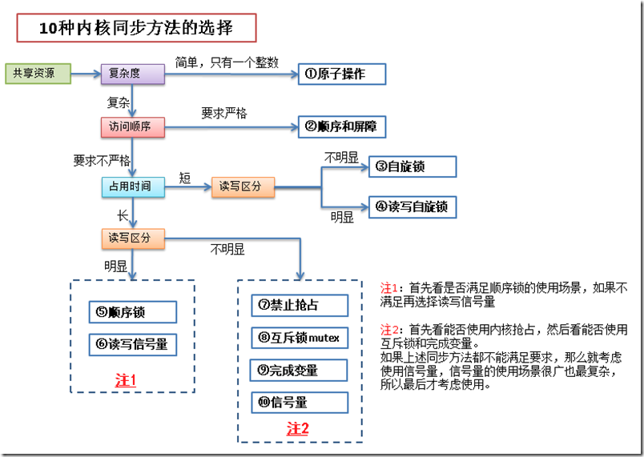
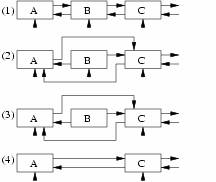
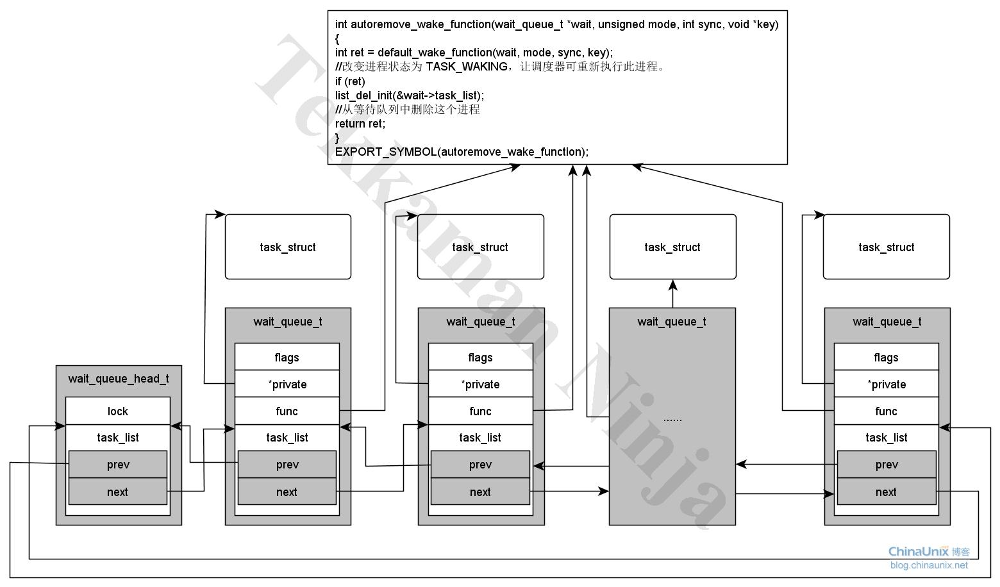
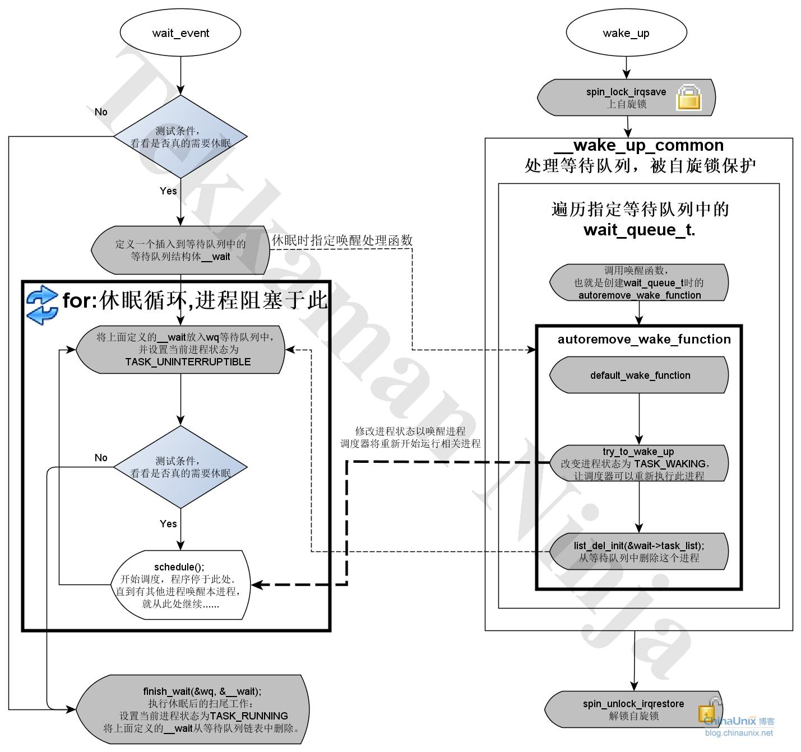
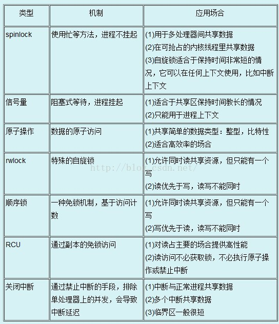

# 常用基本语法

## 0 修订记录1
| 修订说明 | 日期 | 作者 | 额外说明 |
| --- |
| 初版 | 2018/04/10 | 员清观 |  |

//eric <br>可以在表格中作为换行

本文档应该主要由api原型和范例应用构成，不应该保留基本概念的定义。

## 1 基本数据结构类型


## 2 **内核同步机制**

https://blog.csdn.net/williamwang2013/article/category/1331017

永远不要在原子上下文中进入休眠，即当驱动在持有一个自旋锁、seqlock或者 RCU 锁时不能睡眠；关闭中断也不能睡眠，中断例程中也不可休眠；持有一个信号量时休眠是合法的，如果代码在持有一个信号量时睡眠，任何其他的等待这个信号量的线程也会休眠。发生在持有信号量时的休眠必须短暂，而且决不能阻塞那个将最终唤醒你的进程。除非确信其他进程会在其他地方唤醒休眠的进程，否则也不能睡眠。

并发(Concurrency)与竞态(Race condition) 2个概念：
- 临界区 - 也称为临界段，就是访问和操作共享数据的代码段。
- 竞争条件 - 2个或2个以上线程在临界区里同时执行的时候，就构成了竞争条件。
所谓同步，其实防止在临界区中形成竞争条件。如果临界区里是原子操作(即整个操作完成前不会被打断)，那么自然就不会出竞争条件。但在实际应用中，临界区中的代码往往不会那么简单，所以为了保持同步，引入了同步机制。



`ipcs -s`查看当前同步资源情况，包括信号量，队列等


### 2.1 基本概念

**造成竞争条件的原因：**

| 竞争原因             | 说明                                                                                                 |
| -------------------- | ---------------------------------------------------------------------------------------------------- |
| 硬中断                 | 中断随时会发生，也就会随时打断当前执行的代码。如果中断和被打断的代码在相同的临界区，就产生了竞争条件 |
| 软中断和tasklet，底半部　| 软中断和tasklet也会随时被内核唤醒执行，也会像中断一样打断正在执行的代码                              |
| 内核抢占             | 内核具有抢占性，发生抢占时，如果抢占的线程和被抢占的线程在相同的临界区，就产生了竞争条件             |
| 睡眠及用户空间的同步 | 用户进程睡眠后，调度程序会唤醒一个新的用户进程，新的用户进程和睡眠的进程可能在同一个临界区中         |
| 对称多处理           | 2个或多个处理器可以同时执行相同的代码                                                                |
| SMP对称多处理器 |                                                                                                      |

linux2.6.35之后，取消了中断的嵌套，所以中断之间不会形成竞争条件。

**编写内核代码注意事项**
- 这个数据是不是全局的？除了当前线程以外，其他线程能不能访问它？
- 这个数据会不会在进程上下文或者中断上下文中共享？它是不是要在两个不同的中断处理程序中共享？
- 进程在访问数据时可不可能被抢占？被调度的新程序会不会访问同一数据？
- 当前进程会不会睡眠(或者阻塞)在某些资源上，如果是，它会让共享数据处于何种状态？
- 怎样防止数据失控？
- 如果这个函数又在另一个处理器上被调度将会发生什么？

**防止死锁基本原则**

死锁就是所有线程都在相互等待释放资源，导致谁也无法继续执行下去。
- 如果有多个锁的话，尽量确保每个线程都是按相同的顺序加锁，按加锁相反的顺序解锁。(即加锁a->b->c，解锁c->b->a)
- 防止发生饥饿。即设置一个超时时间，防止一直等待下去。
- 不要重复请求同一个锁。
- 设计应力求简单。加锁的方案越复杂就越容易出现死锁。

**控制锁的粒度**

在加锁的时候，不仅要避免死锁，还需要考虑加锁的粒度。锁的粒度对系统的可扩展性有很大影响，在加锁的时候，要考虑一下这个锁是否会被多个线程频繁的争用。如果锁有可能会被频繁争用，就需要将锁的粒度细化。细化后的锁在多处理器的情况下，性能会有所提升。

不过有一点需要提醒的是，锁的粒度越细，系统开销越大，程序也越复杂，所以对于争用不是很频繁的锁，就没有必要细化了。

**同步会否导致休眠和调度，列表**

### 2.2 原子整数和位运算
和底层cpu的原子操作关系密切，对于ARM处理器而言，底层配对使用`LDREX` `STREX`指令，`LDREX`轮询判断内存临界区就绪才会真正执行。因而，原子操作不会导致休眠和调度

原子操作是由编译器来保证的，保证一个线程对数据的操作不会被其他线程打断。
原子操作有2类：
- 原子整数操作，有32位和64位。头文件分别为<asm/atomic.h>和<asm/atomic64.h>
- 原子位操作。头文件 <asm/bitops.h>
- 对于SMP系统，内核还提供了local_t数据类型，实现对单个CPU的整数原子操作，接口函数仅将atomic_替换成local_即可，定义于linux/asm-generic/local.h

原子操作头文件与具体的体系结构有关，比如x86架构的相关头文件在 arch/x86/include/asm/*.h

原子操作主要用来实现资源计数，很多引用计数就是通过原子操作实现的。

从上面的定义来看，atomic_t实际上就是一个int类型的counter，不过定义这样特殊的类型atomic_t是有其思考的：内核定义了若干atomic_xxx的接口API函数，这些函数只会接收atomic_t类型的参数。这样可以确保atomic_xxx的接口函数只会操作atomic_t类型的数据。同样的，如果你定义了atomic_t类型的变量（你期望用atomic_xxx的接口API函数操作它），这些变量也不会被那些普通的、非原子变量操作的API函数接受。

**具体的接口API函数整理如下：**

| 接口函数 | 	描述 |
| :--- |
| void atomic_add(int i, atomic_t *v) 	| 给一个原子变量v增加i |
| void atomic_sub(int i, atomic_t *v) 	| 给一个原子变量v减去i |
| atomic_inc(atomic_t *v) 	| 原子变量的值加一 |
| atomic_dec(atomic_t *v) 	| 原子变量的值减去一 |
|   |   |
| atomic_read(atomic_t *v) 	| 获取原子变量的值 |
| atomic_t counter = ATOMIC_INIT(0);  |  初始化方式 |
| atomic_set（atomic_t *v,int i）	| 设定原子变量的值 |
|   |   |
| atomic_inc_return(atomic_t *v) 	| 更新变量v,并将变量v的最新值返回 |
| int atomic_add_return(int i, atomic_t *v) 	|  |
| atomic_dec_return(atomic_t *v) 	|  |
| int atomic_sub_return(int i, atomic_t *v) 	|  |
|   |   |
| atomic_sub_and_test(int i, atomic_t *v) 	| 给一个原子变量v减去i，并判断变量v的最新值是否等于0 |
| atomic_inc_and_test(atomic_t *v) 	|  |
| atomic_dec_and_test(atomic_t *v) 	|  |
|   |   |
| int atomic_cmpxchg(atomic_t *ptr, int old, int new) 	| 比较old和原子变量ptr中的值，如果相等，那么就把new值赋给原子变量。返回旧的原子变量ptr中的值 |
| atomic_add_negative(int i,atomic_t *v) 	| 给一个原子变量v增加i，并判断变量v的最新值是否是负数 |
| int atomic_add_unless(atomic_t *v, int a, int u) | 	只要原子变量v不等于u，那么就执行原子变量v加a的操作。如果v不等于u，返回非0值，否则返回0值 |

**原子bits操作**

| 原子位操作 | 描述 |
|---|
| void set_bit(int nr, void *addr)  | 原子地设置addr所指对象的第nr位|
| void clear_bit(int nr, void *addr) | 原子地清空addr所指对象的第nr位|
| void change_bit(int nr, void *addr)  | 原子地翻转addr所指对象的第nr位|
| int test_bit(int nr, void *addr)  | 原子地返回addr所指对象的第nr位|
| int test_and_set_bit(int nr, void *addr)  | 原子地设置addr所指对象的第nr位，并返回原先的值|
| int test_and_clear_bit(int nr, void *addr)  | 原子地清空addr所指对象的第nr位，并返回原先的值|
| int test_and_change_bit(int nr, void *addr)  | 原子地翻转addr所指对象的第nr位，并返回原先的值| |


```cpp
//eric #include <asm/atomic.h>
typedef struct {
    int counter;
} atomic_t;
atomic_t counter = ATOMIC_INIT(0);//初始化

//举个简单例子： 为了实现设备只能被一个进程打开，从而避免竞态的出现
static atomic_t scull_available = ATOMIC_INIT(1);      //init atomic
//在scull_open 函数和scull_close函数中：
int scull_open(struct inode *inode, struct file *filp)
{
    struct scull_dev *dev;         // device information

    dev = container_of(inode->i_cdev, struct scull_dev, cdev);
    filp->private_data = dev;         // for other methods
    if(!atomic_dec_and_test(&scull_available)){
        atomic_inc(&scull_available);
        return -EBUSY;
    }
    return 0;         // success
}

int scull_release(struct inode *inode, struct file *filp)
{
    atomic_inc(&scull_available);
    return 0;
}

```

### 2.3 互斥体

```cpp
//eric 经典互斥体 #include<linux/mutex.h>
//经典互斥体结构体：  （会导致无限制优先级反转问题）
struct mutex {
  /* 指示互斥锁的状态：1 没有上锁，可以获得；0 被锁定，不能获得。初始化为没有上锁 */
  atomic_t count;
  spinlock_t wait_lock;//等待获取互斥锁中使用的自旋锁。在获取互斥锁的过程中，操作会在自旋锁的保护中进行。初始化为为锁定
  struct list_head wait_list; //等待互斥锁的进程队列
  struct task_struct *owner;
};
//eric 实时互斥体 #include<linux/trmutex.h>
//实时互斥体结构体：
struct rt_mutex {
  raw_spinlock_t  wait_lock;
  struct plist_head  wait_list;
  struct task_struct   *owner;
};

//操作：
struct mutex my_mutex;
mutex_init(&my_mutex);
void mutex_lock(struct mutex* lock);                       //获取互斥体,不可被信号中断
void mutex_lock_interruptible(struct mutex* lock);     //获取互斥体,可被信号打断
int mutex_lock_killable(struct mutex* lock);       //该函数可被kill信号打断
int mutex_trylock(struct mutex* lock);                     //尝试获取互斥体
void mutex_unlock(struct mutex* lock);                 //释放互斥体
int mutex_is_locked(struct mutex* lock):  //该函数检查互斥锁lock是否处于锁定状态。返回1,表示已锁定;返回0,表示未锁定;

//定义：
  DEFINE_MUTEX(my_mutex);
  //或者：
  struct mutex my_mutex;
  mutex_init(&my_mutex);

mutex_lock(&my_mutex);
...临界区...
mutex_unlock(&my_mutex);
```

DECLARE_MUTEX

### 2.4 内核信号量

由于使用信号量时，线程会睡眠，所以等待的过程不会占用CPU时间。所以信号量适用于等待时间较长的临界区。信号量消耗的CPU时间的地方在于使线程睡眠和唤醒线程，如果 （使线程睡眠 + 唤醒线程）的CPU时间 > 线程自旋等待的CPU时间，那么可以考虑使用自旋锁。
信号量与自旋锁的区别
（1）当锁不能获取到时，使用信号量的开销是进程上下文切换时间，使用自旋锁的开销是等待获取自旋锁；
（2）信号量所保护的临界区可能会引起阻塞，而自旋锁则绝对要避免用来保护包含这样的代码，因为阻塞意味着要进行进程的切换，如果进程被切换出去后，另一个进程企图要获取本自旋锁，死锁就会发生。
（3）信号量存在于进程的上下文，因此，如果保护的共享资源需要在中断或软中断情况下使用，则在信号量和自旋锁之间只能选择自旋锁。当然如果一定要使用信号量，则只能通过down_trylock方式进行，不能获取就立即返回避免阻塞。

| 方法                                   | 描述                                                  |
| -------------------------------------- | ---------------------------------- |
| sema_init(struct semaphore *, int)     | 以指定的计数值初始化动态创建的信号量                               |
| init_MUTEX(struct semaphore *)         | 以计数值1初始化动态创建的信号量                                    |
| init_MUTEX_LOCKED(struct semaphore *)  | 以计数值0初始化动态创建的信号量（初始为加锁状态）                  |
| down_interruptible(struct semaphore *) | 以试图获得指定的信号量，如果信号量已被争用，则进入可中断睡眠状态   |
| down(struct semaphore *)               | 以试图获得指定的信号量，如果信号量已被争用，则进入不可中断睡眠状态 |
| down_trylock(struct semaphore *)       | 以试图获得指定的信号量，如果信号量已被争用，则立即返回非0值        |
| up(struct semaphore *)                 | 以释放指定的信号量，如果睡眠队列不空，则唤醒其中一个任务           |

```cpp
//eric #include <linux/semaphore.h>
struct semaphore {
    spinlock_t        lock;
    unsigned int      count;//相当于信号量的值，大于0，资源空闲；等于0，资源忙，但没有进程等待这个保护的资源；小于0，资源不可用，并至少有一个进程等待资源
    struct list_head  wait_list;  //wait_list则是对申请信号量的进程维护的等待队列
};

//1. 定义信号量
struct semaphore sem;
//2. 初始化方法
  //基本方法
  void sema_init(struct semaphore *sem, int val); //val为信号量初值。
  //也可以用两个宏来定义和初始化信号量的值为1或0：
    DECLARE_MUTEX(name); //定义信号量name并初始化为1
    DECLARE_MUTEX_LOCKED(name); //定义信号量name并初始化为0
  //还可以用下面的函数初始化：
    void init_MUTEX(struct semaphore *sem); //初始化信号量的值为1，在linux3.x中已不存在
    void init_MUTEX_LOCKED(struct semaphore *sem); //相当于初始化信号量的值为0，在linux3.x中已不存在
  //范例
    sema_init(&sem, 1);
//3. 原子操作
  //用来获取信号量，如果信号量值大于或等于0，获取信号量，否则进入睡眠状态，睡眠状态不可唤醒
    void down(struct semaphore *sem);
  //用来获取信号量，如果信号量大于或等于0，获取信号量，否则进入睡眠状态，等待信号量被释放后，激活该程。
    void down_interruptible(struct semephore *sem);
  //该函数用于获得信号量sem;但是它可以被kill信号打断。
    int down_killable(struct semaphore* sem)
  //该函数用于获得信号量sem,它与down()一样,也会导致调用进程睡眠,因此,也不能用于中断上下文;但是它与down()不同的是,在得不到信号量时,该函数不会一直睡眠下去,它只会睡眠一个指定的超时时间jiffies,当该超时时间到达时,仍然没有获得信号量的话,该函数就返回;超时时间jiffies是以系统时钟滴答次数计算。
    int down_timeout(struct semaphore* sem, long jiffies)
  //试图获取信号量，如果信号量已被其他进程获取，则立刻返回非零值，所以调用者不会睡眠，可以在中断上下文中使用
    void down_trylock(struct semaphore *sem);
  //释放信号量，并唤醒等待该资源进程队列的第一个进程。
    void up(struct semaphore *sem);
  //范例
  //在使用down_interruptible()获得信号量的时候,一般都要对返回值进行检查,如果返回非0值,则表示是被信号打断了,通常立即返回-ERESTARTSYS;
    if (down_interruptible(&sem))　 //被信号打断
		  return -ERESTARTSYS;
```

### 2.4.a 用户态POSIX信号量
```cpp
sem_t sem_id;
int sem_init(sem_t *sem, int pshared, unsigned int value);//1) 若pshared==0 用于多线程的同步 2) 若pshared>0 用于多个相关进程间的同步（即由fork产生的）
int sem_getvalue(sem_t *sem, int *sval);
int sem_wait(sem_t *sem); //这是一个阻塞的函数，测试所指定信号量的值，它的操作是原子的。若sem>0，那么它减1并立即返回。若sem==0，则睡眠直到sem>0，此时立即减1，返回
int sem_trywait(sem_t *sem); //非阻塞的函数，其他的行为和sem_wait一样，除了：若sem==0，不是睡眠，而是返回一个错误EAGAIN。
int sem_post(sem_t *sem); //把指定的信号量sem的值加1，呼醒正在等待该信号量的任意线程。
```

**基本例子**
```cpp
//#include <semaphore.h> #include <stdio.h> #include <errno.h> #include <stdlib.h> #include <unistd.h> #include <sys/types.h> #include <sys/stat.h> #include <fcntl.h> #include <sys/mman.h>
int main(int argc,char **argv) { int fd, i, count=0, nloop=10, zero=0, *ptr; sem_t mutex; //open a file and map it into memory fd = open("log.txt", O_RDWR|O_CREAT, S_IRWXU); write(fd, &zero, sizeof(int)); ptr = mmap(NULL, sizeof(int), PROT_READ | PROT_WRITE, MAP_SHARED, fd, 0); close(fd); /* create, initialize semaphore */ if(sem_init(&mutex, 1, 1) < 0) { printf("semaphore initilization\n"); return -1; } if (fork() == 0) { for (i = 0; i < nloop; i++) { sem_wait(&mutex); printf("child: %d\n", (*ptr)++); sem_post(&mutex); } return -1; }  for (i = 0; i < nloop; i++) { sem_wait(&mutex); printf("parent: %d\n", (*ptr)++); sem_post(&mutex); } return 0;
}
```

### 2.4.b 用户态命名信号量
有名信号量在使用的时候，和无名信号量共享sem_wait和sem_post函数。区别是有名信号量使用sem_open代替sem_init，另外在结束的时候要像关闭文件一样去关闭这个有名信号量。
```cpp
sem_t *sem_open(const char *name, int oflag, mode_t mode , int value);// name是文件的路径名； oflag 有O_CREAT或O_CREAT|EXCL两个取值； mode控制新的信号量的访问权限； value指定信号量的初始化值。 注意：这里的name不能写成/tmp/aaa.sem这样的格式，因为在linux下，sem都是创建在/dev/shm目录下。你可以将name写成“/mysem”或“mysem”，创建出来的文件都是“/dev/shm/sem.mysem”，千万不要写路径。也千万不要写“/tmp/mysem”之类的。当oflag = O_CREAT时，若name指定的信号量不存在时，则会创建一个，而且后面的mode和value参数必须有效。若name指定的信号量已存在，则直接打开该信号量，同时忽略mode和value参数。当oflag = O_CREAT|O_EXCL时，若name指定的信号量已存在，该函数会直接返回error。
sem_unlink(const char *name);//从系统中删除信号灯。 注意：在做这个之前，要确定所有对这个有名信号量的引用都已经通过sem_close（）函数关闭了，然后只需在退出或是退出处理函数中调用sem_unlink()去删除系统中的信号量，注意如果有任何的处理器或是线程引用这个信号量，sem_unlink()函数不会起到任何的作用。也就是说，必须是最后一个使用该信号量的进程来执行sem_unlick才有效。因为每个信号灯有一个引用计数器记录当前的打开次数，sem_unlink必须等待这个数为0时才能把name所指的信号灯从文件系统中删除。也就是要等待最后一个sem_close发生。
```
**基本例子**
下面例子中，在server创建和删除sem.
```cpp
//server.c文件
//#include <sys/types.h>
//#include <sys/ipc.h>
//#include <sys/shm.h>
//#include <stdio.h>
//#include <semaphore.h>
//#include <sys/types.h>
//#include <sys/stat.h>
//#include <fcntl.h>
//#define SHMSZ 27

char SEM_NAME[]= "jimmy";

int main(int argc,char **argv) {
    char ch;
    int shmid;
    key_t key;
    char *shm, *s;
    sem_t *mutex;
    key = 1000;

    mutex = sem_open(SEM_NAME, O_CREAT, 0644, 1);
    if(mutex == SEM_FAILED) {
        printf("unable to create semaphore\n");
        sem_unlink(SEM_NAME);
        return -1;
    }

    //create the shared memory segment with this key
    shmid = shmget(key, SHMSZ, IPC_CREAT|0666);
    if(shmid < 0) {
        printf("failure in shmget\n");
        return -1;
    }

    //attach this segment to virtual memory
    shm = shmat(shmid, NULL, 0);

    //start writing into memory
    s = shm;
    for(ch='A'; ch<='Z'; ch++) {
        sem_wait(mutex);
        *s++ = ch;
        sem_post(mutex);
    }
    //the below loop could be replaced by binary semaphore
    while(*shm != '*') {
        sleep(1);
    }

    sem_close(mutex);
    sem_unlink(SEM_NAME);
    shmctl(shmid, IPC_RMID, 0);

    return 0;
}

//client.c文件
//#include <sys/types.h>
//#include <sys/ipc.h>
//#include <stdio.h>
//#include <sys/shm.h>
//#include <semaphore.h>
//#include <sys/types.h>
//#include <sys/stat.h>
//#include <fcntl.h>
//#define SHMSZ 27

char SEM_NAME[]= "jimmy";

int main(int argc,char **argv)
{
    char ch;
    int shmid;
    key_t key;
    char *shm, *s;
    sem_t *mutex;

    key = 1000;
    mutex = sem_open(SEM_NAME, 0, 0644, 0);
    if(mutex == SEM_FAILED) {
        printf("reader:unable to execute semaphore\n");
        sem_close(mutex);
        return -1;
    }

    //create the shared memory segment with this key
    shmid = shmget(key, SHMSZ, 0666);
    if(shmid < 0) {
        printf("reader:failure in shmget\n");
        return -1;
    }

    //attach this segment to virtual memory
    shm = shmat(shmid, NULL, 0);

    //start reading
    s = shm;
    for(s=shm; *s!=NULL; s++) {
        sem_wait(mutex);
        putchar(*s);
        sem_post(mutex);
    }
    //once done signal exiting of reader:This can be replaced by another semaphore
    *shm = '*';
    sem_close(mutex);
    shmctl(shmid, IPC_RMID, 0);

    return 0;
}
```
### 2.5 内核读写信号量
读写信号量与信号量之间的关系类似于自旋锁与读写自旋锁。
读写信号量可能会引起进程阻塞,但是它允许N个读执行单元同时访问共享资源,而最多只允许有一个写执行单元访问共享资源;因此,读写信号量是一种相对放宽条件的、粒度稍大于信号量的互斥机制。
注意：
信号量不允许任何操作之间有并发。

```cpp
//eric #include<linux/rwsem.h> 实际上在arch/X86/include/asm/rwsem.h
//其结构体为：
struct rw_semaphore {
  long count;
  spinlock_t   wait_lock;
  struct list_head wait_list;
};

//在Linux 中，每一个进程都用一个类型为task_t或struct task_struct的结构来描述，该结构的类型为struct mm_struct的字段mm描述了进程的内存映像，特别是mm_struct结构的mmap字段维护了整个进程的内存块列表，该列表将在进程生存期间被大量地遍利或修改。因此mm_struct结构就有一个字段mmap_sem来对mmap的访问进行保护， mmap_sem就是一个读写信号量，在proc文件系统里有很多进程内存使用情况的接口，通过它们能够查看某一进程的内存使用情况，命令free、ps 和top都是通过proc来得到内存使用信息的，proc接口就使用down_read和up_read来读取进程的mmap信息
struct rw_semaphore rw_sem;                                     //定义读写信号量
void init_rwsem(struct rw_semaphore* rw_sem);       //初始化读写信号量
void down_read(struct rw_semaphore* rw_sem);            //获取读信号量
int down_read_trylock(struct rw_semaphore* rw_sem); //尝试获取读信号量
void up_read(struct rw_semaphore* rw_sem);

void down_write(struct rw_semaphore* rw_sem);           //获取写信号量
int down_write_trylock(struct rw_semaphore* rw_sem);//尝试获取写信号量
void up_write(struct rw_semaphore* rw_sem);

用例：
rw_semaphore sem;
init_rwsem(&sem);

down_read(&sem);
...临界区...
up_read(&sem);

down_write(&sem);
...临界区...
up_write(&sem);

void downgrade_write(struct rw_semaphore* sem);
//该函数用于把写者降级为读者,有时,这是必要的。
//因为写者是互斥的、排它的,因此在写者保护读写信号量期间,任何读者或写者都将无法访问该信号量所保护的共享资源,对于那些当前条件下不需要写操作的访问者,降级为写者,将使得等待访问的读者能够立即访问,从而增加了并发性,提高了效率。
```

### 2.6 中断屏蔽
中断屏蔽，禁止了中断和进程调度和异步io等竞争事件发生。中断对系统正常运行很重要，长时间屏蔽很危险，所以中断屏蔽后应尽可能快的执行完毕。

`local_irq`级别API只能禁止本CPU的中断，所以，无法阻止SMP类型竞争。驱动编程中，并不推荐这种方式。单独使用经常意味着BUG，通常应该和自旋锁配合使用。

```cpp
在单CPU中避免竞态的一种简单方法是在进入临界区之前屏蔽系统的中断。由于linux的异步I/O、进程调度等很多内容都依靠中断，所以我们应该尽快的执行完临界区的代码，换句话就是临界区代码应该尽量少。

//eric #include <asm/system.h>
//eric #include <linux/irqflags.h>
void local_irq_disable(void);
void local_irq_enable(void);
void local_irq_save(unsigned long flags);
void local_irq_restore(unsigned long flags);
void local_bh_disable(void); //bottom half
void local_bh_enable(void);
```

### 2.7 内存屏障
为了提高Cache命中率和CPU内存访问效率，会出现编译乱序(编译器优化导致代码执行顺序变化)和执行乱序(合并连续地址的访问以提高效率等)两种场景。
提供两种屏障：
- 内存屏障。`volatile`关键字只能防止内存访问行为的合并，ARM定义了`DMB` `DSB` `ISB`等内存屏障的指令，对应`rmb()`等屏障API。它们主要用在：
  - 自旋锁互斥等同步机制
  - 有次序要求的外设寄存器访问(`writew` `writeb` `writel` `readb` `readl` `readw`)

- 优化屏障barrier()这个接口和编译器有关，对于gcc而言，其代码如下：
  - #define barrier() __asm__ __volatile__("": : :"memory")

优化屏障是和编译器相关的，而内存屏障是和CPU architecture相关的

| 接口名称 | 	作用 |
| --- |
| barrier() | 	优化屏障，阻止编译器为了进行性能优化而进行的memory access reorder |
| mb() | 	内存屏障（包括读和写），用于SMP和UP |
| rmb() | 	读内存屏障，用于SMP和UP |
| wmb() | 	写内存屏障，用于SMP和UP |
| smp_mb() | 	用于SMP场合的内存屏障，对于UP不存在memory order的问题（对汇编指令），因此，在UP上就是一个优化屏障，确保汇编和c代码的memory order是一致的 |
| smp_rmb() | 	用于SMP场合的读内存屏障 |
| smp_wmb() | 	用于SMP场合的写内存屏障 |


### 2.8 complete
表示一个执行单元需要等待另一个执行单元完成某事后方可执行。
- 它是一种轻量级机制，为了完成进程间的同步而设计
- 使用完成量等待时，调用进程是以独占睡眠方式进行等待的
- 不是忙等待

| 方法 | 描述 |
| --- |
| struct completion my_comp;<br>init_completion(struct completion *); | 	初始化指定的动态创建的完成变量 |
| DECLARE_COMPLETION(complete); | 静态地定义和初始化 |
| DECLARE_COMPLETION_ONSTACK(complete); | 创建一个completion结构体放在内核堆栈中 |
|   |   |
| void wait_for_completion(struct completion *); | 	等待指定的完成变量接受信号 |
| void wait_for_completion_interruptible(struct completion *); | 	该函数等待一个完成量被唤醒。但是它可以被外部信号打断; |
| void wait_for_completion_killable(struct completion *); | 	该函数等待一个完成量被唤醒。但是它可以被kill信号打断; |
| void wait_for_completion_timeout(struct completion *, unsigned long timeout); | 	该函数等待一个完成量被唤醒。该函数会阻塞调用进程,如果所等待的完成量没有被唤醒,调用进程也不会一直阻塞下去,而是等待一个指定的超时时间timeout,当超时时间到达时,如果所等待的完成量仍然没有被唤醒,那就返回;超时时间timeout以系统的时钟滴答次数jiffies计算 |
|   |   |
| void try_wait_for_completion(struct completion *); | 	该函数尝试等待一个完成量被唤醒。不管所等待的完成量是否被唤醒,该函数都会立即返回 |
|   |   |
| void completion_done(struct completion *comp); | 	该函数用于检查是否有执行单元阻塞在完成量comp上(是否已经完成),返回0,表示有执行单元被完成量comp阻塞;相当于wait_for_completion_timeout()中的timeout=0 |
| void complete(struct completion *comp); | 	该函数只唤醒一个正在等待完成量comp的执行单元 |
| void complete_all(struct completion *comp);  | 该函数唤醒所有正在等待同一个完成量comp的执行单元 |

```cpp
/* 范例　*/
//eric #include <linux/completion.h>
struct completion {
  unsigned int done;
  wait_queue_head_t wait;
}; //done变量是完成量要保护的对象，wait则是申请完成量的进程等待队列。
static inline void init_completion(struct completion *x)
{
  x->done = 0;
  init_waitqueue_head(&x->wait);
}
//内核代码中wait_for_common函数其实就是对done变量作判断，若done变量没有大于0，则它一直处于while循环中。complete函数就是对done变量加1。wait_for_common函数便会退出while循环，同时将done减1，表示申请完成量成功。

struct completion event;

init_completion(&event);
thread->event = &event;
wait_for_completion(&event);
/* 另外的线程中complete　*/
complete(thread->event);
```

### 2.9 禁止抢占
其实使用自旋锁已经可以防止内核抢占了，但是有时候仅仅需要禁止内核抢占，不需要像自旋锁那样连中断都屏蔽掉。这时候就需要使用禁止内核抢占的方法了

| 方法 | 描述 |
| --- |
| preempt_disable() | 	增加抢占计数值，从而禁止内核抢占 |
| preempt_enable() | 	减少抢占计算，并当该值降为0时检查和执行被挂起的需调度的任务 |
| preempt_enable_no_resched() | 	激活内核抢占但不再检查任何被挂起的需调度的任务 |
| preempt_count() | 	返回抢占计数 |
这里的preempt_disable()和preempt_enable()是可以嵌套调用的，disable和enable的次数最终应该是一样的。禁止抢占的头文件参见：//linux/preempt.h

### 2.10 自旋锁
自旋锁是一种对临界资源进行互斥访问的典型手段，其名来源于它的工作方式。通俗的讲，自旋锁就是一个变量，该变量把一个临界区标记为“我当前在运行，请等待”或者标记为“我当前不在运行，可以被使用”， 如果A执行单元首先获得锁，那么当B进入同一个例程时将获知自旋锁已被持有，需等待A释放后才能进入，所以B只好原地打转（自旋）。
特点：
- 自旋锁主要针对1.SMP或2.单CPU且内核可抢占3.中断的情况，对于单CPU且内核不可抢占的系统自旋锁退化为空操作
- 尽管自旋锁可以保证临界区不受别的CPU和本CPU的抢占进程打扰，但是得到锁的代码路径在执行临界区的时候还可能受到中断和底半部影响，此时应该使用 自旋锁的衍生操作
2>&1
注意，被自旋锁保护的临界区代码执行时，它不能因为任何原因放弃处理器：
- 自旋锁实际上是等于忙等待锁，所以要求占用锁的时间极短
- 对于同一CPU或进程，不可递归使用自旋锁
- 自旋锁锁定期间不能调用可能引起进程调度的函数，比如，`copy_from_user()`,`copy_to_user()`, `kmalloc()`，`msleep()`

信号量和读写信号量适合于保持时间较长的情况，它们会导致调用者睡眠，因此只能在进程上下文使用（_trylock的变种能够在中断上下文使用），而自旋锁适合于保持时间非常短的情况，它可以在任何上下文使用。 如果被保护的共享资源只在进程上下文访问，使用信号量保护该共享资源非常合适，如果对共享资源的访问时间非常短，自旋锁也可以。但是如果被保护的共享资源需要在中断上下文访问（包括底半部即中断处理句柄和顶半部即软中断），就必须使用自旋锁。自旋锁保持期间是抢占失效的，而信号量和读写信号量保持期间是可以被抢占的。

`CONFIG_DEBUG_SPINLOCK`宏可以在UP系统中强行开启spinlock的功能。以arm为例，从存在SMP的ARM构架指令集开始（V6、V7），采用LDREX和STREX指令实现真正的自旋等待。

获得自旋锁和释放自旋锁有好几个版本，因此让读者知道在什么样的情况下使用什么版本的获得和释放锁的宏是非常必要的。
- 如果被保护的共享资源只在进程上下文访问和软中断（包括tasklet、timer）上下文访问，那么当在进程上下文访问共享资源时，可能被软中断打断，从而可能进入软中断上下文来对被保护的共享资源访问，因此对于这种情况，对共享资源的访问必须使用spin_lock_bh和spin_unlock_bh来保护。当然使用spin_lock_irq和spin_unlock_irq以及spin_lock_irqsave和spin_unlock_irqrestore也可以，它们失效了本地硬中断，失效硬中断隐式地也失效了软中断。但是使用spin_lock_bh和spin_unlock_bh是最恰当的，它比其他两个快。　　
- 如果被保护的共享资源只在两个或多个tasklet或timer上下文访问，那么对共享资源的访问仅需要用spin_lock和spin_unlock来保护，不必使用_bh版本，因为当tasklet或timer运行时，不可能有其他tasklet或timer在当前CPU上运行。　
- 如果被保护的共享资源只在一个tasklet或timer上下文访问，那么不需要任何自旋锁保护，因为同一个tasklet或timer只能在一个CPU上运行，即使是在SMP环境下也是如此。实际上tasklet在调用tasklet_schedule标记其需要被调度时已经把该tasklet绑定到当前CPU，因此同一个tasklet决不可能同时在其他CPU上运行。timer也是在其被使用add_timer添加到timer队列中时已经被帮定到当前CPU，所以同一个timer绝不可能运行在其他CPU上。当然同一个tasklet有两个实例同时运行在同一个CPU就更不可能了。
- 如果被保护的共享资源只在一个软中断（tasklet和timer除外）上下文访问，那么这个共享资源需要用spin_lock和spin_unlock来保护，因为同样的软中断可以同时在不同的CPU上运行。　　
- 如果被保护的共享资源在两个或多个软中断上下文访问，那么这个共享资源当然更需要用spin_lock和spin_unlock来保护，不同的软中断能够同时在不同的CPU上运行。　　
- 如果被保护的共享资源在软中断（包括tasklet和timer）或进程上下文和硬中断上下文访问，那么在软中断或进程上下文访问期间，可能被硬中断打断，从而进入硬中断上下文对共享资源进行访问，因此，在进程或软中断上下文需要使用spin_lock_irq和spin_unlock_irq来保护对共享资源的访问。　
- 而在中断处理句柄中使用什么版本，需依情况而定，如果只有一个中断处理句柄访问该共享资源，那么在中断处理句柄中仅需要spin_lock和spin_unlock来保护对共享资源的访问就可以了。因为在执行中断处理句柄期间，不可能被同一CPU上的软中断或进程打断。
- 但是如果有不同的中断处理句柄访问该共享资源，那么需要在中断处理句柄中使用spin_lock_irq和spin_unlock_irq来保护对共享资源的访问。　　
- 在使用spin_lock_irq和spin_unlock_irq的情况下，完全可以用spin_lock_irqsave和spin_unlock_irqrestore取代，那具体应该使用哪一个也需要依情况而定，如果可以确信在对共享资源访问前中断是使能的，那么使用spin_lock_irq更好一些。因为它比spin_lock_irqsave要快一些，但是如果你不能确定是否中断使能，那么使用spin_lock_irqsave和spin_unlock_irqrestore更好，因为它将恢复访问共享资源前的中断标志而不是直接使能中断。　　
- 当然，有些情况下需要在访问共享资源时必须中断失效，而访问完后必须中断使能，这样的情形使用spin_lock_irq和spin_unlock_irq最好。　　
- spin_lock用于阻止在不同CPU上的执行单元对共享资源的同时访问以及不同进程上下文互相抢占导致的对共享资源的非同步访问，而中断失效和软中断失效却是为了阻止在同一CPU上软中断或中断对共享资源的非同步访问

```cpp
//操作
//eric #include<linux/spinlock_types.h>
spinlock_t lock;    //定义自旋锁
spin_lock_init(&lock);    //初始化自旋锁
spin_lock(&lock);    //如不能获得锁，原地打转。
spin_trylock(&lock);    //尝试获得，如能获得锁返回真，不能获得返回假，不在原地打转。
spin_unlock(&lock);    //与spin_lock()和spin_trylock()配对使用。

//自旋锁衍生操作 = 自旋锁+ 中断屏蔽
unsigned long flags;
spin_lock_irq()
spin_unlock_irq()
spin_lock_irqsave()
spin_unlock_irqrestore()
spin_lock_bh()
spin_unlock_bh()

void __lockfunc _spin_lock(spinlock_t *lock)
  preempt_disable();//关闭抢占
  spin_acquire(&lock->dep_map, 0, 0, _RET_IP_);       //自旋锁调试用，在没有定义自旋锁调试的时候是空函数
  _raw_spin_lock(lock);


```

### 2.11 读写锁
读写自旋锁（rwlock）是一种比自旋锁粒度更小的自旋锁机制，它保留了“自旋”的概念。但是在写操作方面，只能最多有一个写进程，在读方面，同时可拥有多个执行单元，当然读和写也不能同时进行。

```cpp
//操作：
//eric #include<linux/rwlock.h>
//eric 或#include<linux/spinlock.h>
//初始化
  rwlock_t x;
  rwlock_init(&x);    //动态初始化
  //或
  rwlock_t x=RW_LOCK_UNLOCKED;    //静态初始化

void read_lock(rwlock_t *lock);    //如果不能获得，它将自旋，直到获得该读写锁
void read_unlock(rwlock_t *lock);
void write_lock(rwlock_t *lock);    //如果不能获得，它将自旋，直到获得该读写锁
void write_unlock(rwlock_t *lock);
//trylock
read_trylock(lock)；
write_trylock(lock);
//irq
read_lock_irq(lock);    //读者获取读写锁，并禁止本地中断
read_unlock_irq(lock);    //读者释放读写锁，并使能本地中断
write_lock_irq(lock);//写者获取读写锁，并禁止本地中断
write_unlock_irq(lock);
read_lock_irqsave(lock, flags);//读者获取读写锁，同时保存中断标志，并禁止本地中断
read_unlock_irqrestores(lock,flags);//读者释放读写锁，同时恢复中断标志，并使能本地中断
write_lock_irqsave(lock,flags);//写者获取读写锁，同时保存中断标志，并禁止本地中断
write_unlock_irqstore(lock,flags);
read_lock_bh(lock);//读者获取读写锁，并禁止本地软中断
read_unlock_bh(lock);
write_lock_bh(lock);//写者获取读写锁，并禁止本地软中断
write_unlock_bh(lock);

用例：
rwlock_t lock;     //定义rwlock
rwlock_init(&lock);    //初始化rwlock
//读时获取锁
read_lock(&lock);
...临界区...
read_unlock(&lock);
 //写时获取锁
write_lock_irqsave(&lock, flags);
…临界区...
write_unlock_irqrestore(&lock, flags);
```

### 2.12 顺序锁
顺序锁是对读写锁的一种优化，顺序锁有一个限制:它必须要求被保护的共享资源中不能含有指针;因为写执行单元可能会使指针失效,当读执行单元如果正要访问该指针时,系统就会崩溃:
- 读执行单元绝对不会被写执行单元阻塞。即读执行单元可以在写执行单元对被顺序锁保护的共享资源进行写操作的同时仍然可以继续读,而不必等待写执行单元完成之后再去读,同样,写执行单元也不必等待所有的读执行单元读完之后才去进行写操作
- 允许读和写操作之间的并发,也允许读与读操作之间的并发，但写与写操作之间只能是互斥的、串行的
- 如果读执行单元在读操作期间，写执行单元已经发生了写操作，那么，读执行单元必须重新去读数据，以便确保读到的数据是完整的
- 要求共享资源中不能含有指针。

它主要用于能够区分读与写的场合，并且是读操作很多、写操作很少，写操作的优先权大于读操作。seqlock的实现思路是，用一个递增的整型数表示sequence。写操作进入临界区时，sequence++；退出临界区时，sequence再++。写操作还需要获得一个锁（比如mutex），这个锁仅用于写写互斥，以保证同一时间最多只有一个正在进行的写操作。当sequence为奇数时，表示有写操作正在进行，这时读操作要进入临界区需要等待，直到sequence变为偶数。读操作进入临界区时，需要记录下当前sequence的值，等它退出临界区的时候用记录的sequence与当前sequence做比较，不相等则表示在读操作进入临界区期间发生了写操作，这时候读操作读到的东西是无效的，需要返回重试。
seqlock写写是必须要互斥的。但是seqlock的应用场景本身就是读多写少的情况，写冲突的概率是很低的。所以这里的写写互斥基本上不会有什么性能损失。而读写操作是不需要互斥的。seqlock的应用场景是写操作优先于读操作，对于写操作来说，几乎是没有阻塞的（除非发生写写冲突这一小概率事件），只需要做sequence++这一附加动作。而读操作也不需要阻塞，只是当发现读写冲突时需要retry。

| 锁对比　| 性质 |
| --- |
| 顺序锁： |允许读和写操作之间的并发,也允许读与读操作之间的并发,但写与写操作之间只能是互斥的、串行的。 |
| 读写自旋锁： |只允许读操作与读操作之间的并发,而读与写操作，写与写操作之间只能是互斥的、串行的。 |
| 自旋锁： |不允许任何操作之间并发。 |

```cpp
1.若读操作期间发生了写操作，则要重读，怎样实现重读呢？
//读操作用例：
do{
    seqnum = read_seqbegin(&seqlock_r);    //读开始
    ……
}while(read_seqretry(&seqlock_r,seqnum));    //读操作期间是否发生写

//写操作用例：
write_seqlock(&lock);
...... //写操作代码
write_sequnlock(&lock);


static __always_inline unsigned read_seqbegin(const seqlock_t *sl)
  unsigned ret = sl->sequence;
  smp_rmb();
  return ret;
static __always_inline int read_seqretry(const seqlock_t *sl, unsigned iv)
  smp_rmb();
  return (iv & 1) | (sl->sequence ^ iv);
从上面的代码可以看出，重读的关键就是对sequence变量的操作。

2.为什么可以允许同时读写，而写操作之间仍然互斥？
static inline void write_seqlock(seqlock_t *sl)
  spin_lock(&sl->lock);
  ++sl->sequence;
  smp_wmb();

static inline void write_sequnlock(seqlock_t *sl)
  smp_wmb();
  sl->sequence++;
  spin_unlock(&sl->lock);

```

写操作其实就是利用自旋锁是对sequence变量的保护，进程在申请写锁的时候，只是简单的将sequence变量的值增1
对于写操作，首先将sequence变量的值保存下来（这时候已在do-while循环中），然后在read_seqretry函数中作判断，检测当前的读锁变量是否发生变化，若发生变化，则调用写锁函数，sequence变量的值增1，重新读；若不发生变化，则表示申请读锁成功

```cpp
//eric #include <linux/seqlock.h>
typedef struct {
  unsigned sequence;
  spinlock_t lock;
} seqlock_t;
//初始化：
  seqlock_t x;
  seqlock_init(x);       //动态初始化
  //或者
  DEFINE_SEQLOCK(x);     //静态初始化

//写
  void write_seqlock(seqlock_t* sl);        //写加锁
  int write_tryseqlock(seqlock_t* sl);      //尝试写加锁
  write_seqlock_irqsave(lock, flags);      //local_irq_save() + write_seqlock()
  write_seqlock_irq(lock);                  //local_irq_disable() + write_seqlock()
  write_seqlock_bh(lock);                  //local_bh_disable() + write_seqlock()

  void write_sequnlock(seqlock_t* sl);         //写解锁
  write_sequnlock_irqrestore(lock, flags);     //write_sequnlock() + local_irq_restore()
  write_sequnlock_irq(lock);                   //write_sequnlock() + local_irq_enable()
  write_sequnlock_bh(lock);                    //write_sequnlock() + local_bh_enable()

A.读操作:
  unsigned int read_seqbegin(const seqlock_t* sl);
  read_seqbegin_irqsave(lock, flags);          //local_irq_save() + read_seqbegin()
读执行单元在访问共享资源时要调用顺序锁的读函数,返回顺序锁s1的顺序号;该函数没有任何获得锁和释放锁的开销,只是简单地返回顺序锁当前的序号;
B.重读操作:
  int read_seqretry(const seqlock_t* sl, unsigned start);
  int read_seqretry_irqrestore(seqlock_t *lock, unsigned int seq, unsigned long flags);
在顺序锁的一次读操作结束之后,调用顺序锁的重读函数,用于检查是否有写执行单元对共享资源进行过写操作;如果有,则需要重新读取共享资源;iv为顺序锁的顺序号;


unsigned int seq_num = 0;
do {
  seq_num = read_seqbegin(&seqlock);
  //读操作代码
  ......
} while(read_seqretry(&seqlock, seq_num));
```

NOTE:　如果写执行单元在操作被顺序锁保护的共享资源时已经保持了互斥锁保护对共享资源的写操作,即:写执行单元与写执行单元之间已经是互斥的,但是读执行单元仍然可以与写执行单元同时访问,那么这种情况下仅需要使用顺序计数(struct seqcount)即可,而不必使用spinlock。
使用顺序计数必须非常小心,只有确定在访问共享资源时已经保持了互斥锁才可以使用;即:只有写操作与写操作之间已经是互斥的、串行的时,才可以使用顺序计数。

### 2.13 RCU：读-拷贝-更新
众所周知，为了保护共享数据,需要一些同步机制,如自旋锁(spinlock)，读写锁(rwlock)，它们使用起来非常简单,而且是一种很有效的同步机制，在UNIX系统和Linux系统中得到了广泛的使用，但是它存在两个问题:
- 它的开销相对于CPU速度而言就越来越大
随着计算机硬件的快速发展，获得这种锁的开销相对于CPU的速度在成倍地增加，原因很简单，CPU的速度与访问内存的速度差距越来越大，而这种锁使用了原子操作指令，它需要原子地访问内存，也就说获得锁的开销与访存速度相关，另外在大部分非x86架构上获取锁使用了内存屏障(Memory Barrier)，这会导致处理器流水线停滞或刷新，因此它的开销相对于CPU速度而言就越来越大
- 可扩展性

RCU它克服了以上锁的缺点，具有很好的扩展性，但是这种锁机制的使用范围比较窄，它只适用于读多写少的情况，如网络路由表的查询更新、设备状态表的维护、数据结构的延迟释放以及多径I/O设备的维护等:
- 对于被RCU保护的数据，读执行单元不需要获得任何锁就可以访问它，不使用原子指令，而且在除了Alpha的所有架构上不需要内存栅（Memory Barrier），因此不会导致锁竞争，内存延迟以及流水线停滞。
- 使用RCU的写执行单元在访问共享数据前先复制一个副本，然后对副本进行操作，最后使用一个回调机制在适当的时机把指向原数据的指针重新指向被修改的副本。这个时机就是在所有引用该数据的CPU都退出对共享数据的操作的时候。
- 读执行单元没有任何同步开销，而写执行单元的同步开销则取决于使用的写执行单元间的同步机制。
- 相比读写锁，RCU的优点在于既允许多个读执行单元同时访问被保护的数据，又允许多个读执行单元和多个写执行单元同时访问被保护的数据。
- RCU不能替代读写锁，如果写比较多时，对读执行的性能提高不能弥补写执行导致的损失。使用RCU，写执行单元之间的同步开销会比较大，它需要延迟数据的释放，复制被修改的数据，它也必须使用某种锁机制同步并行的其它写执行单元的修改操作。

```cpp
//eric #include<linux/rcupdate.h>
//1.读锁定
 rcu_read_lock();
 rcu_read_lock_bh();
//2.读解锁
 rcu_read_unlock();
 rcu_read_unlock_bh();
//3.同步RCU
 sysnchronize_rcu();
//由RCU写执行单元调用，它将阻塞写执行单元，直到所有的读执行单元已经完成读执行单元临界区，才会继续下一下操作。如果有多个RCU写执行单元调用该函数，它们将在下一个grace period(所有的读执行已经完成对临界区的访问)之后全部被唤醒。synchronize_rcu()保证所有的CPU都处理完正在运行的读执行单元临界区。
 synchronize_kernel();
//内核代码使用该函数来等待所有CPU处于可抢占状态，目前功能等同于sysnchronize_rcu()，但现在是使用sysnchronize_sched(),它能保证正在运行的中断处理函数运行完毕，但不能保证正在运行的软中断处理完毕。

//4.连接回调
void fastcall call_rcu(struct rcu_head *head,void (*func)(struct rcu_head *rcu));
//函数call_rcu()也由RCU写执行单元调用，它不会使写执行单元阻塞，因面可以在中断上下文或软中断使用。该函数将把函数func挂接到RCU回调函数上，然后立即返回。函数synchronize_rcu()的实现实际上使用了call_rcu()函数。
void fastcall call_rcu_bh(struct rcu_head *head,void (*func)(struct rcu_head *rcu));
//call_rcu_bh()的功能几乎与call_rcu()完全相同，唯一的差别就是它把软中断的完成当做经历一个quiesecent state（静默状态），因此如果写执行单元使用了该函数，在进程上下文的读执行单元必须使用rcu_read_lock_bh().
//每个CPU维护两个数据结构rcu_date和rcu_bh_date,它们用于保存回调函数，函数call_rcu()把回调函数注册到rcu_date,call_rcu_bh()则把回调函数注册到rcu_bh_date,在每一个数据结构上，回调函数被注册到一个链表，先注册的排到前面，后注册排到末尾。
```

使用RCU时，读执行单元必须提供一个信号给写执行者能够确定数据可以被安全地释放或修改的时机。等待适当时机的这一时期称为grace period，而CPU发生了上下文切换称为经历一个quiescent state，grace period就是所有CPU都经历一次quiescent state所需要的等待的时间，调用grace period后一个专门的垃圾回收器不断探测读执行单元的信号，一旦所有的读执行单元都已经发送信号告知它们都不在使用被CRU保护的数据结构，垃圾回收器就调用回收函数完成最后的数据释放或修改操作。

以下以链表元素删除为例详细说明这一过程。
写者要从链表中删除元素 B，它首先遍历该链表得到指向元素 B 的指针，然后修改元素 B 的前一个元素的 next 指针指向元素 B 的 next 指针指向的元素C，修改元素 B 的 next 指针指向的元素 C 的 prep 指针指向元素 B 的 prep指针指向的元素 A,在这期间可能有读者访问该链表，修改指针指向的操作是原子的，所以不需要同步，而元素 B 的指针并没有去修改，因为读者可能正在使用 B 元素来得到下一个或前一个元素。写者完成这些操作后注册一个回调函数以便在 grace period 之后删除元素 B，然后就认为已经完成删除操作。垃圾收集器在检测到所有的CPU不在引用该链表后，即所有的 CPU 已经经历了 quiescent state,grace period 已经过去后，就调用刚才写者注册的回调函数删除了元素 B。



```cpp
//5.RCU链表操作
static inline void list_add_rcu(struct list_head *new, struct list_head *head);
//该函数把链表元素插入到CRU保护的链表head的开头，内存栅保证了在引用这个新插入的链表元素之前，新链表元素的链接指针的修改对所有读执行单元是可见的。
static inline void list_add_tail_rcu(struct list_head *new, struct list_head *head);
//该函数类似于list_add_rcu(),它将新的链表元素new被添加到被CRU保护的链表的末尾。
static inline void list_del_rcu(struct list_head *entry);
//该函数从RCU保护的链表中删除指定的链表元素entry。
static inleine void list_replace_rcu(struct list_head* old, struct list_head *new);
//该函数是RCU新添加的函数，度不存在非RCU版本。它使用新指针new代替old,内存栅保证在引用新元素之前，它对链接指针的修正对所有读者是可见的。
list_for_each_rcu(pos,head);
//该宏用于遍历由RCU保护的链表head，只要在读执行单元临界区使用该函数，它就可以安全地和其它_rcu链表操作函数并发运行如list_add_rcu().
list_for_each_safe_rcu(pos, n, head);
//该宏类似于list_for_rcu(),不同之处在于它允许安全在删除当前的链表元素pos。
list_for_each_entry_rcu(pos, head, member);
//该宏类似于list_for_each(),不同之处在于它用于遍历指定类型的数据结构链表，当前元素pos为一包含struct list_head结构的特定的数据结构。

//6.RCU HASH表操作
static inline void hlist_add_head_rcu(struct hlist_node *n, struct list_head *h);
//该函数用于把链表元素n插入到被RCU保护的哈希链表的开头，但同时允许读执行者对该哈希链表的遍历。内存栅确保在引用新链表元素之前，它对指针的修改对所有读执行单元可见。
static inline hlist_del_rcu(struct hlist_node *n);
//它从由RCU保护的哈希链表中移走链表元素n。
hlist_for_each(pos, head);
//该宏用于遍历由RCU保护的哈希链表head，只要在读端临界区使用该函数，它就可安全地和其它_rcu哈希链表操作函数（如list_add_rcu）并发地运行。
hlist_for_each_entry_rcu(tpos, pos, head, member);
//似于hlist_for_each(),不同之处在于它用于遍历指定类型的数据结构链表，当前元素pos为一包含struct list_head结构的特定的数据结构。
```

目前，RCU的使用在内核中已经非常普遍，大量原先使用读写锁的代码被RCU替代。RCU还可用于实现对链表、映射、hash表等的操作进行同步保护;事实上,内核中已经实现了RCU版本的链表操作函数

### 2.14 休眠机制和等待队列
休眠是为在一个当前进程等待暂时无法获得的资源或者一个event的到来时（原因），避免当前进程浪费CPU时间（目的），将自己放入进程等待队列中，同时让出CPU给别的进程（工作）。休眠就是为了更好地利用CPU。一旦资源可用或event到来，将由内核代码（可能是其他进程通过系统调用）唤醒某个等待队列上的部分或全部进程。从这点来说，休眠也是一种进程间的同步机制。休眠是针对进程，也就是拥有task_struct的独立个体。

进程进入休眠状态，必然是他自己的代码中调用了某个系统调用，而这个系统调用中存在休眠代码。这个休眠代码在某种条件下会被激活，从而让改变进程状态，说到底就是以各种方式包含了：1、条件判断语句;2、进程状态改变语句;3、schedule(); 进程被置为休眠，意味着它被标识为处于一个特殊的状态（TASK_UNINTERRUPTIBLE或 TASK_INTERRUPTIBLE），并且从调度器的运行队列中移走。这个进程将不在任何 CPU 上被调度，即不会被运行。 直到发生某些事情改变了那个状态（to TASK_WAKING）。这时处理器重新开始执行此进程，此时进程会再次检查是否需要继续休眠（资源是否真的可用？），如果不需要就做清理工作，并将自己的状态调整为TASK_RUNNING。

进程在休眠后，就不再被调度器执行，就不可能由自己唤醒自己，也就是说进程不可能“睡觉睡到自然醒”。唤醒工作必然是由其他进程或者内核本身来完成的。唤醒需要改变进程的task_struct中的状态等，代码必然在内核中，所以唤醒必然是在系统调用的实现代码中（如你驱动中的read、write方法）以及各种形式的中断代码（包括软、硬中断）中。如果在系统调用代码中唤醒，则说明是由其他的某个进程来调用了这个系统调用唤醒了休眠的进程。如果是中断中唤醒，那么可以说是内核完成了唤醒的任务。


```cpp
wait_event(wq, condition)                                       //等待事件,不可中断
wait_event_interruptible(wq, condition)                         //等待事件,可中断
wait_event_timeout(wq, condition, timeout)                      //超时等待,不可中断
wait_event_interruptible_timeout(wq, condition, timeout)        //超时等待,可中断

wake_up(x)                                                     //唤醒一个进程,不可中断
wake_up_interruptible(x)                                       //唤醒一个进程,可中断
//#define wake_up_nr(x, nr)       __wake_up(x, TASK_NORMAL, nr, NULL)  //唤醒nr个进程，不可中断
//#define wake_up_all(x)          __wake_up(x, TASK_NORMAL, 0, NULL)   //唤醒所有进程，不可中断
//#define wake_up_interruptible_nr(x, nr) __wake_up(x, TASK_INTERRUPTIBLE, nr, NULL)  //唤醒nr个进程，可中断
//#define wake_up_interruptible_all(x)    __wake_up(x, TASK_INTERRUPTIBLE, 0, NULL)   //唤醒所有进程，可中断

```

```cpp
struct __wait_queue_head {
	spinlock_t lock;
	struct list_head task_list; //这是一个等待队列链表头，链表中的元素被声明做wait_queue_t。
};
typedef struct __wait_queue_head wait_queue_head_t;

struct __wait_queue {
  unsigned int flags;
  //#define WQ_FLAG_EXCLUSIVE 0x01 		/* 表示等待进程想要被独占地唤醒 */
  void *private; 				// 指向等待进程的task_struct结构图，代表一个等待进程
  wait_queue_func_t func; 		/* 用于唤醒等待进程的处理例程，在其中实现了进程状态的改变和将自己从等待队列中删除的工作 */
  struct list_head task_list; 		/* 双向链表结构体，用于将wait_queue_t链接到wait_queue_head_t */
};
typedef struct __wait_queue wait_queue_t;
typedef int (*wait_queue_func_t)(wait_queue_t *wait, unsigned mode, int flags, void *key);
int default_wake_function(wait_queue_t *wait, unsigned mode, int flags, void *key);

int autoremove_wake_function(wait_queue_t *wait, unsigned mode, int sync, void *key) //缺省唤醒函数
  |--> int ret = default_wake_function(wait, mode, sync, key);//int default_wake_function(wait_queue_t *curr, unsigned mode, int wake_flags,void *key)
    |--> return try_to_wake_up(curr->private, mode, wake_flags);//int try_to_wake_up(struct task_struct *p, unsigned int state, int wake_flags)
      smp_wmb();
      raw_spin_lock_irqsave(&p->pi_lock, flags);
      |--> ttwu_queue(p, cpu); --> ttwu_do_activate(rq, p, 0);
        ttwu_activate(rq, p, ENQUEUE_WAKEUP | ENQUEUE_WAKING);
        ttwu_do_wakeup(rq, p, wake_flags);
      ttwu_stat(p, cpu, wake_flags);
      raw_spin_unlock_irqrestore(&p->pi_lock, flags);
  if (ret) 		list_del_init(&wait->task_list);
  return ret;

//#define wake_up(x)			__wake_up(x, TASK_NORMAL, 1, NULL)
//#define wake_up_interruptible(x)	__wake_up(x, TASK_INTERRUPTIBLE, 1, NULL)

void __wake_up(wait_queue_head_t *q, unsigned int mode, int nr_exclusive, void *key)
  spin_lock_irqsave(&q->lock, flags);
  |--> __wake_up_common(q, mode, nr_exclusive, 0, key);//void __wake_up_common(wait_queue_head_t *q, unsigned int mode,int nr_exclusive, int wake_flags, void *key)
    list_for_each_entry_safe(curr, next, &q->task_list, task_list)
      if (curr->func(curr, mode, wake_flags, key) &&(flags & WQ_FLAG_EXCLUSIVE) && !--nr_exclusive) break; //调用唤醒函数
  spin_unlock_irqrestore(&q->lock, flags);

//等待事件,列出一个最复杂的，其他的宏定义在代码中找
//#define __wait_event_interruptible_timeout(wq, condition, ret)		\
do {									\
	DEFINE_WAIT(__wait);						\
									\
	for (;;) {							\
		prepare_to_wait(&wq, &__wait, TASK_INTERRUPTIBLE);	\
		if (condition)						\
			break;						\
		if (!signal_pending(current)) {				\
			ret = schedule_timeout(ret);			\
			if (!ret)					\
				break;					\
			continue;					\
		}							\
		ret = -ERESTARTSYS;					\
		break;							\
	}								\
	if (!ret && (condition))					\
		ret = 1;						\
	finish_wait(&wq, &__wait);					\
} while (0)
//#define wait_event_interruptible_timeout(wq, condition, timeout)	\
({									\
	long __ret = timeout;						\
	if (!(condition))						\
		__wait_event_interruptible_timeout(wq, condition, __ret); \
	__ret;								\
})


```





```cpp


```

**使用休眠的注意事项:**<br>
- 永远不要在原子上下文中进入休眠，即当驱动在持有一个自旋锁、seqlock或者 RCU 锁时不能睡眠；关闭中断也不能睡眠，终端例程中也不可休眠。持有一个信号量时休眠是合法的，如果代码在持有一个信号量时睡眠，任何其他的等待这个信号量的线程也会休眠。发生在持有信号量时的休眠必须短暂，而且决不能阻塞那个将最终唤醒你的进程。
- 当进程被唤醒，它并不知道休眠了多长时间以及休眠时发生什么；也不知道是否另有进程也在休眠等待同一事件，且那个进程可能在它之前醒来并获取了所等待的资源。所以不能对唤醒后的系统状态做任何的假设，并必须重新检查等待条件来确保正确的响应。
- 除非确信其他进程会在其他地方唤醒休眠的进程，否则也不能睡眠。使进程可被找到意味着：需要维护一个等待队列的数据结构。它是一个进程链表，其中包含了等待某个特定事件的所有进程的相关信息。

如果在某个系统调用中把当前进程休眠，是有明确目标的，这个目标就是过来call这个系统调用的进程（注意这个进程正在running）。但是中断和进程是异步的，在中断上下文中，当前进程大部分时候和中断代码可能一点关系都没有。要是在这里调用了休眠代码，把当前进程给休眠了，那就极有可能把无关的进程休眠了。再者，如果中断不断到来，会殃及许多无辜的进程。在中断中休眠某个特定进程是可以实现的，通过内核的task_struct链表可以找到的，不论是根据PID还是name。但是只要这个进程不是当前进程，休眠它也可能没有必要。可能这个进程本来就在休眠；或者正在执行队列中但是还没执行到，如果执行到他了可能又无须休眠了。还有一个原因是中断也是所谓的原子上下文，有的中断例程中会禁止所有中断，有的中断例程还会使用自旋锁等机制，在其中使用休眠也是非常危险的。

## 3 进程调度和通信
创建IPC一般都有参数key：用于创建共享内存区的键值，这个在前面其他System IPC创建的时候已经讨论过了，System IPC都有一个key，作为IPC的外部标识符，创建成功后返回的描述符作为IPC的内部标识符使用。key的主要目的就是使不同进程在同一IPC汇合。key具体说可以有三种方式生成：  1.不同的进程约定好的一个值；  2.通过相同的路径名和项目ID，调用ftok()函数，生成一个键； 3.还可以设置为IPC_PRIVATE，这样就会创建一个新的唯一的IPC对象；然后将返回的描述符通过某种方式传递给其他进程；

### 3.1 进程调度策略调整
```cpp
//#include <pthread.h>
struct sched_param sched;
pthread_setschedparam(dev->hal_server_id, SCHED_RR, &sched);

//#include <sched.h>

int sched_setscheduler(pid_t pid, int policy, const struct sched_param *param);
```
sched_setscheduler()函数将pid所指定进程的调度策略和调度参数分别设置为param指向的sched_param结构中指定的policy和参数。sched_param结构中的sched_priority成员的值可以为任何整数，该整数位于policy所指定调度策略的优先级范围内(含边界值)。policy参数的可能值在头文件中定义。更改其他进程的调度参数需要有相应的特权。调用进程必须具有相应的特权，或者是具有PRIV_RTSCHED权限的组的成员，才能成功调用sched_setscheduler()：

1. 如果存在pid所描述的进程，将会为进程ID等于pid的进程设置调度策略和调度参数。
2. 如果pid为零，将会为调用进程设置调度策略和调度参数
3. 如果进程pid含多个进程或轻量进程(即该进程是多进程的)，此函数将影响进程中各个子进程。

例子：更改调用进程以使用最强的FIFO优先级，如下所示：

```cpp
//#include <sched.h>
int main(int argc,char *argv[])
{
      struct sched_param param;
      int maxpri;
      maxpri = sched_get_priority_max(SCHED_FIFO);//»ñÈ¡×î´óÖµ
      if(maxpri == -1)
      {
            perror("sched_get_priority_max() failed");
            exit(1);
      }
      param.sched_priority = maxpri;
      if (sched_setscheduler(getpid(), SCHED_FIFO, &param) == -1) //设置优先级

     {
            perror("sched_setscheduler() failed");
            exit(1);
     }
}
//#include <sched.h>
int sched_getscheduler(pid_t pid);//返回pid所指定进程的调度策略。
//1. 如果存在pid所描述的进程，将返回进程ID等于pid的进程的调度策略。
//2. 如果pid为零，将返回调用进程的调度策略。
//3. 如果进程pid包含多个进程或轻量进程，此函数只返回进程调度策略和优先级。
//目标进程的各个进程或轻量级进程具有其自身的调度策略和优先级，它们可能与当前进程的调度策略和优先级不同。
```

### 3.2 消息队列
消息队列提供了一种从一个进程向另一个进程发送一个数据块的方法。  每个数据块都被认为含有一个类型，接收进程可以独立地接收含有不同类型的数据结构。我们可以通过发送消息来避免命名管道的同步和阻塞问题。但是消息队列与命名管道一样，每个数据块都有一个最大长度的限制。 Linux用宏MSGMAX和MSGMNB来限制一条消息的最大长度和一个队列的最大长度

Linux提供了一系列消息队列的函数接口来让我们方便地使用它来实现进程间的通信。它的用法与其他两个System V PIC机制，即信号量和共享内存相似。
**1、msgget函数**<br>
该函数用来创建和访问一个消息队列。它的原型为： int msgget(key_t key, int msgflg);
与其他的IPC机制一样，程序必须提供一个键来命名某个特定的消息队列。msgflg是一个权限标志，表示消息队列的访问权限，它与文件的访问权限一样。
msgflg: 0：取消息队列标识符，若不存在则函数会报错; IPC_CREAT：当msgflg&IPC_CREAT为真时，如果内核中不存在键值与key相等的消息队列，则新建一个消息队列；如果存在这样的消息队列，返回此消息队列的标识符; IPC_CREAT|IPC_EXCL：如果内核中不存在键值与key相等的消息队列，则新建一个消息队列；如果存在这样的消息队列则报错; 上述msgflg参数为模式标志参数，使用时需要与IPC对象存取权限（如0666）进行|运算来确定消息队列的存取权限

它返回一个以key命名的消息队列的标识符（非零整数），失败时返回-1.
```cpp
//例子：
key_t ftok( const char * fname, int id ); //fname就是你指定的文件名（已经存在的文件名），一般使用当前目录

  key_t key;
  key = ftok(".", 1); //这样就是将fname设为当前目录。id是子序号。虽然是int类型，但是只使用8bits(1-255）。
  msgget(key, IPC_CREAT|0666);
```
**2、msgsnd函数**<br>
该函数用来把消息添加到消息队列中。它的原型为： int msgsnd(int msgid, const void *msg_ptr, size_t msg_sz, int msgflg); msgid是由msgget函数返回的消息队列标识符。msg_ptr是一个指向准备发送消息的指针，但是消息的数据结构却有一定的要求，指针msg_ptr所指向的消息结构一定要是以一个长整型成员变量开始的结构体，接收函数将用这个成员来确定消息的类型。所以消息结构要定义成这样：
struct my_message{
    long int message_type;
    /* The data you wish to transfer*/
};
msg_sz是msg_ptr指向的消息的长度，注意是消息的长度，而不是整个结构体的长度，也就是说msg_sz是不包括长整型消息类型成员变量的长度。
msgflg用于控制当前消息队列满或队列消息到达系统范围的限制时将要发生的事情, 一般是 IPC_NOWAIT使操作不阻塞 或者 0阻塞等待
如果调用成功，消息数据的一分副本将被放到消息队列中，并返回0，失败时返回-1.

**3、msgrcv函数**<br>
该函数用来从一个消息队列获取消息，它的原型为： int msgrcv(int msgid, void *msg_ptr, size_t msg_st, long int msgtype, int msgflg);
msgid, msg_ptr, msg_st的作用也函数msgsnd函数的一样。
msgtype可以实现一种简单的接收优先级。如果msgtype为0，就获取队列中的第一个消息。如果它的值大于零，将获取具有相同消息类型的第一个信息。如果它小于零，就获取类型等于或小于msgtype的绝对值的第一个消息。
msgflg用于控制当队列中没有相应类型的消息可以接收时将发生的事情。
调用成功时，该函数返回放到接收缓存区中的字节数，消息被复制到由msg_ptr指向的用户分配的缓存区中，然后删除消息队列中的对应消息。失败时返回-1.

**4、msgctl函数**<br>
该函数用来控制消息队列，它与共享内存的shmctl函数相似，它的原型为： int msgctl(int msgid, int command, struct msgid_ds *buf);
command是将要采取的动作，它可以取3个值，
    IPC_STAT：把msgid_ds结构中的数据设置为消息队列的当前关联值，即用消息队列的当前关联值覆盖msgid_ds的值。
    IPC_SET：如果进程有足够的权限，就把消息列队的当前关联值设置为msgid_ds结构中给出的值
    IPC_RMID：删除消息队列， 这是通常使用的操作，另外两种没有见到过，此时buf为NULL
成功时返回0，失败时返回-1.

与命名管道相比，消息队列的优势在于，1、消息队列也可以独立于发送和接收进程而存在，从而消除了在同步命名管道的打开和关闭时可能产生的困难。2、同时通过发送消息还可以避免命名管道的同步和阻塞问题，不需要由进程自己来提供同步方法。3、接收程序可以通过消息类型有选择地接收数据，而不是像命名管道中那样，只能默认地接收。

```cpp
//接收信息的程序源文件为msgreceive.c的源代码为：
//#include <unistd.h>
//#include <stdlib.h>
//#include <stdio.h>
//#include <string.h>
//#include <errno.h>
//#include <sys/msg.h>

struct msg_st {
	long int msg_type;
	char text[BUFSIZ];
};

int main()
{
	int running = 1;
	int msgid = -1;
	struct msg_st data;
	long int msgtype = 0; //注意1
  key_t key=ftok("./msgfile",'a');

	//建立消息队列
	msgid = msgget(key, 0666 | IPC_CREAT | IPC_EXCL);
	if(msgid == -1) {
		fprintf(stderr, "msgget failed with error: %d\n", errno);
		exit(EXIT_FAILURE);
	}
	//从队列中获取消息，直到遇到end消息为止
	while(running) 	{
		if(msgrcv(msgid, (void*)&data, BUFSIZ, msgtype, 0) == -1)		{
			fprintf(stderr, "msgrcv failed with errno: %d\n", errno);
			exit(EXIT_FAILURE);
		}
		printf("You wrote: %s\n",data.text);
		//遇到end结束
		if(strncmp(data.text, "end", 3) == 0)
			running = 0;
	}
	//删除消息队列
	if(msgctl(msgid, IPC_RMID, 0) == -1)	{
		fprintf(stderr, "msgctl(IPC_RMID) failed\n");
		exit(EXIT_FAILURE);
	}
	exit(EXIT_SUCCESS);
}

//发送信息的程序的源文件msgsend.c的源代码为：

//#include <unistd.h>
//#include <stdlib.h>
//#include <stdio.h>
//#include <string.h>
//#include <sys/msg.h>
//#include <errno.h>

//#define MAX_TEXT 512
struct msg_st {
	long int msg_type;
	char text[MAX_TEXT];
};

int main() {
	int running = 1;
	struct msg_st data;
	char buffer[BUFSIZ];
	int msgid = -1;
  key_t key=ftok("./msgfile",'a');

	//建立消息队列
	msgid = msgget(key, 0666 | IPC_CREAT);
	if(msgid == -1) 	{
		fprintf(stderr, "msgget failed with error: %d\n", errno);
		exit(EXIT_FAILURE);
	}

	//向消息队列中写消息，直到写入end
	while(running) 	{
		//输入数据
		printf("Enter some text: ");
		fgets(buffer, BUFSIZ, stdin);
		data.msg_type = 1;    //注意2
		strcpy(data.text, buffer);
		//向队列发送数据
		if(msgsnd(msgid, (void*)&data, MAX_TEXT, 0) == -1)		{
			fprintf(stderr, "msgsnd failed\n");
			exit(EXIT_FAILURE);
		}
		//输入end结束输入
		if(strncmp(buffer, "end", 3) == 0)
			running = 0;
		sleep(1);
	}
	exit(EXIT_SUCCESS);
}
```

### 3.3 管道
匿名管道比较简单，用于父子进程之间或者线程之间，暂时不考虑。

命名管道：使用mkfifo函数创建一个FIFO文件，要使用命名管道还得将其打开。但是有两点要注意：1、就是程序不能以O_RDWR模式打开FIFO文件进行读写操作，其行为未明确定义，因为如一个管道以读/写方式打开，进程就会读回自己的输出，同时我们通常使用FIFO只是为了单向的数据传递。2、就是传递给open调用的是FIFO的路径名，而不是正常的文件。
打开FIFO文件通常有四种方式， 选项O_NONBLOCK表示非阻塞，加上这个选项后，表示open调用是非阻塞的，如果没有这个选项，则表示open调用是阻塞的：
- open(const char *path, O_RDONLY);//1
- open(const char *path, O_RDONLY | O_NONBLOCK);//2
- open(const char *path, O_WRONLY);//3
- open(const char *path, O_WRONLY | O_NONBLOCK);//4

安全同步问题： 试想这样一个问题，只使用一个FIFO文件，如果有多个进程同时向同一个FIFO文件写数据，而只有一个读FIFO进程在同一个FIFO文件中读取数据时，会发生怎么样的情况呢，会发生数据块的相互交错？　为了解决这一问题，就是让写操作的原子化。怎样才能使写操作原子化呢？答案很简单，系统规定：在一个以O_WRONLY（即阻塞方式）打开的FIFO中， 如果写入的数据长度小于等待PIPE_BUF，那么或者写入全部字节，或者一个字节都不写入。如果所有的写请求都是发往一个阻塞的FIFO的，并且每个写请求的数据长度小于等于PIPE_BUF字节，系统就可以确保数据决不会交错在一起。

**和管道相关的两个函数**<br>
```cpp
//#include <unistd.h>

int pipe(int filedes[2]);
//调用pipe函数时在内核中开辟一块缓冲区（称为管道）用于通信，它有一个读端一个写端，然后通过filedes参数传出给用户程序两个文件描述符，filedes[0]指向管道的读端，filedes[1]指向管道的写端（很好记，就像0是标准输入1是标准输出一样）。所以管道在用户程序看起来就像一个打开的文件，通过read(filedes[0]);或者write(filedes[1]);向这个文件读写数据其实是在读写内核缓冲区。pipe函数调用成功返回0，调用失败返回-1。

int dup(int oldfd);
int dup2(int oldfd, int newfd);
//当调用dup函数时，内核在进程中创建一个新的文件描述符，此描述符是当前可用文件描述符的最小数值，这个文件描述符指向oldfd所拥有的文件表项。dup2和dup的区别就是可以用newfd参数指定新描述符的数值，如果newfd已经打开，则先将其关闭。如果newfd等于oldfd，则dup2返回newfd, 而不关闭它。dup2函数返回的新文件描述符同样与参数oldfd共享同一文件表项

void test() //这个应用原来的用处是，把所有其他进程输出到stdout的信息，重定向到管道中，然后统一再次分发。
  static int g_pipeFds[2];
  pipe(g_pipeFds);
  g_fdStdout = dup(fileno(stdout)); //备份当前stdout句柄
  res = dup2(g_pipeFds[1], fileno(stdout));
  ... //
  res = dup2(g_fdStdout, fileno(stdout)); //恢复备份

```

**命名管道范例**
```cpp
//#include <sys/types.h>
//#include <sys/stat.h>
int mkfifo(const char *filename, mode_t mode);
int mknode(const char *filename, mode_t mode | S_IFIFO, (dev_t) 0 );//比较老了，尽量不用

//生产者程序
//#include <stdio.h>
//#include <stdlib.h>
//#include <string.h>
//#include <fcntl.h>
//#include <limits.h>
//#include <sys/types.h>
//#include <sys/stat.h>

//#define FIFO_NAME "/tmp/Linux/my_fifo"
//#define BUFFER_SIZE PIPE_BUF
//#define TEN_MEG (1024 * 1024 * 10)

int main()
{
    int pipe_fd;
    int res;
    int open_mode = O_WRONLY;

    int bytes = 0;
    char buffer[BUFFER_SIZE + 1];

    if (access(FIFO_NAME, F_OK) == -1)
    {
        res = mkfifo(FIFO_NAME, 0777);
        if (res != 0)
        {
            fprintf(stderr, "Could not create fifo %s/n", FIFO_NAME);
            exit(EXIT_FAILURE);
        }
    }

    printf("Process %d opening FIFO O_WRONLY/n", getpid());
    pipe_fd = open(FIFO_NAME, open_mode);
    printf("Process %d result %d/n", getpid(), pipe_fd);

    if (pipe_fd != -1)
    {
        while (bytes < TEN_MEG)
        {
            res = write(pipe_fd, buffer, BUFFER_SIZE);
            if (res == -1)
            {
                fprintf(stderr, "Write error on pipe/n");
                exit(EXIT_FAILURE);
            }
            bytes += res;
        }
        close(pipe_fd);
    }
    else
    {
        exit(EXIT_FAILURE);
    }

    printf("Process %d finish/n", getpid());
    exit(EXIT_SUCCESS);
}

//消费者程序， 头文件定义同上

//#define FIFO_NAME "/tmp/Linux/my_fifo"
//#define BUFFER_SIZE PIPE_BUF

int main() {
    int pipe_fd;
    int res;

    int open_mode = O_RDONLY;
    char buffer[BUFFER_SIZE + 1];
    int bytes = 0;

    memset(buffer, '/0', sizeof(buffer));

    printf("Process %d opeining FIFO O_RDONLY/n", getpid());
    pipe_fd = open(FIFO_NAME, open_mode);
    printf("Process %d result %d/n", getpid(), pipe_fd);

    if (pipe_fd != -1)
    {
        do{
            res = read(pipe_fd, buffer, BUFFER_SIZE);
            bytes += res;
        }while(res > 0);
        close(pipe_fd);
    }
    else
    {
        exit(EXIT_FAILURE);
    }

    printf("Process %d finished, %d bytes read/n", getpid(), bytes);
    exit(EXIT_SUCCESS);
}

```
### 3.4 POSIX共享内存

```cpp
int shm_open(const char *name, int oflag, mode_t mode);//打开或创建一个共享内存区
void *mmap(void *addr, size_t len, int prot, int flag, int filedes, off_t off);//把一个文件或一个Posix共享内存区对象映射到调用进程的地址空间
int munmap(caddr_t addr,size_t len);//解除存储映射。再次访问这些地址导致向调用进程产生一个SIGSEGV信号。如果被映射区是使用 MAP_PRIVATE标志映射的，那么调用进程对它所作的变动都被丢弃掉
int shm_unlink(const char *name);//函数删除一个共享内存区对象的名字，删除一个名字仅仅防止后续的open,mq_open或sem_open调用取得成功。
int msync(void *addr,size_t len,int flags);//内核的虚存算法保持内存映射文件（一般在硬盘上）与内存映射区（在内存中）的同步（前提它是MAP_SHARED内存区）。这就是说，如果我们修改了内存映射到某个文件的内存区中某个位置的内容，那么内核将在稍后某个时刻相应地更新文件。然而有时候我们希望确信硬盘上的文件内容与内存映射区中的文件内容一致，于是调用msync来执行这种同步
int ftruncate(int fd,off_t length);//调整文件或共享内存区大小
int stat(const char *file_name,struct stat *buf);//获得文件或共享内存区的信息。对于普通文件stat结构可以获得12个以上的成员信息，然而当fd指代一个共享内存区对象时，只有四个成员含有信息。

//#include <stdio.h>
//#include <string.h>
//#include <stdlib.h>
//#include <unistd.h>
//#include <sys/file.h>
//#include <sys/mman.h>
//#include <sys/wait.h>

void error_out(const char *msg) {   perror(msg);  exit(EXIT_FAILURE); }
int main (int argc, char *argv[]) {
    int r;
    const char *memname = "/mymem";
    const size_t region_size = sysconf(_SC_PAGE_SIZE);
    int fd = shm_open(memname, O_CREAT|O_TRUNC|O_RDWR, 0666);
    if (fd == -1)         error_out("shm_open");
    r = ftruncate(fd, region_size);
    if (r != 0)         error_out("ftruncate");
    void *ptr = mmap(0, region_size, PROT_READ|PROT_WRITE, MAP_SHARED, fd, 0);
    if (ptr == MAP_FAILED)         error_out("MMAP");
    close(fd);
    pid_t pid = fork();
    if (pid == 0) {         u_long *d = (u_long *)ptr;         *d = 0xdeadbeef;         exit(0);
    } else { int status;        waitpid(pid, &status, 0);         printf("child wrote %#lx\n", *(u_long *)ptr);     }
    sleep(50);
    r = munmap(ptr, region_size);
    if (r != 0)         error_out("munmap");
    r = shm_unlink(memname);
    if (r != 0)         error_out("shm_unlink");
    return 0;
}
```

### 3.4 SYSTEM V共享内存

```cpp
//#include <sys/shm.h>
int shmget(key_t key, size_t size, int shmflg);
//shmget函数用于创建或打开一个共享内存区对象，shmget成功调用会返回一个共享内存区的标识符，供其它的共享内存区操作函数使用。   size：指定创建共享内存区的大小，单位是字节。如果实际操作为创建一个共享内存区时，必须指定一个非0值，如果实际操作是访问一个已存在的共享内存区，那么size应为0。 shmflg：指定创建或打开消息队列的标志和读写权限（ipc_perm中的mode成员）。我们知道System V IPC定义了自己的操作标志和权限设置标志，而且都是通过该参数传递，这和open函数存在差别，open函数第三个参数mode用于传递文件的权限标志。System V IPC的操作标志包含：IPC_CREAT，IPC_EXCL
//s32ShmID = shmget(stShmInfo.s32Key, 0, 0666); //申请已经存在的shared memory， 下文中范例没有验证过，不符合这点，可能是有问题的程序。
//s32ShmId = shmget(s32Key, s32ShmSize, IPC_CREAT | IPC_EXCL | 0666); //创建新的共享内存

void *shmat(int shm_id, const void *shm_addr, int shmflg);
//功能：第一次创建完共享内存时，它还不能被任何进程访问，shmat函数的作用就是用来启动对该共享内存的访问，并把共享内存连接到当前进程的地址空间。  返回值：调用成功时返回一个指向共享内存第一个字节的指针，如果调用失败返回-1   参数：第一个参数，shm_id是由shmget函数返回的共享内存标识。   第二个参数，shm_addr指定共享内存连接到当前进程中的地址位置，通常为空，表示让系统来选择共享内存的地址。  第三个参数，shm_flg是一组标志位，通常为0。
int shmdt(const void *shmaddr);
int shmctl(int shm_id, int command, struct shmid_ds *buf);
//一般用处是，command参数指定IPC_RMID，用来删除共享内存段，此时buf参数为NULL；其他用处没见到过。


//#include <pthread.h> #define SM_BUF_SIZE 1024 #define SM_ID 0x1122 struct sm_msg { int flag; pthread_mutex_t sm_mutex; char buf[SM_BUF_SIZE]; };

//shm_read.c文件
//#include <stdio.h>
//#include <string.h>
//#include <stdlib.h>
//#include <sys/shm.h>
//#include <pthread.h>
//#include "sm_common.h"

int main(void) {
    int shm_id = -1;
    int ret = -1;
    int key = -1;
    int running = 1;
    struct sm_msg *msg = NULL;
    void *shared_memory = NULL;
    pthread_mutexattr_t attr;

    pthread_mutexattr_init(&attr);
    pthread_mutexattr_setpshared(&attr, PTHREAD_PROCESS_SHARED);

    //key = ftok( "./sm_common.h", 1 );
    //printf("key: %d\n", key);

    shm_id = shmget((key_t)SM_ID, sizeof(struct sm_msg), 0666|IPC_CREAT);
    if(shm_id < 0) {
        printf("fail to shmget\n");
        exit(1);
    }

    shared_memory = shmat(shm_id, NULL, 0);
    if (shared_memory == NULL) {
        printf("Failed to shmat\n");
        exit(1);
    }

    msg = (struct sm_msg *)shared_memory;
    msg->flag = 0;

    pthread_mutex_init(&msg->sm_mutex, &attr);


    while (running) {
        pthread_mutex_lock(&msg->sm_mutex);
        if (msg->flag == 1) {
            printf("Read message: %s\n", msg->buf);
            msg->flag = 0;
            pthread_mutex_unlock(&msg->sm_mutex);
            if (strncmp(msg->buf, "exit", 4) == 0) {
                running = 0;
            }
        } else {
            printf("No available data to read, sleep...\n");
            pthread_mutex_unlock(&msg->sm_mutex);
            sleep(2);
        }
    }

    ret = shmdt(shared_memory);
    if (ret < 0) {
        printf("Failed to shmdt\n");
        exit(1);
    }

    if(shmctl(shm_id, IPC_RMID, 0) < 0) {
        printf("failed to shmctl\n");
        exit(1);
    }

    return 0;
}

//shm_write.c文件
//#include <stdio.h>
//#include <string.h>
//#include <stdlib.h>
//#include <sys/shm.h>
//#include <pthread.h>
//#include "sm_common.h"

int main(void) {
    int shm_id = -1;
    int ret = -1;
    int key = -1;
    int running = 1;
    struct sm_msg *msg = NULL;
    void *shared_memory = NULL;

    //key = ftok( "./sm_common.h", 1 );
    //printf("key: %d\n", key);

    shm_id = shmget((key_t)SM_ID, sizeof(struct sm_msg), 0666|IPC_CREAT);
    if(shm_id < 0) {
        perror("fail to shmget");
        exit(1);
    }

    shared_memory = shmat(shm_id, NULL, 0);
    if (shared_memory == NULL) {
        perror("Failed to shmat");
        exit(1);
    }

    msg = (struct sm_msg *)shared_memory;

    char buf[32];

    while (running) {
        printf("wait lock\n");
        pthread_mutex_lock(&msg->sm_mutex);
        printf("get lock\n");
        if(msg->flag == 1) {
            printf("Wait for other process's reading\n");
            pthread_mutex_unlock(&msg->sm_mutex);
            sleep(2);
        } else {
            printf("Please input data\n");
            fgets(buf, 32, stdin);
            printf("Write msg: %s\n", buf);
            strncpy(msg->buf, buf, sizeof(buf));
            msg->flag = 1;
            if (strncmp(msg->buf, "exit", 4) == 0) {
                running = 0;
            }
            pthread_mutex_unlock(&msg->sm_mutex);
        }
    }

    ret = shmdt(shared_memory);     if (ret < 0) {         perror("Failed to shmdt");         exit(1);    }
    if(shmctl(shm_id, IPC_RMID, 0) < 0)     {         perror("failed to shmctl");         exit(1);     }

    return 0;
}

```

### 3.5 线程互斥锁
头文件：#include <pthread.h>
```cpp
//int  pthread_mutex_init(pthread_mutex_t *mp, const pthread_mutexattr_t *mattr);
//int pthread_mutex_lock(pthread_mutex_t *mutex);
//int pthread_mutex_unlock(pthread_mutex_t *mutex);
//int pthread_mutex_trylock(pthread_mutex_t *mutex);
//int pthread_mutex_destroy(pthread_mutex_t *mp);
```

### 3.6 信号处理
**产生信号的条件**
产生信号的条件主要有：
- 1、用户在终端按下某些键时，终端驱动程序会发送信号给前台进程，例如Ctrl-C产生SIGINT信号，Ctrl-\产生SIGQUIT信号，Ctrl-Z产生SIGTSTP信号。
- 2、硬件异常产生信号，这些条件由硬件检测到并通知内核，然后内核向当前进程发送适当的信号。例如当前进程执行了除以0的指令，CPU的运算单元会产生异常，内核将这个异常解释为SIGFPE信号发送给进程。
- 3、再比如当前进程访问了非法内存地址，MMU会产生异常，内核将这个异常解释为SIGSEGV信号发送给进程。
- 4、一个进程调用kill(2)函数可以发送信号给另一个进程。
- 5、可以用kill(1)命令发送信号给某个进程，kill(1)命令也是调用kill(2)函数实现的，如果不明确指定信号则发送SIGTERM信号，该信号的默认处理动作是终止进程。
- 6、raise：给自己发送信号。raise(sig)等价于kill(getpid(), sig);
- 7、killpg：给进程组发送信号。killpg(pgrp, sig)等价于kill(-pgrp, sig);
- 8、sigqueue：给进程发送信号，支持排队，可以附带信息。
- 9、当内核检测到某种软件条件发生时也可以通过信号通知进程，例如闹钟超时产生SIGALRM信号，向读端已关闭的管道写数据时产生SIGPIPE信号。

```cpp
//#include <stdlib.h>
void abort(void);
//abort函数使当前进程接收到 SIGABRT 信号而异常终止。就像exit函数一样，abort函数总是会成功的，所以没有返回值。

//#include <unistd.h>
unsigned int alarm(unsigned int seconds);
//调用alarm函数可以设定一个闹钟，也就是告诉内核在seconds秒之后给当前进程发SIGALRM信号，该信号的默认处理动作是终止当前进程。这个函数的返回值是0或者是以前设定的闹钟时间还余下的秒数。打个比方，某人要小睡一觉，设定闹钟为30分钟之后响，20分钟后被人吵醒了，还想多睡一会儿，于是重新设定闹钟为15分钟之后响，“以前设定的闹钟时间还余下的时间”就是10分钟。如果seconds值为0，表示取消以前设定的闹钟，函数的返回值仍然是以前设定的闹钟时间还余下的秒数。

struct timeval {
  long    tv_sec;         /* seconds */
  long    tv_usec;        /* microseconds */
};
struct itimerval {
  struct timeval it_interval; /* next value */
  struct timeval it_value;    /* current value */
};
//#include <sys/time.h>
int setitimer(int which, const struct itimerval *value, struct itimerval *ovalue));
//参数：第一个参数which指定定时器类型；第二个参数是结构体itimerval的一个实例；第三个参数若不为空则返回先前定时unslept的时间。返回值:成功返回0，失败返回-1。 功能setitimer()比alarm功能强大，会间歇性产生时钟，支持3种类型的定时器。
// 参数 which一般取值 ITIMER_REAL： ITIMER_REAL：经过指定的时间后，内核将发送SIGALRM信号给本进程 ITIMER_VIRTUAL ：程序在用户空间执行指定的时间后，内核将发送SIGVTALRM信号给本进程 ITIMER_PROF ：进程在用户空间执行和内核空间执行时，时间计数都会减少，通常与ITIMER_VIRTUAL共用，代表进程在用户空间与内核空间中运行指定时间后，内核将发送SIGPROF信号给本进程。
int setitimer_example(int argc, char *argv[])
{
    if (signal(SIGALRM, handler) == SIG_ERR)  ERR_EXIT("signal error");

    struct timeval  tv_interval = {1, 0}; //以后每次延时1s
    struct timeval tv_value = {5, 0};//第一次延时5s
    struct itimerval it;
    /* Timers decrement from it_value to zero, generate a signal, and reset to it_interval */
    it.it_interval = tv_interval;
    /*  The element it_value is set to the amount of time remaining on the timer */
    it.it_value = tv_value;
    setitimer(ITIMER_REAL, &it, NULL); //间歇性地产生时钟
    ...
}

int kill(pid_t pid, int sig);
int raise(int sig);
int killpg(int pgrp, int sig);
//kill命令是调用kill函数实现的，kill函数可以给一个指定的进程或进程组发送指定的信号，其中kill 函数的pid 参数取值不同表示不同含义，具体可man 一下。raise函数可以给当前进程发送指定的信号（自己给自己发信号）。killpg 函数可以给进程组发生信号。这三个函数都是成功返回0，错误返回-1。

int pthread_kill(pthread_t threadId,int signal);
//该函数可以用于向指定的线程发送信号，这个threadId应该是调用pthread_create()函数时得到，或者pthread_self()得到；注意，并不是getpid()和gettid()函数返回的内核pid_t

```

**信号集处理函数**
```cpp
//#include <signal.h>
//一般只使用前两个函数
int sigemptyset(sigset_t *set); //不阻塞任何信号
int sigfillset(sigset_t *set); //pending 所有的信号
int sigaddset(sigset_t *set, int signo);
int sigdelset(sigset_t *set, int signo);
int sigismember(const sigset_t *set, int signo);
//函数sigemptyset初始化set所指向的信号集，使其中所有信号的对应bit清零，表示该信号集不包含任何有效信号。函数sigfillset初始化set所指向的信号集，使其中所有信号的对应bit置位，表示该信号集的有效信号包括系统支持的所有信号。注意，在使用sigset_t类型的变量之前，一定要调用sigemptyset或sigfillset做初始化，使信号集处于确定的状态。初始化sigset_t变量之后就可以在调用sigaddset和sigdelset在该信号集中添加或删除某种有效信号。这四个函数都是成功返回0，出错返回-1。sigismember是一个布尔函数，用于判断一个信号集的有效信号中是否包含某种信号，若包含则返回1，不包含则返回0，出错返回-1。

//下面几个函数用于正常程序过程中，动态控制信号阻塞
int sigprocmask(int how, const sigset_t *set, sigset_t *oset);
//用于改变进程的当前阻塞信号集,也可以用来检测当前进程的信号掩码。参数how的取值不同，带来的操作行为也不同，该参数可选值如下：1．SIG_BLOCK:　该值代表的功能是将newset所指向的信号集中所包含的信号加到当前的信号掩码中，作为新的信号屏蔽字。2．SIG_UNBLOCK:将参数newset所指向的信号集中的信号从当前的信号掩码中移除。3．SIG_SETMASK:设置当前信号掩码为参数newset所指向的信号集中所包含的信号。
//注意事项：sigprocmask()函数只为单线程的进程定义的，在多线程中要使用pthread_sigmask变量，在使用之前需要声明和初始化。
int sigpending(sigset_t *set);
//sigpending读取当前进程的未决信号集，通过set参数传出。调用成功则返回0，出错则返回-1。
int sigsuspend(const sigset_t*sigmask);

```

**信号处理动作**
用户程序可以调用signal() / sigaction()函数告诉内核如何处理某种信号（若未注册则按缺省处理），可选的处理动作有三种：
- 1. 忽略此信号。但有两个信号不能被捕获和忽略：SIGKILL和SIGSTOP。
- 2. 执行该信号的默认处理动作。
- 3. 提供一个信号处理函数，要求内核在处理该信号时切换到用户态执行这个处理函数，这种方式称为捕捉（Catch）一个信号。

**信号与中断的区别**
信号与中断的相似点：
-（1）采用了相同的异步通信方式；
-（2）当检测出有信号或中断请求时，都暂停正在执行的程序而转去执行相应的处理程序；
-（3）都在处理完毕后返回到原来的断点；
-（4）对信号或中断都可进行屏蔽。
信号与中断的区别：
-（1）中断有优先级，而信号没有优先级，所有的信号都是平等的；
-（2）信号处理程序是在用户态下运行的，而中断处理程序是在核心态下运行；
-（3）中断响应是及时的，而信号响应通常都有较大的时间延迟。

经过实验发现，signal函数也会堵塞当前正在处理的signal，但是没有办法阻塞其它signal，比如正在处理SIG_INT，再来一个SIG_INT则会堵塞，但是来SIG_QUIT则会被其中断，如果SIG_QUIT有处理，则需要等待SIG_QUIT处理完了，SIG_INT才会接着刚才处理。

**信号不可滥用**
如下例子，被中断的sleep()函数实际休眠时间会受到影响，可能导致莫名其妙的应用问题。

```cpp
void test()
{
  int n = 5;
  do
  {
      n = sleep(n); // sleep会被信号打断，返回unslept的时间
  }
  while (n > 0);
}
```

事实上根据man手册，signal 函数可移植性并不是很好，最好只是用在SIG_DFL, SIG_IGN 上，注册信号处理函数用sigaction 比较好。

结构体成员变量定义：
- sa_handler 此参数和signal()的参数handler相同，代表新的信号处理函数，其他意义请参考signal()
- sa_sigaction 如果sa_flags中设置了SA_SIGINFO位，此回调函数被调用，可以向处理函数发送附加信息；默认情况下采用void (*sa_handler)(int)，此时只能向处理函数发送信号的数值
- sa_mask 用来设置在处理该信号时暂时将sa_mask 指定的信号集搁置。当某个信号的处理函数被调用时，内核自动将当前信号加入进程的信号屏蔽字，当信号处理函数返回时自动恢复原来的信号屏蔽字，这样就保证了在处理某个信号时，如果这种信号再次产生，那么它会被阻塞到当前处理结束为止。如果在调用信号处理函数时，除了当前信号被自动屏蔽之外，还希望自动屏蔽另外一些信号，则用sa_mask字段说明这些需要额外屏蔽的信号，当信号处理函数返回时自动恢复原来的信号屏蔽字
- sa_restorer 此参数没有使用。
- sa_flags 用来设置信号处理的其他相关操作，下列的数值可用。sa_flags还可以设置其他标志(qsdk中只用过第一个参数)： 1. SA_RESTART：如果信号中断了进程的某个系统调用，则系统自动启动该系统调用；2. SA_RESETHAND：当调用信号处理函数时，将信号的处理函数重置为缺省值SIG_DFL；3. SA_NODEFER ：一般情况下， 当信号处理函数运行时，内核将阻塞该给定信号。但是如果设置了 SA_NODEFER标记， 那么在该信号处理函数运行时，内核将不会阻塞该信号

当SA_SIGINFO设置时与sa_sigaction 搭配出现，sa_sigaction函数的第一个参数与sa_handler一样表示当前信号的编号，第二个参数是一个siginfo_t 结构体，第三个参数一般不用。当使用sa_handler时sa_flags设置为0即可。

**基本应用范例**
```cpp
typedef void (*__sighandler_t) (int);
//#define SIG_ERR ((__sighandler_t) -1)
//#define SIG_DFL ((__sighandler_t) 0) //默认信号处理程序
//#define SIG_IGN ((__sighandler_t) 1) //忽略信号的处理程序, 例如： signal(v_sig, SIG_IGN);

//参数结构sigaction定义如下
struct sigaction {
  void (*sa_handler)(int);
  void (*sa_sigaction)(int, siginfo_t *, void *);
  sigset_t sa_mask;
  int sa_flags;
  void (*sa_restorer)(void);
};
__sighandler_t signal(int signum, __sighandler_t handler);
//signal是一个带signum和handler两个参数的函数，准备捕捉或屏蔽的信号由参数signum给出，接收到指定信号时将要调用的函数由handler给出，handler这个函数必须有一个int类型的参数（即接收到的信号代码），它本身的类型是void；handler也可以是两个特殊值：SIG_IGN 忽略该信号；SIG_DFL    恢复默认行为；return the previous value of the signal handler, or SIG_ERR on error.

//注册SIGINT的处理函数，测试结束后恢复原有处理函数
void handler(int sig) {
    printf("recv a sig=%d\n", sig);
}
int main(int argc, char *argv[])
{
    __sighandler_t oldhandler;
    oldhandler = signal(SIGINT, handler); //返回值是先前的信号处理程序函数指针
    if (oldhandler == SIG_ERR) ERR_EXIT("signal error");

    for (; ;) {
        pause(); //使进程挂起直到一个信号被捕获(信号处理函数完成后返回) 且调用schedule()使系统调度其他程序运行
        //这样比完全的死循环的好处是让出cpu
        printf("pause return\n");
    }

    /* signal(SIGINT, SIGDFL) */
    if (signal(SIGINT, oldhandler) == SIG_ERR)
        ERR_EXIT("signal error");
    for (; ;) ;
    return 0;
}
//调用pause函数：将进程置为可中断睡眠状态。然后它调用schedule()，使linux进程调度器找到另一个进程来运行。pause使调用者进程挂起，直到一个信号被捕获处理后函数才返回。调用pause 的好处是在等待信号的时候让出cpu，让系统调度其他进程运行，而不是完全的死循环，当然这样ctrl+c 就是始终终止不了程序，我们可以使用 ctrl+\ 产生SIGQUIT信号终止程序。

//简单的sigaction()使用范例
void qiwo_signal_handler(int sig)
{
	if ((sig == SIGQUIT) || (sig == SIGTERM)) {
	} else if (sig == SIGSEGV) {
	}
}
//所有的信号都不会终止qiwo定义的这几个信号处理流程
void qiwo_init_signal(void)
{
  struct sigaction action;
  action.sa_handler = qiwo_signal_handler;
  sigemptyset(&action.sa_mask);
  sigfillset(&action.sa_mask);
  action.sa_flags = SA_RESTART;

  sigaction(SIGTERM, &action, NULL);
  sigaction(SIGQUIT, &action, NULL);
  sigaction(SIGTSTP, &action, NULL);
  sigaction(SIGSEGV, &action, NULL);

  return;
}

//带参数的信号处理范例，需要sigqueue()函数
int sigqueue(pid_t pid, int sig, const union sigval value);
//新的发送信号系统调用,主要是针对实时信号提出的支持信号带有参数,与函数sigaction()配合使用。  sigqueue的第一个参数是指定接收信号的进程id，第二个参数确定即将发送的信号，第三个参数是一个联合数据结构union sigval，指定了信号传递的参数，即通常所说的4字节值。sigqueue()比kill()传递了更多的附加信息，但sigqueue()只能向一个进程发送信号，而不能发送信号给一个进程组。

void snd_async_handler(int signo, siginfo_t *siginfo, void *context) {
	printf("recv a sig=%d data=%d data=%d\n",
    signo, siginfo->si_value.sival_int, siginfo->si_int);
}
void test() {
  int err;   struct sigaction act;
  memset(&act, 0, sizeof(act));
  act.sa_flags = SA_RESTART | SA_SIGINFO;   act.sa_sigaction = snd_async_handler;
  sigemptyset(&act.sa_mask);
  err = sigaction(snd_async_signo, &act, NULL);
  if (err < 0) {
  	SYSERR("sigaction");
  	return -errno;
  }
}
int main(int argc, char *argv[])
{
  pid_t pid = atoi(argv[1]); //字符串转换为整数
  union sigval val;
  val.sival_int = 100;
  sigqueue(pid, SIGINT, val); // 只可以发信号给某个进程，而不能是进程组
}
```

**常用信号定义**
```cpp
在终端使用`kill -l`命令可以显示所有的信号：
1) SIGHUP 2) SIGINT 3) SIGQUIT 4) SIGILL
5) SIGTRAP 6) SIGABRT 7) SIGBUS 8) SIGFPE
9) SIGKILL 10) SIGUSR1 11) SIGSEGV 12) SIGUSR2
13) SIGPIPE 14) SIGALRM 15) SIGTERM 16) SIGSTKFLT
17) SIGCHLD 18) SIGCONT 19) SIGSTOP 20) SIGTSTP
21) SIGTTIN 22) SIGTTOU 23) SIGURG 24) SIGXCPU
25) SIGXFSZ 26) SIGVTALRM 27) SIGPROF 28) SIGWINCH
29) SIGIO 30) SIGPWR 31) SIGSYS 34) SIGRTMIN
35) SIGRTMIN+1 36) SIGRTMIN+2 37) SIGRTMIN+3 38) SIGRTMIN+4
39) SIGRTMIN+5 40) SIGRTMIN+6 41) SIGRTMIN+7 42) SIGRTMIN+8
43) SIGRTMIN+9 44) SIGRTMIN+10 45) SIGRTMIN+11 46) SIGRTMIN+12
47) SIGRTMIN+13 48) SIGRTMIN+14 49) SIGRTMIN+15 50) SIGRTMAX-14
51) SIGRTMAX-13 52) SIGRTMAX-12 53) SIGRTMAX-11 54) SIGRTMAX-10
55) SIGRTMAX-9 56) SIGRTMAX-8 57) SIGRTMAX-7 58) SIGRTMAX-6
59) SIGRTMAX-5 60) SIGRTMAX-4 61) SIGRTMAX-3 62) SIGRTMAX-2
63) SIGRTMAX-1 64) SIGRTMAX
//其中前面31个信号为不可靠信号(非实时的，可能会出现信号的丢失)，后面的信号为可靠信号(实时的real_time,短时间到达的多个信号会排队，不会丢失)。
```

信号详细含义：
1) SIGHUP (挂起) 当运行进程的用户注销时通知该进程，使进程终止
2) SIGINT (中断) 当用户按下ctrl+c时,通知前台进程组终止进程
3) SIGQUIT (退出) 用户按下ctrl+\或quit字符时通知进程，使进程终止
4) SIGILL (非法指令) 执行了非法指令，如可执行文件本身出现错误、试图执行数据段、堆栈溢出
5) SIGTRAP 由断点指令或其它trap指令产生. 由debugger使用
6) SIGABRT (异常中止) 调用abort函数生成的信号
7) SIGBUS 非法地址, 包括内存地址对齐(alignment)出错. eg: 访问一个四个字长的整数, 但其地址不是4的倍数.
8) SIGFPE (算术异常) 发生致命算sigterm术运算错误,包括浮点运算错误、溢出及除数为0.
9) SIGKILL (确认杀死) 当用户通过`kill -9`命令向进程发送信号时，可靠的终止进程
10) SIGUSR1 用户使用
11) SIGSEGV (段越界) 当进程尝试访问不属于自己的内存空间导致内存错误时，终止进程
12) SIGUSR2 用户使用
13) SIGPIPE 写至无读进程的管道, 或者Socket通信SOCT_STREAM的读进程已经终止，而再写入。
14) SIGALRM (超时) alarm函数使用该信号，时钟定时器超时响应
15) SIGTERM (软中断) 使用不带参数的kill命令时终止进程
17) SIGCHLD (子进程结束) 当子进程终止时通知父进程
18) SIGCONT (暂停进程继续) 让一个停止(stopped)的进程继续执行. 本信号不能被阻塞.
19) SIGSTOP (停止) 作业控制信号,暂停停止(stopped)进程的执行. 本信号不能被阻塞, 处理或忽略.
20) SIGTSTP (暂停/停止) 交互式停止信号, Ctrl-Z 发出这个信号
21) SIGTTIN 当后台作业要从用户终端读数据时, 终端驱动程序产生SIGTTIN信号
22) SIGTTOU 当后台作业要往用户终端写数据时, 终端驱动程序产生SIGTTOU信号
23) SIGURG 有"紧急"数据或网络上带外数据到达socket时产生.
24) SIGXCPU 超过CPU时间资源限制. 这个限制可以由getrlimit/setrlimit来读取/改变。
25) SIGXFSZ 当进程企图扩大文件以至于超过文件大小资源限制。
26) SIGVTALRM 虚拟时钟信号. 类似于SIGALRM, 但是计算的是该进程占用的CPU时间.
27) SIGPROF (梗概时间超时) setitimer(2)函数设置的梗概统计间隔计时器(profiling interval timer)
28) SIGWINCH 窗口大小改变时发出.
29) SIGIO(异步I/O) 文件描述符准备就绪, 可以开始进行输入/输出操作.
30) SIGPWR 电源失效/重启动
31) SIGSYS 非法的系统调用。

程序不可捕获、阻塞或忽略的信号有：SIGKILL,SIGSTOP
不能恢复至默认动作的信号有：SIGILL,SIGTRAP
默认会导致进程流产的信号有：SIGABRT,SIGBUS,SIGFPE,SIGILL,SIGIOT,SIGQUIT,SIGSEGV,SIGTRAP,SIGXCPU,SIGXFSZ
默认会导致进程退出的信号有：SIGALRM,SIGHUP,SIGINT,SIGKILL,SIGPIPE,SIGPOLL,SIGPROF,SIGSYS,SIGTERM,SIGUSR1,SIGUSR2,SIGVTALRM
默认会导致进程停止的信号有：SIGSTOP,SIGTSTP,SIGTTIN,SIGTTOU
默认进程忽略的信号有：SIGCHLD,SIGPWR,SIGURG,SIGWINCH

### 3.7 条件变量
条件变量是利用线程间共享的全局变量进行同步的一种机制，主要包括两个动作：一个线程等待"条件变量的条件成立"而挂起；另一个线程使"条件成立"（给出条件成立信号）。为了防止竞争，条件变量的使用总是和一个互斥锁结合在一起

//初始化
```cpp
//#include <pthread.h>
//两种初始化方式:
pthread_cond_t   cond=PTHREAD_COND_INITIALIZER;
int   pthread_cond_init(pthread_cond_t   *cond,   pthread_condattr_t   *cond_attr); //cond_attr　为null就好
//函数将解锁mutex参数指向的互斥锁，并使当前线程阻塞在cv参数指向的条件变量上,被阻塞的线程可以被pthread_cond_signal函数，pthread_cond_broadcast函数唤醒，也可能在被信号中断后被唤醒。但是需要注意的是,pthread_cond_wait函数的返回并不意味着条件的值一定发生了变化，必须重新检查条件的值。pthread_cond_wait函数返回时，相应的互斥锁将被当前线程锁定，即使是函数出错返回。
//返回值：函数成功返回0；任何其他返回值都表示错误
int   pthread_cond_wait(pthread_cond_t   *cond,   pthread_mutex_t   *mutex);
int   pthread_cond_timedwait(pthread_cond_t   *cond,   pthread_mutex_t   *mutex,   const   struct   timespec  *abstime);
int pthread_cond_signal(pthread_cond_t *cv);
int pthread_cond_broadcast(pthread_cond_t *cv);
int pthread_cond_destroy(pthread_cond_t *cond);
```
必须和一个互斥锁配合，以防止多个线程同时请求pthread_cond_wait()（或pthread_cond_timedwait()，下同）的竞争条件（Race   Condition）。mutex互斥锁必须是普通锁（PTHREAD_MUTEX_TIMED_NP）或者适应锁（PTHREAD_MUTEX_ADAPTIVE_NP），且在调用pthread_cond_wait()前必须由本线程加锁（pthread_mutex_lock()），而在更新条件等待队列以前，mutex保持锁定状态，并在线程挂起进入等待前解锁。在条件满足从而离开pthread_cond_wait()之前，mutex将被重新加锁，以与进入pthread_cond_wait()前的加锁动作对应。

激发条件有两种形式，pthread_cond_signal()激活一个等待该条件的线程，存在多个等待线程时按入队顺序激活其中一个；而pthread_cond_broadcast()则激活所有等待线程。唤醒阻塞在条件变量上的所有线程的顺序由调度策略决定，如果线程的调度策略是SCHED_OTHER类型的，系统将根据线程的优先级唤醒线程。

```cpp
//#include <pthread.h>
//#include <unistd.h>
static pthread_mutex_t mtx = PTHREAD_MUTEX_INITIALIZER;
static pthread_cond_t cond = PTHREAD_COND_INITIALIZER;

struct node {
  int n_number;
  struct node *n_next;
} *head = NULL;

/*[thread_func]*/
static void cleanup_handler(void *arg)
{
    printf("Cleanup handler of second thread./n");
    free(arg);
    (void)pthread_mutex_unlock(&mtx);
}
static void *thread_func(void *arg)
{
    struct node *p = NULL;

    pthread_cleanup_push(cleanup_handler, p);
    while (1) {
      pthread_mutex_lock(&mtx);           //这个mutex主要是用来保证pthread_cond_wait的并发性
      while (head == NULL)   { //这个while要特别说明一下，单个pthread_cond_wait功能很完善，为何这里要有一个while (head == NULL)呢？因为pthread_cond_wait里的线程可能会被意外唤醒，如果这个时候head != NULL，则不是我们想要的情况。这个时候，应该让线程继续进入pthread_cond_wait
        pthread_cond_wait(&cond, &mtx); // pthread_cond_wait会先解除之前的pthread_mutex_lock锁定的mtx，然后阻塞在等待对列里休眠，直到再次被唤醒（大多数情况下是等待的条件成立而被唤醒，唤醒后，该进程会先锁定先pthread_mutex_lock(&mtx);，再读取资源
                                                //用这个流程是比较清楚的/*block-->unlock-->wait() return-->lock*/
      }
      p = head;
      head = head->n_next;
      printf("Got %d from front of queue/n", p->n_number);
      free(p);
      pthread_mutex_unlock(&mtx);             //临界区数据操作完毕，释放互斥锁
    }
    pthread_cleanup_pop(0);
    return 0;
}

int main(void)
{
    pthread_t tid;
    int i;
    struct node *p;
    pthread_create(&tid, NULL, thread_func, NULL);   //子线程会一直等待资源，类似生产者和消费者，但是这里的消费者可以是多个消费者，而不仅仅支持普通的单个消费者，这个模型虽然简单，但是很强大
    /*[tx6-main]*/
    for (i = 0; i < 10; i++) {
        p = malloc(sizeof(struct node));
        p->n_number = i;
        pthread_mutex_lock(&mtx);             //需要操作head这个临界资源，先加锁，
        p->n_next = head;
        head = p;
        pthread_cond_signal(&cond);
        pthread_mutex_unlock(&mtx);           //解锁
        sleep(1);
    }
    printf("thread 1 wanna end the line.So cancel thread 2./n");
    pthread_cancel(tid);             //关于pthread_cancel，有一点额外的说明，它是从外部终止子线程，子线程会在最近的取消点，退出线程，而在我们的代码里，最近的取消点肯定就是pthread_cond_wait()了。关于取消点的信息，有兴趣可以google,这里不多说了
    pthread_join(tid, NULL);
    printf("All done -- exiting/n");
    return 0;
}
```

```cpp
//timedwait 范例
  struct timeval now;
  struct timespec timeout;
  int retcode;

  pthread_mutex_lock(&mut);
  gettimeofday(&now);
  timeout.tv_sec = now.tv_sec + 5;
  timeout.tv_nsec = now.tv_usec * 1000;
  retcode = 0;
  while (x <= y && retcode != ETIMEDOUT) {
          retcode = pthread_cond_timedwait(&cond, &mut, &timeout);
  }
  if (retcode == ETIMEDOUT) { /* 发生超时 */
  } else { /* 操作 x 和  y */
  }
  pthread_mutex_unlock(&mut);```


## 4 同步机制比较分析
对比应用场景等

自旋锁与信号量的比较

|  | 信号量 | 	自旋锁 |
| --- |
| 1、开销成本 	| <br> 进程上下文切换时间 |	忙等待获得自旋锁时间 |
| 2、特性 |	a -- 导致阻塞，产生睡眠 <br> b -- 进程级的（内核是代表进程来争夺资源的） |	a -- 忙等待，内核抢占关闭 <br> b -- 主要是用于CPU同步的 |
| 3、应用场合 	|只能运行于进程上下文 | 还可以出现中断上下文 |
| 4、其他 |	还可以出现在用户进程中 |	只能在内核线程中使用 |




## 5 常用数据结构
### 5.1 container_of

### 5.2 list队列
static LIST_HEAD(device_list);
static DEFINE_MUTEX(device_list_lock);

INIT_LIST_HEAD(&master->queue);
list_add_tail(&bi->list, &board_list);
list_empty(&master->queue)
master->cur_msg = list_entry(master->queue.next, struct spi_message, queue);
list_del_init(&master->cur_msg->queue);
list_del(&master->list);

### 5.3 Per-CPU变量

```cpp
1. 静态声明和定义Per-CPU变量的API如下表所示
DECLARE_PER_CPU(type, name)
DEFINE_PER_CPU(type, name)
  普通的、没有特殊要求的per cpu变量定义接口函数。没有对齐的要求
2. 访问静态声明和定义Per-CPU变量的API，实际上定义的宏
  get_cpu_var(var)
  put_cpu_var(var)
  上面这两个接口函数已经内嵌了锁的机制（preempt disable），用户可以直接调用该接口进行本CPU上该变量副本的访问。如果用户确认当前的执行环境已经是preempt disable（或者是更厉害的锁，例如关闭了CPU中断），那么可以使用lock-free版本的Per-CPU变量的API:__get_cpu_var。
3. 动态分配Per-CPU变量的API如下表所示：
动态分配和释放Per-CPU变量的API 	描述
alloc_percpu(type) 	分配类型是type的per cpu变量，返回per cpu变量的地址（注意：不是各个CPU上的副本）
void free_percpu(void __percpu *ptr) 	释放ptr指向的per cpu变量空间
4. 访问动态分配Per-CPU变量的API如下表所示：
访问Per-CPU变量的API 	   描述
get_cpu_ptr 	           这个接口是和访问静态Per-CPU变量的get_cpu_var接口是类似的，当然，这个接口是for 动态分配Per-CPU变量
put_cpu_ptr 	           同上
per_cpu_ptr(ptr, cpu) 	根据per cpu变量的地址和cpu number，返回指定CPU number上该per cpu变量的地址
```
