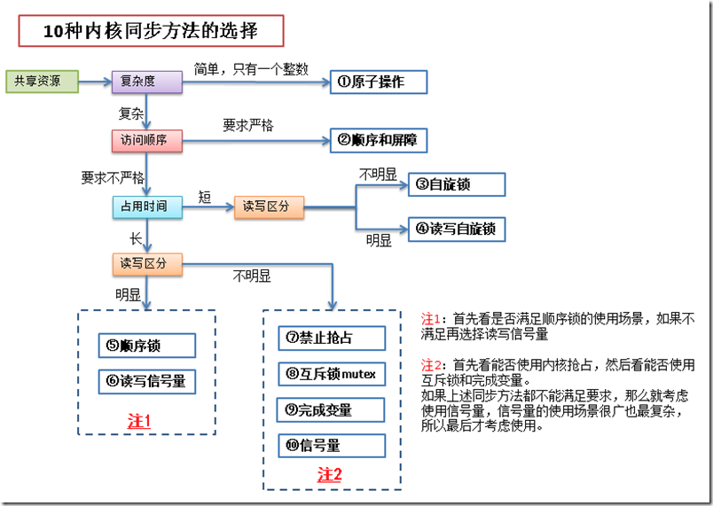
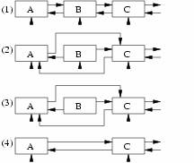

# 常用基本语法

## 0 修订记录1
| 修订说明 | 日期 | 作者 | 额外说明 |
| --- |
| 初版 | 2018/04/10 | 员清观 |  |

//eric <br>可以在表格中作为换行

本文档应该主要由api原型和范例应用构成，不应该保留基本概念的定义。

## 1 基本数据结构类型
### 1.1 list队列
static LIST_HEAD(device_list);
static DEFINE_MUTEX(device_list_lock);

INIT_LIST_HEAD(&master->queue);
list_add_tail(&bi->list, &board_list);
list_empty(&master->queue)
master->cur_msg = list_entry(master->queue.next, struct spi_message, queue);
list_del_init(&master->cur_msg->queue);
list_del(&master->list);

### 1.4 mutex_init

### 1.5 Per-CPU变量

**wowo内核同步机制**
http://www.wowotech.net/sort/kernel_synchronization
**Per-CPU变量 memory barrier 基本RCU RCU synchronize原理分析**


```cpp
1. 静态声明和定义Per-CPU变量的API如下表所示
DECLARE_PER_CPU(type, name)
DEFINE_PER_CPU(type, name)
  普通的、没有特殊要求的per cpu变量定义接口函数。没有对齐的要求
2. 访问静态声明和定义Per-CPU变量的API，实际上定义的宏
  get_cpu_var(var)
  put_cpu_var(var)
  上面这两个接口函数已经内嵌了锁的机制（preempt disable），用户可以直接调用该接口进行本CPU上该变量副本的访问。如果用户确认当前的执行环境已经是preempt disable（或者是更厉害的锁，例如关闭了CPU中断），那么可以使用lock-free版本的Per-CPU变量的API:__get_cpu_var。
3. 动态分配Per-CPU变量的API如下表所示：
动态分配和释放Per-CPU变量的API 	描述
alloc_percpu(type) 	分配类型是type的per cpu变量，返回per cpu变量的地址（注意：不是各个CPU上的副本）
void free_percpu(void __percpu *ptr) 	释放ptr指向的per cpu变量空间
4. 访问动态分配Per-CPU变量的API如下表所示：
访问Per-CPU变量的API 	   描述
get_cpu_ptr 	           这个接口是和访问静态Per-CPU变量的get_cpu_var接口是类似的，当然，这个接口是for 动态分配Per-CPU变量
put_cpu_ptr 	           同上
per_cpu_ptr(ptr, cpu) 	根据per cpu变量的地址和cpu number，返回指定CPU number上该per cpu变量的地址

```

## 2 **内核同步机制**

https://blog.csdn.net/williamwang2013/article/category/1331017

并发(Concurrency)与竞态(Race condition)

2个概念：
- 临界区 - 也称为临界段，就是访问和操作共享数据的代码段。
- 竞争条件 - 2个或2个以上线程在临界区里同时执行的时候，就构成了竞争条件。
所谓同步，其实防止在临界区中形成竞争条件。如果临界区里是原子操作(即整个操作完成前不会被打断)，那么自然就不会出竞争条件。但在实际应用中，临界区中的代码往往不会那么简单，所以为了保持同步，引入了同步机制。



`ipcs -s`查看当前同步资源情况，包括信号量，队列等


### 2.1 基本概念

**造成竞争条件的原因：**

| 竞争原因             | 说明                                                                                                 |
| -------------------- | ---------------------------------------------------------------------------------------------------- |
| 硬中断                 | 中断随时会发生，也就会随时打断当前执行的代码。如果中断和被打断的代码在相同的临界区，就产生了竞争条件 |
| 软中断和tasklet，底半部　| 软中断和tasklet也会随时被内核唤醒执行，也会像中断一样打断正在执行的代码                              |
| 内核抢占             | 内核具有抢占性，发生抢占时，如果抢占的线程和被抢占的线程在相同的临界区，就产生了竞争条件             |
| 睡眠及用户空间的同步 | 用户进程睡眠后，调度程序会唤醒一个新的用户进程，新的用户进程和睡眠的进程可能在同一个临界区中         |
| 对称多处理           | 2个或多个处理器可以同时执行相同的代码                                                                |
| SMP对称多处理器 |                                                                                                      |

linux2.6.35之后，取消了中断的嵌套，所以中断之间不会形成竞争条件。

**编写内核代码注意事项**
- 这个数据是不是全局的？除了当前线程以外，其他线程能不能访问它？
- 这个数据会不会在进程上下文或者中断上下文中共享？它是不是要在两个不同的中断处理程序中共享？
- 进程在访问数据时可不可能被抢占？被调度的新程序会不会访问同一数据？
- 当前进程会不会睡眠(或者阻塞)在某些资源上，如果是，它会让共享数据处于何种状态？
- 怎样防止数据失控？
- 如果这个函数又在另一个处理器上被调度将会发生什么？

**防止死锁基本原则**

死锁就是所有线程都在相互等待释放资源，导致谁也无法继续执行下去。
- 如果有多个锁的话，尽量确保每个线程都是按相同的顺序加锁，按加锁相反的顺序解锁。(即加锁a->b->c，解锁c->b->a)
- 防止发生饥饿。即设置一个超时时间，防止一直等待下去。
- 不要重复请求同一个锁。
- 设计应力求简单。加锁的方案越复杂就越容易出现死锁。

**控制锁的粒度**

在加锁的时候，不仅要避免死锁，还需要考虑加锁的粒度。锁的粒度对系统的可扩展性有很大影响，在加锁的时候，要考虑一下这个锁是否会被多个线程频繁的争用。如果锁有可能会被频繁争用，就需要将锁的粒度细化。细化后的锁在多处理器的情况下，性能会有所提升。

不过有一点需要提醒的是，锁的粒度越细，系统开销越大，程序也越复杂，所以对于争用不是很频繁的锁，就没有必要细化了。

**同步会否导致休眠和调度，列表**

### 2.2 原子整数和位运算
和底层cpu的原子操作关系密切，对于ARM处理器而言，底层配对使用`LDREX` `STREX`指令，`LDREX`轮询判断内存临界区就绪才会真正执行。因而，原子操作不会导致休眠和调度

原子操作是由编译器来保证的，保证一个线程对数据的操作不会被其他线程打断。
原子操作有2类：
- 原子整数操作，有32位和64位。头文件分别为<asm/atomic.h>和<asm/atomic64.h>
- 原子位操作。头文件 <asm/bitops.h>
- 对于SMP系统，内核还提供了local_t数据类型，实现对单个CPU的整数原子操作，接口函数仅将atomic_替换成local_即可，定义于linux/asm-generic/local.h

原子操作头文件与具体的体系结构有关，比如x86架构的相关头文件在 arch/x86/include/asm/*.h

原子操作主要用来实现资源计数，很多引用计数就是通过原子操作实现的。

从上面的定义来看，atomic_t实际上就是一个int类型的counter，不过定义这样特殊的类型atomic_t是有其思考的：内核定义了若干atomic_xxx的接口API函数，这些函数只会接收atomic_t类型的参数。这样可以确保atomic_xxx的接口函数只会操作atomic_t类型的数据。同样的，如果你定义了atomic_t类型的变量（你期望用atomic_xxx的接口API函数操作它），这些变量也不会被那些普通的、非原子变量操作的API函数接受。

**具体的接口API函数整理如下：**

| 接口函数 | 	描述 |
| :--- |
| void atomic_add(int i, atomic_t *v) 	| 给一个原子变量v增加i |
| void atomic_sub(int i, atomic_t *v) 	| 给一个原子变量v减去i |
| atomic_inc(atomic_t *v) 	| 原子变量的值加一 |
| atomic_dec(atomic_t *v) 	| 原子变量的值减去一 |
|   |   |
| atomic_read(atomic_t *v) 	| 获取原子变量的值 |
| atomic_t counter = ATOMIC_INIT(0);  |  初始化方式 |
| atomic_set（atomic_t *v,int i）	| 设定原子变量的值 |
|   |   |
| atomic_inc_return(atomic_t *v) 	| 更新变量v,并将变量v的最新值返回 |
| int atomic_add_return(int i, atomic_t *v) 	|  |
| atomic_dec_return(atomic_t *v) 	|  |
| int atomic_sub_return(int i, atomic_t *v) 	|  |
|   |   |
| atomic_sub_and_test(int i, atomic_t *v) 	| 给一个原子变量v减去i，并判断变量v的最新值是否等于0 |
| atomic_inc_and_test(atomic_t *v) 	|  |
| atomic_dec_and_test(atomic_t *v) 	|  |
|   |   |
| int atomic_cmpxchg(atomic_t *ptr, int old, int new) 	| 比较old和原子变量ptr中的值，如果相等，那么就把new值赋给原子变量。返回旧的原子变量ptr中的值 |
| atomic_add_negative(int i,atomic_t *v) 	| 给一个原子变量v增加i，并判断变量v的最新值是否是负数 |
| int atomic_add_unless(atomic_t *v, int a, int u) | 	只要原子变量v不等于u，那么就执行原子变量v加a的操作。如果v不等于u，返回非0值，否则返回0值 |

**原子bits操作**

| 原子位操作 | 描述 |
|---|
| void set_bit(int nr, void *addr)  | 原子地设置addr所指对象的第nr位|
| void clear_bit(int nr, void *addr) | 原子地清空addr所指对象的第nr位|
| void change_bit(int nr, void *addr)  | 原子地翻转addr所指对象的第nr位|
| int test_bit(int nr, void *addr)  | 原子地返回addr所指对象的第nr位|
| int test_and_set_bit(int nr, void *addr)  | 原子地设置addr所指对象的第nr位，并返回原先的值|
| int test_and_clear_bit(int nr, void *addr)  | 原子地清空addr所指对象的第nr位，并返回原先的值|
| int test_and_change_bit(int nr, void *addr)  | 原子地翻转addr所指对象的第nr位，并返回原先的值| |


```cpp
//eric #include <asm/atomic.h>
typedef struct {
    int counter;
} atomic_t;
atomic_t counter = ATOMIC_INIT(0);//初始化

//举个简单例子： 为了实现设备只能被一个进程打开，从而避免竞态的出现
static atomic_t scull_available = ATOMIC_INIT(1);      //init atomic
//在scull_open 函数和scull_close函数中：
int scull_open(struct inode *inode, struct file *filp)
{
    struct scull_dev *dev;         // device information

    dev = container_of(inode->i_cdev, struct scull_dev, cdev);
    filp->private_data = dev;         // for other methods
    if(!atomic_dec_and_test(&scull_available)){
        atomic_inc(&scull_available);
        return -EBUSY;
    }
    return 0;         // success
}

int scull_release(struct inode *inode, struct file *filp)
{
    atomic_inc(&scull_available);
    return 0;
}

```

### 2.3 互斥体

```cpp
//eric 经典互斥体 #include<linux/mutex.h>
//经典互斥体结构体：  （会导致无限制优先级反转问题）
struct mutex {
  /* 1: unlocked, 0: locked, negative: locked, possible waiters */
  atomic_t count;
  spinlock_t wait_lock;
  struct list_head wait_list;
  struct task_struct *owner;
};
//eric 实时互斥体 #include<linux/trmutex.h>
//实时互斥体结构体：
struct rt_mutex {
  raw_spinlock_t  wait_lock;
  struct plist_head  wait_list;
  struct task_struct   *owner;
};

//操作：
struct mutex my_mutex;
mutex_init(&my_mutex);
void mutex_lock(struct mutex* lock);                       //获取互斥体,不可被信号中断
void mutex_lock_interruptible(struct mutex* lock);     //获取互斥体,可被信号打断
int mutex_lock_killable(struct mutex* lock);       //该函数可被kill信号打断
int mutex_trylock(struct mutex* lock);                     //尝试获取互斥体
void mutex_unlock(struct mutex* lock);                 //释放互斥体
int mutex_is_locked(struct mutex* lock):  //该函数检查互斥锁lock是否处于锁定状态。返回1,表示已锁定;返回0,表示未锁定;

用例：
struct mutex my_mutex;
mutex_init(&my_mutex);
mutex_lock(&my_mutex);
...临界区...
mutex_unlock(&my_mutex);
```

DECLARE_MUTEX

### 2.4 内核信号量

由于使用信号量时，线程会睡眠，所以等待的过程不会占用CPU时间。所以信号量适用于等待时间较长的临界区。信号量消耗的CPU时间的地方在于使线程睡眠和唤醒线程，如果 （使线程睡眠 + 唤醒线程）的CPU时间 > 线程自旋等待的CPU时间，那么可以考虑使用自旋锁。
信号量与自旋锁的区别
（1）当锁不能获取到时，使用信号量的开销是进程上下文切换时间，使用自旋锁的开销是等待获取自旋锁；
（2）信号量所保护的临界区可能会引起阻塞，而自旋锁则绝对要避免用来保护包含这样的代码，因为阻塞意味着要进行进程的切换，如果进程被切换出去后，另一个进程企图要获取本自旋锁，死锁就会发生。
（3）信号量存在于进程的上下文，因此，如果保护的共享资源需要在中断或软中断情况下使用，则在信号量和自旋锁之间只能选择自旋锁。当然如果一定要使用信号量，则只能通过down_trylock方式进行，不能获取就立即返回避免阻塞。

| 方法                                   | 描述                                                  |
| -------------------------------------- | ---------------------------------- |
| sema_init(struct semaphore *, int)     | 以指定的计数值初始化动态创建的信号量                               |
| init_MUTEX(struct semaphore *)         | 以计数值1初始化动态创建的信号量                                    |
| init_MUTEX_LOCKED(struct semaphore *)  | 以计数值0初始化动态创建的信号量（初始为加锁状态）                  |
| down_interruptible(struct semaphore *) | 以试图获得指定的信号量，如果信号量已被争用，则进入可中断睡眠状态   |
| down(struct semaphore *)               | 以试图获得指定的信号量，如果信号量已被争用，则进入不可中断睡眠状态 |
| down_trylock(struct semaphore *)       | 以试图获得指定的信号量，如果信号量已被争用，则立即返回非0值        |
| up(struct semaphore *)                 | 以释放指定的信号量，如果睡眠队列不空，则唤醒其中一个任务           |

```cpp
//eric #include <linux/semaphore.h>
struct semaphore {
    spinlock_t        lock;
    unsigned int      count;
    struct list_head  wait_list;  //wait_list则是对申请信号量的进程维护的等待队列
};

//1. 定义信号量
struct semaphore sem;
//2. 初始化方法
  //基本方法
  void sema_init(struct semaphore *sem, int val); //val为信号量初值。
  //也可以用两个宏来定义和初始化信号量的值为1或0：
    DECLARE_MUTEX(name); //定义信号量name并初始化为1
    DECLARE_MUTEX_LOCKED(name); //定义信号量name并初始化为0
  //还可以用下面的函数初始化：
    void init_MUTEX(struct semaphore *sem); //初始化信号量的值为1，在linux3.x中已不存在
    void init_MUTEX_LOCKED(struct semaphore *sem); //相当于初始化信号量的值为0，在linux3.x中已不存在
  //范例
    sema_init(&sem, 1);
//3. 原子操作
  //用来获取信号量，如果信号量值大于或等于0，获取信号量，否则进入睡眠状态，睡眠状态不可唤醒
    void down(struct semaphore *sem);
  //用来获取信号量，如果信号量大于或等于0，获取信号量，否则进入睡眠状态，等待信号量被释放后，激活该程。
    void down_interruptible(struct semephore *sem);
  //该函数用于获得信号量sem;但是它可以被kill信号打断。
    int down_killable(struct semaphore* sem)
  //该函数用于获得信号量sem,它与down()一样,也会导致调用进程睡眠,因此,也不能用于中断上下文;但是它与down()不同的是,在得不到信号量时,该函数不会一直睡眠下去,它只会睡眠一个指定的超时时间jiffies,当该超时时间到达时,仍然没有获得信号量的话,该函数就返回;超时时间jiffies是以系统时钟滴答次数计算。
    int down_timeout(struct semaphore* sem, long jiffies)
  //试图获取信号量，如果信号量已被其他进程获取，则立刻返回非零值，所以调用者不会睡眠，可以在中断上下文中使用
    void down_trylock(struct semaphore *sem);
  //释放信号量，并唤醒等待该资源进程队列的第一个进程。
    void up(struct semaphore *sem);
  //范例
  //在使用down_interruptible()获得信号量的时候,一般都要对返回值进行检查,如果返回非0值,则表示是被信号打断了,通常立即返回-ERESTARTSYS;
    if (down_interruptible(&sem))　 //被信号打断
		  return -ERESTARTSYS;
```

### 2.5 内核读写信号量
读写信号量与信号量之间的关系类似于自旋锁与读写自旋锁。
读写信号量可能会引起进程阻塞,但是它允许N个读执行单元同时访问共享资源,而最多只允许有一个写执行单元访问共享资源;因此,读写信号量是一种相对放宽条件的、粒度稍大于信号量的互斥机制。
注意：
信号量不允许任何操作之间有并发。

```cpp
//eric #include<linux/rwsem.h> 实际上在arch/X86/include/asm/rwsem.h
//其结构体为：
struct rw_semaphore {
  long count;
  spinlock_t   wait_lock;
  struct list_head wait_list;
};

//操作：
struct rw_semaphore rw_sem;                                     //定义读写信号量
void init_rwsem(struct rw_semaphore* rw_sem);       //初始化读写信号量
void down_read(struct rw_semaphore* rw_sem);            //获取读信号量
int down_read_trylock(struct rw_semaphore* rw_sem); //尝试获取读信号量
void up_read(struct rw_semaphore* rw_sem);

void down_write(struct rw_semaphore* rw_sem);           //获取写信号量
int down_write_trylock(struct rw_semaphore* rw_sem);//尝试获取写信号量
void up_write(struct rw_semaphore* rw_sem);

用例：
rw_semaphore sem;
init_rwsem(&sem);

down_read(&sem);
...临界区...
up_read(&sem);

down_write(&sem);
...临界区...
up_write(&sem);

void downgrade_write(struct rw_semaphore* sem);
//该函数用于把写者降级为读者,有时,这是必要的。
//因为写者是互斥的、排它的,因此在写者保护读写信号量期间,任何读者或写者都将无法访问该信号量所保护的共享资源,对于那些当前条件下不需要写操作的访问者,降级为写者,将使得等待访问的读者能够立即访问,从而增加了并发性,提高了效率。
```

### 2.6 中断屏蔽
中断屏蔽，禁止了中断和进程调度和异步io等竞争事件发生。中断对系统正常运行很重要，长时间屏蔽很危险，所以中断屏蔽后应尽可能快的执行完毕。

`local_irq`级别API只能禁止本CPU的中断，所以，无法阻止SMP类型竞争。驱动编程中，并不推荐这种方式。单独使用经常意味着BUG，通常应该和自旋锁配合使用。

```cpp
在单CPU中避免竞态的一种简单方法是在进入临界区之前屏蔽系统的中断。由于linux的异步I/O、进程调度等很多内容都依靠中断，所以我们应该尽快的执行完临界区的代码，换句话就是临界区代码应该尽量少。

//eric #include <asm/system.h>
//eric #include <linux/irqflags.h>
void local_irq_disable(void);
void local_irq_enable(void);
void local_irq_save(unsigned long flags);
void local_irq_restore(unsigned long flags);
void local_bh_disable(void); //bottom half
void local_bh_enable(void);
```

### 2.7 内存屏障
为了提高Cache命中率和CPU内存访问效率，会出现编译乱序(编译器优化导致代码执行顺序变化)和执行乱序(合并连续地址的访问以提高效率等)两种场景。
提供两种屏障：
- 内存屏障。`volatile`关键字只能防止内存访问行为的合并，ARM定义了`DMB` `DSB` `ISB`等内存屏障的指令，对应`rmb()`等屏障API。它们主要用在：
  - 自旋锁互斥等同步机制
  - 有次序要求的外设寄存器访问(`writew` `writeb` `writel` `readb` `readl` `readw`)

- 优化屏障barrier()这个接口和编译器有关，对于gcc而言，其代码如下：
  - #define barrier() __asm__ __volatile__("": : :"memory")

优化屏障是和编译器相关的，而内存屏障是和CPU architecture相关的

| 接口名称 | 	作用 |
| --- |
| barrier() | 	优化屏障，阻止编译器为了进行性能优化而进行的memory access reorder |
| mb() | 	内存屏障（包括读和写），用于SMP和UP |
| rmb() | 	读内存屏障，用于SMP和UP |
| wmb() | 	写内存屏障，用于SMP和UP |
| smp_mb() | 	用于SMP场合的内存屏障，对于UP不存在memory order的问题（对汇编指令），因此，在UP上就是一个优化屏障，确保汇编和c代码的memory order是一致的 |
| smp_rmb() | 	用于SMP场合的读内存屏障 |
| smp_wmb() | 	用于SMP场合的写内存屏障 |


### 2.8 complete
表示一个执行单元需要等待另一个执行单元完成某事后方可执行。
- 它是一种轻量级机制，为了完成进程间的同步而设计
- 使用完成量等待时，调用进程是以独占睡眠方式进行等待的
- 不是忙等待

| 方法 | 描述 |
| --- |
| struct completion my_comp;<br>init_completion(struct completion *); | 	初始化指定的动态创建的完成变量 |
| DECLARE_COMPLETION(complete); | 静态地定义和初始化 |
| DECLARE_COMPLETION_ONSTACK(complete); | 创建一个completion结构体放在内核堆栈中 |
|   |   |
| void wait_for_completion(struct completion *); | 	等待指定的完成变量接受信号 |
| void wait_for_completion_interruptible(struct completion *); | 	该函数等待一个完成量被唤醒。但是它可以被外部信号打断; |
| void wait_for_completion_killable(struct completion *); | 	该函数等待一个完成量被唤醒。但是它可以被kill信号打断; |
| void wait_for_completion_timeout(struct completion *, unsigned long timeout); | 	该函数等待一个完成量被唤醒。该函数会阻塞调用进程,如果所等待的完成量没有被唤醒,调用进程也不会一直阻塞下去,而是等待一个指定的超时时间timeout,当超时时间到达时,如果所等待的完成量仍然没有被唤醒,那就返回;超时时间timeout以系统的时钟滴答次数jiffies计算 |
|   |   |
| void try_wait_for_completion(struct completion *); | 	该函数尝试等待一个完成量被唤醒。不管所等待的完成量是否被唤醒,该函数都会立即返回 |
|   |   |
| void completion_done(struct completion *comp); | 	该函数用于检查是否有执行单元阻塞在完成量comp上(是否已经完成),返回0,表示有执行单元被完成量comp阻塞;相当于wait_for_completion_timeout()中的timeout=0 |
| void complete(struct completion *comp); | 	该函数只唤醒一个正在等待完成量comp的执行单元 |
| void complete_all(struct completion *comp);  | 该函数唤醒所有正在等待同一个完成量comp的执行单元 |

```cpp
/* 范例　*/
//eric #include <linux/completion.h>
struct completion {
  unsigned int done;
  wait_queue_head_t wait;
}; //done变量是完成量要保护的对象，wait则是申请完成量的进程等待队列。
static inline void init_completion(struct completion *x)
{
  x->done = 0;
  init_waitqueue_head(&x->wait);
}
//内核代码中wait_for_common函数其实就是对done变量作判断，若done变量没有大于0，则它一直处于while循环中。complete函数就是对done变量加1。wait_for_common函数便会退出while循环，同时将done减1，表示申请完成量成功。

struct completion event;

init_completion(&event);
thread->event = &event;
wait_for_completion(&event);
/* 另外的线程中complete　*/
complete(thread->event);
```

### 2.9 禁止抢占
其实使用自旋锁已经可以防止内核抢占了，但是有时候仅仅需要禁止内核抢占，不需要像自旋锁那样连中断都屏蔽掉。这时候就需要使用禁止内核抢占的方法了

| 方法 | 描述 |
| --- |
| preempt_disable() | 	增加抢占计数值，从而禁止内核抢占 |
| preempt_enable() | 	减少抢占计算，并当该值降为0时检查和执行被挂起的需调度的任务 |
| preempt_enable_no_resched() | 	激活内核抢占但不再检查任何被挂起的需调度的任务 |
| preempt_count() | 	返回抢占计数 |
这里的preempt_disable()和preempt_enable()是可以嵌套调用的，disable和enable的次数最终应该是一样的。禁止抢占的头文件参见：//linux/preempt.h

### 2.10 自旋锁
自旋锁是一种对临界资源进行互斥访问的典型手段，其名来源于它的工作方式。
通俗的讲，自旋锁就是一个变量，该变量把一个临界区标记为“我当前在运行，请等待”或者标记为“我当前不在运行，可以被使用”， 如果A执行单元首先获得锁，那么当B进入同一个例程时将获知自旋锁已被持有，需等待A释放后才能进入，所以B只好原地打转（自旋）。
特点：
- 自旋锁主要针对SMP或单CPU且内核可抢占的情况，对于单CPU且内核不可抢占的系统自旋锁退化为空操作
- 尽管自旋锁可以保证临界区不受别的CPU和本CPU的抢占进程打扰，但是得到锁的代码路径在执行临界区的时候还可能受到中断和底半部影响，此时应该使用 自旋锁的衍生操作

注意，被自旋锁保护的临界区代码执行时，它不能因为任何原因放弃处理器：
- 自旋锁实际上是等于忙等待锁，所以要求占用锁的时间极短
- 对于同一CPU或进程，不可递归使用自旋锁
- 自旋锁锁定期间不能调用可能引起进程调度的函数，比如，`copy_from_user()`,`copy_to_user()`, `kmalloc()`，`msleep()`

```cpp
//操作
//eric #include<linux/spinlock_types.h>
spinlock_t lock;    //定义自旋锁
spin_lock_init(&lock);    //初始化自旋锁
spin_lock(&lock);    //如不能获得锁，原地打转。
spin_trylock(&lock);    //尝试获得，如能获得锁返回真，不能获得返回假，不在原地打转。
spin_unlock(&lock);    //与spin_lock()和spin_trylock()配对使用。

//自旋锁衍生操作 = 自旋锁+ 中断屏蔽
unsigned long flags;
spin_lock_irq()
spin_unlock_irq()
spin_lock_irqsave()
spin_unlock_irqrestore()
spin_lock_bh()
spin_unlock_bh()
```

### 2.11 读写锁
读写自旋锁（rwlock）是一种比自旋锁粒度更小的自旋锁机制，它保留了“自旋”的概念。但是在写操作方面，只能最多有一个写进程，在读方面，同时可拥有多个执行单元，当然读和写也不能同时进行。

```cpp
//操作：
//eric #include<linux/rwlock.h>
//eric 或#include<linux/spinlock.h>
//初始化
  rwlock_t x;
  rwlock_init(&x);    //动态初始化
  //或
  rwlock_t x=RW_LOCK_UNLOCKED;    //静态初始化

void read_lock(rwlock_t *lock);    //如果不能获得，它将自旋，直到获得该读写锁
void read_unlock(rwlock_t *lock);
void write_lock(rwlock_t *lock);    //如果不能获得，它将自旋，直到获得该读写锁
void write_unlock(rwlock_t *lock);
//trylock
read_trylock(lock)；
write_trylock(lock);
//irq
read_lock_irq(lock);    //读者获取读写锁，并禁止本地中断
read_unlock_irq(lock);    //读者释放读写锁，并使能本地中断
write_lock_irq(lock);//写者获取读写锁，并禁止本地中断
write_unlock_irq(lock);
read_lock_irqsave(lock, flags);//读者获取读写锁，同时保存中断标志，并禁止本地中断
read_unlock_irqrestores(lock,flags);//读者释放读写锁，同时恢复中断标志，并使能本地中断
write_lock_irqsave(lock,flags);//写者获取读写锁，同时保存中断标志，并禁止本地中断
write_unlock_irqstore(lock,flags);
read_lock_bh(lock);//读者获取读写锁，并禁止本地软中断
read_unlock_bh(lock);
write_lock_bh(lock);//写者获取读写锁，并禁止本地软中断
write_unlock_bh(lock);

用例：
rwlock_t lock;     //定义rwlock
rwlock_init(&lock);    //初始化rwlock
//读时获取锁
read_lock(&lock);
...临界区...
read_unlock(&lock);
 //写时获取锁
write_lock_irqsave(&lock, flags);
…临界区...
write_unlock_irqrestore(&lock, flags);
```

### 2.12 顺序锁
顺序锁是对读写锁的一种优化:
- 读执行单元绝对不会被写执行单元阻塞。即读执行单元可以在写执行单元对被顺序锁保护的共享资源进行写操作的同时仍然可以继续读,而不必等待写执行单元完成之后再去读,同样,写执行单元也不必等待所有的读执行单元读完之后才去进行写操作
- 允许读和写操作之间的并发,也允许读与读操作之间的并发，但写与写操作之间只能是互斥的、串行的
- 如果读执行单元在读操作期间，写执行单元已经发生了写操作，那么，读执行单元必须重新去读数据，以便确保读到的数据是完整的
- 要求共享资源中不能含有指针。

| 锁对比　| 性质 |
| --- |
| 顺序锁： |允许读和写操作之间的并发,也允许读与读操作之间的并发,但写与写操作之间只能是互斥的、串行的。 |
| 读写自旋锁： |只允许读操作与读操作之间的并发,而读与写操作，写与写操作之间只能是互斥的、串行的。 |
| 自旋锁： |不允许任何操作之间并发。 |

```cpp
1.若读操作期间发生了写操作，则要重读，怎样实现重读呢？
do{
    seqnum = read_seqbegin(&seqlock_r);    //读开始
    ……
}while(read_seqretry(&seqlock_r,seqnum));    //读操作期间是否发生写
其中：
int read_seqretry(const seqlock_t* sl, unsigned start);
read_seqretry_irqrestore(lock, iv, flags);

static __always_inline unsigned read_seqbegin(const seqlock_t *sl)
{
unsigned ret = sl->sequence;
smp_rmb();
return ret;
}
static __always_inline int read_seqretry(const seqlock_t *sl, unsigned iv)
{
smp_rmb();
return (iv & 1) | (sl->sequence ^ iv);
}
从上面的代码可以看出，重读的关键就是对sequence变量的操作。

2.为什么可以允许同时读写，而写操作之间仍然互斥？
static inline void write_seqlock(seqlock_t *sl)
{
spin_lock(&sl->lock);
++sl->sequence;
smp_wmb();
}
static inline void write_sequnlock(seqlock_t *sl)
{
smp_wmb();
sl->sequence++;
spin_unlock(&sl->lock);
}
```

写操作其实就是利用自旋锁是对sequence变量的保护，进程在申请写锁的时候，只是简单的将sequence变量的值增1
对于写操作，首先将sequence变量的值保存下来（这时候已在do-while循环中），然后在read_seqretry函数中作判断，检测当前的读锁变量是否发生变化，若发生变化，则调用写锁函数，sequence变量的值增1，重新读；若不发生变化，则表示申请读锁成功

```cpp
//eric #include <linux/seqlock.h>
typedef struct {
  unsigned sequence;
  spinlock_t lock;
} seqlock_t;
//初始化：
  seqlock_t x;
  seqlock_init(x);       //动态初始化
  //或者
  DEFINE_SEQLOCK(x);     //静态初始化

//写
  void write_seqlock(seqlock_t* sl);        //写加锁
  int write_tryseqlock(seqlock_t* sl);      //尝试写加锁
  write_seqlock_irqsave(lock, flags);      //local_irq_save() + write_seqlock()
  write_seqlock_irq(lock);                  //local_irq_disable() + write_seqlock()
  write_seqlock_bh(lock);                  //local_bh_disable() + write_seqlock()

  void write_sequnlock(seqlock_t* sl);         //写解锁
  write_sequnlock_irqrestore(lock, flags);     //write_sequnlock() + local_irq_restore()
  write_sequnlock_irq(lock);                   //write_sequnlock() + local_irq_enable()
  write_sequnlock_bh(lock);                    //write_sequnlock() + local_bh_enable()

A.读操作:
  unsigned int read_seqbegin(const seqlock_t* sl);
  read_seqbegin_irqsave(lock, flags);          //local_irq_save() + read_seqbegin()
读执行单元在访问共享资源时要调用顺序锁的读函数,返回顺序锁s1的顺序号;该函数没有任何获得锁和释放锁的开销,只是简单地返回顺序锁当前的序号;
B.重读操作:
  int read_seqretry(const seqlock_t* sl, unsigned start);
  int read_seqretry_irqrestore(seqlock_t *lock, unsigned int seq, unsigned long flags);
在顺序锁的一次读操作结束之后,调用顺序锁的重读函数,用于检查是否有写执行单元对共享资源进行过写操作;如果有,则需要重新读取共享资源;iv为顺序锁的顺序号;

//用例：
write_seqlock(&lock);
...... //写操作代码
write_sequnlock(&lock);

unsigned int seq_num = 0;
do {
  seq_num = read_seqbegin(&seqlock);
  //读操作代码
  ......
} while(read_seqretry(&seqlock, seq_num));
```

NOTE:　如果写执行单元在操作被顺序锁保护的共享资源时已经保持了互斥锁保护对共享资源的写操作,即:写执行单元与写执行单元之间已经是互斥的,但是读执行单元仍然可以与写执行单元同时访问,那么这种情况下仅需要使用顺序计数(struct seqcount)即可,而不必使用spinlock。
使用顺序计数必须非常小心,只有确定在访问共享资源时已经保持了互斥锁才可以使用;即:只有写操作与写操作之间已经是互斥的、串行的时,才可以使用顺序计数。

### 2.13 RCU：读-拷贝-更新
众所周知，为了保护共享数据,需要一些同步机制,如自旋锁(spinlock)，读写锁(rwlock)，它们使用起来非常简单,而且是一种很有效的同步机制，在UNIX系统和Linux系统中得到了广泛的使用，但是它存在两个问题:
- 它的开销相对于CPU速度而言就越来越大
随着计算机硬件的快速发展，获得这种锁的开销相对于CPU的速度在成倍地增加，原因很简单，CPU的速度与访问内存的速度差距越来越大，而这种锁使用了原子操作指令，它需要原子地访问内存，也就说获得锁的开销与访存速度相关，另外在大部分非x86架构上获取锁使用了内存屏障(Memory Barrier)，这会导致处理器流水线停滞或刷新，因此它的开销相对于CPU速度而言就越来越大
- 可扩展性

RCU它克服了以上锁的缺点，具有很好的扩展性，但是这种锁机制的使用范围比较窄，它只适用于读多写少的情况，如网络路由表的查询更新、设备状态表的维护、数据结构的延迟释放以及多径I/O设备的维护等:
- 对于被RCU保护的数据，读执行单元不需要获得任何锁就可以访问它，不使用原子指令，而且在除了Alpha的所有架构上不需要内存栅（Memory Barrier），因此不会导致锁竞争，内存延迟以及流水线停滞。
- 使用RCU的写执行单元在访问共享数据前先复制一个副本，然后对副本进行操作，最后使用一个回调机制在适当的时机把指向原数据的指针重新指向被修改的副本。这个时机就是在所有引用该数据的CPU都退出对共享数据的操作的时候。
- 读执行单元没有任何同步开销，而写执行单元的同步开销则取决于使用的写执行单元间的同步机制。
- 相比读写锁，RCU的优点在于既允许多个读执行单元同时访问被保护的数据，又允许多个读执行单元和多个写执行单元同时访问被保护的数据。
- RCU不能替代读写锁，如果写比较多时，对读执行的性能提高不能弥补写执行导致的损失。使用RCU，写执行单元之间的同步开销会比较大，它需要延迟数据的释放，复制被修改的数据，它也必须使用某种锁机制同步并行的其它写执行单元的修改操作。

```cpp
//eric #include<linux/rcupdate.h>
//1.读锁定
 rcu_read_lock();
 rcu_read_lock_bh();
//2.读解锁
 rcu_read_unlock();
 rcu_read_unlock_bh();
//3.同步RCU
 sysnchronize_rcu();
//由RCU写执行单元调用，它将阻塞写执行单元，直到所有的读执行单元已经完成读执行单元临界区，才会继续下一下操作。如果有多个RCU写执行单元调用该函数，它们将在下一个grace period(所有的读执行已经完成对临界区的访问)之后全部被唤醒。synchronize_rcu()保证所有的CPU都处理完正在运行的读执行单元临界区。
 synchronize_kernel();
//内核代码使用该函数来等待所有CPU处于可抢占状态，目前功能等同于sysnchronize_rcu()，但现在是使用sysnchronize_sched(),它能保证正在运行的中断处理函数运行完毕，但不能保证正在运行的软中断处理完毕。

//4.连接回调
void fastcall call_rcu(struct rcu_head *head,void (*func)(struct rcu_head *rcu));
//函数call_rcu()也由RCU写执行单元调用，它不会使写执行单元阻塞，因面可以在中断上下文或软中断使用。该函数将把函数func挂接到RCU回调函数上，然后立即返回。函数synchronize_rcu()的实现实际上使用了call_rcu()函数。
void fastcall call_rcu_bh(struct rcu_head *head,void (*func)(struct rcu_head *rcu));
//call_rcu_bh()的功能几乎与call_rcu()完全相同，唯一的差别就是它把软中断的完成当做经历一个quiesecent state（静默状态），因此如果写执行单元使用了该函数，在进程上下文的读执行单元必须使用rcu_read_lock_bh().
//每个CPU维护两个数据结构rcu_date和rcu_bh_date,它们用于保存回调函数，函数call_rcu()把回调函数注册到rcu_date,call_rcu_bh()则把回调函数注册到rcu_bh_date,在每一个数据结构上，回调函数被注册到一个链表，先注册的排到前面，后注册排到末尾。
```

使用RCU时，读执行单元必须提供一个信号给写执行者能够确定数据可以被安全地释放或修改的时机。等待适当时机的这一时期称为grace period，而CPU发生了上下文切换称为经历一个quiescent state，grace period就是所有CPU都经历一次quiescent state所需要的等待的时间，调用grace period后一个专门的垃圾回收器不断探测读执行单元的信号，一旦所有的读执行单元都已经发送信号告知它们都不在使用被CRU保护的数据结构，垃圾回收器就调用回收函数完成最后的数据释放或修改操作。

以下以链表元素删除为例详细说明这一过程。
写者要从链表中删除元素 B，它首先遍历该链表得到指向元素 B 的指针，然后修改元素 B 的前一个元素的 next 指针指向元素 B 的 next 指针指向的元素C，修改元素 B 的 next 指针指向的元素 C 的 prep 指针指向元素 B 的 prep指针指向的元素 A,在这期间可能有读者访问该链表，修改指针指向的操作是原子的，所以不需要同步，而元素 B 的指针并没有去修改，因为读者可能正在使用 B 元素来得到下一个或前一个元素。写者完成这些操作后注册一个回调函数以便在 grace period 之后删除元素 B，然后就认为已经完成删除操作。垃圾收集器在检测到所有的CPU不在引用该链表后，即所有的 CPU 已经经历了 quiescent state,grace period 已经过去后，就调用刚才写者注册的回调函数删除了元素 B。



```cpp
//5.RCU链表操作
static inline void list_add_rcu(struct list_head *new, struct list_head *head);
//该函数把链表元素插入到CRU保护的链表head的开头，内存栅保证了在引用这个新插入的链表元素之前，新链表元素的链接指针的修改对所有读执行单元是可见的。
static inline void list_add_tail_rcu(struct list_head *new, struct list_head *head);
//该函数类似于list_add_rcu(),它将新的链表元素new被添加到被CRU保护的链表的末尾。
static inline void list_del_rcu(struct list_head *entry);
//该函数从RCU保护的链表中删除指定的链表元素entry。
static inleine void list_replace_rcu(struct list_head* old, struct list_head *new);
//该函数是RCU新添加的函数，度不存在非RCU版本。它使用新指针new代替old,内存栅保证在引用新元素之前，它对链接指针的修正对所有读者是可见的。
list_for_each_rcu(pos,head);
//该宏用于遍历由RCU保护的链表head，只要在读执行单元临界区使用该函数，它就可以安全地和其它_rcu链表操作函数并发运行如list_add_rcu().
list_for_each_safe_rcu(pos, n, head);
//该宏类似于list_for_rcu(),不同之处在于它允许安全在删除当前的链表元素pos。
list_for_each_entry_rcu(pos, head, member);
//该宏类似于list_for_each(),不同之处在于它用于遍历指定类型的数据结构链表，当前元素pos为一包含struct list_head结构的特定的数据结构。

//6.RCU HASH表操作
static inline void hlist_add_head_rcu(struct hlist_node *n, struct list_head *h);
//该函数用于把链表元素n插入到被RCU保护的哈希链表的开头，但同时允许读执行者对该哈希链表的遍历。内存栅确保在引用新链表元素之前，它对指针的修改对所有读执行单元可见。
static inline hlist_del_rcu(struct hlist_node *n);
//它从由RCU保护的哈希链表中移走链表元素n。
hlist_for_each(pos, head);
//该宏用于遍历由RCU保护的哈希链表head，只要在读端临界区使用该函数，它就可安全地和其它_rcu哈希链表操作函数（如list_add_rcu）并发地运行。
hlist_for_each_entry_rcu(tpos, pos, head, member);
//似于hlist_for_each(),不同之处在于它用于遍历指定类型的数据结构链表，当前元素pos为一包含struct list_head结构的特定的数据结构。
```

目前，RCU的使用在内核中已经非常普遍，大量原先使用读写锁的代码被RCU替代。RCU还可用于实现对链表、映射、hash表等的操作进行同步保护;事实上,内核中已经实现了RCU版本的链表操作函数

### 2.14

## 3 进程调度
https://blog.csdn.net/gatieme/article/details/51872618
https://blog.csdn.net/sailor_8318/article/details/2460177

### 3.1 pthread_setschedparam
//#include <pthread.h>
struct sched_param sched;
pthread_setschedparam(dev->hal_server_id, SCHED_RR, &sched);

### 3.2 sched_setscheduler

```cpp
//#include <sched.h>
int sched_setscheduler(pid_t pid, int policy, const struct sched_param *param);
```
sched_setscheduler()函数将pid所指定进程的调度策略和调度参数分别设置为param指向的sched_param结构中指定的policy和参数。sched_param结构中的sched_priority成员的值可以为任何整数，该整数位于policy所指定调度策略的优先级范围内(含边界值)。policy参数的可能值在头文件中定义。更改其他进程的调度参数需要有相应的特权。调用进程必须具有相应的特权，或者是具有PRIV_RTSCHED权限的组的成员，才能成功调用sched_setscheduler()：

1. 如果存在pid所描述的进程，将会为进程ID等于pid的进程设置调度策略和调度参数。
2. 如果pid为零，将会为调用进程设置调度策略和调度参数
3. 如果进程pid含多个进程或轻量进程(即该进程是多进程的)，此函数将影响进程中各个子进程。

例子：更改调用进程以使用最强的FIFO优先级，如下所示：

```cpp
//#include <sched.h>
int main(int argc,char *argv[])
{
      struct sched_param param;
      int maxpri;
      maxpri = sched_get_priority_max(SCHED_FIFO);//»ñÈ¡×î´óÖµ
      if(maxpri == -1)
      {
            perror("sched_get_priority_max() failed");
            exit(1);
      }
      param.sched_priority = maxpri;
      if (sched_setscheduler(getpid(), SCHED_FIFO, &param) == -1) //设置优先级

     {
            perror("sched_setscheduler() failed");
            exit(1);
     }
}
```

### 3.3 sched_getscheduler
获取调度策略`sched_getscheduler()`函数声明如下：
/* Retrieve scheduling algorithm for a particular purpose. */
//#include <sched.h>
int sched_getscheduler(pid_t pid);

sched_getscheduler()函数返回pid所指定进程的调度策略。
1. 如果存在pid所描述的进程，将返回进程ID等于pid的进程的调度策略。
2. 如果pid为零，将返回调用进程的调度策略。
3. 如果进程pid包含多个进程或轻量进程，此函数只返回进程调度策略和优先级。

目标进程的各个进程或轻量级进程具有其自身的调度策略和优先级，它们可能与当前进程的调度策略和优先级不同。

## 4 同步机制比较分析
对比应用场景等

自旋锁与信号量的比较

|  | 信号量 | 	自旋锁 |
| --- |
| 1、开销成本 	| <br> 进程上下文切换时间 |	忙等待获得自旋锁时间 |
| 2、特性 |	a -- 导致阻塞，产生睡眠 <br> b -- 进程级的（内核是代表进程来争夺资源的） |	a -- 忙等待，内核抢占关闭 <br> b -- 主要是用于CPU同步的 |
| 3、应用场合 	|只能运行于进程上下文 | 还可以出现中断上下文 |
| 4、其他 |	还可以出现在用户进程中 |	只能在内核线程中使用 |


## 5
### 5.1 container_of
