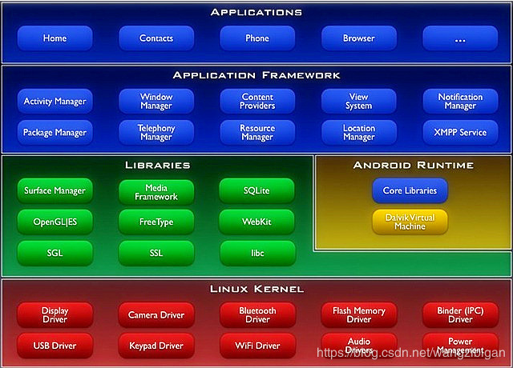

# 基于BuildRoot集成开发环境

## 0 修订记录
| 修订说明 | 日期 | 作者 | 额外说明 |
| --- |
| 初版 | 2017/09/14 | 员清观 | 常用操作索引，尽量简短方便使用 |

Elecard StreamEye Tools
CppUTest 单元测试工具
FitNesse 组件测试工具

软件文档的开发可以使用类似敏捷的方式, 增量迭代, 先有一个基本的框架

## 简历相关
百度三面问题：
1.你觉得在带团队上和处理自己手头的工作比例，你是如何分配的？
2.你对SSD行业的发展怎么看？
3.你曾经在工作有没有遇到特别挑战的问题，怎么解决的？
4.你觉得自己特别擅长什么，自己亲自去解决一件事或者push别人去做一件事？
5.在百度和以前的工作区别是，以前是领导分配任务去完成，在百度需要你主动去发掘需求，提出方案并且向别人证明是可行的或者是不可行的，你觉得你能胜任吗或者考虑清楚了吗？

一面主要是讲述自己以前做过的项目；
二面主要是交流，了解他们目前正在做的项目及其他；
三面侧重对整个存储行业的了解，及个人的架构能力；

百度HR面试问题：
Q1：请问你离职的原因是什么？
Q2：你觉得你如果来百度最大的挑战是什么？
Q3：如果你来百度压力是很大的，你怎么看这个问题？
Q4：你觉得你的优势是什么，来百度？
Q5: 现在芯片行业比较火，你怎么不考虑去芯片公司？
Q6：你在过去的项目中遇到的最大挑战是什么？
Q7: 你期望薪资是多少？
Q8: 你还有什么想了解的吗？

---
## 99 架构师之路相关

**多进程** 
  https://www.sohu.com/a/207313547_505803
1.物理模型逼迫你实现模块的解耦 2.方便定位问题 3.方便性能测试 4.方便应对万一需要的分布式部署

**系列文章:架构师之路** 
  https://blog.csdn.net/zxh19800626/category_6265187.html
  https://blog.csdn.net/juS3Ve/article/details/78933048
  https://blog.csdn.net/zxh19800626/article/details/84801636

**C语言嵌入式系统编程修炼之软件架构篇**
  https://blog.csdn.net/robin_qiu/article/details/614066

## 8. libevent重构
  https://www.cnblogs.com/zxiner/p/6919021.html
  https://segmentfault.com/a/1190000005594871

已经重构原有的eventhub模块

增加eventhub的私有的消息体系：
    １．各种统计信息，或者使能定时打印信息
    ２．清理当前无用的消息队列
    ３．当前进程和eventhub线程的动态trace控制.　可以通过增加一个新的函数，函数中，控制本地trace，并且发送trace命令到eventhub.
    ４．控制，功能模式等等．优先级改变
    ５．所有消息的类型，序号，执行时间等．可以通过序号在libevent和eventhub之间同步．
    ６．audiobox和videobox两种消息统一格式
    ７．打印每个消息
    ８．增加监控模式，每个消息的进度都会被记录和打印

## 7. QPlayer忽略问题
fr_get_float_remain() 函数可以改造一下，如果满，就返回0xffff

025-空中绞杀者-AVC-FLAC-1920x1080.mkv　seek失败问题
026视频文件，头部为0无法播放的问题
give_me_love_tank.aac 解析aac格式失败

## 6. qlibvplay模块优化
qplayer轻量化，单音频或者单视频或者单图片，不要做太多无用的工作。QPlayer::Prepare()函数中就需要进行处理。

## 5. videobox模块优化
当前的解码器功能不完备：
  1. 消息队列机制和其他太多功能共享，无法阻塞操作，线程同步弱
  2. 打印不完整，调试不方便
  3. 对异常时间戳的容错差
  4. 解码器切换必须复位，可持续开发差
  5. 被ids影响大，时间轴乱序严重

## 4. audiobox模块优化
QPlayer::Seek 的时候，可以考虑直接关闭音频通道，然后重新建立。
QPlayer::Pause　的时候，音频当前只能 audio_pause_device() 函数停止alsa的播放

上层如何确定底层支持音频的位宽呢？现在是每次出错的时候提示客户。应该允许设备参数只指定某项的限制，比如位宽和采样率中间的一项。
上层可以判断音频文件的大小，如果音频帧率比较少，设定alsa的start动作为1个字节。
audiobox提供的通道播放缓存，应该设定为float fr，现在太容易溢出了。因为不知道客户每次放多少个采样点。

下面这些好像是不必要的定义：
    DEMUX_AUDIO_PCM_S16E
    VPLAY_CODEC_AUDIO_PCM_S16E

## 模块化：
    所有的参数管理
    消息机制
    编解码线程和通道管理，编码和解码最好还是分开
    现有的解码codec通道保留，但是，直接把解码放到hal线程中简化设计
    preproc，只需要外部init destroy configure 数据处理
    ringbuffer替换的问题：原有基于fr的机制，导致大量代码被用于调整fr的大小上，及其不灵活．
    audiobox部分，实现一个新的内存分配机制，不需要内核的部分，防止和视频功能冲突．
    放音：增加对时间戳的管理

## 3. 文档管理

文档管理:
  1. 确定需要整理编辑哪些文档
  2. 文档的内容规划和格式要求
  3. 划分主体模块,每个模块的内容如何定义
  4. 工具列表和基本使用文档:
  5. 部门软件开发流程和框架介绍

培训管理:

代码管理: 至少需要考虑客户版本迭代的问题

软件品管:
  1. 测试:单元测试覆盖主要的功能接口, 自动测试, 压力测试
  2. 诊断调试: 整理各种可用的工具和手段,有效的trace
  3.

## 2. 软件质量管理相关
一个比较全面的品质管理文章列表: https://blog.csdn.net/binnacler/category_273848.html

在ANSI/IEEE中提到的软件的6个品质要素如下：
　　正确性：实现的功能达到设计规范并满足用户需求的程度。
　　可靠性：在规定的时间和条件下，维持其性能水准的程度。
　　易用性：用户掌握软件操作所要付出的时间及努力程度。
　　效率：软件执行某项功能所需的计算机资源和时间的有效程度。
　　可维护性：当环境改变或者软件发生错误时，执行修改或者修复所作的努力地程度。
　　可移植性：从一个系统/环境移到另一个系统/环境的容易程度。

## 1. 非功能需求

**非功能特性的“折中”** 
不同的需求之间往往存在矛盾与冲突，需要通过折中来作出的合理的取舍，找到使双方均满意的点。例如：在算法设计时要考虑空间和时间的折中、低成本和高可靠性的折中、安全性和速度的折中等等。

所谓非功能性需求，是指软件产品为满足用户业务需求而必须具有且除功能需求以外的特性。软件产品的需求可以分为功能性需求和非功能性需求，其中非功能性需求是常常被轻视，甚至被忽视的一个重要方面。其实，软件产品非功能性定义不仅决定产品的质量，还在很大程度上影响产品的功能需求定义。如果事先缺乏很好的非功能性需求定义，结果往往是使产品在非功能性需求面前捉襟见肘，甚至淹没功能性需求给用户带来的价值。

下面对其中的某些指标加以说明:
- 1、功能性 功能性指与一组功能及其指定的性质有关的一组属性，这里的功能是指满足明确或者隐含的需求的那些功能。具体包括：
    功能的正确性：系统功能和用户的实际需求、已定义的产品规范一致。
    功能的准确性：系统产生的结果在精度允许的误差范围内。
    功能的完整性：所有功能及其定义清楚、可用。

- 2、可靠性 可靠性之与在规定的一段时间和条件下软件维持其性能水平的能力有关的一组属性。具体包括：
    自我恢复能力：当系统的某个功能失效发生时，系统在当前环境下能实现故障自动转移，重新自动配置、继续执行的能力，
        软件系统具有自我检测、容错、备份等机制，尽量做到独立于硬件的编码、硬件设备之间的通信协议一致等。
    健壮性：各种恶劣环境（大数据量 大用户量 异常信息输入）下系统能正常工作。
    分布性：软件系统的某些子功能或子系统被定位于不同的处理主机、存储设备

- 3、易用性 易用性是与一组规定或者潜在的用户为使用其软件所需做的努力和对这样的使用所作的评价有关的一组属性。具体包括：
    易理解性：与用户为人质逻辑概念即其应用范围所花的努力有关的软件属性。
    易学习性：与用户为学习软件应用所花的努力有关的软件属性。
    易操作性：与用户为操作和运行控制所花的努力有关的软件属性。如带首字母筛选功能的下拉列表等。
这类非功能需求是与UI设计、联机帮助系统有着直接关系的，易理解性和易学习性通常和界面导航、联机帮助有关，课归纳为界面友好性；易操作性则会和界面元素设计有关。也就是说这类属性会关联到具体的技术性功能需求。

- 4、效率和性能 效率是指与在规定的条件下软件的性能水平与所使用资源量有关的一组属性。具体如下：
    有效性：系统在通信、处理、存储等方面占有很少资源或者对所使用的资源进行了优化。
    完整性：系统具有良好的安全管理，能防止不安全存取系统、防止数据丢失病毒入侵等。
    易存取性：对系统的存取权限设置清楚，存取操作方便，存取操作有记录。

- 5、可维护性 维护性是指与进行指定的修改所需的努力有关的一组属性。具体包括：
    易分析性：与为诊断缺陷或者失效原因及为判定待修改的部分所需努力有关的软件属性。如日志记录系统等。
    易改变性：与进行修改排除错误或者适应环境变化所需努力有关的软件属性。
    稳定性：与修改所造成的未预料结果的风险有关的软件属性。
    易测试性：与确认已修改软件所需的努力有关的软件属性, 测试软件组件或者集成产品时查找缺陷的简易程度。
    模块化：指讲一个复杂的软件系统分解为分别命名并具备最小耦合性、很强凝聚性、结构化的组件，容易为系统增加一个新功能或者新的
        数据而不需要进行大量的代码修改或者设计修改。
    可追溯性：对一个特殊需求容易找出相应的代码，反之，也可以根据代码找出特定的需求。
    兼容性：软件、硬件、通信系统之间协调及兼容其他系统的能力。
    可解释性：相关文档齐全、符合标准、逻辑清晰、描述准确、用词恰当，容易理解和定位。

- 6、可移植性 可移植性是指与软件可从某一环境转移到另一环境的能力有关的一组属性。具体包括：
    适应性：与软件无需采用有别于为该软件准备的活动和手段就可能适应不同的规定环境有关的软件属性。如全球技术支持等。
    易安装性：与在指定的环境下安装软件所需努力有关的软件属性。如在线更新、安装包自动生成等。
    遵循性：使软件遵循与可移植性有关的标准或约定的软件属性。
    可替换性：与软件在该环境中用来替代指定的其他软件的机会和努力有关的软件属性
    互操作性：软件系统与其他系统交换数据和服务的难易程度
这部分通常是开发团队最容易投入时间和成本的地方，诸如动态属性支持、UI界面生成、流程引擎等都是为了提高系统的可维护性，因此它显然是会引申出相关的技术性功能需求的。

- 7、可重用性：一个软件组件除了在最初开发的系统之外应用于其他系统的能力，他是当前软件工程讨论最多的主题之一，它有望缩减软件系统的开发时间和成本，还可以改善软件质量，可重用性主要包括两个方面： 通过重用开发软件以及开发时考虑重用
  通过重用开发软件： 这意味着重用既有项目或商业库的组件和成果、设计分析、设计规范或代码组件。
  开发软件时考虑重用： 开发软件时专注于生成在未来的项目中可重用的组件，这要求当前开发的应用程序采用的软件架构允许各个部分彼此独立，这样无需做重大的修改就能在其他系统使用它们

**日志管理** 
维护一般是通过日志来查错，定位问题。开发时可能通过打印堆栈信息来快速定位问题，但线上是不可能打印堆栈信息的，只能通过对日志的查找，关键字定位等方式来发现问题。所以构建好日志的关键字索引，内容格式，输出方式，拦截位置就很重要。

最佳实践有将日志分类输出与管理，只要有以下三类：
1）、函数输入参数与输出监控，可通过AOP来作切面处理
2）、堆栈日志，某些日志框架提供堆栈日志输出，例如logback
3）、逻辑日志，这部分是最重要也是最容易混乱的，它相当于是在程序中埋下监测点，通过这些点的数据几乎能还原程序的调用过程。但如果没有统一好日志的内容格式，记录方式 ，操作类等便会很容易引起混乱，且较难修改，当日志规则发生改变的时候。

**另一角度的描述** 
文档（代码、部署、平台、架构、约定等）评论 （文档评论、内容、方式、原因等）定期在团队/知识库中分享知识利用正确的编程语言/框架来完成工作架构/结构/设计模式坚持风格指南（也许通过 linting 强制）自动化测试（单元、E2E 等）安全性和性能测试自动构建，CI/CD同行代码审查版本控制（使用某种 Git Flow 分支策略）更改日志和语义版本控制关注点分离API 编码规范（如果适用）移情 UX -- 使你的产品更易读、更具有弹性和可持续性。 -- https://baijiahao.baidu.com/s?id=1624165373473108545&wfr=spider&for=pc

## 0. 功能模块设计与分层

把API分为驱动层和应用层API，而不是所有程序都调用驱动层API。(整个应用中都调用驱动层API会导致应用中驱动调用随处可见，无法移植和最大限度的复用)
先把一个应用进行功能模块划分，并对整体结构进行分层，然后设计出功能独立的各个模块（如算法模块，文件库模块，通信库模块），在模块之上开放公共接口。
驱动层提供出公共接口供上层调用。各个功能模块可以独立编译（如算法模块纯ANSI C，可在任意平台复用），或者调用驱动层接口（文件库模块调用了驱动读写Flash），总而言之，言而总之，封装出各个功能独立的可复用的功能模块。

总体分 硬件驱动层(kernel:driver)-->功能模块层(库：alsa libfr libwifi ffmpeg libcodecs等)-->应用接口层(audiobox videobox)-->业务逻辑层(vplayer vrec等)-->应用层(doorbell)，功能模块层可以是基本的功能库，也可是硬件抽象层，应用接口层和业务逻辑层并没有严格的界限

应用层，为程序的总体的运行框架，组织调用业务逻辑。可以用某种嵌入式操作系统实现几种任务 。如定时任务，卡处理任务，菜单任务，通信任务。
业务逻辑层，如CPU卡处理，交通部卡处理，银联卡处理，M1卡处理，通信记录上传，黑名单下载，票价参数下载等。
应用接口层，提供公共的api接口供应用接口供上层调用。这些接口也可由下层的功能模块开放出来，应用接口层负责汇总。
功能模块层，可以封装不同的功能模块。如算法库，文件库，通信库，银联库，向上提供应用接口层的接口，向下调用驱动接口。
硬件驱动层，由各个驱动模块组成，向上提供统一的接口。

**遵循一些约定** 
1.每个模块提供出的接口要统一，后续只能增，不能改原来的接口。
2.模块与模块之间相互独立，互不影响，不能相互调用，只能调用它下层的接口。
3.由模块构成层，层与层之间不能跨级调用。如在应用层中不能看到直接调用驱动层的代码。
4.模块中又可以继续分层，如接口层，驱动层，硬件层。
如果驱动变动了，或者换不同平台，只需更改驱动层，应用层不受影响。
如果功能模块变动了，只需升级功能功能模块，其他的模块不受影响，应用层也不受影响。

按照这种逻辑设计好之后，主要的工作就是在业务逻辑层。应用层则为程序的总体流程和框架，主要调用业务逻辑层实现不同的功能。
