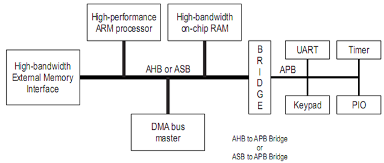
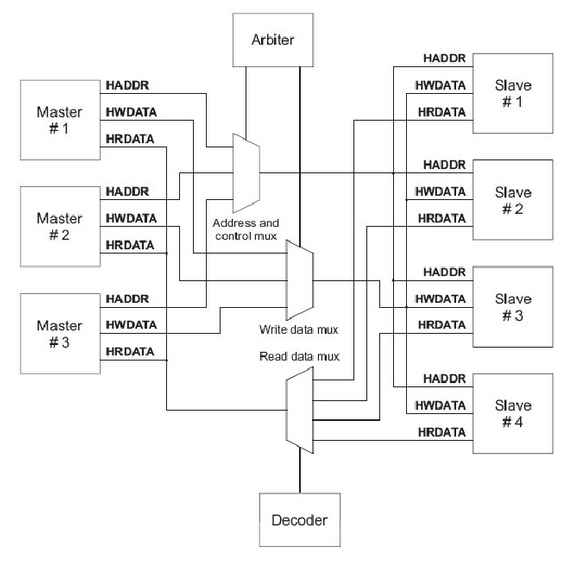
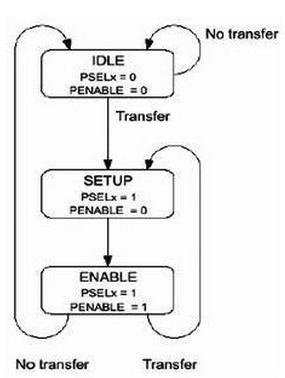

# amba_bus

### 修订记录
| 修订说明 | 日期 | 作者 | 额外说明 |
| --- |
| 初版 | 2018/04/10 | 员清观 |  |

---
## 1 基础
　　AMBA规范主要包括了AHB(Advanced High performance Bus)系统总线和APB(Advanced Peripheral Bus)外围总线。

　　AMBA 2.0规范包括四个部分：AHB、ASB、APB和Test Methodology。AHB的相互连接采用了传统的带有主模块和从模块的共享总线，接口与互连功能分离，这对芯片上模块之间的互连具有重要意义。AMBA已不仅是一种总线，更是一种带有接口模块的互连体系。下面将简要介绍比较重要的AHB和APB总线。

- **Advanced High-performance Bus (AHB)**

AHB总线用于高性能，高时钟工作频率模块。AHB在AMBA架构中为系统的高性能运行起到了基石作用。AHB为高性能处理器，片上内存，片外内存提供接口，同时桥接慢速外设。
特征：高性能，数据传输，多总线主控制器，突发连续传输，分 步传输
- **Advanced System Bus (ASB)**

ASB总线主要用于高性能系统模块。ASB是可用于AHB不需要的高性能特性的芯片设计上可选的系统总线。ASB也支持高性能处理器，片上内存，片外内存提供接口和慢速外设。
特征：高性能，数据传输，多总线主控制器，突发连续传输
- **Advanced Peripheral Bus (APB)**

APB总线用于为慢速外设提供总线技术支持。
APB是一种优化的，低功耗的，精简接口总线，可以技术多种不同慢速外设。由于APB是ARM公司最早提出的总线接口，APB可以桥接ARM体系下每一种系统总线

APB通过桥接高带宽、高性能总线，提供基本的微控制器二级总线，通常该总线上的外设有以下特点：　支持映射寄存器接口；对带宽没有很高的要求；通过编程实现对外设进行控制
特征：低功耗，寻址控制，支持简单接口协议，支持多种外设

---
### 1.1 AHB简介
　　AHB主要用于高性能模块(如CPU、DMA和DSP等)之间的连接，作为SoC的片上系统总线，它包括以下一些特性
 - 单个时钟边沿操作
 - 非三态的实现方式
 - 支持突发传输 / 支持分段传输
 - 支持多个主控制器、可配置32位~128位总线宽度
 - 支持字节，半字节和字的传输

#### 1.1.1 AHB构成
　　AHB 系统由主模块、从模块和基础结构(Infrastructure)3部分组成。整个AHB总线上的传输都由主模块发出，由从模块负责回应。基础结构则由仲裁器(arbiter)、主模块到从模块的多路器、从模块到主模块的多路器、译码器(decoder)、虚拟从模块(dummy Slave)、虚拟主模块(dummy Master)所组成
 - AHB主控制器：主控制器可以通过地址和控制信息，可以进行初始化，读，写操作。在同一时间，总线上只能有一个主控制器。

 - AHB从设备：从设备通常是指在其地址空间内，响应主控制器发出的读写控制操作的被动设备。通过操作的成功与否反馈给其主控制器，完成数据的传输控制。

 - AHB仲裁器：仲裁器根据用户的配置，确保在总线上同一时间只有一个主控制器拥有总线控制权限。AHB总线上只能有一个仲裁器。

 - AHB译码器：译码器解析在总线上传输的地址和控制信息。AHB总线上只能有一个译码器。

也允许在AHB上挂接一些慢速外设作为从设备，不过它们通常还是挂接在APB总线上

#### 1.1.2　AXI和AHB区别
AXI：高速度、高带宽，管道化互联，单向通道，只需要首地址，读写并行，支持乱序，支持非对齐操作，有效支持初始延迟较高的外设，连线非常多。

AHB协议需要一次突发传输的所有地址，地址与数据锁定对应关系，后一次突发传输必须在前次传输完成才能进行。

AXI只需要一次突发的首地址，可以连续发送多个突发传输首地址而无需等待前次突发传输完成，并且多个数据可以交错传递，此特征大大提高了总线的利用率。

AHB总线与AXI总线均适用于高性能、高带宽的SoC系统，但AXI具有更好的灵活性，而且能够读写通道并行发送，互不影响；更重要的是，AXI总线支持乱序传输，能够有效地利用总线的带宽，平衡内部系统。因此SoC系统中，均以AXI总线为主总线，通过桥连接AHB总线与APB总线，这样能够增加SoC系统的灵活性，更加合理地把不同特征IP分配到总线上。

---
### 1.2 APB简介

　　APB主要用于低带宽的周边外设之间的连接，例如UART、1284等，它的总线架构不像AHB支持多个主模块，在APB里面唯一的主模块就是APB桥。其特性包括：两个时钟周期传输、无需等待周期和回应信号、控制逻辑简单，只有四个控制信号。

 - 系统初始化为IDLE状态，此时没有传输操作，也没有选中任何从模块。
 - 当有传输要进行时，PSELx＝1，PENABLE＝0，系统进入SETUP状态，并只会在SETUP 状态停留一个周期。当PCLK的下一个上升沿时到来时，系统进入ENABLE 状态。
 - 系统进入ENABLE状态时，维持之前在SETUP 状态的PADDR、PSEL、PWRITE不变，并将PENABLE置为1。传输也只会在ENABLE状态维持一个周期，在经过SETUP与ENABLE状态之后就已完成。之后如果没有传输要进行，就进入IDLE状态等待；如果有连续的传输，则进入SETUP状态。

---
### 1.3 基于AMBA的片上系统
　　一个典型的基于AMBA总线的系统框图如图３所示。
　　　　　　
　　大多数挂在总线上的模块(包括处理器)只是单一属性的功能模块：主模块或者从模块。主模块是向从模块发出读写操作的模块，如CPU，DSP等；从模块是接受命令并做出反应的模块，如片上的RAM，AHB／APB 桥等。另外，还有一些模块同时具有两种属性，例如直接存储器存取(DMA)在被编程时是从模块，但在系统读传输数据时必须是主模块。
　　如果总线上存在多个主模块，就需要仲裁器来决定如何控制各种主模块对总线的访问。虽然仲裁规范是AMBA总线规范中的一部分，但具体使用的算法由RTL设计工程师决定，其中两个最常用的算法是固定优先级算法和循环制算法。AHB总线上最多可以有16个主模块和任意多个从模块，如果主模块数目大于16，则需再加一层结构(具体参阅ARM公司推出的Multi-layer AHB规范)。
　　APB 桥既是APB总线上唯一的主模块，也是AHB系统总线上的从模块。其主要功能是锁存来自AHB系统总线的地址、数据和控制信号，并提供二级译码以产生APB外围设备的选择信号，从而实现AHB协议到APB协议的转换。
