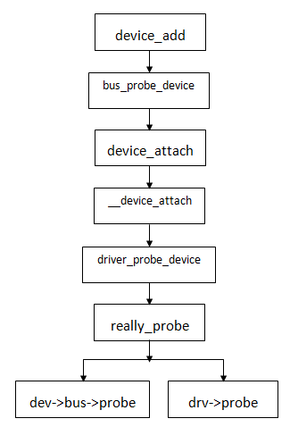

# amba_bus

### 修订记录
| 修订说明 | 日期 | 作者 | 额外说明 |
| --- |
| 初版 | 2018/04/10 | 员清观 |  |

## 1 源

**设备的创建**<br>
`q3f_init_devices()`函数中包含下面集中添加设备的方式:
- spi_register_board_info(spi_lcd_info, ARRAY_SIZE(spi_lcd_info));
- i2c_register_board_info(0, ip620x_info1, ARRAY_SIZE(ip620x_info1)); //audio/pmu等的加载方式
- amba_device_register(amba_devs[i], &iomem_resource);
- platform_add_devices(imap_dev_simple, ARRAY_SIZE(imap_dev_simple));-->一次多个platform_device_register()而已
- platform_device_register(&imap_otg_device); //usb的加载方式

好像所有驱动都需要找一个bus待着

**platform驱动模型三个对象：platform总线、platform设备、platform驱动**<br>
- platform总线对应的内核结构：struct bus_type-->它包含的最关键的函数：match() (要注意的是，这块由内核完成，我们不参与)
- platform设备对应的内核结构：struct platform_device-->注册：platform_device_register(unregister)
- platform驱动对应的内核结构：struct platform_driver-->注册：platform_driver_register(unregister)


另外一种方式:
```cpp
int imapx_ip6205_init(char *codec_name, char *cpu_dai_name, enum data_mode data, int enable, int id)
  imapx_ip6205_device = platform_device_alloc("soc-audio", -1);
  platform_set_drvdata(imapx_ip6205_device, &ip6205);
  platform_device_add(imapx_ip6205_device);
```

　
## 2 amba驱动程序基础

### 2.1 注册bus_type

**amba bus初始化**
```cpp
struct bus_type {
	const char		*name, *dev_name;
	struct device		*dev_root;
	struct bus_attribute	*bus_attrs;
	struct device_attribute	*dev_attrs;
	struct driver_attribute	*drv_attrs;
	int (*match)(struct device *dev, struct device_driver *drv); 	int (*uevent)(struct device *dev, struct kobj_uevent_env *env);
	int (*probe)(*remove)(*shutdown)(*resume)(struct device *dev);	int (*suspend)(struct device *dev, pm_message_t state);
	const struct dev_pm_ops *pm;	struct iommu_ops *iommu_ops;	struct subsys_private *p;	struct lock_class_key lock_key;
};

static int amba_match(struct device *dev, struct device_driver *drv)
	struct amba_device *pcdev = to_amba_device(dev);
  struct amba_driver *pcdrv = to_amba_driver(drv);
	|--> return amba_lookup(pcdrv->id_table, pcdev) != NULL;
  	while (table->mask)	ret = (dev->periphid & table->mask) == table->id;	if (ret) break;	table++;
  	return ret ? table : NULL;
static int platform_match(struct device *dev, struct device_driver *drv)
  //check of_driver_match_device(dev, drv);  check acpi_driver_match_device(dev, drv);
  if (pdrv->id_table)
    |--> return platform_match_id(pdrv->id_table, pdev) != NULL; //匹配依据：驱动和device的名称;一个驱动可以支持一个或者多个id
      while (id->name[0]) {if (strcmp(pdev->name, id->name) == 0) { pdev->id_entry = id; return id; }	id++;	}
  return (strcmp(pdev->name, drv->name) == 0);//如果没有定义id_table匹配多个设备名称的机制，那么直接使用drv和dev名称进行匹配

postcore_initcall(amba_init); //--> int __init amba_init(void) //--> return bus_register (&amba_bustype);
  struct subsys_private *priv = kzalloc(sizeof(struct subsys_private), GFP_KERNEL);
  priv->bus = bus;  bus->p = priv;  retval = kset_register(&priv->subsys);
  retval = bus_create_file(bus, &bus_attr_uevent);
  priv->devices_kset = kset_create_and_add("devices", NULL, &priv->subsys.kobj);
  priv->drivers_kset = kset_create_and_add("drivers", NULL, &priv->subsys.kobj);
  INIT_LIST_HEAD(&priv->interfaces);  __mutex_init(&priv->mutex, "subsys mutex", key);
  klist_init(&priv->klist_devices, klist_devices_get, klist_devices_put);
  klist_init(&priv->klist_drivers, NULL, NULL);
  retval = add_probe_files(bus);    retval = bus_add_attrs(bus);

//platform初始化过程 --> `start_kernel`->`rest_init`->`kernel_thread(kernel_init)`->`kernel_init_freeable`->`do_basic_setup`->`driver_init`->`platform_bus_init`
void __init driver_init(void) // drivers/base/init.c
  |--> platform_bus_init();
    early_platform_cleanup(); device_register(&platform_bus); bus_register(&platform_bus_type);
```

之后amaba driver和device都注册标记bus类型为：`amba_bustype`，driver需要定义`id_table`匹配数组，device定义`periphid`匹配项，通过`amba_match()`函数进行匹配．

**amba driver 初始化**
```cpp
struct amba_driver {
	struct device_driver	drv;
	int			(*probe)(struct amba_device *, const struct amba_id *);
	int			(*remove)(struct amba_device *);
	void			(*shutdown)(struct amba_device *);
	int			(*suspend)(struct amba_device *, pm_message_t);
	int			(*resume)(struct amba_device *);
	const struct amba_id	*id_table;
};
static int __init pl022_init(void) {
	module_power_on(SYSMGR_SSP_BASE);
	return amba_driver_register(&pl022_driver);
}
subsys_initcall_sync(pl022_init);
static void __exit pl022_exit(void) {
	amba_driver_unregister(&pl022_driver);
}
module_exit(pl022_exit);
```

**整体流程:**<br>
- 硬件设备模块初始化的时候,调用`driver_register()`注册定义的`struct amba_driver`驱动
- 注册amba设备,完成绑定
- 调用probe()函数创建实例

**amba device 初始化**<br>
amba总线设备总是使用`apb-clk`对吧?
`/sys/bus/amba/devices`目录下可以看到所有挂载的设备

**注册amba设备的两种方法**<br>
- `amba_device_alloc()`申请并初始化`struct amba_device`, 然后`amba_device_add()`添加注册
- `devices.c`文件中静态定义`struct amba_device`,然后`amba_device_register()`初始化并调用`amba_device_add()`添加注册

```cpp
struct amba_device {
	struct device		dev;
	struct resource		res;
	struct clk		*pclk;
	u64			dma_mask;
	unsigned int		periphid;
	unsigned int		irq[AMBA_NR_IRQS];
};

static inline bool pl022_filter(struct dma_chan *chan, void *param)
  u8 *peri_id = chan->private; return *peri_id == (unsigned)param;
static struct pl022_ssp_controller imap_ssp1_data = {
	.bus_id = 1, 	.num_chipselect = 1, 	.enable_dma = 1,
  .dma_tx_param = (void *)IMAPX_SSP0_TX,	.dma_rx_param = (void *)IMAPX_SSP0_RX,	.dma_filter = pl022_filter,
};
struct amba_device imap_ssp1_device = {
	.dev = { .init_name = "imap-ssp.1",  .platform_data = &imap_ssp1_data, },
	.res = { .start = IMAP_SSP1_BASE,    .end = IMAP_SSP1_BASE + IMAP_SSP1_SIZE - 1, .flags = IORESOURCE_MEM, },
	.irq = { GIC_SSP1_ID}, 	.periphid = 0x00041022, //通过此项定义匹配amba_driver.
};
void __init q3f_init_devices(void) --> amba_device_register(imap_ssp1_device, &iomem_resource);

设备成功注册后，就会添加到上面提到的总线设备集合中。在设备注册的过程中，系统要搜索总线上注册的驱动，看看有没有匹配的，如果设备还没有绑定驱动程序，则为其绑定一个
具体的调用过程如下：
  device_register-->>>device_add-->>>bus_attach_device-->>>device_attach-->>>__device_attach
```

### 3.1 基于platform总线的mmc
**基本数据结构**
```cpp
struct platform_device {
  const char	*name;/* 设备名 */
	int		id;//设备id，用于给插入给该总线并且具有相同name的设备编号，如果只有一个设备的话填-1。
	bool	id_auto;
	struct device	dev;//结构体中内嵌的device结构体。
	u32		num_resources;　/* 设备所使用各类资源数量 */
	struct resource	*resource;//定义平台设备的资源
	const struct platform_device_id	*id_entry;
	struct mfd_cell *mfd_cell;  /* MFD cell pointer */
	struct pdev_archdata	archdata; /* arch specific additions */
};
struct platform_driver {
  int (*probe)(*remove)(*resume)(struct platform_device *);
	void (*shutdown)(struct platform_device *);
	int (*suspend)(struct platform_device *, pm_message_t state);
	struct device_driver driver;
	const struct platform_device_id *id_table;
};
```

**dw_mmc platform device**
device可以使用module_init()+platform_device_register()注册，或者集中在board级别设备初始化中使用platform_add_devices()集中注册

**dw_mmc platform drvier**
platform 驱动只是在设备驱动外套一层platform_driver 的外壳。比如编写的是基于字符设备的platform驱动，在遵循并实现platform总线上驱动与设备的特定接口的情况下，最核心的还是字符设备的核心结构：cdev、 file_operations（他包含的操作函数接口）、dev_t(设备号)、设备文件（/dev）等，因为用platform机制编写的字符驱动，它的本质是字符驱动。

```cpp
static int dw_mci_pltfm_probe(struct platform_device *pdev)
	|--> return dw_mci_pltfm_register(pdev, NULL); //int dw_mci_pltfm_register(struct platform_device *pdev,	const struct dw_mci_drv_data *drv_data)
    struct dw_mci_board *pdata = pdev->dev.platform_data;
    struct dw_mci *host = devm_kzalloc(&pdev->dev, sizeof(struct dw_mci), GFP_KERNEL);
    struct resource	*regs = platform_get_resource(pdev, IORESOURCE_MEM, 0);
    host->regs = devm_ioremap_resource(&pdev->dev, regs);
    host->pdata->init(0,NULL,NULL);
    host->irq = platform_get_irq(pdev, 0);//获取irq资源
    ret = drv_data->init(host);
    platform_set_drvdata(pdev, host);
    |--> ret = dw_mci_probe(host);//int dw_mci_probe(struct dw_mci *host)
      const struct dw_mci_drv_data *drv_data = host->drv_data;
      if (!host->pdata) 	host->pdata = dw_mci_parse_dt(host);
      g_host = host;
			host->biu_clk = clk_get_sys("sdmmc.1", "sdmmc1");  ret = clk_prepare_enable(host->biu_clk);
			host->ciu_clk = clk_get_sys("imap-mmc.1", "sd-mmc1"); ret = clk_prepare_enable(host->ciu_clk);
      host->bus_hz = clk_get_rate(host->ciu_clk);
      if (drv_data && drv_data->setup_clock)
        ret = drv_data->setup_clock(host);
      host->quirks = host->pdata->quirks; spin_lock_init(&host->lock);  INIT_LIST_HEAD(&host->queue);
      host->push_data = dw_mci_push_data32;  		host->pull_data = dw_mci_pull_data32;
  		width = 32;  		host->data_shift = 2;    mci_wait_reset(host->dev, host)；
      host->dma_ops = host->pdata->dma_ops;　dw_mci_init_dma(host); for each mci_writel(host, xxxx, xxxx);
      tasklet_init(&host->tasklet, dw_mci_tasklet_func, (unsigned long)host);
      host->card_workqueue = alloc_workqueue("dw-mci-card",	WQ_MEM_RECLAIM | WQ_NON_REENTRANT, 1);
      INIT_WORK(&host->card_work, dw_mci_work_routine_card);
      ret = devm_request_irq(host->dev, host->irq, dw_mci_interrupt, host->irq_flags, "dw-mci", host);
      for (i = 0; i < host->num_slots; i++)
		    ret = dw_mci_init_slot(host, i);
static const struct of_device_id dw_mci_pltfm_match[] = {
	{ .compatible = "snps,dw-mshc", },	{},};//好像是设备树的相关内容
static struct platform_driver dw_mci_pltfm_driver = {
	.probe		= dw_mci_pltfm_probe,device_driver
	.remove		= dw_mci_pltfm_remove,
	.driver		= {
		.name		= "imap-mmc1",
		.of_match_table	= of_match_ptr(dw_mci_pltfm_match),
		.pm		= &dw_mci_pltfm_pmops,
	},
};
static int __init dw_mci_platform_init(void)
	|--> return

static void __exit dw_mci_platform_exit(void) {
	|--> platform_driver_unregister(&dw_mci_pltfm_driver); }
subsys_initcall(dw_mci_platform_init);
module_exit(dw_mci_platform_exit);
```

## 4 框架
**dev drv register基本流程**


**device_add()基本流程**
linux设备模型：设备device，驱动driver，总线bus。设备代表物理设备，驱动代表了设备操作方法，bus则是用来管理和匹配它们。device和driver里面都有一个成员变量bus，表示它们归哪个总线管理，bus里面则有两个链表，device链表和driver链表。当有新的设备加入的时候，就会将它加入它对应的bus的device链表，然后在它的驱动链表中寻找是否有驱动driver和该device匹配成功，如果匹配成功设备就可以正常使用了，否则，不好意思继续等待。当有新的驱动加入的时候，就会将它加入它对应的bus的driver链表，然后在它的设备链表中寻找是否有设备device和该driver匹配成功，如果成功设备就可以正常使用了.`device_add()`就是将设备加入到Linux设备模型的关键，它的内部将找到它的bus，然后让它的bus给它找到它的driver，其调用顺序为：



### 4.1 amba-platform-iic-spi基本API

**基本数据结构**<br>
```cpp
struct bus_type amba_bustype = {
	.name		= "amba", 	.dev_attrs	= amba_dev_attrs,	.match		= amba_match,	.uevent		= amba_uevent,	.pm		= AMBA_PM,
};
struct bus_type platform_bus_type = {
	.name		= "platform",	.dev_attrs	= platform_dev_attrs,	.match		= platform_match,	.uevent		= platform_uevent,
  .pm		= &platform_dev_pm_ops,
};
struct bus_type i2c_bus_type = {
	.name		= "i2c",	.match		= i2c_device_match,	.probe		= i2c_device_probe,	.remove		= i2c_device_remove,
	.shutdown	= i2c_device_shutdown,	.pm		= &i2c_device_pm_ops,
};
struct bus_type spi_bus_type = {
	.name		= "spi",	.dev_attrs	= spi_dev_attrs,	.match		= spi_match_device,	.uevent		= spi_uevent,	.pm		= &spi_pm,
};
```

```cpp
int amba_driver_register(struct amba_driver *drv)
  drv->drv.bus = &amba_bustype;
  #define SETFN(fn)	if (drv->fn) drv->drv.fn = amba_##fn
  SETFN(probe); SETFN(remove); SETFN(shutdown); return driver_register(&drv->drv);
int platform_driver_register(struct platform_driver *drv)
  drv->driver.bus = &platform_bus_type;
  if (drv->probe)  		drv->driver.probe = platform_drv_probe;//有效probe，关联起来
  if (drv->remove) 		drv->driver.remove = platform_drv_remove;
  if (drv->shutdown)	drv->driver.shutdown = platform_drv_shutdown;
  return driver_register(&drv->driver);
int i2c_register_driver(struct module *owner, struct i2c_driver *driver)
  driver->driver.owner = owner;	driver->driver.bus = &i2c_bus_type;
  driver_register(&driver->driver);
  INIT_LIST_HEAD(&driver->clients); i2c_for_each_dev(driver, __process_new_driver);
int spi_register_driver(struct spi_driver *sdrv)
  sdrv->driver.bus = &spi_bus_type;
  if (sdrv->probe)		sdrv->driver.probe = spi_drv_probe;
	if (sdrv->remove)		sdrv->driver.remove = spi_drv_remove;
	if (sdrv->shutdown)		sdrv->driver.shutdown = spi_drv_shutdown;
	return driver_register(&sdrv->driver);

int amba_device_register(struct amba_device *dev, struct resource *parent)
  |--> amba_device_initialize(dev, dev->dev.init_name);
    device_initialize(&dev->dev);	if (name) dev_set_name(&dev->dev, "%s", name); dev->dev.release = amba_device_release;
    dev->dev.bus = &amba_bustype;	dev->dev.dma_mask = &dev->dma_mask; dev->res.name = dev_name(&dev->dev);
  dev->dev.init_name = NULL;
	if (!dev->dev.coherent_dma_mask && dev->dma_mask)
		dev_warn(&dev->dev, "coherent dma mask is unset\n");
	|--> return amba_device_add(dev, parent); //添加
    int ret = request_resource(parent, &dev->res);
    ret = device_add(&dev->dev); //在下文中有详细流程
    for each (dev->irq[i]) ret = device_create_file(&dev->dev, &dev_attr_irq[i]);
int platform_device_register(struct platform_device *pdev)
  device_initialize(&pdev->dev);	arch_setup_pdev_archdata(pdev);
	|--> return platform_device_add(pdev);
    pdev->dev.bus = &platform_bus_type;
    dev_set_name(&pdev->dev, "%s.%d", pdev->name, xxx);
    ret = device_add(&pdev->dev);
```

**其他一些接口**<br>
```cpp
platform_get_resource、platform_get_irq、platform_get_resource_byname、platform_get_irq_byname，通过这些接口，可以获取platform_device变量中的resource信息，以及直接获取IRQ的number等等。
extern struct platform_device *platform_device_alloc(const char *name, int id);
extern int platform_device_add_resources(struct platform_device *pdev, const struct resource *res, unsigned int num);
extern int platform_device_add_data(struct platform_device *pdev, const void *data, size_t size);
extern int platform_device_add(struct platform_device *pdev);
extern void platform_device_del(struct platform_device *pdev);
extern void platform_device_put(struct platform_device *pdev);


platform_set_drvdata、platform_get_drvdata，设置或者获取driver保存在device变量中的私有数据。
```

### 4.2 device基本API

```cpp
struct device {
	struct device		*parent;
	struct device_private	*p;
	struct kobject kobj;
	const char		*init_name; /* initial name of the device */
	const struct device_type *type;
	struct mutex		mutex;	/* mutex to synchronize calls to its driver.*/

	struct bus_type	*bus;		/* type of bus device is on */
	struct device_driver *driver;	/* which driver has allocated this device */
	void		*platform_data;	/* Platform specific data, device core doesn't touch it */
	struct dev_pm_info	power;
	struct dev_pm_domain	*pm_domain;

	u64		*dma_mask;	/* dma mask (if dma'able device) */
	u64		coherent_dma_mask;/* Like dma_mask, but for alloc_coherent mappings as not all hardware supports
					     64 bit addresses for consistent allocations such descriptors. */

	struct device_dma_parameters *dma_parms;
	struct list_head	dma_pools;	/* dma pools (if dma'ble) */
	struct dma_coherent_mem	*dma_mem; /* internal for coherent mem  override */

	struct cma *cma_area;		/* contiguous memory area for dma allocations */

	/* arch specific additions */
	struct dev_archdata	archdata;

	struct device_node	*of_node; /* associated device tree node */
	struct acpi_dev_node	acpi_node; /* associated ACPI device node */

	dev_t			devt;	/* dev_t, creates the sysfs "dev" */
	u32			id;	/* device instance */

	spinlock_t		devres_lock;
	struct list_head	devres_head;

	struct klist_node	knode_class;
	struct class		*class;
	const struct attribute_group **groups;	/* optional groups */

	void	(*release)(struct device *dev);
	struct iommu_group	*iommu_group;
};
//需要重点关注的几个常用成员，devices.c中最经常初始化的几项：
//   - void		*platform_data;  这个有点类似于给用户提供的自留地，用户可以在里面存放各种底层信息。当driver的probe()执行时，platform_device会作为参数传进去，这样驱动就能够间接的得到这个 void *platform_data，从而据此操作硬件；新内核则直接在设备节点属性中存放数据，驱动通过API读取节点里的数据
//   - dma_mask
//   - coherent_dma_mask

//驱动和设备的匹配
int driver_probe_device(struct device_driver *drv, struct device *dev) //--> really_probe(dev, drv);
  dev->driver = drv; //绑定，然后调用bus或者driver的probe函数．
  if (dev->bus->probe)  ret = dev->bus->probe(dev);
  else if (drv->probe) ret = drv->probe(dev);
  driver_bound(dev);
void bus_probe_device(struct device *dev)　//从主干中拉出来详细解释
  |--> if (bus->p->drivers_autoprobe) ret = device_attach(dev); //
    if (dev->driver) ret = device_bind_driver(dev); //--> driver_sysfs_add(dev);  driver_bound(dev);
    |--> else bus_for_each_drv(dev->bus, NULL, dev, __device_attach);
        if (!driver_match_device(drv, dev))	return 0; //调用总线的匹配函数, drv->bus->match(dev, drv), 不匹配就返回
        return driver_probe_device(drv, dev);
int driver_attach(struct device_driver *drv)//-->return bus_for_each_dev(drv->bus, NULL, drv, __driver_attach);
  if (!driver_match_device(drv, dev))	return 0; //调用总线的匹配函数, drv->bus->match(dev, drv), 不匹配就返回
  if (!dev->driver)	driver_probe_device(drv, dev); //见上.

int bus_add_device(struct device *dev)
  struct bus_type *bus = bus_get(dev->bus);
  if (bus) //应该结合上文中bus_register()阅读
    error = device_add_attrs(bus, dev);//创建相应的属性文件
    error = sysfs_create_link(&bus->p->devices_kset->kobj, &dev->kobj, dev_name(dev));//在sys/bus/总线类型/devices/dev_name()dev 在devices目录下创建名字为devname（d）指向sys/devices/相同设备名字的 符号链接
    error = sysfs_create_link(&dev->kobj, &dev->bus->p->subsys.kobj, "subsystem");//在sys/devices/设备名字/目录下创建目录名字为subsystem 并且指向在sys/bus/总线类型/devices/de符号链接
    klist_add_tail(&dev->p->knode_bus, &bus->p->klist_devices);//把设备加入到总线的设备链中，这步才是重点

int device_add(struct device *dev)
  dev = get_device(dev);//增加该设备的引用计数
  if (!dev->p) error = device_private_init(dev);//初始化设备的私有成员p
  dev_set_name(dev, "%s", dev->init_name);//初始化设备内部的kobject的名字
  dev->init_name = NULL;
  if (!dev_name(dev) && dev->bus && dev->bus->dev_name)
      dev_set_name(dev, "%s%u", dev->bus->dev_name, dev->id);//使用bus以及设备id来初始化设备内部kobject名字
  parent = get_device(dev->parent);//增加设备父设备并增加父设备引用计数
  kobj = get_device_parent(dev, parent);　  set_dev_node(dev, dev_to_node(parent));
  error = kobject_add(&dev->kobj, dev->kobj.parent, NULL);//将设备加入到kobject模型中，创建sys相关目录
  if (platform_notify)    platform_notify(dev);
  error = device_create_file(dev, &uevent_attr); //创建sys目录下设备的uevent属性文件，通过它可以查看设备的uevent事件
  if (MAJOR(dev->devt))  //如果定义了devt，则产生dev属性,并在/dev目录下产生设备节点文件
    error = device_create_file(dev, &devt_attr);//创建sys目录下设备的设备号属性，即major和minor，主要是在sys/devices/...中添加dev属性文件
    error = device_create_sys_dev_entry(dev);//在/sys/dev/char/或者/sys/dev/block/创建devt的属性的连接文件,形如10:45,由主设备号和次设备号构成,指向/sys/devices/.../的具体设备目录,该链接文件只具备读属性，显示主设备号：次设备号，如10:45,用户空间udev相应uevent事件时，将根据设备号在/dev下创建节点文件
    devtmpfs_create_node(dev);
  error = device_add_class_symlinks(dev);//创建类符号链接//相互创建dev和class之间的链接文件
  r = device_add_attrs(dev);//创建sys目录下设备其他属性文件  //添加设备属性文件
  error = bus_add_device(dev);//将设备加入到管理它的bus总线的设备链表上，创建subsystem链接文件，链接class下的具体的子系统文件夹
  error = dpm_sysfs_add(dev);//电源管理相关,添加设备的电源管理属性，截止这里，我们的/sys/devices/.../具体设备目录下至少生成有以下四个属性文件：uevent，dev，subsystem,power,你找到了吗？
  device_pm_add(dev);   //添加设备到激活设备列表中，用于电源管理
  if (dev->bus) blocking_notifier_call_chain(&dev->bus->p->bus_notifier,BUS_NOTIFY_ADD_DEVICE, dev);//通知注册监听该总线的设备，有新设备加入, 执行bus通知链上的注册函数，由设备注册上来
  kobject_uevent(&dev->kobj, KOBJ_ADD);//产生一个内核uevent事件，该事件可以被内核以及应用层捕获，属于linux设备模型中热插拔机制
  //产生一个KOBJ_ADD的uevent事件，通过netlink机制和用户空间通信，这个driver_register中已经分析过了
  bus_probe_device(dev); //--> device_attach(dev); 给设备探测相应的驱动开始寻找设备所对应的驱动,去bus上找dev对应的drv,主要执行__device_attach,主要进行match,sys_add,执行probe函数和  绑定等操作
  if (parent)
    klist_add_tail(&dev->p->knode_parent, &parent->p->klist_children);//把设备添加到父设备的children列表中,建立设备与总线间的父子关系，如果设备有父设备，将它加入parent的子设备链中
  if (dev->class) //如果设备的属于某个设备类，比如Mass storage，HID等等
    mutex_lock(&dev->class->p->mutex);  //如果改dev有所属类，则将dev的添加到类的设备列表里面/* tie the class to the device */
    klist_add_tail(&dev->knode_class,&dev->class->p->klist_devices);//将设备挂接在其设备类上面，把设备添加到class的设备链表中，完成关联
    /* notify any interfaces that the device is here */
    list_for_each_entry(class_intf,&dev->class->p->interfaces, node)
        if (class_intf->add_dev)
          class_intf->add_dev(dev, class_intf);//通知有新设备加入,执行改dev的class_intf->add_dev(),这个有个好处，就是只有设备匹配注册成功了，才进行其它的注册工作(如字符设备的注册，生成/dev/***节点文件)以及部分初始化工作。
    mutex_unlock(&dev->class->p->mutex);
```

**device_add()基本流程**
```cpp
void device_initialize(struct device *dev)
  dev->kobj.kset = devices_kset;            //设置设备的kobject所属集合，devices_kset其实在第一层，sys/devices/
  kobject_init(&dev->kobj, &device_ktype);  //初始化设备的kobject
  INIT_LIST_HEAD(&dev->dma_pools);          //初始化设备的DMA池，用于传递大数据
  mutex_init(&dev->mutex);                  //初始化互斥锁
  lockdep_set_novalidate_class(&dev->mutex);
  spin_lock_init(&dev->devres_lock);        //初始化自旋锁，用于同步子设备链表
  INIT_LIST_HEAD(&dev->devres_head);        bus_add_device//初始化子设备链表头
  device_pm_init(dev);
  set_dev_node(dev, -1);
```

### 4.3 driver基本API
**device driver**
硬件设备模块初始化的时候,调用`driver_register()`注册定义的`struct amba_driver`驱动


为了更好的管理资源,linux实现了基本的面向对象管理机制,与sysfs文件系统紧密相连,在内核中注册的每个kobject对象对应sysfs文件系统中的一个目录。类似于C++中的基类,Kobject常被嵌入于其他类型(即:容器)中。如bus,devices,drivers都是典型的容器。这些容器通过kobject连接起来,形成了一个树状结构。Bus:在内核中注册的每条总线在该目录下对应一个子目录,如: i2c platform spi ide pci scsi等等 其中每个总线目录内又包含两个子目录:devices和drivers ,devices目录包含了在整个系统中发现的属于该总线类型的设备,drivers目录包含了注册到该总线。

**driver_find过程如下：**<br>
1. driver_find，拿到了drv->name和drv->bus开始找驱动
2. kset_find_obj 通过driver_find传递的bus->p->drivers_kset，利用list_for_each_entry遍历kset循环链表。（kset结构体中有循环链表指针next和prev）
3. 遍历循环链表中每一个kobj中的成员变量name
4. 通过strcmp(kobject_name(k), name)比较drv->name 和kobj中的name，如果有相同则表示查找成功
5. return :如果找到，则返回device_driver的指针，如果没有找到则返回了NULL。

```cpp
struct device_driver {
	const char		*name; //名称
	struct bus_type		*bus;　//总线类型
	struct module		*owner;
	const char		*mod_name;	/* used for built-in modules */
	bool suppress_bind_attrs;	/* disables bind/unbind via sysfs */
	const struct of_device_id	*of_match_table;
	const struct acpi_device_id	*acpi_match_table;
	int (*probe)(*remove)(*resume) (struct device *dev);
	void (*shutdown) (struct device *dev);
	int (*suspend) (struct device *dev, pm_message_t state);
	const struct attribute_group **groups;
	const struct dev_pm_ops *pm;
	struct driver_private *p;
};

int driver_register(struct device_driver *drv)
  |--> other = driver_find(drv->name, drv->bus); //查找驱动是否已经装载
    |--> struct kobject *k = kset_find_obj(bus->p->drivers_kset, name);//检索driver对应kset链表中每一个kobj
      list_for_each_entry(k, &kset->list, entry)
        if (kobject_name(k) && !strcmp(kobject_name(k), name)) { ret = kobject_get_unless_zero(k); break; }
    if(k)  {kobject_put(k); priv = to_driver(k); return priv->driver;} else return NULL;
  |--> ret = bus_add_driver(drv);//根据总线类型添加驱动  int bus_add_driver(struct device_driver *drv)
    struct bus_type *bus = bus_get(drv->bus); //判断是否有效，增加访问计数
    struct driver_private *priv = kzalloc(sizeof(*priv), GFP_KERNEL);
    klist_init(&priv->klist_devices, NULL, NULL); priv->drv = drv; drv->p = priv; priv->kobj.kset = bus->p->drivers_kset;
    kobject_init_and_add(&priv->kobj, &driver_ktype, NULL, "%s", drv->name);//kset/kobject节点初始化，插入链表
    klist_add_tail(&priv->knode_bus, &bus->p->klist_drivers); //初始化当前驱动的kobj并添加到kset链表中
    driver_attach(drv); //return bus_for_each_dev(drv->bus, NULL, drv, __driver_attach); 为每一个device调用__driver_attach
    module_add_driver(drv->owner, drv);
    error = driver_create_file(drv, &driver_attr_uevent);
    error = driver_add_attrs(bus, drv);
  |--> driver_add_groups(drv, drv->groups);//将驱动添加到对应组中
    for (i = 0; groups[i]; i++)
      error = sysfs_create_group(&drv->p->kobj, groups[i]);
  |--> kobject_uevent(&drv->p->kobj, KOBJ_ADD);//注册uevent事件
    return kobject_uevent_env(kobj, action, NULL);
```

## 5 probe初始化的资源
在Linux中， 系统资源包括I/O、Memory、Register、IRQ、DMA、Bus等多种类型。这些资源大多具有独占性，不允许多个设备同时使用，因此Linux内核提供了一些API，用于分配、管理这些资源

### 5.1 resource

```cpp
struct resource {
	resource_size_t start;//内存或中断号的开始地址和结束值
	resource_size_t end;
	const char *name;
	unsigned long flags;//IORESOURCE_MEM IORESOURCE_IRQ 最常用
	struct resource *parent, *sibling, *child;
};

	res = platform_get_resource(pdev, IORESOURCE_MEM, 0);
	gpio_con = ioremap(res->start, res->end - res->start + 1);
	res = platform_get_resource(pdev, IORESOURCE_IRQ, 0);

  request_resource
  ioremap

```
### 5.2 中断
### 5.3 时钟
### 5.4 gpio资源
包括普通输入输出和中断

**内核驱动中gpio的使用**<br>
```cpp
 #include <linux/gpio.h>

1 测试gpio端口是否合法 int gpio_is_valid(int number);
2 申请某个gpio端口当然在申请之前需要显示的配置该gpio端口的pinmux
        int gpio_request(unsigned gpio, const char *label)
3 标记gpio的使用方向包括输入还是输出
       /*成功返回零失败返回负的错误值*/
       int gpio_direction_input(unsigned gpio);
       int gpio_direction_output(unsigned gpio, int value);
4 获得gpio引脚的值和设置gpio引脚的值(对于输出)
      int gpio_get_value(unsigned gpio);
      void gpio_set_value(unsigned gpio, int value);
5 gpio当作中断口使用
      int gpio_to_irq(unsigned gpio);
      返回的值即中断编号可以传给request_irq()和free_irq()
      内核通过调用该函数将gpio端口转换为中断，在用户空间也有类似方法
6 导出gpio端口到用户空间
      int gpio_export(unsigned gpio, bool direction_may_change);
      内核可以对已经被gpio_request()申请的gpio端口的导出进行明确的管理，
      参数direction_may_change表示用户程序是否允许修改gpio的方向，假如可以
      则参数direction_may_change为真
      /* 撤销GPIO的导出 */
      void gpio_unexport();
```

**通过 sysfs 方式控制 GPIO**<br>
先访问 /sys/class/gpio 目录，向 export 文件写入 GPIO 编号，使得该 GPIO 的操作接口从内核空间暴露到用户空间，GPIO 的操作接口包括 direction 和 value 等，direction 控制 GPIO 方向，而 value 可控制 GPIO 输出或获得 GPIO 输入。文件 IO 方式操作 GPIO，使用到了4个函数 open、close、read、write。 首先，看看系统中有没有“/sys/class/gpio”这个文件夹。如果没有请在编译内核的时候加入：Device Drivers -> GPIO Support -> /sys/class/gpio/… (sysfs interface)

`/sys/class/gpio/gpiochipX`目录保存系统中GPIO寄存器的信息，包括每个寄存器控制引脚的起始编号base，寄存器名称，引脚总数 导出一个引脚的操作步骤.其中direction文件，定义输入输入方向，可以通过下面命令定义为输出。direction接受的参数：in, out, high, low。high/low同时设置方向为输出，并将value设置为相应的1/0

```cpp
  echo 50 > /sys/class/gpio/export        //文件用于通知系统需要导出控制的GPIO引脚编号
  echo out  > /sys/class/gpio/gpio50/direction
  echo 1 > /sys/class/gpio/gpio50/value
  cat /sys/class/gpio/gpio50/value
  echo 50 > /sys/class/gpio/unexport      //用于通知系统取消导出
```

### 5.5 电源pmu/regulator
imapx_tqlp9624_probe()
### 5.6
```cpp
	// 注册设备驱动 创建设备节点
	major = register_chrdev(0, "myled", &led_fops);
	// 创建类
	cls = class_create(THIS_MODULE, "myled");
	// 创建设备节点
	dev = device_create(cls, NULL, MKDEV(major, 0), NULL, "led");
```
## 6 其他暂时无法关注的misc
**add_uevent_var()**
`static int amba_uevent(struct device *dev, struct kobj_uevent_env *env)`
`container_of()`
`put_device()`
