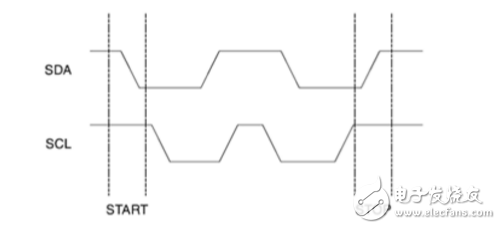
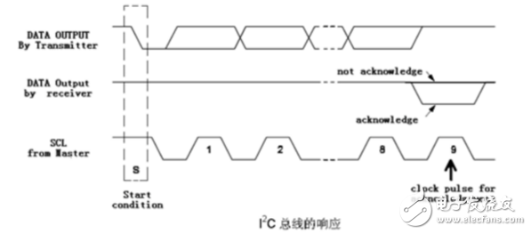
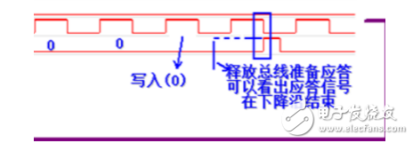
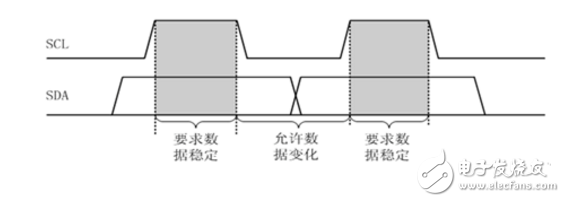
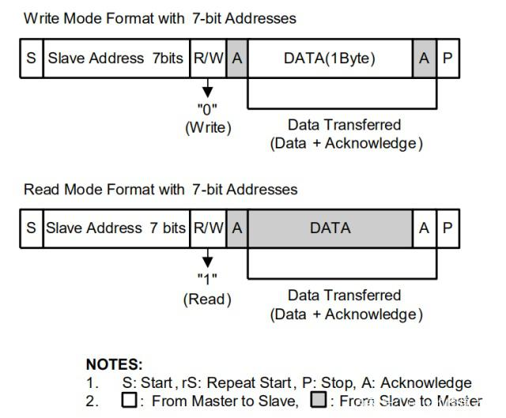
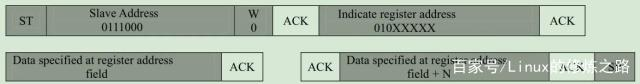
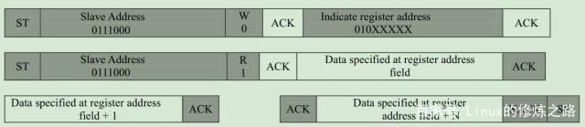
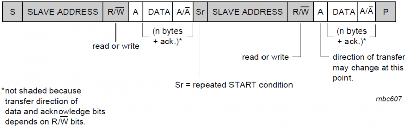
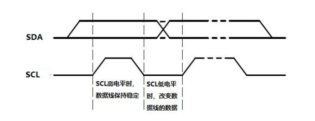
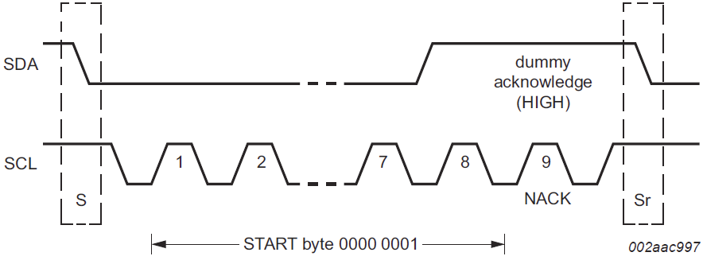

##

###  修订记录
| 修订说明 | 日期 | 作者 | 额外说明 |
| --- |
| 初版 | 2018/06/28 | 员清观 |  |

## 1 i2c总线概述

I2C总线是由Philips公司开发的一种简单、双向二线制同步串行总线。它只需要两根线即可在连接于总线上的设备之间通信。I2C的两根线SDA（串行数据线）和SCL（串行时钟线）都是双向I/O线，接口电路为开漏输出，需通过上拉电阻接电源VCC，当总线空闲时，两根线都是高电平。

I2C使用一个7bit的设备地址，一组总线最多和112个节点通信。最大通信数量受限于地址空间及400pF的总线电容。常见的I2C总线以传输速率的不同分为不同的模式：标准模式（100Kbit/s）、低速模式（10Kbit/s）、快速模式（400Kbit/s）、高速模式（3.4Mbit/s），时钟频率可以被下降到零，即暂停通信。该总线是一种多主控总线，即可以在总线上放置多个主设备节点，在停止位（P）发出后，即通讯结束后，主设备节点可以成为从设备节点。

参考网页：
  http://www.wangdali.net/i2c/

## 2 i2c tool调试

## 3 读写

### 3.1 i2c总线协议的工作原理详解

**1.空闲状态** 
　　I2C总线总线的SDA和SCL两条信号线同时处于高电平时，规定为总线的空闲状态。
　　此时各个器件的输出级场效应管均处在截止状态，即释放总线，由两条信号线各自的上拉电阻把电平拉高。

**2.起始位与停止位的定义** 
起始信号：当SCL为高期间，SDA由高到低的跳变；启动信号是一种电平跳变时序信号，而不是一个电平信号。
停止信号：当SCL为高期间，SDA由低到高的跳变；停止信号也是一种电平跳变时序信号，而不是一个电平信号。
起始和终止信号都是由主机发出的，在起始信号产生后，总线就处于被占用的状态；在终止信号产生后，总线就处于空闲状态。

接收器件收到一个完整的数据字节后，有可能需要完成一些其它工作，如处理内部中断服务等，可能无法立刻接收下一个字节，这时接收器件可以将SCL线拉成低电平，从而使主机处于等待状态。直到接收器件准备好接收下一个字节时，再释放SCL线使之为高电平，从而使数据传送可以继续进行

**3.ACK** 
发送器每发送一个字节，就在时钟脉冲9期间释放数据线，由接收器反馈一个应答信号。应答信号为低电平时，规定为有效应答位（ACK简称应答位），表示接收器已经成功地接收了该字节；应答信号为高电平时，规定为非应答位（NACK），一般表示接收器接收该字节没有成功。对于反馈有效应答位ACK的要求是，接收器在第9个时钟脉冲之前的低电平期间将SDA线拉低，并且确保在该时钟的高电平期间为稳定的低电平。如果接收器是主控器，则在它收到最后一个字节后，发送一个NACK信号，以通知被控发送器结束数据发送，并释放SDA线，以便主控接收器发送一个停止信号P。

如下图逻辑分析仪的采样结果：释放总线后，如果没有应答信号，sda应该一直持续为高电平，但是如图中蓝色虚线部分所示，它被拉低为低电平，证明收到了应答信号。这里面给我们的两个信息是：1）接收器在SCL的上升沿到来之前的低电平期间拉低SDA；2）应答信号一直保持到SCL的下降沿结束；正如前文红色标识所指出的那样。

**4.数据的有效性：** 
I2C总线进行数据传送时，时钟信号为高电平期间，数据线上的数据必须保持稳定，只有在时钟线上的信号为低电平期间，数据线上的高电平或低电平状态才允许变化。

**5.数据的传送：** 
在I2C总线上传送的每一位数据都有一个时钟脉冲相对应（或同步控制），即在SCL串行时钟的配合下，在SDA上逐位地串行传送每一位数据。数据位的传输是边沿触发。

### 3.2 读写过程

支持对连续寄存器的burst读写方式
**主机写RPR0521中某个寄存器** 

（寄存器的地址是8位的，寄存器中数据也是8位的）
1. 主机发送完7位的从机地址和写位
2. 主机发送8位的要写的从机的内部寄存器地址
3. 从机收到后发送ACK主机收到ACK后，然后发送要往这个寄存器写的数据
4. 如果主机不继续写数据就直接发送stop，如果还要往下一个寄存器继续写（寄存器地址必须连续）那么回到步骤4发送下一个数据，直到写完发送stop

**主机读RPR0521中某个寄存器的值** 

 寄存器的地址是8位的，寄存器中数据也是8位的）
1. 主机发送完7位的从机地址和写位（一定要注意，先写然后读）
2. 主机发送8位的要读的从机的内部寄存器地址（用于确定要读的寄存器的地址）
3. 从机收到后发送ACK
4. 主机收到ACK后发送7位的从机地址和读位，然后等待接收数据
5. 主机收到ACK和从机发送过来的数据如果主机不读了就发送stop，如果继续读就回到步骤5（从机会自动发送连续寄存器的数据）

主设备要读取的数据，如果是大于一个字节的多个数据，就发送ACK应答信号（ACK），而不是非应答信号（NOACK），然后主设备再次接收从设备发送的数据，依次类推，直到主设备读取的数值是最后一个字节数据后，需要主设备给从设备发送非应答信号（NOACK），再发送结束信号（P），结束I2C通讯，并释放I2C总线。

**混合模式** 

通过 Sr 时序在一次传输中切换读写目标从机地址

## 4 时序

**sda时序要求** 
所有的数据传输过程中，SDA线的电平变化必须在SCL为低电平时进行，SDA线的电平在SCL线为高电平时要保持稳定不变。

## 5. 其他情况和出错处理
**详细可见参考网页** 
  保留地址，十位地址系统 通用广播地址
**软件复位** 
通用广播地址0000 0000后发送0000 0110（06h）可以使总线上设备进入复位过程。该功能是可选的，所有预留该功能的设备在收到该两字节序列（00 06h）后，开始响应（复位），并进入它们地址的可编程部分。注意确保设备在加电后不会将SDA或SCL拉低，因为这些低电平会阻塞总线。

**起始字节** 
起始字节是提供给没有I2C总线接口的单片机查询I2C总线时使用的特殊字节。
不具备I2C总线接口的单片机，必须通过软件不断地检测总线，以便及时响应总线请求。单片机的速度与硬件接口器件的速度可能存在较大的差别。为此，I2C上的数据传送需要一个较长的起始过程加以引导。引导过程由起始信号、起始字节、应答位、重复起始信号（Sr）组成。

请求访问总线的主机发出开始条件（S）后，紧接着发送起始字节 0000 0001，总线上的单片机可以用比较低的速率采样SDA线，直到检测到起始字节中的7个“0”中的一个为止。在检测到SDA上的高电平后，单片机可以切换到较高的采样速率，采样作为同步信号使用的第二个起始信号Sr。
在起始信号后的应答时钟脉冲仅仅是为了和总线所使用的格式一致，并不要求设备在这个脉冲期间作应答。

**Bus Clear** 
- SCL：一般情况下，SCL不会拥堵（stuck）在低电平，出现这种情况的话，如果设备包含硬件复位引脚，推荐使用硬件复位。如果设备没有硬件复位引脚，可以通过重新上电方式触发设备内部上电复位电路（Power-On Reset Circuit）
- SDA：如果SDA拥堵在低电平，主机应发送9个时钟脉冲，那些将SDA拉低的设备在这9个时钟周期内应释放总线。如果没有的话，则需要通过硬件复位或重新上电的方式清除拥堵。
