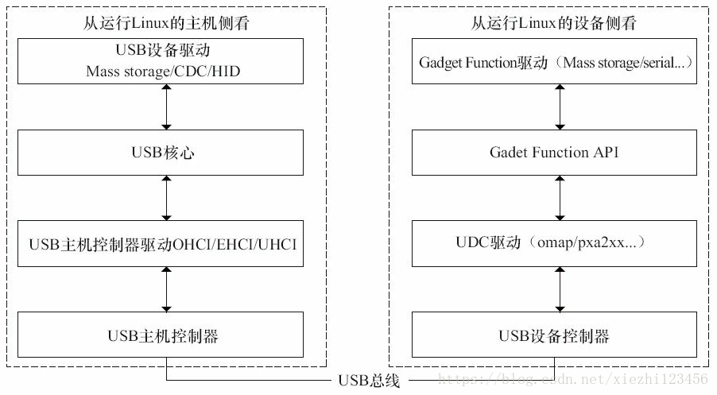
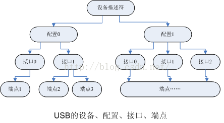

##

###  修订记录
| 修订说明 | 日期 | 作者 | 额外说明 |
| --- |
| 初版 | 2018/06/28 | 员清观 |  |

## 参考文档
**USB协议基本知识**<br>
  https://blog.csdn.net/u010142953/article/details/82627591
**USB通信协议深入理解**<br>
  https://blog.csdn.net/g200407331/article/details/51682597
**USB协议基本知识**<br>

**USB协议基本知识**<br>

**USB协议基本知识**<br>

## 1 基础知识
为了与主机端驱动设备的USB Device Driver概念进行区别，将在外围器件中运行的驱动程序称为USB Gadget Driver。其中，Host端驱动设备的驱动程序是master或者client driver，设备端gadget driver是slave或者function driver

USB主机控制器规格：OHCI（Open Host Controller Interface）、UHCI（Universal Host Controller Interface）、EHCI（Enhanced Host Controller Interface）和EHCI（Extensible Host Controller); 而从设备侧的角度来看，包含编写USB设备控制器(UDC)驱动和Gadget Function驱动两类，分析UDC和Gadget驱动

Compound device就是几个设备通过一个USB Hub形成的单一设备；Composite devcie是具有多个接口的设备，每个接口代表一个独立的设备。显然，如果是想实现同样功能的话，Composite设备的方法要简单很多。

一个具体的端点只能工作在一种传输模式下

USB从设备的分类可以从USB设备接口描述符（Standard Interface   Descriptor）对应的的bInterfaceClass这一个byte得到。bInterfaceClass的典型代码为1，2，3，6，7，8，9，10，11，255。分别代表的意思为:
1－audio：表示一个音频设备。
2－communication  device：通讯设备，如电话，moden等等。
3－HID：人机交互设备，如键盘，鼠标等。
6－image图象设备，如扫描仪，摄像头等，有时数码相机也可归到这一类。
7－打印机类。如单向，双向打印机等。
8－mass storage海量存储类。所有带有一定存储功能的都可以归到这一类。
9－hub类。
11－chip card/smart card。
255－vendor specific.厂家的自定义类，主要用于一些特殊的设备。如接口转接卡等。

### 1.1 架构
在Linux系统中，提供主机侧和设备侧视角的USB驱动框架，从主机侧看到的USB主机控制器和设备驱动，以及从设备侧看到的设备控制器和Gadget驱动。1、Linux系统中USB驱动的整体视图，Linux中从主机侧和设备侧看到的USB驱动层次。2、从主机侧的角度来看，需要编写的USB驱动程序包括主机控制器驱动和设备驱动两类，USB主机控制器驱动程序控制插入其中的USB设备，USB设备驱动程序控制该设备如何作为从设备与主机通信。1）分析USB主机控制器驱动的结构并给出Chipidea USB主机驱动实例。2）分析USB设备驱动的结构及其设备请求块处理过程，并给出USB键盘驱动实例。3、从设备侧的角度来看，包含编写USB设备控制器（UDC）驱动和Gadget Function驱动两类，分析UDC和Gadget驱动，并给出Chipidea USB UDC和Loopback Function实例

USB采用树形拓扑结构，主机侧和设备侧的USB控制器分别称为主机控制器（Host Controller）和USB设备控制器（UDC），每条总线上只有一个主机控制器，负责协调主机和设备之间的通信，设备不能主动向主机发送任何消息。



### 1.2 usbmon 诊断
在USB的设计、调试中监听数据传输十分重要。监听USB数据可以使用USB总线分析仪，但这样的设备比较昂贵，于是windows我们可以用Bus Hound这个软件来监听总线数据。不过它只能看到传输成功的数据包，对于令牌包和应答包时看不到，但是足以满足大部分的应用场合了。这个强大的软件可以捕捉如鼠标、键盘、硬盘、串口等众多设备的数据。ubuntu下已经内置了usb抓包工具——usbmon，位置：`/lib/modules/4.4.0-97-generic/kernel/drivers/usb/mon/usbmon.ko`

使用 usbmon 抓取 usb 总线上的数据::    https://www.cnblogs.com/shiwenjie/p/8467057.html
详解 usbmon 抓取的 log 各字段的含义::  https://www.cnblogs.com/shiwenjie/p/9817220.html

**使用方法**<br>
sudo mount -t debugfs none /sys/kernel/debug   一般linux已经默认挂上了
sudo modprobe usbmon
查看当前的usb device:   lsusb; sudo cat /sys/kernel/debug/usb/devices
列出                   sudo ls /sys/kernel/debug/usb/usbmon
监听全部bus上的USB数据包: sudo cat /sys/kernel/debug/usb/usbmon/0u
**监听打印的基本格式**<br>
基本格式:  URB_tag -- TimeStamp -- Event_Type -- URBType -- BusNo -- DeviceAddr -- EndPointNum
- Event_Type：事件类型　 S - submission,  C - callback,  E - submission error
- URBType
  Ci Co   Control input and output
  Zi Zo   Isochronous input and output
  Ii Io   Interrupt input and output
  Bi Bo   Bulk input and output
- URB Status： 0为没有错误。-XXX是错误码。这个要么是字母或者是一些由分号隔开的数字
- Setup packet, 如果出现的话，包括5个字串: 他们是 bmRequestType,bRequest, wValue, wIndex, wLength
- 同步号
- Data Length. 数据长度
- Data tag. 即使数据长度不为0，usbmon也不一定总能捕捉到数据，数据包内容只有在此tag为'='才有效
- Data words 大头十六进制数.

## 2 usb-ffs
linux配置文件，正常启动后应该可以找到`/dev/usb-ffs/fastboot`和`/sys/class/infotm_usb`两个路径:
  `> Device Drivers > USB support > USB Gadget Support`
  `> Device Drivers > InfoTM special files and drivers > Infotm common drivers support > Infotm OTG driver support`

复合设备是基于gadfet设备实现的，其`probe`函数将会从当前的`udc_list`中匹配适合的设备。这需要udc设备更早初始化。复合函数的`infotm_setup()`函数中，将会调用gadget的setup函数。

`/sys/devices/virtual/infotm_usb/infotm0/f_ffs`路径

### 2.0 usb设备架构
为了更好地描述USB设备的特征，USB提出了设备架构的概念。从这个角度来看，可以认为USB设备是由一些配置、接口和端点组成，即一个USB设备可以含有一个或多个配置，在每个配置中可含有一个或多个接口，在每个接口中可含有若干个端点。其中，配置和接口是对USB设备功能的抽象，实际的数据传输由端点来完成。在使用USB设备前，必须指明其采用的配置和接口。这个步骤一般是在设备接入主机时设备进行枚举时完成的

设备通常有一个或多个配置；配置通常有一个或多个接口；接口通常有一个或多个设置；接口有零或多个端点。可以这样看：有一个设备，如支持视频和音频的一个播放器。那么，对于上面提到的4个描述符，对它们设置的时候，它们分别对于哪一个描述符呢？从我现在的理解来看，这样一个设备对应一个设备描述符，支持视频的功能对应一个接口描述符，支持音频功能的对应一个接口描述符。为了支持视频，在下层有多个端口同时工作为提供视频数据传输的支持，所以有多个端点描述符。

**设备描述符**<br>
设备代表一个USB设备，它由一个或多个配置组成。设备描述符用于说明设备的总体信息，并指明其所含的配置的个数。一个USB设备只能有一个设备描述符。
**配置描述符**<br>
一个USB设备可以包含一个或多个配置，如USB设备的低功耗模式和高功耗模式可分别对应一个配置。在使用USB设备前，必须为其选择一个合适的配置。配置描述符用于说明USB设备中各个配置的特性，如配置所含接口的个数等。USB设备的每一个配置都必须有一个配置描述符。
**接口描述符**<br>
一个配置可以包含一个或多个接口，例如对一个光驱来说，当用于文件传输时，使用其大容量存储接口；而当用于播放CD时，使用其音频接口。接口是端点的集合，可以包含一个或多个可替换设置，用户能够在USB处于配置状态时改变当前接口所含的个数和特性。接口描述符用于说明设备中各个接口的特性，如接口所属的设备类及其子类等。USB设备的每个接口都必须有一个接口描述符
**端点描述符**<br>
端点是USB设备中的实际物理单元，USB数据传输就是在主机和USB设备各个端点之间进行的。端点一般由USB接口芯片提供，例如Freescale公司的MC68HC908JB8和MC9S12UF32。USB设备中的每一个端点都有唯一的端点号，每个端点所支持的数据传输方向一般而言也是确定的：或是输入（IN），或是输出（OUT）。也有些芯片提供的端点的数据方向是可以配置的，例如MC68HC908JB8包含有两个用于数据收发的端点：端点1和端点2。其中端点1只能用于数据发送，即支持输入（IN）操作；端点2既能用于数据发送，也可用于数据接收，即支持输入（IN）和输出（OUT）操作。而MC9S12UF32具有6个端点。
利用设备地址、端点号和传输方向就可以指定一个端点，并与它进行通信。端点的传输特性还决定了其与主机通信是所采用的传输类型，例如控制端点只能使用控制传输。根据端点的不同用途，可将端点分为两类：0号端点和非0号端点。
0号端点比较特殊，它有数据输入IN和数据输出OUT两个物理单元，且只能支持控制传输。所有的USB设备都必须含有一个0号端点，用作默认控制管道。USB系统软件就是使用该管道与USB逻辑设备进行配置通信的。0号端点在USB设备上的以后就可以使用，而非0号端点必须要在配置以后才可以使用。
根据具体应用的需要，USB设备还可以含有多个除0号端点以外的其他端点。对于低速设备，其附加的端点数最多为2个；对于全速/高速设备，其附加的端点数最多为15个
**字符串描述符**<br>
在USB设备中通常还含有字符串描述符，以说明一些专用信息，如制造商的名称、设备的序列号等。它的内容以UNICODE的形式给出，且可以被客户软件所读取。对USB设备来说，字符串描述符是可选的
**管道**<br>
在USB系统结构中，可以认为数据传输时在USB主机软件与USB设备的各个端点之间直接进行的，它们之间的连接称为管道。管道是在USB设备的配置过程中建立的。管道是对USB主机与USB设备间通信流的抽象，表示USB主机的数据缓冲区与USB设备的端点之间存在着逻辑数据传输，而实际的数据传输是由USB总线接口层来完成的。
管道与USB设备中的端点一一对应。一个USB设备含有多少个端点，其与USB主机进行通信时就可以使用多少条管道，且端点的类型决定了管道中数据的传输类型，例如中断端点对应中断管道，且该管道只能进行中断传输。不论存在着多少条管道，在各个管道中进行的数据传输都是相互独立的
**USB端点分类**<br>
USB 通讯的最基本形式是通过端点。一个USB端点只能向一个方向传输数据（从主机到设备(称为输出端点)或者从设备到主机(称为输入端点)）。端点可被看作一个单向的管道。
USB 端点有 4 种不同类型, 分别具有不同的数据传送方式：
1) 控制CONTROL
控制端点被用来控制对USB设备的不同部分访问. 通常用作配置设备、获取设备信息、发送命令到设备或获取设备状态报告。这些端点通常较小。每个 USB 设备都有一个控制端点称为"端点 0", 被 USB 核心用来在插入时配置设备。USB协议保证总有足够的带宽留给控制端点传送数据到设备.
2) 中断INTERRUPT
每当 USB 主机向设备请求数据时，中断端点以固定的速率传送小量的数据。此为USB 键盘和鼠标的主要的数据传送方法。它还用以传送数据到USB设备来控制设备。通常不用来传送大量数据。USB协议保证总有足够的带宽留给中断端点传送数据到设备.
3) 批量BULK
批量端点用以传送大量数据。这些端点通常比中断端点大得多. 它们普遍用于不能有任何数据丢失的情况。USB 协议不保证传输在特定时间范围内完成。如果总线上没有足够的空间来发送整个BULK包，它被分为多个包进行传输。这些端点普遍用于打印机、USB Mass Storage和USB网络设备上。
4) 等时ISOCHRONOUS
等时端点也批量传送大量数据, 但是这个数据不被保证能送达。这些端点用在可以处理数据丢失的设备中，并且更多依赖于保持持续的数据流。如音频和视频设备等等。

控制和批量端点用于异步数据传送，而中断和等时端点是周期性的。这意味着这些端点被设置来在固定的时间连续传送数据，USB 核心为它们保留了相应的带宽。

**usb数据发送流程**<br>
a) 令牌阶段：主机发送请求，USB设备依据请求PID来判断IN或OUT传输
b) 数据传输阶段：依据令牌阶段的IN或OUT传输，来决定数据传输为DATA0或DATA1来进行数据传输
c) 握手阶段：接收信息的一方发送ACK信号以表示接收成功；若为NAK，表示发送失败；STALL表示不可预知的错误

```cpp
struct usb_device_descriptor{
  _u8 bLength, bDescriptorType;  //此描述符的字节数 描述符的设备种类
  _u16 bcdUSB;  //此设备与描述符兼容的usb设备说明版本号(BCD码)
  _u8   bDeviceClass, bDeviceSubClass, bDeviceProtocol, bMaxPacketSize0; //设备类码子类码协议码,端点0的最大包大小
  _u16 idVendor, idProduct, bcdDevice; //厂商标志 产品标志 设备发行号
  _u8 iManufacturer,iProduct,iSerialNumber,bNumConfigurations; //厂商字串索引 产品信息字串索引 设备序列号信息字串索引 配置数
}_attribute_ ((packed));

struct usb_config_descriptor {
  _u8 bLength, bDescriptorType;//此描述符的字节数 配置描述符类型
  _u16 wTotalLength; //此配置信息的总长(包括配置，接口，端点和设备类型及厂商定义的描述符)
  _u8 bNumInterfaces; //此配置所支持的接口数
  _u8 bConfigurationValue ;//在setConfiguration()请求中用作参数来选定此配置
  _u8 iConfiguration; //描述此配置的字串描述符索引
  _u8 bmAttributes; //电源配置特性
  _u8 bMaxpowe;r //此配置下的总线电源耗电量
}_attribute_ ((packed));

struct usb_interface_descriptor {
  _u8 bLength, bDescriptorType;//此描述符的字节数 接口描述符类
  _u8 bInterfacNumber;//接口号，当前配置所支持的接口数组索引,从0开始
  _u8 bNumEndpoints ;//此接口用的端点数量，如果是0,说明此接口只有缺省控制通道
  _u8 bAlernateSetting;//可选设备的索引值
  _u8 bInterfaceClass, bInterfaceSubClass;//类值,0值作为将来保留使用如果是0xFFH,此接口由厂商说明;  子类码
  _u8 bInterfaceProtocol;//协议码
  _u8 iInterface;//描述此接口的字串描述符索引
}_attribute_ ((packed));

struct usb_endpoint_descriptor {
  _u8 bLength, bDescriptorType;//此描述符的字节数 端点描述符类
  _u8 bEndpointAddress;//端点地址：0～3位是端点号，第7位(0x80)是方向(0-OUT,1-IN)
  _u8 bmAtrributes;//端点属性：bit[0:1]的值为00表示控制，为01表示同步，为02表示批量，为03表示中断
  _u8 wMaxPacketSize;//当前配置下端点能够发送与接收的最大数据包大小
  _u8 bInterval;//轮询数据传送端点的时间间隔;对于批量传送的端点以及控制传送的端点，此域忽略;对于同步传送的端点，此域必须为1
  _u8 bRefresh, bSynchAddress;//轮询数据传送端点的时间间隙
}_attribute_ ((packed));

struct usb_string_descriptor
{
	_u8 bLength, bDescriptorType; //描述符长度 类型
	_le16 wData[1]; /* UTF-16LE encoded */
} _attribute_ ((packed));
struct usb_function {
	const char			*name; struct usb_gadget_strings	**strings;
	struct usb_descriptor_header	**fs_descriptors, **hs_descriptors, **ss_descriptors;
	struct usb_configuration	*config;
	int	(*bind)(*unbind)(struct usb_configuration *, struct usb_function *);
	void (*free_func)(*disable)(*suspend)(*resume)(struct usb_function *f);
	struct module		*mod;
	int			(*set_alt)(struct usb_function *,	unsigned interface, unsigned alt);
	int			(*get_alt)(struct usb_function *,	unsigned interface);
	int			(*setup)(struct usb_function *, const struct usb_ctrlrequest *);
	int			(*get_status)(struct usb_function *); /* USB 3.0 additions */
	int			(*func_suspend)(struct usb_function *, u8 suspend_opt);
	struct list_head		list; DECLARE_BITMAP(endpoints, 32); const struct usb_function_instance *fi; };

struct usb_configuration {
	const char *label; struct usb_gadget_strings	**strings; const struct usb_descriptor_header **descriptors;
	void			(*unbind)(struct usb_configuration *);
	int			(*setup)(struct usb_configuration *, const struct usb_ctrlrequest *);
	u8 bConfigurationValue, iConfiguration, bmAttributes; u16	MaxPower;
	struct usb_composite_dev	*cdev;
	struct list_head	list; //一个usb_composite_dev可以包含多个config，通过这个节点加入其 .configs 链表
  struct list_head	functions; //一个config包含多个可选的function
  u8 next_interface_id;
	unsigned superspeed:1, highspeed:1, fullspeed:1;
	struct usb_function	*interface[MAX_CONFIG_INTERFACES]; };

static const struct {
    struct usb_ffs_descs_head header;
    struct { struct usb_interface_descriptor intf; struct usb_endpoint_descriptor_no_audio source, sink;
    } __attribute__((packed)) fs_descs, hs_descs;
} __attribute__((packed)) descriptors = {
    .header = {
        .magic = cpu_to_le32(FUNCTIONFS_DESCRIPTORS_MAGIC), .length = cpu_to_le32(sizeof(descriptors)),
        .fs_count = 3, .hs_count = 3,},
    .fs_descs = {
        .intf = {
            .bLength = sizeof(descriptors.fs_descs.intf), .bDescriptorType = USB_DT_INTERFACE,
            .bInterfaceNumber = 0, .bNumEndpoints = 2,
            .bInterfaceClass = FASTBOOT_CLASS, .bInterfaceSubClass = FASTBOOT_SUBCLASS,
            .bInterfaceProtocol = FASTBOOT_PROTOCOL, .iInterface = 1,},
        .source = {
            .bLength = sizeof(descriptors.fs_descs.source), .bDescriptorType = USB_DT_ENDPOINT,
            .bEndpointAddress = 1 | USB_DIR_OUT, .bmAttributes = USB_ENDPOINT_XFER_BULK,
            .wMaxPacketSize = MAX_PACKET_SIZE_FS, },
        .sink = {
            .bLength = sizeof(descriptors.fs_descs.sink), .bDescriptorType = USB_DT_ENDPOINT,
            .bEndpointAddress = 2 | USB_DIR_IN, .bmAttributes = USB_ENDPOINT_XFER_BULK,
            .wMaxPacketSize = MAX_PACKET_SIZE_FS, }, },
    .hs_descs = {
        .intf = {
            .bLength = sizeof(descriptors.hs_descs.intf), .bDescriptorType = USB_DT_INTERFACE,
            .bInterfaceNumber = 0, .bNumEndpoints = 2,
            .bInterfaceClass = FASTBOOT_CLASS, .bInterfaceSubClass = FASTBOOT_SUBCLASS,
            .bInterfaceProtocol = FASTBOOT_PROTOCOL, .iInterface = 1, },
        .source = {
            .bLength = sizeof(descriptors.hs_descs.source), .bDescriptorType = USB_DT_ENDPOINT,
            .bEndpointAddress = 1 | USB_DIR_OUT, .bmAttributes = USB_ENDPOINT_XFER_BULK,
            .wMaxPacketSize = MAX_PACKET_SIZE_HS, },
        .sink = {
            .bLength = sizeof(descriptors.hs_descs.sink),　.bDescriptorType = USB_DT_ENDPOINT,
            .bEndpointAddress = 2 | USB_DIR_IN, .bmAttributes = USB_ENDPOINT_XFER_BULK,
            .wMaxPacketSize = MAX_PACKET_SIZE_HS, }, }, };
```

### 2.1 注册流程之infotm.c

`supported_functions`显示了支持的基本功能： `&uvc_function, &rndis_function, &mass_storage_function,	&hid_function, &ffs_function`

从实现看，`struct usb_composite_driver`和`struct usb_gadget_driver`的回调除了`.suspend ` `.resume`这两个外，都是关联调用的。而前者也额外提供`.dev` `.strings`等重要的配置参数作为输入。

`struct infotm_dev`

```cpp
 #define VENDOR_ID		0x18D1
 #define PRODUCT_ID		0x0001
struct infotm_usb_function {
	char *name; void *config; struct device *dev; char *dev_name; struct device_attribute **attributes;
	struct list_head enabled_list;
	bool enum_no_ready; /* application trigger usb connect (enumeration) flag */
	int (*init)(struct infotm_usb_function *, struct usb_composite_dev *);
	void (*cleanup)(*enable)(*disable)(struct infotm_usb_function *);
	int (*bind_config)(*unbind_config)(struct infotm_usb_function *, struct usb_configuration *);
	int (*ctrlrequest)(struct infotm_usb_function *, struct usb_composite_dev *, const struct usb_ctrlrequest *); };

struct usb_gadget_driver {//该驱动是usbcore和composite之间交互必不可少的一环，两者之间的联系主要靠他来维持
	enum usb_device_speed	max_speed;   char *function; //驱动名称
  int (*bind)(struct usb_gadget *gadget, struct usb_gadget_driver *driver); void (*unbind)(struct usb_gadget *);
  int (*setup)(struct usb_gadget *, const struct usb_ctrlrequest *); //处理ep0的控制请求，在中断中调用，不能睡眠
	void (*disconnect)(*suspend)(*resume)(struct usb_gadget *); struct device_driver	driver; };

struct usb_composite_driver {
	const char				*name; const struct usb_device_descriptor	*dev;
	struct usb_gadget_strings		**strings; enum usb_device_speed			max_speed; unsigned		needs_serial:1;
	int	(*bind)(struct usb_composite_dev *cdev); int (*unbind)(struct usb_composite_dev *);
	void (*disconnect)(struct usb_composite_dev *);void (*suspend)(struct usb_composite_dev *);
	void			(*resume)(struct usb_composite_dev *);
	struct usb_gadget_driver		gadget_driver;};

struct usb_composite_dev { //作为composite复合设备，所有composite设备都必须实现该设备。
	struct usb_gadget *gadget; //设备和gadget交互，gadget和udc交互。
  struct usb_request *req; //每个设备自带一个usb请求，所有的数据交互都是通过该请求发送的。
  struct usb_configuration	*config; //一个设备有一个或者多个配置。
	unsigned int suspended:1; struct usb_device_descriptor	desc;	//设备描述符，唯一
  struct list_head configs, gstrings; //配置 //字符描述
	struct usb_composite_driver	*driver; //设备绑定的驱动
  u8 next_string_id; char *def_manufacturer; spinlock_t			lock;
	unsigned deactivations;/* the gadget driver won't enable the data pullup while it is nonzero. */
	int delayed_status;/* composite driver won't complete control transfer's data/status stages till it is zero. */ };

struct infotm_dev {
	struct infotm_usb_function **functions; //所有可选功能；
  struct list_head enabled_functions;//一般只有一个当前多选一的功能，无法理解多个功能同时选中是什么样子
  struct usb_composite_dev *cdev;
	struct device *dev;//指向"infotm0"虚拟设备，提供参数管理和控制的功能
  bool enabled; int disable_depth; struct mutex mutex; bool connected; bool sw_connected;
	struct work_struct work; char ffs_aliases[256]; };

// usb-core.c
struct usb_udc {struct usb_gadget_driver *driver; struct usb_gadget *gadget; struct device dev; struct list_head list;};
static LIST_HEAD(udc_list);

static struct class *infotm_class;
static struct infotm_dev *_infotm_dev;

//所有的composite设备都会在注册gadet驱动的时候采用该实例填充，可能是因为gadget驱动永远只有一个，composite可以随便实现
const struct usb_gadget_driver composite_driver_template = {//
	.bind = composite_bind,	.unbind = composite_unbind,	.setup = composite_setup, .disconnect	= composite_disconnect,
	.suspend = composite_suspend, .resume = composite_resume,	.driver	= { .owner = THIS_MODULE, }, };

static struct infotm_usb_function *supported_functions[] = {
	&uvc_function, &rndis_function, &mass_storage_function,	&hid_function, &ffs_function, NULL};

static struct usb_device_descriptor device_desc = { .bLength = sizeof(device_desc),	.bDescriptorType = USB_DT_DEVICE,
  .bcdUSB  = __constant_cpu_to_le16(0x0200),.bDeviceClass  = USB_CLASS_PER_INTERFACE,
  .idVendor = __constant_cpu_to_le16(VENDOR_ID),.idProduct = __constant_cpu_to_le16(PRODUCT_ID),
  .bcdDevice = __constant_cpu_to_le16(0xffff), .bNumConfigurations = 1, };
static struct usb_composite_driver infotm_usb_driver = {
	.name = "infotm_usb",	//该复合设备的名称　.dev = &device_desc, //设备描述符
  .strings = dev_strings, .bind	= infotm_bind, .unbind	= infotm_usb_unbind,
	.disconnect	= infotm_disconnect, .max_speed = USB_SPEED_HIGH, };

//它的主要功能是，在原有的composite_setup()基础上，通过schedule_work增加event的处理。前面的ctrlrequest()实际都是空函数
int infotm_setup(struct usb_gadget *gadget, const struct usb_ctrlrequest *c)
  struct infotm_dev	*dev = _infotm_dev; struct usb_composite_dev *cdev = get_gadget_data(gadget);
	struct usb_request *req = cdev->req;
  req->zero = 0; req->length = 0; gadget->ep0->driver_data = cdev;
  value = composite_setup_func(gadget, c); //-->composite_setup(),probe()之前已经替换掉
  dev->connected = 1; schedule_work(&dev->work);
//先bind，然后上层流程使能了ffs后，
int composite_setup(struct usb_gadget *gadget, const struct usb_ctrlrequest *ctrl)
  struct usb_composite_dev *cdev = get_gadget_data(gadget); struct usb_request *req = cdev->req;
  switch (ctrl->bRequest)
    case USB_REQ_GET_DESCRIPTOR: //获取上层设置的参数
      switch (w_value >> 8)
        case USB_DT_DEVICE:
          cdev->desc.bNumConfigurations =　count_configs(cdev, USB_DT_DEVICE);//多少个config
          cdev->desc.bMaxPacketSize0 = cdev->gadget->ep0->maxpacket;
          memcpy(req->buf, &cdev->desc, value); //拷贝usb_device_descriptor信息到usb_request
        case USB_DT_DEVICE_QUALIFIER:  device_qual(cdev);
        case USB_DT_CONFIG: value = config_desc(cdev, w_value); //config的每个功能的信息拷贝到usb_request缓存中
        case USB_DT_STRING: value = get_string(cdev, req->buf, w_index, w_value & 0xff);
        case USB_DT_BOS: value = bos_desc(cdev);
        |--> case USB_REQ_SET_CONFIGURATION: value = set_config(cdev, ctrl, w_value);
          |--> reset_config(cdev); //diable这个config上链接的所有function
            list_for_each_entry(f, &cdev->config->functions, list)
              if (f->disable) f->disable(f); //-->ffs_func_disable()
              bitmap_zero(f->endpoints, 32);
            cdev->config = NULL;
          cdev->config = c; //如果新的config有效而且之前有激活的config
          for (tmp = 0; tmp < MAX_CONFIG_INTERFACES; tmp++)
            struct usb_function	*f = c->interface[tmp];   f->set_alt(f, tmp, 0);
          otg_monitor_set_enumerated();     usb_gadget_vbus_draw(gadget, power);
    case USB_REQ_GET_CONFIGURATION: *(u8 *)req->buf = cdev->config->bConfigurationValue;
    case USB_REQ_SET_INTERFACE: f = cdev->config->interface[intf];f->set_alt(f, w_index, w_value);//-->ffs_func_set_alt() 见下文解析
    case USB_REQ_GET_INTERFACE: f = cdev->config->interface[intf];f->get_alt(f, w_index)
    default: //composite()层不处理的命令转到上层
      if ((ctrl->bRequestType & USB_RECIP_MASK) == USB_RECIP_INTERFACE)
        value = f->setup(f, ctrl);//-->ffs_func_setup()
  gadget->ep0->driver_data = cdev; req->length = value; req->zero = value < w_length;
  return usb_ep_queue(gadget->ep0, req, GFP_ATOMIC);//--> ep->ops->queue()

//绑定(其实等同于probe的机制)的时候创建 struct usb_composite_dev
int composite_bind(struct usb_gadget *gadget,	struct usb_gadget_driver *gdriver)
  udc->driver = driver;　udc->dev.driver = &driver->driver;　udc->gadget->dev.driver = &driver->driver;
  struct usb_composite_dev *cdev = kzalloc(sizeof *cdev, GFP_KERNEL);
  struct usb_composite_driver	*composite = to_cdriver(gdriver);
  cdev->gadget = gadget; set_gadget_data(gadget, cdev);
  INIT_LIST_HEAD(&cdev->configs); INIT_LIST_HEAD(&cdev->gstrings);
  |--> composite_dev_prepare(composite, cdev); //部分初始化cdev
      struct usb_gadget *gadget = cdev->gadget;
      cdev->req = usb_ep_alloc_request(gadget->ep0, GFP_KERNEL);
      cdev->req->buf = kmalloc(USB_COMP_EP0_BUFSIZ, GFP_KERNEL);
      device_create_file(&gadget->dev, &dev_attr_suspended); //注册属性
      cdev->req->complete = composite_setup_complete;	gadget->ep0->driver_data = cdev;//通过端点即可获取设备
      cdev->driver = composite; //将composite设备和驱动绑定-usb gadget端是没有probe过程的，驱动直接注册并创建设备
      usb_gadget_set_selfpowered(gadget); usb_ep_autoconfig_reset(gadget);
  |--> composite->bind(cdev); //--> infotm_bind();
      usb_gadget_disconnect(gadget); //-->gadget->ops->pullup(gadget, 0);
      |--> infotm_init_functions(dev->functions, cdev);//初始化所有的５中funcitons
        for (; (f = *functions++); index++)
          f->dev = device_create(infotm_class, dev->dev, MKDEV(0, index), f, f->dev_name);
          |--> f->init(f, cdev); //为 ffs申请config缓存(待之后bind_config); 比如-->ffs_function_init()
            f->config = kzalloc(sizeof(struct functionfs_config), GFP_KERNEL);
            f->enum_no_ready = false; return functionfs_init();//注册文件系统
          f->attributes; while ((attr = *attrs++) && !err) device_create_file(f->dev, attr);
      usb_gadget_set_selfpowered(gadget); dev->cdev = cdev;
  update_unchanged_dev_desc(&cdev->desc, composite->dev);//填充cdev->desc

void composite_unbind(struct usb_gadget *gadget)//__composite_unbind(gadget, true);
  struct usb_composite_dev	*cdev = get_gadget_data(gadget);
  while (!list_empty(&cdev->configs))
		struct usb_configuration *c = list_first_entry(&cdev->configs,	struct usb_configuration, list);
		list_del(&c->list); //从cdev的configs链表中删除这个config
    |--> unbind_config(cdev, c);//unbind()并删除config的functions节点;然后unbine此config
      infotm_unbind_config()
  |--> cdev->driver->unbind(cdev); //infotm_usb_unbind()
    cancel_work_sync(&_infotm_dev->work);
    |--> infotm_cleanup_functions(dev->functions);
    	while (f = *functions++) // struct infotm_usb_function *;
    		if (f->dev) device_destroy(infotm_class, f->dev->devt);	kfree(f->dev_name);
    		f->cleanup(f); //-->ffs_function_cleanup()-->functionfs_cleanup();kfree(f->config);注销ffs文件系统
	composite_dev_cleanup(cdev); //释放所有string,usb request/buf,释放属性文件
  kfree(cdev->def_manufacturer); 	kfree(cdev); set_gadget_data(gadget, NULL);

void composite_disconnect(struct usb_gadget *gadget)
  reset_config(cdev); //struct usb_composite_dev	*cdev = get_gadget_data(gadget);
  cdev->driver->disconnect(cdev); //infotm_disconnect()-->_infotm_dev->connected = 0;schedule_work(&_infotm_dev->work); 通知上层event

int __init init(void)
  infotm_class = class_create(THIS_MODULE, "infotm_usb"); //在sys/class路径下创建新的`infotm_usb`
  struct infotm_dev *dev = kzalloc(sizeof(*dev), GFP_KERNEL); _infotm_dev = dev;
  dev->disable_depth = 1; dev->functions = supported_functions;
  INIT_WORK(&dev->work, infotm_work); //在setup和disconnect时schedule_work，会发送`KOBJ_CHANGE`事件
  |--> infotm_create_device(dev); //class `infotm_usb` 下创建 `infotm0`,应该是为了给上层提供该usb通用的属性管理
    dev->dev = device_create(infotm_class,NULL,MKDEV(0,0),NULL,"infotm0"); dev_set_drvdata(dev->dev,dev);
    while ((attr = *attrs++)) device_create_file(dev->dev, attr);//创建设备属性
  //放弃了devices.c中定义device的方式，直接实现复合设备与驱动的绑定;
  |--> usb_composite_probe(&infotm_usb_driver);//gadget udc绑定复合usb设备驱动，支持ffs/uvc/mass_storage/rndis/hid
    driver->gadget_driver = composite_driver_template; //所有的composite共享一个gadget模板, 此过程并未涉及到对compoite设备的注册的操作，而是将composite驱动中注册的相关信息填充到gadget中，利用gadget去和udc打交道。当前版本中，只创建了一个"infotm_usb"复合设备做gadget
    |--> return usb_gadget_probe_driver(composite_driver_template);//--> 找到第一个udc后udc_bind_to_driver();
      driver->bind(udc->gadget, driver);//--> composite_bind()
      usb_gadget_udc_start(udc->gadget, driver);//-->gadget->ops->udc_start(gadget, driver); --> gadget_wrapper->driver = driver;//gadget_wrapper只有一个全局，所以udc-gadget-driver是一一对应的
  composite_setup_func = infotm_usb_driver.gadget_driver.setup; infotm_usb_driver.gadget_driver.setup = infotm_setup;//由于struct usb_composite_driver没有提供setup()的回调，这边交换setup函数，实现infotm层回调功能　//infotm_setup()函数中，增加处理f->ctrlrequest() 和 infotm_work()
  ffs_force_init_flow();

```

### 2.3 USB枚举详细过程

详细的介绍：　https://blog.csdn.net/MyArrow/article/details/8270029
图解USB协议之一枚举过程: https://blog.csdn.net/myarrow/article/details/8270060

从设备的角度，host检测到设备上电之后，确认高低速，然后复位设备；复位完成之后，设备已经初始化了控制器并使能了中断，可以开始处理枚举流程了。 --  感觉应该是`infotm_enable`调用`dw_pullup`，才会使设备可检测吧？

1．主机集线器检测到新设备
主机集线器监视着每个端口的信号电压，当有新设备接入时便可觉察。（集线器端口的两根信号线的每一根都有15kΩ的下拉电阻，而每一个设备在D+都有一个1.5kΩ的上拉电阻。当用USB线将PC和设备接通后，设备的上拉电阻使信号线的电位升高，因此被主机集线器检测到）
2．主机发送`Get_Status`请求
每个集线器用中断传输来报告在集线器上的事件。当主机知道了这个事件，它给集线器发送一个`Get_Status`请求来了解更多的消息。返回的消息告诉主机一个设备是什么时候连接的。
3．主机发送`Set_Feature`请求，集线器重启端口，设备的USB数据线处于重启（RESET）状态至少10ms
4．集线器在设备和主机之间建立一个信号通路
主机发送一个`Get_Status`请求来验证设备是否激起重启状态。返回的数据有一位表示设备仍然处于重启状态。当集线器释放了重启状态，设备就处于默认状态了，设备已经准备好通过`Endpoint 0`的默认流程响应控制传输，即设备现在使用`默认地址0x0`与主机通信。
5．集线器通过测定哪根信号线（D+或D-）在空闲时有更高的电压来检测设备是低速设备还是全速设备。全速和高速设备D+有上拉电阻，低速设备D-有上拉电阻
**以下需要USB的firmware进行干预**<br>
6．PC向address 0发送`Get_Device_Descriptor`命令，以取得缺省控制管道所支持的最大数据包长度，并在有限的时间内等待USB设备的响应
该长度包含在设备描述符的`bMaxPacketSize0`字段中，其地址偏移量为7，所以这时主机只需读取该描述符的前8个字节。注意，主机一次只能枚举一个USB设备，所以同一时刻只能有一个USB设备使用缺省地址0。
7．主机发送`Set_Address`请求分配一个新的地址给设备。设备读取这个请求，返回确认并保存新的地址。从此开始所有通信都使用这个新地址
8．主机向新地址重新发送`Get_Device_Descriptor`命令，此次读取其设备描述符的全部字段，以了解该设备的总体信息，如VID，PID
9．主机向设备循环发送`Get_Device_Configuration`命令，要求USB设备回答，以获取完整配置信息
10．主机发送`Get_Device_String`命令，获得描述字符集（unicode）,描述字符集包括了产商、产品描述、型号等信息
11．主机展示新设备信息, 此时主机将会弹出窗口，展示发现新设备的信息，产商、产品描述、型号等
12．PC根据`Device_Descriptor`和`Device_Configuration`应答判断能否提供该类USB的驱动
13．加载了USB设备驱动后，主机发送`Set_Configuration(x)`命令，请求为设备选择一个配置。成功则USB设备进入“配置”状态，可以和客户进行数据传输
14．主机为复合设备接口分配驱动程序

此时，常规的USB完成了其必须进行的配置和连接工作。查看注册表，能够发现相应的项目已经添加完毕，至此设备应当可以开始使用。不过，USB协议还提供了一些用户可选的协议，设备如果不应答，也不会出错，但是会影响到系统的功能。

如果集线器检测到有过流现象，或者主机要求集线器关闭电源，则USB总线切断设备供电电源。在这种情况下，设备与主机无法通信，但设备处于连接状态。
如果在3毫秒内设备在总线上未见任何动作，则它将进入挂起状态，在挂起状态设备消耗的总线电能最少。

### 2.4 枚举步骤详细版
USB协议定义了设备的6种状态，仅在枚举过程中，设备就经历了4个状态的迁移：上电状态(Powered)，默认状态(Default)，地址状态(Address)和配置状态(Configured)（其他两种是连接状态和挂起状态（Suspend））。
2.1 用户把USB设备插入USB端口或给系统启动时设备上电
  这里指的USB端口指的是主机下的根hub或主机下行端口上的hub端口。Hub给端口供电，连接着的设备处于上电状态。此时，USB设备处于加电状态，它所连接的端口是无效的。
2.2 Hub监测它各个端口数据线上(D+/D-)的电压
  在hub端，数据线D+和D-都有一个阻值在14.25k到24.8k的下拉电阻Rpd，而在设备端，D+（全速，高速）和D-（低速）上有一个1.5k的上拉电阻Rpu。当设备插入到hub端口时，有上拉电阻的一根数据线被拉高到幅值的90%的电压（大致是3V）。hub检测到它的一根数据线是高电平，就认为是有设备插入，并能根据是D+还是D-被拉高来判断到底是什么设备（全速/低速）插入端口（全速、高速设备的区分在我将来的文章中描述）。如下图。

USB全速/高速设备上电连接

       检测到设备后，hub继续给设备供电，但并不急于与设备进行USB传输。

USB接口定义如下图所示：

2.3 Host了解连接的设备
  每个hub利用它自己的中断端点向主机报告它的各个端口的状态（对于这个过程，设备是看不到的，也不必关心），报告的内容只是hub端口的设备连接／断开的事件。如果有连接／断开事件发生，那么host会发送一个 Get_Port_Status请求(request)给hub以了解此次状态改变的确切含义。Get_Port_Status等请求属于所有hub都要求支持的hub类标准请求（standard hub-class requests）。
2.4 Hub检测所插入的设备是高速还是低速设备
  hub通过检测USB总线空闲(Idle)时差分线的高低电压来判断所连接设备的速度类型，当host发来Get_Port_Status请求时，hub就可以将此设备的速度类型信息回复给host。USB 2.0规范要求速度检测要先于复位（Reset）操作。
2.5 hub复位设备
  主机一旦得知新设备已连上以后，它至少等待100ms以使得插入操作的完成以及设备电源稳定工作。然后主机控制器就向hub发出一个 Set_Port_Feature请求让hub复位其管理的端口(刚才设备插上的端口)。hub通过驱动数据线到复位状态(D+和D-全为低电平 )，并持续至少10ms。当然，hub不会把这样的复位信号发送给其他已有设备连接的端口，所以其他连在该hub上的设备自然看不到复位信号，不受影响。
2.6 Host检测所连接的全速设备是否是支持高速模式
  因为根据USB 2.0协议，高速（High Speed）设备在初始时是默认全速（Full Speed ）状态运行，所以对于一个支持USB 2.0的高速hub，当它发现它的端口连接的是一个全速设备时，会进行高速检测，看看目前这个设备是否还支持高速传输，如果是，那就切到高速信号模式，否则就一直在全速状态下工作。
  同样的，从设备的角度来看，如果是一个高速设备，在刚连接bub或上电时只能用全速信号模式运行（根据USB 2.0协议，高速设备必须向下兼容USB 1.1的全速模式）。随后hub会进行高速检测，之后这个设备才会切换到高速模式下工作。假如所连接的hub不支持USB 2.0，即不是高速hub，不能进行高速检测，设备将一直以全速工作。
2.7 Hub建立设备和主机之间的信息通道
  主机不停地向hub发送Get_Port_Status请求，以查询设备是否复位成功。Hub返回的报告信息中有专门的一位用来标志设备的复位状态。
  当hub撤销了复位信号，设备就处于默认／空闲状态（Default state），准备接收主机发来的请求。设备和主机之间的通信通过控制传输，默认地址0，端点号0进行。此时，设备能从总线上得到的最大电流是100mA。(所有的USB设备在总线复位后其地址都为0，这样主机就可以跟那些刚刚插入的设备通过地址0通信。)
2.8 主机发送Get_Descriptor请求获取默认管道的最大包长度
  默认管道（Default Pipe）在设备一端来看就是端点0。主机此时发送的请求是默认地址0，端点0，虽然所有未分配地址的设备都是通过地址0来获取主机发来的请求，但由于枚举过程不是多个设备并行处理，而是一次枚举一个设备的方式进行，所以不会发生多个设备同时响应主机发来的请求。
  设备描述符的第8字节代表设备端点0的最大包大小。虽然说设备所返回的设备描述符（Device Descriptor）长度只有18字节，但系统也不在乎，此时，描述符的长度信息对它来说是最重要的，其他的瞄一眼就过了。当完成第一次的控制传输后，也就是完成控制传输的状态阶段，系统会要求hub对设备进行再一次的复位操作（USB规范里面可没这要求）。再次复位的目的是使设备进入一个确定的状态。
2.9 主机给设备分配一个地址
  主机控制器通过Set_Address请求向设备分配一个唯一的地址。在完成这次传输之后，设备进入地址状态（Address state），之后就启用新地址继续与主机通信。这个地址对于设备来说是终生制的，设备在，地址在；设备消失（被拔出，复位，系统重启），地址被收回。同一个设备当再次被枚举后得到的地址不一定是上次那个了。
2.10 主机获取设备的信息
  主机发送 Get_Descriptor请求到新地址读取设备描述符，这次主机发送Get_Descriptor请求可算是诚心，它会认真解析设备描述符的内容。设备描述符内信息包括端点0的最大包长度，设备所支持的配置（Configuration）个数，设备类型，VID（Vendor ID，由USB-IF分配）， PID（Product ID，由厂商自己定制）等信息。Get_Descriptor请求(Device type)和设备描述符（已抹去VID，PID等信息）见下图：

  标准Get_Descriptor请求

                        设备描述符（Device Descriptor）
  之后主机发送Get_Descriptor请求，读取配置描述符（Configuration Descriptor），字符串等，逐一了解设备更详细的信息。事实上，对于配置描述符的标准请求中，有时wLength一项会大于实际配置描述符的长度（9字节），比如255。这样的效果便是：主机发送了一个Get_Descriptor_Configuration 的请求，设备会把接口描述符，端点描述符等后续描述符一并回给主机，主机则根据描述符头部的标志判断送上来的具体是何种描述符。
  接下来，主机就会获取配置描述符。配置描述符总共为9字节。主机在获取到配置描述符后，根据里面的配置集合总长度，再获取配置集合。配置集合包括配置描述符，接口描述符，端点描符等等。
  如果有字符串描述符的话，还要获取字符串描述符。另外HID设备还有HID描述符等。
2.11  主机给设备挂载驱动（复合设备除外）

  主机通过解析描述符后对设备有了足够的了解，会选择一个最合适的驱动给设备。  然后tell the world（announce_device）说明设备已经找到了，最后调用设备模型提供的接口device_add将设备添加到 usb 总线的设备列表里，然后 usb总线会遍历驱动列表里的每个驱动，调用自己的 match（usb_device_match） 函数看它们和你的设备或接口是否匹配，匹配的话调用device_bind_driver函数，现在就将控制权交到设备驱动了。

  对于复合设备，通常应该是不同的接口（Interface）配置给不同的驱动，因此，需要等到当设备被配置并把接口使能后才可以把驱动挂载上去。
  设备-配置-接口-端点关系见下图：

                 USB 设备-配置-接口-端点关系
  实际情况没有上述关系复杂。一般来说，一个设备就一个配置，一个接口，如果设备是多功能符合设备，则有多个接口。端点一般都有好几个，比如Mass Storage设备一般就有两个端点（控制端点0除外）。
2.12 设备驱动选择一个配置

  驱动（注意，这里是驱动，之后的事情都是有驱动来接管负责与设备的通信）根据前面设备回复的信息，发送Set_Configuration请求来正式确定选择设备的哪个配置（Configuration）作为工作配置（对于大多数设备来说，一般只有一个配置被定义）。至此，设备处于配置状态(Configured)，当然，设备也应该使能它的各个接口（Interface）。
  对于复合设备，主机会在这个时候根据设备接口信息，给它们挂载驱动。
 3. 控制传输
  控制传输是最重要和最复杂的一种传输类型，其中使用了一个8字节大小的DATA0数据包，这8个字节的数据包是主机用来发送控制阶段中的请求命令，而这些请求命令是主机配置USB设备的关键。

1) bmRequestType(向谁请求)
    D7：传输方向 -- 0=主机至设备；1=设备至主机
    D6..5：命令类型
           D6D5=00：标准请求命令； D6D5=01：类请求命令；
           D6D5=10：用户定义命令； D6D5=11：保留。
    D4..0：接受者类型
       0=设备 1=接口 2=端点 3=其它 4..31 保留
       这个域表明此请求的特性。特别地，这个域表明了第二阶段控制传输方向。如果wLength域被设作0的话，表明没有数据传送阶段，那Direction位就会被忽略.
       USB说明定义了一系列所有设备必须支持的标准请求。这些请求见下面的表<Standard Device Requests>。另外，一个设备类可定义更多的请求。设备厂商也可定义设备支持的请求. 请求可被导引到设备，设备接口，或某一个设备端结点(endpoint)上。这个请求域也指定了接收者。当指定的是接口或端结点(endpoint)时，wIndex域指出那个接口或端节点。

2) bmRequest(什么请求)
   这个域标识特别的请求。bmRequestType域的Type字段可修改此域的含义。本文仅定义Type 字段为0即标准设备请求时bRequest域值的含义。

3) wValue域
    此域用来传送当前请求的参数，随请求不同而变。
4) wIndex域
    当bmRequestType的Recipient字段为接口或端点时，wIndex域用来表明是哪一个接口或端结。
5) wLength域
    这个域表明第二阶段的数据传输长度。传输方向由bmRequstType域的Direction位指出。wLength域为0则表明无数据传输。在输入请求下，设备返回的数据长度不应多于wLength，但可以少于。在输出请求下，wLength指出主机发出的确切数据量。如果主机发送多于wLength的数据，设备做出的响应是无定义的。

### 2.5 设备请求
3.1 标准设备请求

3.2 标准请求码(bRequest的值)

3.3 描述符类型
3.4 GET_DESCRIPTOR(读取描述符)
     这个请求返回存在的描述符.
        wValue域：
        高一字节：标识描述表类型(Descriptor Types)
        低一字节：表示描述符号的索引，将几个类型相同的描述符应用到设备中时，描述符索引用于选择一个特定的描述符（只能是配置和字符串描述符）。
        例如：设备可以用几个配置描述符。对于其他可以通过GetDescriptor()请求取得的标准描述符来说，描述符的索引须为0。描述符索引值的范围从0开始到设备使用该类型描述符的数量减1。
       wIndex域：
       标识字串描述表的语言(Language ID)，如果是其它语言的话就设为0。
       wLength域：
      表示要返回多少字节。如果描述表长度大于wLength域值，那么只有描述表的初始部分被返回。如果描述表比wLength域值小，则发送一个短包来标志传输的结束。一个短包被定义成一个长度短于最大负载长度或一个空(NULL)包。
       这个标准请求包括3种描述符：设备(也就是设备的限定符)、配置(也就是其他速度配置)、及字符串。能进行高速操作的设备支持设备限定描述符返回有关设备不支持的速度信息(包括默认端点的wMaxPacketSize和其他速度配置的数量)。
       其他速度配置用与配置描述符相同的结构返回信息，但如果设备在其他速度下操作则返回配置信息。请求配置描述符将返回配置描述符，所有接口描述符和在这个请求中所有接口的端点描述符。
       第一个接口描述符的设备请求会一次返回配置描述表，所有的接口描述表和所有接口的端节点的描述表。第一个接口描述符紧跟着配置描述符号，第一个接口的端节点的描述符号随后。如果有其它的接口与端节点，它们的描述符欲跟在第一个接口与端节点描述符之后。与类有关的描述符，和/或厂商定义的描述符跟在标准描述符之后.
        所有的设备必须提供一个设备描述符并且至少一个配置描述符，如果一个设备不支持一个请求的描述符，则返回请求错误。
    •缺省状态：此请求合法。
    •地址状态：此请求合法。
    •配置状态：此请求合法。

 3.5 GET_INTERFACE(取得接口)
      这个请求向指定接口返回选中的备用设备。
      一些USB设备有接口设置互斥的配置。这个请求允许主机确定当前选定的备用设置。如果wValue或者wLength的值与上面指定的不一致，那么设备的行为没有定义；如果指定的接口不存在，那么设备将用请求错误响应。
     •默认状态：当设备处于默认状态时接收到这个请求，设备的行为没  有定义
     •地址状态：设备给出请求错误
     •配置状态：当设备处于配置状态时，这是一个有效的请求

## 3 infotm otg-udc驱动
需要重点关注的函数：
- `dwc_otg_driver.c` 绑定usb-otg设备
  - 中断请求，寄存器空间映射，时钟配置，以及基本的硬件寄存器设置
  - 申请和初始化 core_if，包括set_parameters()函数调用cil层的接口使用缺省参数完成基本的硬件配置
  - 申请和初始化pcd
- `dwc_otg_cil.c`
- `dwc_otg_cil_intr.c` 完整实现dwc_otg_handle_common_intr()中断处理函数的处理逻辑
- `dwc_otg_pcd.c`
- `dwc_otg_pcd_intr.c` 中断服务程序
- `dwc_otg_pcd_linux.c`

另外，一个中断申请了两个`IRQF_SHARED`属性的ISR函数

### 3.1 dwc_otg_cil.c

```cpp
typedef struct dwc_otg_dev_in_ep_regs {
	/** Device IN Endpoint Control Register. <i>Offset:900h + (ep_num * 20h) + 00h</i> */
	volatile uint32_t diepctl;
	uint32_t reserved04; /** Reserved. <i>Offset:900h + (ep_num * 20h) + 04h</i> */
	/** Device IN Endpoint Interrupt Register. <i>Offset:900h + (ep_num * 20h) + 08h</i> */
	volatile uint32_t diepint;
	uint32_t reserved0C; /** Reserved. <i>Offset:900h + (ep_num * 20h) + 0Ch</i> */
	/** Device IN Endpoint Transfer Size Register. <i>Offset:900h + (ep_num * 20h) + 10h</i> */
	volatile uint32_t dieptsiz;
	/** Device IN Endpoint DMA Address Register. <i>Offset:900h + (ep_num * 20h) + 14h</i> */
	volatile uint32_t diepdma;
	/** Device IN Endpoint Transmit FIFO Status Register. <i>Offset:900h + (ep_num * 20h) + 18h</i> */
	volatile uint32_t dtxfsts;
	/** Device IN Endpoint DMA Buffer Register. <i>Offset:900h + (ep_num * 20h) + 1Ch</i> */
	volatile uint32_t diepdmab;
} dwc_otg_dev_in_ep_regs_t;
typedef struct dwc_otg_dev_out_ep_regs {
	/** Device OUT Endpoint Control Register. <i>Offset:B00h + (ep_num * 20h) + 00h</i> */
	volatile uint32_t doepctl;
	/** Device OUT Endpoint Frame number Register.	<i>Offset: B00h + (ep_num * 20h) + 04h</i> */
	volatile uint32_t doepfn;
	/** Device OUT Endpoint Interrupt Register. <i>Offset:B00h + (ep_num * 20h) + 08h</i> */
	volatile uint32_t doepint;
	uint32_t reserved0C; /** Reserved. <i>Offset:B00h + (ep_num * 20h) + 0Ch</i> */
	/** Device OUT Endpoint Transfer Size Register. <i>Offset: B00h + (ep_num * 20h) + 10h</i> */
	volatile uint32_t doeptsiz;
	/** Device OUT Endpoint DMA Address Register. <i>Offset:B00h + (ep_num * 20h) + 14h</i> */
	volatile uint32_t doepdma;
	uint32_t unused;/** Reserved. <i>Offset:B00h + 	 * (ep_num * 20h) + 18h</i> */
	/** Device OUT Endpoint DMA Buffer Register. <i>Offset:B00h + (ep_num * 20h) + 1Ch</i> */
	uint32_t doepdmab;
} dwc_otg_dev_out_ep_regs_t;

typedef struct dwc_otg_dev_if { //设备寄存器映射，设备dma管理，和其他管理信息
	/** Pointer to device Global registers. Device Global Registers starting at offset 800h */
	dwc_otg_device_global_regs_t *dev_global_regs;
//#define DWC_DEV_GLOBAL_REG_OFFSET 0x800 //#define DWC_DEV_IN_EP_REG_OFFSET 0x900
//#define DWC_EP_REG_OFFSET 0x20 //#define DWC_DEV_OUT_EP_REG_OFFSET 0xB00
	/** Device Logical IN (OUT) Endpoint-Specific Registers 900h-AFCh (B00h-CFCh) */
	dwc_otg_dev_in_ep_regs_t *in_ep_regs[MAX_EPS_CHANNELS];
	dwc_otg_dev_out_ep_regs_t *out_ep_regs[MAX_EPS_CHANNELS];

	uint8_t speed; /**< Device Speed	0: Unknown, 1: LS, 2:FS, 3: HS */
	uint8_t num_in_eps, num_out_eps; /**< Number # of Tx(Rx) EP range: 0-15 exept ep0 */

	uint16_t perio_tx_fifo_size[15],tx_fifo_size[15];/* Size of Tx(periodic) FIFOs */
	uint16_t rx_thr_en, iso_tx_thr_en, non_iso_tx_thr_en, rx_thr_length, tx_thr_length;

	dwc_dma_t dma_setup_desc_addr[2]; /** 2 descriptors for SETUP packets */
	dwc_otg_dev_dma_desc_t *setup_desc_addr[2];
	dwc_otg_dev_dma_desc_t *psetup; /** Pointer to Descriptor with latest SETUP packet */
	uint32_t setup_desc_index; /** Index of current SETUP handler descriptor */
	dwc_dma_t dma_in_desc_addr, dma_out_desc_addr;/* Descriptor for Data In(OUT) or Status In(OUT) phases */
	dwc_otg_dev_dma_desc_t *in_desc_addr, *out_desc_addr;
	uint32_t spd; /** Setup Packet Detected - if set clear NAK when queueing */
} dwc_otg_dev_if_t;

 #define DWC_OTG_DATA_FIFO_SIZE 0x1000

//将ep的传输请求转换为多个dma desc的格式
static void init_dma_desc_chain(dwc_otg_core_if_t * core_if, dwc_ep_t * ep)
//continues control IN transfers started by dwc_otg_ep0_start_transfer, when the transfer does not fit in a single packet
void dwc_otg_ep0_continue_transfer(dwc_otg_core_if_t * core_if, dwc_ep_t * ep)
void dwc_otg_ep_start_transfer(dwc_otg_core_if_t * core_if, dwc_ep_t * ep, char *call)
void dwc_otg_ep0_start_transfer(dwc_otg_core_if_t * core_if, dwc_ep_t *ep)//两函数机制相似，换个寄存器组而已
  ep->total_len = ep->xfer_len; //ep0数据短，所以只需要一个desc;其他ep的数据最多使用256个desc
  //if (ep->is_in == 1) else, 实际上处理差不多，换成out_ep_regs[]寄存器组就好
  dwc_otg_dev_in_ep_regs_t *in_regs = core_if->dev_if->in_ep_regs[0];
  deptsiz.b.xfersize = ep->xfer_len; deptsiz.b.pktcnt = 1;
  if (core_if->dma_desc_enable == 0) //直接填写buffer地址和数据长度
    DWC_WRITE_REG32(&in_regs->dieptsiz, deptsiz.d32);
    DWC_WRITE_REG32(&(in_regs->diepdma), (uint32_t) ep->dma_addr);
  else //填写一个desc
    dma_desc = core_if->dev_if->in_desc_addr; dma_desc->status.b.bytes = ep->xfer_len;
    dma_desc->buf = ep->dma_addr; dma_desc->status.b.bs = BS_HOST_READY;
    DWC_WRITE_REG32(&in_regs->diepdma, core_if->dev_if->dma_in_desc_addr);
  depctl.b.cnak = 1;depctl.b.epena = 1;DWC_WRITE_REG32(&in_regs->diepctl, depctl.d32);//或者out方向调用 DWC_WRITE_REG32(&(out_regs->doepctl), depctl.d32);

//void dwc_otg_ep0_activate(dwc_otg_core_if_t * core_if, dwc_ep_t * ep);
void dwc_otg_ep_activate(dwc_otg_core_if_t * core_if, dwc_ep_t * ep) //使能数据传输
void dwc_otg_ep_deactivate(dwc_otg_core_if_t * core_if, dwc_ep_t * ep)

void dwc_otg_ep_write_packet(dwc_otg_core_if_t * core_if, dwc_ep_t * ep, int dma)
  uint32_t *data_buff = (uint32_t *) ep->xfer_buff; fifo = core_if->data_fifo[ep->num];
  if (!dma) for (i = 0; i < dword_count; i++, data_buff++) DWC_WRITE_REG32(fifo, *data_buff);//non dma mode, copy to fifo directly
  ep->xfer_count += byte_count; ep->xfer_buff += byte_count; ep->dma_addr += byte_count;
void dwc_otg_read_packet(dwc_otg_core_if_t * core_if, uint8_t * dest, uint16_t bytes)
  volatile uint32_t *fifo = core_if->data_fifo[0]; uint32_t *data_buff = (uint32_t *) dest;
  for (i = 0; i < word_count; i++, data_buff++) *data_buff = DWC_READ_REG32(fifo);

void dwc_otg_ep_set_stall(dwc_otg_core_if_t * core_if, dwc_ep_t * ep) //Set the EP STALL.
void dwc_otg_ep_clear_stall(dwc_otg_core_if_t * core_if, dwc_ep_t * ep)

dwc_otg_core_if_t *dwc_otg_cil_init(const uint32_t* reg_base_addr)
  core_if = DWC_ALLOC(sizeof(dwc_otg_core_if_t)); core_if->core_global_regs = reg_base;
  dev_if = DWC_ALLOC(sizeof(dwc_otg_dev_if_t)); core_if->dev_if = dev_if;
  dev_if->dev_global_regs = (dwc_otg_device_global_regs_t *) (reg_base + DWC_DEV_GLOBAL_REG_OFFSET);
  for (i = 0; i < MAX_EPS_CHANNELS; i++) //关联dev_if所有的寄存器
		dev_if->in_ep_regs[i] = (reg_base + DWC_DEV_IN_EP_REG_OFFSET + (i * DWC_EP_REG_OFFSET));
		dev_if->out_ep_regs[i] = (reg_base + DWC_DEV_OUT_EP_REG_OFFSET + (i * DWC_EP_REG_OFFSET));
  host_if = DWC_ALLOC(sizeof(dwc_otg_host_if_t)); core_if->host_if = host_if;//不关注host工作模式了
  for (i = 0; i < MAX_EPS_CHANNELS; i++) core_if->data_fifo[i] = (uint32_t *) (reg_base + DWC_OTG_DATA_FIFO_OFFSET + (i * DWC_OTG_DATA_FIFO_SIZE)); //每个ep有4k的io映射的buffer, 16组
  core_if->wq_otg = DWC_WORKQ_ALLOC("dwc_otg");
  core_if->wkp_timer = DWC_TIMER_ALLOC("Wake Up Timer", w_wakeup_detected, core_if);
  dwc_otg_setup_params(core_if);//用缺省参数初始化core_if

void dwc_otg_core_init(dwc_otg_core_if_t * core_if)　//这个函数结构不需要关注细节的设置，太繁杂了
  ...; /* 一系列功能寄存器的设置 */ dwc_msleep(200);
  dwc_otg_enable_common_interrupts(core_if);//初始化通用部分，然后使能通用中断，注意，和pcd的设备中断不同
  |--> core_if->op_state = B_PERIPHERAL; dwc_otg_core_dev_init(core_if);//初始化设备，然后使能设备中断干活
    /* Restart the Phy Clock */ /* Device configuration register */
    /* Configure Tx Rx data FIFO sizes */
    /* Calculating DFIFOCFG for Device mode to include RxFIFO and NPTXFIFO */
    /* Flush the FIFOs */    /* Flush the Learning Queue. */
    /* Clear all pending Device Interrupts */
    /* 初始化 dev_if->in_ep_regs[i]  dev_if->out_ep_regs[i] */
    dwc_otg_enable_device_interrupts(core_if); //使能中断，可以开始干活了
```

### 3.2 dwc_otg_driver - probe
```cpp
typedef struct dwc_otg_device {
	struct os_dependent os_dep;	dwc_otg_core_if_t *core_if; struct dwc_otg_pcd *pcd; struct dwc_otg_hcd *hcd;
	unsigned int irq; resource_size_t phys_addr; unsigned long base_len; void *base; uint8_t common_irq_installed;
} dwc_otg_device_t;

static u64 otg_dma_mask = 0xffffffffUL;
 #define GIC_OTG_ID      (162)
static struct resource imap_otg_resource[] = {
	[0] = { .start = IMAP_OTG_BASE, .end = IMAP_OTG_BASE + IMAP_OTG_SIZE - 1, .flags = IORESOURCE_MEM, },
	[1] = { .start = GIC_OTG_ID, .end = GIC_OTG_ID, .flags = IORESOURCE_IRQ, } };
struct platform_device imap_otg_device = {
	.name = "dwc_otg", .id = -1, .num_resources = ARRAY_SIZE(imap_otg_resource),
	.resource = imap_otg_resource, .dev = {.dma_mask = &otg_dma_mask,.coherent_dma_mask = 0xffffffffUL,} };
static struct module_parse_status imapx_module_parse_status[] = {
  [7] = { .imapx_module_type = IMAPX_DWC_OTG, .need_parse = 1, .parse_done = 0, },};
struct otg_cfg imapx_otg_cfg = { .exist_otg = 0, .extraid = 113, .drvvbus = 124, };
void __init q3f_init_devices(void)
  imapx_item_parse(imapx_module_parse_status,	ARRAY_SIZE(xx)); //根绝items配置更新imapx_otg_cfg结构
  |--> imapx_hwcfg_fix_to_device(imapx_module_parse_status, ARRAY_SIZE(imapx_module_parse_status));
    imap_ohci_device.dev.platform_data = &imapx_otg_cfg;// (mps[7].imapx_module_type == IMAPX_DWC_OTG)
    platform_device_register(&imap_otg_device);

//dwc_otg_driver.c
struct platform_driver dwc_otg_driver = {
	.probe	= dwc_otg_driver_probe, .remove	= dwc_otg_driver_remove,.suspend = dwc_otg_driver_suspend,
  .resume = dwc_otg_driver_resume, .driver = { .name = "dwc_otg", .owner = THIS_MODULE, }, };

irqreturn_t dwc_otg_common_irq(int irq, void *dev) //GIC_OTG_ID 的ISR
  dwc_otg_device_t *otg_dev = dev;
  |--> retval = dwc_otg_handle_common_intr(otg_dev->core_if);
    if (core_if->hibernation_suspend <= 0)
      //dwc_otg_handle_mode_mismatch_intr(core_if);
      //dwc_otg_handle_conn_id_status_change_intr(core_if);
      //dwc_otg_handle_wakeup_detected_intr(core_if);
      //下面三个都涉及到pcd和hcd切换:cil_pcd_start cil_pcd_stop cil_pcd_resume　cil_pcd_suspend以及host的操作
      dwc_otg_handle_otg_intr(core_if); dwc_otg_handle_disconnect_intr(core_if);
      dwc_otg_handle_usb_suspend_intr(core_if);//gintsts.b.usbsuspend = 1;
    else
      dwc_otg_device_hibernation_restore(core_if, 0, 1);//(core_if, 0, 0) (core_if, 1, 0)
      //This function is for exiting from Device mode hibernation by Host Initiated Resume/Reset and Device Initiated Remote-Wakeup
      ...;//好像都是处理唤醒中断 gintsts.b.usbsuspend = 0;
  return IRQ_RETVAL(retval);
static int dwc_otg_driver_probe(struct platform_device *_dev)
  dwc_otg_device_t* dwc_otg_device = DWC_ALLOC(sizeof(dwc_otg_device_t)); g_otgdev = dwc_otg_device;
  dwc_otg_device->irq = platform_get_irq(_dev, 0); res = platform_get_resource(_dev, IORESOURCE_MEM, 0);
  dwc_otg_device->phys_addr = res->start; dwc_otg_device->base_len = res->end - res->start + 1;
  request_mem_region(dwc_otg_device->phys_addr, dwc_otg_device->base_len, dwc_driver_name);//先预留，然后remap
  dwc_otg_device->base = ioremap_nocache(dwc_otg_device->phys_addr, dwc_otg_device->base_len);
  dwc_otg_device->os_dep.base = dwc_otg_device->base; platform_set_drvdata(_dev, dwc_otg_device);
  |--> otg_phy_config(24000000, 1, 1); //配置时钟 pads power_on 复位等
    usb_ref_clk = clk_get_sys("imap-usb-ref", "imap-usb"); clk_prepare_enable(usb_ref_clk);
    ...; usb_ref_clk_cfg(base_reg, ref_clk); //配置好时钟，然后是sleep mode，然后复位
  dwc_otg_device->core_if = dwc_otg_cil_init(dwc_otg_device->os_dep.base);//初始化寄存器组映射
  set_parameters(dwc_otg_device->core_if);//进一步初始化 core_if
  dwc_otg_attr_create(_dev); //创建系列属性文件
  dwc_otg_disable_global_interrupts(dwc_otg_device->core_if); //禁止全局中断
  request_irq((unsigned int)dwc_otg_device->irq, dwc_otg_common_irq,IRQF_SHARED | IRQF_DISABLED | IRQ_LEVEL, "dwc_otg", dwc_otg_device); dwc_otg_device->common_irq_installed = 1;
  dwc_otg_core_init(dwc_otg_device->core_if);
  pcd_init(_dev);
  dwc_otg_enable_global_interrupts(dwc_otg_device->core_if);
  gpio_request(om.pin_id, "otg_extraid"); gpio_request(om.pin_vbus, "otg_drvbus");
  om.pin_id = abs(cfg->extraid); om.pin_id_host = (cfg->extraid < 0);om.pin_vbus = abs(cfg->drvvbus);
  om.pin_vbus_host = (cfg->drvvbus > 0); om.is_host = -1;
  INIT_DELAYED_WORK(&om.work, otg_monitor_double_check);
  |--> om.task = kthread_run(otg_monitor_thread, NULL, "otg-monitor"); //解析 otg_monitor_thread()
    |--> otg_monitor_switch("device");
      if(om.pin_vbus) gpio_direction_output(om.pin_vbus, !om.pin_vbus_host);　//切换vbus pin
  		otg_phy_reconfig(1, 1); dwc_otg_driver_reinit(); om.is_host = 0; //好像是配置硬件复位
  dwc_otg_debugfs_create();

static int __init dwc_otg_driver_init(void)
  platform_driver_register(&dwc_otg_driver);
  driver_create_file(&dwc_otg_driver.driver, &driver_attr_version);
  driver_create_file(&dwc_otg_driver.driver, &driver_attr_is_host);
```

### 3.3 pcd设备
本部分主要描述 `dwc_otg_pcd.c` `dwc_otg_pcd_intr.c` `dwc_otg_pcd_linux.c` 这三个文件。pcd设备通过core_if访问底层吧，dev_if好像只是管理一些硬件信息。

`struct gadget_wrapper`，封装了 `struct usb_gadget`设备，它提供的操作集合：
- gadget_wrapper->pcd->fops=fops 都是在ISR中辗转调用的，主要是`setup`设置interface，`complete`请求完成，`connect`速度配对
- d->gadget.ops=dwc_otg_pcd_ops 上层主动控制接口，`usb_gadget_(dis)connect`对应`pullup`，以及上层driver到下层`gadget_wrapper->driver`的设置`udc_start`和清除`udc_stop`，其他不重要了
- ep->ops=dwc_otg_pcd_ep_ops 使用`struct usb_ep`句柄传输request

感觉上，应该是中断和dma两种传输方式:
- 中断对应`dwc_otg_pcd_handle_np_tx_fifo_empty_intr` 和 `dwc_otg_pcd_handle_rx_status_q_level_intr`。而且，rx对应out_ep, tx对应in_ep，所以，ep应该是内和外的区别，而不是进和出。
- dma对应`dwc_otg_pcd_handle_in_ep_intr` 和 `dwc_otg_pcd_handle_out_ep_intr`

```cpp
typedef struct dwc_ep {
	uint8_t num; //ep 索引
  unsigned is_in:1, active:1;//方向，　active状态
	unsigned tx_fifo_num:4, type:2; /** EP type 传输类型: 0-Control, 1-ISOC, 2-BULK, 3-INTR */
	unsigned data_pid_start:1; /** DATA start PID for INTR and BULK EP */
	unsigned even_odd_frame:1; /** Frame (even/odd) for ISOC EP */
	unsigned maxpacket:11; /** Max Packet bytes */
	uint32_t maxxfer; /** Max Transfer size */
	dwc_dma_t dma_addr, dma_desc_addr; uint32_t dma_mapping; dwc_otg_dev_dma_desc_t *desc_addr;
	uint8_t *start_xfer_buff, *xfer_buff; /* pointer to the transfer buffer , 当前buffer*/
	unsigned xfer_len:19, xfer_count:19; /* Number of bytes to transfer, Number of bytes transferred */
	unsigned sent_zlp:1, total_len:19, stall_clear_flag:1;
	uint32_t desc_cnt; /** Allocated DMA Desc count */ } dwc_ep_t;

typedef struct dwc_otg_pcd_request {
	void *priv, *buf; dwc_dma_t dma; uint32_t length, actual;unsigned sent_zlp:1;
  DWC_CIRCLEQ_ENTRY(dwc_otg_pcd_request) queue_entry; } dwc_otg_pcd_request_t;

typedef struct dwc_otg_pcd_ep {
	const usb_endpoint_descriptor_t *desc; /* USB EP Descriptor */
	struct req_list queue; /* queue of dwc_otg_pcd_requests */
	unsigned stopped:1,disabling:1,dma:1,queue_sof:1;
	dwc_ep_t dwc_ep; /** DWC_otg ep data. */
  struct dwc_otg_pcd *pcd; /** Pointer to PCD */
	void *priv; } dwc_otg_pcd_ep_t;

typedef struct dwc_otg_pcd {
	const struct dwc_otg_pcd_function_ops *fops;
	struct dwc_otg_device *otg_dev; /** The DWC otg device pointer */
	dwc_otg_core_if_t *core_if;
	ep0state_e ep0state;
	unsigned ep0_pending:1; /** EP0 Request is pending */
	unsigned request_config:1; /** Indicates when SET CONFIGURATION Request is in process */
	unsigned remote_wakeup_enable:1; /** The state of the Remote Wakeup Enable. */
	unsigned b_hnp_enable:1; /** The state of the B-Device HNP Enable. */
	unsigned a_hnp_support:1; /** The state of the A-Device Alt HNP support. */
	unsigned a_alt_hnp_support:1;
	unsigned request_pending; /** Count of pending Requests */
	/** SETUP packet for EP0 This structure is allocated as a DMA buffer on PCD initialization
	 * with enough space for up to 3 setup packets. */
	union { usb_device_request_t req; uint32_t d32[2]; } *setup_pkt;
	dwc_dma_t setup_pkt_dma_handle;
	uint16_t *status_buf; /** 2-byte dma buffer used to return status from GET_STATUS */
	dwc_dma_t status_buf_dma_handle;

	dwc_otg_pcd_ep_t ep0;, in_ep[MAX_EPS_CHANNELS - 1], out_ep[MAX_EPS_CHANNELS - 1];
	dwc_spinlock_t *lock; dwc_tasklet_t *test_mode_tasklet, *start_xfer_tasklet; unsigned test_mode;
} dwc_otg_pcd_t;

static struct gadget_wrapper { //上层索引到的usb_ep应该就是这里分配的
	dwc_otg_pcd_t* pcd; struct usb_gadget gadget; struct usb_gadget_driver *driver;
	struct usb_ep ep0; struct usb_ep in_ep[16]; struct usb_ep out_ep[16]; };

static struct class* udc_class;
static LIST_HEAD(udc_list);
struct gadget_wrapper *gadget_wrapper;//这好像是管理pcd和gadget和driver和ep[]的一个核心数据结构
dwc_otg_cil_callbacks_t pcd_callbacks = {
	.start = dwc_otg_pcd_start_cb,　/* -->dwc_otg_core_dev_init(core_if); */
  .stop = dwc_otg_pcd_stop_cb,	.suspend = dwc_otg_pcd_suspend_cb,
	.resume_wakeup = dwc_otg_pcd_resume_cb,	.p = 0,	/* Set at registration */　};

static const struct dwc_otg_pcd_function_ops fops = {
	.complete = _complete, .setup = _setup, .disconnect = _disconnect, .connect = _connect,
	.resume = _resume, .suspend = _suspend,	.hnp_changed = _hnp_changed, .reset = _reset,};

void ep0_do_stall(dwc_otg_pcd_t * pcd, const int err_val)
  ep0->dwc_ep.is_in = 1; dwc_otg_ep_set_stall(GET_CORE_IF(pcd), &ep0->dwc_ep);
	pcd->ep0.stopped = 1;	pcd->ep0state = EP0_IDLE;
  ep0_out_start(GET_CORE_IF(pcd), pcd); //ep0开始接收

void handle_ep0(dwc_otg_pcd_t * pcd)
  switch (pcd->ep0state)
    |--> case EP0_IDLE: pcd_setup(pcd);
      usb_device_request_t ctrl = pcd->setup_pkt->req;
      dwc_otg_request_nuke(ep0);/* Clean up the request queue */
      if (ctrl.bmRequestType & UE_DIR_IN) ep0->dwc_ep.is_in = 1; pcd->ep0state = EP0_IN_DATA_PHASE;
      else ep0->dwc_ep.is_in = 0; pcd->ep0state = EP0_OUT_DATA_PHASE;
      if (UT_GET_TYPE(ctrl.bmRequestType) != UT_STANDARD)	do_gadget_setup(pcd, &ctrl);/* handle non-standard (class/vendor) requests in the gadget driver */
      switch (ctrl.bRequest)//要么直接本层回应HOST,要么回调上层setup()函数调用usb_reqeust传输
        case UR_GET_STATUS: do_get_status(pcd);//填充并发送两个字节的status信息到主机
        case UR_CLEAR_FEATURE: do_clear_feature(pcd);//取信息并简单处理，然后do_setup_in_status_phase(pcd);
        |--> case UR_SET_FEATURE: do_set_feature(pcd); //处理主机发送的SET_FEATURE命令
          usb_device_request_t ctrl = pcd->setup_pkt->req;
          switch (UT_GET_RECIPIENT(ctrl.bmRequestType))
            case UT_DEVICE:　case UT_ENDPOINT:　do_setup_in_status_phase(pcd);
            case UT_INTERFACE:do_gadget_setup(pcd, &ctrl);
            case UR_SET_ADDRESS: do_set_address(pcd); //if (ctrl.bmRequestType == UT_DEVICE) 才有效
        case UR_SET_INTERFACE: case UR_SET_CONFIG: case UR_SYNCH_FRAME: default:
          |--> ret = do_gadget_setup(pcd, &ctrl);//-->pcd->fops->setup();-->_setup()-->    gadget_wrapper->driver->setup(&gadget_wrapper->gadget, bytes); -->infotm_setup()处理下层没有处理的消息
          if (ret < 0) 	ep0_do_stall(pcd, ret);
    case EP0_IN_DATA_PHASE: case EP0_OUT_DATA_PHASE: //数据需要分多次传输
      if (ep0->dwc_ep.xfer_count >= ep0->dwc_ep.total_len)
        ep0_complete_request(ep0);
      else dwc_otg_ep0_continue_transfer(GET_CORE_IF(pcd), &ep0->dwc_ep);
    case EP0_IN_STATUS_PHASE: case EP0_OUT_STATUS_PHASE://数据单次传输，所以每次直接complete()
      |--> ep0_complete_request(ep0);
        if (pcd->ep0_pending && DWC_CIRCLEQ_EMPTY(&ep->queue))
          do_setup_out_status_phase(pcd); /* or:ep->dwc_ep.is_in */ do_setup_in_status_phase(pcd);
        req = DWC_CIRCLEQ_FIRST(&ep->queue);
        if (当前是数据阶段)
          do_setup_out_status_phase(pcd); /* or:ep->dwc_ep.is_in */ do_setup_in_status_phase(pcd);
        else
          dwc_otg_request_done(ep, req, 0);	ep->dwc_ep.start_xfer_buff = 0;
		      ep->dwc_ep.xfer_buff = ep->dwc_ep.xfer_len = 0;
      pcd->ep0state = EP0_IDLE; ep0->stopped = 1; ep0->dwc_ep.is_in = 0; ep0_out_start(core_if, pcd);

void complete_ep(dwc_otg_pcd_ep_t * ep) //无论是in还是out,基本处理逻辑都是一致的。
  if (transfer not finished)//没传完就继续传输
    dwc_otg_ep_start_transfer(core_if, &ep->dwc_ep, __func__);
  else　//否则做结束处理，并开始传输下一个request
		req->actual = ep->dwc_ep.xfer_count;
    dwc_otg_request_done(ep, req, 0); //--> ep->pcd->fops->complete();ep->stopped = stopped;-->_complete()--> struct usb_request *req = req_handle; req->complete(ep_handle, req);//最后将调用composite_setup_complete()终止上层可能的阻塞
		ep->dwc_ep.start_xfer_buff = ep->dwc_ep.xfer_buff = ep->dwc_ep.xfer_len = 0;//复位buffer管理数据结构
		|--> start_next_request(ep); //If there is a request in the queue start it
      if (!DWC_CIRCLEQ_EMPTY(&ep->queue))
        req = DWC_CIRCLEQ_FIRST(&ep->queue); ...;//为下次dma传输填充ep->dwc_ep结构体
        dwc_otg_ep_start_transfer(GET_CORE_IF(ep->pcd), &ep->dwc_ep,__func__);//继续传输

//按道理，usb的中断应该和音频部分的dma回调类似，硬件数据使用dma搬运，和上层之间数据交互用中断的方式.中断需要反应足够快
//ep->dwc_ep.xfer_buff 应该也是类似于alsa驱动那样的环形buffer吧
//core_if->data_fifo[] 好像是dma的环形buffer.

//最主要的调用是 handle_ep0(pcd); 和 complete_ep(ep);
irqreturn_t dwc_otg_pcd_irq(int irq, void *dev) //dwc_otg_pcd_handle_intr(pcd = dev);
  //if (xx.sofintr) dwc_otg_pcd_handle_sof_intr(pcd); //SOF防止总线进入suspend状态，同时SOF Token中有frame number，这是device和Host之间的同步的一种方式.
  //if (xx.ginnakeff) dwc_otg_pcd_handle_in_nak_effective(pcd);
  //if (xx.goutnakeff) dwc_otg_pcd_handle_out_nak_effective(pcd);
  //if (xx.i2cintr) dwc_otg_pcd_handle_i2c_intr(pcd);
  //if (xx.erlysuspend) dwc_otg_pcd_handle_early_suspend_intr(pcd);
  //if (xx.eopframe) dwc_otg_pcd_handle_end_periodic_frame_intr(pcd);
  //if (xx.epmismatch) dwc_otg_pcd_handle_ep_mismatch_intr(pcd);
  //if (xx.isooutdrop) dwc_otg_pcd_handle_isoc_out_packet_dropped_intr(pcd);
  //if (xx.incomplisoin) dwc_otg_pcd_handle_incomplete_isoc_in_intr(pcd);
  //if (xx.incomplisoout) dwc_otg_pcd_handle_incomplete_isoc_out_intr(pcd);
  |--> if (xx.rxstsqlvl)　dwc_otg_pcd_handle_rx_status_q_level_intr(pcd);　//rx fifo有足够数据
    ep = get_out_ep(pcd, status.b.epnum); //接着要从core_if->data_fifo[]读取数据到指定的ep的缓存
    case DWC_STS_DATA_UPDT: dwc_otg_read_packet(core_if, ep->dwc_ep.xfer_buff, status.b.bcnt);
    case DWC_DSTS_SETUP_UPDT: dwc_otg_read_setup_packet(core_if, pcd->setup_pkt->d32);//read 8bytes
  |--> if (xx.nptxfempty) dwc_otg_pcd_handle_np_tx_fifo_empty_intr(pcd);//tx fifo有空位
    epnum = get_ep_of_last_in_token(core_if); ep = get_in_ep(pcd, epnum);
    while(xx) dwc_otg_ep_write_packet(core_if, &ep->dwc_ep, 0);//把指定的ep->dwc_ep.xfer_buff数据写入FIFO
  if (xx.usbreset) dwc_otg_pcd_handle_usb_reset_intr(pcd);//复位然后ep0_out_start(core_if, pcd);开启ep0接收
  |--> if (xx.enumdone) dwc_otg_pcd_handle_enum_done_intr(pcd);//USB枚举完成之后，启动ep0
    dwc_otg_ep0_activate(GET_CORE_IF(pcd), &ep0->dwc_ep);//This function enables EP0 OUT to receive SETUP packets and configures EP0 IN for transmitting packets. It is normally called when the "Enumeration Done" interrupt occurs.
    pcd->ep0state = EP0_IDLE; ep0->stopped = 0;
    pcd->fops->connect(pcd, speed);//-->_connect()-->gadget_wrapper->gadget.speed = speed;
    DWC_WRITE_REG32(&global_regs->gusbcfg, gusbcfg.d32); //写入新的cfg，然后清除中断
  |--> if (xx.inepint) dwc_otg_pcd_handle_in_ep_intr(pcd);//in和out方向处理相似，不额外解析了
  |--> if (xx.outepintr) dwc_otg_pcd_handle_out_ep_intr(pcd);
    ep_intr = dwc_otg_read_dev_all_out_ep_intr(core_if);//只读取ep_out相关中断
    while (ep_intr) //每个循环结尾ep_intr = ep_intr>>1;
      ep = get_out_ep(pcd, epnum); dwc_ep = &ep->dwc_ep;
      doepint.d32 = dwc_otg_read_dev_out_ep_intr(core_if, dwc_ep);
      if (doepint.b.xfercompl) handle_ep0(pcd); /* or */ complete_ep(ep);
      ...;//还有其他一些处理场景，不解析了


//创建初始化usb_gadget，建立eps，
int pcd_init(struct platform_device *_dev)
  dwc_otg_device_t *otg_dev = platform_get_drvdata(_dev);
  |--> otg_dev->pcd = dwc_otg_pcd_init(otg_dev->core_if);
      dwc_otg_pcd_t *pcd = DWC_ALLOC(sizeof(dwc_otg_pcd_t));
      pcd->core_if = core_if;  dwc_otg_core_dev_init(core_if); //初始化核心层
      dwc_otg_cil_register_pcd_callbacks(core_if, &pcd_callbacks, pcd);
      dev_if = core_if->dev_if; ...;//然后配置dev_if管理的缓存和dma通道
      |--> dwc_otg_pcd_reinit(pcd); //初始化pcd里面所有的eps，这个是下层操作的核心数据结构包括队列和dma_descs等
        dwc_otg_pcd_ep_t *ep = &pcd->ep0; /*or*/ ep = &pcd->in_ep[i]; /*or*/  ep = &pcd->out_ep[i];
      	|--> while(eps) dwc_otg_pcd_init_ep(pcd, ep, 0, 0);  //初始化所有的eps
          /* Init EP structure */ /* Init DWC ep structure */ DWC_CIRCLEQ_INIT(&pcd_ep->queue);//每个ep的queue
          pcd_ep->dwc_ep.desc_addr = dwc_otg_ep_alloc_desc_chain(&pcd_ep->dwc_ep.dma_desc_addr, MAX_DMA_DESC_CNT);/*申请256个dma descritpion，如果每次传输4k的话，一次1M ?? */
        pcd->ep0state = EP0_DISCONNECT; pcd->ep0.dwc_ep.maxpacket = MAX_EP0_SIZE;//最多8个
      	pcd->ep0.dwc_ep.type = DWC_OTG_EP_TYPE_CONTROL;
      //pcd->start_xfer_tasklet = DWC_TASK_ALLOC("xfer_tasklet", start_xfer_tasklet_func, pcd);
      //pcd->test_mode_tasklet = DWC_TASK_ALLOC("test_mode_tasklet", do_test_mode, pcd);
      //core_if->srp_timer = DWC_TIMER_ALLOC("SRP TIMER", srp_timeout, core_if); return pcd;
  otg_dev->pcd->otg_dev = otg_dev;
	|--> gadget_wrapper = alloc_wrapper(_dev);
      struct gadget_wrapper* d = DWC_ALLOC(sizeof(*d)); d->pcd = otg_dev->pcd;
      d->gadget.ops = &dwc_otg_pcd_ops;　d->gadget.xxx= xxx;//gadget初始化
  |--> gadget_add_eps(gadget_wrapper); //初始化eps，这个是上层操作的句柄
      static const char *names[] = {"ep0","ep1in", ...,	"ep15in",	"ep1out",	...,	"ep15out"};
      pcd->ep0.priv = usb_ep; //其他的eps在init函数中执行
      d->gadget.ep0 = &d->ep0; INIT_LIST_HEAD(&d->gadget.ep_list)(&d->gadget.ep0->ep_list);
      //in和out的ep[]的个数：dev_endpoints = d->pcd->core_if->dev_if->num_in_eps(num_out_eps);
      ep = &d->ep0; /* or ep = &d->in_ep[i]; or ep = &d->out_ep[i];*/ //对于所有的有效ep执行类似的初始化
        ep->name=x;ep->ops = &dwc_otg_pcd_ep_ops; ep->maxpacket = MAX_PACKET_SIZE;
        list_add_tail(&ep->ep_list, &d->gadget.ep_list);
      list_del_init(&d->ep0.ep_list);//ep0不加入链表，怪了，为何加入然后再del ?
  request_irq(otg_dev->irq, dwc_otg_pcd_irq, IRQF_SHARED|IRQF_DISABLED, xx, otg_dev->pcd);
  gadget_wrapper->pcd->fops = fops;
  |--> usb_add_gadget_udc(&_dev->dev, &gadget_wrapper->gadget); //--> usb_add_gadget_udc_release(parent, gadget, NULL); //添加_usb_udc和_usb_gadget两个设备
      struct usb_udc *udc = kzalloc(sizeof(*udc), GFP_KERNEL);
      dev_set_name(&gadget->dev, "gadget"); ...;// 省去一系列gadget->dev初始化
      gadget->dev.parent = parent; dma_set_coherent_mask(&gadget->dev, parent->coherent_dma_mask);
      udc->dev.release = usb_udc_release; udc->dev.class = udc_class;
      udc->dev.groups = usb_udc_attr_groups; //添加udc的一批属性
      udc->dev.parent = parent; dev_set_name(&udc->dev, "%s", kobject_name(&parent->kobj));
      udc->gadget = gadget; list_add_tail(&udc->list, &udc_list); //添加到udc_list，一般也只有一个
      device_register(&gadget->dev); device_initialize(&udc->dev); device_add(&udc->dev);//创建两个设备
      usb_gadget_set_state(gadget, USB_STATE_NOTATTACHED);
int __init usb_udc_init(void)
  udc_class = class_create(THIS_MODULE, "udc");
  udc_class->dev_uevent = usb_udc_uevent;
```
### 3.4 usb_ep接口
看上去ep0没有提供接口，是否它是通过bing和setup的回调函数起作用呢？

`get_ep_from_handle()`和`ep_from_handle()`两个函数一样的

```cpp
struct usb_request {
	void *buf;	unsigned length;	dma_addr_t dma; //数据缓存区，长度和关联的dma地址
	struct scatterlist *sg; unsigned num_sgs; unsigned num_mapped_sgs; //支持sg功能
	unsigned		stream_id:16, no_interrupt:1 ,zero:1, short_not_ok:1;//当为true时，表示没有完成函数，则通过中断通知传输完成，这个由DMA控制器直接控制  //当输出的最后一个数据包不够长度是是否填充0 //当接收的数据不够指定长度时，是否报错
	void (*complete)(struct usb_ep *ep, struct usb_request *req);void *context; //completion回调函数和参数
  struct list_head	list; //被Gadget Driver使用，插入队列
  int status; unsigned actual; //实际传输的数据长度 };
struct usb_ep_ops {
	int (*enable) (struct usb_ep *ep,	const struct usb_endpoint_descriptor *desc);
	struct usb_request *(*alloc_request) (struct usb_ep *ep,	gfp_t gfp_flags);
	void (*free_request) (*dequeue)(struct usb_ep *ep, struct usb_request *req);
	int (*queue) (struct usb_ep *ep, struct usb_request *req,	gfp_t gfp_flags);
	int (*set_halt) (struct usb_ep *ep, int value);
  int (*set_wedge)(*fifo_status)(*fifo_flush)(*disable)(struct usb_ep *ep); };
struct usb_ep {
	void *driver_data; const char *name;//端点私有数据和名称
  const struct usb_ep_ops	*ops; struct list_head	ep_list;//Gadget设备建立所有端点的链表
	unsigned		maxpacket:16, max_streams:16, mult:2, maxburst:5; u8			address;
	const struct usb_endpoint_descriptor	*desc;
	const struct usb_ss_ep_comp_descriptor	*comp_desc;};

static struct usb_ep_ops dwc_otg_pcd_ep_ops = {
	.enable = ep_enable, .disable = ep_disable, .alloc_request = dwc_otg_pcd_alloc_request,
  .free_request = dwc_otg_pcd_free_request, .queue = ep_queue, .dequeue = ep_dequeue,
	.set_halt = ep_halt, .fifo_status = 0, .fifo_flush = 0, };

int usb_ep_enable(struct usb_ep *ep) //--> ep->ops->enable(ep, ep->desc);-->ep_enable()-->dwc_otg_pcd_ep_enable(gadget_wrapper->pcd, ep_desc,usb_ep);
    num = UE_GET_ADDR(desc->bEndpointAddress); dir = UE_GET_DIR(desc->bEndpointAddress);
    ep = &pcd->out_ep[i]; /* or */ ep = &pcd->in_ep[i]; //根据方向和num匹配获得ep
    ep->desc = desc;      ep->priv = usb_ep; //之后可以通过匹配priv字段来查找了
    ep->stopped = 0;      ep->dwc_ep.is_in = (dir == UE_DIR_IN);
    ep->dwc_ep.type = desc->bmAttributes & UE_XFERTYPE;
    ep->dwc_ep.desc_addr = dwc_otg_ep_alloc_desc_chain(&ep->dwc_ep.dma_desc_addr,MAX_DMA_DESC_CNT);
    dwc_otg_ep_activate(GET_CORE_IF(pcd), &ep->dwc_ep);
int usb_ep_disable(struct usb_ep *ep) //--> ep->ops->disable(ep, ep->desc);-->ep_disable()-->dwc_otg_pcd_ep_disable(gadget_wrapper->pcd, usb_ep);
    ep = get_ep_from_handle(pcd, ep_handle);
    dwc_otg_request_nuke(ep); //循环complete所有的usb_req --> while (!DWC_CIRCLEQ_EMPTY(&ep->queue)) req = DWC_CIRCLEQ_FIRST(&ep->queue);dwc_otg_request_done(ep, req, -DWC_E_SHUTDOWN);
    dwc_otg_ep_deactivate(GET_CORE_IF(pcd), &ep->dwc_ep); ep->stopped = 1;//省略其他的扫尾处理
struct usb_request *usb_ep_alloc_request(struct usb_ep *ep,gfp_t gfp_flags)//--> ep->ops->alloc_request(ep, gfp_flags);
void usb_ep_free_request(struct usb_ep *ep,struct usb_request *req)//-->	ep->ops->free_request(ep, req);
int usb_ep_queue(struct usb_ep *ep, struct usb_request *req, gfp_t gfp_flags)//-> ep->ops->queue(ep, req, gfp_flags);-->ep_queue()
    pcd = gadget_wrapper->pcd;     ep = get_ep_from_handle(pcd, usb_ep);
    dma_addr = dma_map_single(NULL,usb_req->buf,usb_req->length,/*epdir?*/DMA_TO_DEVICE: DMA_FROM_DEVICE);
    |--> dwc_otg_pcd_ep_queue(pcd, usb_ep, usb_req->buf, dma_addr, x, usb_req->zero, usb_req, x);
      ep = get_ep_from_handle(pcd, ep_handle);
      req->buf = buf; 	req->dma = dma_buf; req = DWC_ALLOC(sizeof(*req));　...;//申请和初始化usb_req
      ep->dwc_ep.xxx = xxx; //填充ep->dwc_ep结构体，包括dma传输信息等
      dwc_otg_ep0_start_transfer()/*or*/dwc_otg_ep_start_transfer(GET_CORE_IF(pcd),&ep->dwc_ep);
int usb_ep_dequeue(struct usb_ep *ep, struct usb_request *req)//--> ep->ops->dequeue(ep, req);-->ep_dequeue()-->dwc_otg_pcd_ep_dequeue(gadget_wrapper->pcd, usb_ep, usb_req)
    ep = get_ep_from_handle(pcd, ep_handle); ...;//然后从ep->queue中取出这个请求
    dwc_otg_request_done(ep, req, -DWC_E_RESTART);
int usb_ep_set_halt(struct usb_ep *ep)//--> ep->ops->set_halt(ep, 1);-->ep_halt()-->dwc_otg_pcd_ep_halt(gadget_wrapper->pcd, usb_ep, value);--> ep = get_ep_from_handle(pcd, ep_handle);dwc_otg_ep_set_stall(GET_CORE_IF(pcd), &ep->dwc_ep);
int usb_ep_clear_halt(struct usb_ep *ep)//--> ep->ops->set_halt(ep, 0);
int usb_ep_set_wedge(struct usb_ep *ep)//if (ep->ops->set_wedge) return ep->ops->set_wedge(ep);	else return ep->ops->set_halt(ep, 1);
int usb_ep_fifo_status(struct usb_ep *ep) //return -EOPNOTSUPP;
void usb_ep_fifo_flush(struct usb_ep *ep)//do nothing
```

### 3.5 usb_gadget接口
```cpp
struct usb_gadget_ops { //相同参数的函数指针合并看，紧凑文档
	int	(*get_frame)(*wakeup)(struct usb_gadget *); int (*set_selfpowered)(struct usb_gadget *, int);
	int	(*vbus_session) (struct usb_gadget *, int);	int	(*vbus_draw) (struct usb_gadget *, unsigned mA);
	int	(*pullup) (struct usb_gadget *, int);	int	(*ioctl)(struct usb_gadget *, unsigned, unsigned long);
	void (*get_config_params)(struct usb_dcd_config_params *);
	int	(*udc_start)(*udc_stop)(struct usb_gadget *, struct usb_gadget_driver *);　};

struct usb_gadget {
	const struct usb_gadget_ops	*ops;
  struct usb_ep	*ep0;	//控制端点，只对setup包响应
  struct list_head ep_list; //将设备的所有有效端点连成链表，ep0不在其中
	enum usb_device_speed	speed, max_speed;	enum usb_device_state	state;
	unsigned sg_supported:1, is_otg:1, is_a_peripheral:1, b_hnp_enable:1, a_hnp_support:1, a_alt_hnp_support:1;
	const char *name; struct device	dev; unsigned in_epnum, out_epnum; };

//看起来像是用dw_start和dw_stop控制上层协议和底层的结合和脱离
static const struct usb_gadget_ops dwc_otg_pcd_ops = {
	.get_frame = get_frame_number, .wakeup = wakeup, .pullup = dw_pullup,
	.udc_start = dw_start, 	.udc_stop  = dw_stop };

void set_gadget_data(struct usb_gadget *gadget, void *data)// dev_set_drvdata(&gadget->dev, data);
void *get_gadget_data(struct usb_gadget *gadget)// return dev_get_drvdata(&gadget->dev);
struct usb_gadget *dev_to_usb_gadget(struct device *dev)// container_of(dev, struct usb_gadget, dev);
 #define gadget_for_each_ep(tmp, gadget) list_for_each_entry(tmp, &(gadget)->ep_list, ep_list)
int gadget_is_dualspeed(struct usb_gadget *g) //return g->max_speed >= USB_SPEED_HIGH;
int gadget_is_superspeed(struct usb_gadget *g)//return g->max_speed >= USB_SPEED_SUPER;
int gadget_is_otg(struct usb_gadget *g) //return g->is_otg;

//通过gadget->ops提供的上层控制接口
int usb_gadget_frame_number(struct usb_gadget *gadget)//return gadget->ops->get_frame(gadget);
int usb_gadget_wakeup(struct usb_gadget *gadget)//return gadget->ops->wakeup(gadget);
int usb_gadget_set_selfpowered(struct usb_gadget *gadget)//gadget->ops->set_selfpowered(gadget, 1);
int usb_gadget_clear_selfpowered(struct usb_gadget *gadget)//gadget->ops->set_selfpowered(gadget, 0);
int usb_gadget_vbus_connect(struct usb_gadget *gadget)//gadget->ops->vbus_session(gadget, 1);
int usb_gadget_vbus_draw(struct usb_gadget *gadget, unsigned mA)//gadget->ops->vbus_draw(gadget, mA);
int usb_gadget_vbus_disconnect(struct usb_gadget *gadget)//gadget->ops->vbus_session(gadget, 0);
int usb_gadget_connect(struct usb_gadget *gadget)//return gadget->ops->pullup(gadget, 1);-->dwc_otg_pcd_soft_discnn(d->pcd, 0:1);
    dwc_otg_core_if_t *core_if = GET_CORE_IF(pcd); //if (dwc_otg_is_device_mode(core_if)) 为 true
    dctl.b.sftdiscon = 1;DWC_MODIFY_REG32(&core_if->dev_if->dev_global_regs->dctl,0:dctl.d32,dctl.d32:0);
int usb_gadget_disconnect(struct usb_gadget *gadget)//return gadget->ops->pullup(gadget, 0);
```

### 3.6 ep0状态机
```cpp
typedef enum ep0_state {
	EP0_DISCONNECT,
	EP0_IDLE,
	EP0_IN_DATA_PHASE,
	EP0_OUT_DATA_PHASE,
	EP0_IN_STATUS_PHASE,
	EP0_OUT_STATUS_PHASE,
	EP0_STALL,
} ep0state_e;

//EP0_DISCONNECT :: dwc_otg_pcd_reinit() dwc_otg_pcd_stop()
//EP0_IDLE :: dwc_otg_pcd_handle_enum_done_intr() ep0_do_stall()
//  handle_ep0()函数，当前EP0_IN_STATUS_PHASE、EP0_OUT_STATUS_PHASE状态可直接切换
//EP0_IN_DATA_PHASE　EP0_OUT_DATA_PHASE :: pcd_setup()中直接切换
//EP0_IN_STATUS_PHASE ::　１．dwc_otg_pcd_ep_queue()中当前EP0_OUT_DATA_PHASE切换 2.do_setup_in_status_phase()直接切换 3.pcd_setup()中如果DATA长0,直接切换
//EP0_OUT_STATUS_PHASE ::　１．do_setup_out_status_phase()直接切换
//EP0_STALL :: 1.dwc_otg_pcd_ep_halt() 2.

pcd->ep0state

```

## 4 usb-ffs

### 4.0 uboot中udc参数
uboot中定义的参数格式更加清晰，容易理解
```cpp
const static struct usb_device_descriptor　device_descriptor = {
	.bLength = USB_DT_DEVICE_SIZE,　	.bDescriptorType = USB_DT_DEVICE,
	.bcdUSB = 0x200, /* usb ver2.0 */	.bDeviceClass = 0xff,	.bDeviceSubClass = 0xff,
	.bDeviceProtocol = 0xff,	.bMaxPacketSize0 = UDC_MAX_PACKET_EP0,	.idVendor = DEVICE_VENDOR_ID,
	.idProduct          = DEVICE_PRODUCT_ID,	.bcdDevice　= DEVICE_BCD,
	.iManufacturer      = DEVICE_STRING_MANUFACTURER_INDEX,	.iProduct = DEVICE_STRING_PRODUCT_INDEX,
	.iSerialNumber      = DEVICE_STRING_SERIAL_NUMBER_INDEX,　.bNumConfigurations = 1,　};

　#define FASTBOOT_INTERFACE_CLASS     0xff
　#define FASTBOOT_INTERFACE_SUB_CLASS 0x42
　#define FASTBOOT_INTERFACE_PROTOCOL  0x03
　#define CONFIGURATION_NORMAL      1
static struct udc_settings_descriptor settings_descriptor = {
	.cdesc = {
		.bLength = USB_DT_CONFIG_SIZE,		.bDescriptorType = USB_DT_CONFIG,
		.bNumInterfaces      = 1,		.bConfigurationValue = CONFIGURATION_NORMAL,
		.iConfiguration      = DEVICE_STRING_CONFIG_INDEX,		.bmAttributes        = 0xc0,
		.bMaxPower           = 0x32,　	},
	.idesc = {
		.bLength = USB_DT_INTERFACE_SIZE, .bDescriptorType     = USB_DT_INTERFACE,
		.bInterfaceNumber    = 0x00,		  .bAlternateSetting   = 0x00,
		.bNumEndpoints       = 0x02,   		.bInterfaceClass     = FASTBOOT_INTERFACE_CLASS,
		.bInterfaceSubClass  = FASTBOOT_INTERFACE_SUB_CLASS,
		.bInterfaceProtocol  = FASTBOOT_INTERFACE_PROTOCOL,
		.iInterface          = DEVICE_STRING_INTERFACE_INDEX, 	},
	.epIN = {
		.bLength = USB_DT_ENDPOINT_SIZE,		.bDescriptorType    = USB_DT_ENDPOINT,
		.bEndpointAddress   = 0x80 | UDC_EP_IN, /* IN */	.bmAttributes       = USB_ENDPOINT_XFER_BULK,
		.wMaxPacketSize = UDC_MAX_PACKET,	.bInterval = 0,	},
	.epOUT = {
		.bLength = USB_DT_ENDPOINT_SIZE, 		.bDescriptorType    = USB_DT_ENDPOINT,
		.bEndpointAddress   = UDC_EP_OUT,/* OUT */.bmAttributes       = USB_ENDPOINT_XFER_BULK,
		.wMaxPacketSize = UDC_MAX_PACKET,	.bInterval = 0, }
  };
static struct usb_qualifier_descriptor q_descriptor = {
	.bDescriptorType    = USB_DT_DEVICE_QUALIFIER,.bcdUSB             = 0x200,
	.bDeviceClass       = 0xff,	.bDeviceSubClass    = 0xff,	.bDeviceProtocol    = 0xff,
  .bMaxPacketSize0    = 0x40,	.bNumConfigurations = 1,	.bRESERVED          = 0, };
char *device_strings[DEVICE_STRING_MANUFACTURER_INDEX+1];
struct usb_string_descriptor string_descriptor={
	.bLength = 4,.bDescriptorType = USB_DT_STRING ,.wData[0]= DEVICE_STRING_LANGUAGE_ID , };

void init_string(void)
	device_strings[DEVICE_STRING_MANUFACTURER_INDEX]  = "InfoTMIC";
	device_strings[DEVICE_STRING_PRODUCT_INDEX]       = "iROM:LinkPC";
	device_strings[DEVICE_STRING_SERIAL_NUMBER_INDEX] = udc_serial;
	device_strings[DEVICE_STRING_CONFIG_INDEX]        = "Android Fastboot";
	device_strings[DEVICE_STRING_INTERFACE_INDEX]     = "Android Fastboot";

int linkpc_loop(void)
  |--> udc_connect();
    udc_init();
    |--> while(1) udc_event_handle(); //循环检测中断的方式代替中断处理函数
      //ep0_out_intr和ep0_in_intr配合实现setup的过程
      int_sts = readl(GINTSTS); /* 中断状态 */ val = readl(DAINT); /* endpoints状态*/
      if((int_sts & 0x40000) && (val & 0x1)) ep0_in_intr();
      if((int_sts & 0x40000) && (val & 0x1)) udc_tx(); //ep12 发送
      |--> if((int_sts & 0x80000) && (val & 0x10000)) ep0_out_intr();
        |--> ep0_setup(); //完成基本的交互后调用
          req_get_descriptor(); req_set_addr(); req_set_config(); req_get_status(); //按req,4选1执行
      if((int_sts & 0x80000) && (val & 0x40000)) udc_rx(); //ep12 接收
    udc_bulk_enable();
  while (1)
    |--> udc_read(p, len);//-->循环执行udc_event_handle();-->udc_rx()直到数据就绪
    if(rx_handler((char *)p, len))  break;
```

### 4.1 创建ffs文件系统
```cpp
static struct file_system_type ffs_fs_type = {
	.owner		= THIS_MODULE, .name = "functionfs", .mount = ffs_fs_mount,	.kill_sb = ffs_fs_kill_sb, };
static const struct super_operations ffs_sb_operations = {
	.statfs =	simple_statfs, .drop_inode =	generic_delete_inode, };

//文件系统mount的时候才会调用这个函数，并创建ep0文件
struct dentry *ffs_fs_mount(struct file_system_type *t, int flags, const char *dev_name, void *opts)
  ffs_fs_parse_opts(&data, opts); ffs_dev = functionfs_acquire_dev_callback(dev_name);
  data.dev_name = dev_name;	data.private_data = ffs_dev;
  |--> rv = mount_nodev(t, flags, &data, ffs_sb_fill);
    struct super_block *s = sget(fs_type, NULL, set_anon_super, flags, NULL);
    |--> fill_super(s, data, flags & MS_SILENT ? 1 : 0); //--> ffs_sb_fill()
      struct ffs_data	*ffs = ffs_data_new(); //分配结构体并初始化，ffs->state = FFS_READ_DESCRIPTORS;
      ffs->sb = sb; data->ffs_data = ffs; sb->s_fs_info = ffs; sb->s_op = &ffs_sb_operations;
      inode = ffs_sb_make_inode(sb, NULL, xx, xx, &data->perms);
      sb->s_root = d_make_root(inode); //创建root节点
      ffs_sb_create_file(sb, "ep0", ffs, &ffs_ep0_operations, NULL);//然后生成ep0文件

int functionfs_init(void) //-->register_filesystem(&ffs_fs_type); 注册了新的ffs文件系统
void functionfs_cleanup(void) //--> unregister_filesystem(&ffs_fs_type);
```
### 4.2 eps访问

eps文件的`file->private_data`是`ffs_sb_create_file()`函数的第三个参数传入的，对`ep0`文件是`struct ffs_data *ffs`，对`ep1/ep2`文件是`struct ffs_epfile *epfile`，后者包含前者

对`ep0`文件的写入

```cpp
struct ffs_epfile { //ep1/ep2 保存的文件句柄信息
	struct mutex mutex; wait_queue_head_t wait;
  struct ffs_data	*ffs;	struct ffs_ep	*ep;
	struct dentry	*dentry;	char name[5];	unsigned char	in, isoc, _pad; };

struct ffs_data {
	struct usb_gadget	*gadget;　struct mutex	mutex;　　spinlock_t			eps_lock;
	struct usb_request		*ep0req;　struct completion		ep0req_completion;
	int ep0req_status; atomic_t ref, opened; enum ffs_state state;
	enum ffs_setup_state	setup_state;

	struct { u8 types[4];	unsigned short count;	unsigned short can_stall;
		struct usb_ctrlrequest setup;	wait_queue_head_t	waitq;} ev;

	unsigned long	flags; const char *dev_name; void *private_data;
	struct ffs_function		*func;

	const void			*raw_descs;
	unsigned			raw_descs_length, raw_fs_descs_length;
	unsigned			fs_descs_count, hs_descs_count;
	unsigned short			strings_count, interfaces_count, eps_count, _pad1;

	const void			*raw_strings; struct usb_gadget_strings	**stringtabs;
	struct super_block		*sb;
	struct ffs_file_perms { umode_t	mode;	kuid_t uid;	kgid_t gid;} file_perms;
	struct ffs_epfile		*epfiles; };

struct ffs_function {
	struct usb_configuration	*conf; struct usb_gadget *gadget;	struct ffs_data	*ffs;
	struct ffs_ep *eps; u8 eps_revmap[16]; short	*interfaces_nums; struct usb_function function; };

static struct device_attribute *ffs_function_attributes[] = {
	&dev_attr_aliases, &dev_attr_inject_desc, NULL};
static struct infotm_usb_function ffs_function = {
	.name = "ffs", .init = ffs_function_init, .cleanup	= ffs_function_cleanup,
	.bind_config	= ffs_function_bind_config,	.attributes	= ffs_function_attributes,};

const struct file_operations ffs_ep0_operations = { //专用于ep0的访问
	.llseek =	no_llseek, .open = ffs_ep0_open, .write = ffs_ep0_write,	.read = ffs_ep0_read,
	.release = ffs_ep0_release, .unlocked_ioctl = ffs_ep0_ioctl, };

const struct file_operations ffs_epfile_operations = { //专用于ep1/ep2的访问
	.llseek =	no_llseek, .open = ffs_epfile_open,	.write = ffs_epfile_write, .read = ffs_epfile_read,
	.release =	ffs_epfile_release,	.unlocked_ioctl =	ffs_epfile_ioctl, };

ssize_t ffs_ep0_write(struct file *file, const char __user *buf, size_t len, loff_t *ptr)
  struct ffs_data *ffs = file->private_data; //open()的时候赋值
  switch (ffs->state)
    case FFS_READ_DESCRIPTORS: //第一步，写入descriptors保存到 ffs->raw_descs
      data = ffs_prepare_buffer(buf, len);//从用户空间拷贝到新申请的buffer中
       __ffs_data_got_descs(ffs, data, len); ffs->state = FFS_READ_STRINGS;
    case FFS_READ_STRINGS: //第二步，写入strings保存到 ffs->raw_strings
      data = ffs_prepare_buffer(buf, len);  __ffs_data_got_strings(ffs, data, len);
      |--> ffs_epfiles_create(ffs); //用来生成ep1和ep2文件
        for (i = 1; i <= count; ++i, ++epfile)
          sprintf(epfiles->name, "ep%u",  i);
          |--> ffs_sb_create_file(ffs->sb, epfiles->name, epfile, &ffs_epfile_operations, &epfile->dentry)
            struct ffs_data	*ffs = sb->s_fs_info; struct dentry	*dentry = d_alloc_name(sb->s_root, name);
            struct inode *inode = ffs_sb_make_inode(sb, data, fops, NULL, &ffs->file_perms);//inode->i_private = data;然后传递给file->private_data,以传递ffs_data控制信息
            d_add(dentry, inode);
        ffs->epfiles = epfiles;
      ffs->state = FFS_ACTIVE; set_bit(FFS_FL_CALL_CLOSED_CALLBACK, &ffs->flags);
      |--> functionfs_ready_callback(ffs);//-->functionfs_bind(ffs, dev->cdev); config->data = ffs;	config->opened = true; //申请request并获取gadget信息
        ffs->ep0req = usb_ep_alloc_request(cdev->gadget->ep0, GFP_KERNEL);
        ffs->ep0req->complete = ffs_ep0_complete;  ffs->ep0req->context = ffs;
        ffs->gadget = cdev->gadget;
    case FFS_ACTIVE:
      data = ffs_prepare_buffer(buf, len);
      |--> __ffs_ep0_queue_wait(ffs, data, len); //填充request,放进队列，然后等待complete()
        usb_ep_queue(ffs->gadget->ep0, req, GFP_ATOMIC);
        wait_for_completion_interruptible(&ffs->ep0req_completion);

ssize_t ffs_ep0_read(struct file *file, char __user *buf, size_t len, loff_t *ptr) //暂时不解析
  struct ffs_data *ffs = file->private_data; //from inode->i_private

//ffs_epfile_write() ffs_epfile_read()都基于下面函数
ssize_t ffs_epfile_io(struct file *file, char __user *buf, size_t len, int read)
  ep = epfile->ep; if (!ep) wait_event_interruptible(epfile->wait,　(ep = epfile->ep));
  data = kzalloc(len, GFP_KERNEL);
  if(!read) __copy_from_user(data, buf, len);
  ...;/* 填充request */   usb_ep_queue(ep->ep, req, GFP_ATOMIC);
  if(read) copy_to_user(buf, data, ret)

//CONFIG_USB_FFS_INJECT_EARLY 如果配置了在kernel中完成ffs的连接，也可以看做一系列用户操作
void ffs_force_init_flow(void)
  |--> ffs_force_inject(); //mount ffs文件系统到fastboot目录，并将配置信息写入ep0
    char * mnt_path = "/dev/usb-ffs/fastboot", *ep0file = "/dev/usb-ffs/fastboot/ep0";
    mm_segment_t fs; fs = get_fs(); set_fs(KERNEL_DS);
    if (sys_access("/dev/usb-ffs", 0) != 0) sys_mkdir("/dev/usb-ffs/", 0700);
    if (sys_access(mnt_path, 0) != 0)
      sys_mkdir(mnt_path, 0700);
      sys_mount("functionfs", mnt_path, "functionfs", MS_SILENT, NULL);//mount ffs文件系统到fastboot目录
    ep0fp = filp_open(ep0file, O_RDWR, 0); g_ep0fp = ep0fp;
    vfs_write(ep0fp, (void*)&descriptors, sizeof(descriptors), &offset);
    nwcount = vfs_write(ep0fp, (void*)&ffs_strings, sizeof(ffs_strings), &offset); set_fs(fs);//最终调用ffs_ep0_write()函数保存配置信息到ffs->raw_strings和ffs->raw_descs
  |--> infotm_enable_function(dev, "ffs"); //把ffs功能定义添加到infotm_dev的使能链表(应该是唯一的)
    struct infotm_usb_function **functions = dev->functions; struct infotm_usb_function *f;
  	while ((f = *functions++)) //找到指定设备，添加它的enable list.
  		if (!strcmp(name, f->name)) list_add_tail(&f->enabled_list, &dev->enabled_functions); return 0;
  cdev->desc.idVendor = device_desc.idVendor;	cdev->desc.idProduct = device_desc.idProduct;
	cdev->desc.bcdDevice = device_desc.bcdDevice; cdev->desc.bDeviceClass = device_desc.bDeviceClass;
	cdev->desc.bDeviceSubClass = device_desc.bDeviceSubClass;	cdev->desc.bDeviceProtocol = device_desc.bDeviceProtocol;
	list_for_each_entry(f, &dev->enabled_functions, enabled_list)
		if (f->enable) 	f->enable(f); //当前infotm没有定义有效的enable()
		enum_ready &= ~f->enum_no_ready; /* fiexed uvc enum bug */
	|--> infotm_enable(dev, enum_ready); //只有这里才有效绑定了ffs和config和下层驱动
    struct usb_composite_dev *cdev = dev->cdev;
    if (--dev->disable_depth == 0)//添加config/interface/functions，并调用每一级的bind函数，然后启动gadget
      |--> usb_add_config(cdev, &infotm_config_driver,	infotm_bind_config);
        |--> usb_add_config_only(cdev, config); //添加config到cdev设备，并初始化基本配置信息
          config->cdev = cdev; list_add_tail(&config->list, &cdev->configs);
          INIT_LIST_HEAD(&config->functions); config->next_interface_id = 0;
          memset(config->interface, 0, sizeof(config->interface));
        |--> bind(config);//-->infotm_bind_config() --> infotm_bind_enabled_functions()
          list_for_each_entry(f, &dev->enabled_functions, enabled_list)//实际上也是每一个interface[]
            |--> f->bind_config(f, c); //对ffs--->functionfs_bind_config()(调用f_fs.c提供的功能)
              struct ffs_function *func = kzalloc(sizeof *func, GFP_KERNEL);
            	func->function.xxx = ffs_func_xxx; //回调函数设置
              func->conf = c; func->gadget = cdev->gadget; func->ffs = ffs;
              ffs_data_get(ffs); //--> atomic_inc(&ffs->ref);
              |--> usb_add_function(c, &func->function);//添加function到config并调用function的bind激活config
                function->config = config; list_add_tail(&function->list, &config->functions);
                value = function->bind(config, function); //--> ffs_func_bind()填充function的配置信息，完成epfile和epx的绑定
        usb_ep_autoconfig_reset(cdev->gadget);
      if (enum_ready) usb_gadget_connect(cdev->gadget); //--> gadget->ops->pullup() 应该是这之后才会开始setup()流程吧
    dev->enabled = true;

```
### 4.3 event管理

```cpp
void ffs_event_add(struct ffs_data *ffs, enum usb_functionfs_event_type type)//-->__ffs_event_add();
    if (ffs->setup_state == FFS_SETUP_PENDING) ffs->setup_state = FFS_SETUP_CANCELED;//取消未处理的SETUP
    switch (type)
      case FUNCTIONFS_RESUME: rem_type2 = FUNCTIONFS_SUSPEND;
      case FUNCTIONFS_SUSPEND: case FUNCTIONFS_SETUP: rem_type1 = type; /* Discard all similar events */
      case FUNCTIONFS_BIND: case FUNCTIONFS_UNBIND: case FUNCTIONFS_DISABLE: case FUNCTIONFS_ENABLE:
        /* Discard everything other then power management. */
        rem_type1 = FUNCTIONFS_SUSPEND;   rem_type2 = FUNCTIONFS_RESUME;　neg = 1;
    ffs->ev.types[ffs->ev.count++] = type;　wake_up_locked(&ffs->ev.waitq); //唤醒等待的任务
int ffs_func_setup(struct usb_function *f, const struct usb_ctrlrequest *creq)
    ffs->ev.setup = *creq; ffs->ev.setup.wIndex = cpu_to_le16(ret);
    __ffs_event_add(ffs, FUNCTIONFS_SETUP);
void ffs_func_disable(struct usb_function *f) //-->ffs_func_set_alt(f,0,-1);-->  ffs_func_eps_disable(ffs->func); ffs_event_add(ffs, FUNCTIONFS_DISABLE);

//从 raw_descs获取信息填充设备描述符，并根据设备描述符从gadget申请并初始化匹配的eps
int ffs_func_bind(struct usb_configuration *c, struct usb_function *f)
  struct ffs_function *func = ffs_func_from_usb(f); struct ffs_data *ffs = func->ffs;
  data = kmalloc(sizeof *data, GFP_KERNEL); memcpy(data->raw_descs, ffs->raw_descs + 16, xx);
  func->function.fs_descriptors = data->fs_descs;
  |--> ffs_do_descs(ffs->fs_descs_count, data->raw_descs, xx, __ffs_func_bind_do_descs, func);
    struct ffs_function *func = priv; //省去循环的环节
    |--> entity(FFS_DESCRIPTOR, (u8 *)num, (void *)data, priv); //__ffs_func_bind_do_descs()
      struct usb_endpoint_descriptor *ds = (void *)desc;
      func->function.fs_descriptors[(long)valuep] = desc;
      idx = (ds->bEndpointAddress & USB_ENDPOINT_NUMBER_MASK) - 1; ffs_ep = func->eps + idx;
      ffs_ep->descs[isHS] = ds;
      |--> struct usb_ep *ep;ffs_ep->ep=ep=usb_ep_autoconfig(func->gadget, ds); //-->usb_ep_autoconfig_ss(gadget, desc, NULL);解析ds端点信息绑定到对应epx，最后实现文件和ep绑定
        list_for_each_entry (ep, &gadget->ep_list, ep_list) if (ep_matches(xx)) return ep;
      struct usb_request *req; ffs_ep->req = req = usb_ep_alloc_request(ep, GFP_KERNEL);
    ffs_do_desc(data, len, entity, priv);
  func->function.hs_descriptors = data->hs_descs;
  ffs_do_descs(ffs->hs_descs_count, data->raw_descs, xx, __ffs_func_bind_do_descs, func);
  ffs_do_descs(ffs->fs_descs_count+x,data->raw_descs, xx, __ffs_func_bind_do_nums, func);
  ffs_event_add(ffs, FUNCTIONFS_BIND);

void ffs_func_unbind(struct usb_configuration *c, struct usb_function *f)//-->ffs_func_eps_disable(func);ffs_event_add(ffs, FUNCTIONFS_UNBIND);

int ffs_func_set_alt(struct usb_function *f, unsigned interface, unsigned alt)
  |--> ffs_func_eps_disable(ffs->func); ffs->func = func;
    struct ffs_ep *ep = func->eps; struct ffs_epfile *epfile = func->ffs->epfiles;
  	unsigned count    = func->ffs->eps_count;  //对所有的eps文件
    do {	if (likely(ep->ep)) usb_ep_disable(ep->ep);	epfile->ep = NULL; ++ep; 	++epfile; } while (--count);
  |--> ffs_func_eps_enable(func); //看起来是这个函数里绑定了usb_ep和epfiles
    struct ffs_data *ffs      = func->ffs;	struct ffs_ep *ep         = func->eps;
  	struct ffs_epfile *epfile = ffs->epfiles;	unsigned count            = ffs->eps_count;
    do { struct usb_endpoint_descriptor *ds; int desc_idx = ffs->gadget->speed == USB_SPEED_HIGH ? 1 : 0;
		  ds = ep->descs[desc_idx]; if (!ds) {ret = -EINVAL;break;}
  		ep->ep->driver_data = ep;	ep->ep->desc = ds;　usb_ep_enable(ep->ep);　epfile->ep = ep;  			epfile->in = usb_endpoint_dir_in(ds); epfile->isoc = usb_endpoint_xfer_isoc(ds);
  		wake_up(&epfile->wait);	++ep;	++epfile;　} while (--count);
  ffs_event_add(ffs, FUNCTIONFS_ENABLE);

```

## 5 infotm多选一设备

整体层次：　 `struct ffs_function` --- `struct usb_composite_dev` --- `struct usb_gadget`

`struct ffs_function`应该算一个设备，它包含`struct usb_function`的操作集合，以及另外的属性。`struct ffs_data`则仅仅对应文件系统的实现。

`struct infotm_dev`并不算是一个设备，它只是`struct usb_composite_dev`设备在infotm层的管理数据结构而已，并通过`infotm0`设备属性文件提供了扩展的可由客户触发的动作，类似`struct pl022`。`struct usb_composite_driver infotm_usb_driver`定义的操作是绑定到真正的设备的，而不是这个数据结构。它只是在`struct ffs_function`和`struct usb_composite_dev`之间拉皮条罢了。

`struct infotm_usb_function`是对需要支持的多个功能的虚拟的包装，提供统一的控制接口

**pl022设备和驱动**<br>
`struct amba_device imap_ssp0_device`和`pl022_driver`匹配，调用`pl022_probe()`生成新的`struct spi_master`设备，它对应pl022的硬件控制器，对应单纯的数据收发备属性和操作集合，并有一个`struct pl022`的数据结构和它关联，设备本身就是属性和行为的统一体

`struct spi_board_info`和`struct spi_master`匹配，调用`spi_match_master_to_boardinfo()`生成新的`struct spi_device`设备，它对应一个具体的使用spi总线的flash之类的设备属性和操作集合。然后`struct spi_device`和`struct spi_driver m25p80_driver`匹配，生成新的`struct mtd_info`设备，并有一个`struct m25p`数据结构和它关联；另外一种就是`struct spi_device`和`struct spi_driver spidev_spi_driver`丿配，生成新的字符设备，并有一个`struct spidev_data`数据结构和它关联，可以直接从用户空间访问

spi总线，通过层次化设备之间的关联，实现了复杂的设备管理。所以，理解一个大模块的架构，应该先理清所有的实际设备，然后推演其数据结构

但是，这看起来像是狭义的定义；实际上，驱动的目的就是绑定操作和属性，所以如果一个结构体定义了属性和关联的操作，也可以考虑看成是一个已经绑定好了的device。

**usb设备和驱动**<br>
`struct usb_udc`设备 - 看起来只是作为class和event的支点并管理一些设备属性，加入了udc_list，probe的时候起了点作用。它也只是在udc_core.c文件中定义。最重要的函数定义是`usb_add_gadget_udc()`和`usb_gadget_probe_driver()`。需要event可能是因为可插拔吧。

`struct usb_gadget`设备 -

**貌似但只是扩展设备**
结构体内只定义了设备指针，只是设备的功能扩展

`struct infotm_dev`现在是全局变量的方式提供，因为`struct usb_composite_dev`只有通过回调函数才能访问到，不方便在infotm.c直接访问，所以无法用`dev_set_drvdata()`和`struct usb_composite_dev`关联

`struct gadget_wrapper`应该是类似的管理数据结构，把`struct usb_gadget`和`struct usb_gadget_driver`绑定在了一起而已。

在linux的层次结构中，每一层的数据结构当然是主体，但它们之间必须通过操作(调用和回调)才能链接成为一个整体，所以，从驱动的角度分析是非常重要的一环。提供方法集合的两种方式：１．`probe`的方式，在probe()函数中直接把方法集合赋值设备回调函数集，这也可以实现更加灵活的搭配　２．driver数据结构中直接包含完整的方法集，设备通过driver指针完成调用。大部分的控制器驱动通过前者，包括usb的udc部分，而usb的上层驱动是后者的机制。

`composite.c`文件中，最主要的两个函数是`composite_setup`和`composite_bind`，前者没有提供对上层的回调，所以在`infotm.c文件init()`中与`infotm_setup()`交换，以提供额外的event相干处理；后者则提供了`composite->bind(cdev)`的回调，所以无需。

`struct platform_device imap_otg_device`和`struct platform_driver dwc_otg_driver`匹配，

`usb_composite_probe(&infotm_usb_driver);` 最终绑定了 `struct usb_gadget`

`infotm.c`文件中，
`struct infotm_dev`建立在`struct usb_composite_dev *cdev;`的基础上，增加了多选一功能的机制

### 5.1
```cpp
ssize_t functions_store(struct device *pdev, struct device_attribute *attr, char *buff, size_t size)
    INIT_LIST_HEAD(&dev->enabled_functions);  name = xxxx;//清除现有使能的功能，获取新功能的名称
    infotm_enable_function(dev, name);

ssize_t enable_store(struct device *pdev, struct device_attribute *attr,char *buff, size_t size)
    if (从disable到enable)
        cdev->desc.xxx = xxx;
    		list_for_each_entry(f, &dev->enabled_functions, enabled_list) if (f->enable) f->enable(f);
    		infotm_enable(dev, enum_ready); 	dev->enabled = true;
    else
        infotm_disable(dev);
    		list_for_each_entry(f, &dev->enabled_functions, enabled_list)	if (f->disable)	f->disable(f);
    		dev->enabled = false;

```

### 5.3 g_ffs
`gfs_init()`注册ffs文件系统，然后`fastbootd`程序挂载这个文件系统到`/dev/usb-ffs`，挂载时自动创建`ep0`，然后写入`ep0`后自动创建`ep1/2`文件并调用`functionfs_ready_callback()`然后`usb_composite_probe(&gfs_driver)`

将这部分的实现和infotm.c对照，可以更好的理解composite的机制。在infotm的实现中，为了通过device属性文件实现多选一功能:
- `usb_composite_probe()`在初始化时完成，但它最终回调到`infotm_bind()`的时候并不像`gfs_bind()`那样调用`usb_add_config()`真正的把功能和udc绑定
- 将`infotm_enable()`从`functionfs_ready_callback()`中提取出来，交给用户空间控制
- `infotm_enable()`调用`usb_add_config()`真正实现绑定

```cpp
struct usb_composite_driver gfs_driver = {
	.name		= DRIVER_NAME,	.dev		= &gfs_dev_desc,	.strings	= gfs_dev_strings,
	.max_speed	= USB_SPEED_HIGH,	.bind		= gfs_bind,	.unbind		= gfs_unbind,　};

int __init gfs_init(void) //
  ffs_tab = kcalloc(func_num, sizeof *ffs_tab, GFP_KERNEL);
  return functionfs_init(); //register_filesystem(&ffs_fs_type);

int functionfs_ready_callback(struct ffs_data *ffs)//usb_composite_probe(&gfs_driver); // -->gfs_bind()   //-->functionfs_bind(ffs_tab[0].ffs_data, cdev); usb_add_config(cdev, &c->c, gfs_do_config);//-->gfs_do_config()-->functionfs_bind_config(c->cdev, c, ffs_tab[0].ffs_data); //这时候真正把ffs的操作集合绑定到udc的设备

```

## 6
