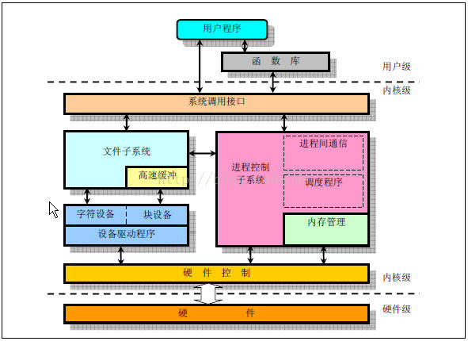

## 字符和块设备驱动

###  修订记录
| 修订说明 | 日期 | 作者 | 额外说明 |
| --- |
| 初版 | 2018/04/10 | 员清观 |  |

## 1 基础
参考文档: https://blog.csdn.net/zqixiao_09/article/details/50839042




## 2 字符设备
在`kernel/fs/char_dev.c`文件中提供接口.
```cpp
//#include <include/linux/cdev.h>
struct cdev {
	struct kobject kobj;                  //内嵌的内核对象.
	struct module *owner;                 //该字符设备所在的内核模块的对象指针.
	const struct file_operations *ops;    //该结构描述了字符设备所能实现的方法，是极为关键的一个结构体.
	struct list_head list;                //用来将已经向内核注册的所有字符设备形成链表.
	dev_t dev;                            //字符设备的设备号，由主设备号和次设备号构成.
	unsigned int count;                   //隶属于同一主设备号的次设备号的个数.
};
```

在linux内核中使用`cdev`结构体来描述字符设备，通过其成员`dev_t`来定义设备号，以确定字符设备的唯一性。通过其成员`file_operations`来定义字符设备驱动提供给VFS的接口函数，如常见的`open()、read()、write()`等。

在Linux字符设备驱动中，模块加载函数通过`register_chrdev_region()` 或`alloc_chrdev_region()`来静态或者动态获取设备号，通过`cdev_init()`建立cdev与file_operations之间的连接，通过`cdev_add()`向系统添加一个cdev以完成注册。模块卸载函数通过`cdev_del( )`来注销cdev，通过`unregister_chrdev_region( )`来释放设备号

用户空间访问该设备的程序通过Linux系统调用，如`open()、read()、write()`，来“调用”file_operations定义的字符设备驱动提供给VFS的接口函数。


这张图基本表示了字符驱动所需要的模板，只是缺少class的相关内容，class主要是用来自动创建设备节点的，还有就是一个比较常用的ioctl()函数没有列上。


### 2.1 基本函数定义

**cdev初始化**<br>
```cpp
struct backing_dev_info directly_mappable_cdev_bdi = {
	.name = "char",	.capabilities	= ( BDI_CAP_MAP_COPY | BDI_CAP_MAP_DIRECT | BDI_CAP_READ_MAP
		| BDI_CAP_WRITE_MAP	| BDI_CAP_EXEC_MAP | BDI_CAP_NO_ACCT_AND_WRITEBACK), };
static struct kobj_map *cdev_map;
static DEFINE_MUTEX(chrdevs_lock);
static struct char_device_struct {
	struct char_device_struct *next;
	unsigned int major, baseminor; int minorct; //定义设备号信息
	char name[64];
	struct cdev *cdev;
} *chrdevs[CHRDEV_MAJOR_HASH_SIZE]; //255个，这个hash数组管理所有的字符设备

void unregister_chrdev_region(dev_t from, unsigned count)
	dev_t to = from + count;
	for (n = from; n < to; n = next)
		next = MKDEV(MAJOR(n)+1, 0);	if (next > to)	next = to;
		kfree(__unregister_chrdev_region(MAJOR(n), MINOR(n), next - n));
void unregister_chrdev(unsigned int major, const char *name)//--> __unregister_chrdev(major, 0, 256, name);
	struct char_device_struct *cd = __unregister_chrdev_region(major, baseminor, count);
	if (cd && cd->cdev) { cdev_del(cd->cdev); }  kfree(cd);
int register_chrdev(unsigned int major, const char *name, const struct file_operations *fops)
	//-->__register_chrdev(major, 0, 256, name, fops);
	|--> struct char_device_struct *cd = __register_chrdev_region(major, baseminor, count, name);
		struct char_device_struct *cd = kzalloc(sizeof(struct char_device_struct), GFP_KERNEL);
		if (major == 0) ...;//从chrdevs[]中找一个空闲的主设备号分配major
		cd->major = major; cd->baseminor = baseminor;	cd->minorct = minorct;
		strlcpy(cd->name, name, sizeof(cd->name));
		for (cp = &chrdevs[i]; *cp; cp = &(*cp)->next)//每个major对应一个链表，链表每个节点对应一组minor，按照顺序排好
			if ((*cp)->major > major || ((*cp)->major == major && (((*cp)->baseminor >= baseminor) ||
		      ((*cp)->baseminor + (*cp)->minorct > baseminor))))　break;
		cd->next = *cp; *cp = cd;
	|--> struct cdev *cdev = cdev_alloc();
		struct cdev *p = kzalloc(sizeof(struct cdev), GFP_KERNEL);
		if (p) INIT_LIST_HEAD(&p->list); kobject_init(&p->kobj, &ktype_cdev_dynamic);
	cdev->owner = fops->owner; cdev->ops = fops; kobject_set_name(&cdev->kobj, "%s", name);
	|--> cdev_add(cdev, MKDEV(cd->major, baseminor), count);
		p->dev = dev; p->count = count; kobj_map(cdev_map, dev, count, NULL, exact_match, exact_lock, p);
		cd->cdev = cdev; kobject_get(p->kobj.parent);

int register_chrdev_region(dev_t from, unsigned count, const char *name)
	struct char_device_struct *cd; dev_t to = from + count;
	for (n = from; n < to; n = next) //如果count足够大，可能会需要申请多个主设备号
		next = MKDEV(MAJOR(n)+1, 0); if (next > to) next = to; //计算下一个主设备号对应的dev_t，申请整个主设备号剩余的子设备号
		cd = __register_chrdev_region(MAJOR(n), MINOR(n), next - n, name); //分配并申请一个

struct kobject *base_probe(dev_t dev, int *part, void *data)
	request_module("char-major-%d-%d", MAJOR(dev), MINOR(dev));
void __init start_kernel(void) //--> vfs_caches_init(totalram_pages)
	|--> chrdev_init();
		cdev_map = kobj_map_init(base_probe, &chrdevs_lock);
		bdi_init(&directly_mappable_cdev_bdi);

int chrdev_open(struct inode *inode, struct file *filp) //字符设备open
	struct cdev *p = inode->i_cdev;
	if (!p)
		struct kobject *kobj = kobj_lookup(cdev_map, inode->i_rdev, &idx);　new = container_of(kobj, struct cdev, kobj);
		p = inode->i_cdev; inode->i_cdev = p = new; list_add(&inode->i_devices, &p->list);//inode添加到这个cdev的打开文件链表
	cdev_put(new); filp->f_op = fops_get(p->ops); filp->f_op->open(inode, filp);
void cdev_del(struct cdev *p)
	cdev_unmap(p->dev, p->count);//--> kobj_unmap(cdev_map, dev, count);
	kobject_put(&p->kobj);

//静态内存定义初始化：
struct cdev my_cdev;
cdev_init(&my_cdev, &fops);
my_cdev.owner = THIS_MODULE;
//动态内存定义初始化：
struct cdev *my_cdev = cdev_alloc();
my_cdev->ops = &fops;
my_cdev->owner = THIS_MODULE;

void cdev_init(struct cdev *cdev, const struct file_operations *fops)
	memset(cdev, 0, sizeof *cdev);
	INIT_LIST_HEAD(&cdev->list);
	kobject_init(&cdev->kobj, &ktype_cdev_default);
	cdev->ops = fops;
//两种使用方式的功能是一样的，cdev_init()还多赋了一个 cdev->ops的值, 只是使用的内存区不一样，一般视实际的数据结构需求而定
```

### 2.2 字符设备定义简单例子

**完整的范例:**<br>
```cpp
/*在内存中申请1k 大小的内存做为简单的一个设备来访问*/
//#include<linux/cdev.h>
//#include<linux/module.h>
//#include<linux/types.h>
//#include<linux/fs.h>
//#include<linux/errno.h>
//#include<linux/mm.h>
//#include<linux/sched.h>
//#include<linux/init.h>
//#include<asm/io.h>
//#include<asm/system.h>
//#include<asm/uaccess.h>

/*设备空间大小*/
//#define MYCHAR_MEM_SIZE 0x0400
/*缺省主设备号*/
//#define MYCHAR_MAJOR	260
/*自定义的清除内存的命令*/
//#define MYCHAR_MEN_CLR	0x01
/*主设备号变量*/
static int mychar_major = MYCHAR_MAJOR;

/*习惯上将内部数据空间与cdev 绑定，与其封装*/
struct mychar_dev{
	struct cdev cdev;
	unsigned char mem[MYCHAR_MEM_SIZE];
};

/*一个实例*/
struct mychar_dev* mychar_devp;

int mychar_open(struct inode *inode,struct file * filp)
{
	filp->private_data = mychar_devp;
	return 0;
}
int mychar_release(struct inode *inode,struct file* filp)
{
	return 0;
}

ssize_t mychar_read(struct file *filp,char __user *buf,size_t size ,loff_t *ppos )
{
	unsigned long p=*ppos;
	unsigned int count = size;
	int ret = 0;
	struct mychar_dev *dev = filp->private_data;
	if(p>MYCHAR_MEM_SIZE)
		return 0;
	if(count > MYCHAR_MEM_SIZE-p)
		count = MYCHAR_MEM_SIZE-p;
	if( copy_to_user(buf,(void*)(dev->mem+p),count)){
		ret= -EFAULT;
	}else{
		*ppos +=count;
		ret = count;
		printk(KERN_INFO "read %u bytes(s) from %1u\n",count,p);
	}
	return ret;
}

ssize_t mychar_write(struct file *filp ,const char __user *buf,size_t size,loff_t *ppos)
{
	unsigned long p=*ppos;
	unsigned int count=size;
	int ret = 0;
	struct mychar_dev *dev = filp->private_data;
	if(p > MYCHAR_MEM_SIZE)
		return 0;
	if(count > MYCHAR_MEM_SIZE-p)
		count = MYCHAR_MEM_SIZE-p;
	if(copy_from_user((void*)(dev->mem),buf,count)){
		ret = -EFAULT;
	}else{
		*ppos +=count;
		ret = count;
		printk(KERN_INFO "written %u byte(s) from %1u\n",count,p);
	}
	return ret;
}
/*llseek*/
static loff_t mychar_llseek(struct file *filp,loff_t offset,int orig)
{
	loff_t ret = 0;
	switch(orig){
	case 0:	/*相对于文件开始位置偏移*/
		if(offset < 0)
			ret = -EINVAL;
		break;
		if((unsigned int)offset > MYCHAR_MEM_SIZE){
			ret = -EINVAL;
			break;
		}
		filp->f_pos =(unsigned int )offset;
		ret = filp->f_pos;
		break;
	case 1:	/*相对于文件当前位置*/
		if((filp->f_pos+offset)>MYCHAR_MEM_SIZE){
			ret = -EINVAL;
			break;
		}
		if((filp->f_pos+offset)< 0){
			ret = -EINVAL;
			break;
		}
		filp->f_pos +=offset;
		ret = filp->f_pos;
		break;
	default:
		ret = - EINVAL;
		break;
	}
	return ret;
}
int mychar_ioctl(struct inode * inodep ,struct file *filp ,unsigned int cmd ,unsigned long arg)
{
	struct mychar_dev *dev =filp->private_data;
	switch(cmd){
	case MYCHAR_MEM_CLR:
		memset(dev->mem,0,MYCHAR_MEM_SIZE);
		printk(KERN_INFO "mychar memery is set to zero\n");
		break;
	default:
		return -EINVAL;
	}
	return 0;
}
static const struct file_operations mychar_fops = {
	.owner = THIS_MODULE,
	.llseek = mychar_llseek,
	.read = mychar_read,
	.write = mychar_write,
	.ioctl = mychar_ioctl,
	.open = mychar_open,
	.release =mychar_release,
};

static void mychar_setup_cdev(struct mychar_dev *dev,int index)
{
	int err;
	int devno = MKDEV(mychar_major,index);
	cdev_init(&dev->cdev,&mychar_fops);
	dev->cdev.owner = THIS_MODULE;
	err = cdev_add(&dev->cdev,devno,1);
	if(err)
		printk(KERN_NOTICE " Error %d adding mychar %d",err,index);

}

static int __init mychar_init(void)
{
	int result;
	dev_t devno = MKDEV(mychar_major,0);
	if(mychar_major)
		result = register_chrdev_region(devno,1,"mychar");
	else{
		result = alloc_chrdev_region(&devno,0,1,"mychar");
		mychar_major = MAJOR(devno);
	}
	if(result<0)
		return result;
	mychar_devp = kmalloc(sizeof(struct mychar_dev),GFP_KERNEL);
	if(!mychar_devp){
		result = -ENOMEM;
		goto fall_malloc;

	}
	memset(mychar_devp,0,sizeof(struct mychar_dev));
	mychar_setup_cdev(mychar_devp,0);
	return 0;

fall_malloc:
	unregister_chrdev_region(devno,1);
	return result;
}

static void __exit mychar_exit(void)
{
	cdev_del(&mychar_devp->cdev);
	kfree(mychar_devp);
	unregister_chrdev_region(MKDEV(mychar_major,0),1);
}

module_param(mychar_major,int,S_IRUGO);

MODULE_LICENSE("Dual BSD/GPL");
MODULE_AUTHOR("ghostyu");
module_init(mychar_init);
module_exit(mychar_exit);
```

## 3 模块
**Linux 驱动开发之内核模块开发--知秋一叶**<br>
　　https://blog.csdn.net/zqixiao_09/article/details/50837708

内核模块是一些可以让操作系统内核在需要时载入和执行的代码，同时在不需要的时候可以卸载。这是一个好的功能，扩展了操作系统的内核功能，却不需要重新启动系统，是一种动态加载的技术。动态加载卸载方便调试新的驱动模块，不需要每次重新启动kernel，而且也方便nfs等方式的引入．

### 3.1 模块范例
```cpp
//最简单内核模块
//#include <linux/module.h>  //所有内核模块都必须包含这个头文件
//＃include<linux/kernel.h>    //使用内核信息优先级时要包含这个
//＃include<linux/init.h>         //一些初始化的函数如module_init()

int hello_show(void)
{
    printk("hello_show");
}
MODULE_EXPORT(hello_show);

static int hello_init(void)
{
    printk("hello_init");
}
static void hello_exit(void)
{
    printk("hello_exit \n");
}

module_init(hello_init); 加载时候调用该函数insmod
module_exit(hello_exit);卸载时候 rmmod

MODULE_LICENSE("GPL");  //模块许可声明
//MODULE_LICENSE("GPL v2");
MODULE_DESCRIPTION("DW Multimedia Card Interface driver");
MODULE_AUTHOR("NXP Semiconductor VietNam");
MODULE_AUTHOR("Imagination Technologies Ltd");
```

### 3.2 模块编译
```cpp
  ifneq  ($(KERNELRELEASE),)
  obj-m:=hello.o
  else
  KDIR := /lib/modules/$(shell uname -r)/build
  PWD:=$(shell pwd)
  all:
      make -C $(KDIR) M=$(PWD) modules
  clean:
      rm -f *.ko *.o *.symvers *.cmd *.cmd.o
  endif
```

**make 的的执行步骤**<br>
- a 第一次进来的时候，宏“KERNELRELEASE”未定义，因此进入 else；
- b 记录内核路径，记录当前路径； 由于make 后面没有目标，所以make会在Makefile中的第一个不是以.开头的目标作为默认的目标执行。默认执行all这个规则
- c make -C $(KDIR) M=$(PWD) modules  -C 进入到内核的目录执行Makefile ，在执行的时候KERNELRELEASE就会被赋值，M=$(PWD)表示返回当前目录，再次执行makefile，modules 编译成模块的意思，所以这里实际运行的是　make -C /lib/modules/2.6.13-study/build M=/home/fs/code/1/module/hello/ modules
- d 再次执行该makefile，KERNELRELEASE就有值了，就会执行obj-m:=hello.o，obj-m：表示把hello.o 和其他的目标文件链接成hello.ko模块文件，编译的时候还要先把hello.c编译成hello.o文件

**makefile 中的变量**<br>
先说明以下makefile中一些变量意义：
- （1）KERNELRELEASE   在linux内核源代码中的顶层makefile中有定义
- （2）shell pwd       取得当前工作路径
- （3）shell uname -r  取得当前内核的版本号
- （4）KDIR  当前内核的源代码目录。关于linux源码的目录有两个，分别为 : "/lib/modules/$(shell uname -r)/build" 和 "/usr/src/linux-header-$(shell uname -r)/"，但如果编译过内核就会知道，usr目录下那个源代码一般是我们自己下载后解压的，而lib目录下的则是在编译时自动copy过去的，两者的文件结构完全一样，因此有时也将内核源码目录设置成/usr/src/linux-header-$(shell uname -r)/。关于内核源码目录可以根据自己的存放位置进行修改。
- （5）make -C $(LINUX_KERNEL_PATH) M=$(CURRENT_PATH) modules　这就是编译模块了：　a -- 首先改变目录到-C选项指定的位置（即内核源代码目录），其中保存有内核的顶层makefile；　b -- M=选项让该makefile在构造modules目标之前返回到模块源代码目录；然后，modueles目标指向obj-m变量中设定的模块；在上面的例子中，我们将该变量设置成了hello.o。

**模块安装**<br>
当你需要将模块安装到非默认位置的时候，你可以用INSTALL_MOD_PATH 指定一个前缀，如：
     make INSTALL_MOD_PATH=/foo modules_install
模块将被安装到 /foo/lib/modules目录下

**目录的迭代**
	`obj-$(CONFIG_EXT2_FS) += ext2/`
	`obj-$(CONFIG_HELLO_MODULE) += hello.o　//obj-m 编译为模块，obj-y编译进内核`

**编译多文件**<br>
若有多个源文件，则采用如下方法：
```cpp
obj-m := hello.o
hello-objs := file1.o file2.o file3.o

//多目标
obj-$(CONFIG_ISDN) += isdn.o
isdn-objs := isdn_net_lib.o isdn_v110.o isdn_common.o
```

### 3.3 模块参数
```cpp
//模块参数
module_param(name, type, perm);
//参数的意义：1. name    既是用户看到的参数名，又是模块内接受参数的变量；2.type    表示参数的数据类型，是下列之一：byte, short, ushort, int, uint, long, ulong, charp, bool, invbool；3. perm    指定了在sysfs中相应文件的访问权限。访问权限与linux文件访问权限相同的方式管理，如0644，或使用stat.h中的宏如S_IRUGO表示。0表示完全关闭在sysfs中相对应的项。
static unsigned int int_var = 0;
module_param(int_var, uint, S_IRUGO);
static char *name;
module_param(name, charp, 0);
//同时向指针传递字符串的时候，不能传递这样的字符串 who="hello world!".即字符串中间不能有空格

//加载模块时带参数
insmod hello.ko who="world" times=5
  /sys/module/hello/parameters  该目录下生成变量对应的文件节点
```

```cpp
//current指向当前cpu当前进程
//＃include<linux/sched.h>
static inline struct thread_info *current_thread_info(void)// --> register unsigned long sp asm ("sp");	return (struct thread_info *)(sp & ~(THREAD_SIZE - 1));
//#define get_current() (current_thread_info()->task)
//#define current get_current()
```

### 3.4 module_param_string
函数原型： module_param_string(name,string,len,perm) , 函数功能： 定义一个模块字符串参数，并让内核在模块插入时把命令行的字符串参数直接复制到程序中的字符数组中。 参数：
- name：外部可见的参数名
- string：内部的变量名
- len：以string命名的buffer大小（可以小于buffer的大小，但是没有意义）
- perm：一样一样的~~

如果需要传递多个参数可以通过宏module_param_array()实现。

```cpp
static char species[BUF_LEN];
module_param_string(specifies, species, BUF_LEN, 0);

static unsigned short size = 1;
module_param(size, ushort, 0644);
MODULE_Parm_DESC(size, “The size in inches of the fishing pole” “connected to this computer.” ); //对参数的描述

module_param_array(name, type, nump, perm);
//其中，name既是外部模块的参数名又是程序内部的变量名，type是数据类型，perm是sysfs的访问权限。指针nump指向一个整数，其值表示有多少个参数存放在数组name中。值得注意是name数组必须静态分配。
static int fish[MAX_FISH];
static int nr_fish;
module_param_array(fish, int, &nr_fish, 0444); //最终传递数组元素个数存在nr_fish中
//通过宏module_param_array_named()使得内部的数组名与外部的参数名有不同的名字。例如：
module_param_array_named(name, array, type, nump, perm);
```

## 4 class和kobj_map
class和kobj_map 都用来辅助字符/块/网络设备的实现。创建字符设备时，前者负责/dev设备节点和`struct cdev`关联，后者管理`dev_t`到`struct cdev`的关联。

### 4.2 device
**MTD的DEVICE_ATTR()是基于device机制的**<br>
```cpp
ssize_t mtd_writesize_show(struct device *dev,　struct device_attribute *attr, char *buf)
  struct mtd_info *mtd = dev_get_drvdata(dev);
	return snprintf(buf, PAGE_SIZE, "%lu\n", (unsigned long)mtd->writesize);
static DEVICE_ATTR(writesize, S_IRUGO, mtd_writesize_show, NULL);
static DEVICE_ATTR(bitflip_threshold, S_IRUGO | S_IWUSR, mtd_bitflip_threshold_show, mtd_bitflip_threshold_store);
static struct attribute *mtd_attrs[] = {
	&dev_attr_type.attr,	&dev_attr_flags.attr,	&dev_attr_size.attr,	&dev_attr_erasesize.attr,	&dev_attr_writesize.attr,
	&dev_attr_subpagesize.attr,	&dev_attr_oobsize.attr,	&dev_attr_numeraseregions.attr,	&dev_attr_name.attr,	&dev_attr_ecc_strength.attr,	&dev_attr_bitflip_threshold.attr,	NULL, };
static struct attribute_group mtd_group = {	.attrs = mtd_attrs, };
static const struct attribute_group *mtd_groups[] = {	&mtd_group,	NULL, };
static struct device_type mtd_devtype = { .name	= "mtd", .groups = mtd_groups, .release	= mtd_release, };
//然后在add_mtd_device()函数中设置 : mtd->dev.type = &mtd_devtype; 集中配置了mtd的设备信息。
//也可以使用类似　device_create_file(device, &dev_attr_aecv2_ctrl);　的方式添加设备属性信息
```

```cpp
struct kset *devices_kset;
struct kobject *dev_kobj, *sysfs_dev_char_kobj, *sysfs_dev_block_kobj;
static const struct kset_uevent_ops device_uevent_ops = {
	.filter =	dev_uevent_filter, .name =		dev_uevent_name, .uevent =	dev_uevent, };

ssize_t dev_attr_show(struct kobject *kobj, struct attribute *attr, char *buf)
	return dev_attr->show(kobj_to_dev(kobj), to_dev_attr(attr), buf);
ssize_t dev_attr_store(struct kobject *kobj, struct attribute *attr, char *buf, size_t count)
	return dev_attr->store(kobj_to_dev(kobj), to_dev_attr(attr), buf, count);
static const struct sysfs_ops dev_sysfs_ops = { .show	= dev_attr_show, .store	= dev_attr_store,};
static struct kobj_type device_ktype = {
	.release	= device_release, .sysfs_ops	= &dev_sysfs_ops, .namespace	= device_namespace, };

struct device *device_create(struct class *class, struct device *parent,dev_t devt, void *drvdata, const char *fmt, ...)
	va_list vargs;　va_start(vargs, fmt);
	|--> struct device *dev = device_create_vargs(class, parent, devt, drvdata, fmt, vargs);　va_end(vargs);
		struct device *dev = kzalloc(sizeof(*dev), GFP_KERNEL);
		dev->devt = devt; dev->parent = parent;	dev->release = device_create_release;	dev_set_drvdata(dev, drvdata);
		dev->class = class;	//没有mtd->dev.class的赋值，这个设备会出现在sysfs/devices下，而不是class的路径
		kobject_set_name_vargs(&dev->kobj, fmt, args);
		|--> device_register(dev);　//注意关注这个函数调用前的参数设定
			device_initialize(dev);
			|--> return device_add(dev); //加入sysfs和class系统
				dev = get_device(dev); parent = get_device(dev->parent);
				dev->kobj.parent = get_device_parent(dev, parent);
				kobject_add(&dev->kobj, dev->kobj.parent, NULL);　//加入父设备
				device_create_file(dev, &uevent_attr); device_create_file(dev, &devt_attr);　
				device_create_sys_dev_entry(dev); devtmpfs_create_node(dev);
				device_add_class_symlinks(dev); device_add_attrs(dev); bus_add_device(dev); dpm_sysfs_add(dev);	device_pm_add(dev);
				if (dev->bus)	blocking_notifier_call_chain(&dev->bus->p->bus_notifier, BUS_NOTIFY_ADD_DEVICE, dev);
				kobject_uevent(&dev->kobj, KOBJ_ADD); bus_probe_device(dev);
				klist_add_tail(&dev->knode_class, &dev->class->p->klist_devices);
				list_for_each_entry(class_intf, &dev->class->p->interfaces, node)
					if (class_intf->add_dev) class_intf->add_dev(dev, class_intf);
```

### 4.1 device和class
刚开始学习驱动的时候，每次都需要`mknod /dev/timer c 500 0`这样手动去创建一个设备节点；实际上Linux内核提供一组函数，可以用来在驱动模块加载的时候自动在/dev目录下创建相应的设备节点，并在卸载模块时删除节点。当然前提条件是用户空间移植了udev

内核中定义了`struct class`结构体，顾名思义，一个`struct class`结构体类型变量对应一个类，内核同时提供了`class_create(…)`函数，可以用它来创建一个类，这个类存放于sysfs下面，一旦创建好了这个类，再调用`device_create(…)`函数来在/dev目录下创建相应的设备节点。这样，加载模块的时候，用户空间中的udev会自动响应`device_create(…)`函数，去`/sysfs`下寻找对应的类从而创建设备节点

**基于class机制创建的设备节点，必然绑定字符/块/网络设备其中一个，提供用户空间访问接口，所以总是可以看到它们搭配使用。**

```cpp
大致用法如下：
struct class *myclass = class_create(THIS_MODULE, “my_device_driver”);
class_device_create(myclass, NULL, MKDEV(major_num, 0), NULL, “my_device”);
这样的module被加载时，udev daemon就会自动在/dev下创建my_device设备文件。

int __class_register(struct class *class, struct lock_class_key *key);
struct class * __class_create(struct module *owner, const char *name, struct lock_class_key *key);

void class_destroy(struct class *cls);
　#define class_create(owner, name)	({ static struct lock_class_key __key; __class_create(owner, name, &__key); })

//register之后需要手动设定name
　#define class_register(class) ({ static struct lock_class_key __key; __class_register(class, &__key);	})
void class_unregister(struct class *class);


```

### 4.2 kobj_map
kobj_map结构体是用来管理设备号及其对应的设备的(如`struct cdev`)，`kobj_map()`函数就是将指定的设备号加入到该数组，kobj_lookup则查找该结构体，然后返回对应设备号的kobject对象, 利用该kobject对象，我们可以得到包含它的对象如cdev。
```cpp
struct kobj_map {
	struct probe { struct probe *next;	dev_t dev;	unsigned long range; struct module *owner;
		kobj_probe_t *get;		int (*lock)(dev_t, void *);		void *data;	};
	struct probe *probes[255];
	struct mutex *lock;
};
struct kobj_map *kobj_map_init(kobj_probe_t *base_probe, struct mutex *lock);
int kobj_map(struct kobj_map *domain, dev_t dev, unsigned long range, struct module *module, kobj_probe_t *probe,
	     int (*lock)(dev_t, void *), void *data);
void kobj_unmap(struct kobj_map *domain, dev_t dev, unsigned long range);
struct kobject *kobj_lookup(struct kobj_map *domain, dev_t dev, int *index);
```
### 4.3 __attribute__详解
	https://blog.csdn.net/qlexcel/article/details/92656797
	http://blog.sina.com.cn/s/blog_661314940100qujt.html
	https://blog.csdn.net/weaiken/article/details/88085360?utm_medium=distribute.pc_relevant.none-task-blog-BlogCommendFromMachineLearnPai2-3.channel_param&depth_1-utm_source=distribute.pc_relevant.none-task-blog-BlogCommendFromMachineLearnPai2-3.channel_param

**kernel中__init修饰**<br>
在linux/init.h中定义如下： #define __init __section(.init.text) __cold notrace
有些版本的内核是这样定义的：  #define __init __attribute__ ((__section__ (".init.text"))) __cold

linux内核代码使用了大量的GNU C扩展，以致于使GNU C成为唯一能够编译内核的编译器，GNU C这些扩展对代码的优化、目标代码布局和安全检查提供了支持。__attribute__ 就是这些扩展中的一个，它主要用来声明一些特殊的属性，这些属性指示编译器进行特定的优化和更仔细的代码检查。GNU C支持十几个属性，section是其中一个。通常编译器将函数放在.text节，变量放在.data字节或.bss节，使用section属性，可以指定编译器将函数和变量放在特定节，那么_init的修饰或者用_init定义的作用就是将它修饰的代码放在.init.text节中。链接器可以将相同节的函数或数据放在一起，比如_init修饰的代码放在.init.text节里，初始化后可以释放部分内存。

__attribute__((section(“section_name”)))的作用是将指定的函数或变量放入到名为”section_name”的段中。

通常在宏定义中使用#来创建字符串 #abc就表示字符串”abc”等；##运算符称为预处理器的粘合剂，用来替换粘合两个不同的符号

```cpp
//#define __iomem    __attribute__((noderef, address_space(2)))
//attribute是用来修饰一个变量的，这个变量必须是非解除参考（no dereference）的，即这个变量地址必须是有效的，而且变量所在的地址空间必须是2，即io存储空间。地址空间的定义：  v: 0 内核空间 v: 1 用户空间 v: 2 io存储空间 v: 3 cpu空间

//#define __rcu      __attribute__((noderef, address_space(4)))

//#define module_init(x) __initcall(x)
//#define module_exit(x) __exitcall(x)
```
### 4.4 绝对定位
指定变量物理地址 : __align(4) u8 mem2base[MEM2_MAX_SIZE] __attribute__((at(0X68000000)));

__attribute__( at(绝对地址) )的作用分两个，一个是绝对定位到Flash，另个一是绝对定位到RAM。

1、定位到flash中，一般用于固化的信息，如出厂设置的参数，上位机配置的参数，ID卡的ID号，flash标记等等
const u16 gFlashDefValue[512] __attribute__((at(0x0800F000))) = {0x1111,0x1111,0x1111,0x0111,0x0111,0x0111};//定位在flash中,其他flash补充为00
const u16 gflashdata__attribute__((at(0x0800F000))) = 0xFFFF;
2、定位到RAM中，一般用于数据量比较大的缓存，如串口的接收缓存，再就是某个位置的特定变量
u8 USART2_RX_BUF[USART2_REC_LEN] __attribute__ ((at(0X20001000)));//接收缓冲,最大USART_REC_LEN个字节,起始地址为0X20001000.
注意：
1、绝对定位不能在函数中定义，局部变量是定义在栈区的，栈区由MDK自动分配、释放，不能定义为绝对地址，只能放在函数外定义。
2、定义的长度不能超过栈或Flash的大小，否则，造成栈、Flash溢出。
