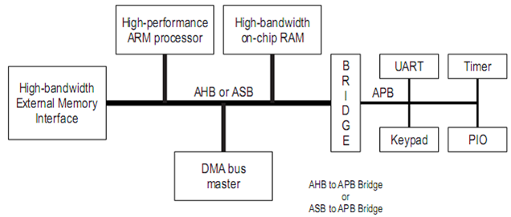
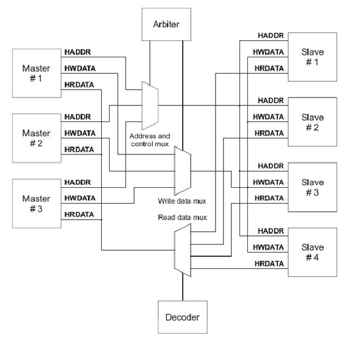
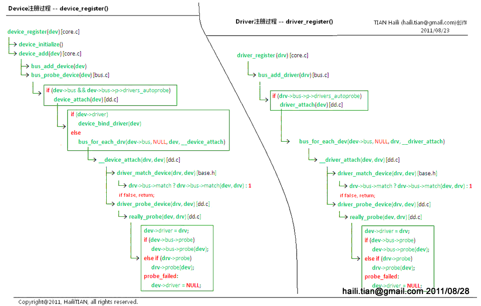
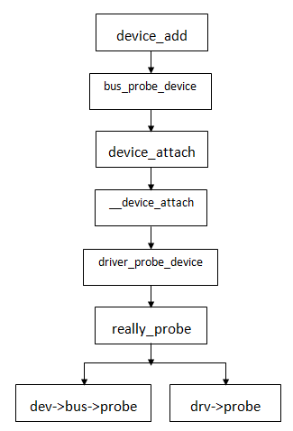

# amba_bus

### 修订记录
| 修订说明 | 日期 | 作者 | 额外说明 |
| --- |
| 初版 | 2018/04/10 | 员清观 |  |

### 参考网页
**知秋一叶．platform 设备驱动**<br>
  https://blog.csdn.net/zqixiao_09/article/details/50865480
**知秋一叶．platform设备驱动应用实例解析**<br>
  https://blog.csdn.net/zqixiao_09/article/details/50888795
**led的platform范例**<br>
  https://blog.csdn.net/lizuobin2/article/details/51607813
**知秋一叶．platform和设备树**<br>
Device Tree是一种描述硬件的数据结构，设备树源(Device Tree Source)文件（以.dts结尾）就是用来描述目标板硬件信息的。Device Tree由一系列被命名的结点（node）和属性（property）组成，而结点本身可包含子结点。所谓属性，其实就是成对出现的name和value。在Device Tree中，可描述的信息包括（原先这些信息大多被hard code到kernel中）
  https://blog.csdn.net/zqixiao_09/article/details/50889458

---
## 1 AMBA总线基础
　　AMBA规范主要包括了AHB(Advanced High performance Bus)系统总线和APB(Advanced Peripheral Bus)外围总线等。<br>
　　AMBA 2.0规范包括四个部分：AHB、ASB、APB和Test Methodology。AHB的相互连接采用了传统的带有主模块和从模块的共享总线，接口与互连功能分离，这对芯片上模块之间的互连具有重要意义。AMBA已不仅是一种总线，更是一种带有接口模块的互连体系。下面将简要介绍比较重要的AHB和APB总线。

**Advanced System Bus (ASB)**

ASB总线主要用于高性能系统模块。ASB是可用于AHB不需要的高性能特性的芯片设计上可选的系统总线。ASB也支持高性能处理器，片上内存，片外内存提供接口和慢速外设。
特征：高性能，数据传输，多总线主控制器，突发连续传输
**Advanced Peripheral Bus (APB)**

APB总线用于为慢速外设提供总线技术支持，用于低带宽的周边外设之间的连接，例如UART、1284等
APB是一种优化的，低功耗的，精简接口总线，可以支持多种不同慢速外设。由于APB是ARM公司最早提出的总线接口，APB可以桥接ARM体系下每一种系统总线

APB通过桥接高带宽、高性能总线，提供基本的微控制器二级总线，通常该总线上的外设有以下特点：　支持映射寄存器接口；对带宽没有很高的要求；通过编程实现对外设进行控制
特征：低功耗，寻址控制，支持简单接口协议，支持多种外设，它的总线架构不像AHB支持多个主模块，在APB里面唯一的主模块就是APB桥。



**AHB总线**
　　AHB主要用于高性能模块(如CPU、DMA和DSP等)之间的连接，作为SoC的片上系统总线，它包括以下一些特性
 - 单个时钟边沿操作
 - 非三态的实现方式
 - 高性能数据传输，支持突发传输 / 支持分段传输
 - 支持多个总线主控制器、可配置32位~128位总线宽度
 - 支持字节，半字节和字的传输
AHB总线用于高性能，高时钟工作频率模块。AHB在AMBA架构中为系统的高性能运行起到了基石作用。AHB为高性能处理器，片上内存，片外内存提供接口，同时桥接慢速外设。

AHB 系统由主模块、从模块和基础结构(Infrastructure)3部分组成。整个AHB总线上的传输都由主模块发出，由从模块负责回应。基础结构则由仲裁器(arbiter)、主模块到从模块的多路器、从模块到主模块的多路器、译码器(decoder)、虚拟从模块(dummy Slave)、虚拟主模块(dummy Master)所组成
 - AHB主控制器：主控制器可以通过地址和控制信息，可以进行初始化，读，写操作。在同一时间，总线上只能有一个主控制器。
 - AHB从设备：从设备通常是指在其地址空间内，响应主控制器发出的读写控制操作的被动设备。通过操作的成功与否反馈给其主控制器，完成数据的传输控制。
 - AHB仲裁器：仲裁器根据用户的配置，确保在总线上同一时间只有一个主控制器拥有总线控制权限。AHB总线上只能有一个仲裁器。
 - AHB译码器：译码器解析在总线上传输的地址和控制信息。AHB总线上只能有一个译码器。

也允许在AHB上挂接一些慢速外设作为从设备，不过它们通常还是挂接在APB总线上



**AXI和AHB区别**
　　AXI：高速度、高带宽，管道化互联，单向通道，只需要首地址，读写并行，支持乱序，支持非对齐操作，有效支持初始延迟较高的外设，连线非常多。AHB协议需要一次突发传输的所有地址，地址与数据锁定对应关系，后一次突发传输必须在前次传输完成才能进行。AXI只需要一次突发的首地址，可以连续发送多个突发传输首地址而无需等待前次突发传输完成，并且多个数据可以交错传递，此特征大大提高了总线的利用率。

　　AHB总线与AXI总线均适用于高性能、高带宽的SoC系统，但AXI具有更好的灵活性，而且能够读写通道并行发送，互不影响；更重要的是，AXI总线支持乱序传输，能够有效地利用总线的带宽，平衡内部系统。因此SoC系统中，均以AXI总线为主总线，通过桥连接AHB总线与APB总线，这样能够增加SoC系统的灵活性，更加合理地把不同特征IP分配到总线上。

**基于AMBA的片上系统**<br>
　　大多数挂在总线上的模块(包括处理器)只是单一属性的功能模块：主模块或者从模块。主模块是向从模块发出读写操作的模块，如CPU，DSP等；从模块是接受命令并做出反应的模块，如片上的RAM，AHB／APB 桥等。另外，还有一些模块同时具有两种属性，例如直接存储器存取(DMA)在被编程时是从模块，但在系统读传输数据时必须是主模块。
　　如果总线上存在多个主模块，就需要仲裁器来决定如何控制各种主模块对总线的访问。虽然仲裁规范是AMBA总线规范中的一部分，但具体使用的算法由RTL设计工程师决定，其中两个最常用的算法是固定优先级算法和循环制算法。AHB总线上最多可以有16个主模块和任意多个从模块，如果主模块数目大于16，则需再加一层结构　　
　　APB 桥既是APB总线上唯一的主模块，也是AHB系统总线上的从模块。其主要功能是锁存来自AHB系统总线的地址、数据和控制信号，并提供二级译码以产生APB外围设备的选择信号，从而实现AHB协议到APB协议的转换。

## 2 amba驱动程序基础

### 2.1 amba bus,driver,device

**amba bus初始化**
```cpp
struct bus_type {
	const char		*name;
	const char		*dev_name;
	struct device		*dev_root;
	struct bus_attribute	*bus_attrs;
	struct device_attribute	*dev_attrs;
	struct driver_attribute	*drv_attrs;

	int (*match)(struct device *dev, struct device_driver *drv);
	int (*uevent)(struct device *dev, struct kobj_uevent_env *env);
	int (*probe)(struct device *dev);  	int (*remove)(struct device *dev);
	void (*shutdown)(struct device *dev);	int (*suspend)(struct device *dev, pm_message_t state);
	int (*resume)(struct device *dev);

	const struct dev_pm_ops *pm;
	struct iommu_ops *iommu_ops;
	struct subsys_private *p;
	struct lock_class_key lock_key;
};
struct bus_type amba_bustype = {
	.name		= "amba",
	.dev_attrs	= amba_dev_attrs,
	.match		= amba_match,
	.uevent		= amba_uevent,
	.pm		= AMBA_PM,
};

static int amba_match(struct device *dev, struct device_driver *drv) {
	struct amba_device *pcdev = to_amba_device(dev);
	struct amba_driver *pcdrv = to_amba_driver(drv);
	return amba_lookup(pcdrv->id_table, pcdev) != NULL;
    --> const struct amba_id * amba_lookup(const struct amba_id *table, struct amba_device *dev)
  	while (table->mask)
  		ret = (dev->periphid & table->mask) == table->id;	if (ret) break;	table++;
  	return ret ? table : NULL;
}
static int __init amba_init(void)
{
	return bus_register (&amba_bustype);
    --> int bus_register(struct bus_type *bus)
    struct subsys_private *priv = kzalloc(sizeof(struct subsys_private), GFP_KERNEL);
    priv->bus = bus;  bus->p = priv;  retval = kset_register(&priv->subsys);
    retval = bus_create_file(bus, &bus_attr_uevent);
    priv->devices_kset = kset_create_and_add("devices", NULL, &priv->subsys.kobj);
    priv->drivers_kset = kset_create_and_add("drivers", NULL, &priv->subsys.kobj);
    INIT_LIST_HEAD(&priv->interfaces);  __mutex_init(&priv->mutex, "subsys mutex", key);
    klist_init(&priv->klist_devices, klist_devices_get, klist_devices_put);
    klist_init(&priv->klist_drivers, NULL, NULL);
    retval = add_probe_files(bus);    retval = bus_add_attrs(bus);
}
postcore_initcall(amba_init);
```

之后amaba driver和device都注册标记bus类型为：`amba_bustype`，driver需要定义`id_table`匹配数组，device定义`periphid`匹配项，通过`amba_match()`函数进行匹配．

**amba driver 初始化**
```cpp
struct amba_driver {
	struct device_driver	drv;
	int			(*probe)(struct amba_device *, const struct amba_id *);
	int			(*remove)(struct amba_device *);
	void			(*shutdown)(struct amba_device *);
	int			(*suspend)(struct amba_device *, pm_message_t);
	int			(*resume)(struct amba_device *);
	const struct amba_id	*id_table;
};
static int __init pl022_init(void) {
	module_power_on(SYSMGR_SSP_BASE);
	return amba_driver_register(&pl022_driver);
    --> int amba_driver_register(struct amba_driver *drv)
    drv->drv.bus = &amba_bustype;
    #define SETFN(fn)	if (drv->fn) drv->drv.fn = amba_##fn
    SETFN(probe);
    SETFN(remove);
    SETFN(shutdown);
    return driver_register(&drv->drv);
}
subsys_initcall_sync(pl022_init);
static void __exit pl022_exit(void) {
	amba_driver_unregister(&pl022_driver);
}
module_exit(pl022_exit);
```

**amba device 初始化**
```cpp
struct amba_device {
	struct device		dev;
	struct resource		res;
	struct clk		*pclk;
	u64			dma_mask;
	unsigned int		periphid;
	unsigned int		irq[AMBA_NR_IRQS];
};
static struct pl022_ssp_controller imap_ssp1_data = {
	.bus_id = 1,
	.num_chipselect = 1,
	.enable_dma = 0,
};
struct amba_device imap_ssp1_device = {
	.dev = {
		.init_name = "imap-ssp.1",
		.platform_data = &imap_ssp1_data,
		},
	.res = {
		.start = IMAP_SSP1_BASE,
		.end = IMAP_SSP1_BASE + IMAP_SSP1_SIZE - 1,
		.flags = IORESOURCE_MEM,
		},
	.irq = {GIC_SSP1_ID},
	.periphid = 0x00041022, //通过此项定义匹配amba_driver.
};
void __init q3f_init_devices(void) {
  amba_device_register(imap_ssp1_device, &iomem_resource);
    --> int amba_device_register(struct amba_device *dev, struct resource *parent);
    amba_device_initialize(dev, dev->dev.init_name);
      --> static void amba_device_initialize(struct amba_device *dev, const char *name);
      device_initialize(&dev->dev);
    	if (name) dev_set_name(&dev->dev, "%s", name);
    	dev->dev.release = amba_device_release;
    	dev->dev.bus = &amba_bustype;
    	dev->dev.dma_mask = &dev->dma_mask;
    	dev->res.name = dev_name(&dev->dev);
    dev->dev.init_name = NULL;
  	if (!dev->dev.coherent_dma_mask && dev->dma_mask)
  		dev_warn(&dev->dev, "coherent dma mask is unset\n");
  	return amba_device_add(dev, parent);
      --> int amba_device_add(struct amba_device *dev, struct resource *parent)
      int ret = request_resource(parent, &dev->res);
      ret = device_add(&dev->dev); //在下文中有详细流程
      for each (dev->irq[i]) ret = device_create_file(&dev->dev, &dev_attr_irq[i]);
}
设备成功注册后，就会添加到上面提到的总线设备集合中。在设备注册的过程中，系统要搜索总线上注册的驱动，看看有没有匹配的，如果设备还没有绑定驱动程序，则为其绑定一个
具体的调用过程如下：
  device_register-->>>device_add-->>>bus_attach_device-->>>device_attach-->>>__device_attach
```

**设备初始化**
```cpp

```

### 2.2
### 2.3
### 2.4


## 3 platform bus
参考 : https://blog.csdn.net/zqixiao_09/article/details/50865480

Linux发明了一种虚拟的总线，称为platform总线，相应的设备称为platform_device，而驱动成为 platform_driver。
**基于Platform总线的驱动开发流程如下**<br>
a -- 定义初始化platform bus
b -- 定义和注册各种platform devices
c -- 定义和注册相关platform driver
d -- 操作相关设备

**platform初始化过程**<br>
`start_kernel`->`rest_init`->`kernel_thread(kernel_init)`->`kernel_init_freeable`->`do_basic_setup`->`driver_init`->`platform_bus_init`

### 3.1
**基本数据结构**
```cpp
struct resource {
	resource_size_t start;//内存或中断号的开始地址和结束值
	resource_size_t end;
	const char *name;
	unsigned long flags;//IORESOURCE_MEM IORESOURCE_IRQ 最常用
	struct resource *parent, *sibling, *child;
};
struct platform_device {
  const char	*name;/* 设备名 */
	int		id;//设备id，用于给插入给该总线并且具有相同name的设备编号，如果只有一个设备的话填-1。
	bool		id_auto;
	struct device	dev;//结构体中内嵌的device结构体。
	u32		num_resources;　/* 设备所使用各类资源数量 */
	struct resource	*resource;//定义平台设备的资源
	const struct platform_device_id	*id_entry;
	/* MFD cell pointer */
	struct mfd_cell *mfd_cell;
	/* arch specific additions */
	struct pdev_archdata	archdata;
};
struct platform_driver {
  int (*probe)(struct platform_device *);
	int (*remove)(struct platform_device *);
	void (*shutdown)(struct platform_device *);
	int (*suspend)(struct platform_device *, pm_message_t state);
	int (*resume)(struct platform_device *);
	struct device_driver driver;
	const struct platform_device_id *id_table;
};
```

**platform bus注册**<br>
```cpp
struct device platform_bus = {
	.init_name	= "platform",
};
struct bus_type platform_bus_type = {
	.name		= "platform",
	.dev_attrs	= platform_dev_attrs,
	.match		= platform_match,
	.uevent		= platform_uevent,
	.pm		= &platform_dev_pm_ops,
};
static int platform_match(struct device *dev, struct device_driver *drv)
  check of_driver_match_device(dev, drv);  check acpi_driver_match_device(dev, drv);
  if (pdrv->id_table)
    |--> return platform_match_id(pdrv->id_table, pdev) != NULL;//const struct platform_device_id *platform_match_id(const struct platform_device_id *id, struct platform_device *pdev)
      while (id->name[0]) {
    		if (strcmp(pdev->name, id->name) == 0) {		pdev->id_entry = id;			return id;		}		id++;	}//
    	return NULL;//匹配依据：驱动和device的名称;一个驱动可以支持一个或者多个id
  return (strcmp(pdev->name, drv->name) == 0);//如果没有定义id_table匹配多个设备名称的机制，那么直接使用drv和dev名称进行匹配
int __init platform_bus_init(void)
  error = device_register(&platform_bus);
  error = bus_register(&platform_bus_type);
```

NOTE: 普通代码使用正常的tab缩进，函数解析使用特别的醒目符号表示比如`|<-->`；函数原型使用注释的方式描述；函数层次结构中关键的主干步骤，如果不需要展开，也应该用醒目的符号如`--> `，来表示.
NOTE: 函数解析展开有两种：１．原地展开，２．本代码块中另外解析．

**dw_mmc platform device**
device可以使用module_init()+platform_device_register()注册，或者集中在board级别设备初始化中使用platform_add_devices()集中注册


**dw_mmc platform drvier**
platform 驱动只是在设备驱动外套一层platform_driver 的外壳。比如编写的是基于字符设备的platform驱动，在遵循并实现platform总线上驱动与设备的特定接口的情况下，最核心的还是字符设备的核心结构：cdev、 file_operations（他包含的操作函数接口）、dev_t(设备号)、设备文件（/dev）等，因为用platform机制编写的字符驱动，它的本质是字符驱动。

```cpp
static int dw_mci_pltfm_probe(struct platform_device *pdev)
	|--> return dw_mci_pltfm_register(pdev, NULL); //int dw_mci_pltfm_register(struct platform_device *pdev,	const struct dw_mci_drv_data *drv_data)
    struct dw_mci_board *pdata = pdev->dev.platform_data;
    struct dw_mci *host = devm_kzalloc(&pdev->dev, sizeof(struct dw_mci), GFP_KERNEL);
    struct resource	*regs = platform_get_resource(pdev, IORESOURCE_MEM, 0);
    host->regs = devm_ioremap_resource(&pdev->dev, regs);
    host->pdata->init(0,NULL,NULL);
    host->irq = platform_get_irq(pdev, 0);//获取irq资源
    ret = drv_data->init(host);
    platform_set_drvdata(pdev, host);
    |--> ret = dw_mci_probe(host);//int dw_mci_probe(struct dw_mci *host)
      const struct dw_mci_drv_data *drv_data = host->drv_data;
      if (!host->pdata) 	host->pdata = dw_mci_parse_dt(host);
      g_host = host;
			host->biu_clk = clk_get_sys("sdmmc.1", "sdmmc1");  ret = clk_prepare_enable(host->biu_clk);
			host->ciu_clk = clk_get_sys("imap-mmc.1", "sd-mmc1"); ret = clk_prepare_enable(host->ciu_clk);
      host->bus_hz = clk_get_rate(host->ciu_clk);
      if (drv_data && drv_data->setup_clock)
        ret = drv_data->setup_clock(host);
      host->quirks = host->pdata->quirks; spin_lock_init(&host->lock);  INIT_LIST_HEAD(&host->queue);
      host->push_data = dw_mci_push_data32;  		host->pull_data = dw_mci_pull_data32;
  		width = 32;  		host->data_shift = 2;    mci_wait_reset(host->dev, host)；
      host->dma_ops = host->pdata->dma_ops;　dw_mci_init_dma(host); for each mci_writel(host, xxxx, xxxx);
      tasklet_init(&host->tasklet, dw_mci_tasklet_func, (unsigned long)host);
      host->card_workqueue = alloc_workqueue("dw-mci-card",	WQ_MEM_RECLAIM | WQ_NON_REENTRANT, 1);
      INIT_WORK(&host->card_work, dw_mci_work_routine_card);
      ret = devm_request_irq(host->dev, host->irq, dw_mci_interrupt, host->irq_flags, "dw-mci", host);
      for (i = 0; i < host->num_slots; i++)
		    ret = dw_mci_init_slot(host, i);
static const struct of_device_id dw_mci_pltfm_match[] = {
	{ .compatible = "snps,dw-mshc", },	{},};//好像是设备树的相关内容
static struct platform_driver dw_mci_pltfm_driver = {
	.probe		= dw_mci_pltfm_probe,device_driver
	.remove		= dw_mci_pltfm_remove,
	.driver		= {
		.name		= "imap-mmc1",
		.of_match_table	= of_match_ptr(dw_mci_pltfm_match),
		.pm		= &dw_mci_pltfm_pmops,
	},
};
static int __init dw_mci_platform_init(void)
	|--> return platform_driver_register(&dw_mci_pltfm_driver);//int platform_driver_register(struct platform_driver *);
    drv->driver.bus = &platform_bus_type;
  	if (drv->probe)  		drv->driver.probe = platform_drv_probe;//有效probe，关联起来
  	if (drv->remove) 		drv->driver.remove = platform_drv_remove;
  	if (drv->shutdown)	drv->driver.shutdown = platform_drv_shutdown;
  	return driver_register(&drv->driver);

static void __exit dw_mci_platform_exit(void) {
	|--> platform_driver_unregister(&dw_mci_pltfm_driver); }
subsys_initcall(dw_mci_platform_init);
module_exit(dw_mci_platform_exit);
```

### 3.2
### 3.3
### 3.4


## 4 device初始化注册等
**dev drv register基本流程**


**device_add()基本流程**
linux设备模型：设备device，驱动driver，总线bus。设备代表物理设备，驱动代表了设备操作方法，bus则是用来管理和匹配它们。device和driver里面都有一个成员变量bus，表示它们归哪个总线管理，bus里面则有两个链表，device链表和driver链表。当有新的设备加入的时候，就会将它加入它对应的bus的device链表，然后在它的驱动链表中寻找是否有驱动driver和该device匹配成功，如果匹配成功设备就可以正常使用了，否则，不好意思继续等待。当有新的驱动加入的时候，就会将它加入它对应的bus的driver链表，然后在它的设备链表中寻找是否有设备device和该driver匹配成功，如果成功设备就可以正常使用了.device_add就是将设备加入到Linux设备模型的关键，它的内部将找到它的bus，然后让它的bus给它找到它的driver，其调用顺序为：



```cpp
struct device {
	struct device		*parent;
	struct device_private	*p;
	struct kobject kobj;
	const char		*init_name; /* initial name of the device */
	const struct device_type *type;
	struct mutex		mutex;	/* mutex to synchronize calls to its driver.*/

	struct bus_type	*bus;		/* type of bus device is on */
	struct device_driver *driver;	/* which driver has allocated this device */
	void		*platform_data;	/* Platform specific data, device core doesn't touch it */
	struct dev_pm_info	power;
	struct dev_pm_domain	*pm_domain;

#ifdef CONFIG_PINCTRL
	struct dev_pin_info	*pins;
#endif

#ifdef CONFIG_NUMA
	int		numa_node;	/* NUMA node this device is close to */
#endif
	u64		*dma_mask;	/* dma mask (if dma'able device) */
	u64		coherent_dma_mask;/* Like dma_mask, but for alloc_coherent mappings as not all hardware supports
					     64 bit addresses for consistent allocations such descriptors. */

	struct device_dma_parameters *dma_parms;
	struct list_head	dma_pools;	/* dma pools (if dma'ble) */
	struct dma_coherent_mem	*dma_mem; /* internal for coherent mem  override */
#ifdef CONFIG_CMA
	struct cma *cma_area;		/* contiguous memory area for dma allocations */
#endif
	/* arch specific additions */
	struct dev_archdata	archdata;

	struct device_node	*of_node; /* associated device tree node */
	struct acpi_dev_node	acpi_node; /* associated ACPI device node */

	dev_t			devt;	/* dev_t, creates the sysfs "dev" */
	u32			id;	/* device instance */

	spinlock_t		devres_lock;
	struct list_head	devres_head;

	struct klist_node	knode_class;
	struct class		*class;
	const struct attribute_group **groups;	/* optional groups */

	void	(*release)(struct device *dev);
	struct iommu_group	*iommu_group;
};
**需要重点关注的几个常用成员，devices.c中最经常初始化的几项：**
- void		*platform_data;//这个有点类似于给用户提供的自留地，用户可以在里面存放各种底层信息。当driver的probe（探测）函数执行时，platform_device会作为参数传进去，这样驱动就能够间接的得到这个 void *platform_data，从而据此操作硬件；新内核则直接在设备节点属性中存放数据，驱动通过API读取节点里的数据
- dma_mask
- coherent_dma_mask

|--> void bus_probe_device(struct device *dev)　//从主干中拉出来详细解释
  if (bus->p->drivers_autoprobe)
    |--> ret = device_attach(dev);//int device_attach(struct device *dev)
      if (dev->driver)
        |--> ret = device_bind_driver(dev); //int device_bind_driver(struct device *dev)
          ret = driver_sysfs_add(dev);  driver_bound(dev);
      else
        |--> ret = bus_for_each_drv(dev->bus, NULL, dev, __device_attach);//static int __device_attach(struct device_driver *drv, void *data)
          if (driver_match_device(drv, dev))
            |--> return driver_probe_device(drv, dev);//int driver_probe_device(struct device_driver *drv, struct device *dev)
              |--> ret = really_probe(dev, drv);//static int really_probe(struct device *dev, struct device_driver *drv)
                dev->driver = drv; //绑定，然后调用bus或者driver的probe函数．
                if (dev->bus->probe)  ret = dev->bus->probe(dev);
                else ret = drv->probe(dev);
  list_for_each_entry(sif, &bus->p->interfaces, node)
		if (sif->add_dev)		sif->add_dev(dev, sif);

|--> int bus_add_device(struct device *dev)
  struct bus_type *bus = bus_get(dev->bus);
  if (bus) //应该结合上文中bus_register()阅读
    error = device_add_attrs(bus, dev);//创建相应的属性文件
    error = sysfs_create_link(&bus->p->devices_kset->kobj, &dev->kobj, dev_name(dev));//在sys/bus/总线类型/devices/dev_name()dev 在devices目录下创建名字为devname（d）指向sys/devices/相同设备名字的 符号链接
    error = sysfs_create_link(&dev->kobj, &dev->bus->p->subsys.kobj, "subsystem");//在sys/devices/设备名字/目录下创建目录名字为subsystem 并且指向在sys/bus/总线类型/devices/de符号链接
    klist_add_tail(&dev->p->knode_bus, &bus->p->klist_devices);//把设备加入到总线的设备链中，这步才是重点

|--> int device_add(struct device *dev)
  dev = get_device(dev);//增加该设备的引用计数
  if (!dev->p) error = device_private_init(dev);//初始化设备的私有成员p
  dev_set_name(dev, "%s", dev->init_name);//初始化设备内部的kobject的名字
  dev->init_name = NULL;
  if (!dev_name(dev) && dev->bus && dev->bus->dev_name)
      dev_set_name(dev, "%s%u", dev->bus->dev_name, dev->id);//使用bus以及设备id来初始化设备内部kobject名字
  parent = get_device(dev->parent);//增加设备父设备并增加父设备引用计数
  kobj = get_device_parent(dev, parent);　  set_dev_node(dev, dev_to_node(parent));
  error = kobject_add(&dev->kobj, dev->kobj.parent, NULL);//将设备加入到kobject模型中，创建sys相关目录
  if (platform_notify)    platform_notify(dev);
  error = device_create_file(dev, &uevent_attr); //创建sys目录下设备的uevent属性文件，通过它可以查看设备的uevent事件
  if (MAJOR(dev->devt))  //如果定义了devt，则产生dev属性,并在/dev目录下产生设备节点文件
    error = device_create_file(dev, &devt_attr);//创建sys目录下设备的设备号属性，即major和minor，主要是在sys/devices/...中添加dev属性文件
    error = device_create_sys_dev_entry(dev);//在/sys/dev/char/或者/sys/dev/block/创建devt的属性的连接文件,形如10:45,由主设备号和次设备号构成,指向/sys/devices/.../的具体设备目录,该链接文件只具备读属性，显示主设备号：次设备号，如10:45,用户空间udev相应uevent事件时，将根据设备号在/dev下创建节点文件
    devtmpfs_create_node(dev);
  error = device_add_class_symlinks(dev);//创建类符号链接//相互创建dev和class之间的链接文件
  r = device_add_attrs(dev);//创建sys目录下设备其他属性文件  //添加设备属性文件
  error = bus_add_device(dev);//将设备加入到管理它的bus总线的设备链表上，创建subsystem链接文件，链接class下的具体的子系统文件夹
  error = dpm_sysfs_add(dev);//电源管理相关,添加设备的电源管理属性，截止这里，我们的/sys/devices/.../具体设备目录下至少生成有以下四个属性文件：uevent，dev，subsystem,power,你找到了吗？
  device_pm_add(dev);   //添加设备到激活设备列表中，用于电源管理
  if (dev->bus)
    blocking_notifier_call_chain(&dev->bus->p->bus_notifier,BUS_NOTIFY_ADD_DEVICE, dev);//通知注册监听该总线的设备，有新设备加入, 执行bus通知链上的注册函数，由设备注册上来
  kobject_uevent(&dev->kobj, KOBJ_ADD);//产生一个内核uevent事件，该事件可以被内核以及应用层捕获，属于linux设备模型中热插拔机制
  //产生一个KOBJ_ADD的uevent事件，通过netlink机制和用户空间通信，这个driver_register中已经分析过了
  bus_probe_device(dev); //给设备探测相应的驱动开始寻找设备所对应的驱动,去bus上找dev对应的drv,主要执行__device_attach,主要进行match,sys_add,执行probe函数和  绑定等操作
  if (parent)
    klist_add_tail(&dev->p->knode_parent, &parent->p->klist_children);//把设备添加到父设备的children列表中,建立设备与总线间的父子关系，如果设备有父设备，将它加入parent的子设备链中
  if (dev->class) //如果设备的属于某个设备类，比如Mass storage，HID等等
    mutex_lock(&dev->class->p->mutex);  //如果改dev有所属类，则将dev的添加到类的设备列表里面/* tie the class to the device */
    klist_add_tail(&dev->knode_class,&dev->class->p->klist_devices);//将设备挂接在其设备类上面，把设备添加到class的设备链表中，完成关联
    /* notify any interfaces that the device is here */
    list_for_each_entry(class_intf,&dev->class->p->interfaces, node)
        if (class_intf->add_dev)
          class_intf->add_dev(dev, class_intf);//通知有新设备加入,执行改dev的class_intf->add_dev(),这个有个好处，就是只有设备匹配注册成功了，才进行其它的注册工作(如字符设备的注册，生成/dev/***节点文件)以及部分初始化工作。
    mutex_unlock(&dev->class->p->mutex);
```

**device_add()基本流程**
```cpp
void device_initialize(struct device *dev)
  dev->kobj.kset = devices_kset;            //设置设备的kobject所属集合，devices_kset其实在第一层，sys/devices/
  kobject_init(&dev->kobj, &device_ktype);  //初始化设备的kobject
  INIT_LIST_HEAD(&dev->dma_pools);          //初始化设备的DMA池，用于传递大数据
  mutex_init(&dev->mutex);                  //初始化互斥锁
  lockdep_set_novalidate_class(&dev->mutex);
  spin_lock_init(&dev->devres_lock);        //初始化自旋锁，用于同步子设备链表
  INIT_LIST_HEAD(&dev->devres_head);        bus_add_device//初始化子设备链表头
  device_pm_init(dev);
  set_dev_node(dev, -1);

```

## 5 driver初始化注册等
和kobj相关的部分，暂时不深入了解，请参考
  https://blog.csdn.net/richard_liujh/article/details/48245715

**device driver**
```cpp
struct device_driver {
	const char		*name; //名称
	struct bus_type		*bus;　//总线类型

	struct module		*owner;
	const char		*mod_name;	/* used for built-in modules */

	bool suppress_bind_attrs;	/* disables bind/unbind via sysfs */

	const struct of_device_id	*of_match_table;
	const struct acpi_device_id	*acpi_match_table;

	int (*probe) (struct device *dev);
	int (*remove) (struct device *dev);
	void (*shutdown) (struct device *dev);
	int (*suspend) (struct device *dev, pm_message_t state);
	int (*resume) (struct device *dev);
	const struct attribute_group **groups;

	const struct dev_pm_ops *pm;

	struct driver_private *p;
};

int driver_register(struct device_driver *drv)
    |--> other = driver_find(drv->name, drv->bus); //查找驱动是否已经装载　//struct device_driver *driver_find(const char *name, struct bus_type *bus)
        struct kobject *k = kset_find_obj(bus->p->drivers_kset, name);
        if(k)  {kobject_put(k); priv = to_driver(k); return priv->driver;} else return NULL;
    |--> ret = bus_add_driver(drv);//根据总线类型添加驱动  int bus_add_driver(struct device_driver *drv)
        struct bus_type *bus = bus_get(drv->bus); //判断是否有效，增加访问计数
        struct driver_private *priv = kzalloc(sizeof(*priv), GFP_KERNEL);
        klist_init(&priv->klist_devices, NULL, NULL);   priv->driver = drv;     drv->p = priv;
        priv->kobj.kset = bus->p->drivers_kset;
        error = kobject_init_and_add(&priv->kobj, &driver_ktype, NULL, "%s", drv->name);//kset/kobject节点初始化，插入链表
        klist_add_tail(&priv->knode_bus, &bus->p->klist_drivers);
        module_add_driver(drv->owner, drv);
        error = driver_create_file(drv, &driver_attr_uevent);
        error = driver_add_attrs(bus, drv);
    |--> driver_add_groups(drv, drv->groups);//将驱动添加到对应组中 int driver_add_groups(struct device_driver *drv, const struct attribute_group **groups)
        for (i = 0; groups[i]; i++)
          error = sysfs_create_group(&drv->p->kobj, groups[i]);
    |--> kobject_uevent(&drv->p->kobj, KOBJ_ADD);//注册uevent事件 int kobject_uevent(struct kobject *kobj, enum kobject_action action)
        return kobject_uevent_env(kobj, action, NULL);
    |
```

## 5 clk配置

## 6 其他暂时无法关注的misc
**add_uevent_var()**
`static int amba_uevent(struct device *dev, struct kobj_uevent_env *env)`
`container_of()`
`put_device()`
