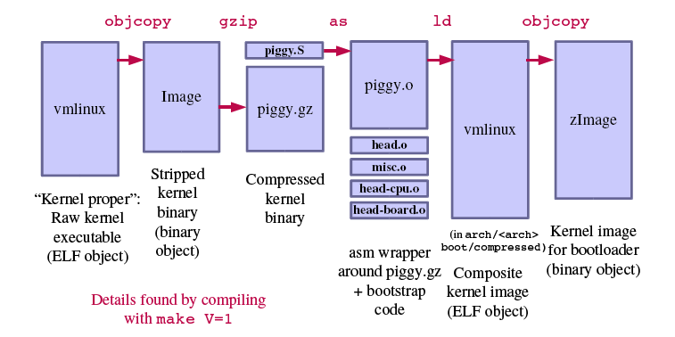
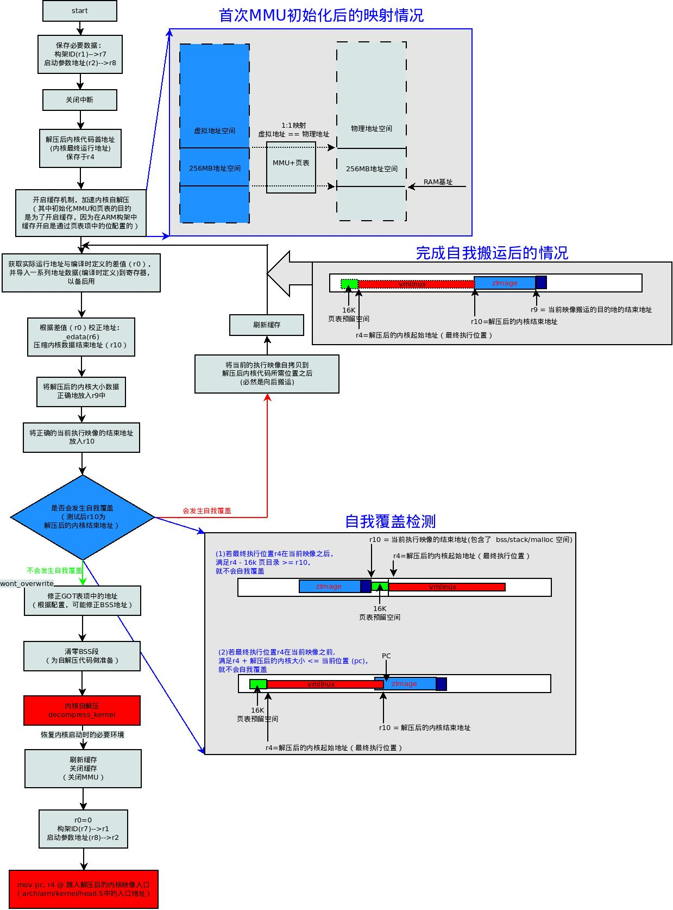
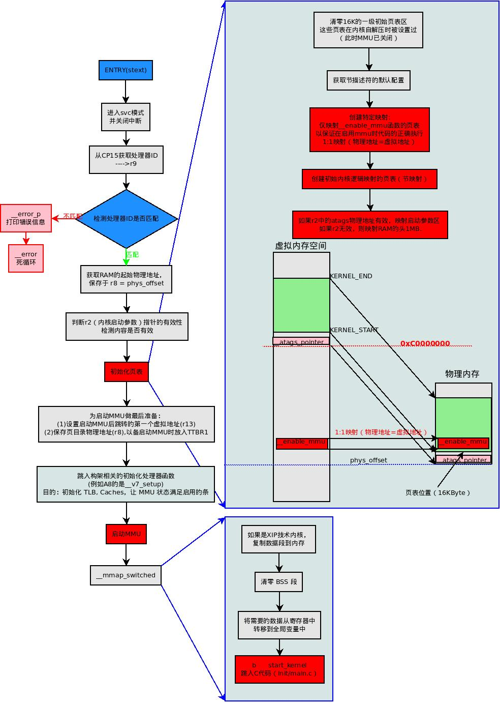

## linux初始化过程

###  修订记录
| 修订说明 | 日期 | 作者 | 额外说明 |
| --- |
| 初版 | 2018/04/10 | 员清观 |  |

## 0 kernel生成

| 组件 | 描述 |
| --- |
| vmlinux: | 严格意义上的内核，采用ELF格式，包括符号、注释、调试信息（如果采用-g选项编译）和通用体系结构组件, 依据arch/arm/kernel/vmlinux.lds生成 |
| System.map: | 描述vmlinux模块的内核符号表，基于文本格式 |
| Image     | 二进制内核模块，去掉了符号、标记、注释, vmlinux经过objcopy产生 |
| head.o    | 汇编自head.S，针对ARM类处理器的启动代码，就是通过这个目标文件，引导装入程序取得了控制权 |
| piggy.gz  | 采用gzip压缩的Image文件, Image经过gzip等压缩得到 |
| piggy.o   | piggy.gz文件的汇编格式，可以被后面的misc.o文件所链接 |
| misc.o    | 用于解压缩内核映像（piggy.gz）的程序，大家所熟悉的在某些体系结构上的启动信息“Uncompressing Linux … Done”就来源于该文件 |
| big-endian.o  | 一个小的汇编程序，可以将处理器转换为对大端字节序模式（big-endian mode）的支持 |
| vmlinux(2) | 名称混淆了，这里这个是head+piggy+misc |
| uImage/zImage    | vmlinux(2)的压缩，最终的合成映像文件，可以被引导装入程序引导，在下文中会具体介绍 |

参考文档： http://blog.chinaunix.net/uid-20543672-id-3018947.html

**内核生成基本过程:**<br>
- 1.依据arch/arm/kernel/vmlinux.lds 生成linux内核源码根目录下的vmlinux，这个vmlinux属于未压缩，带调试信息、符号表的最初的内核，大小约23MB；
`arm-linux-gnu-ld -EL  -p --no-undefined -X -o vmlinux -T arch/arm/kernel/vmlinux.lds`
- 2.将上面的vmlinux去除调试信息、注释、符号表等内容，生成arch/arm/boot/Image，这是不带多余信息的linux内核，Image的大小约3.2MB；
`arm-linux-gnu-objcopy -O binary -R .note -R .comment -S  vmlinux arch/arm/boot/Image`
- 3.将 arch/arm/boot/Image 用gzip -9 压缩生成arch/arm/boot/compressed/piggy.gz大小约1.5MB；
`gzip -f -9 < arch/arm/boot/compressed/../Image > arch/arm/boot/compressed/piggy.gz`
- 4.编译arch/arm/boot/compressed/piggy.S 生成arch/arm/boot/compressed/piggy.o大小约1.5MB，这里实际上是将piggy.gz通过piggy.S编译进piggy.o文件中。而piggy.S文件仅有6行，只是包含了文件piggy.gz;
`arm-linux-gnu-gcc -Wp,-MD,arch/arm/boot/compressed/.piggy.o.d  -nostdinc -isystem /home/justin/crosstool/gcc-3.4.5-glibc-2.3.6/arm-linux-gnu/lib/gcc/arm-linux-gnu/3.4.5/include -D__KERNEL__ -Iinclude  -mlittle-endian -D__ASSEMBLY__ -Wa,-L -gdwarf-2 -mapcs-32 -mno-thumb-interwork -D__LINUX_ARM_ARCH__=4 -march=armv4 -mtune=arm9tdmi -msoft-float    -c -o arch/arm/boot/compressed/piggy.o arch/arm/boot/compressed/piggy.S`
- 5.依据arch/arm/boot/compressed/vmlinux.lds 将arch/arm/boot/compressed/目录下的文件head.o 、piggy.o 、misc.o链接生成 arch/arm/boot/compressed/vmlinux，这个vmlinux是经过压缩且含有自解压代码的内核,大小约1.5MB;
`arm-linux-gnu-ld -EL   --defsym zreladdr=0x30008000 --defsym params_phys=0x30000100 -p --no-undefined -X` /home/justin/crosstool/gcc-3.4.5-glibc-2.3.6/arm-linux-gnu/lib/gcc/arm-linux-gnu/3.4.5/libgcc.a -T arch/arm/boot/compressed/vmlinux.lds arch/arm/boot/compressed/head.o arch/arm/boot/compressed/piggy.o arch/arm/boot/compressed/misc.o -o arch/arm/boot/compressed/vmlinux
- 6.将arch/arm/boot/compressed/vmlinux去除调试信息、注释、符号表等内容，生成arch/arm/boot/zImage大小约1.5MB;这已经是一个可以使用的linux内核映像文件了；
`arm-linux-gnu-objcopy -O binary -R .note -R .comment -S  arch/arm/boot/compressed/vmlinux arch/arm/boot/zImage`
- 7.将arch/arm/boot/zImage 添加64Bytes的相关信息打包为arch/arm/boot/uImage大小约1.5MB;
`/bin/sh /home/farsight/Resources/kernel/linux-2.6.14/scripts/mkuboot.sh -A arm -O linux -T kernel -C none -a 0x30008000 -e 0x30008000 -n 'Linux-2.6.14' -d arch/arm/boot/zImage arch/arm`




## 1 启动过程
启动过程中需要注意以下几点, 其他的部分都是对内核各个组件的数据结构申请内存，并初始化：
- 内核启动参数的获取和处理
- setup_arch(&command_line);函数
- 内存管理的初始化（从bootmem到slab）
- rest_init();函数

### 1.1 zImage自解压过程
  http://blog.chinaunix.net/uid-20543672-id-3018233.html

CPU在bootloader的帮助下将内核载入到了内存中，并开始执行。当然，bootloader必须为zImage做好必要的准备：
- CPU 寄存器的设置：	R0＝0；R1＝Machine ID(即Machine Type Number，定义在linux/arch/arm/tools/mach-types)；R2＝内核启动参数在 RAM 中起始基地址；
- CPU 模式：	必须禁止中断（IRQs和FIQs）；CPU 必须 SVC 模式；
- Cache 和 MMU 的设置：	MMU 必须关闭； 指令 Cache 可以打开也可以关闭； 数据 Cache 必须关闭；

知道内核zImage生成的朋友一定知道：真正的内核执行映像其实是在编译时生成arch/$(ARCH)/boot/文件夹中的Image文件（bin文件），而zImage其实是将这个可执行文件作为数据段包含在了自身中，而zImage的代码功能就是将这个数据（Image）正确地解压到编译时确定的位置中去，并跳到Image中运行。所以实现bootloader引导的压缩映像zImage的入口是由arch/arm /boot/compressed/vmlinux.lds决定的（这个文件是由vmlinux.lds.in生成的）。所以从vmlinux.lds.in中可以看出压缩映像的入口 ENTRY(_start) ，然后我们可以在arch/arm/boot/compressed/head.S找到这个start入口，这样就可以从这里开始用代码分析的方法研究bootloader跳转到压缩内核映像后的自解压启动过程：



### 1.2 汇编部分初始化流程
  http://blog.chinaunix.net/uid-20543672-id-3019565.html

在完成了zImage自解压之后，就跳转到了解压后的内核（也就是vmlinux的bin版本Image），具体的入口可以在arch/arm/kernel/vmlinux.lds.S（最终的链接脚本是通过这个文件产生的）中获得 ENTRY(stext) ,这个入口在arch/arm/kernel/head.S中，这个文件就是Linux内核真正启动的地方，是初始化部分的开始，用汇编写成。他必须为后面的C代码做好准备，一直到最后调用 `start_kernel()`函数。下面先给出程序的流程图. 这之前有一些宏定义必须知道他的含义：
- KERNEL_RAM_ADDR  arch/arm/kernel/head.S   0xC0008000  内核在内存中的虚拟地址
- PAGE_OFFSET   arch/arm/include/asm/memory.h  0xC0000000 内核虚拟地址空间的起始地址
- TEXT_OFFSET   arch/arm/Makefile 0x00008000  内核起始位置相对于内存起始位置的偏移
- PHYS_OFFSET   arch/arm/include/asm/memory.h  构架相关, 物理内存的起始地址



### 1.3 start_kernel主体

见linux内存管理文档，内存初始化主流程章节

### 1.4 setup_arch
主要工作是cpu和内存的初始化。它调用的函数中，需重点专注`paging_init()`
```cpp
struct obs_kernel_param {
	const char *str;
	int (*setup_func)(char *);
	int early;
};

void __init setup_arch(char **cmdline_p)
  setup_processor(); //再次检测处理器类型，并初始化处理器相关的底层变量。内核启动时的处理器信息（包括cache）就是通过这个函数打印的，例如： CPU: ARMv7 Processor [410fc051] revision 1 (ARMv7), cr=50c53c7d      CPU: PIPT / VIPT nonaliasing data cache, VIPT aliasing instruction cache
	struct machine_desc * mdesc = setup_machine_fdt(__atags_pointer); //此为设备描述结构体，对于任何板子都定义了这样的一个结构体
	if (!mdesc)  mdesc = setup_machine_tags(__atags_pointer, __machine_arch_type); //在此处通过bootloader传递过来的设备ID来匹配一个 struct machine_desc 结构体（这个结构体就是在arch/arm/mach-*/mach-*.c中定义的结构体：MACHINE_START～MACHINE_END ）如果没有匹配上就死循环。如果匹配上了就打印机器名如 'Machine: iMAPx15' ，并处理bootloader传递过来的tagged_list，将所有的tag信息保存到相应的全局变量或结构体中。
	machine_desc = mdesc;  machine_name = mdesc->name;
	setup_dma_zone(mdesc);
	if (mdesc->restart_mode) 	reboot_setup(&mdesc->restart_mode);// 通过struct machine_desc 中的soft_reboot数据来设置重启类型： 如果存在就为“s”：softreset；如果不存在就为“h”：hardreset

	init_mm.start_code = (unsigned long) _text;   	init_mm.end_code   = (unsigned long) _etext;
	init_mm.end_data   = (unsigned long) _edata;   	init_mm.brk	   = (unsigned long) _end; //这里通过连接脚本中得到的Linux代码位置数据来初始化一个mm_struct结构体init_mm中的部分数据  ps：每一个任务都有一个mm_struct结构以管理内存空间，init_mm是内核自身的mm_struct

	strlcpy(cmd_line, boot_command_line, COMMAND_LINE_SIZE);	*cmdline_p = cmd_line;//同时填充cmd_line以备后用, 保护boot_command_line数据
	parse_early_param();//处理在 struct obs_kernel_param 中定义为early的启动参数（主要是内存配置部分的参数）

	sort(&meminfo.bank, meminfo.nr_banks, sizeof(meminfo.bank[0]), meminfo_cmp, NULL);
	sanity_check_meminfo();//在此处设置struct meminfo meminfo中每个bank中的highmem变量，通过vmalloc_min确定每个bank中的内存是否属于高端内存
	arm_memblock_init(&meminfo, mdesc);//    在此处按地址数据从小到大排序meminfo中的数据，并初始化全局的memblock数据。
	paging_init(mdesc);//设置内核的参考页表。此页表不仅用于物理内存映射，还用于管理vmalloc区。此函数中非常重要的一点就是初始化了bootmem分配器！
	request_standard_resources(mdesc);//    通过获取设备描述结构体（struct machine_desc）中的数据和编译时产生的地址数据，初始化内存相关的全局结构体变量。
	if (mdesc->restart) 		arm_pm_restart = mdesc->restart;
	unflatten_device_tree();//    通过启动参数中的“非平坦设备树”信息(如果有),获取内存相关信息
	arm_dt_init_cpu_maps();//
	if (!is_smp())
		hyp_mode_check();

	reserve_crashkernel();
	handle_arch_irq = mdesc->handle_irq;

	if (mdesc->init_early)
		mdesc->init_early();
```
### 1.5 rest_init
rest_init函数的主要使命就是创建并启动内核线程init

```cpp
static __initdata DECLARE_COMPLETION(kthreadd_done);//定义一个complete变量来告诉init线程：kthreads线程已经创建完成。
static noinline void __init_refok rest_init(void)
  rcu_scheduler_starting();//内核RCU锁机制调度启动
  kernel_thread(kernel_init, NULL, CLONE_FS | CLONE_SIGHAND);//1号线程。我们必须先创建init内核线程，这样它就可以获得pid为1。尽管如此init线程将会挂起来等待创建kthreads线程。如果我们在创建kthreadd线程前调度它，就将会出现OOPS
	numa_default_policy();//    设定NUMA系统的内存访问策略为默认
	pid = kernel_thread(kthreadd, NULL, CLONE_FS | CLONE_FILES);//2号线程。创建kthreadd内核线程，它的作用是管理和调度其它内核线程。它循环运行一个叫做kthreadd的函数，该函数的作用是运行kthread_create_list全局链表中维护的内核线程。调用kthread_create创建一个kthread，它会被加入到kthread_create_list 链表中；被执行过的kthread会从kthread_create_list链表中删除； 且kthreadd会不断调用scheduler函数让出CPU。此线程不可关闭。
	rcu_read_lock(); 	kthreadd_task = find_task_by_pid_ns(pid, &init_pid_ns); 	rcu_read_unlock();	complete(&kthreadd_done);//    获取kthreadd的线程信息，获取完成说明kthreadd已经创建成功。并通过一个complete变量（kthreadd_done）来通知kernel_init线程。
  init_idle_bootup_task(current);//    设置当前进程为idle（闲置）进程类。
	schedule_preempt_disabled();/* Call into cpu_idle with preempt disabled */
	|--> cpu_startup_entry(CPUHP_ONLINE);//void cpu_startup_entry(enum cpuhp_state state)
    current_set_polling();
  	arch_cpu_idle_prepare();
  	cpu_idle_loop();//    此时内核本体进入了idle状态，用循环消耗空闲的CPU时间片，该函数从不返回。在有其他进程需要工作的时候，该函数就会被抢占！这个函数因构架不同而异。

int __ref kernel_init(void *unused)
  |--> kernel_init_freeable();
  	wait_for_completion(&kthreadd_done); //Wait until kthreadd is all set-up. Now the scheduler is fully set up and can do blocking allocations
  	gfp_allowed_mask = __GFP_BITS_MASK;
  	set_mems_allowed(node_states[N_MEMORY]); //init can allocate pages on any node
  	set_cpus_allowed_ptr(current, cpu_all_mask);//init can run on any cpu. 增加当前进程的CPU亲和力，使所有的CPU（如果是SMP）都可以运行本线程。线程可以被迁移到被设置掩码的CPU上运行，但如果在位掩码中删除该CPU位，此线程就不会在那个CPU上运行。
  	cad_pid = task_pid(current);//cad_pid为接收Ctrl-alt-del操作的INT信号的进程ID，此处很明显是设为了init的PID
  	smp_prepare_cpus(setup_max_cpus);  	do_pre_smp_initcalls();  	lockup_detector_init();  	smp_init();  	sched_init_smp();//    以上代码是在SMP系统做准备，激活所有CPU，并开始SMP系统的调度。
    do_basic_setup();
  	/* Open the /dev/console on the rootfs, this should never fail */
  	if (sys_open((const char __user *) "/dev/console", O_RDWR, 0) < 0)//打开根文件系统中的 /dev/console , 此处不可失败.这是kernel_init（以后的init进程）打开的第一个文件，它也就成为了标准输入。这里需要打开 /dev/console，如果没有这个节点，系统就出错。这个错误信息也是经常碰到的。可能的原因是：1、制作文件系统的时候忘记创建/dev/console节点 2、文件系统挂载问题，挂载上的文件系统不是什么都没有，就是挂错了节点。
  		pr_err("Warning: unable to open an initial console.\n");
  	(void) sys_dup(0);  	(void) sys_dup(0);// 复制两次标准输入（0）的文件描述符（它是上面打开的/dev/console，也就是系统控制台）： 一个作为标准输出（1）一个作为标准出错（2）现在标准输入、标准输出、标准出错都是/dev/console了。 这个console在内核启动参数中可以配置为某个串口（ttySn、ttyOn等等），也可以是虚拟控制台（tty0）。所以我们就在串口或者显示器上看到了之后的系统登录提示。
  	if (!ramdisk_execute_command)
  		ramdisk_execute_command = "/init"; //检查是否有早期用户空间的init程序。如果有，让其执行
  	if (sys_access((const char __user *) ramdisk_execute_command, 0) != 0) {
  		ramdisk_execute_command = NULL;
  		prepare_namespace();
  	}
  	load_default_modules();
	async_synchronize_full(); //在释放内存前，必须完成所有的异步 __init 代码
	free_initmem();//释放所有init.* 段中的内存。
	mark_rodata_ro(); //通过修改页表，保证只读数据段为只读属性。大部分构架为空函数
	system_state = SYSTEM_RUNNING;//设置系统状态为运行状态
	// numa_default_policy();/    设定NUMA系统的内存访问策略为默认
	flush_delayed_fput();

	if (ramdisk_execute_command) {
		if (!run_init_process(ramdisk_execute_command))
			return 0;
		pr_err("Failed to execute %s\n", ramdisk_execute_command);
	}//    如果ramdisk_execute_command有指定的init程序，就执行它。
  if (execute_command) {
		if (!run_init_process(execute_command))
			return 0;
		pr_err("Failed to execute %s.  Attempting defaults...\n",
			execute_command);
	}//
	if (!run_init_process("/sbin/init") ||
	    !run_init_process("/etc/init") ||
	    !run_init_process("/bin/init") ||
	    !run_init_process("/bin/sh"))
		return 0;
  //在检查完ramdisk_execute_command和execute_command为空的情况下，顺序执行以下初始化程序：如果都没有找到就打印错误信息。这也是我们做系统移植的时候经常碰到的错误信息，出现这个信息很有可能是：1、你的启动参数配置有问题，通过 指定了init程序，但是没有找到，且默认的那四个程序也不在文件系统中。 2、文件系统挂载有问题，文件不存在 3、init程序没有执行权限
```

### 1.6 do_basic_setup
do_basic_setup函数主要是初始化设备驱动，完成其他驱动程序（直接编译进内核的模块）的初始化。内核中大部分的启动数据输出（都是各设备的驱动模块输出）都是这里产生的。
```cpp
static initcall_t *initcall_levels[] __initdata = {
	__initcall0_start,	__initcall1_start,	__initcall2_start,	__initcall3_start,	__initcall4_start,
	__initcall5_start,	__initcall6_start,	__initcall7_start,	__initcall_end,
};

void __init do_basic_setup(void)
  cpuset_init_smp(); //非SMP，此函数为空; 暂时不理会
	usermodehelper_init();//创建一个单线程工作队列khelper。运行的系统中只有一个，主要作用是指定用户空间的程序路径和环境变量, 最终运行指定的user space的程序，属于关键线程，不能关闭。
	shmem_init();
	|--> driver_init();//初始化驱动模型中的各子系统，可见的现象是在/sys中出现的目录和文件
    	devtmpfs_init();//初始化devtmpfs文件系统，驱动核心设备将在这个文件系统中添加它们的设备节点。 这个文件系统可以由内核在挂载根文件系统之后自动挂载到/dev下，也可以在文件系统的启动脚本中手动挂载
    	devices_init();//    初始化驱动模型中的部分子系统和kobject： devices   dev   dev/block   dev/char
    	buses_init();//    初始化驱动模型中的bus子系统
    	classes_init();//    初始化驱动模型中的class子系统
    	firmware_init();//    初始化驱动模型中的firmware子系统
    	hypervisor_init();//    初始化驱动模型中的hypervisor子系统
      platform_bus_init();//    初始化驱动模型中的bus/platform子系统
      cpu_dev_init();//初始化驱动模型中的devices/system/cpu子系统
      memory_dev_init();//实际未配置的话为空。初始化驱动模型中的devices/system/memory子系统
	init_irq_proc();//在proc文件系统中创建irq目录，并在其中初始化系统中所有中断对应的目录
	do_ctors();//调用链接到内核中的所有构造函数，也就是链接进.ctors段中的所有函数
	usermodehelper_enable();//
	|--> do_initcalls();//调用所有编译内核的驱动模块中的初始化函数。这里就是驱动程序员需要关心的步骤，其中按照各个内核模块初始化函数所自定义的启动级别（1～7），按顺序调用器初始化函数。对于同一级别的初始化函数，安装编译是链接的顺序调用，也就是和内核Makefile的编写有关。在编写内核模块的时候需要知道这方面的知识，比如你编写的模块使用的是I2C的API，那你的模块的初始化函数的级别必须低于I2C子系统初始化函数的级别（也就是级别数（1~7）要大于I2C子系统）。如果编写的模块必须和依赖的模块在同一级，那就必须注意内核Makefile的修改了
    |--> for (level = 0; level < ARRAY_SIZE(initcall_levels) - 1; level++)		do_initcall_level(level);//void __init do_initcall_level(int level)
      extern const struct kernel_param __start___param[], __stop___param[];      initcall_t *fn;
      strcpy(static_command_line, saved_command_line);
      parse_args(initcall_level_names[level], static_command_line, __start___param, __stop___param - __start___param, level, level, &repair_env_string);
      for (fn = initcall_levels[level]; fn < initcall_levels[level+1]; fn++)		  do_one_initcall(*fn);
```

## 2 启动过程加速优化

**linux开机启动优化补丁**<br>
`patch -p1 < patches/time_analyze.patch`

跟踪 module_init() 调用方式
```cpp
kernel/include/init.h中
    typedef int (*initcall_t)(void);
    typedef void (*exitcall_t)(void);

    #define __define_initcall(fn, id) \
    static initcall_t __initcall_##fn##id __used \
    __attribute__((__section__(".initcall" #id ".init"))) = fn

//“##”符号可以是连接的意思,例如 __initcall_##fn##id 为__initcall_fnid, 那么，fn = test_init，id = 6时，__initcall_##fn##id 为 __initcall_test_init6
//“#”符号可以是字符串化的意思,例如 #id 为 “id”，id=6 时，#id 为“6”
//__used
//__attribute__
//__section__

那么module_init(test_init) 可以解析为：
    static initcall_t __initcall_test6 __used __attribute__((__section__(".initcall""6" ".init"))) =test_init
通过__attribute__（__section__）设置函数属性，也就是将test_init放在.initcall6.init段中

arch/arm/kernel/vmlinux.lds这个链接脚本中
    /* Early initcalls run before initializing SMP.Only for built-in code, not modules. */
    #define early_initcall(fn)		__define_initcall(fn, early)

    #define pure_initcall(fn)		__define_initcall(fn, 0)
    #define core_initcall(fn)		__define_initcall(fn, 1)
    #define core_initcall_sync(fn)		__define_initcall(fn, 1s)
    #define postcore_initcall(fn)		__define_initcall(fn, 2)
    #define postcore_initcall_sync(fn)	__define_initcall(fn, 2s)
    #define arch_initcall(fn)		__define_initcall(fn, 3)
    #define arch_initcall_sync(fn)		__define_initcall(fn, 3s)
    #define subsys_initcall(fn)		__define_initcall(fn, 4)
    #define subsys_initcall_sync(fn)	__define_initcall(fn, 4s)
    #define fs_initcall(fn)			__define_initcall(fn, 5)
    #define fs_initcall_sync(fn)		__define_initcall(fn, 5s)
    #define rootfs_initcall(fn)		__define_initcall(fn, rootfs)
    #define device_initcall(fn)		__define_initcall(fn, 6)
    #define device_initcall_sync(fn)	__define_initcall(fn, 6s)
    #define late_initcall(fn)		__define_initcall(fn, 7)
    #define late_initcall_sync(fn)		__define_initcall(fn, 7s)

    #define device_initcall(fn)		__define_initcall(fn, 6)
    #define __initcall(fn) device_initcall(fn)
    #define module_init(x)	__initcall(x);

    module_init(fn)---> __initcall(fn) ---> device_initcall(fn) ---> __define_initcall(fn, 6)
kernel/init/main.c中
    static void __init do_initcall_level(int level)
    {
        extern const struct kernel_param __start___param[], __stop___param[];
        initcall_t *fn;
        int t, _t;

        strcpy(static_command_line, saved_command_line);
        parse_args(initcall_level_names[level],
               static_command_line, __start___param,
               __stop___param - __start___param,
               level, level,
               &repair_env_string);

        f0r (fn = initcall_levels[level]; fn < initcall_levels[level+1]; fn++) {
            _t = __getms();
            do_one_initcall(*fn);
            if((t = __getms() - _t) > 0)
                printk(KERN_ALERT "%pf: %dms\n", *fn, t);
        }
    }
    static void __init do_initcalls(void)
    {
        int level;
        f0r (level = 0; level < ARRAY_SIZE(initcall_levels) - 1; level++)
            do_initcall_level(level);
    }
```
**kernel初始化过程解析**
```cpp
asmlinkage void __init start_kernel(void)
    从 lockdep_init(); 到 ftrace_init(); // 基本的初始化，没有打印出来时间。
    rest_init();
        rcu_scheduler_starting();
        kernel_thread(kernel_init, NULL, CLONE_FS | CLONE_SIGHAND);
            kernel_init_freeable();
                从wait_for_completion(&kthreadd_done);到sched_init_smp();
                do_basic_setup();
                    从cpuset_init_smp();到usermodehelper_enable();
                    do_initcalls();
                从sys_open((const char __user *) "/dev/console", O_RDWR, 0)到load_default_modules();
            从...到run_init_process()，启动脚本，比如/etc/init中的脚本，未打印时间。
        cpu_startup_entry(CPUHP_ONLINE);
```

## 3.1 启动过程中参数处理
**Linux内核启动参数**<br>
  https://www.cnblogs.com/shengs/p/4608441.html

```cpp
//start_kernel()函数中参数解析的部分
void __init start_kernel(void)
  setup_arch(&command_line);
  setup_command_line(command_line);
  parse_early_param();
	parse_args("Booting kernel", static_command_line, __start___param, __stop___param - __start___param, -1, -1, &unknown_bootoption);
```


## 3

## 4

## 5
### 5.1

## 6
