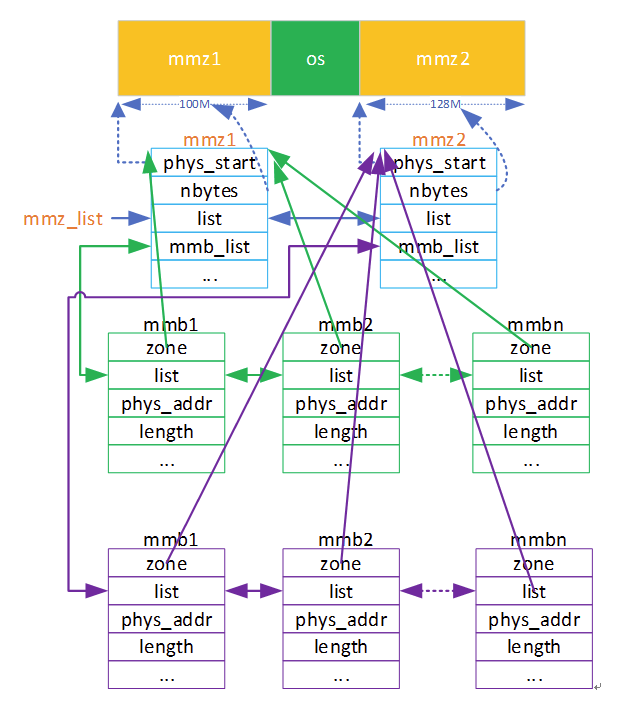
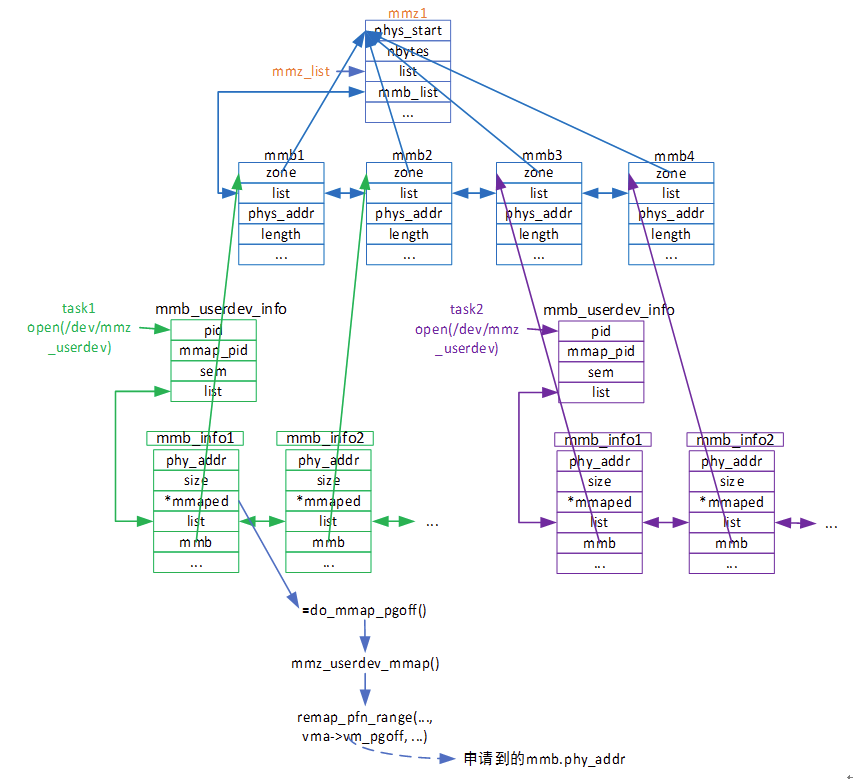

## HISI MMZ

###  修订记录
| 修订说明 | 日期 | 作者 | 额外说明 |
| --- |
| 初版 | 2020/04/07 | 员清观 |  |

## 1. 平台相关改动

## 2.

### 2.0 模块架构




```cpp
struct mmz_allocator { //操作函数集合
    int (*init)(char *args);
    hil_mmb_t *(*mmb_alloc)(const char *name, size, align, gfp, mmz_name, _user_mmz);
    hil_mmb_t *(*mmb_alloc_v2)(const char *name, size, align, gfp, mmz_name, _user_mmz, order);
    void *(*mmb_map2kern)(hil_mmb_t *mmb, int cached);
    int (*mmb_unmap)(hil_mmb_t *mmb); void (*mmb_free)(hil_mmb_t *mmb);
    void *(*mmf_map)(phys_addr_t phys, int len, int cache);  void (*mmf_unmap)(void *virt);
};
struct hil_media_memory_block { //基本的mmb数据结构体
    char name[HIL_MMB_NAME_LEN];
    struct hil_media_memory_zone *zone;
    struct osal_list_head list;
    void *kvirt;
    unsigned long phys_addr, length, flags;
    unsigned int order;
    int phy_ref, map_ref;
};
typedef struct hil_media_memory_block hil_mmb_t;

static struct mmz_allocator the_allocator;
OSAL_LIST_HEAD(mmz_list);
OSAL_LIST_HEAD(map_mmz_list);
static DEFINE_SEMAPHORE(mmz_lock);
static char __initdata mmap_zones[MMZ_SETUP_CMDLINE_LEN] = '\0';

int __init osal_init(void)
  osal_device_init(); //-->spin_lock_init(&f_lock);
  osal_proc_init();  himedia_init();
  |--> media_mem_init();
    |--> cma_allocator_setopt(&the_allocator);
      allocator->init = __allocator_init;
      |--> allocator->mmb_alloc = __mmb_alloc;
        page = dma_alloc_from_contiguous(mmz->cma_dev, count, order);
        mmb = kmalloc(sizeof(hil_mmb_t), GFP_KERNEL); //为cma内存块封装一下,按地址序添加到zone的mmb_list链表中
        mmb->zone = mmz;  mmb->phys_addr = page_to_phys(page);   mmb->length = size; do_mmb_alloc(mmb); return mmb;
      allocator->mmb_alloc_v2 = __mmb_alloc_v2; //
      allocator->mmb_map2kern = __mmb_map2kern;
      allocator->mmb_unmap = __mmb_unmap;
      |--> allocator->mmb_free = __mmb_free;
        dma_release_from_contiguous(mmz->cma_dev, page, count); osal_list_del(&mmb->list); kfree(mmb);
      allocator->mmf_map = __mmf_map;
      allocator->mmf_unmap = __mmf_unmap;
    |--> the_allocator.init(setup_zones); //可以注册多个zone,这里只列出一个
      |--> zone = hil_mmz_create("null", 0, 0, 0);
        hil_mmz_t *p = kmalloc(sizeof(hil_mmz_t) + 1, GFP_KERNEL);
        p->phys_start = phys_start;  p->nbytes = nbytes; OSAL_INIT_LIST_HEAD(&p->list); OSAL_INIT_LIST_HEAD(&p->mmb_list);
    p->destructor = kfree;
      zone->phys_start = cma_zone->phys_start; zone->nbytes = cma_zone->nbytes;
      zone->alloc_type = cma_zone->alloc_type; zone->block_align = cma_zone->block_align;
      |--> hil_mmz_register(zone);
        down(&mmz_lock); OSAL_INIT_LIST_HEAD(&zone->mmb_list); osal_list_add(&zone->list, &mmz_list); up(&mmz_lock);
    media_mem_proc_init(); //--> proc_create(MEDIA_MEM_NAME, 0, MMZ_PROC_ROOT, &mmz_proc_ops);
    mmz_userdev_init(); //--> misc_register(&mmz_userdev);
    map_mmz_init(mmap_zones);
```

### 2.1 mmz-userdev.c
当应用打开设备文件/dev/mmz_userdev时会申请一个属于该进程的mmb_userdev_info结构体，mmb_userdev_info成员list指向属于该进程的所有mmb_info，mmb_info的mmb成员指向为其分配的mmb，而*mmaped存放mmb物理内存（phy_addr）进行映射后的虚拟地址供用户空间使用。



一般来讲,一个进程open一个就够了吧,为了mmap的目的. 对应下层一个`struct mmz_userdev_info`,其链表上挂载多个`struct mmb_info`

```cpp
struct mmz_userdev_info {
    pid_t pid, mmap_pid;
    struct semaphore sem;  struct osal_list_head list;
};
struct mmb_info {
    __phys_addr_type__ phys_addr; /* phys-memory address */
    __phys_addr_type__ __phys_addr_align__ align; /* if you need your phys-memory have special align size */
    __phys_len_type__ __phys_addr_align__ size; /* length of memory you need, in bytes */
    unsigned int __phys_addr_align__ order;
    void *__phys_addr_align__ mapped; /* userspace mapped ptr */
    union {
        struct { unsigned long prot:8, flags:12, delayed_free:1, map_cached:1, reserved:8; };
        unsigned long w32_stuf;
    } __phys_addr_align__;
    char mmb_name[HIL_MMB_NAME_LEN], mmz_name[HIL_MMZ_NAME_LEN];
    unsigned long __phys_addr_align__ gfp; /* reserved, do set to 0 */
    int map_ref, mmb_ref;
    struct osal_list_head list;
    hil_mmb_t *mmb;
} __attribute__((aligned(8)));

static struct file_operations mmz_userdev_fops = {
  .owner = THIS_MODULE,    .open = mmz_userdev_open,   .release = mmz_userdev_release,
  .unlocked_ioctl = mmz_userdev_ioctl,    .mmap = mmz_userdev_mmap,};
static struct miscdevice mmz_userdev = {
  .minor = MISC_DYNAMIC_MINOR,    .fops = &mmz_userdev_fops,    .name = "mmz_userdev" };

int mmz_userdev_open(struct inode *inode, struct file *file)
  struct mmz_userdev_info *pmu = kmalloc(sizeof(*pmu), GFP_KERNEL);
  pmu->pid = current->pid;   pmu->mmap_pid = 0;   sema_init(&pmu->sem, 1); //实际为互斥量
  OSAL_INIT_LIST_HEAD(&pmu->list);  file->private_data = (void *)pmu;

long mmz_userdev_ioctl(struct file *file, unsigned int cmd, unsigned long arg)
  struct mmz_userdev_info *pmu = file->private_data; struct mmb_info mi = { 0 };
  //if (_IOC_TYPE(cmd) == 'm')
  copy_from_user(&mi, (void *)(uintptr_t)arg, _IOC_SIZE(cmd));
  |-->mmz_userdev_ioctl_m(file, cmd, &mi);
    |--> case _IOC_NR(IOC_MMB_ALLOC):        ret = ioctl_mmb_alloc(file, cmd, pmi);
      mmb = hil_mmb_alloc(pmi->mmb_name, pmi->size, pmi->align, pmi->gfp, pmi->mmz_name);//从mmz申请一个块
      new_mmbinfo = kmalloc(sizeof(*new_mmbinfo), GFP_KERNEL);  memcpy(new_mmbinfo, pmi, sizeof(*new_mmbinfo));
      new_mmbinfo->phys_addr = hil_mmb_phys(mmb); new_mmbinfo->mmb = mmb; //包装之后,添加到usr的链表中
      osal_list_add_tail(&new_mmbinfo->list, &pmu->list);  pmi->phys_addr = new_mmbinfo->phys_addr;  hil_mmb_get(mmb);
    case _IOC_NR(IOC_MMB_ALLOC_V2):     ret = ioctl_mmb_alloc_v2(file, cmd, pmi);
    case _IOC_NR(IOC_MMB_ATTR):         ret = ioctl_mmb_attr(file, cmd, pmi);
    case _IOC_NR(IOC_MMB_FREE):         ret = ioctl_mmb_free(file, cmd, pmi);
    case _IOC_NR(IOC_MMB_USER_REMAP):   ret = ioctl_mmb_user_remap(file, cmd, pmi, 0);
    case _IOC_NR(IOC_MMB_USER_REMAP_CACHED):          ret = ioctl_mmb_user_remap(file, cmd, pmi, 1);
    case _IOC_NR(IOC_MMB_USER_UNMAP):   ret = ioctl_mmb_user_unmap(file, cmd, pmi);
    case _IOC_NR(IOC_MMB_VIRT_GET_PHYS):ret = ioctl_mmb_virt2phys(file, cmd, pmi);
  copy_to_user((void *)(uintptr_t)arg, &mi, _IOC_SIZE(cmd));
  //if (_IOC_TYPE(cmd) == 'r')
    struct mmb_info *pmi = get_mmbinfo_safe(arg, pmu)); //-->return p = get_mmbinfo(addr, pmu); 根据地址找到对应的mmb
    |--> mmz_userdev_ioctl_r(file, cmd, pmi);
      case _IOC_NR(IOC_MMB_ADD_REF):      pmi->mmb_ref++; hil_mmb_get(pmi->mmb); //--> ref = ++mmb->phy_ref;
      case _IOC_NR(IOC_MMB_DEC_REF):      pmi->mmb_ref--; hil_mmb_put(pmi->mmb); //--> ref = --mmb->phy_ref;并尝试释放这个mmb
        |--> if (pmi->delayed_free && (pmi->mmb_ref == 0) && (pmi->map_ref == 0)) _usrdev_mmb_free(pmi);
          osal_list_del(&p->list); hil_mmb_put(p->mmb);  ret = hil_mmb_free(p->mmb); kfree(p);
  //if (_IOC_TYPE(cmd) == 'c')
    pmi = get_mmbinfo_safe(arg, pmu);
    case _IOC_NR(IOC_MMB_FLUSH_DCACHE): mmz_flush_dcache_mmb(pmi);
  //if (_IOC_TYPE(cmd) == 'd')
    copy_from_user(&area, (void *)(uintptr_t)arg, _IOC_SIZE(cmd));
    mmb = hil_mmb_getby_phys_2(area.dirty_phys_start, &offset);
    pmi = get_mmbinfo_safe(mmb->phys_addr, pmu);
    orig_addr = area.dirty_phys_start;  area.dirty_phys_start &= ~(CACHE_LINE_SIZE - 1);
    virt_addr = (unsigned long)(uintptr_t)area.dirty_virt_start;  virt_addr &= ~(CACHE_LINE_SIZE - 1);
    area.dirty_virt_start = (void *)(uintptr_t)virt_addr;
    area.dirty_size = (area.dirty_size + (orig_addr - area.dirty_phys_start) + (CACHE_LINE_SIZE - 1)) & ~(CACHE_LINE_SIZE - 1);
    mmz_flush_dcache_mmb_dirty(&area);
  //if (_IOC_TYPE(cmd) == 't')
    copy_from_user(&mi, (void *)(uintptr_t)arg, sizeof(mi))
    get_mmbinfo_safe(mi.phys_addr, pmu);
    mmz_userdev_ioctl_t(file, cmd, &mi);
```

## 3
