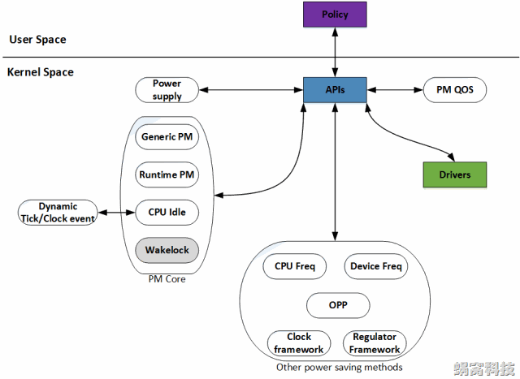
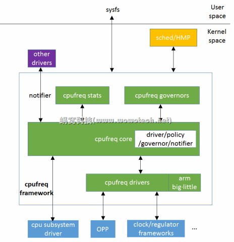
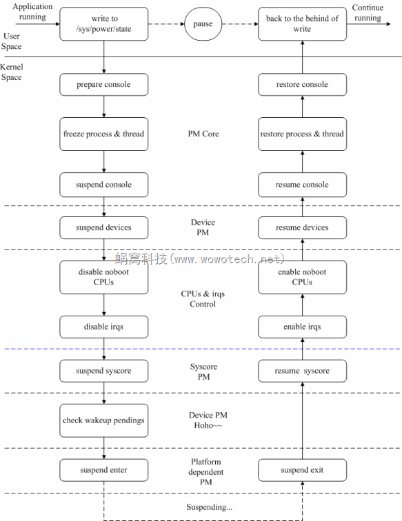
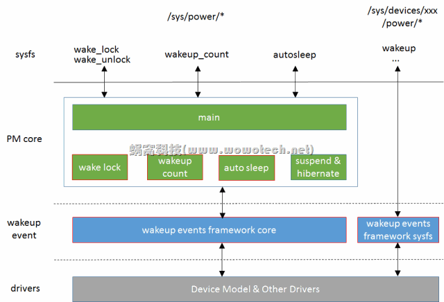

## cpu电源管理

###  修订记录
| 修订说明 | 日期 | 作者 | 额外说明 |
| --- |
| 初版 | 2020/04/07 | 员清观 |  |

x15支持： `cat /sys/power/state` 显示 freeze mem

## 1 电源管理概述
**参考信息**<br>
窝窝科技:	http://www.wowotech.net/pm_subsystem/pm_architecture.html

电源管理（Power Management）在Linux Kernel中，是一个比较庞大的子系统，涉及到供电（Power Supply）、充电（Charger）、时钟（Clock）、频率（Frequency）、电压（Voltage）、睡眠/唤醒（Suspend/Resume）等方方面面（如下图），蜗蜗会在Linux电源管理系列文章中，对它们一一讲述。



**主要内容**<br>
- Power Supply，是一个供用户空间程序监控系统的供电状态（电池供电、USB供电、AC供电等等）的class。通俗的讲，它是一个Battery&Charger驱动的Framework
- Clock Framework，Clock驱动的Framework，用于统一管理系统的时钟资源
- Regulator Framework，Voltage/Current Regulator驱动的Framework。该驱动用于调节CPU等模块的电压和电流值
- Dynamic Tick/Clock Event，在传统的Linux Kernel中，系统Tick是固定周期（如10ms）的，因此每隔一个Tick，就会产生一个Timer中断。这会唤醒处于Idle或者Sleep状态的CPU，而很多时候这种唤醒是没有意义的。因此新的Kernel就提出了Dynamic Tick的概念，Tick不再是周期性的，而是根据系统中定时器的情况，不规律的产生，这样可以减少很多无用的Timer中断
- CPU Idle，用于控制CPU Idle状态的Framework
- Generic PM，传统意义上的Power Management，如Power Off、Suspend to RAM、Suspend to Disk、Hibernate等
- Runtime PM and Wakelock，运行时的Power Management，不再需要用户程序的干涉，由Kernel统一调度，实时的关闭或打开设备，以便在使用性能和省电性能之间找到最佳的平衡. Runtime PM是Linux Kernel亲生的运行时电源管理机制，Wakelock是由Android提出的机制。这两种机制的目的是一样的，因此只需要支持一种即可。另外，由于Wakelock机制路子太野了，饱受Linux社区的鄙视，因此我们不会对该机制进行太多的描述。
- CPU Freq/Device Freq，用于实现CPU以及Device频率调整的Framework
- OPP（Operating Performance Point），是指可以使SOCs或者Devices正常工作的电压和频率组合。内核提供这一个Layer，是为了在众多的电压和频率组合中，筛选出一些相对固定的组合，从而使事情变得更为简单一些
- PM QOS，所谓的PM QOS，是指系统在指定的运行状态下（不同电压、频率，不同模式之间切换，等等）的工作质量，包括latency、timeout、throughput三个参数，单位分别为us、us和kb/s。通过QOS参数，可以分析、改善系统的性能

**电源管理相关源码**<br>
	kernel/power/ *
	drivers/power/
	drivers/base/power/*
	drivers/cpuidle/*
	drivers/cpufreq/*
	drivers/devfreq/*
	include/linux/power_supply.h
	include/linux/cpuidle.h
	include/linux/cpufreq.h
	include/linux/cpu_pm.h
	include/linux/device.h
	include/linux/pm.h
	include/linux/pm domain.h
	include/linux/pm runtime.h
	include/linux/pm wakeup.h
	include/linux/suspend.h

## 2 cpu电源管理
### 2.1 topology
在多数的ARM处理器中（不排除后续ARM服务器又不同实现），CPU topology如下： Cluster-->Core-->Threads. 但目前为止，ARM没有明显提出多线程的概念

```cpp
struct cputopo_arm {
	int thread_id;
	int core_id;
	int socket_id;
	cpumask_t thread_sibling;
	cpumask_t core_sibling;
};
struct cputopo_arm cpu_topology[NR_CPUS];
```

**linux kernel主要通过三类机制实现SMP系统CPU core的电源管理功能：**<br>
- 1）cpu hotplug。根据应用场景，enable/disable CPU core，具体可参考“Linux CPU core的电源管理(4)_cpu control”。
- 2）cpuidle framework。在没有进程调度的时候，让CPU core进入idle状态，具体可参考“cpuidle framework系列文章”。
- 3）cpufreq framework。根据使用场景和系统负荷，调整CPU core的电压（voltage）和频率（frequency），具体可参考本文以及后续cpufreq相关的。

### 2.2 cpuidle
### 2.3 cpufreq
对CPU core来说，功耗和性能是一对不可调和的矛盾，通过调整CPU的电压和频率，可以在功耗和性能之间找一个平衡点。由于调整是在系统运行的过程中，因此cpufreq framework的功能也称作动态电压/频率调整（Dynamic Voltage/Frequency Scaling，DVFS）。

cpufreq framework的核心功能，是通过调整CPU core的电压和频率，兼顾系统的性能和功耗。在不需要高性能时，降低电压和频率，以降低功耗；在需要高性能时，提高电压和频率，以提高性能。要达到此目的，有两个关键点： 1）如果控制CPU core的电压和频率。 2）何时改变CPU core的电压和频率。针对这两个关键点，CPU core有两种实现。实现1：CPU core根据自身的负荷，自动调整电压和频率，不需要OS级别的软件参与。实现2：CPU core不参与任何的逻辑动作，由OS软件根据系统运行情况，调整电压和频率。这种实现2，几乎完全由软件掌控DVFS行为：关键点1，基于clock framework和regulator framework提供的接口，控制CPU core的频率和电压；关键点2，根据应用场景，手动（用户发起，例如省电模式）或者自动（软件自动调整，例如HMP）的调整。注2：对关键点2来说，如果调整比较频繁，则需要CPU core在不同频率之间转换的速度足够快，后面会详细介绍。



有些平台，所有cpu core的频率和电压时统一控制的，即改变某个core上的频率，其它core同样受影响。此时只需要实现其中一个core（通常为cpu0）的cpufreq即可，其它core的cpufreq直接是cpu0的符号链接。因此，使用这些API时，随便进入某一个cpu下面的cpufreq目录即可。

但是现在x15的cpu1显然不是符号链接，而是真正独立的控制，和硬件的表现不一致，需要更改。到底某一个cpufreq可以控制多少cpu core呢？可以通过cpufreq/affected_cpus和cpufreq/related_cpus两个文件查看，其中的区别是：affected_cpus表示该cpufreq影响到哪些cpu core（没有显示处于offline状态的cpu），related_cpus则包括了online+offline的所有core。

**缺陷：**<br>
related_cpus应该修改一下。
cat scaling_available_frequencies，应该标示不稳定的范围

**如何修改cpu频率**<br>
```sh
cd /sys/devices/system/cpu/cpu0/cpufreq/
cat cpuinfo_max_freq; cat cpuinfo_min_freq              #获取“物理”上的频率范围
cat scaling_available_frequencies                       #获取可用的频率列表
cat scaling_available_governors                         #获取可用的governors
cat scaling_governor                                    #当前的governor
cat cpuinfo_cur_freq; cat scaling_cur_freq              #获取当前的频率信息，可以比较一下是否不同
cat scaling_max_freq; cat scaling_min_freq              #获取当前调频策略所限定的频率范围
 #假设CPU不可以自动调整频率
echo userspace > scaling_governor                       #governor切换为userspace
 #如果需要切换的频率值在scaling_available_frequencies内，且在cpuinfo_max_freq/cpuinfo_min_freq的范围内。
 #如果需要切换的频率不在scaling_max_freq/scaling_min_freq的范围内，修改这两个值
echo xxx > scaling_max_freq; echo xxx > scaling_min_freq
 #最后，设置频率值
echo xxx > scaling_setspeed
```
## 3 Q3F休眠
ip620x_suspend()函数中，配置S2状态下只保留DC2_KEEPON 对应VDD_DDR2
EVB电路中，VDDRTC33对应VCC(SVCC，从DCIN产生), VDDRTC11从VDDRTC33产生．

入口为 `kernel/power/main.c`文件的`state_store()`函数

ip620x_deep_sleep() 函数

## 4 休眠过程
### 4.0 Suspend功能有关的代码分布
**PM core**<br>
kernel/power/main.c----提供用户空间接口(/sys/power/state)
kernel/power/suspend.c----Suspend功能的主逻辑
kernel/power/suspend_test.c----Suspend功能的测试逻辑
kernel/power/console.c----Suspend过程中对控制台的处理逻辑
kernel/power/process.c----Suspend过程中对进程的处理逻辑

**Device PM**<br>
drivers/base/power/*----具体可参考“Linux电源管理(4)_Power Management Interface”的描述。
设备驱动----具体设备驱动的位置，不再涉及

**Platform dependent PM**<br>
include/linux/suspend.h----定义platform dependent PM有关的操作函数集
arch/xxx/mach-xxx/xxx.c 或者 arch/xxx/plat-xxx/xxx.c----平台相关的电源管理操作

### 4.1 pm.c



**suspend入口**<br>
echo "freeze" > /sys/power/state
echo "standby" > /sys/power/state
echo "mem" > /sys/power/state

会通过sysfs触发suspend的执行，相应的处理代码从下面`state_store()`开始：

```cpp
struct dev_pm_ops {
	int (*prepare)(struct device *dev);
	void (*complete)(struct device *dev);
	int (*suspend)(struct device *dev);
	int (*resume)(struct device *dev);
	int (*freeze)(struct device *dev);
	int (*thaw)(struct device *dev);
	int (*poweroff)(struct device *dev);
	int (*restore)(struct device *dev);
	int (*suspend_late)(struct device *dev);
	int (*resume_early)(struct device *dev);
	int (*freeze_late)(struct device *dev);
	int (*thaw_early)(struct device *dev);
	int (*poweroff_late)(struct device *dev);
	int (*restore_early)(struct device *dev);
	int (*suspend_noirq)(struct device *dev);
	int (*resume_noirq)(struct device *dev);
	int (*freeze_noirq)(struct device *dev);
	int (*thaw_noirq)(struct device *dev);
	int (*poweroff_noirq)(struct device *dev);
	int (*restore_noirq)(struct device *dev);
	int (*runtime_suspend)(struct device *dev);
	int (*runtime_resume)(struct device *dev);
	int (*runtime_idle)(struct device *dev);
};

const struct platform_suspend_ops *suspend_ops;
LIST_HEAD(dpm_list);
static LIST_HEAD(dpm_prepared_list);
static LIST_HEAD(dpm_suspended_list);
static LIST_HEAD(dpm_late_early_list);
static LIST_HEAD(dpm_noirq_list);

ssize_t state_store(struct kobject *kobj, struct kobj_attribute *attr, const char *buf, size_t n)
	|--> pm_suspend(state);//--> enter_state(state);
		sys_sync();
		|--> suspend_prepare(state);
			pm_prepare_console();
			pm_notifier_call_chain(PM_SUSPEND_PREPARE);
			|--> suspend_freeze_processes();
				freeze_processes(); //-->try_to_freeze_tasks(true);
				freeze_kernel_threads(); //-->try_to_freeze_tasks(false);
			pm_restore_console();
		|--> suspend_devices_and_enter(state);
			suspend_ops->begin(state);
			suspend_console();		ftrace_stop();
			|--> dpm_suspend_start(PMSG_SUSPEND);
				|--> dpm_prepare(state);
  				while (!list_empty(&dpm_list))
					  struct device *dev = to_device(dpm_list.next);
						device_prepare(dev, state);
						if (!list_empty(&dev->power.entry))	list_move_tail(&dev->power.entry, &dpm_prepared_list);
				|--> dpm_suspend(state);
					while (!list_empty(&dpm_prepared_list))
						struct device *dev = to_device(dpm_prepared_list.prev);
						device_suspend(dev);//-->__device_suspend(dev, pm_transition, false);
						if (!list_empty(&dev->power.entry)) list_move(&dev->power.entry, &dpm_suspended_list);
			|--> suspend_enter(state, &wakeup);
				suspend_ops->prepare();
				|--> dpm_suspend_end(PMSG_SUSPEND);
					|--> dpm_suspend_late(state);
  					while (!list_empty(&dpm_suspended_list))
							struct device *dev = to_device(dpm_suspended_list.prev);
							device_suspend_late(dev, state);
							if (!list_empty(&dev->power.entry))			list_move(&dev->power.entry, &dpm_late_early_list);
							if (pm_wakeup_pending()) 	error = -EBUSY;//有wakeup event的话做resume的处理
					|--> dpm_suspend_noirq(state);
						while (!list_empty(&dpm_late_early_list))
							struct device *dev = to_device(dpm_late_early_list.prev);
							device_suspend_noirq(dev, state);
							if (!list_empty(&dev->power.entry))	list_move(&dev->power.entry, &dpm_noirq_list);
							if (pm_wakeup_pending()) 	error = -EBUSY;//有wakeup event的话做resume的处理
				suspend_ops->prepare_late();
				freeze_enter(); //只有freeze类型的请求会执行
				disable_nonboot_cpus();
				arch_suspend_disable_irqs();
				syscore_suspend();
				*wakeup = pm_wakeup_pending();
				syscore_resume();
				arch_suspend_enable_irqs();
				enable_nonboot_cpus();
				suspend_ops->wake();
				|--> dpm_resume_start(PMSG_RESUME);
					|--> dpm_resume_noirq(state);
  					while (!list_empty(&dpm_noirq_list))
					  	struct device *dev = to_device(dpm_noirq_list.next);
							list_move_tail(&dev->power.entry, &dpm_late_early_list);
							device_resume_noirq(dev, state);
						resume_device_irqs();
					|--> dpm_resume_early(state);
						while (!list_empty(&dpm_late_early_list))
							struct device *dev = to_device(dpm_late_early_list.next);
							list_move_tail(&dev->power.entry, &dpm_suspended_list);
							device_resume_early(dev, state);
			//suspend_ops->suspend_again();
			|--> dpm_resume_end(PMSG_RESUME);
				|--> dpm_resume(state);
  				while (!list_empty(&dpm_suspended_list))
						dev = to_device(dpm_suspended_list.next);
						device_resume(dev, state, false);
						if (!list_empty(&dev->power.entry))	list_move_tail(&dev->power.entry, &dpm_prepared_list);
				|--> dpm_complete(state);
					while (!list_empty(&dpm_prepared_list))
						struct device *dev = to_device(dpm_prepared_list.prev);
						list_move(&dev->power.entry, &list);
						device_complete(dev, state);
					list_splice(&list, &dpm_list);//把　list　拼接到 dpm_list
			ftrace_start();			resume_console();
			//suspend_ops->end();
		|--> suspend_finish();
			suspend_thaw_processes(); //恢复所有的用户空间进程和内核线程
			pm_notifier_call_chain(PM_POST_SUSPEND); //发送suspend结束的通知
			pm_restore_console(); //将console切换回原来的

int q3f_pm_enter(suspend_state_t state)

static const struct platform_suspend_ops q3f_pm_ops = {
	.enter = q3f_pm_enter,	.prepare = q3f_pm_prepare,	.finish = q3f_pm_finish,
	.valid = suspend_valid_only_mem,	.wake = q3f_pm_wake, };
void __init q3f_init_pm(void)
	pm_cpu_sleep = q3f_cpu_suspend;
	|--> suspend_set_ops(&q3f_pm_ops);
		lock_system_sleep(); 	suspend_ops = ops; 	unlock_system_sleep();

```
在suspend/resume的过程中，PM Core会依次调用“prepare—>suspend—>suspend_late—>suspend_noirq-------wakeup--------->resume_noirq—>resume_early—>resume-->complete”

Linux设备模型中的很多数据结构，都会包含struct dev_pm_ops变量，比如bus_type、device_driver、class、device_type

### 4.2 Runtime PM
从个人的角度讲，我很推崇使用RPM进行日常的动态电源管理，而不是suspend机制． 软件工程的基本思想就是模块化：高内聚和低耦合。通俗地讲呢，就是“各人自扫门前雪”，尽量扫好自己的（高内聚），尽量不和别人交互（低耦合）。而RPM正体现了这一思想：每个设备（包括CPU）都处理好自身的电源管理工作，尽量以最低的能耗完成交代的任务，尽量在不需要工作的时候进入低功耗状态，尽量不和其它模块有过多耦合。每个设备都是最节省的话，整个系统一定是最节省的，最终达到无所谓睡、无所谓醒的天人合一状态

参考文档：  http://www.wowotech.net/pm_subsystem/rpm_overview.html

```cpp
//通过queue_work(pm_wq, &dev->power.work);的方式来异步执行
void pm_runtime_work(struct work_struct *work)
	struct device *dev = container_of(work, struct device, power.work);
	req = dev->power.request;dev->power.request = RPM_REQ_NONE;	dev->power.request_pending = false;
	switch (req)
		case RPM_REQ_NONE:			  break;
		case RPM_REQ_IDLE:			  rpm_idle(dev, RPM_NOWAIT);			break;
		case RPM_REQ_SUSPEND:			rpm_suspend(dev, RPM_NOWAIT);			break;
		case RPM_REQ_AUTOSUSPEND:	rpm_suspend(dev, RPM_NOWAIT | RPM_AUTO);			break;
		case RPM_REQ_RESUME:			rpm_resume(dev, RPM_NOWAIT);			break;

void device_initialize(struct device *dev)
	|--> device_pm_init(dev);
		device_pm_init_common(dev);
		device_pm_sleep_init(dev);
		|--> pm_runtime_init(dev);
			INIT_WORK(&dev->power.work, pm_runtime_work);
			dev->power.timer_expires = 0;
			setup_timer(&dev->power.suspend_timer, pm_suspend_timer_fn,	(unsigned long)dev);
			init_waitqueue_head(&dev->power.wait_queue);

static int pl022_runtime_suspend(struct device *dev)
	struct pl022 *pl022 = dev_get_drvdata(dev);	clk_disable(pl022->clk);

static int pl022_runtime_resume(struct device *dev)
	struct pl022 *pl022 = dev_get_drvdata(dev);	clk_enable(pl022->clk);

static int pl022_runtime__idle(struct device *dev)
	int err = pm_schedule_suspend(dev, 500); //no operation over 1s
	if (err != 0)		return 0;
	return -EBUSY;

	#define SET_SYSTEM_SLEEP_PM_OPS(suspend_fn, resume_fn) \
		.suspend = suspend_fn, \
		.resume = resume_fn, \
		.freeze = suspend_fn, \
		.thaw = resume_fn, \
		.poweroff = suspend_fn, \
		.restore = resume_fn,
	#define SET_RUNTIME_PM_OPS(suspend_fn, resume_fn, idle_fn) \
		.runtime_suspend = suspend_fn, \
		.runtime_resume = resume_fn, \
		.runtime_idle = idle_fn,

static const struct dev_pm_ops pl022_dev_pm_ops = {
	SET_SYSTEM_SLEEP_PM_OPS(pl022_suspend, pl022_resume)
	SET_RUNTIME_PM_OPS(pl022_runtime_suspend, pl022_runtime_resume, NULL)
};

int pl022_probe(struct amba_device *adev, const struct amba_id *id)
	...
	if (platform_info->autosuspend_delay > 0)
		pm_runtime_set_autosuspend_delay(dev,	platform_info->autosuspend_delay);
		pm_runtime_use_autosuspend(dev); pm_runtime_put_autosuspend(dev);
	else
		pm_runtime_put(dev);

static struct amba_driver pl022_driver = {
	.drv = {		.name	= "imap-ssp",		.pm	= &pl022_dev_pm_ops,	},
	.id_table	= pl022_ids,	.probe		= pl022_probe,	.remove		= pl022_remove,};
```

**一些关键的api**
```cpp


//在指定的时间后（delay，单位是ms），suspend设备。该接口为异步调用，不会更改设备的引用计数，可在driver的.rpm_idle中调用，免去driver自己再启一个timer的烦恼。
extern int pm_schedule_suspend(struct device *dev, unsigned int delay);

//设备RPM功能的enable/disable，可嵌套调用，会使用一个变量（dev->power.disable_depth）记录disable的深度。只要disable_depth大于零，就意味着RPM功能不可使用，很多的API调用（如suspend/reesume/put/get等）会返回失败。RPM初始化时，会将所有设备的disable_depth置为1，也就是disable状态，driver初始化完毕后，要根据设备的时机状态，调用这两个函数，将RPM状态设置正确。
extern void pm_runtime_enable(struct device *dev);
extern void pm_runtime_disable(struct device *dev);

//直接使用同步的方式，尝试idle/suspend/resume设备，如果条件许可，就会执行相应的callback函数。driver尽量不要使用它们。
static inline int pm_runtime_idle(struct device *dev)
static inline int pm_runtime_suspend(struct device *dev)
static inline int pm_runtime_resume(struct device *dev)

//增加/减少设备的使用计数，并判断是否为0，如果为零，尝试调用设备的idle callback，如果不为零，尝试调用设备的resume callback。这两个接口是RPM的正统接口啊，多多使用！
static inline int pm_runtime_get(struct device *dev)
static inline int pm_runtime_put(struct device *dev)

//autosuspend相关接口。所谓的autosuspend，就是在suspend的基础上，增加一个timer
static inline int pm_runtime_autosuspend(struct device *dev)
static inline int pm_request_autosuspend(struct device *dev)
static inline int pm_runtime_put_autosuspend(struct device *dev)
static inline int pm_runtime_put_sync_autosuspend(struct device *dev)

//控制是否使用autosuspend功能，以及设置/获取autosuspend的超时值。
static inline void pm_runtime_use_autosuspend(struct device *dev)
static inline void pm_runtime_dont_use_autosuspend(struct device *dev)
extern void pm_runtime_set_autosuspend_delay(struct device *dev, int delay);
extern unsigned long pm_runtime_autosuspend_expiration(struct device *dev);

```
## 5 wakeup events framework
### 5.1 功能
**wakeup events framework要解决的问题**<br>
系统处于suspend状态，可通过wakeup events唤醒。具体的wakeup events可以是按键按下，可以是充电器插入，等等。但是，如果在suspend的过程中，产生了wakeup events，怎么办？答案很肯定，"wakeup"系统。由于此时系统没有真正suspend，所以这的"wakeup"是个假动作，实际上只是终止suspend。

但由于系统在suspend的过程中，会进行process freeze、 device suspend等操作，而这些操作可能导致内核或用户空间程序不能及时获取wakeup events，从而使系统不能正确wakeup，这就是wakeup events framework要解决的问题：system suspend和system wakeup events之间的同步问题。

**wakeup events framework的功能总结**<br>
上面所讲的同步问题包括两种情况：
情况1：内核空间的同步 -- wakeup events产生后，通常是以中断的形式通知device driver。driver会处理events，处理的过程中，系统不能suspend。注1：同步问题只存在于中断开启的情况，因为若中断关闭，就不会产生wakeup events，也就不存在同步的概念。
情况2：用户空间的同步 -- 一般情况下，driver对wakeup events处理后，会交给用户空间程序继续处理，处理的过程，也不允许suspend。这又可以分为两种情况：1）进行后续处理的用户进程，根本没有机会被调度，即该wakeup events无法上报到用户空间。2）进行后续处理的用户进程被调度，处理的过程中（以及处理结束后，决定终止suspend操作），系统不能suspend。

因此，wakeup events framework就包括3大功能：
- 解决内核空间同步问题（framework的核心功能）
- 解决用户空间同步问题的情景1（wakeup count功能）
- 解决用户空间同步问题的情景2（wake lock功能）

用户空间同步的两种情况，咋一看，非常合乎情理，kernel你得好好处理！但事实上，该同步问题牵涉到了另外一个比较有争议的话题：日常的电源管理机制。是否要基于suspend实现？系统何时进入低功耗状态，应该由谁决定？kernel还是用户空间程序？ 这最终会决定是否存在用空间同步问题。但是，在当前这个时间点，对这个话题，Linux kernel developers和Android developers持相反的观点。这也造成了wakeup events framework在实现上的撕裂。Kernel的本意是不愿处理用户空间同步问题的，但为了兼容Android平台，不得不增加相关的功能（Wakeup count和Wake lock）。

### 5.2 架构


图片中红色边框的block是wakeup events相关的block：
1）wakeup events framework core，在`drivers/base/power/wakeup.c`中实现，提供了wakeup events framework的核心功能，包括：　a- 抽象wakeup source和wakeup event的概念； b- 向各个device driver提供wakeup source的注册、使能等接口；c- 向各个device driver提供wakeup event的上报、停止等接口；d- 向上层的PM core（包括wakeup count、auto sleep、suspend、hibernate等模块）提供wakeup event的查询接口，以判断是否可以suspend、是否需要终止正在进行的suspend。
2）wakeup events framework sysfs，将设备的wakeup信息，以sysfs的形式提供到用户空间，供用户空间程序查询、配置。在`drivers/base/power/sysfs.c`中实现。
3）wake lock/unlock，为了兼容Android旧的wakeup lock机制而留下的一个后门，扩展wakeup events framework的功能，允许用户空间程序报告/停止wakeup events。换句话说，该后门允许用户空间的任一程序决定系统是否可以休眠。
4）wakeup count，基于wakeup events framework，解决用户空间同步的问题。
5）auto sleep，允许系统在没有活动时（即一段时间内，没有产生wakeup event），自动休眠。

注3：在Linux kernel看来，power是系统的核心资源，不应开放给用户程序随意访问（wake lock机制违背了这个原则）。而在运行时的电源管理过程中，系统何时进入低功耗状态，也不是用户空间程序能决定的（auto sleep中枪了）。因此，kernel对上述功能的支持，非常的不乐意，我们可以从kernel/power/main.c中sysfs attribute文件窥见一斑（只要定义了PM_SLEEP，就一定支持wakeup count功能，但autosleep和wake lock功能，由另外的宏定义控制）：

### 5.3 核心api

wakeup events framework的核心功能体现在它向底层的设备驱动所提供的用于上报wakeup event的接口，这些接口根据操作对象可分为两类，具体如下:

类型一（操作对象为wakeup source，编写设备驱动时，一般不会直接使用）：
```cpp
extern void __pm_stay_awake(struct wakeup_source *ws);//通知PM core，ws产生了wakeup event，且正在处理，因此不允许系统suspend（stay awake）
extern void __pm_relax(struct wakeup_source *ws);//通知PM core，ws没有正在处理的wakeup event，允许系统suspend（relax）
extern void __pm_wakeup_event(struct wakeup_source *ws, unsigned int msec);//为上边两个接口的功能组合，通知PM core，ws产生了wakeup event，会在msec毫秒内处理结束（wakeup events framework自动relax）
```

类型二（操作对象为device，为设备驱动的常用接口）：
```cpp
extern void device_set_wakeup_capable(struct device *dev, bool capable);//实现很简单，主要包括sysfs的add/remove和can_wakeup标志的设置两部分。如果设置can_wakeup标志，则调用wakeup_sysfs_add，向该设备的sysfs目录下添加power文件夹，并注册相应的attribute文件。如果清除can_wakeup标志，执行sysfs的移除操作

extern int device_init_wakeup(struct device *dev, bool val);

//对于can_wakeup的设备，使能或者禁止wakeup功能。主要是对struct wakeup_source结构的相关操作
extern int device_wakeup_enable(struct device *dev);
extern int device_wakeup_disable(struct device *dev);
extern int device_set_wakeup_enable(struct device *dev, bool enable);

//直接调用上面的wakeup source操作接口，操作device的struct wakeup_source变量，处理wakeup events
extern void pm_stay_awake(struct device *dev);
extern void pm_relax(struct device *dev);
extern void pm_wakeup_event(struct device *dev, unsigned int msec);
```

## 6 reset framework
复杂IC内部有很多具有独立功能的硬件模块，例如CPU cores、GPU cores、USB控制器、MMC控制器、等等，出于功耗、稳定性等方面的考虑，有些IC在内部为这些硬件模块设计了复位信号（reset signals），软件可通过寄存器（一般1个bit控制1个硬件）控制这些硬件模块的复位状态。Linux kernel为了方便设备驱动的编写，抽象出一个简单的软件框架----reset framework，为reset的provider提供统一的reset资源管理手段，并为reset的consumer（各个硬件模块）提供便捷、统一的复位控制API。

reset framework的思路、实现和使用都非常简单、易懂（参考kernel有关的API--include/linux/reset-controller.h、include/linux/reset.h可知），不过麻雀虽小，五脏俱全，通过它可以加深对Linux kernel的设备模型、驱动框架、分层设计、provider/consumer等设计思想的理解，因此本文将对其进行一个简单的罗列和总结。

### 6.1 数据结构和api
```cpp
struct reset_control_ops {
  int (*reset)(struct reset_controller_dev *rcdev, unsigned long id);
  int (*assert)(struct reset_controller_dev *rcdev, unsigned long id);
  int (*deassert)(struct reset_controller_dev *rcdev, unsigned long id);
};
struct reset_controller_dev {
  struct reset_control_ops *ops;
  struct module *owner;
  struct list_head list; //若干个reset的链表，上层逐个调用它们的ops
  struct device_node *of_node;
  int of_reset_n_cells;
  int (*of_xlate)(struct reset_controller_dev *rcdev, const struct of_phandle_args *reset_spec);
  unsigned int nr_resets;
};
```

**只有一个reset信号的话，可以使用最简单的device_reset API**<br>
int device_reset(struct device *dev);
**如果需要更为复杂的控制（例如有多个reset信号、需要控制处于reset状态的长度的等），可以使用稍微复杂的API**<br>
/* 通过reset_control_get或者devm_reset_control_get获得reset句柄 */
struct reset_control *reset_control_get(struct device *dev, const char *id);
void reset_control_put(struct reset_control *rstc);
struct reset_control *devm_reset_control_get(struct device *dev, const char *id);
/* 通过reset_control_reset进行复位，或者通过reset_control_assert使设备处于复位生效状态，通过reset_control_deassert使复位失效 */
int reset_control_reset(struct reset_control *rstc);
int reset_control_assert(struct reset_control *rstc);
int reset_control_deassert(struct reset_control *rstc);

### 6.2　重启流程

```cpp
//SYSCALL_DEFINE4(reboot, int, magic1, int, magic2, unsigned int, cmd, void __user *, arg)
//void kernel_halt(void)
//void kernel_power_off(void)
void kernel_restart(char *cmd)
  |--> kernel_restart_prepare(cmd);
    blocking_notifier_call_chain(&reboot_notifier_list, SYS_RESTART, cmd);//调用blocking_notifier_call_chain接口，向关心reboot事件的进程，发送SYS_RESTART、SYS_HALT或者SYS_POWER_OFF事件。对RESTART来说，还好将cmd参数一并发送出去
  	system_state = SYSTEM_RESTART; //将系统状态设置为相应的状态
  	usermodehelper_disable(); //禁止User mode helper
  	device_shutdown(); //关闭所有的设备
	|--> migrate_to_reboot_cpu(); //将当前的进程（task）移到一个CPU上. 对于多CPU的机器，无论哪个CPU触发了当前的系统调用，代码都可以运行在任意的CPU上。这个接口将代码分派到一个特定的CPU上，并禁止调度器分派代码到其它CPU上。也就是说，这个接口被执行后，只有一个CPU在运行，用于完成后续的reboot动作。
    cpu_hotplug_disable();
		cpu = cpumask_first(cpu_online_mask); //选择一个online的cpu
    current->flags |= PF_NO_SETAFFINITY;
    set_cpus_allowed_ptr(current, cpumask_of(cpu));
	imapx15_restart(0, cmd);
	syscore_shutdown(); //将系统核心器件关闭（例如中断等)
	kmsg_dump(KMSG_DUMP_RESTART); //打印日志信息
	machine_restart(cmd); //由machine-core的代码，接管后续的处理

int hibernate(void)

```
