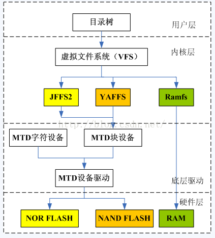
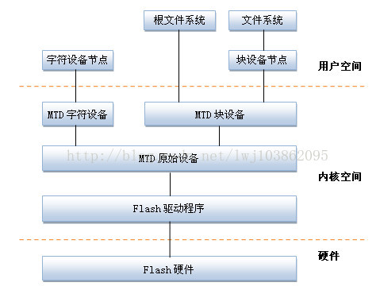
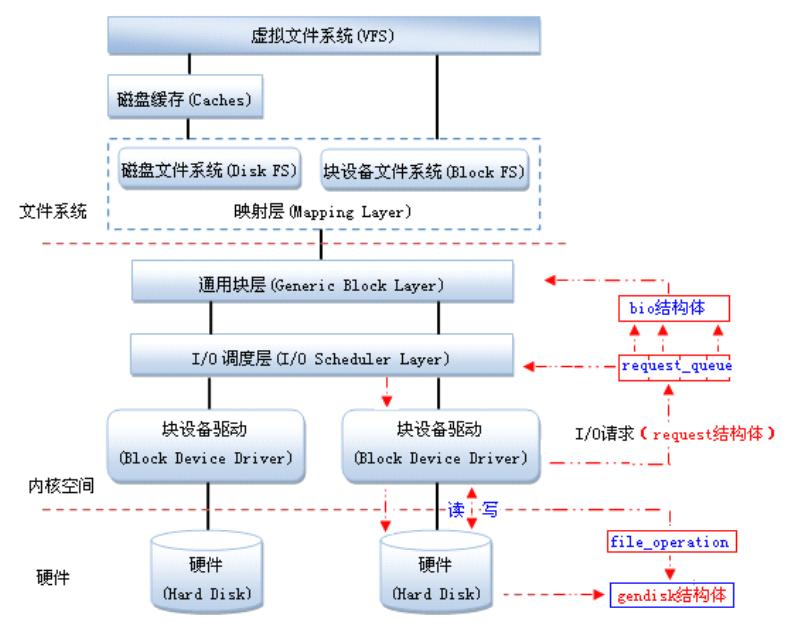
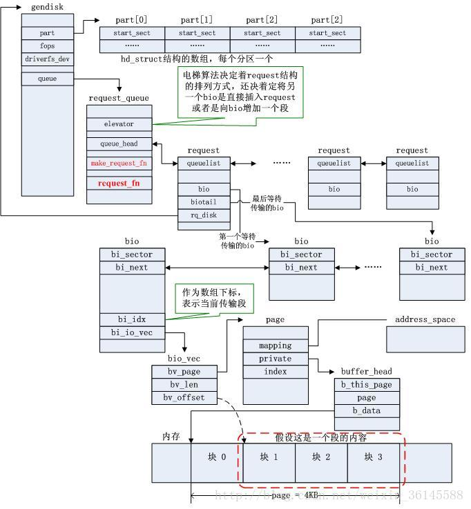

  ##

###  修订记录
| 修订说明 | 日期 | 作者 | 额外说明 |
| --- |
| 初版 | 2018/04/10 | 员清观 |  |

## 0 硬件基础
### 0.1 SD卡
工作电压范围为：2.7~3.6V； 按照卡容量分类定义：1.标准容量卡（SDSC）：最大容量为2GB 2.高容量卡（SDHC）：容量大小为2~32GB的卡 3.扩展容量卡（SDXC）：容量大小为32GB~2TB的卡； 为了区分不同的卡，SD3.0协议中在初始化和识别卡的过程中会判断用户插入的卡是SDSC/SDHC/SDXC中的哪一种卡，比如在R3中的第38Bit的CCS = 0b时，表示插入的卡为SDSC卡，而CCS = 1b时，表示插入的卡为SDHC或者SDXC卡。不同的卡在Cammand和Response中有微小的区别。


## 1. flash文件系统概述




### 1.1 文件系统选择
flash文件系统基于MTD驱动程序，主要优点在于，它是专门针对各种非易失性存储器(以闪存为主)而设计的，因而它对Flash有更好的支持、管理和基于扇区的擦除、读/写操作接口．

**JFFS2日志闪存文件系统版本2 (Journalling Flash FileSystem v2)**<br>
主要用于NOR型闪存，基于MTD驱动层。
优点：可读写的、支持数据压缩的、基于哈希表的日志型文件系统，并提供了崩溃/掉电安全保护，提供“写平衡”支持等。
缺点：主要是当文件系统已满或接近满时，因为垃圾收集的关系而使jffs2的运行速度大大放慢。
目前jffs3正在开发中。
jffsx不适合用于NAND闪存，主要是因为NAND闪存的容量一般较大，这样导致jffs为维护日志节点所占用的内存空间迅速增大，另外，jffsx文件系统在挂载时需要扫描整个FLASH的内容，以找出所有的日志节点，建立文件结构，对于大容量的NAND闪存会耗费大量时间。

Norflash一般使用jffs2

**yaffs2 (Yet Another Flash File System )**<br>
yaffs/yaffs2是专为嵌入式系统使用NAND型闪存而设计的一种日志型文件系统。与jffs2相比，它减少了一些功能(例如不支持数据压缩)，所以速度更快，挂载时间很短，对内存的占用较小。另外，它还是跨平台的文件系统，除了Linux和eCos，还支持WinCE, pSOS和ThreadX等。
yaffs/yaffs2自带NAND芯片的驱动，并且为嵌入式系统提供了直接访问文件系统的API，用户可以不使用Linux中的MTD与VFS，直接对文件系统操作。当然，yaffs也可与MTD驱动程序配合使用。
yaffs与yaffs2的主要区别：yaffs仅支持小页(512 Bytes) NAND闪存，yaffs2则可支持大页(2KB) NAND闪存。同时，yaffs2在内存空间占用、垃圾回收速度、读/写速度等方面均有大幅提升
Nandflash早期使用的是yaffs2，现在一般使用ubifs，因为随着技术的进步Nandflash的容量越来越大，yaffs2已经hold不住了

**ubifs(UnsortedBlock Image File System,UMTDMTDBIFS)无排序区块图像文件系统**<br>
UBIFS可以认为是JFFS2文件系统的下一代。最早在2006年由IBM与Nok模块ia的工程师ThomasGleixner，ArtemBityutskiy所设计，专门为了解决MTD（MemoryTechnology Device）设备所遇到的瓶颈。由于NandFlash容量的暴涨，YAFFS等皆无法再去控制NandFlash的空间。UBIFS通过子系统UBI处理与MTDdevice之间的动作。
UBIFS在设计与性能上均较YAFFS2、JFFS2更适合NAND FLASH。UBIFS支持write-back,其写入的数据会被cache,直到有必要写入时才写到flash,大大地降低分散小区块数量并提高I/O效率。UBIFSUBIFS文件系统目录存储在flash上，UBIFSmount时不需要scan整个flash的数据来重新创建文件目录。支持on-the-flight压缩文件数据，而且可选择性压缩部份文件。另外UBIFS使用日志（journal），可减少对flashindex的更新频率。

**squashfs**<br>

## ramdisk制作
ramdisk 有二种 , 一种（initrd）就是可以格式化并加载, 在 linux 内核 2.0/2.2 就已经支持 , 其不足之处是大小固定 ; 另一种（initramfs）是2.4 的内核才支持 , 通过ramfs 来实现 , 他不能被格式化 , 但用起来方便 , 其大小随所需要的空间增加或减少 , 是目前 linux 常用的 ramdisk 技术

   制作ramdiblsk需要genext2fs, 该工具可以用buildroot来编译出来:
   Host utilities
         [*] host genext2fs 选上这个,编译出来的genext2fs在output/build/host-genext2fs-1.4.1目录下


   到output/image目录下,解压文件系统到rootfs目录下
   tom@v:images$ mkdir rootfs
   tom@v:images$ sudo tar -xvf rootfs.tar -C rootfs


   生成ramdisk文件
   tom@v:images$ sudo ./genext2fs -b 8192 -d rootfs ramdisk.image
   tom@v:images$ ls
      genext2fs  ramdisk.image  rootfs  rootfs.tar


   用 gzip 压缩  ramdisk.image，生成  ramdisk.image.gz
   tom@v:images$ gzip -9 ramdisk.image
   tom@v:images$ ls
      genext2fs  ramdisk.image.gz  rootfs  rootfs.tar

   用 mkimage 添加文件头，生成新的uramdisk.image.gz供u-boot使用
tom@v:images$ mkimage -A arm -T ramdisk -C gzip -n Ramdisk -d ramdisk.image.gz uramdisk.image.gz
Image Name:   Ramdisk
Created:      Fri Jan  9 18:07:48 2015
Image Type:   ARM Linux RAMDisk Image (gzip compressed)
Data Size:    2376529 Bytes = 2320.83 kB = 2.27 MB
Load Address: 00000000
Entry Point:  00000000

  将uramdisk.image.gz copy到SD卡上,从SD卡启动,设置内核参数挂载ramdisk文件系统即可.

## 2.squashfs
linux文件的读取过程代码分析，以squashfs为例:
  https://blog.csdn.net/eleven_xiy/article/details/73609237

squashfs是以linux 内核源码补丁的形式发布，附带mksquashfs工具，用于创建squash文件系统。squashfs可以将整个文件系统或者某个单一的目录压缩在一起, 存放在某个设备, 某个分区或者普通的文件中. 如果你将其压缩到一个设备中, 那么你可以将其直接mount起来使用; 而如果它仅仅是个文件,你可以将其当为一个loopback 设备使用. squashfs文件系统的设计令人欣喜.  For archiving purposes, 它可以让你更加灵活的使用, 而且它比.tar.gz文档有更快的响应速度.

**squash文件系统的特点：**<br>
· 数据(data),节点(inode)和目录(directories)都被压缩。
· 保存了全部的32位UID/GIDS和文件的创建时间. (注: cramfs是8位,没有创建时间)。
· 支持多达4G的文件系统. (cramfs是16M)。
· 节点和目录都是高度压缩, 而且都是存储在字节边界(packed on byte boundaries); 所有压缩的节点长度平均在8个字节左右.(具体的长度根据文件的类型是不同的. 比如, 普通文件,目录,符号链接,块设备和字符设备的节点的大小就不一样)。
· squashfs可以允许块大小(block size)达32Kb(1.x)和64kb(2.x), 这样可以达到比4K块大小更大的压缩率。使用4k块压缩率小，但响应快一点．
· squashfs 2引进了碎片块(fragment blocks)的概念: 一种将许多比块size 小的文件存储在一个块中, 以达到更大的压缩率。
· 重复的文件会被检测并删除掉。
· 同时支持big和little endian架构. SQ可以将文件系统MOUNT到不同的字节顺序(byte-order)的机器上面。

### 2.1 制作squashfs过程
**针对将squashfs放在一个nand 分区的情况，对squashfs的操作应该有下面几步：**<br>
a.制作squashfs镜像（本操作位于宿主机）
    #mksquash xxxx xxxx.squash (可以通过"-comp "指定压缩方式)
b.擦除nand分区
    #flash_eraseall /dev/mtdx(需要对字符设备的支持)
c.拷贝镜像
    #dd if=xxxx.squash of=/dev/mtdx
  注：文件系统知识一个文件的组织数据结构而已，将squash镜像全盘拷入到分区当中去就意味这创建了一个squash文件系统。
d.挂载设备
    #mount -t squashfs /dev/mtdblockx /mnt/xxx（需要mtd块设备的支持）
由于对错误和过程没有完全记录，且对知识没有充分掌握，以致在次使用squashfs的时候仍有问题不能精确的定位，下面是补充：在制作好squashfs之后，可以直接将文件系统挂载在某个目录下面：#mount -t squashfs xxx.squash /dir/
接着得到如下打印： can't setup loop device:no space left.
最后在制作squashfs的时候需要考虑版本的问题，如果提示版本的问题，需要换其他的版本，但是现在最新的squashfs工具已经没有这个问题了

**编译使用SQ的基本步骤:**<br>
  1.重新打包和编译linux内核, 使之支持SQ.
  2.编译mksquashfs工具.
  3.使用mksquashf创建压缩文件系统.
  4.试用: mount suqash文件系统到一个临时目录.
  5.如果需要的话,更改/etc/fstab 或者起始脚本, 以使linux操作系统自动加载新的 squashfs 文件系统.

### 2.2 squashfs基础
  　　官方网站: www.squashfs.org
　　Squashfs是Linux下的一种只读压缩文件系统类型。它使用zlib/lzo/xz等压缩算法来压缩文件，节点及目录。Squashfs文件系统内的节点非常小巧并且所有的数据块都排列紧凑，通过这种方式来降低数据存储开销。数据块大小可以取在4KB到1MB，但默认大小为128KB。(解压时stream_in_out大小都是128k)最大文件2TB，文件系统大小2^64
　　Squashfs 会将数据、节点及目录进行压缩。另外，节点和目录数据是字节对齐并且是高度紧凑的。每个压缩的节点平均仅占用8字节长度（确切长度会因为文件类型而不同，比如普通文件、目录、符号链接及块/字符设备节点等）。
　　squashfs作为一种只读文件，必须用mksquashfs工具来创建压缩的squashfs文件系统。mksquash工具及unsquashfs等工具可以从http://www.squashfs.org网站获取。这些squashfs相关工具代码树现在已经被集成到kernel.org内：git://git.kernel.org/pub/scm/fs/squashfs/squashfs-tools.git
　　Squashfs 文件系统最多包含9种字节对齐的模块，压缩的数据块就像从某个目录里读文件一样写到文件系统并进行冗余检查。当文件数据被写入到文件系统， completed inode, directory, fragment, export, uid/gid lookup 和xattr tables也会同时被写入到文件系统里面，其他模块定义：superblock,datablock,fragments.

unlock_page(page)，普通意义上，这应该是一个独立的page的临界区管理；但在squashfs中，这被用作一系列page的锁定管理，这样的先决条件是，后面的一系列page不会被挪用．但多个进程同时加载的情况，好像破坏了这个场景．实际上，这是squashfs的一个设计问题，它不能有效的使用page cache来作为cache,所以定义了一个且只有一个内部的数据缓存，所以，可以考虑增加这个cache的大小到一定程度，或者增加临界区保护它．

**squashfs下载**<br>
  https://sourceforge.net/projects/squashfs/files/?source=navbar

```cpp
//对于基于块设备的文件系统，简化流程，以方便理解基本回调流程
struct dentry *squashfs_mount(struct file_system_type *fs_type, int flags, const char *dev_name, void *data)
  |--> return mount_bdev(fs_type, flags, dev_name, data, squashfs_fill_super);//int squashfs_fill_super(struct super_block *sb, void *data, int silent)
    ...
    root = new_inode(sb);
    |--> squashfs_read_inode(root, root_inode);//int squashfs_read_inode(struct inode *inode, long long ino)
      ...
      |--> init_special_inode(inode, inode->i_mode, 0);
        ...
        if (S_ISBLK(mode)) {
      		inode->i_fop = &def_blk_fops; //见下文详细介绍
      		inode->i_rdev = rdev;
      	}
        ...

    insert_inode_hash(root);  sb->s_root = d_make_root(root);

static struct file_system_type squashfs_fs_type = {
	.owner = THIS_MODULE, 	.name = "squashfs", 	.mount = squashfs_mount, 	.kill_sb = kill_block_super, 	.fs_flags = FS_REQUIRES_DEV
};

int squashfs_fill_super(struct super_block *sb, void *data, int silent)
  struct squashfs_sb_info *msblk;
  msblk->devblksize = sb_min_blocksize(sb, SQUASHFS_DEVBLK_SIZE);
  msblk->devblksize_log2 = ffz(~msblk->devblksize);
  struct squashfs_super_block *sblk = squashfs_read_table(sb, SQUASHFS_START, sizeof(*sblk));
  msblk->decompressor = supported_squashfs_filesystem(le16_to_cpu(sblk->s_major),le16_to_cpu(sblk->s_minor),le16_to_cpu(sblk->compression));
  msblk->block_size = le32_to_cpu(sblk->block_size);
  msblk->inode_table = le64_to_cpu(sblk->inode_table_start);
  msblk->directory_table = le64_to_cpu(sblk->directory_table_start);
  msblk->inodes = le32_to_cpu(sblk->inodes);
  msblk->block_cache = squashfs_cache_init("metadata",SQUASHFS_CACHED_BLKS, SQUASHFS_METADATA_SIZE);//8*8192的cache
  msblk->read_page = squashfs_cache_init("data", 1, msblk->block_size);//1*128k
  msblk->stream = squashfs_decompressor_init(sb, flags);
  xattr_id_table_start = le64_to_cpu(sblk->xattr_id_table_start);
  msblk->xattr_id_table = squashfs_read_xattr_id_table(sb,xattr_id_table_start, &msblk->xattr_table, &msblk->xattr_ids);
  msblk->id_table = squashfs_read_id_index_table  (sb,le64_to_cpu(sblk->id_table_start), next_table,le16_to_cpu(sblk->no_ids));
  msblk->inode_lookup_table = squashfs_read_inode_lookup_table(sb,lookup_table_start, next_table, msblk->inodes);
  msblk->fragment_cache = squashfs_cache_init("fragment",SQUASHFS_CACHED_FRAGMENTS, msblk->block_size);//3*128k

//squashfs的软件cache机制，减少读取和解压操作，是可以在别的地方模拟的
struct squashfs_cache_entry *squashfs_cache_get(struct super_block *sb,struct squashfs_cache *cache, u64 block, int length)
void squashfs_cache_put(struct squashfs_cache_entry *entry)

struct squashfs_cache *squashfs_cache_init(char *name, int entries,int block_size)

const struct squashfs_decompressor squashfs_lzo_comp_ops = {
	.init = lzo_init,	.free = lzo_free,	.decompress = lzo_uncompress,
	.id = LZO_COMPRESSION,	.name = "lzo",	.supported = 1
};

int squashfs_read_data(struct super_block *sb, void **buffer, u64 index, int length, u64 *next_index, int srclength, int pages)
  struct squashfs_sb_info *msblk = sb->s_fs_info;
  struct buffer_head **bh = kcalloc(((srclength + msblk->devblksize - 1) >> msblk->devblksize_log2) + 1, sizeof(*bh), GFP_KERNEL);
  int offset = index & ((1 << msblk->devblksize_log2) - 1);
  u64 cur_index = index >> msblk->devblksize_log2;
  if (length)
    bytes = -offset;  compressed = SQUASHFS_COMPRESSED_BLOCK(length);length = SQUASHFS_COMPRESSED_SIZE_BLOCK(length);
    for (b = 0; bytes < length; b++, cur_index++)
      bh[b] = sb_getblk(sb, cur_index); bytes += msblk->devblksize;
    ll_rw_block(READ, b, bh);
  else
    bh[0] = get_block_length(sb, &cur_index, &offset, &length); b = 1;
    bytes = msblk->devblksize - offset; compressed = SQUASHFS_COMPRESSED(length);
    length = SQUASHFS_COMPRESSED_SIZE(length);
    for (; bytes < length; b++)
      bh[b] = sb_getblk(sb, ++cur_index);      bytes += msblk->devblksize;
    ll_rw_block(READ, b - 1, bh + 1);
  if (compressed)
    |--> length = squashfs_decompress(msblk, buffer, bh, b, offset, length, srclength, pages);//return msblk->decompressor->decompress(msblk, buffer, bh, b, offset,length, srclength, pages); //int lzo_uncompress(struct squashfs_sb_info *msblk, void **buffer,	struct buffer_head **bh, int b, int offset, int length, int srclength,int pages)
      for (i = 0; i < b; i++)
        wait_on_buffer(bh[i]); avail = min(bytes, msblk->devblksize - offset);
        memcpy(buff, bh[i]->b_data + offset, avail); put_bh(bh[i]);
      res = lzo1x_decompress_safe(stream->input, (size_t)length,stream->output, &out_len);

  else ...

```

## 3 mtd系统

MTD，Memory Technology Device即内存技术设备，在Linux内核中，引入MTD层为NOR FLASH和NAND FLASH设备提供统一接口。MTD将文件系统与底层FLASH存储器进行了隔离。



MTD设备通常可分为四层，从上到下依次是：设备节点、MTD设备层、MTD原始设备层、硬件驱动层。
- Flash硬件驱动层：Flash硬件驱动层负责对Flash硬件的读、写和擦除操作。MTD设备的Nand Flash芯片的驱动则drivers/mtd/nand/子目录下,Nor Flash芯片驱动位于drivers/mtd/chips/子目录下。
- MTD原始设备层：用于描述MTD原始设备的数据结构是mtd_info，定义了大量的关于MTD的数据和操作函数。`mtdcore.c`:MTD原始设备接口相关实现，`mtdpart.c`:MTD分区接口相关实现。
- MTD设备层：基于MTD原始设备，linux系统可以定义出MTD的块设备（主设备号31）和字符设备（设备号90）。其中`mtdchar.c`:MTD字符设备接口相关实现， `mtdblock.c`:MTD块设备接口相关实现。
- 设备节点：通过mknod在/dev子目录下建立MTD块设备节点（主设备号为31）和MTD字符设备节点（主设备号为90）。通过访问此设备节点即可访问MTD字符设备和块设备

```cpp
struct mtd_part {
  struct mtd_info mtd;        /* 分区信息, 大部分由master决定 */
  struct mtd_info *master;    /* 分区的主分区 */
  uint64_t offset;            /* 分区的偏移地址 */
  struct list_head list;      /* 将mtd_part链成一个链表mtd_partitons */
};

```
### 3.1 mtdcore.c和mtdpart.c

这个文件中提供大量接口，最终还是会调用mtd的回调函数，这里主要是增加了参数校验和临界区同步等

```cpp
struct mtd_info {
	u_char type;
	uint64_t size; // Total size of the MTD
	uint32_t flags, erasesize, writesize, writebufsize, oobsize, oobavail;
	unsigned int erasesize_shift, writesize_shift, erasesize_mask, writesize_mask;
	const char *name;  	int index;// Kernel-only stuff starts here.

	struct nand_ecclayout *ecclayout; //ECC layout structure pointer - read only!

	unsigned int ecc_strength; //max number of correctible bit errors per writesize
	int numeraseregions;
	struct mtd_erase_region_info *eraseregions;
	int (*_erase) (struct mtd_info *mtd, struct erase_info *instr);
	int (*_point) (struct mtd_info *mtd, loff_t from, size_t len, size_t *retlen, void **virt, resource_size_t *phys);
	int (*_unpoint) (struct mtd_info *mtd, loff_t from, size_t len);
	unsigned long (*_get_unmapped_area) (struct mtd_info *mtd, unsigned long len, unsigned long offset, unsigned long flags);
	int (*_read) (struct mtd_info *mtd, loff_t from, size_t len, size_t *retlen, u_char *buf);
	int (*_write) (struct mtd_info *mtd, loff_t to, size_t len, size_t *retlen, const u_char *buf);
	int (*_panic_write) (struct mtd_info *mtd, loff_t to, size_t len, size_t *retlen, const u_char *buf);
	int (*_read_oob) (struct mtd_info *mtd, loff_t from, struct mtd_oob_ops *ops);
	int (*_write_oob) (struct mtd_info *mtd, loff_t to, struct mtd_oob_ops *ops);
	int (*_get_fact_prot_info) (struct mtd_info *mtd, struct otp_info *buf, size_t len);
	int (*_read_fact_prot_reg) (struct mtd_info *mtd, loff_t from, size_t len, size_t *retlen, u_char *buf);
	int (*_get_user_prot_info) (struct mtd_info *mtd, struct otp_info *buf, size_t len);
	int (*_read_user_prot_reg) (struct mtd_info *mtd, loff_t from, size_t len, size_t *retlen, u_char *buf);
	int (*_write_user_prot_reg) (struct mtd_info *mtd, loff_t to, size_t len, size_t *retlen, u_char *buf);
	int (*_lock_user_prot_reg) (struct mtd_info *mtd, loff_t from, size_t len);
	int (*_writev) (struct mtd_info *mtd, const struct kvec *vecs, unsigned long count, loff_t to, size_t *retlen);
	void (*_sync) (struct mtd_info *mtd);
  int (*_lock) (struct mtd_info *mtd, loff_t ofs, uint64_t len); 	int (*_unlock) (struct mtd_info *mtd, loff_t ofs, uint64_t len);
	int (*_is_locked) (struct mtd_info *mtd, loff_t ofs, uint64_t len);
	int (*_block_isbad) (struct mtd_info *mtd, loff_t ofs); 	int (*_block_markbad) (struct mtd_info *mtd, loff_t ofs);
	int (*_suspend) (struct mtd_info *mtd);   	void (*_resume) (struct mtd_info *mtd);
	int (*_get_device) (struct mtd_info *mtd); 	void (*_put_device) (struct mtd_info *mtd);

	struct backing_dev_info *backing_dev_info;
	struct notifier_block reboot_notifier;  /* default mode before reboot */
	/* ECC status information */
	struct mtd_ecc_stats ecc_stats;
	/* Subpage shift (NAND) */
	int subpage_sft;
	void *priv;
	struct module *owner;
	struct device dev;
	int usecount;
};

static struct backing_dev_info mtd_bdi_unmappable = { .capabilities	= BDI_CAP_MAP_COPY,};
//调用class_register()需要先初始化mtd_class
struct class mtd_class = {.name = "mtd", .owner = THIS_MODULE, .suspend = mtd_cls_suspend, .resume = mtd_cls_resume,};
static struct backing_dev_info mtd_bdi_ro_mappable = {
	.capabilities	= (BDI_CAP_MAP_COPY | BDI_CAP_MAP_DIRECT | BDI_CAP_EXEC_MAP | BDI_CAP_READ_MAP),};
static struct backing_dev_info mtd_bdi_rw_mappable = {
	.capabilities	= (BDI_CAP_MAP_COPY | BDI_CAP_MAP_DIRECT | BDI_CAP_EXEC_MAP | BDI_CAP_READ_MAP | BDI_CAP_WRITE_MAP),};

static LIST_HEAD(mtd_partitions); //mtd_partitions 的链表
static DEFINE_MUTEX(mtd_partitions_mutex);
struct mtd_part {
	struct mtd_info mtd; //每个分区都有自己独立的mtd_info
	struct mtd_info *master;
	uint64_t offset;
	struct list_head list;
};
 #define MTD_DEVT(index) MKDEV(MTD_CHAR_MAJOR, (index)*2)

static DEFINE_IDR(mtd_idr);
DEFINE_MUTEX(mtd_table_mutex);
struct mtd_info *__mtd_next_device(int i)
	return idr_get_next(&mtd_idr, &i);

struct mtd_info 中定义的大部分part回调函数，对于partition来讲，就是加上 part->offset

int del_mtd_device(struct mtd_info *mtd)
  idr_find(&mtd_idr, mtd->index) != mtd)
  device_unregister(&mtd->dev); idr_remove(&mtd_idr, mtd->index); module_put(THIS_MODULE);

//一般在device probe,包括m25p80.c和giga nandflash驱动中
int mtd_device_parse_register(struct mtd_info *mtd, const char * const *types
  , struct mtd_part_parser_data *parser_data, const struct mtd_partition *parts, int nr_parts)
  struct mtd_partition *real_parts;
  err = parse_mtd_partitions(mtd, types, &real_parts, parser_data);
  |--> add_mtd_partitions(mtd, real_parts, err); kfree(real_parts);
    for (i = 0; i < nbparts; i++)//创建和初始化新的 mtd_partition
      |--> struct mtd_part *slave = allocate_partition(master, parts + i, i, cur_offset);
        struct mtd_part *slave = kzalloc(sizeof(*slave), GFP_KERNEL);
        slave->master = master; slave->mtd.xxxx = master->xxxx; //父子信息传递
        slave->mtd.dev.parent = master->dev.parent;
        slave->mtd._read = part_read;　slave->mtd._write = part_write; ...;//一系列回调函数赋值
      list_add(&slave->list, &mtd_partitions);
      |--> add_mtd_device(&slave->mtd);
        int i = idr_alloc(&mtd_idr, mtd, 0, 0, GFP_KERNEL); mtd->index = i; mtd->usecount = 0;
        mtd->dev.type = &mtd_devtype; //从sysfs打印看，mtd0比mtd0ro多出来这些属性，也多了snnd的几个块
        mtd->dev.class = &mtd_class;  mtd->dev.devt = MTD_DEVT(i);
        dev_set_name(&mtd->dev, "mtd%d", i);//--> kobject_set_name_vargs(&dev->kobj, fmt, vargs);
        dev_set_drvdata(&mtd->dev, mtd);
        device_register(&mtd->dev); //--> device_initialize(dev); return device_add(dev);
        device_create(&mtd_class, mtd->dev.parent, MTD_DEVT(i) + 1, NULL, "mtd%dro", i);//在指定的父设备下使用指定设备号创建一个新的设备，注册在sysfs中，好像是创建了(mtd0:90,0) (mtd0:90,1)两个设备，但是看不出它们的区别。
      cur_offset = slave->offset + slave->mtd.size;

int __init init_mtd(void)
  class_register(&mtd_class);
  mtd_bdi_init(&mtd_bdi_unmappable, "mtd-unmap"); //bdi_init(bdi); bdi_register(bdi, NULL, name);
  mtd_bdi_init(&mtd_bdi_ro_mappable, "mtd-romap");  ret = mtd_bdi_init(&mtd_bdi_rw_mappable, "mtd-rwmap");
  proc_mtd = proc_create("mtd", 0, NULL, &mtd_proc_ops);
  init_mtdchar();
void __exit cleanup_mtd(void)
  cleanup_mtdchar(); if (proc_mtd) remove_proc_entry("mtd", NULL);
	class_unregister(&mtd_class);	bdi_destroy(&mtd_bdi_unmappable);
	bdi_destroy(&mtd_bdi_ro_mappable); bdi_destroy(&mtd_bdi_rw_mappable);
```

### 3.2 mtdblock.c
基于所有的mtd设备建立块设备`mtdblock`，应该是没有块映射的直接io，但提供了cache的功能．

```cpp
static struct mtd_blktrans_ops mtdblock_tr = {
	.name		= "mtdblock", 	.major		= 31, 	.part_bits	= 0, 	.blksize 	= 512,
	.open		= mtdblock_open, 	.flush		= mtdblock_flush, 	.release	= mtdblock_release,
	.readsect	= mtdblock_readsect, 	.writesect	= mtdblock_writesect, 	.add_mtd	= mtdblock_add_mtd,
	.remove_dev	= mtdblock_remove_dev, 	.owner		= THIS_MODULE,
};
struct mtd_blktrans_dev {
	struct mtd_blktrans_ops *tr;
	struct list_head list;
	struct mtd_info *mtd;
	struct mutex lock;
	int devnum;
	bool bg_stop;
	unsigned long size;
	int readonly;
	int open;
	struct kref ref;
	struct gendisk *disk;
	struct attribute_group *disk_attributes;
	struct workqueue_struct *wq;
	struct work_struct work;

	struct request_queue *rq;
	spinlock_t queue_lock;
	void *priv;
	fmode_t file_mode;
};
struct mtdblk_dev {//可以看做对 mtd_blktrans_dev 的继承，增加了缓冲的功能
	struct mtd_blktrans_dev mbd;　//应该是作为基类
	int count;
	struct mutex cache_mutex;
	unsigned char *cache_data;
	unsigned long cache_offset;
	unsigned int cache_size;
	enum { STATE_EMPTY, STATE_CLEAN, STATE_DIRTY } cache_state;
};

//这个函数对于mtdblock.c有用
int do_blktrans_request(struct mtd_blktrans_ops *tr, struct mtd_blktrans_dev *dev, struct request *req)
  block = blk_rq_pos(req) << 9 >> tr->blkshift;	nsect = blk_rq_cur_bytes(req) >> tr->blkshift; buf = req->buffer;
  tr->read_multisect(dev, block, nsect, buf);  tr->readsect(dev, block, buf);  tr->writesect(dev, block, buf);//三选一的调用

void mtdblock_add_mtd(struct mtd_blktrans_ops *tr, struct mtd_info *mtd)
  struct mtdblk_dev *dev = kzalloc(sizeof(*dev), GFP_KERNEL);
  dev->mbd.mtd = mtd; dev->mbd.devnum = mtd->index; dev->mbd.size = mtd->size >> 9;
  dev->mbd.tr = tr; mutex_init(&dev->cache_mutex);
  add_mtd_blktrans_dev(&dev->mbd)

void mtdblock_remove_dev(struct mtd_blktrans_dev *dev) //->del_mtd_blktrans_dev(dev);
  del_gendisk(old->disk); destroy_workqueue(old->wq); old->rq->queuedata = NULL;
  blk_start_queue(old->rq); old->tr->release(old); old->mtd = NULL; blktrans_dev_put(old);

```

### 3.3 mtdchar.c介绍
基于所有的mtd设备建立块设备`mtdx`，自动mount inode的文件系统，应该是为了提供直接访问的功能．
可以考虑未来用dd直接dump当前的测试镜像到sd卡上文件，节省测试时间．

```cpp
//下文中：//file->private_data = mfi; 将struct mtd_file_info的变量设置为file的私有结构
struct mtd_file_info { struct mtd_info *mtd; struct inode *ino; enum mtd_file_modes mode; };
static const struct file_operations mtd_fops = {
	.owner		= THIS_MODULE,	.llseek		= mtdchar_lseek,	.read		= mtdchar_read,	.write		= mtdchar_write,
	.unlocked_ioctl	= mtdchar_unlocked_ioctl,　	.compat_ioctl	= mtdchar_compat_ioctl,
	.open		= mtdchar_open,　	.release	= mtdchar_close,　	.mmap		= mtdchar_mmap,　};
static const struct file_operations mtd_fops = {
	.owner		= THIS_MODULE,	.llseek		= mtdchar_lseek,	.read		= mtdchar_read,	.write		= mtdchar_write,
	.unlocked_ioctl	= mtdchar_unlocked_ioctl,	.open		= mtdchar_open,	.release	= mtdchar_close,.mmap		= mtdchar_mmap, };
static struct file_system_type mtd_inodefs_type = {
  .name = "mtd_inodefs",  .mount = mtd_inodefs_mount,    .kill_sb = kill_anon_super, };

static loff_t mtdchar_lseek(struct file *file, loff_t offset, int orig)
  return file->f_pos = offset; //根据orig计算并更新offset的值

static int mtdchar_open(struct inode *inode, struct file *file)
  struct mtd_info *mtd = get_mtd_device(NULL, devnum);
  struct inode *mtd_ino = iget_locked(mnt->mnt_sb, devnum);
  mtd_ino->i_private = mtd;　mtd_ino->i_mode = S_IFCHR;　mtd_ino->i_data.backing_dev_info = mtd->backing_dev_info;
  file->f_mapping = mtd_ino->i_mapping;
  struct mtd_file_info *mfi = kzalloc(sizeof(*mfi), GFP_KERNEL);
  mfi->ino = mtd_ino; mfi->mtd = mtd;   file->private_data = mfi;

static int mtdchar_close(struct inode *inode, struct file *file)
  struct mtd_file_info *mfi = file->private_data;     struct mtd_info *mtd = mfi->mtd;
  iput(mfi->ino); put_mtd_device(mtd);  file->private_data = NULL;  kfree(mfi); simple_release_fs(&mnt, &count);

ssize_t mtdchar_read(struct file *file, char __user *buf, size_t count, loff_t *ppos)
  struct mtd_file_info *mfi = file->private_data;     struct mtd_info *mtd = mfi->mtd;　　　struct mtd_oob_ops ops;
  char *kbuf = mtd_kmalloc_up_to(mtd, &size);
  ops.mode = MTD_OPS_RAW; ops.datbuf = kbuf;  ops.oobbuf = NULL;  ops.len = len; mtd_read_oob(mtd, *ppos, &ops);

ssize_t mtdchar_write(struct file *file, const char __user *buf, size_t count, loff_t *ppos)
  struct mtd_file_info *mfi = file->private_data;     struct mtd_info *mtd = mfi->mtd;　　　struct mtd_oob_ops ops;
  char *kbuf = mtd_kmalloc_up_to(mtd, &size);
  ops.mode = MTD_OPS_RAW; ops.datbuf = kbuf;  ops.oobbuf = NULL;  ops.len = len;  mtd_write_oob(mtd, *ppos, &ops);

int __init init_mtdchar(void)
  ret = __register_chrdev(MTD_CHAR_MAJOR, 0, 1 << MINORBITS, "mtd", &mtd_fops);
  ret = register_filesystem(&mtd_inodefs_type);

```

### 3.4 MTD块设备定义 (mtd_blkdevs.c)
尽管在块设备驱动中仍然存在`block_device_operations`结构体及其成员函数，但其不再包含读写一类的成员函数，而只是包含打开、释放及I/O控制等与具体读写无关的函数。至于实际的i/o操作，通过调用`blk_init_queue()`函数传递的`mtd_blktrans_work()`回调函数来处理每一个request．块设备驱动的结构相当复杂的，但幸运的是，块设备不像字符设备那么包罗万象，它通常就是存储设备，而且驱动的主体已经由Linux内核提供，针对一个特定的硬件系统，驱动工程师所涉及到的工作往往只是编写少量的与硬件直接交互的代码；

```cpp
static LIST_HEAD(blktrans_majors);
static DEFINE_MUTEX(blktrans_ref_mutex);

static const struct block_device_operations mtd_block_ops = {
	.owner = THIS_MODULE, .open	= blktrans_open, .release	= blktrans_release,	.ioctl = blktrans_ioctl, .getgeo	= blktrans_getgeo,};

static int blktrans_getgeo(struct block_device *bdev, struct hd_geometry *geo) //->dev->tr->getgeo(dev, geo)
void blktrans_release(struct gendisk *disk, fmode_t mode) //->dev->tr->release(dev)
static int blktrans_open(struct block_device *bdev, fmode_t mode)
  struct mtd_blktrans_dev *dev = blktrans_dev_get(bdev->bd_disk);
  dev->tr->open(dev); /* infotm_nftl_open(),do nothing */__get_mtd_device(dev->mtd); dev->file_mode = mode; dev->open++;
  blktrans_dev_put(dev);

static int blktrans_ioctl(struct block_device *bdev, fmode_t mode, unsigned int cmd, unsigned long arg)
  struct mtd_blktrans_dev *dev = blktrans_dev_get(bdev->bd_disk); mutex_lock(&dev->lock);
  switch (cmd)
    case BLKFLSBUF:  ret = dev->tr->flush ? dev->tr->flush(dev) : 0;  break;
    case BLKGETSECTS:  case BLKFREESECTS:
      if (dev->tr->update_blktrans_sysinfo)  dev->tr->update_blktrans_sysinfo(dev, cmd, arg);
    break;
    case MEMERASE:  case MEMERASE64:
      ret = 0; if (dev->tr->erase_data) dev->tr->erase_data(dev, cmd, arg); break;
  mutex_unlock(&dev->lock);	blktrans_dev_put(dev);

//工作队列处理函数，从设备队列上获取req并调用tr回调处理
void mtd_blktrans_work(struct work_struct *work)
  struct mtd_blktrans_dev *dev =	container_of(work, struct mtd_blktrans_dev, work);
	struct mtd_blktrans_ops *tr = dev->tr;
	struct request_queue *rq = dev->rq;
  while(1)
    |--> req = blk_fetch_request(rq);//-- blk_peek_request() -- __elv_next_request() 获取有效请求．
      struct request *rq = blk_peek_request(q);
      if (rq) blk_start_request(rq);//->blk_dequeue_request(req);  blk_add_timer(req);
      return rq;
    tr->do_blktrans_request(tr, dev, req);
  if (req) __blk_end_request_all(req, -EIO);//->__blk_end_bidi_request(rq, ...);->blk_finish_request(rq...);

int add_mtd_blktrans_dev(struct mtd_blktrans_dev *new)
  int last_devnum; struct mtd_blktrans_ops *tr = new->tr;   struct gendisk *gd = alloc_disk(1 << tr->part_bits);
  ...; //遍历获取tr->devs链表上的所有struct mtd_blktrans_dev设备中最大设备号 last_devnum
  new->devnum = last_devnum+1;     list_add_tail(&new->list, &tr->devs);
  gd = alloc_disk(1 << tr->part_bits); new->disk = gd; gd->private_data = new; gd->major = tr->major;
  gd->first_minor = (new->devnum) << tr->part_bits;
  gd->fops = &mtd_block_ops; snprintf(gd->disk_name, sizeof(gd->disk_name), "%s%d", tr->name, new->devnum);
  set_capacity(gd, (new->size * tr->blksize) >> 9);
  new->rq = blk_init_queue(mtd_blktrans_request, &new->queue_lock);
  new->rq->queuedata = new; blk_queue_logical_block_size(new->rq, tr->blksize); gd->queue = new->rq;
  new->wq = alloc_workqueue("%s%d", 0, 0, tr->name, new->devnum); INIT_WORK(&new->work, mtd_blktrans_work);//创建工作队列和工作，这是基本工作方式．块设备的上层通过blk_queue_bio()发送bio请求，块设备的队列中，调用 mtd_blktrans_request()把工作queue_work()给工作队列线程安排．
  gd->driverfs_dev = &new->mtd->dev;  tr->init_bounce_buf(new, new->rq); add_disk(gd);
```

### 3.5 nftl(tr)中间层
这个部分把nftl模块和块设备关联．`tr`可以看成是一类设备的具象，`register_mtd_blktrans()`函数把它添加到`blktrans_majors`链表中管理，然后通过`tr`的`add_mtd`回调函数和匹配的实际mtd设备绑定在一起．

```cpp
static struct mtd_blktrans_ops infotm_nftl_tr = {
	.name		= "snndblock", 	.major		= INFOTM_NFTL_MAJOR, 	.part_bits	= 1, 	.blksize 	= 512,
	.open		= infotm_nftl_open,  	.release	= infotm_nftl_release, 	.init_bounce_buf = infotm_nftl_init_bounce_buf,
	.erase_data = infotm_nftl_erase_data, 	.do_blktrans_request = do_nftltrans_request,
	.writesect	= infotm_nftl_writesect, 	.discard 	= infotm_nftl_discard, 	.flush		= infotm_nftl_flush,
  .add_mtd	= infotm_nftl_add_mtd, 	.remove_dev	= infotm_nftl_remove_dev, 	.owner		= THIS_MODULE, };

void infotm_nftl_add_mtd(struct mtd_blktrans_ops *tr, struct mtd_info *mtd)
	if (mtd->type != MTD_NANDFLASH) return;
  infotm_nftl_blk = infotm_nftl_malloc(sizeof(infotm_nftl_blk_t));
  infotm_nftl_get_part_info(infotm_nftl_blk);  infotm_nftl_initialize(infotm_nftl_blk)
  infotm_nftl_creat_part(infotm_nftl_blk, tr);  infotm_register_env(&infotm_nftl_blk->nand_env);

void infotm_nftl_creat_part(struct infotm_nftl_blk_t *infotm_nftl_blk, struct mtd_blktrans_ops *tr)
  struct mtd_info *mtd = infotm_nftl_blk->mtd;
  struct infotm_nftl_part_t *nftl_part = infotm_nftl_malloc(sizeof(struct infotm_nftl_part_t));
  nftl_part->size = 0; nftl_part->offset = 0; nftl_part->mbd.mtd = mtd;
  nftl_part->mbd.devnum = dev_num++;  nftl_part->mbd.tr = tr; nftl_part->mbd.size = (nftl_part->size >> 9);
  nftl_part->priv = infotm_nftl_blk;  tr->part_bits = 0;
  add_mtd_blktrans_dev(&nftl_part->mbd) //

int __init init_infotm_nftl(void) //注册一个新块设备，然后绑定对应的mtd设备；对nftl，定义多个分区add_mtd_blktrans_dev()
  |--> return register_mtd_blktrans(&infotm_nftl_tr);//int register_mtd_blktrans(struct mtd_blktrans_ops *tr)
    tr->major = register_blkdev(tr->major, tr->name);//申请一个块设备，在major_names[]数组中占用之,nftl对应name: "snndblock"
    tr->blkshift = ffs(tr->blksize) - 1;
    INIT_LIST_HEAD(&tr->devs);  list_add(&tr->list, &blktrans_majors);
    mtd_for_each_device(mtd)  //遍历当前所有的mtd设备找到自己的目标mtd，调用新的trans结构解析，在上面创建分区等
      if (mtd->type != MTD_ABSENT) tr->add_mtd(tr, mtd); //infotm_nftl_add_mtd()中对自己不处理的mtd类型直接返回

```

### 3.6 mtdsupper.c
为jffs2和romfs提供mount函数，这两个文件系统是基于mtd的．后续可以跟踪`jffs2_mount()`和`romfs_mount()`两个函数来了解细节．`romfs_mount()`也可以选择基于块设备，调用`mount_bdev()`函数．

```cpp
struct dentry *mount_mtd(struct file_system_type *fs_type, int flags, const char *dev_name, void *data,
	       int (*fill_super)(struct super_block *, void *, int))

void kill_mtd_super(struct super_block *sb)

```

## 4 块设备驱动(kernel/block)
一种具有一定结构的随机存取设备，对这种设备的读写是按块进行的，他使用缓冲区来存放暂时的数据，待条件成熟后，从缓存一次性写入设备或者从设备一次性读到缓冲区。可以随机访问，块设备的访问位置必须能够在介质的不同区间前后移动



**访问层次：**<br>
- 1. 首先块设备驱动是以何种方式对块设备进行访问的。在Linux中，驱动对块设备的输入或输出(I/O)操作，都会向块设备发出一个请求，在驱动中用request结构体描述。但对于一些磁盘设备而言请求的速度很慢，这时候内核就提供一种队列的机制把这些I/O请求添加到队列中(即：请求队列)，在驱动中用request_queue结构体描述。在向块设备提交这些请求前内核会先执行请求的合并和排序预操作，以提高访问的效率，然后再由内核中的I/O调度程序子系统(即：上图中的I/O调度层)来负责提交I/O请求，I/O调度程序将磁盘资源分配给系统中所有挂起的块I/O请求，其工作是管理块设备的请求队列，决定队列中的请求的排列顺序以及什么时候派发请求到设备，关于更多详细的I/O调度知识这里就不深加研究了
- 2. 块设备驱动又是怎样维持一个I/O请求在上层文件系统与底层物理磁盘之间的关系呢？这就是上图中通用块层(Generic Block Layer)要做的事情了。在通用块层中，通常用一个bio结构体来对应一个I/O请求，它代表了正在活动的以段(Segment)链表形式组织的块IO操作，对于它所需要的所有段又用bio_vec结构体表示
- 3. 块设备驱动又是怎样访问底层物理磁盘的呢？上面讲的都是对上层的访问对上层的关系。Linux提供了一个gendisk数据结构体，用他来表示一个独立的磁盘设备或分区。在gendisk中有一个类似字符设备中file_operations的硬件操作结构指针，他就是block_device_operations结构体，他的作用相信大家已经很清楚了

```cpp
struct disk_stats {
	unsigned long sectors[2];	/* READs and WRITEs */ 	unsigned long ios[2], merges[2], ticks[2], io_ticks, time_in_queue; };
struct disk_part_tbl {
	struct rcu_head rcu_head;  int len;	struct hd_struct __rcu *last_lookup, *part[]; };
//分区的数据结构
struct hd_struct {
	sector_t start_sect, nr_sects, alignment_offset;   //定义分区在整个gendisk中的偏移位置
	seqcount_t   nr_sects_seq;
  int policy, partno;
	unsigned int discard_alignment;
	struct device __dev;
	struct kobject *holder_dir;
	struct partition_meta_info *info;
	unsigned long stamp;
	atomic_t ref, in_flight[2];
	struct disk_stats dkstats;
	struct rcu_head rcu_head;
};
//block_device结构代表了内核中的一个块设备
struct block_device {
  //最关键的两个成员,提到前面来描述
  struct gendisk *	bd_disk; 	struct request_queue *  bd_queue;

  dev_t	  bd_dev;  /* not a kdev_t - it's a search key */
	int			bd_openers;
	struct  inode *		bd_inode;	/* will die，分区节点 */
	struct  super_block *	bd_super;
	void		*bd_claiming,*bd_holder;
	int			bd_holders, bd_invalidated, bd_fsfreeze_count/* The counter of freeze processes */;
	bool		bd_write_holder;
	struct  block_device *	bd_contains;
	unsigned		bd_block_size, bd_part_count;/* number of times partitions within this device have been opened. */
	struct hd_struct *	bd_part;

	struct list_head	bd_holder_disks, bd_inodes, bd_list;
	unsigned long		bd_private;
	struct mutex		bd_mutex, bd_fsfreeze_mutex;/* open/close mutex, and Mutex for freeze */
};
//struct gendisk 中的 struct block_device_operations 结构是块设备对应的操作接口，是连接抽象的块设备操作与具体块设备操作之间的枢纽；但是它并不能完全提供文件操作全部的API，实际上只提供了open、release等函数，其他的文件操作依赖于后面的 def_blk_fops
struct block_device_operations {
  int (*open) (struct inode *, struct file *);
  int (*release) (struct inode *, struct file *);
  int (*ioctl) (struct inode *, struct file *, unsigned, unsigned long);
  long (*unlocked_ioctl) (struct file *, unsigned, unsigned long);
  long (*compat_ioctl) (struct file *, unsigned, unsigned long);
  int (*direct_access) (struct block_device *, sector_t, unsigned long *);
  int (*media_changed) (struct gendisk *);
  int (*revalidate_disk) (struct gendisk *);
  int (*getgeo)(struct block_device *, struct hd_geometry *);
  struct module *owner;
};
//gendisk表示一个独立的磁盘设备或分区
struct gendisk {
  struct request_queue *queue; //设备管理I/O请求
 	struct disk_part_tbl __rcu *part_tbl; //最终指向一个RCU的链表
	struct hd_struct part0; //至少也会包含一个分区，这是首个分区．
	const struct block_device_operations *fops; //设备操作


	/* major, first_minor and minors are input parameters only, don't use directly.  Use disk_devt() and disk_max_parts(). */
	int major, first_minor, minors;	/* 主设备号, 最大的次设备号数量，如果设备不能分区，该值为1 */

  char disk_name[DISK_NAME_LEN];	/* 主设备名 */
	char *(*devnode)(struct gendisk *gd, umode_t *mode);
	unsigned int events, async_events;		/* supported events, and async events, subset of all*/

	void *private_data;
	int flags;
	struct device *driverfs_dev;  // FIXME: remove
	struct kobject *slave_dir;
	struct timer_rand_state *random;
	atomic_t sync_io;		/* RAID */
	struct disk_events *ev;
	int node_id;
};
const struct file_operations def_blk_fops = {
	.open		= blkdev_open,　	.release	= blkdev_close,　	.llseek		= block_llseek,　	.read		= do_sync_read,　	.write		= do_sync_write,
	.aio_read	= blkdev_aio_read,　	.aio_write	= blkdev_aio_write,　	.mmap		= generic_file_mmap,　	.fsync		= blkdev_fsync,
	.unlocked_ioctl	= block_ioctl,　	.splice_read	= generic_file_splice_read,　	.splice_write	= generic_file_splice_write,　};


```

### 4.1 队列



```cpp
struct request {
	struct list_head queuelist;
  unsigned int __data_len;	/* total data len */
	sector_t __sector;		/* sector cursor */
	struct bio *bio, *biotail;
	struct request_queue *q;
  struct gendisk *rq_disk;
	struct hd_struct *part;
  rq_end_io_fn *end_io;
	void *end_io_data;
	struct request *next_rq;
  ...
  struct call_single_data csd;
};
struct request_queue {
	struct list_head	queue_head;//待处理请求的链表，请求队列中的请求用链表组织在一起
	struct request		*last_merge;//指向队列中首先可能合并的请求描述符
	struct elevator_queue	*elevator;//指向elevator对象的指针（电梯算法）
	int			nr_rqs[2];	/* # allocated [a]sync rqs */
	int			nr_rqs_elvpriv;	/* # allocated rqs w/ elvpriv */

	struct request_list	root_rl;    //为分配请求描述符所使用的数据结构

	request_fn_proc		*request_fn; 	//两种：１．直接从队列中取request并处理，２．queue_work然后在工作线程中处理，见到的mmc和mtd都是后者方式
  make_request_fn		*make_request_fn; //将一个新请求插入请求队列时调用的方法
  prep_rq_fn      *prep_rq_fn; //该方法把这个处理请求的命令发送给硬件设备
	unprep_rq_fn		*unprep_rq_fn; 	merge_bvec_fn		*merge_bvec_fn; 	softirq_done_fn		*softirq_done_fn;
	rq_timed_out_fn	*rq_timed_out_fn; 	dma_drain_needed_fn	*dma_drain_needed;	lld_busy_fn		*lld_busy_fn;

	/*	 * Dispatch queue sorting  */
	sector_t		end_sector;
	struct request		*boundary_rq;

	struct delayed_work	delay_work;/* Delayed queue handling	 */
	struct backing_dev_info	backing_dev_info;
	void			*queuedata;/* The queue owner gets to use this for whatever they like. ll_rw_blk doesn't touch it. */
	unsigned long		queue_flags;/* various queue flags, see QUEUE_* below */
	int			id;/* ida allocated id for this queue.  Used to index queues from ioctx. */
	gfp_t			bounce_gfp;/* queue needs bounce pages for pages above this limit */

	spinlock_t		__queue_lock, *queue_lock;
	struct kobject kobj;/* queue kobject	 */

	/* queue settings */
	unsigned long		nr_requests;	/* Max # of requests */
	unsigned int		nr_congestion_on, nr_congestion_off, nr_batching;

  void			*dma_drain_buffer;
	unsigned int		dma_drain_size, dma_pad_mask, dma_alignment;

	struct blk_queue_tag	*queue_tags;
	struct list_head	tag_busy_list;

	unsigned int		nr_sorted, in_flight[2], request_fn_active, rq_timeout;

	struct timer_list	timeout;
	struct list_head	timeout_list;
	struct list_head	icq_list;
	struct queue_limits	limits;

  int			node, bypass_depth;
	unsigned int		sg_reserved_size, sg_timeout;/* sg stuff */
	unsigned int		flush_flags, flush_not_queueable:1, flush_queue_delayed:1, flush_pending_idx:1, flush_running_idx:1;
	unsigned long		flush_pending_since;
	struct list_head	flush_queue[2], flush_data_in_flight;
	struct request		flush_rq;
	struct mutex		sysfs_lock;
	struct rcu_head		rcu_head;
};

//请求队列相关的处理函数包括：
request_queue_t *blk_init_queue(request_fn_proc *rfn, spinlock_t *lock)；//blk_init_queue_node(rfn, lock, NUMA_NO_NODE);
  |--> struct request_queue *uninit_q = blk_alloc_queue_node(GFP_KERNEL, node_id);
    struct request_queue *q = kmem_cache_alloc_node(blk_requestq_cachep, gfp_mask | __GFP_ZERO, node_id);
    q->id = ida_simple_get(&blk_queue_ida, 0, 0, gfp_mask); q->node = node_id;
    ...; bdi_init(&q->backing_dev_info);//初始化backingdev_info
    setup_timer(...); INIT_DELAYED_WORK(&q->delay_work, blk_delay_work); return q;
  |--> return q = blk_init_allocated_queue(uninit_q, rfn, lock);//设置最重要的两个回调函数
    blk_init_rl(&q->root_rl, q, GFP_KERNEL); q->request_fn　= rfn; ...; //申请一块内存，初始化
    blk_queue_make_request(q, blk_queue_bio);//->q->make_request_fn = mfn; ...// ec: blk_queue_bio()
    elevator_init(q, NULL); return q;

struct request *elv_next_request(request_queue_t *q)；//获得队列中第一个未完成的请求。
//如果块设备到达不能处理等候的命令的状态，应调用blk_stop_queue()来告知块设备层。之后，请求函数将不被调用，除非再次调用blk_start_queue()将设备恢复到可处理请求的状态。
void blk_start_queue(request_queue_t *queue); //开始请求
void blk_stop_queue(request_queue_t *queue); //停止请求
void blk_cleanup_queue(request_queue_t *);//清除请求队列

//参数设置函数
void blk_queue_max_hw_sectors(struct request_queue *q, unsigned int max_hw_sectors)// Enables a low level driver to set a hard upper limit, max_hw_sectors, on the size of requests. max_hw_sectors is set by the device driver based upon the capabilities of the I/O controller.　这个看起来像是硬件一次最多传送多少，如果dma支持sg，那么可以很多
void blk_queue_physical_block_size(struct request_queue *q, unsigned int size);//set physical block size for the queue, This should be set to the lowest possible sector size that the hardware can operate on without reverting to read-modify-write operations. 看起来是最小扇区，应该设置为2k的样子？
void blk_queue_max_segments(struct request_queue *q, unsigned short max_segments)//set max hw segments for a request for this queue 是否指的是sg分成多少区段？
void blk_queue_max_segment_size(struct request_queue *q, unsigned int max_size) //set max segment size for blk_rq_map_sg -- Enables a low level driver to set an upper limit on the size of a coalesced segment, 应该是sg的总大小吧

//通告内核
void blk_queue_bounce_limit(request_queue_t *queue, u64 dma_addr);//该函数用于告知内核块设备执行DMA时可使用的最高物理地址dma_addr，如果一个请求包含超出这个限制的内存引用，一个“反弹”缓冲区将被用来给这个操作。这种方式的代价昂贵，因此应尽量避免使用。可以给dma_addr参数提供任何可能的值或使用预先定义的宏，如BLK_BOUNCE_HIGH（对高端内存页使用反弹缓冲区）、 BLK_BOUNCE_ISA（驱动只可在16M的ISA区执行DMA）或者BLK_BOUCE_ANY（驱动可在任何地址执行DMA），缺省值是 BLK_BOUNCE_HIGH。
void blk_queue_segment_boundary(request_queue_t *queue, unsigned long mask);//如果我们正在驱动编写的设备无法处理跨越一个特殊大小内存边界的请求，应该使用这个函数来告知内核这个边界。例如，如果设备处理跨4MB 边界的请求有困难，应该传递一个0x3fffff 掩码。缺省的掩码是0xffffffff（对应4GB边界）。
void blk_queue_dma_alignment(request_queue_t *queue, int mask);//该函数用于告知内核块设备施加于DMA 传送的内存对齐限制，所有请求都匹配这个对齐，缺省的屏蔽是 0x1ff，它导致所有的请求被对齐到 512字节边界。
void blk_queue_hardsect_size(request_queue_t *queue, unsigned short max); //该函数用于告知内核块设备硬件扇区的大小，所有由内核产生的请求都是这个大小的倍数并且被正确对界。但是，内核块设备层和驱动之间的通信还是以512字节扇区为单位进行。

int submit_bh(int rw, struct buffer_head *bh) //从VS文件系统中访问, kernel/fs/buffer.c
  struct bio *bio = bio_alloc(GFP_NOIO, 1);　//分配并使用bh初始化bio
  bio->bi_sector = bh->b_blocknr * (bh->b_size >> 9); bio->bi_bdev = bh->b_bdev;
  bio->bi_io_vec[0].bv_page = bh->b_page; bio->bi_io_vec[0].bv_len = bh->b_size;  bio->bi_io_vec[0].bv_offset = bh_offset(bh);
  bio->bi_vcnt = 1; bio->bi_size = bh->b_size;  bio->bi_end_io = end_bio_bh_io_sync; bio->bi_private = bh;
  |--> submit_bio(rw, bio); //|--> generic_make_request(bio);
    struct request_queue *q;
    if (current->bio_list)  { bio_list_add(current->bio_list, bio); return; }
    bio_list_init(&bio_list_on_stack);  current->bio_list = &bio_list_on_stack;
    do
      q = bdev_get_queue(bio->bi_bdev);
      |--> q->make_request_fn(q, bio); //void blk_queue_bio(struct request_queue *q, struct bio *bio)
        if (attempt_plug_merge(q, bio, &request_count))	return; //尝试合并到current's plugged list
        //然后再次尝试合并到当前队列中，合并成功就返回
        req = get_request(q, bio_data_dir(bio), bio, GFP_NOIO); init_request_from_bio(req, bio); plug = current->plug;
        if (plug) list_add_tail(&req->queuelist, &plug->list);
        else
          add_acct_request(q, req, where);
          |--> __blk_run_queue(q); //__blk_run_queue_uncond(q);
            |--> q->request_fn(q); //void mtd_blktrans_request(struct request_queue *rq)
              struct mtd_blktrans_dev *dev = rq->queuedata;
              if (!dev)
		            while ((req = blk_fetch_request(rq)) != NULL)
                  __blk_end_request_all(req, -ENODEV);//__blk_end_bidi_request()-->blk_finish_request()-->req->end_io();
              else queue_work(dev->wq, &dev->work);//void mtd_blktrans_work(struct work_struct *work)

      bio = bio_list_pop(current->bio_list);
    while(bio);
    current->bio_list = NULL;
```

### 4.2 block/blk_core.c & genhd.c
genhd.c文件中，还集成了`cat /proce/diskstats`和`cat /proce/partitions`的procfs显示．

```cpp
//blk_core.c主要函数

//#define disk_to_dev(disk)	(&(disk)->part0.__dev)

DEFINE_IDA(blk_queue_ida);
static struct kmem_cache *request_cachep;  struct kmem_cache *blk_requestq_cachep; static struct workqueue_struct *kblockd_workqueue;

static DEFINE_MUTEX(block_class_lock);  static DEFINE_MUTEX(ext_devt_mutex); static DEFINE_IDR(ext_devt_idr);
static struct device_type disk_type;

void add_disk(struct gendisk *disk)
  |--> blk_alloc_devt(&disk->part0, &devt);
    if (part->partno < disk->minors) *devt = MKDEV(disk->major, disk->first_minor + part->partno); return;
    idx = idr_alloc(&ext_devt_idr, part, 0, NR_EXT_DEVT, GFP_KERNEL);
    *devt = MKDEV(BLOCK_EXT_MAJOR, blk_mangle_minor(idx));
  disk_to_dev(disk)->devt = devt;
  disk->major = MAJOR(devt);
	disk->first_minor = MINOR(devt);
  disk_alloc_events(disk);
  bdi = &disk->queue->backing_dev_info;
	bdi_register_dev(bdi, disk_devt(disk));
  blk_register_region(disk_devt(disk), disk->minors, NULL, exact_match, exact_lock, disk);
	|--> register_disk(disk);//void register_disk(struct gendisk *disk)
    struct device *ddev = disk_to_dev(disk);
    ddev->parent = disk->driverfs_dev;  dev_set_name(ddev, disk->disk_name);  dev_set_uevent_suppress(ddev, 1);
    device_add(ddev); ... //后续过程暂时忽略
	blk_register_queue(disk);
  sysfs_create_link(&disk_to_dev(disk)->kobj, &bdi->dev->kobj, "bdi");
  disk_add_events(disk);

int __init genhd_device_init(void)
  block_class.dev_kobj = sysfs_dev_block_kobj;
  error = class_register(&block_class);
  bdev_map = kobj_map_init(base_probe, &block_class_lock);
  |--> blk_dev_init();
    kblockd_workqueue = alloc_workqueue("kblockd", WQ_MEM_RECLAIM | WQ_HIGHPRI, 0);
    request_cachep = kmem_cache_create("blkdev_requests", sizeof(struct request), 0, SLAB_PANIC, NULL);
    blk_requestq_cachep = kmem_cache_create("blkdev_queue",	sizeof(struct request_queue), 0, SLAB_PANIC, NULL);
  |--> register_blkdev(BLOCK_EXT_MAJOR, "blkext"); //在块设备的major_names[]数组中，注册主设备号和名称
    p = kmalloc(sizeof(struct blk_major_name), GFP_KERNEL); p->major = major; strlcpy(p->name, name, sizeof(p->name));
    index = major_to_index(major); major_names[index] = p;
subsys_initcall(genhd_device_init);

void blk_start_plug(struct blk_plug *plug)
  struct task_struct *tsk = current;
  plug->magic = PLUG_MAGIC; INIT_LIST_HEAD(&plug->list); 	INIT_LIST_HEAD(&plug->cb_list);
  if (!tsk->plug) tsk->plug = plug;

void blk_finish_plug(struct blk_plug *plug)
  |--> blk_flush_plug_list(plug, false);//void blk_flush_plug_list(struct blk_plug *plug, bool from_schedule)
    flush_plug_callbacks(plug, from_schedule);
    LIST_HEAD(list);   list_splice_init(&plug->list, &list);    list_sort(NULL, &list, plug_rq_cmp);
    while (!list_empty(&list))
      rq = list_entry_rq(list.next);  list_del_init(&rq->queuelist);  q = rq->q;
      |--> queue_unplugged(q, depth, from_schedule);
        |--> __blk_run_queue(q);//--> __blk_run_queue_uncond()--> q->request_fn(q);如 mtd_blktrans_request()
  if (plug == current->plug)		current->plug = NULL;
```

### 4.3 fs/buffer.c

```cpp

```

## 5
### 5.1 IDR
系统许多资源都用整数ID来标识，如进程ID、文件描述符ID、IPC ID等；资源信息通常存放在对应的数据结构中（如进程信息存放在task_struct中、ipc信息存放在ipc_perm中），id与数据结构的关联机制有不同的实现，idr机制是其中的一种。idr，id radix的缩写。idr主要用于建立id与指针（指向对应的数据结构）之间的对应关系。idr用类基数树结构来构造一个稀疏数组，以id为索引找到对应数组元素，进而找到对应的数据结构指针。用到idr机制的主要有：IPC id（消息队列id、信号量id、共享内存id等），磁盘分区id(sda中数字部分）等

IDR机制特别适用关联一个整型ID和指针。例如，在IIC总线中，每个设备都有自己的地址，为了在总线上找到特定的设备必须先发送设备地址。当适配器访问IIC总线设备时必须知道这些设备的地址，并在内核中创建一个用于描述设备的结构体，以及驱动程序。如果使用数组索引将ID号和结构体关联起来，一旦ID号非常大，使用数组索引将占用大量的内存空间。这种方法显然不可能实现，还有一种方法是链表，但是如果存在大量总线设备，那么链表查询效率将非常低。此时，IDR机制就应运而生，其内部机制由红黑数实现。该机制可以很方便将整型ID和指针关联起来，并具有很高的搜索效率

```cpp
struct idr_layer {
    unsigned long        bitmap; /* A zero bit means "space here" */
    struct idr_layer    *ary[1<<IDR_BITS];
    int          count;  /* When zero, we can release it */
    int          layer;  /* distance from leaf */ /*层次数*/
    struct rcu_head      rcu_head;
};
struct idr {
    struct idr_layer *top;  /*idr_layer树顶部，即树的根*/
    struct idr_layer *id_free;  /*指向idr_layer空闲链表*/
    int       layers; /* only valid without concurrent changes */ /*在IDR树中所处的层次数*/
    int       id_free_cnt;
    spinlock_t    lock;
};
//#define IDR_INIT(name)							\
{									\
	.lock			= __SPIN_LOCK_UNLOCKED(name.lock),	\
}

//常用的函数一般是　DEFINE_IDR　idr_alloc　idr_get_next　idr_remove　idr_find
//#define DEFINE_IDR(name)	struct idr name = IDR_INIT(name)
int idr_alloc(struct idr *idp, void *ptr, int start, int end, gfp_t gfp_mask);
//int idr_for_each(struct idr *idp, int (*fn)(int id, void *p, void *data), void *data);
void *idr_get_next(struct idr *idp, int *nextid);
void *idr_find(struct idr *idr, int id);
void idr_remove(struct idr *idp, int id);
//void idr_free(struct idr *idp, int id);
//void idr_destroy(struct idr *idp);
//void idr_init(struct idr *idp);
```

### 5.3
