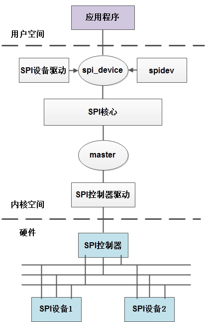

# spi_bus

## 0 修订记录
| 修订说明 | 日期 | 作者 | 额外说明 |
| --- |
| 初版 | 2018/04/10 | 员清观 |  |

## 1 基础
参考文档：<br>
	https://blog.csdn.net/droidphone/article/details/23367051

SPI是"Serial Peripheral Interface" 的缩写，是一种四线制的同步串行通信接口，用来连接微控制器、传感器、存储设备，SPI设备分为主设备和从设备两种，用于通信和控制的四根线分别是：
- CS    片选信号
- SCK  时钟信号
- MISO  主设备的数据输入、从设备的数据输出脚
- MOSI  主设备的数据输出、从设备的数据输入脚



**工作时序**

我们用CPOL表示时钟信号的初始电平的状态，CPOL为0表示时钟信号初始状态为低电平，为1表示时钟信号的初始电平是高电平。另外，我们用CPHA来表示在那个时钟沿采样数据，CPHA为0表示在首个时钟变化沿采样数据，而CPHA为1则表示要在第二个时钟变化沿来采样数据。内核用CPOL和CPHA的组合来表示当前SPI需要的工作模式：
- CPOL＝0，CPHA＝1        模式0
- CPOL＝0，CPHA＝1        模式1
- CPOL＝1，CPHA＝0        模式2
- CPOL＝1，CPHA＝1        模式3

**软件架构**

1. SPI控制器驱动程序
SPI控制器不用关心设备的具体功能，它只负责把上层协议驱动准备好的数据按SPI总线的时序要求发送给SPI设备，同时把从设备收到的数据返回给上层的协议驱动，因此，内核把SPI控制器的驱动程序独立出来。SPI控制器驱动负责控制具体的控制器硬件，诸如DMA和中断操作等等，因为多个上层的协议驱动可能会通过控制器请求数据传输操作，所以，SPI控制器驱动同时也要负责对这些请求进行队列管理，保证先进先出的原则。
2. SPI通用接口封装层
为了简化SPI驱动程序的编程工作，同时也为了降低协议驱动程序和控制器驱动程序的耦合程度，内核把控制器驱动和协议驱动的一些通用操作封装成标准的接口，加上一些通用的逻辑处理操作，组成了SPI通用接口封装层。这样的好处是，对于控制器驱动程序，只要实现标准的接口回调API，并把它注册到通用接口层即可，无需直接和协议层驱动程序进行交互。而对于协议层驱动来说，只需通过通用接口层提供的API即可完成设备和驱动的注册，并通过通用接口层的API完成数据的传输，无需关注SPI控制器驱动的实现细节。
3. SPI协议驱动程序 如m25p80
上面我们提到，控制器驱动程序并不清楚和关注设备的具体功能，SPI设备的具体功能是由SPI协议驱动程序完成的，SPI协议驱动程序了解设备的功能和通信数据的协议格式。向下，协议驱动通过通用接口层和控制器交换数据，向上，协议驱动通常会根据设备具体的功能和内核的其它子系统进行交互，例如，和MTD层交互以便把SPI接口的存储设备实现为某个文件系统，和TTY子系统交互把SPI设备实现为一个TTY设备，和网络子系统交互以便把一个SPI设备实现为一个网络设备，等等。当然，如果是一个专有的SPI设备，我们也可以按设备的协议要求，实现自己的专有协议驱动。
4. SPI通用设备驱动程序 spidev
有时候，考虑到连接在SPI控制器上的设备的可变性，在内核没有配备相应的协议驱动程序，对于这种情况，内核为我们准备了通用的SPI设备驱动程序，该通用设备驱动程序向用户空间提供了控制SPI控制的控制接口，具体的协议控制和数据传输工作交由用户空间根据具体的设备来完成，在这种方式中，只能采用同步的方式和SPI设备进行通信，所以通常用于一些数据量较少的简单SPI设备。


## 2 spi控制器驱动


### 2.1 初始化

**设备初始化**
```cpp
static struct imapx_spi_host_config imapx_spi_data = {
	.bus_id = 0,
	.num_chipselect = 1,
	.enable_dma = 1,
	.rt = 0,
	.quirk = SPIMUL_QUIRK_RXLEN_ALLIGN_8BYTES | SPIMUL_QUIRK_DMA_BYTESWAP,
	.dma_tx_param = (void *)IMAPX_SSP0_TX,
	.dma_rx_param = (void *)IMAPX_SSP0_RX,
	.dma_filter = pl022_filter,
  .extclk_rate = 60000000 /*20MHZ*/
};
static struct resource imapx_spi_resource[] = {
	[0] = {
			.start = IMAP_SPIMUL_BASE,
			.end   = IMAP_SPIMUL_BASE + IMAP_SPIMUL_SIZE - 1,
			.flags = IORESOURCE_MEM,
	},
	[1] = {
			.start = GIC_SPIMUL_ID,
			.end   = GIC_SPIMUL_ID,
			.flags = IORESOURCE_IRQ,
	}
};
struct platform_device imap_spi_device = {
	.name = "imapx-spi",
	.id = -1,
	.num_resources = ARRAY_SIZE(imapx_spi_resource),
	.resource = imapx_spi_resource,
	.dev = {
		.platform_data = &imapx_spi_data,
		.coherent_dma_mask = ~0,
	},
};
void __init q3f_init_devices(void)
	platform_add_devices(imap_devices, ARRAY_SIZE(imap_devices));
	|--> ret = platform_device_register(imap_spi_device);//int platform_device_register(struct platform_device *pdev)
```

**驱动初始化**
```cpp
static struct platform_driver imapx_spi_driver = {
	.driver = {
		.name = "imapx-spi",
		.pm = &imapx_spi_pm,
		.owner  = THIS_MODULE,
	},
	//.id_table = imapx_spi_ids, //设备树相关
	.probe  = imapx_spi_probe,
	.remove = imapx_spi_remove,
};
static int __init imapx_spi_init(void)
	return platform_driver_register(&imapx_spi_driver);
int imapx_spi_probe(struct platform_device *pdev)
	|--> struct spi_master *master = spi_alloc_master(&pdev->dev, sizeof(struct imapx_spi));
		// struct spi_master *spi_alloc_master(struct device *dev, unsigned size)
		struct spi_master	*master = kzalloc(size + sizeof *master, GFP_KERNEL);
		device_initialize(&master->dev);
		master->dev.class = &spi_master_class;master->dev.parent = get_device(dev);
		spi_master_set_devdata(master, &master[1]);
	host->irq = platform_get_irq(pdev, 0);
	struct resource *res = platform_get_resource(pdev, IORESOURCE_MEM, 0);
	host->base = devm_ioremap_resource(&pdev->dev, res);
	platform_set_drvdata(pdev, host);
	master->transfer_one_message = imapx_spi_transfer_one_message;
	host->busclk = clk_get_sys("spibus.0", "spibus0");	host->busclk_rate = clk_get_rate(host->busclk);
	clk_prepare_enable(host->busclk);
	host->extclk = clk_get_sys("imap-ssp", "ext-spi");	host->extclk_rate = clk_get_rate(host->extclk);
	clk_prepare_enable(host->extclk);
	imapx_spi_hwinit(host);
	imapx_spi_irq_mask(host, 1, SPI_INT_MASK_ALL);
	imapx_spi_dma_probe(host);
	|--> ret = spi_register_master(master);//int spi_register_master(struct spi_master *master)
		status = device_add(&master->dev);
		|--> status = spi_master_initialize_queue(master);//int spi_master_initialize_queue(struct spi_master *master)
			master->transfer = spi_queued_transfer;
			ret = spi_init_queue(master);
			ret = spi_start_queue(master);
		list_add_tail(&master->list, &spi_master_list);
		list_for_each_entry(bi, &board_list, list)	spi_match_master_to_boardinfo(master, &bi->board_info);//匹配mster和board
	imapx_spi_debugfs_init(host);
```

### 2.2 初始化
### 2.3 初始化
### 2.4 初始化


## 3 SPI通用接口层
我们知道，SPI通用接口层用于把具体SPI设备的协议驱动和SPI控制器驱动联接在一起，通用接口层除了为协议驱动和控制器驱动提供一系列的标准接口API，同时还为这些接口API定义了相应的数据结构，这些数据结构一部分是SPI设备、SPI协议驱动和SPI控制器的数据抽象，一部分是为了协助数据传输而定义的数据结构。另外，通用接口层还负责SPI系统与Linux设备模型相关的初始化工作<br>
SPI通用接口层的代码集中在：/drivers/spi/spi.c中。

### 3.1 初始化
通常地，根据linux设备模型的组织方式，各种设备会挂在合适的总线上，设备驱动和设备通过总线互相进行匹配，使得设备能够找到正确的驱动程序进行控制和驱动。同时，性质相似的设备可以归为某一个类的设备，它们具有某些共同的设备属性，在设备模型上就是所谓的class。SPI设备也不例外，它们也遵循linux的设备模型的规则

```cpp
static int spi_match_device(struct device *dev, struct device_driver *drv)
{
	const struct spi_device	*spi = to_spi_device(dev);
	const struct spi_driver	*sdrv = to_spi_driver(drv);
	/* Attempt an OF style match */
	if (of_driver_match_device(dev, drv))
		return 1;
	/* Then try ACPI */
	if (acpi_driver_match_device(dev, drv))
		return 1;
	if (sdrv->id_table)
		return !!spi_match_id(sdrv->id_table, spi);
	return strcmp(spi->modalias, drv->name) == 0;
}
struct bus_type spi_bus_type = {
  .name           = "spi",
  .dev_attrs      = spi_dev_attrs,
  .match          = spi_match_device,
  .uevent         = spi_uevent,
  .pm             = &spi_pm,
};
static struct class spi_master_class = {
  .name           = "spi_master",
  .owner          = THIS_MODULE,
  .dev_release    = spi_master_release,
};
//在sysfs中就会出现以下两个文件节点： sys/bus/spi sys/class/spi_master
static int __init spi_init(void)
  buf = kmalloc(SPI_BUFSIZ, GFP_KERNEL);
  status = bus_register(&spi_bus_type);//注册了一个名为spi的总线类型
  status = class_register(&spi_master_class);//为SPI控制器注册了一个名为spi_master的设备类  return 0;
postcore_initcall(spi_init);
```
代表spi总线的`spi_bus_type`结构的`match`字段指向了`spi_match_device`函数，该函数用于匹配spi总线上的设备和驱动

### 3.2 基本数据结构

```cpp
struct boardinfo {
	struct list_head	list;
	struct spi_board_info	board_info;
};
static LIST_HEAD(board_list);
static LIST_HEAD(spi_master_list);
static DEFINE_MUTEX(board_lock);
```

### 3.2.1 spi_master
| spi_master字段名称          | 描述                      |
|:----------------- | ------------------------- |
| struct device dev | spi控制器对应的device结构 |
| struct list_head list | 系统可能有多个控制器，用该链表链接在一个全局链表变量上(作为节点) |
| s16 bus_num | 	该控制器对应的spi总线编号，从0开始，通常由板级代码设定 |
| u16 num_chipselect | 	连接到该spi控制器的片选信号的个数 |
| u16 mode_bits | 	工作模式，由驱动解释该模式的意义 |
| u32 min_speed_hz | 	最低工作时钟 |
| u32 max_speed_hz | 	最高工作时钟 |
| u16 flags | 	用于设定某些限制条件的标志位 |
| int (*setup)(struct spi_device *spi) | 	回调函数，用于设置某个spi设备在该控制器上的工作参数 |
| int (*transfer)(......） | 	回调函数，用于把包含数据信息的mesg结构加入控制器的消息链表中 |
| void (*cleanup)(struct spi_device *spi) | 	回调函数，当spi_master被释放时，该函数被调用 |
| struct kthread_worker   kworker | 	用于管理数据传输消息队列的工人 |
| struct task_struct		*kworker_task; | kworker线程  |
| struct kthread_work     pump_messages | 	具体实现数据传输队列的工作队列 |
| spinlock_t			queue_lock; |   |
| struct list_head        queue | 	该控制器的消息队列，所有等待传输的消息队列挂在该链表下 |
| struct spi_message      *cur_msg  |	当前正带处理的消息队列 |
| bool				busy; | message pump is busy  |
| bool				running;  | message pump is running  |
| bool				rt;  | whether this queue is set to run as a realtime task  |
| int (*prepare_transfer_hardware)(......) | 	回调函数，正式发起传送前会被调用，用于准备硬件资源 |
| int (*transfer_one_message)(......)  |	单个消息的原子传送回调函数，队列中的每个消息都会调用一次该回调来完成传输工作 |
| int (*unprepare_transfer_hardware)(......) | 	清理回调函数 |
| int *cs_gpios  |	片选信号所用到的gpio |

spi_master结构通常由控制器驱动定义，然后通过以下通用接口层的API注册到系统中：
- int spi_register_master(struct spi_master *master);

### 3.2.2 spi_device

spi_device

| 字段 |  意义 |
|:--- |
| struct device  dev | 	代表该spi设备的device结构 |
| struct spi_master  |      *master 	指向该spi设备所使用的控制器 |
| u8      chip_select  |	在控制器中的片选引脚编号索引 |
| u32     max_speed_hz  |	该设备的最大工作时钟频率 |
| u16     mode  |	设备的工作模式，包括时钟格式，片选信号的有效电平等等 |
| u8      bits_per_word  |	设备每个单位数据所需要的比特数 |
| int     irq  |	设备使用的irq编号 |
| char    modalias[SPI_NAME_SIZE]  |	该设备的名字，用于spi总线和驱动进行配对 |
| int     cs_gpio  |	片选信号的gpio编号，通常不用我们自己设置，接口层会根据上面的chip_select字段在spi_master结构中进行查找并赋值 |

要完成向系统增加并注册一个SPI设备，我们还需要另一个数据结构：
```cpp
struct spi_board_info {
  char            modalias[SPI_NAME_SIZE];
  const void      *platform_data;
  void            *controller_data;
  int             irq;
  u32             max_speed_hz;
  u16             bus_num;
  u16             chip_select;
  u16             mode;
};
struct spi_driver {
	const struct spi_device_id *id_table;

	int			(*probe)(struct spi_device *spi);
	int			(*remove)(struct spi_device *spi);
	void			(*shutdown)(struct spi_device *spi);
	int			(*suspend)(struct spi_device *spi, pm_message_t mesg);
	int			(*resume)(struct spi_device *spi);
	struct device_driver	driver;
};
```
`id_table`字段用于指定该驱动可以驱动的设备名称，总线的匹配函数会把`id_table`中指定的名字和`spi_device`结构中的`modalias`字段进行比较，两者相符即表示匹配成功，然后触发`spi_driver`的`probe`回调函数被调用，从而完成驱动程序的初始化工作.

spi_board_info结构大部分字段和spi_device结构相对应，bus_num字段则用来指定所属的控制器编号，通过spi_board_info结构，我们可以有两种方式向系统增加spi设备
- 在SPI控制器驱动已经被加载后，我们使用通用接口层提供的如下API来完成：
    struct spi_device *spi_new_device(struct spi_master *master, struct spi_board_info *chip);
- 在板子的初始化代码中，定义一个spi_board_info数组，然后通过以下API注册spi_board_info：
    int spi_register_board_info(struct spi_board_info const *info, unsigned n);
    上面这个API会把每个spi_board_info挂在全局链表变量board_list上，并且遍历已经在系统中注册了的控制器，匹配上相应的控制器并取得它们的spi_master结构指针，最终也会通过spi_new_device函数添加SPI设备。因为spi_register_board_info可以在板子的初始化代码中调用，可能这时控制器驱动尚未加载，此刻无法取得相应的spi_master指针，不过不要担心，控制器驱动被加载时，一定会调用spi_register_master函数来注册spi_master结构，而spi_register_master函数会反过来遍历全局链表board_list上的spi_board_info，然后通过spi_new_device函数添加SPI设备。

```cpp
struct boardinfo {
	struct list_head	list;
	struct spi_board_info	board_info;
};
int spi_register_board_info(struct spi_board_info const *info, unsigned n)
  struct boardinfo *bi = kzalloc(n * sizeof(struct boardinfo), GFP_KERNEL);
  for (i = 0; i < n; i++, bi++, info++)
    struct spi_master *master;
    memcpy(&bi->board_info, info, sizeof(*info));
		mutex_lock(&board_lock);
		list_add_tail(&bi->list, &board_list);//添加到board_list链表
		list_for_each_entry(master, &spi_master_list, list)//在spi_master_list链表中找到匹配
			spi_match_master_to_boardinfo(master, &bi->board_info);
      - if (master->bus_num != bi->bus_num)
          struct spi_device *dev = spi_new_device(master, bi);
		mutex_unlock(&board_lock);

```
### 3.2.3 spi_driver
### 3.2.3 spi_board_info

### 3.2.4 spi_message spi_transfer
spi_master，spi_message，spi_transfer这几个数据结构的关系可以用下图来描述


spi_message包含了一个的spi_transfer结构序列，一旦控制器接收了一个spi_message，其中的spi_transfer应该按顺序被发送，并且不能被其它spi_message打断，所以我们认为spi_message就是一次SPI数据交换的原子操作

```cpp
struct spi_message {
  struct list_head        transfers;//spi_tranfer链表的head.
  struct spi_device       *spi;
  unsigned                is_dma_mapped:1;
  /* completion is reported through a callback */
  /*** 该message下的所有spi_transfer都被传输完成时被调用，以便通知
  * 协议驱动处理接收到的数据以及准备下一批需要发送的数据 */
  void                    (*complete)(void *context);

  void                    *context;
  unsigned                frame_length;
  unsigned                actual_length;
  int                     status;
  struct list_head        queue; //作为节点链接到spi_master的queue字段
  void                    *state;
};
```
```cpp
struct spi_transfer {
  /* tx_buf和rx_buf提供了非dma模式下的数据缓冲区地址 */
  const void      *tx_buf;
  void            *rx_buf;
  unsigned        len;
  /* tx_dma和rx_dma则给出了dma模式下的缓冲区地址 */
  dma_addr_t      tx_dma;
  dma_addr_t      rx_dma;
  unsigned        cs_change:1;
  u8              tx_nbits;
  u8              rx_nbits;
  u8              bits_per_word;
  u16             delay_usecs;
  u32             speed_hz;
  struct list_head transfer_list; //挂载节点
};
```

## 3.3 api接口

```cpp
/* 初始化，添加，删除功能，批量添加并且初始化功能*/
void spi_message_init(struct spi_message *m)
	memset(m, 0, sizeof *m);INIT_LIST_HEAD(&m->transfers);
void spi_message_add_tail(struct spi_transfer *t, struct spi_message *m)
	list_add_tail(&t->transfer_list, &m->transfers);
void spi_transfer_del(struct spi_transfer *t);
	list_del(&t->transfer_list);
void spi_message_init_with_transfers(struct spi_message *m, struct spi_transfer *xfers, unsigned int num_xfers)
	spi_message_init(m);
	for (i = 0; i < num_xfers; ++i)	spi_message_add_tail(&xfers[i], m);
//分配一个自带数个spi_transfer机构的spi_message：
struct spi_message *spi_message_alloc(unsigned ntrans, gfp_t flags);
	struct spi_message *m = kzalloc(sizeof(struct spi_message) + ntrans * sizeof(struct spi_transfer),flags);
	INIT_LIST_HEAD(&m->transfers);
	for (i = 0; i < ntrans; i++, t++)	spi_message_add_tail(t, m);
//发起一个spi_message的传送操作：
int spi_async(struct spi_device *spi, struct spi_message *message);　//异步版本

int spi_sync(struct spi_device *spi, struct spi_message *message);　//同步版本
```

总结一下，协议驱动发送数据的流程大致是这样的：
1. 定义一个spi_message结构；
2. 用spi_message_init函数初始化spi_message；
3. 定义一个或数个spi_transfer结构，初始化并为数据准备缓冲区并赋值给spi_transfer相应的字段（tx_buf，rx_buf等）；
4. 通过spi_message_init函数把这些spi_transfer挂在spi_message结构下；
5. 如果使用同步方式，调用spi_sync()，如果使用异步方式，调用spi_async()；

另外，通用接口层也为一些简单的数据传输提供了独立的API来完成上述的组合过程：
```cpp
int spi_write(struct spi_device *spi, const void *buf, size_t len);    ----    同步方式发送数据。
int spi_read(struct spi_device *spi, void *buf, size_t len);    ----    同步方式接收数据。
int spi_sync_transfer(struct spi_device *spi, struct spi_transfer *xfers, unsigned int num_xfers);    ----   同步方式，直接传送数个spi_transfer，接收和发送。
int spi_write_then_read(struct spi_device *spi, const void *txbuf, unsigned n_tx, void *rxbuf, unsigned n_rx);    ----    先写后读。
ssize_t spi_w8r8(struct spi_device *spi, u8 cmd);    ----    写8位，然后读8位。
ssize_t spi_w8r16(struct spi_device *spi, u8 cmd);    ----    写8位，然后读16位。
```

### 3.4

## 4 spi数据传输
SPI数据传输可以有两种方式：同步方式和异步方式。所谓同步方式是指数据传输的发起者必须等待本次传输的结束，期间不能做其它事情，用代码来解释就是，调用传输的函数后，直到数据传输完成，函数才会返回。而异步方式则正好相反，数据传输的发起者无需等待传输的结束，数据传输期间还可以做其它事情，用代码来解释就是，调用传输的函数后，函数会立刻返回而不用等待数据传输完成，我们只需设置一个回调函数，传输完成后，该回调函数会被调用以通知发起者数据传送已经完成。同步方式简单易用，很适合处理那些少量数据的单次传输。但是对于数据量大、次数多的传输来说，异步方式就显得更加合适。

对于SPI控制器来说，要支持异步方式必须要考虑以下两种状况：
1. 对于同一个数据传输的发起者，既然异步方式无需等待数据传输完成即可返回，返回后，该发起者可以立刻又发起一个message，而这时上一个message还没有处理完。
2. 对于另外一个不同的发起者来说，也有可能同时发起一次message传输请求。

### 4.1 spi_register_master

### 4.2
### 4.3
### 4.4
## 5 握手GPIO中断

xr871时序不会有大的影响，长期传输，可以考虑中间增加延时．
gpio中断依赖于先后顺序，需要先启动xr871，然后启动c20,这样c20开始是没有有效sem的，然后正常工作：
	１．先rw测试，xr871产生中断，c20成功发送．
	２．c20发送第一个packet,没有中断，阻塞，然后rw测试开始，xr871产生中断，c20 resume发送．
		或者，c20可以反复不断的发送，反正没有中断使能也会被阻塞住．


Q3F_EVB上GPIO21-RGB0_DATA18，链接到XR871_EVB上PA6
PA0123对应于白()绿橙黄


参考q3f数据手册，6.2 GPIO映射。
GPIO20　RGB0_DATA17
GPIO22　RGB0_DATA19


NOTE: 使用pin30 拉高，或者pin1拉低，测试GPIO中断。

### 5.1 GPIO模拟SPI接口:bitbang
linux内核已经写好了模拟SPI时序，你只需要配置好。就可以使用了
```cpp
config SPI_GPIO
tristate "GPIO-based bitbanging SPI Master"
depends on GENERIC_GPIO
select SPI_BITBANG
```

### 5.2

## 6 spidev ioctl


```cpp
//eric #include <linux/spi/spidev.h>

ioctl有九种cmd，分别对应不同的arg
a、设置或获取SPI工作模式
SPI_IOC_RD_MODE     //读 模式
SPI_IOC_WR_MODE     //写 模式
以上两种cmd对用arg是spi_device.mode
spi_device.mode有以下几种类型
//eric #define SPI_MODE_0 (0|0)//SCLK空闲时为低电平，第一个时间延采样
//eric #define SPI_MODE_1 (0|SPI_CPHA)//SCLK空闲时为高电平，第一个时间延采样
//eric #define SPI_MODE_2 (SPI_CPOL|0)//SCLK空闲时为低电平，第二个时间延采样
//eric #define SPI_MODE_3 (SPI_CPOL|SPI_CPHA)//SCLK空闲时为高电平，第二个时间延采样
//eric #define SPI_CS_HIGH 0x04//片选为高
//eric #define SPI_LSB_FIRST 0x08//低位数据先传输
//eric #define SPI_3WIRE 0x10//三线式，输入输出数据线为一条线
//eric #define SPI_LOOP 0x20//回环模式
//eric #define SPI_NO_CS 0x40//没有片选信号
//eric #define SPI_READY 0x80//
//用法：
mode = mode | SPI_MODE_0 | SPI_CS_HIGH | SPI_LSB_FIRST | SPI_LOOP
ioctl(fd, SPI_IOC_WR_MODE, &mode)；
//注意：前面四种是对SCK时钟信号空闲时的电平，和采样时刻的选择，四个只能选择其中一种，后面的五种可以用或的形式选择任意几个，使用方法如上

b、设置或获取SPI读写是从高位还是低位开始
SPI_IOC_RD_LSB_FIRST    //读 LSB
SPI_IOC_WR_LSB_FIRST    //写 LSB
以上两种cmd对用arg是spi_device.mode
用法：同上，但是mode类型只有SPI_LSB_FIRST一种

c、设置或获取SPI读写数据位数
SPI_IOC_RD_BITS_PER_WORD    //读 每字多少位
SPI_IOC_WR_BITS_PER_WORD    //写 每字多少位
以上两种cmd对用arg是spi_device.bits_per_word
用法：
bits = 8；
ioctl(fd, SPI_IOC_WR_BITS_PER_WORD, &bits);

d、设置或获取SPI读写的最大频率
SPI_IOC_RD_MAX_SPEED_HZ //读 最大速率
SPI_IOC_WR_MAX_SPEED_HZ //写 最大速率
以上两种cmd对用arg是spi_device.max_speed_hz
用法：
speed = 50*1000；
ioctl(fd, SPI_IOC_WR_MAX_SPEED_HZ, &speed);

e、传输数据
SPI_IOC_MESSAGE(n)      //传输n个数据包
以上一种cmd对用arg是spi_ioc_transfer
用法：全双工传输数据
struct spi_ioc_transfer {
  __u64               tx_buf;                   /* 写数据缓冲  */
  __u64               rx_buf;                   /* 读数据缓冲  */

  __u32               len;                      /* 缓冲的长度 */
  __u32               speed_hz;                 /* 通信的时钟频率 */

  __u16               delay_usecs;    /* 两个spi_ioc_transfer之间的延时 */
  __u8                 bits_per_word;           /* 字长（比特数）  */
  __u8                 cs_change;               /* 是否改变片选 */
  __u32               pad;
};

static volatile unsigned int writebuffer[SPI_BLOCK_SIZE/4];
static volatile unsigned int readbuffer[SPI_BLOCK_SIZE/4];

struct spi_ioc_transfer test_tr = {
	  .tx_buf = (unsigned long)writebuffer,
	  .rx_buf = (unsigned long)readbuffer,
	  .len = SPI_BLOCK_SIZE,
	  .delay_usecs = 0,
	  .speed_hz = 0,
	  .bits_per_word = 0,
	};
ret = ioctl(fd, SPI_IOC_MESSAGE(1), &tr);
```
