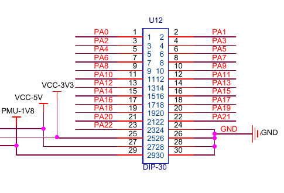

## xr871调试

## 0 修订记录
| 修订说明 | 日期 | 作者 | 额外说明 |
| --- |
| 初版 | 2018/04/10 | 员清观 |  |

## 1

## 2 xr871开发环境

## 3 p2p集成
xr871时序不会有大的影响，长期传输，可以考虑中间增加延时．
gpio中断依赖于先后顺序，需要先启动xr871，然后启动c20,这样c20开始是没有有效sem的，然后正常工作

## 4 q3f_evb与xr871_evb连接

q3f_evb电路图参考q3f_evb_aver_v0_1_0503.pdf

**xr871调试串口接口：**<br>

**Q3F_EVB_CON1**<br>

**Q3F_EVB_J11**<br>

**xr871_u12**<br>

**xr871_gpio_mapping**<br>


**spi总线连接：**<br>
c20 spi txd:
- Q3F_EVB配置：J11 RGB_SPI_TXD (C20-pin-SSP1_TXD)
  Q3F_EVB白色飞线
- XR871_EVB配置 U12 pin_1(PA0)

c20 spi rxd:
- Q3F_EVB配置：XCOMD19     (C20-pin-SSP1_RXD)
  Q3F_EVB绿色飞线
- XR871_EVB配置 U12 pin_2(PA1)

c20 spi clk:
- Q3F_EVB配置：J11 RGB_SPI_CLK (C20-pin-SSP1_CLK)
  Q3F_EVB橙色飞线
- XR871_EVB配置 U12 pin_3(PA2)

c20 spi cs:
- Q3F_EVB配置：J11 RGB_SPI_CSR (C20-pin-SSP1_CS)
  Q3F_EVB黄色飞线
- XR871_EVB配置 U12 pin_4(PA3)

**GPIO中断连接**<br>
- Q3F_EVB配置：CON1 RGB_D18 (C20-pin-RGB0_DATA18)为GPIO21中断
- XR871_EVB配置：U12 PA6 GPIO配置为输出，生成中断


参考q3f数据手册，6.2 GPIO映射：<br>

**公用地线**<br>
- Q3F_EVB CON1 pin_1
- XR871_EVB U12 pin_30

## 5 测试命令
### 5.1 基本测试范例
**接入自己路由器wlan**<br>
  net mode sta
	net sta config TP-LINK_5E87E6 12345678
	net sta enable
  //net iperf udp-send 192.168.0.83 -p 5002

### 5.2 test command
**网络连接命令：**<br>
	net sta config <ssid> [psk]	# 配置ssid和psk，并对相关设置选项进行通用型配置，可连接常见配置的AP。
	例子：net sta config Aw-Guest Aw.guest6699

**智能配网命令：**<br>
1. airkiss：手机安装AirKissDebugger.apk
  a. net airkiss set_key
      设置airkiss 密码加密密匙，执行此指令后设置密匙为12354567812345678，此时配网，需要将手机端设置相同的密匙。密匙仅加密密码。若不想加密可以不执行此指令，之间使用 net airkiss start。
  b. net airkiss start
      启动airkiss配网功能，配网结束后自动停止（无论是否成功），无需stop，默认超时时间120s
  c. net airkiss stop
      停止airkiss配网，执行后airkiss配网强制结束，返回无效结果

2. smartconfig：手机安装Xconfig.apk
  a. net smartconfig set_key
      功能与airkiss相同，但此密匙加密了ssid 与密码，airkiss仅加密密码。
  b. net smartconfig start
      与airkiss相同
  c. net smartconfig stop
      与airkiss相同

NOTE: xr871不支持HT40

**命令行测试音乐播放:**<br>
命令集：
	cedarx destroy
	cedarx play
	cedarx stop
	cedarx pause
	cedarx getpos
	cedarx setvol 8
	cedarx end

本地播放：
		cedarx create
		cedarx seturl file://music/ferry.mp3
		cedarx play
		cedarx stop
		cedarx destroy

http网络播放:
		cedarx create
		cedarx seturl http://sc1.111ttt.cn/2017/1/11/11/304112003137.mp3
		cedarx play
		cedarx stop
		cedarx destroy

### 5.3 wlan command
**切换模式(net mode <mode>)**
	- net mode sta					# 切换到STA模式
	- net mode ap						# 切换到softAP模式
	- net mode mon					# 切换到monitor模式

**STA模式**<br>
net sta config <ssid> [psk]						# 配置ssid和psk，并对相关设置选项进行通用型配置，可连接常见配置的AP。
	- net sta config "ssid_example"					# 可连接open模式的AP。
	- net sta config "ssid_example" "psk_example"			# 可连接WPA/WPA2（TKIP/CCMP）模式的AP。

net sta set <field> <value>						# 单独对一种设置选项进行配置。
	- net sta set ssid "ssid_example"
	- net sta set psk "psk_example"

		//# 配置wep_key，wep_key的有效形式（40bit或104bit）举例如下。
	- net sta set wep_key0 "abcde"					# 5位ASCII码（40bit）
	- net sta set wep_key1 "abcdefghijklm"				# 13位ASCII码（104bit）
	- net sta set wep_key2 0123456789				# 10位十六进制数（40bit）
	- net sta set wep_key3 0123456789abcdef0123456789		# 26位十六进制数（104bit）
	- net sta set wep_key_index (0, 1, 2, 3)

  //# 以下几个｛｝中的选项可多选，以空格间隔。
	- net sta set key_mgmt {WPA-PSK, NONE}				# OPEN、WEP模式：NONE。WPA、WPA2、WPA/WPA2模式：WPA-PSK。
	- net sta set pairwise {CCMP, TKIP, WEP40, WEP104, NONE}
	- net sta set group {CCMP, TKIP, WEP40, WEP104, NONE}
	- net sta set proto {WPA, RSN}
	- net sta set auth_alg {OPEN, SHARED}				# OPEN、WPA、WPA2、WPA/WPA2模式：OPEN。WEP模式：SHARED。

	- net sta set ptk_rekey <seconds>
	- net sta set scan_ssid (0, 1)					# 设置为1时，扫描隐藏ssid的AP。

net sta get <field>							# 获取一种设置选项的配置值。
	- net sta get ssid
	- net sta get psk
	- net sta get wep_key0
	- net sta get wep_key1
	- net sta get wep_key2
	- net sta get wep_key3
	- net sta get wep_key_index
	- net sta get key_mgmt
	- net sta get pairwise
	- net sta get group
	- net sta get proto
	- net sta get auth_alg
	- net sta get ptk_rekey
	- net sta get scan_ssid

net sta enable
net sta disable

net sta scan once							# 扫描一次
net sta scan result <num>						# 获取最多<num>个AP的扫描结果
	- net sta scan result 20
net sta bss flush <age>							# 移除扫描结果中，未使用的并且超过<age>秒没更新的AP。
	- net sta bss flush 0
	- net sta bss flash 10

net sta connect
net sta disconnect

net sta wps pbc								# 开始PBC模式的WPS流程。
net sta wps pin								# 获取一个合法的PIN值。
net sta wps pin <pin>							# 设置一个PIN值，若PIN值合法，则开始PIN模式的WPS流程。
	- net sta wps pin set 01234567

**softAP模式**<br>
net ap config <ssid> [psk]						# 配置ssid和psk，并对相关设置选项进行通用型配置，设置为常见配置的AP。
	- net ap config "ssid_example"					# 设置为OPEN模式的AP。
	- net ap config "ssid_example" "psk_example"			# 设置为WPA/WPA2（TKIP/CCMP）模式的AP。

net ap set <field> <value>						# 单独对一种设置选项进行配置。
	- net ap set ssid "ssid_example"
	- net ap set psk "psk_example"

									# 以下几个｛｝中的选项可多选，以空格间隔。
	- net ap set key_mgmt {WPA-PSK, NONE}				# OPEN模式：NONE。WPA、WPA2、WPA/WPA2模式：WPA-PSK。
	- net ap set wpa {CCMP, TKIP, NONE}
	- net ap set rsn {CCMP, TKIP, NONE}
	- net ap set proto <NONE, {WPA, RSN}>				# OPEN模式：NONE。WPA、WPA2、WPA/WPA2模式：{WPA, RSN}。
	- net ap set auth_alg {OPEN}

	- net ap set group_rekey <seconds>
	- net ap set strict_rekey <0, 1>				# 设置为1时，当有STA离开当前BSS时，更新GTK。
	- net ap set gmk_rekey <seconds>
	- net ap set ptk_rekey <seconds>
	- net ap set hw_mode <b, g>
	- net ap set 80211n <0, 1>
	- net ap set channel <1 ~ 13>
	- net ap set beacon_int <15 ~ 65535>
	- net ap set dtim <1 ~ 255>
	- net ap set max_num_sta <num>					# 设置同时连接AP的STA数量的上限

net ap get <field>							# 获取一种设置选项的配置值。
	- net ap get ssid
	- net ap get psk
	- net ap get key_mgmt
	- net ap get wpa
	- net ap get rsn
	- net ap get proto
	- net ap get auth_alg
	- net ap get group_rekey
	- net ap get strict_rekey
	- net ap get gmk_rekey
	- net ap get ptk_rekey
	- net ap get hw_mode
	- net ap get 80211n
	- net ap get channel
	- net ap get beacon_int
	- net ap get dtim
	- net ap get max_num_sta

net ap enable
net ap disable

net ap sta num								# 获取当前连接AP的STA的数量。
net ap sta info <num>							# 获取当前连接AP的最多<num>个STA的信息。

**iperf commands test**
```python
TCP RX
$ net iperf tcp-recv 192.168.51.1 0
> iperf.exe -f m -i 5 -c 192.168.51.100 -p 5004 -t 30

TCP TX
> iperf.exe -s -f m -i 5 -p 5004
$ net iperf tcp-send 192.168.51.101 30

UDP RX
$ net iperf udp-recv 192.168.51.100 30
> iperf.exe -u -f m -i 5 -c 192.168.51.100 -p 5002 -t 30 -b 10m

UDP TX
> iperf.exe -u -s -f m -i 5 -p 5002
$ net iperf udp-send 192.168.51.101 30

TCP RX
$ net iperf tcp-recv 192.168.118.198 0
> iperf.exe -f m -i 5 -c 192.168.118.139 -p 5004 -t 30
> iperf.exe -f m -i 5 -c 192.168.118.140 -p 5004 -t 30

TCP TX
> iperf.exe -s -f m -i 5 -p 5004
$ net iperf tcp-send 192.168.118.198 30

UDP RX
$ net iperf udp-recv 192.168.118.198 30
> iperf.exe -u -f m -i 5 -c 192.168.118.139 -p 5002 -t 30 -b 10m

UDP TX
> iperf.exe -u -s -f m -i 5 -p 5002
$ net iperf udp-send 192.168.118.198 30

iperf.exe -f m -i 5 -c 192.168.118.218 -p 5004 -t 30

net iperf tcp-recv 192.168.115.101 0
iperf.exe -f m -i 5 -c 192.168.115.102 -p 5004 -t 30
```
