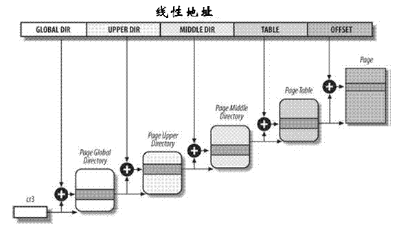

##

###  修订记录
| 修订说明 | 日期 | 作者 | 额外说明 |
| --- |
| 初版 | 2018/04/10 | 员清观 |  |

## 1


[另外一个文件](file://0.basic_format1.md)

cat /proc/zoneinfo
cat /proc/buddyinfo
sudo cat /proc/slabinfo
sudo cat /proc/vmallocinfo
cat /proc/pagetypeinfo

CONFIG_CMA_SIZE_SEL_MBYTES :: 32Mbytes 对应CMA的大小定义
CONFIG_DMA_API_DEBUG :: 开启dma_alloc的trace,不知道是否有用.

//#define KERN_EMERG	KERN_SOH "0"	/* system is unusable */
//#define KERN_ALERT	KERN_SOH "1"	/* action must be taken immediately */
//#define KERN_CRIT	KERN_SOH "2"	/* critical conditions */
//#define KERN_ERR	KERN_SOH "3"	/* error conditions */
//#define KERN_WARNING	KERN_SOH "4"	/* warning conditions */
//#define KERN_INFO	KERN_SOH "6"	/* informational */
//#define KERN_NOTICE	KERN_SOH "5"	/* normal but significant condition */
//#define KERN_DEBUG	KERN_SOH "7"	/* debug-level messages */

extern int memblock_debug;
//#define memblock_dbg(fmt, ...) \
	if (memblock_debug){ \
		printk(KERN_EMERG "@@@@@@@  %s,%d" , __func__, __LINE__); \
		printk(KERN_EMERG "@@@@@@@@@@@@@@@ [memblock]" pr_fmt(fmt), ##__VA_ARGS__); \
		}\

/* __GFP_WAIT表示分配内存的请求可以中断。也就是说，调度器在该请求期间可随意选择另一个过程执行，或者该请求可以被另一个更重要的事件中断. 分配器还可以在返回内存之前, 在队列上等待一个事件(相关进程会进入睡眠状态).
--->某些请求,是否可以多等等呢?


## 1.1 vmlinux.lds.s文件

```cpp
//.xx.xx : {} 段定义
//. = PAGE_OFFSET　定位到指定位置
//. = ALIGN(4); 字节对齐
//xxxx = .;　当前地址赋值到一个kernel中可以访问的变量
//可以使用外部定义的宏和目标文件中定义的符号，可以将全局变量直接设计定位

//include/asm_generic/vmlinux.lds.h 文件部分常用内容：

//对应所有的__setup("xxxx_name", xxxx_setup_func());定义，可以用来解析命令行中的xxxx_name参数，比如下面的定义:
	//Kernel command line: console=ttyAMA3,115200 lpj=567808 mem=62M rootfstype=ext4 root=/dev/mmcblk0p2 rw init=/init	//__setup("root=", root_dev_setup);
	//__setup("init=", init_setup);
	//__setup("rootfstype=", fs_names_setup);
	//__setup("rdinit=", rdinit_setup);
	//__setup("console=", console_setup);
	//__setup("lpj=", lpj_setup);
	//__setup("rw", readwrite);
	//__
//#define INIT_SETUP(initsetup_align)					\
		. = ALIGN(initsetup_align);				\
		VMLINUX_SYMBOL(__setup_start) = .;			\
		*(.init.setup)						\
		VMLINUX_SYMBOL(__setup_end) = .;
//#define INIT_CALLS_LEVEL(level)						\
		VMLINUX_SYMBOL(__initcall##level##_start) = .;		\
		*(.initcall##level##.init)				\
		*(.initcall##level##s.init)				\
//#define INIT_CALLS							\
		VMLINUX_SYMBOL(__initcall_start) = .;			\
		*(.initcallearly.init)					\
		INIT_CALLS_LEVEL(0)					\
		INIT_CALLS_LEVEL(1)					\
		INIT_CALLS_LEVEL(2)					\
		INIT_CALLS_LEVEL(3)					\
		INIT_CALLS_LEVEL(4)					\
		INIT_CALLS_LEVEL(5)					\
		INIT_CALLS_LEVEL(rootfs)				\
		INIT_CALLS_LEVEL(6)					\
		INIT_CALLS_LEVEL(7)					\
		VMLINUX_SYMBOL(__initcall_end) = .;
//#define BSS_SECTION(sbss_align, bss_align, stop_align)			\
	. = ALIGN(sbss_align);						\
	VMLINUX_SYMBOL(__bss_start) = .;				\
	SBSS(sbss_align)						\
	BSS(bss_align)							\
	. = ALIGN(stop_align);						\
	VMLINUX_SYMBOL(__bss_stop) = .;

//arch/arm/kernel/vmlinux.lds.S 文件主体部分．
OUTPUT_ARCH(arm)　//设置输出文件的arm
ENTRY(stext)　//stext的值设定为入口地址
jiffies = jiffies_64;
SECTIONS
{
	. = PAGE_OFFSET + TEXT_OFFSET; //定位，否则从0开始
	.head.text : {
		_text = .;
		HEAD_TEXT
	}
	.text : {			/* Real text segment		*/
		_stext = .;		/* Text and read-only data	*/
			__exception_text_start = .;
			*(.exception.text)
			__exception_text_end = .;
			IRQENTRY_TEXT
			TEXT_TEXT
			SCHED_TEXT
			LOCK_TEXT
			KPROBES_TEXT
			IDMAP_TEXT
			*(.fixup)
			*(.gnu.warning)
			*(.glue_7)
			*(.glue_7t)
		. = ALIGN(4);
		*(.got)			/* Global offset table		*/
			ARM_CPU_KEEP(PROC_INFO)
	}

	RO_DATA(PAGE_SIZE)

	. = ALIGN(4); //4字节对齐
	__ex_table : AT(ADDR(__ex_table) - LOAD_OFFSET) {
		__start___ex_table = .;
		*(__ex_table)
		__stop___ex_table = .;
	}

	/* * Stack unwinding tables */
	. = ALIGN(8);
	.ARM.unwind_idx : {
		__start_unwind_idx = .;
		*(.ARM.exidx*)
		__stop_unwind_idx = .;
	}
	.ARM.unwind_tab : {
		__start_unwind_tab = .;
		*(.ARM.extab*)
		__stop_unwind_tab = .;
	}

	NOTES

	_etext = .;			/* End of text and rodata section */

	. = ALIGN(PAGE_SIZE);
	__init_begin = .;

	INIT_TEXT_SECTION(8)
	.exit.text : {
		ARM_EXIT_KEEP(EXIT_TEXT)
	}
	.init.proc.info : {
		ARM_CPU_DISCARD(PROC_INFO)
	}
	.init.arch.info : {
		__arch_info_begin = .;
		*(.arch.info.init)
		__arch_info_end = .;
	}
	.init.tagtable : {
		__tagtable_begin = .;
		*(.taglist.init)
		__tagtable_end = .;
	}
	.init.pv_table : {
		__pv_table_begin = .;
		*(.pv_table)
		__pv_table_end = .;
	}
	.init.data : {
		INIT_DATA
		INIT_SETUP(16)
		INIT_CALLS
		CON_INITCALL
		SECURITY_INITCALL
		INIT_RAM_FS
	}
	.exit.data : {
		ARM_EXIT_KEEP(EXIT_DATA)
	}

//#ifdef CONFIG_SMP
	PERCPU_SECTION(L1_CACHE_BYTES)
//#endif

	__init_end = .;
	. = ALIGN(THREAD_SIZE);
	__data_loc = .;

	.data : AT(__data_loc) {
		_data = .;		/* address in memory */
		_sdata = .;

		/*
		 * first, the init task union, aligned
		 * to an 8192 byte boundary.
		 */
		INIT_TASK_DATA(THREAD_SIZE)

		NOSAVE_DATA
		CACHELINE_ALIGNED_DATA(L1_CACHE_BYTES)
		READ_MOSTLY_DATA(L1_CACHE_BYTES)

		/*
		 * and the usual data section
		 */
		DATA_DATA
		CONSTRUCTORS

		_edata = .;
	}
	_edata_loc = __data_loc + SIZEOF(.data);

	. = ALIGN(PAGE_SIZE);
	__sram_copy_in_dram = .;
	.sram IMAP_SRAM_VIRTUAL_ADDR : AT(__sram_copy_in_dram) {
		__sram_start = .;
		*(.sram.start);
		. = ALIGN(8);
		*(.sram.text);
		. = ALIGN(8);
		*(.sram.rodata);
		. = ALIGN(8);
		*(.sram.data);
		. = ALIGN(8);
		__sram_bss = .;
		*(.sram.bss);
		. = ALIGN(8);
		__sram_end = .;
	}
	. = __sram_copy_in_dram + SIZEOF(.sram);
	NOTES

	BSS_SECTION(0, 0, 0)
	_end = .;

	STABS_DEBUG
	.comment 0 : { *(.comment) }
}
```

## 2 关键全局数据结构

```cpp
struct bootmem_data;
typedef struct pglist_data {
	struct zone node_zones[MAX_NR_ZONES]; /* 包含了结点中各内存域的数据结构, 可能的区域类型用zone_type表示*/
	struct zonelist node_zonelists[MAX_ZONELISTS];/*  指点了备用结点及其内存域的列表，以便在当前结点没有可用空间时，在备用结点分配内存  我们的SMP系统UMA结构，不存在*/
	int nr_zones;/*  保存结点中不同内存域的数目    */
  struct page *node_mem_map;   /* 指向page实例数组的指针，用于描述结点的所有物理内存页，它包含了结点中所有内存域的页 */
  struct bootmem_data *bdata;　/* 在系统启动boot期间，内存管理子系统初始化之前，内核页需要使用内存（另外，还需要保留部分内存用于初始化内存管理子系统）为解决这个问题，内核使用了自举内存分配器，此结构用于这个阶段的内存管理  */
  unsigned long node_start_pfn; /*起始页面帧号，指出该节点在全局mem_map中的偏移，系统中所有的页帧是依次编号的，每个页帧的号码都是全局唯一的（不只是结点内唯一）在UMA系统中总是0， 因为系统中只有一个内存结点， 因此其第一个页帧编号总是0. */
	unsigned long node_present_pages; /* total number of physical pages 结点中页帧的数目　*/
	unsigned long node_spanned_pages; /* total size of physical page range, including holes */
	int node_id;　/*  全局结点ID，系统中的NUMA结点都从0开始编号 --- 无用 */
	nodemask_t reclaim_nodes;	/* Nodes allowed to reclaim from */
	wait_queue_head_t kswapd_wait;　/*  交换守护进程的等待队列，在将页帧换出结点时会用到。后面的文章会详细讨论 */
	wait_queue_head_t pfmemalloc_wait;
	struct task_struct *kswapd;	/* Protected by lock_memory_hotplug()，指向负责该结点的交换守护进程的task_struct, 在将页帧换出结点时会唤醒该进程，我们的UMA应该没有什么用处 */
	int kswapd_max_order;　/*  定义需要释放的区域的长度  */
	enum zone_type classzone_idx;
} pg_data_t;


```

在内存中，每个簇所对应的node又被分成的称为管理区(zone)的块，它们各自描述在内存中的范围。一个管理区(zone)由struct zone结构体来描述．zone对象用于跟踪诸如页面使用情况的统计数, 空闲区域信息和锁信息．里面保存着内存使用状态信息，如page使用统计, 未使用的内存区域，互斥访问的锁（LOCKS）等.
管理区的类型用zone_type表示,我们的系统中用到了：　<br>
- ZONE_NORMAL 	标记了可直接映射到内存段的普通内存域. 这是在所有体系结构上保证会存在的唯一内存区域, 但无法保证该地址范围对应了实际的物理地址. 例如, 如果AMD64系统只有两2G内存, 那么所有的内存都属于ZONE_DMA32范围, 而ZONE_NORMAL则为空；
- ZONE_MOVABLE 	内核定义了一个伪内存域ZONE_MOVABLE, 在防止物理内存碎片的机制memory migration中需要使用该内存域. 供防止物理内存碎片的极致使用
- ZONE_HIGHMEM 	896MB~物理内存结束，实际没有用到

```cpp
enum {
	MIGRATE_UNMOVABLE,
	MIGRATE_RECLAIMABLE,
	MIGRATE_MOVABLE,
	MIGRATE_PCPTYPES,	/* the number of types on the pcp lists */
	MIGRATE_RESERVE = MIGRATE_PCPTYPES,
	MIGRATE_CMA,
	MIGRATE_TYPES
};//内存迁移类型
static int fallbacks[MIGRATE_TYPES][4] = {
	[MIGRATE_UNMOVABLE]   = { MIGRATE_RECLAIMABLE, MIGRATE_MOVABLE,     MIGRATE_RESERVE },
	[MIGRATE_RECLAIMABLE] = { MIGRATE_UNMOVABLE,   MIGRATE_MOVABLE,     MIGRATE_RESERVE },
	[MIGRATE_MOVABLE]     = { MIGRATE_CMA,         MIGRATE_RECLAIMABLE, MIGRATE_UNMOVABLE, MIGRATE_RESERVE },
	[MIGRATE_CMA]         = { MIGRATE_RESERVE }, /* Never used */
	[MIGRATE_RESERVE]     = { MIGRATE_RESERVE }, /* Never used */
};
//[MIGRATE_MOVABLE]     = { MIGRATE_RECLAIMABLE, MIGRATE_UNMOVABLE, MIGRATE_RESERVE }, //如果禁止MOVABLE类型使用CMA
struct free_area {
	struct list_head	free_list[MIGRATE_TYPES];
	unsigned long		nr_free;
};
enum zone_watermarks {
	WMARK_MIN,	WMARK_LOW,	WMARK_HIGH,	NR_WMARK
};
//#define min_wmark_pages(z) (z->watermark[WMARK_MIN])
//#define low_wmark_pages(z) (z->watermark[WMARK_LOW])
//#define high_wmark_pages(z) (z->watermark[WMARK_HIGH])

struct zone {
  unsigned long watermark[NR_WMARK];//每个 zone 在系统启动时会计算出 3 个水位值, 分别为 WMAKR_MIN, WMARK_LOW, WMARK_HIGH 水位, 这在页面分配器和 kswapd 页面回收中会用到
  unsigned long percpu_drift_mark;
  unsigned long		lowmem_reserve[MAX_NR_ZONES];//zone 中预留的内存, 为了防止一些代码必须运行在低地址区域，所以事先保留一些低地址区域的内存
  unsigned long		dirty_balance_reserve;
  //这个数组用于实现每个CPU的热/冷页帧列表。内核使用这些列表来保存可用于满足实现的“新鲜”页。但冷热页帧对应的高速缓存状态不同：有些页帧很可能在高速缓存中，因此可以快速访问，故称之为热的；未缓存的页帧与此相对，称之为冷的，page管理的数据结构对象，内部有一个page的列表(list)来管理。每个CPU维护一个page list，避免自旋锁的冲突。这个数组的大小和NR_CPUS(CPU的数量）有关，这个值是编译的时候确定的
  struct per_cpu_pageset __percpu *pageset;
  spinlock_t		lock;
	int                     all_unreclaimable; /* All pages pinned */
  bool			compact_blockskip_flush;
  unsigned long		compact_cached_free_pfn;
	unsigned long		compact_cached_migrate_pfn;

  /* free areas of different sizes : 页面使用状态的信息，以每个bit标识对应的page是否可以分配，是用于伙伴系统的，每个数组元素指向对应阶也表的数组开头，以下是供页帧回收扫描器(page reclaim scanner)访问的字段，scanner会跟据页帧的活动情况对内存域中使用的页进行编目，如果页帧被频繁访问，则是活动的，相反则是不活动的，在需要换出页帧时，这样的信息是很重要的*/
  struct free_area	free_area[MAX_ORDER];　 //MAX_ORDER : 0 ~~ 10
	unsigned long		*pageblock_flags; //可以跟踪包含pageblock_nr_pages个页的内存区的属性
  spinlock_t		lru_lock; //LRU(最近最少使用算法)的自旋锁
	struct lruvec		lruvec;　//LRU 链表集合

	unsigned long		pages_scanned;	   /* since last reclaim */
	unsigned long		flags;		   /* zone flags, see below */
  atomic_long_t		vm_stat[NR_VM_ZONE_STAT_ITEMS]; //zone 计数
  unsigned int inactive_ratio;

  wait_queue_head_t	* wait_table;  /* 进程等待一个page释放的队列的散列表, 它会被wait_on_page()，unlock_page()函数使用. 用哈希表，而不用一个等待队列的原因，防止进程长期等待资源 */
	unsigned long		wait_table_hash_nr_entries; /*  等待队列散列表中的调度实体数目  */
	unsigned long		wait_table_bits; /*  等待队列散列表数组大小, 值为2^order  */

  struct pglist_data	*zone_pgdat; //指向这个zone所在的pglist_data对象
	/* zone_start_pfn == zone_start_paddr >> PAGE_SHIFT */
	unsigned long		zone_start_pfn;
  unsigned long		spanned_pages; //zone 中包含的页面数量
	unsigned long		present_pages; //zone 中实际管理的页面数量. 对一些体系结构来说, 其值和 spanned_pages 相等
	unsigned long		managed_pages; //zone 中被伙伴系统管理的页面数量
  const char		*name; //”Normal”
}____cacheline_internodealigned_in_smp;

typedef struct pglist_data pg_data_t;
unsigned long min_low_pfn; //系统可用的第一个pfn, 0, 对应pfn::0x40000
unsigned long max_low_pfn; //系统可用的最后一个PFN,0x3e00, 对应pfn::0x43e00, 0x3e00对应15872个实际的page
unsigned long max_pfn; //系统可用的最后一个PFN,0x3e00,arm_bootmem_free()调用后是0x40000+0x3e00
//PHYS_PFN_OFFSET :: 0x40000 页帧号开始偏移．
bootmem_data_t bootmem_node_data[MAX_NUMNODES] __initdata;
struct pglist_data __refdata contig_page_data = {	.bdata = &bootmem_node_data[0] };

int min_free_kbytes = 1024;
int min_free_order_shift = 1;
int extra_free_kbytes = 0;
static unsigned long __meminitdata nr_kernel_pages; //0x3d84 at end of free_area_init_core()
static unsigned long __meminitdata nr_all_pages;    //0x3d84 at end of free_area_init_core()
static unsigned long __meminitdata dma_reserve;     //0 always

//初始化zone的内存页
//在分配内存时, 如果必须”盗取”不同于预定迁移类型的内存区, 内核在策略上倾向于”盗取”更大的内存区. 由于所有页最初都是可移动的, 那么在内核分配不可移动的内存区时, 则必须”盗取”.实际上, 在启动期间分配可移动内存区的情况较少, 那么分配器有很高的几率分配长度最大的内存区, 并将其从可移动列表转换到不可移动列表. 由于分配的内存区长度是最大的, 因此不会向可移动内存中引入碎片.总而言之, 这种做法避免了启动期间内核分配的内存(经常在系统的整个运行时间都不释放)散布到物理内存各处, 从而使其他类型的内存分配免受碎片的干扰，这也是页可移动性分组框架的最重要的目标之一.
void __meminit memmap_init_zone(unsigned long size, int nid, unsigned long zone,unsigned long start_pfn, enum memmap_context context)

unsigned long max_mapnr;
struct page *mem_map; //页的数据结构对象都保存在mem_map全局数组中，该数组通常被存放在ZONE_NORMAL的首部，或者就在小内存系统中为装入内核映像而预留的区域之后。从载入内核的低地址内存区域的后面内存区域，也就是ZONE_NORMAL开始的地方的内存的页的数据结构对象，都保存在这个全局数组中

int __init kswapd_init(void)
  kswapd_run(nid);   //|--> pgdat->kswapd = kthread_run(kswapd, pgdat, "kswapd%d", nid);
  hotcpu_notifier(cpu_callback, 0);


```
## 2.1 内存初始化主流程

如果能知道当前函数运行时层次,就可以方便的打印trace信息了.

```cpp
//内存管理主干框架
struct meminfo meminfo;
static char __initdata cmd_line[COMMAND_LINE_SIZE];

void __init arm_bootmem_free(unsigned long min, unsigned long max_low, unsigned long max_high)
	zhol_size[0] = max_low - min; 	zhole_size[0] = max_low - min; //只有一个内存区域
  |--> free_area_init_node(0, zone_size, min, zhole_size);//void __paginginit free_area_init_node(int nid, unsigned long *zones_size, unsigned long node_start_pfn, unsigned long *zholes_size)
    pg_data_t *pgdat = NODE_DATA(nid);    pgdat->node_id = nid; pgdat->node_start_pfn = node_start_pfn; //从0开始的
    calculate_node_totalpages(pgdat, zones_size, zholes_size);//单个ZONE, MAX_NR_ZONES::2 pgdat->node_spanned_pages=pgdat->node_present_pages=15872pages对应62M,
    |--> alloc_node_mem_map(pgdat);//void alloc_node_mem_map(struct pglist_data *pgdat)
      start = pgdat->node_start_pfn & ~(MAX_ORDER_NR_PAGES - 1);//从0开始
			end = ALIGN(pgdat_end_pfn(pgdat), 0x400);//0x400对齐
      size =  (end - start) * sizeof(struct page);//(0x44000-0x4000)*32 = 0x80000 bytes (512k)
      |--> map = alloc_bootmem_node_nopanic(pgdat, size);//__alloc_bootmem_node_nopanic(pgdat, x, SMP_CACHE_BYTES, BOOTMEM_LOW_LIMIT),申请0x80000字节，并且0x40字节对齐(cacheline)
      mem_map = NODE_DATA(0)->node_mem_map = map + (pgdat->node_start_pfn - start);//pgdat:0xc0569724,mem_map：0xc06db000开始保存所有的struct page信息,有效的总15872page;设备映射的1.5M不需要PAGE结构管理.
    |--> free_area_init_core(pgdat, zones_size, zholes_size);//void __paginginit free_area_init_core(struct pglist_data *pgdat, unsigned long *zones_size, unsigned long *zholes_size)
			//初始化swapd线程;初始化zone数据结构.
      int nid = pgdat->node_id; unsigned long zone_start_pfn = pgdat->node_start_pfn;
      init_waitqueue_head(&pgdat->kswapd_wait);   init_waitqueue_head(&pgdat->pfmemalloc_wait);
      struct zone *zone = &pgdat->node_zones[0];//我们只有一个zone，而且内存地址中间没有hole
      zone->managed_pages = zone->present_pages  = zone->spanned_pages = size = zone_spanned_pages_in_node(nid, j, zones_size);//-->return zones_size[0];
			zone->zone_pgdat = pgdat;
      zone_pcp_init(zone); //-->zone->pageset = &boot_pageset;
			set_pageblock_order();
      setup_usemap(pgdat, zone, zone_start_pfn, size);
			ret = init_currently_empty_zone(zone, zone_start_pfn,size, MEMMAP_EARLY);
			|--> memmap_init_zone(size, nid, j, zone_start_pfn);//void __meminit memmap_init_zone(unsigned long size, int nid, unsigned long zone,	unsigned long start_pfn, enum memmap_context context)
				unsigned long end_pfn = start_pfn + size;	highest_memmap_pfn = end_pfn - 1;
				for (pfn = start_pfn; pfn < end_pfn; pfn++) //初步初始化每个struct page,设置迁移类型.
					page = pfn_to_page(pfn);
					set_page_links(page, zone, nid, pfn);//-->set_page_zone(page, zone);set_page_node(page, node);
					init_page_count(page);//-->atomic_set(&page->_count, 1);
					page_mapcount_reset(page);//-->atomic_set(&(page)->_mapcount, -1);
					SetPageReserved(page);
					set_pageblock_migratetype(page, MIGRATE_MOVABLE);//-->__set_bit(bitidx + start_bitidx, &zone->pageblock_flags);
void __init bootmem_init(void)
	find_limits(&min, &max_low, &max_high); //从memblock对应的meminfo结构中
	|--> arm_bootmem_init(min, max_low);//void arm_bootmem_init(unsigned long start_pfn,unsigned long end_pfn)
		boot_pages = bootmem_bootmap_pages(end_pfn - start_pfn);//计算mapping需要的管理页面的个数,每个page对应其中一个bit.
		bitmap = memblock_alloc_base(boot_pages << PAGE_SHIFT, L1_CACHE_BYTES,__pfn_to_phys(end_pfn));//分配管理内存,大概0x1000
		|--> init_bootmem_node(pgdat, __phys_to_pfn(bitmap), start_pfn, end_pfn);//--->init_bootmem_core(pgdat->bdata, freepfn, startpfn, endpfn);		//初始化bootmem,然后将memblock当前mem占用情况转换到bootmem机制::->//unsigned long __init init_bootmem_core(bootmem_data_t *bdata,unsigned long mapstart, unsigned long start, unsigned long end)
			bdata->node_bootmem_map = phys_to_virt(PFN_PHYS(mapstart));
			bdata->node_min_pfn = start;	bdata->node_low_pfn = end;
			link_bootmem(bdata);//void  link_bootmem(bootmem_data_t *bdata) //-->list_add_tail(&bdata->list, &bdata_list);
			mapsize = bootmap_bytes(end - start);
			memset(bdata->node_bootmem_map, 0xff, mapsize);
		for_each_memblock(memory, reg)	free_bootmem(__pfn_to_phys(start), (end - start) << PAGE_SHIFT);
		for_each_memblock(reserved, reg) reserve_bootmem(__pfn_to_phys(start),(end - start) << PAGE_SHIFT, BOOTMEM_DEFAULT);
	//arm_memory_present();		sparse_init();
	arm_bootmem_free(min, max_low, max_high); //max_low:: 0x40000, 页号
	max_low_pfn = max_low - PHYS_PFN_OFFSET;
	max_pfn = max_high - PHYS_PFN_OFFSET;

asmlinkage void __init start_kernel(void)
	page_address_init(); //实际是空函数
  setup_arch(&command_line);//void __init setup_arch(char **cmdline_p)
		setup_processor();//获取并且显示cpu 类型和cache等信息:　//CPU: ARMv7 Processor [410fc051] revision 1 (ARMv7), cr=50c53c7d	//CPU: PIPT / VIPT nonaliasing data cache, VIPT aliasing instruction cache
		//mdesc = setup_machine_fdt(__atags_pointer); 空函数，所以实际跳转到下面函数：
		|--> machine_desc = mdesc = setup_machine_tags(__atags_pointer, __machine_arch_type);//从__atags_pointer(0x40000100,0x100为偏移地址)中解析参数；然后获取boot_command_line；获取mdesc描述数据结构
			for_each_machine_desc(p)	if (machine_nr == p->nr) {	mdesc = p;	break;}//找到产品mdesc描述数据结构
			tags = phys_to_virt(__atags_pointer);	save_atags(tags);	parse_tags(tags);
			strlcpy(boot_command_line, from, COMMAND_LINE_SIZE);　return mdesc;
		init_mm.start_code = (unsigned long) _text;		init_mm.end_code   = (unsigned long) _etext;
		init_mm.end_data   = (unsigned long) _edata;  init_mm.brk	   = (unsigned long) _end;
		strlcpy(cmd_line, boot_command_line, COMMAND_LINE_SIZE);		*cmdline_p = cmd_line;
		parse_early_param(); //解析所有的early_param()定义, 现在看到的只有 : early_param("mem", early_mem);也许还会有early_param("cma", early_cma);early_param("initrd", early_initrd);early_param("loglevel", loglevel);
			|--> early_mem(char*p);//int __init early_mem(char *p)
				start = PHYS_OFFSET;	size  = memparse(p, &endp);
				|--> arm_add_memory(start, size);//int __init arm_add_memory(phys_addr_t start, phys_addr_t size)
					struct membank *bank = &meminfo.bank[meminfo.nr_banks];
					bank->start = PAGE_ALIGN(start); size -= start & ~PAGE_MASK;
					bank->size = size & ~(phys_addr_t)(PAGE_SIZE - 1);	meminfo.nr_banks++;//应该只有而且只需要考虑一个bank
					bank->highmem = 0;
		|--> sanity_check_meminfo();//void __init sanity_check_meminfo(void)
			meminfo.nr_banks = 1; high_memory = __va(arm_lowmem_limit - 1) + 1;　//0x43e00000-->0xc3e00000
			memblock_set_current_limit(arm_lowmem_limit);
		|--> arm_memblock_init(&meminfo, mdesc);//void arm_memblock_init(struct meminfo *mi, struct machine_desc *mdesc)
			memblock_add(mi->bank[0].start, mi->bank[0].size);//bankstart:40000000 banksize:3e00000,添加到 memblock.memory
			memblock_reserve(__pa(_stext), _end - _stext);//reserve代码和数据段
			arm_mm_memblock_reserve();//--> memblock_reserve(__pa(swapper_pg_dir), SWAPPER_PG_DIR_SIZE); 为mm管理页目录信息预留16k内存::0x40004000-->0x40008000
			arm_dt_memblock_reserve();//为设备树管理预留内存
			q3f_reserve();//为dsp预留-->memblock_reserve(arm_lowmem_limit, 0x180000);
			dma_contiguous_reserve(arm_lowmem_limit); //cma内存从0x41800000开始的32M
    |--> paging_init(mdesc);/* paging_init() sets up the page tables, initialises the zone memory maps, and sets up the zero page, bad page and bad page tables. */
      memblock_set_current_limit(arm_lowmem_limit); //设置memblock.current_limit = arm_lowmem_limit;
    	build_mem_type_table(); //设置mem_types[]数组
    	|--> prepare_page_table();//void prepare_page_table(void) 初始化之前分配的16k PMD页目录区域
				for ( addr = 0; addr < PAGE_OFFSET; addr += PMD_SIZE)	pmd_clear(pmd_off_k(addr));
				for (addr = __phys_to_virt(arm_lowmem_limit);addr < VMALLOC_START; addr += PMD_SIZE) pmd_clear(pmd_off_k(addr));
    	|--> map_lowmem();//void __init map_lowmem(void)
				map.pfn = __phys_to_pfn(start::0x40000000);	map.virtual = __phys_to_virt(start);//pfn::0x40000
				map.length = end - start;	//0x3e00000
				map.type = MT_MEMORY;
				|--> create_mapping(&map, false);//void create_mapping(struct map_desc *md, bool force_pages)
					addr = md->virtual & PAGE_MASK;	phys = __pfn_to_phys(md->pfn);
					length = PAGE_ALIGN(md->length + (md->virtual & ~PAGE_MASK));	end = addr + length;
					pgd = pgd_offset_k(addr); //计算虚拟地址对应的pgd开始地址, 本系统从0xc0007000开始
					|--> for(31) alloc_init_pud(pgd, addr, next, phys, type, force_pages); //调用了31次,产生31个pgd目录项,每个对应2M空间 //void __init alloc_init_pud(pgd_t *pgd, unsigned long addr,unsigned long end, unsigned long phys, const struct mem_type *type,bool force_pages)
						pud_t *pud = pud_offset(pgd, addr); //pud = pgd; 没有pud
						|--> alloc_init_pmd(pud, addr, next, phys, type, force_pages);//void __init alloc_init_pmd(pud_t *pud, unsigned long addr,unsigned long end, phys_addr_t phys, const struct mem_type *type, bool force_pages)
							pmd_t *pmd = pmd_offset(pud, addr);  //pmd = pud = pgd; 没有pmd
								__map_init_section(pmd, addr, next, phys, type); //force_pages为0 //*pmd = __pmd(phys | type->prot_sect);
								//alloc_init_pte(pmd, addr, next, __phys_to_pfn(phys), type);//force_pages为1
    	|--> dma_contiguous_remap();//void dma_contiguous_remap(void)
				map.pfn = __phys_to_pfn(start);		map.virtual = __phys_to_virt(start); //start:0x41800000 end:0x43800000
				map.length = end - start;		map.type = MT_MEMORY_DMA_READY;
				|--> iotable_init(&map, 1);//void __init iotable_init(struct map_desc *io_desc, int nr)
					struct static_vm *svm = early_alloc_aligned(sizeof(*svm) * nr::1, __alignof__(*svm));
					create_mapping(md, false);//最终会实际分配并初始化每个页表 --- > void __init alloc_init_pte(pmd_t *pmd, unsigned long addr, unsigned long end, unsigned long pfn,const struct mem_type *type)
							pte_t *start_pte = early_pte_alloc(pmd);//为页表分配4k空间.
							while() { set_pte_ext(pte, pfn_pte(pfn, __pgprot(type->prot_pte)), 0);pfn++; pte++; addr += PAGE_SIZE; }//512个页的偏移地址填充到页表对应的位置,总占用2k,
							early_pte_install(pmd, start_pte, type->prot_l1); //页表地址和属性信息填充pmd目录项, 每条512个页
					add_static_vm_early(svm);
    	|--> devicemaps_init(mdesc);//void __init devicemaps_init(struct machine_desc *mdesc)
				void *vectors = early_alloc(PAGE_SIZE);	early_trap_init(vectors);
				map.pfn = __phys_to_pfn(virt_to_phys(vectors));	map.virtual = 0xffff0000;
				map.length = PAGE_SIZE;	map.type = MT_HIGH_VECTORS; 	create_mapping(&map, false);
				|--> mdesc->map_io();//void __init q3f_map_io(void)
					iotable_init(imap_iodesc, ARRAY_SIZE(imap_iodesc));//struct map_desc imap_iodesc[]定义了芯片的几个寄存器bank区间,分别映射;每一个区间对应一个vm,添加到vmlist.
    	//|--> kmap_init();  	|--> tcm_init(); //好像没有做什么
    	top_pmd = pmd_off_k(0xffff0000);
    	zero_page = early_alloc(PAGE_SIZE);/* allocate the zero page. */
    	|--> bootmem_init();
    	empty_zero_page = virt_to_page(zero_page);
    	__flush_dcache_page(NULL, empty_zero_page); //skip this func
		|--> request_standard_resources(mdesc);//void request_standard_resources(struct machine_desc *mdesc)
			kernel_code.start   = virt_to_phys(_text);
			kernel_code.end     = virt_to_phys(_etext - 1);
			kernel_data.start   = virt_to_phys(_sdata);
			kernel_data.end     = virt_to_phys(_end - 1);
			struct resource *res = alloc_bootmem_low(sizeof(*res)); //分配一个结构体
			res->name  = "System RAM";
			res->start = __pfn_to_phys(memblock_region_memory_base_pfn(region));
			res->end = __pfn_to_phys(memblock_region_memory_end_pfn(region)) - 1;
			res->flags = IORESOURCE_MEM | IORESOURCE_BUSY;
			request_resource(&iomem_resource, res);
			request_resource(res, &kernel_code);
			request_resource(res, &kernel_data);
		arm_pm_restart = mdesc->restart;
		|--> mdesc->init_early();//void __init q3f_init_early(void)
			item_init(rbget("itemrrtb"), ITEM_SIZE_NORMAL);
			rtcbit_init();
	setup_command_line(command_line); //复制命令到 saved_command_line static_command_line
	//some cpu related code ...
	build_all_zonelists(NULL, NULL); page_alloc_init();parse_early_param();	parse_args(...); jump_label_init();
	setup_log_buf(0);	pidhash_init();	vfs_caches_init_early();	sort_main_extable();trap_init();
	mm_init();
    |--> mem_init();//void mem_init(void)
			max_mapnr   = pfn_to_page(max_pfn + PHYS_PFN_OFFSET) - mem_map;
			|--> totalram_pages += free_all_bootmem(); //释放pages -->total_pages += free_all_bootmem_core(bdata);				//unsigned long __init free_all_bootmem_core(bootmem_data_t *bdata)
				start = bdata->node_min_pfn;end = bdata->node_low_pfn;
				for(all page) __free_pages_bootmem(pfn_to_page(start), order);//空闲的page转交给zone管理.
		kmem_cache_init();//释放bootmem到伙伴系统,slab分配器初始化,之后内存分配需要使用slab和buddy的api
		percpu_init_late();		vmalloc_init(); //暂时不看
	kmem_cache_init_late();
	kmemleak_init();//内存泄露检测,暂时不看
	setup_per_cpu_pageset();//-->setup_zone_pageset(zone);-->setup_pageset(pcp, zone_batchsize(zone));
	anon_vma_init();	thread_info_cache_init();cred_init(); ...; //一系列init函数中,kmem_cache_create called to create slab
	ftrace_init();//内核诊断
	rest_init();

//void __init free_area_init(unsigned long *zones_size) //我们的系统中并没有被调用到
```

## 2.2 页访问相干

```cpp
//#define pgoff_t unsigned long
struct page {
	unsigned long flags; //用来存放页的状态，每一位代表一种状态，所以至少可以同时表示出32中不同的状态,这些状态定义在linux/page-flags.h中
	struct address_space *mapping; //指向与该页相关的address_space对象
	pgoff_t index; //在映射的虚拟空间（vma_area）内的偏移；一个文件可能只映射一部分，假设映射了1M的空间，index指的是在1M空间内的偏移，而不是在整个文件内的偏移
	atomic_t _mapcount; //被页表映射的次数，也就是说该page同时被多少个进程共享。初始值为-1，如果只被一个进程的页表映射了，该值为0. 如果该page处于伙伴系统
	unsigned long private;
};
　　::mapping  指定了页帧所在的地址空间, index是页帧在映射内部的偏移量. 地址空间是一个非常一般的概念. 例如, 可以用在向内存读取文件时. 地址空间用于将文件的内容与装载数据的内存区关联起来. mapping不仅能够保存一个指针, 而且还能包含一些额外的信息, 用于判断页是否属于未关联到地址空间的某个匿名内存区.如果mapping = 0，说明该page属于交换高速缓存页（swap cache）；当需要使用地址空间时会指定交换分区的地址空间swapper_space；如果mapping != 0，第0位bit[0] = 0，说明该page属于页缓存或文件映射，mapping指向文件的地址空间address_space；如果mapping != 0，第0位bit[0] != 0，说明该page为匿名映射，mapping指向struct anon_vma对象。通过mapping恢复anon_vma的方法：anon_vma = (struct anon_vma *)(mapping - PAGE_MAPPING_ANON)。
　　::index   是该页描述结构在地址空间radix树page_tree中的对象索引号即页号, 表示该页在vm_file中的偏移页数
　　::private 私有数据指针, 由应用场景确定其具体的含义：如果设置了PG_private标志，则private字段指向struct buffer_head；如果设置了PG_compound，则指向struct page；如果设置了PG_swapcache标志，private存储了该page在交换分区中对应的位置信息swp_entry_t；如果_mapcount = PAGE_BUDDY_MAPCOUNT_VALUE，说明该page位于伙伴系统，private存储该伙伴的阶

由page获取node和zone，老版本是page中保留指针，现在保留索引，节省内存．
static inline struct zone *page_zone(const struct page *page)
    return &NODE_DATA(page_to_nid(page))->node_zones[page_zonenum(page)];
static inline void set_page_zone(struct page *page, enum zone_type zone)
    page->flags &= ~(ZONES_MASK << ZONES_PGSHIFT);    page->flags |= (zone & ZONES_MASK) << ZONES_PGSHIFT;
static inline void set_page_node(struct page *page, unsigned long node)
    page->flags &= ~(NODES_MASK << NODES_PGSHIFT);    page->flags |= (node & NODES_MASK) << NODES_PGSHIFT;

page的flags标识主要分为4部分，其中标志位flag向高位增长, 其余位字段向低位增长，中间存在空闲位：<br>
- node 	NUMA节点号, 标识该page属于哪一个节点
- zone 	内存域标志，标识该page属于哪一个zone
- flag 	page的状态标识
	- PG_locked 	指定了页是否被锁定, 如果该比特未被置位, 说明有使用者正在操作该page, 则内核的其他部分不允许访问该页， 这可以防止内存管理出现竞态条件
	- PG_error 	如果涉及该page的I/O操作发生了错误, 则该位被设置
	- PG_referenced 	表示page刚刚被访问过
	- PG_uptodate 	表示page的数据已经与后备存储器是同步的, 即页的数据已经从块设备读取，且没有出错,数据是最新的
	- PG_dirty 	与后备存储器中的数据相比，该page的内容已经被修改. 出于性能能的考虑，页并不在每次改变后立即回写, 因此内核需要使用该标识来表明页面中的数据已经改变, 应该在稍后刷出
	- PG_lru 	表示该page处于LRU链表上， 这有助于实现页面的回收和切换. 内核使用两个最近最少使用(least recently used-LRU)链表来区别活动和不活动页. 如果页在其中一个链表中, 则该位被设置
	- PG_active 	page处于inactive LRU链表, PG_active和PG_referenced一起控制该page的活跃程度，这在内存回收时将会非常有用;当位于LRU active_list链表上的页面该位被设置, 并在页面移除时清除该位, 它标记了页面是否处于活动状态
	- PG_slab 	该page属于slab分配器
	- PG_writeback 	page中的数据正在被回写到后备存储器
	- PG_swapcache 	表示该page处于swap cache中
	- PG_reclaim 	表示该page要被回收。当PFRA决定要回收某个page后，需要设置该标志
	- PG_mappedtodisk 	表示page中的数据在后备存储器中有对应
	- PG_swapbacked 	该page的后备存储器是swap
	- PG_unevictable 	该page被锁住，不能交换，并会出现在LRU_UNEVICTABLE链表中，它包括的几种page：ramdisk或ramfs使用的页, shm_locked、mlock锁定的页
	- PG_mlocked 	该page在vma中被锁定，一般是通过系统调用mlock()锁定了一段内存
	- ...

void wait_on_page_locked(struct page *page)
	if (PageLocked(page))
		|--> wait_on_page_bit(page, PG_locked);//void wait_on_page_bit(struct page *page, int bit_nr)
			DEFINE_WAIT_BIT(wait, &page->flags, bit_nr);
			if (test_bit(bit_nr, &page->flags))
				__wait_on_bit(page_waitqueue(page), &wait, sleep_on_page, TASK_UNINTERRUPTIBLE);
void wait_on_page_writeback(struct page *page)
	if (PageWriteback(page))
		wait_on_page_bit(page, PG_writeback);
```

**q3f内存映射空间解析**<br>
```cpp
phys_addr_t arm_lowmem_limit; //0x43e00000 物理地址的上边界
void * high_memory; //0xc3e00000 high_memory = __va(arm_lowmem_limit - 1) + 1;

临时映射线性地址空间   fixmap  : 0xfff00000 - 0xfffe0000   ( 896 kB)
//#define FIXADDR_START		0xfff00000UL
//#define FIXADDR_TOP		0xfffe0000UL
//#define FIXADDR_SIZE		(FIXADDR_TOP - FIXADDR_START)
vmalloc : 0xc4000000 - 0xff000000   ( 944 MB) //当前系统实际对应物理内存映射后面8M对齐的地方//vmalloc()函数用来把不连续的物理地址空间映射到此范围内连续的线性地址空间上
//#define VMALLOC_OFFSET		(8*1024*1024) //防止访问越界．
//#define VMALLOC_START		(((unsigned long)high_memory + VMALLOC_OFFSET) & ~(VMALLOC_OFFSET-1))
//#define VMALLOC_END		0xff000000UL
//mem_map：0xc06db000开始保存页表,有效15872page
	-->kernel部分，大概7Mbytes
	.bss : 0xc056b330 - 0xc06da3c0   (1469 kB)
	//(__bss_start, __bss_stop)
	.data : 0xc04dc000 - 0xc056a260   ( 569 kB)　//struct pglist_data *zone_pgdat:0xc0569724包含在data段中
	//(_sdata, _edata)
	.init : 0xc04c2000 - 0xc04da844   (  99 kB)
	//(__init_begin, __init_end)
	.text : 0xc0008000 - 0xc04c1860   (4839 kB)
	//(_text, _etext)
lowmem  : 0xc0000000 - 0xc3e00000   (  62 MB)
//#define PAGE_OFFSET 0xc0000000
//#high_memory :: 0xc3e00000
modules : 0xbf800000 - 0xc0000000   (   8 MB)
//#define MODULES_VADDR		(PAGE_OFFSET - SZ_8M)
接着需要打印：
物理内存开始：　PHYS_OFFSET

//#define PHYS_OFFSET	PLAT_PHYS_OFFSET
mach-q3f/include/mach/memory.h:14:      #define PLAT_PHYS_OFFSET	UL(0x40000000)
mach-q3f/include/mach/imap-iomap.h:10:  #define IMAP_SDRAM_BASE		0x40000000
//#define ___RBASE   phys_to_virt(IMAP_SDRAM_BASE + 0x3800000) 寄存器地址空间
//#define PHYS_PFN_OFFSET	(PHYS_OFFSET >> PAGE_SHIFT)     ::0x40000
//#define ARCH_PFN_OFFSET		PHYS_PFN_OFFSET								::0x40000

virt_to_page(addr)产生线性地址对应的页描述符地址。pfn_to_page(pfn)产生对应页框号的页描述符地址
//#define __virt_to_phys(x)	((x) - PAGE_OFFSET + PHYS_OFFSET)
//#define __phys_to_virt(x)	((x) - PHYS_OFFSET + PAGE_OFFSET)
//#define __pa(x)			__virt_to_phys((unsigned long)(x))
//#define __va(x)			((void *)__phys_to_virt((unsigned long)(x)))
//#define pfn_to_kaddr(pfn)	__va((pfn) << PAGE_SHIFT)

//#if defined(CONFIG_FLATMEM)
//#define __pfn_to_page(pfn)	(mem_map + ((pfn) - ARCH_PFN_OFFSET))
//#define __page_to_pfn(page)	((unsigned long)((page) - mem_map) + ARCH_PFN_OFFSET)
//#define page_to_pfn __page_to_pfn
//#define pfn_to_page __pfn_to_page
//#endif

//#define virt_to_page(kaddr)	pfn_to_page(__pa(kaddr) >> PAGE_SHIFT)
//#define virt_addr_valid(kaddr)	((unsigned long)(kaddr) >= PAGE_OFFSET && (unsigned long)(kaddr) < (unsigned long)high_memory)cgroup_init_early
//#define page_to_phys(page)      ((dma_addr_t)page_to_pfn(page) << PAGE_SHIFT)
//#define page_to_virt(page)	pfn_to_virt(page_to_pfn(page))

//启动进程的过程中需要为进程分配内存，sys_execve() --> SYSCALL_DEFINE3(execve...) --> do_execve() --> do_execve_common --> bprm_mm_init()
int bprm_mm_init(struct linux_binprm *bprm)
	struct mm_struct *mm = bprm->mm = mm_alloc();
		struct mm_struct *mm = allocate_mm(); //kmem_cache_alloc(mm_cachep, GFP_KERNEL) 从mm_cachep的slab中分配
		mm_init_cpumask(mm);
		|--> return mm_init(mm, current);//struct mm_struct *mm_init(struct mm_struct *mm, struct task_struct *p)
			|--> mm_alloc_pgd(mm);//int mm_alloc_pgd(struct mm_struct *mm)
  			 mm->pgd = pgd_alloc(mm);
			mmu_notifier_mm_init(mm);	return mm;
	err = init_new_context(current, mm);
	err = __bprm_mm_init(bprm);

pgd_t 用于全局页目录项；pte_t 用于直接页目录项

根据虚拟地址获取物理页的示例代码详见mm/memory.c中的函数　follow_page()

//添加内存条
//#define NR_BANKS	CONFIG_ARM_NR_BANKS linux-menuconfig 中配置内存条个数
struct membank {
	phys_addr_t start;	phys_addr_t size;	unsigned int highmem;
};
struct meminfo meminfo;
int __init early_mem(char *p)
	start = PHYS_OFFSET;	size  = memparse(p, &endp); //地址0x40000000
	|--> arm_add_memory(start, size);//int __init arm_add_memory(phys_addr_t start, phys_addr_t size)
		struct membank *bank = &meminfo.bank[meminfo.nr_banks]; //
		bank->start = PAGE_ALIGN(start);bank->size = size & ~(phys_addr_t)(PAGE_SIZE - 1);
		meminfo.nr_banks++;
early_param("mem", early_mem);
```

**虚拟地址访问和页表操作**<br>
**arm段页机制，图非常不错**<br>
	http://lib.csdn.net/article/operatingsystem/18924
	https://www.aliyun.com/jiaocheng/155843.html
	https://www.cnblogs.com/arnoldlu/p/8087022.html
	https://blog.csdn.net/hnzziafyz/article/details/52201793
	https://blog.csdn.net/qq_25865859/article/details/59105701
	https://blog.csdn.net/stillvxx/article/details/41122999
	https://blog.csdn.net/gatieme/article/details/52403013

```cpp
我们的系统使用的是二级页表，对应的头文件是：　pgtable-2level.h 使用PGD和PTE
//#define PGDIR_SHIFT		21	//确定页全局页目录项能映射的区域大小的位数
//#define PGDIR_SIZE		(1UL << PGDIR_SHIFT) //用于计算页全局目录中一个单独表项所能映射区域的大小
//#define PGDIR_MASK		(~(PGDIR_SIZE-1)) //用于屏蔽Offset, Table，Middle Air及Upper Air的所有位

//#define PMD_SHIFT		21
//#define PMD_SIZE		(1UL << PMD_SHIFT)
//#define PMD_MASK		(~(PMD_SIZE-1))

//1.pgd_offset 	根据当前虚拟地址和当前进程的mm_struct获取pgd项
//#define pgd_index(addr)		((addr) >> PGDIR_SHIFT)
//#define pgd_offset(mm, addr)	((mm)->pgd + pgd_index(addr))
//2.pud_offset 	在两级或三级分页系统中，该宏产生 pgd ，即一个页全局目录项的地址
static inline pud_t * pud_offset(pgd_t * pgd, unsigned long address)
	return (pud_t *)pgd;
//3.pmd_offset 	根据通过pgd_offset获取的pgd 项和虚拟地址，获取相关的pmd项(即pte表的起始地址)
static inline pmd_t * pmd_offset(pud_t * pud, unsigned long address)
	return (pmd_t *)pud;
//4.pte_offset 	根据通过pmd_offset获取的pmd项和虚拟地址，获取相关的pte项(即物理页的起始地址)

//统一的内存分配函数入口
struct page *__alloc_pages(gfp_t gfp_mask, unsigned int order, struct zonelist *zonelist)
//根据虚拟地址获取物理页
struct page *follow_page_mask(struct vm_area_struct *vma,　unsigned long address, unsigned int flags, unsigned int *page_mask)
```


**创建新进程内存映射过程**<br>
首先要为新进程创建一个新的页面目录PGD到task_struct.(struct mm_struct)mm->pgd，并从内核的页面目录swapper_pg_dir中复制内核区间页面目录项至新建进程页面目录PGD的相应位置，具体过程如下：do_fork() –> copy_mm() –> mm_init() –> pgd_alloc() –> set_pgd_fast() –> get_pgd_slow() –> memcpy(&PGD + USER_PTRS_PER_PGD, swapper_pg_dir + USER_PTRS_PER_PGD, (PTRS_PER_PGD - USER_PTRS_PER_PGD) * sizeof(pgd_t))；这样一来，每个进程的页面目录就分成了两部分，第一部分为“用户空间”，用来映射其整个进程空间（0x0000 0000－0xBFFF FFFF）即3G字节的虚拟地址；第二部分为“系统空间”，用来映射（0xC000 0000－0xFFFF FFFF）1G字节的虚拟地址。可以看出Linux系统中每个进程的页面目录的第二部分是相同的，所以从进程的角度来看，每个进程有4G字节的虚拟空间

## 2.6 memblock管理

memblock_add()函数只被调用一次,参数(base:40000000 size:3e00000),在arm_memblock_init()函数中.

## 2.6 伙伴系统
**伙伴系统文档**<br>
	https://blog.csdn.net/vanbreaker/article/details/7605367

有种场景比较重要,如果当前迁移类型中找不到刚好合适的,而必须切分上一级的area,这时候,寻找fallbacks中,还是切分? 有时候,分的区域太多,也不好,导致更多的外部碎片.

CMA 好像是

```cpp
struct page *get_page_from_freelist(gfp_t gfp_mask, nodemask_t *nodemask, unsigned int order,	struct zonelist *zonelist, int high_zoneidx, int alloc_flags, struct zone *preferred_zone, int migratetype)

bool __zone_watermark_ok(struct zone *z, int order, unsigned long mark, int classzone_idx, int alloc_flags, long free_pages)

struct page *__alloc_pages_nodemask(gfp_t gfp_mask, unsigned int order, struct zonelist *zonelist, nodemask_t *nodemask)
	enum zone_type high_zoneidx = gfp_zone(gfp_mask);//根据gfp_mask确定分配页所处的管理区
	int migratetype = allocflags_to_migratetype(gfp_mask);//根据gfp_mask得到迁移类分配页的型
	int alloc_flags = ALLOC_WMARK_LOW|ALLOC_CPUSET;
	if (allocflags_to_migratetype(gfp_mask) == MIGRATE_MOVABLE)		alloc_flags |= ALLOC_CMA;
  page = get_page_from_freelist(gfp_mask|__GFP_HARDWALL, nodemask, order,	zonelist, high_zoneidx, alloc_flags,	preferred_zone, migratetype);  //从zonelist中找到zone_idx与high_zoneidx相同的管理区，也就是之前认定的管理区
	if (unlikely(!page))
		page = __alloc_pages_slowpath(gfp_mask, order,zonelist, high_zoneidx, nodemask,preferred_zone, migratetype);//第一次分配失败的话则会用通过一条低速路径来进行第二次分配，包括唤醒页换出守护进程等等

void __free_pages(struct page *page, unsigned int order)

struct page *buffered_rmqueue(struct zone *preferred_zone, struct zone *zone, int order, gfp_t gfp_flags, int migratetype)

```

## 2.7 CMA定义
arm_dma_alloc() 函数,如果从dev的cma中分配,应该不需要伙伴机制的加入,单纯的使用bitmap机制管理就好了;如果从全局的cma中分配,需要伙伴机制的配合管理.
```cpp
ret = dma_declare_contiguous(&da8xx_dsp.dev, rproc_size, rproc_base, 0); 为设备分配cma内存
void __init arm_memblock_init(struct meminfo *mi, struct machine_desc *mdesc)
	|--> dma_contiguous_reserve(min(arm_dma_limit, arm_lowmem_limit));//void __init dma_contiguous_reserve(phys_addr_t limit)
		dma_declare_contiguous(NULL, selected_size, 0, limit);

```
可以查询使能 CONFIG_CMA_DEBUG_BITMAP 来打印cma的相关调试内容.

dma_contiguous_default_area

是否CMA机制中可以增加内存碎片合并的算法,这样就算在别的块找不到可以move的目标地点,也可以在CMA内部节省出来.

**命令行中传递大小**<br>

```cpp
struct cma *dma_contiguous_default_area;

static inline struct cma *dev_get_cma_area(struct device *dev)
	if (dev && dev->cma_area)		return dev->cma_area;
	return dma_contiguous_default_area;
static inline void dev_set_cma_area(struct device *dev, struct cma *cma)
	if (dev)		dev->cma_area = cma;
	if (!dev && !dma_contiguous_default_area)		dma_contiguous_default_area = cma;

//#define CMA_SIZE_MBYTES 	CONFIG_CMA_SIZE_MBYTES //CONFIG_CMA_SIZE_MBYTES为.config中配置,当前为32M
static const phys_addr_t size_bytes = CMA_SIZE_MBYTES * SZ_1M;
static phys_addr_t size_cmdline = -1;
int __init early_cma(char *p)
	size_cmdline = memparse(p, &p);
early_param("cma", early_cma);

void __init dma_contiguous_reserve(phys_addr_t limit)//在所有的module init之前调用,预留的系统cma.
	if (size_cmdline != -1) selected_size = size_cmdline;
	else selected_size = size_bytes;
	|--> dma_declare_contiguous(NULL, selected_size, 0, limit);//int __init dma_declare_contiguous(struct device *dev, phys_addr_t size, phys_addr_t base, phys_addr_t limit)
		struct cma_reserved *r = &cma_reserved[cma_reserved_count];
		alignment = PAGE_SIZE << max(MAX_ORDER - 1, pageblock_order);
		base = __memblock_alloc_base(size, alignment, limit); //申请一块32M连续空间,保持8M对齐.
		r->start = base;	r->size = size;	r->dev = dev;
		cma_reserved_count++;
		dma_contiguous_early_fixup(base, size);//没看出来有什么特别的作用.

//#define MAX_CMA_AREAS	(1 + CONFIG_CMA_AREAS)//1+7 = 8
static struct cma_reserved {
	phys_addr_t start;
	unsigned long size;
	struct device *dev;
} cma_reserved[MAX_CMA_AREAS] __initdata;
static unsigned cma_reserved_count __initdata;

static int __init cma_init_reserved_areas(void)
	struct cma_reserved *r = cma_reserved;  unsigned i = cma_reserved_count;
	for (; i; --i, ++r)
		|--> cma = cma_create_area(PFN_DOWN(r->start), r->size >> PAGE_SHIFT);//struct cma *cma_create_area(unsigned long base_pfn, unsigned long count)
			int bitmap_size = BITS_TO_LONGS(count) * sizeof(long);
			cma = kmalloc(sizeof *cma, GFP_KERNEL);cma->base_pfn = base_pfn;cma->count = count;
			cma->bitmap = kzalloc(bitmap_size, GFP_KERNEL);
			ret = cma_activate_area(base_pfn, count);
		dev_set_cma_area(r->dev, cma);
core_initcall(cma_init_reserved_areas);
```

## 2.8 slab分配器

**创建per_cpu**<br>
```cpp
struct per_cpu_pages {
	int count;		/* number of pages in the list，记录了与该列表相关的页的数目　*/
	int high;		/* high watermark, emptying needed，是一个水印. 如果count的值超过了high, 则表明列表中的页太多了 */
	int batch;		/* chunk size for buddy add/remove，如果可能, CPU的高速缓存不是用单个页来填充的, 而是欧诺个多个页组成的块, batch作为每次添加/删除页时多个页组成的块大小的一个参考值 */
	struct list_head lists[MIGRATE_PCPTYPES];/* Lists of pages, one per migrate type stored on the pcp-lists，一个双链表, 保存了当前CPU的冷页或热页, 可使用内核的标准方法处理 */
};
struct per_cpu_pageset {
	struct per_cpu_pages pcp; //这维护了链表中目前已有的一系列页面, 高极值和低极值决定了何时填充该集合或者释放一批页面, 变量决定了一个块中应该分配多少个页面, 并最后决定在页面前的实际链表中分配多少各页面
};
//zone结构体中，struct per_cpu_pageset __percpu *pageset;
在内核中只有一个子系统会积极的尝试为任何对象维护per-cpu上的list链表, 这个子系统就是slab分配器.

static DEFINE_PER_CPU(struct per_cpu_pageset, boot_pageset);
static __meminit void zone_pcp_init(struct zone *zone)
  zone->pageset = &boot_pageset;
```


```cpp
提供小内存块不是slab分配器的唯一任务. 由于结构上的特点. 它也用作一个缓存. 主要针对经常分配并释放的对象. 通过建立slab缓存, 内核能够储备一些对象, 供后续使用, 即使在初始化状态, 也是如此.

建立和使用缓存的任务不是特别困难. 必须首先用kmem_cache_create建立一个适当的缓存, 接下来即可使用kmem_cache_alloc和kmem_cache_free分配和释放其中包含的对象。slab分配器负责完成与伙伴系统的交互，来分配所需的页.
所有活动缓存的列表保存在/proc/slabinfo

int __kmem_cache_create (struct kmem_cache *cachep, unsigned long flags)
void *kmem_cache_alloc(struct kmem_cache *cachep, gfp_t flags)
void kmem_cache_free(struct kmem_cache *cachep, void *objp)
void kmem_cache_destroy(struct kmem_cache *s)

void *vmalloc(unsigned long size)
void vfree(const void *addr)
```

```cpp
pg_data_t 中　struct zone node_zones[MAX_NR_ZONES];//对应一个内存node, 这个node包含多个zone
enum node_states, 我们系统，node状态应该是  N_NORMAL_MEMORY
```
## 3
**linux内存管理浅析**<br>
  zone和vma的部分，值得参考
  https://blog.csdn.net/ctthuangcheng/article/details/8915146

**基本概念描述的很好**<br>
  https://blog.csdn.net/goodluckwhh/article/details/9970845
  https://blog.csdn.net/goodluckwhh/article/details/9989695

https://blog.csdn.net/Tommy_wxie/article/details/17122923

**内存管理和进程管理系列文档**<br>
  https://www.cnblogs.com/arnoldlu/p/8060121.html
  http://www.cnblogs.com/arnoldlu/p/8467142.html

**用户空间动态内存管理**<br>
     malloc是libc的库函数，用户程序一般通过它（或类似函数）来分配内存空间。
     libc对内存的分配有两种途径，一是调整堆的大小，二是mmap一个新的虚拟内存区域（堆也是一个vma）。
     在内核中，堆是一个一端固定、一端可伸缩的vma（图：左中）。可伸缩的一端通过系统调用brk来调整。libc管理着堆的空间，用户调用malloc分配内存时，libc尽量从现有的堆中去分配。如果堆空间不够，则通过brk增大堆空间。
     当用户将已分配的空间free时，libc可能会通过brk减小堆空间。但是堆空间增大容易减小却难，考虑这样一种情况，用户空间连续分配了10块内存，前9块已经free。这时，未free的第10块哪怕只有1字节大，libc也不能够去减小堆的大小。因为堆只有一端可伸缩，并且中间不能掏空。而第10块内存就死死地占据着堆可伸缩的那一端，堆的大小没法减小，相关资源也没法归还内核。
     当用户malloc一块很大的内存时，libc会通过mmap系统调用映射一个新的vma。因为对于堆的大小调整和空间管理还是比较麻烦的，重新建一个vma会更方便（上面提到的free的问题也是原因之一）。
     那么为什么不总是在malloc的时候去mmap一个新的vma呢？第一，对于小空间的分配与回收，被libc管理的堆空间已经能够满足需要，不必每次都去进行系统调用。并且vma是以page为单位的，最小就是分配一个页；第二，太多的vma会降低系统性能。缺页异常、vma的新建与销毁、堆空间的大小调整、等等情况下，都需要对vma进行操作，需要在当前进程的所有vma中找到需要被操作的那个（或那些）vma。vma数目太多，必然导致性能下降。（在进程的vma较少时，内核采用链表来管理vma；vma较多时，改用红黑树来管理。）

**用户的栈**<br>
     与堆一样，栈也是一个vma（图：左中），这个vma是一端固定、一端可伸（注意，不能缩）的。这个vma比较特殊，没有类似brk的系统调用让这个vma伸展，它是自动伸展的。
     当用户访问的虚拟地址越过这个vma时，内核会在处理缺页异常的时候将自动将这个vma增大。内核会检查当时的栈寄存器（如：ESP），访问的虚拟地址不能超过ESP加n（n为CPU压栈指令一次性压栈的最大字节数）。也就是说，内核是以ESP为基准来检查访问是否越界。
     但是，ESP的值是可以由用户态程序自由读写的，用户程序如果调整ESP，将栈划得很大很大怎么办呢？内核中有一套关于进程限制的配置，其中就有栈大小的配置，栈只能这么大，再大就出错。
     对于一个进程来说，栈一般是可以被伸展得比较大（如：8MB）。然而对于线程呢？
     首先线程的栈是怎么回事？前面说过，线程的mm是共享其父进程的。虽然栈是mm中的一个vma，但是线程不能与其父进程共用这个vma（两个运行实体显然不用共用一个栈）。于是，在线程创建时，线程库通过mmap新建了一个vma，以此作为线程的栈（大于一般为：2M）。
     可见，线程的栈在某种意义上并不是真正栈，它是一个固定的区域，并且容量很有限。

内核空间分为直接映射区和高端映射区，其中高端映射区又分为动态映射区、KMAP区和固定映射区，如下表所示。
直接映射区        动态映射区        KMAP区        固定映射区
896（max）        120（min）        4M        4M
高端映射区是指内核空间的最高128M的虚拟地址空间；高端内存区是指系统中物理地址大于896MB的所有物理内存


```cpp

```


**内存管理基本概念**
下面宏可以禁止CMA的共享么？
　　CONFIG_CMA_MIGRATE_OFF

打印  VMALLOC_RESERVE　　VMALLOC_START  VMALLOC_END VMALLOC_OFFSET

内核线性地址空间部分
1. 从PAGE_OFFSET（通常定义为3G）开始，
2. 为了将内核装入内存，从PAGE_OFFSET开始8M线性地址用来映射内核所在的物理内存地址（也可以说是内核所在虚拟地址是从PAGE_OFFSET开始的）；
3. 接下来是mem_map数组，
4. vmalloc()使用从VMALLOC_START到VMALLOC_END

32位的地址空间被分为3部分:
1. 页目录表Directory 	 最高10位
2. 页中间表Table 	     中间10位
3. 页内偏移 	           最低12位
　即页表被划分为页目录表Directory和页中间表Tabl两个部分，内核通常只为进程实际使用的那些虚拟内存区请求页表来减少内存使用量.


Linux内核通过四级页表将虚拟内存空间分为5个部分(4个页表项用于选择页, 1个索引用来表示页内的偏移). 各个体系结构不仅地址长度不同, 而且地址字拆分的方式也不一定相同. 因此内核使用了宏用于将地址分解为各个分量.




c20设备，通常只支持ZONE_NORMAL,ZONE_MOVABLE两种ZONE，因为物理内存不超过1G，不需要使用高端内存，硬件上不需要DMA区域

```cpp
//在UMA结构的机器中, 只有一个node结点即contig_page_data
extern bootmem_data_t bootmem_node_data[];
struct pglist_data __refdata contig_page_data = {
	.bdata = &bootmem_node_data[0]
};

//#define NODE_DATA(nid)		(&contig_page_data)
//#define NODE_MEM_MAP(nid)	mem_map

struct bootmem_data;
typedef struct pglist_data {
	struct zone node_zones[MAX_NR_ZONES];//每个Node划分为不同的zone，分别为ZONE_DMA，ZONE_NORMAL，ZONE_HIGHMEM
  int nr_zones;//当前节点中不同内存域zone的数量，1到3个之间

	struct zonelist node_zonelists[MAX_ZONELISTS];
//#ifdef CONFIG_FLAT_NODE_MEM_MAP	/* means !SPARSEMEM */
	struct page *node_mem_map; //node中的第一个page，它可以指向mem_map中的任何一个page，指向page实例数组的指针，用于描述该节点所拥有的的物理内存页，它包含了该页面所有的内存页，被放置在全局mem_map数组中
//#ifdef CONFIG_MEMCG
	struct page_cgroup *node_page_cgroup;
//#endif
//#endif
//#ifndef CONFIG_NO_BOOTMEM
	struct bootmem_data *bdata;//这个仅用于引导程序boot 的内存分配，内存在启动时，也需要使用内存，在这里内存使用了自举内存分配器，这里bdata是指向内存自举分配器的数据结构的实例
//#endif
	unsigned long node_start_pfn;//pfn是page frame number的缩写。这个成员是用于表示node中的开始那个page在物理内存中的位置的。是当前NUMA节点的第一个页帧的编号，系统中所有的页帧是依次进行编号的，这个字段代表的是当前节点的页帧的起始值，对于UMA系统，只有一个节点，所以该值总是0
	unsigned long node_present_pages; //node中的真正可以使用的page数量
	unsigned long node_spanned_pages; //该节点以页帧为单位的总长度，这个不等于前面的node_present_pages,因为这里面包含空洞内存
	int node_id;
	nodemask_t reclaim_nodes;	/* Nodes allowed to reclaim from */
	wait_queue_head_t kswapd_wait; //node的等待队列，交换守护列队进程的等待列表
	wait_queue_head_t pfmemalloc_wait;
	struct task_struct *kswapd;	/* Protected by lock_memory_hotplug() */
	int kswapd_max_order; //需要释放的区域的长度，以页阶为单位
	enum zone_type classzone_idx;
} pg_data_t;

EXPORT_SYMBOL(contig_page_data);

//每个物理的页由一个struct page的数据结构对象来描述。页的数据结构对象都保存在mem_map全局数组中，该数组通常被存放在ZONE_NORMAL的首部，或者就在小内存系统中为装入内核映像而预留的区域之后。从载入内核的低地址内存区域的后面内存区域，也就是ZONE_NORMAL开始的地方的内存的页的数据结构对象，都保存在这个全局数组中。
unsigned long max_mapnr;
struct page *mem_map;

```

## 4
### 4.1 重要函数解析

 整个系统的内存由一个名为node_data 的struct pglist_data（page_data_t） 指针数组来管理。分析可以开始于此．

```cpp
unsigned long vm_brk(unsigned long addr, unsigned long len)
unsigned long do_mmap_pgoff(struct file *file, unsigned long addr,unsigned long len, unsigned long prot, unsigned long flags, unsigned long pgoff,	unsigned long *populate)


```

## 5 dma直接相关
### 5.1


## 6
