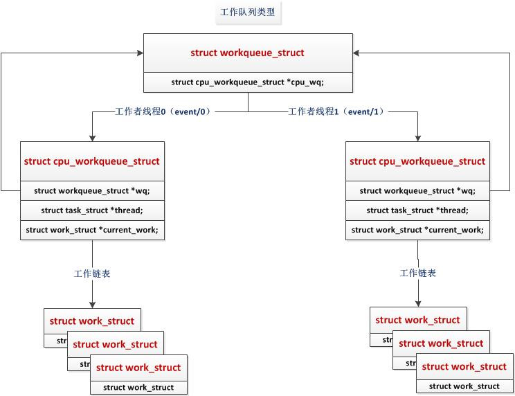

# 软中断tasklet工作队列

## 0.修订记录
| 修订说明 | 日期 | 作者 | 额外说明 |
| --- |
| 初版 | 2018/04/10 | 员清观 |  |

NOTE:

## 1 中断子系统一些基本概念

可以查看linux系统中中断统计信息：　`cat /proc/interrupts`
一些基本概念：
- 硬中断（外部中断）：通过外部设备接口，向CPU的中断请求引脚INT和NMI发中断请求产生
- 软中断（内部中断）：CPU内部执行中断指令，或由运算溢出，TF（Trap Falg，每执行一条指令，自动产生一个内部中断去执行一个中断服务程序）标志而产生
- 可屏蔽中断（INT）
- 不可屏蔽中断（NMI）
- 向量中断：不同的中断分配不同的中断号，有不同的入口地址，硬件提供
- 非向量中断：多个中断共享一个入口地址，再通过中断标志识别具体哪个中断，软件提供

中断处理程序是在关掉其他所有中断的情况下进行，执行于硬件相关的处理要求快，而有些驱动在中断处理程序中又需要完成大量的工作，这就矛盾了。这需要在这两者间找到一个平衡点，所以分解为两个部分。
- 顶半部（tophalf）
顶半部的功能是“登记中断”。顶半部尽可能快的完成比较急的功能，往往只是简单的读取寄存器中的中断状态并清除中断标志后进行“登记中断”即中断例程的底半部挂到该设备的底半部执行队列中去。这样顶半部执行的速度很快，能服务更多的中断请求
申请和释放中断函数request_irq() 和 free_irq();
- 底半部(bottom half)
底半部来完成中断事件的绝大多数使命。顶半部与底半部最大的不同是，底半部是可中断的，顶半部不可中断。

### 1.1 中断的申请和释放
```cpp
static inline int __must_check　devm_request_irq(struct device *dev, unsigned int irq, irq_handler_t handler, unsigned long irqflags, const char *devname, void *dev_id)
  |--> return devm_request_threaded_irq(dev, irq, handler, NULL, irqflags, devname, dev_id);
  //非线程化中断
  //int  devm_request_threaded_irq(struct device *dev, unsigned int irq, irq_handler_t handler, irq_handler_t thread_fn, unsigned long irqflags, const char *devname, void *dev_id)
    struct irq_devres *dr = devres_alloc(devm_irq_release, sizeof(struct irq_devres), GFP_KERNEL);
    rc = request_threaded_irq(irq, handler, thread_fn, irqflags, devname, dev_id);
    dr->irq = irq;  dr->dev_id = dev_id;
    devres_add(dev, dr);
```
`request_irq()`这个函数是对`request_thread_irq()`的封装，它给`request_thread_irq()`的`thread_fn`参数传进了一个NULL，也就是只申请中断处理函数，不要`thread_fn`; `devm_request_threaded_irq`这个函数增加了对申请irq的dev的管理．

```cpp
//顶半部机制
//申请和释放中断函数request_irq() 和 free_irq()
int request_irq(unsigned int irq, irq_handler_t handler, unsigned long irqflags, const char * devname, void *dev_id);
//irq是要申请的硬件中断号。handler是向系统登记的中断处理函数。这是一个回调函数，中断发生时，系统调用这个函数，传入的参数包括硬件中断号，device id，寄存器值。dev_id就是下面的request_irq时传递给系统的参数dev_id。irqflags是中断处理的一些属性。比较重要的有标明中断处理程序是快速处理程序(设置IRQF_DISABLED)还是慢速处理程序(不设置IRQF_DISABLED)。快速处理程序被调用时屏蔽所有中断。慢速处理程序不屏蔽。还有一个IRQF_SHARED属性，设置了以后运行多个设备共享中断。dev_id在中断共享时会用到。一般设置为这个设备的 device结构本身或者NULL。中断处理程序可以用dev_id找到相应的控制这个中断的设备，或者用irq2dev_map找到中断对应的设备。
void free_irq(unsigned int irq,void *dev_id);

//使能和屏蔽中断
void disable_irq(int irq)
void disable_irq_nosync(int irq)
void enable_irq(int irq)
//disable_irq()和disable_irq_nosync()的区别在于，后者立即返回，而且前者等待目前的中断处理完成。如果enable_irq()函数会引起系统死锁，这种情况下，只能使用disable_irq_nosync()
local_irq_save(flags)
local_irq_restore(flags)
//注意：保存的是数值，不是指针，因为flags是unsigned long类型，所以这对中断函数要在同一个函数中使用
```

HI_SOFTIRQ用于高优先级的tasklet，TASKLET_SOFTIRQ用于普通的tasklet.

linux kernel的中断子系统分成4个部分：
1. 硬件无关的代码，我们称之Linux kernel通用中断处理模块。无论是哪种CPU，哪种controller，其中断处理的过程都有一些相同的内容，这些相同的内容被抽象出来，和HW无关。此外，各个外设的驱动代码中，也希望能用一个统一的接口实现irq相关的管理（不和具体的中断硬件系统以及CPU体系结构相关）这些“通用”的代码组成了linux kernel interrupt subsystem的核心部分。
2. CPU architecture相关的中断处理。 和系统使用的具体的CPU architecture相关。
3. Interrupt controller驱动代码 。和系统使用的Interrupt controller相关。
4. 普通外设的驱动。这些驱动将使用Linux kernel通用中断处理模块的API来实现自己的驱动逻辑。

当外设触发一次中断后，一个大概的处理过程是：
1. 具体CPU architecture相关的模块会进行现场保护，然后调用machine driver对应的中断处理handler.--> ARM的IRQ异常,保护现场,调用中断handler
2、machine driver对应的中断处理handler中会根据硬件的信息获取HW interrupt ID，并且通过irq domain模块翻译成IRQ number.
3、调用该IRQ number对应的high level irq event handler，在这个high level的handler中，会通过和interupt controller交互，进行中断处理的flow control（处理中断的嵌套、抢占等），当然最终会遍历该中断描述符的IRQ action list，调用外设的specific handler来处理该中断
//中断控制器相关的处理.
4、具体CPU architecture相关的模块会进行现场恢复。

对于中断处理而言，linux将其分成了两个部分，一个叫做中断handler（top half），属于不那么紧急需要处理的事情被推迟执行，我们称之deferable task，或者叫做bottom half，。具体如何推迟执行分成下面几种情况：
1、推迟到top half执行完毕, 包括softirq机制和tasklet机制
2、推迟到某个指定的时间片（例如40ms）之后执行, softirq机制的一种应用场景（timer类型的softirq）
3、推迟到某个内核线程被调度的时候执行,包括threaded irq handler以及通用的workqueue机制和驱动专属kernel thread（不推荐使用）

软中断不会抢占另外一个软中断，唯一可以抢占软中断的是中断处理程序。软中断可以在不同CPU上并发执行(哪怕是同一个软中断)

## 2 软中断
### 2.1

**软中断是编译期间静态分配的**
```cpp
//eric #include<linux/interrupt.h>
//软中断的源码位于 kernel/softirq.c 中。
struct softirq_action
{
  void (*action)(struct softirq_action *);
};
enum
{
  HI_SOFTIRQ=0,
  TIMER_SOFTIRQ,
  NET_TX_SOFTIRQ,
  NET_RX_SOFTIRQ,
  BLOCK_SOFTIRQ,
  BLOCK_IOPOLL_SOFTIRQ,
  TASKLET_SOFTIRQ,
  SCHED_SOFTIRQ,
  HRTIMER_SOFTIRQ,
  RCU_SOFTIRQ,    /* Preferable RCU should always be the last softirq */
  NR_SOFTIRQS
};
//定义的一个枚举类型来静态声明软中断。索引号小的软中断在索引号大的软中断之前执行。要添加新项的话根据赋予它的优先级来决定加入的位置而不是直接添加到列表末尾
//与上面的枚举值相对应，内核定义了一个softirq_action的结构数组，每种软中断对应数组中的一项：
extern char *softirq_to_name[NR_SOFTIRQS];
static struct softirq_action softirq_vec[NR_SOFTIRQS] __cacheline_aligned_in_smp;

typedef struct {
    unsigned int __softirq_pending;
} ____cacheline_aligned irq_cpustat_t;
irq_cpustat_t irq_stat[NR_CPUS] ____cacheline_aligned;
//内核为每个cpu都管理着一个待决软中断变量（pending），它就是irq_cpustat_t; __softirq_pending字段中的每一个bit，对应着某一个软中断，某个bit被置位，说明有相应的软中断等待处理
```

**软中断的守护进程ksoftirqd**<br>
每个处理器都有一个这样的线程。所有线程的名字都叫做ksoftirq/n，区别在于n，它对应的是处理器的编号。在一个双CPU的机器上就有两个这样的线程，分别叫做ksoftirqd/0和ksoftirqd/1。为了保证只要有空闲的处理器，它们就会处理软中断，所以给每个处理器都分配一个这样的线程。
软中断的执行既可以守护进程中执行，也可以在中断的退出阶段执行。实际上，软中断更多的是在中断的退出阶段执行（irq_exit），以便达到更快的响应，加入守护进程机制，只是担心一旦有大量的软中断等待执行，会使得内核过长地留在中断上下文中
```cpp
//在cpu的热插拔阶段，内核为每个cpu创建了一个用于执行软件中断的守护进程ksoftirqd，同时定义了一个per_cpu变量用于保存每个守护进程的task_struct结构指针：
DEFINE_PER_CPU(struct task_struct *, ksoftirqd);
//大多数情况下，软中断都会在irq_exit阶段被执行，在irq_exit阶段没有处理完的软中断才有可能会在守护进程中执行。
```

**编写自己的软中断**
(1)、分配索引，在HI_SOFTIRQ与NR_SOFTIRQS中间添加自己的索引号。
(2)、注册处理程序，处理程序：open_softirq(索引号，处理函数)。
(3)、触发你的软中断：raise_softirq(索引号)。

**软中断处理程序注意**
(1)、软中断处理程序执行的时候，允许响应中断，但自己不能休眠。
(2)、如果软中断在执行的时候再次触发，则别的处理器可以同时执行，所以加锁很关键。

**软中断的执行过程**<br>
软中断的调度时机:
1. do_irq完成I/O中断时调用irq_exit。
2. 系统使用I/O APIC,在处理完本地时钟中断时。
3. local_bh_enable，即开启本地软中断时。
4. SMP系统中，cpu处理完被CALL_FUNCTION_VECTOR处理器间中断所触发的函数时。
5. ksoftirqd/n线程被唤醒时。


下面以从中断处理返回函数irq_exit中调用软中断为例详细说明：<br>
1. 首先调用local_softirq_pending函数取得目前有哪些位存在软件中断。
2. 调用__local_bh_disable关闭软中断，其实就是设置正在处理软件中断标记，在同一个CPU上使得不能重入__do_softirq函数。
3. 重新设置软中断标记为0，set_softirq_pending重新设置软中断标记为0，这样在之后重新开启中断之后硬件中断中又可以设置软件中断位。
4. 调用local_irq_enable，开启硬件中断。
5. 之后在一个循环中，遍历pending标志的每一位，如果这一位设置就会调用软件中断的处理函数。在这个过程中硬件中断是开启的，随时可以打断软件中断。这样保证硬件中断不会丢失。
6. 之后关闭硬件中断(local_irq_disable)，查看是否又有软件中断处于pending状态，如果是，并且在本次调用__do_softirq函数过程中没有累计重复进入软件中断处理的次数超过max_restart=10次，就可以重新调用软件中断处理。如果超过了10次，就调用wakeup_softirqd()唤醒内核的一个进程来处理软件中断。设立10次的限制，也是为了避免影响系统响应时间。
7. 调用_local_bh_enable开启软中断。


```cpp
```
```cpp
```
```cpp
```

## 3 tasklet


tasklet整体是这么运行的：驱动应该在其硬中断处理函数的末尾调用tasklet_schedule()接口激活该tasklet，内核经常调用do_softirq()执行软中断，通过softirq执行tasket，如下图所示。图中灰色部分为禁止硬中断部分，为保护软中断pending位图和tasklet_vec链表数组，count的改变均为原子操作，count确保SMP架构下同时只有一个CPU在执行该tasklet：

tasklet是一种“可延迟执行”机制中的一种，基于软中断实现主要面向驱动程序。tasklet与软中断的区别在于每个CPU上不能同时执行相同的tasklet，tasklet函数本身也不必是可重入的。与软中断一样，为了保证tasklet和硬中断之间在同一个CPU上是串行执行的，维护其PER_CPU的链表时，需要屏蔽硬中断。
具体实现主要看两个参数，一个state，一个count
- state - 用于校验在tasklet_action()或tasklet_schedule()时，是否执行该tasklet的handler。state被tasklet_schedule()函数、tasklet_hi_schedule()函数、tasklet_action()函数以及tasklet_kill()函数所修改：
  - tasklet_schedule()函数、tasklet_hi_schedule()函数将state置位TASKLET_STATE_SCHED。
  - tasklet_action()函数将state的TASKLET_STATE_SCHED清除，并设置TASKLET_STATE_RUN。
    - tasklet_action()函数在设置TASKLET_STATE_RUN标志时，使用了tasklet_trylock()、tasklet_unlock()等接口：
  - tasklet_kill()函数将state的TASKLET_STATE_SCHED清除
- count - 用于smp同步，count不为0，则表示该tasklet正在某CPU上执行，其他CPU则不执行该tasklet，count保证某个tasklet同时只能在一个CPU上执行。count的操作都是原子操作
  - tasklet_disable()函数/tasklet_disable_nosync()函数将count原子减1。
  - tasklet_enablle()函数将count原子加1。

另外，tasklet的操作如tasklet_schedule()tasklet_action()中还所使用了local_irq_save()/local_irq_disable()等禁止本地中断的函数，用于保护tasklet_vec[]链表和软中断的pending位图的更改。因为硬中断的激发能导致二者的更改，被保护对象被修改完毕后立即使用local_irq_resore()/local_irq_enable()开启

由于软中断必须使用可重入函数，这就导致设计上的复杂度变高，作为设备驱动程序的开发者来说，增加了负担。而如果某种应用并不需要在多个CPU上并行执行，那么软中断其实是没有必要的。因此诞生了弥补以上两个要求的tasklet。它具有以下特性：
a）一种特定类型的tasklet只能运行在一个CPU上，不能并行，只能串行执行。
b）多个不同类型的tasklet可以并行在多个CPU上。
c）软中断是静态分配的，在内核编译好之后，就不能改变。但tasklet就灵活许多，可以在运行时改变（比如添加模块时）。
tasklet是在两种软中断类型的基础上实现的，因此如果不需要软中断的并行特性，tasklet就是最好的选择。也就是说tasklet是软中断的一种特殊用法，即延迟情况下的串行执行。


### 3.1 比softirq优点
tasklet对于softirq而言有哪些好处：
1. tasklet可以动态分配，也可以静态分配，数量不限。
2. 同一种tasklet在多个cpu上也不会并行执行，每次中断它只会向其中的一个CPU注册，而不是所有的CPU,这使得程序员在撰写tasklet function的时候比较方便，减少了对并发的考虑（当然损失了性能）。
3. 不同tasklet可能在不同CPU上同时运行，则需要注意共享数据的保护

linux内核为什么还要引入tasklet机制呢？主要原因是软中断的pending标志位也就32位，一般情况是不随意增加软中断处理的。而且内核也没有提供通用的增加软中断的接口。其次内，软中断处理函数要求可重入，需要考虑到竞争条件比较多，要求比较高的编程技巧。所以内核提供了tasklet这样的一种通用的机制。

因为是靠软中断实现，所以tasklet不能睡眠。这意味着不能在tasklet中使用信号量或者其他阻塞函数。tasklet运行时运行可以响应中断。但如果tasklet和中断处理程序之间共享了某些数据的话，要做好预防工作。

### 3.2 tasklet应用

**tasklet 内核实现**

```cpp
struct tasklet_struct {
  struct tasklet_struct *next; //指向链表的下一个结构
  unsigned long state; //任务状态
  atomic_t count; //计数
  void (*func)(unsigned long); //处理函数
  unsigned long data;//传递参数
};
enum　//state的取值：
{
  TASKLET_STATE_SCHED,
  /* Tasklet is scheduled for execution */
  TASKLET_STATE_RUN
  /* Tasklet is running (SMP only) */
};
enum
{ HI_SOFTIRQ=0, TIMER_SOFTIRQ, NET_TX_SOFTIRQ,
  NET_RX_SOFTIRQ, BLOCK_SOFTIRQ, BLOCK_IOPOLL_SOFTIRQ,
  TASKLET_SOFTIRQ, SCHED_SOFTIRQ,   HRTIMER_SOFTIRQ, RCU_SOFTIRQ,
  /* Preferable RCU should always be the last softirq */
  NR_SOFTIRQS
};
//tasklet队列
struct tasklet_head
{
  struct tasklet_struct *head;
  struct tasklet_struct **tail;
};
static DEFINE_PER_CPU(struct tasklet_head, tasklet_vec);
static DEFINE_PER_CPU(struct tasklet_head, tasklet_hi_vec);
```


**初始化和调度tasklet,**<br>
```cpp
void tasklet_init(struct tasklet_struct *t,
  void (*func)(unsigned long), unsigned long data)
{
  t->next = NULL;
  t->state = 0;
  atomic_set(&t->count, 0);
  t->func = func;
  t->data = data;
}
//调度tasklet
static inline void tasklet_schedule(struct tasklet_struct *t)
{
  if (!test_and_set_bit(TASKLET_STATE_SCHED, &t->state))
  __tasklet_schedule(t);
}

//__tasklet_schedule()源码在kernel/softirq.c
void __tasklet_schedule(struct tasklet_struct *t)
{
  unsigned long flags;

  local_irq_save(flags);
  t->next = NULL;
  *__this_cpu_read(tasklet_vec.tail) = t;
  __this_cpu_write(tasklet_vec.tail, &(t->next));
  raise_softirq_irqoff(TASKLET_SOFTIRQ);
  local_irq_restore(flags);
}
//__tasklet_schedule(stuct tasklet_struct *t)的实现是通过 获取当前CPU的tasklet_vec链表，将需要调度的tasklet插入当前CPU的tasklet_vec链表头部，并执行TASKLET_SOFTIRQ软中断。
```
**禁止/使能/删除tasklet,**<br>
```cpp
//用来禁止指定的tasklet，不用等待tasklet执行完毕就返回，不过不安全
static inline void tasklet_disable_nosync(struct tasklet_struct *t)
{
  atomic_inc(&t->count);
  smp_mb__after_atomic_inc();
}
//禁止某个指定的tasklet，如果该tasklet正在执行，会等待它执行完毕再返回
static inline void tasklet_disable(struct tasklet_struct *t)
{
  tasklet_disable_nosync(t);
  tasklet_unlock_wait(t);
  smp_mb();
}
static inline void tasklet_enable(struct tasklet_struct *t)//激活一个tasklet。
{
  smp_mb__before_atomic_dec();
  atomic_dec(&t->count);
}
void tasklet_kill(struct tasklet_struct *t)//从挂起的队列中去掉一个tasklet。
{
  if (in_interrupt())
    printk("Attempt to kill tasklet from interrupt\n");

  while (test_and_set_bit(TASKLET_STATE_SCHED, &t->state)) {
    do {
      yield();
    } while (test_bit(TASKLET_STATE_SCHED, &t->state));
  }
  tasklet_unlock_wait(t);        //等待tasklet执行完毕，再去移除它，能引起休眠，禁止在中断上下文中使用
  clear_bit(TASKLET_STATE_SCHED, &t->state);
}
```
```cpp
//tasklet核心处理函数
static void tasklet_action(struct softirq_action *a)
{
  struct tasklet_struct *list;

  local_irq_disable();
  list = __this_cpu_read(tasklet_vec.head);    //得到tasklet链表
  __this_cpu_write(tasklet_vec.head, NULL);    //清空链表
  __this_cpu_write(tasklet_vec.tail, &__get_cpu_var(tasklet_vec).head);
  local_irq_enable();

  while (list) {
    struct tasklet_struct *t = list;    //得到当前链表头

    list = list->next;

    if (tasklet_trylock(t)) {    //多处理器的检查
      if (!atomic_read(&t->count)) {
        if (!test_and_clear_bit(TASKLET_STATE_SCHED, &t->state))
          BUG();
        t->func(t->data);
        tasklet_unlock(t);
        continue;
      }
      tasklet_unlock(t);    //以上保证了同一时间，相同类型的tasklet只能有一个执行
    }

    local_irq_disable();
    t->next = NULL;
    *__this_cpu_read(tasklet_vec.tail) = t;
    __this_cpu_write(tasklet_vec.tail, &(t->next));
    __raise_softirq_irqoff(TASKLET_SOFTIRQ);
    local_irq_enable();
  }
}
struct softirq_action {
  void (*action)(struct softirq_action *);
  void *data;
};
void __init softirq_init(void)
{
  ...
  open_softirq(TASKLET_SOFTIRQ, tasklet_action);
  open_softirq(HI_SOFTIRQ, tasklet_hi_action);
}
```

```cpp
//编写处理函数tasklet_handler
void tasklet_handler(unsigned long data)
//因为是靠软中断实现，所以tasklet不能睡眠。这意味着不能在tasklet中使用信号量或者其他阻塞函数。tasklet运行时运行可以响应中断。但如果tasklet和中断处理程序之间共享了某些数据的话，要做好预防工作。
```
**tasklet流程**
驱动程序在初始化时，通过函数tasklet_init建立一个tasklet，然后调用函数tasklet_schedule将这个tasklet 放在 tasklet_vec链表的头部，并唤醒后台线程ksoftirqd。当后台线程ksoftirqd运行调用__do_softirq时，会执行在中断 向量表softirq_vec里中断号TASKLET_SOFTIRQ对应的tasklet_action函数，然后tasklet_action遍历 tasklet_vec链表，调用每个tasklet的函数完成软中断操作。
其中：ksoftirqd 是一个后台运行的内核线程，它会周期的遍历软中断的向量列表。

**注意：**
1.Tasklet 可被hi-schedule和一般schedule（调度），hi-schedule一定比一般shedule早运行
2.同一个Tasklet可同时被hi-schedule和一般schedule
3.同一个Tasklet若被同时hi-schedule多次，等同于只hi-shedule一次，因为，在tasklet未 运行时，hi-shedule同一tasklet无意义，会冲掉前一个tasklet
4.不同的tasklet不按先后shedule顺序运行，而是并行运行
5.Taskelet的hi-schedule 使用softirq 0, 一般schedule用softirq 30

tasklet是作为中断下半部的一个很好的选择，它在性能和易用性之间有着很好的平衡。较之于softirq，tasklet不需要考虑SMP下的并行问题，而又比workqueues有着更好的性能。tasklet通常作为硬中断的下半部来使用，在硬中断中调用tasklet_schedule(t)。每次硬中断都会触发一次tasklet_schedule(t)，但是每次中断它只会向其中的一个CPU注册，而不是所有的CPU。
完成注册后的tasklet由tasklet_action()来执行，在SMP环境下，它保证同一时刻，同一个tasklet只有一个副本在运行，这样就避免了使用softirq所要考虑的互斥的问题。
再者，tasklet在执行tasklet->func()前，再一次允许tasklet可调度（注册），但是在该tasklet已有一个副本在其他CPU上运行的情况下，它只能退后执行。
总之，同一个硬中断引起的一个tasklet_schedule()动作只会使一个tasklet被注册，而不同中断引起的tasklet则可能在不同的时刻被注册而多次被执行。

linux kernel中，和tasklet相关的softirq有两项，`HI_SOFTIRQ`用于高优先级的tasklet，`TASKLET_SOFTIRQ`用于普通的tasklet

`state`成员表示该tasklet的状态，`TASKLET_STATE_SCHED`表示该tasklet以及被调度到某个CPU上执行，`TASKLET_STATE_RUN`表示该tasklet正在某个cpu上执行。count成员是和enable或者disable该tasklet的状态相关，如果count等于0那么该tasklet是处于enable的，如果大于0，表示该tasklet是disable的。在softirq文档中，我们知道local_bh_disable/enable函数就是用来disable/enable bottom half的，这里就包括softirq和tasklet。但是，有的时候内核同步的场景不需disable所有的softirq和tasklet，而仅仅是disable该tasklet，这时候，tasklet_disable和tasklet_enable就派上用场了。

```cpp
//eric #include<linux/interrupt.h>
void tasklet_init(struct tasklet_struct *t, void (*func)(unsigned long), unsigned long data);
//eric #define DECLARE_TASKLET(name, func, data) \ struct tasklet_struct name = { NULL, 0, ATOMIC_INIT(0), func, data }
//eric #define DECLARE_TASKLET_DISABLED(name, func, data) \ struct tasklet_struct name = { NULL, 0, ATOMIC_INIT(1), func, data }
//一般不会使用静态创建方式，不灵活，无法定义在别的结构中，只能作为全局
void tasklet_schedule(struct tasklet_struct *t);
//调度 tasklet 执行，如果tasklet在运行中被调度, 它在完成后会再次运行; 这保证了在其他事件被处理当中发生的事件受到应有的注意. 这个做法也允许一个 tasklet 重新调度它自己。
void tasklet_hi_schedule(struct tasklet_struct *t);
//和tasklet_schedule类似，只是在更高优先级执行。当软中断处理运行时, 它处理高优先级 tasklet。在其他软中断之前，只有具有低响应周期要求的驱动才应使用这个函数, 可避免其他软件中断处理引入的附加周期。

void tasklet_disable(struct tasklet_struct *t);
//函数暂时禁止tasklet被tasklet_schedule调度，直到这个 tasklet 再次被enable；若这个 tasklet 当前在运行, 这个函数忙等待直到这个tasklet退出
void tasklet_disable_nosync(struct tasklet_struct *t);
//和tasklet_disable类似，但是tasklet可能仍然运行在另一个 CPU。
void tasklet_enable(struct tasklet_struct *t);
//使能一个之前被disable的 tasklet。若这个 tasklet 已经被调度, 它会很快运行。 tasklet_enable和tasklet_disable必须匹配调用, 因为内核跟踪每个 tasklet 的"禁止次数"。
void tasklet_kill(struct tasklet_struct *t);
//确 保了 tasklet 不会被再次调度来运行，通常当一个设备正被关闭或者模块卸载时被调用。如果 tasklet正在运行, 这个函数等待直到它执行完毕。若 tasklet 重新调度它自己，则必须阻止在调用 tasklet_kill前它重新调度它自己，如同使用 del_timer_sync。
```

```cpp
struct tasklet_struct my_tasklet;
static void dw_mci_tasklet_func(unsigned long priv) { }
//动态创建和初始化
tasklet_init(&my_tasklet, dw_mci_tasklet_func, (unsigned long)host);
//中断处理顶半部
irqreturn_t xxx_interrupt(int irq,void *dev_id)
{
  ... //可能通过原子bits传递一些参数
  tasklet_schedule(&my_tasklet);    //调度tasklet
  ...
}

tasklet_kill(&my_tasklet);
```
---
## 4 workqueue工作队列
https://blog.csdn.net/myarrow/article/details/8090504

Linux中的Workqueue机制就是为了简化内核线程的创建。通过调用workqueue的接口就能创建内核线程。并且可以根据当前系统CPU的个数创建线程的数量，使得线程处理的事务能够并行化。workqueue是内核中实现简单而有效的机制，他显然简化了内核daemon的创建，方便了用户的编程.

```cpp
kthread应用:
kernel_thread是最基础的创建内核线程的接口, 它通过将一个函数直接传递给内核来创建一个进程, 创建的进程运行在内核空间, 并且与其他进程线程共享内核虚拟地址空间.早期的kernel_thread执行更底层的操作, 直接创建了task_struct并进行初始化,引入了kthread_create和kthreadd 2号进程后, kernel_thread的实现也由统一的_do_fork(或者早期的do_fork)托管实现.

//eric #include <linux/kthread.h>
struct mmc_queue my_queue;
static int mmc_queue_thread(void *d){
     struct mmc_queue *mq = d;
}
//创建新线程后立即唤醒它，其本质就是先用kthread_create创建一个内核线程，然后通过wake_up_process唤醒它
struct task_struct  *thread = kthread_run(mmc_queue_thread, &my_queue, "my_thread_name");
int kthread_stop(struct task_struct *k);
int kthread_should_stop(void);
```

### 4.1 系统共享工作队列
在大多数情况下, 并不需要自己建立工作队列，而是只定义工作, 将工作结构挂接到内核预定义的事件工作队列中调度, 在kernel/workqueue.c中定义了一个静态全局量的工作队列`static struct workqueue_struct *keventd_wq;`默认的工作者线程叫做`events/n`，这里n是处理器的编号，每个处理器对应一个线程。调度工作结构, 将工作结构添加到全局的事件工作队列`keventd_wq`，调用了queue_work通用模块。对外屏蔽了`keventd_wq`的接口，用户无需知道此参数，相当于使用了默认参数。`keventd_wq`由内核自己维护，创建，销毁。这样work马上就会被调度，一旦其所在的处理器上的工作者线程被唤醒，它就会被执行

```cpp
struct work_struct {
  atomic_long_t data;
  struct list_head entry;
  work_func_t func;
};//func的参数是work_struct指针，typedef void (*work_func_t)(struct work_struct *work)。
struct delayed_work {
  struct work_struct work;
  struct timer_list timer;
  struct workqueue_struct *wq;
  int cpu;/* target workqueue and CPU ->timer uses to queue ->work */
};
struct work_struct my_wq;
void my_wq_func(struct work_struct *work) {}
INIT_WORK(&my_wq,(void(*)(void*))my_wq_func);//INIT_WORK可以初始化这个工作队列并将工作队列与处理函数绑定
schedule_work(&my_wq); //调度工作队列，从中断bottom half调用，或者从线程中调用目标只是延后执行

int schedule_work(struct work_struct *work);
int schedule_delayed_work(struct delayed_work *dwork,unsigned long delay);//delay的单位为jiffies
bool cancel_delayed_work(struct delayed_work *dwork)
bool cancel_delayed_work_sync(struct delayed_work *dwork)//等待结束，不可在中断上下文
```

**一个定义，同时支持多个工作的范例**
```cpp
static int sensor_index[MAX_SENSORS_NUM] = {-1};
static int sensor_masks = 0;
static int sensor_counter = 0;
struct work_struct ddk_sensor_work;

static void ddk_sensor_init_work(struct work_struct *work)
{
	for (int i = 0;i < sensor_counter;i++) {
		if (i >= MAX_SENSORS_NUM)
			break;
		if (!test_and_clear_bit(i,&sensor_masks))
			break;
    ...
	}
}
void init(int index)
{
  sensor_index[sensor_counter] = index;
	set_bit(sensor_counter, &sensor_masks);
	sensor_counter ++;
	INIT_WORK(&ddk_sensor_work, ddk_sensor_init_work);
	schedule_work(&ddk_sensor_work);
}
```

### 4.2 独立工作队列
https://blog.csdn.net/myarrow/article/details/8090504

#### 4.2.1 数据结构
```cpp
//eric #include <linux/workqueue.h>

struct workqueue_struct {
  struct cpu_workqueue_struct *cpu_wq;
  struct list_head list;
  const char *name;   /*workqueue name*/
  int singlethread;   /*是不是单线程 - 单线程我们首选第一个CPU -0表示采用默认的工作者线程event*/
  int freezeable;  /* Freeze threads during suspend */
  int rt;
};
//如果是多线程，Linux根据当前系统CPU的个数创建cpu_workqueue_struct
struct cpu_workqueue_struct {
  spinlock_t lock; //*因为工作者线程需要频繁的处理连接到其上的工作，所以需要枷锁保护*/
  struct list_head worklist;
  wait_queue_head_t more_work;
  struct work_struct *current_work; /*当前的work*/
  struct workqueue_struct *wq;   /*所属的workqueue*/
  struct task_struct *thread;    //任务的上下文
} ____cacheline_aligned;
```
#### 4.2.2 创建队列

**create_singlethread_workqueue(name)**

图中的cwq是一per-CPU类型的地址空间。对于create_singlethread_workqueue而言，即使是对于多CPU系统，内核也只负责创建一个worker_thread内核进程。该内核进程被创建之后，会先定义一个图中的wait节点，然后在一循环体中检查cwq中的worklist，如果该队列为空，那么就会把wait节点加入到cwq中的more_work中，然后休眠在该等待队列中。
Driver调用queue_work（struct workqueue_struct *wq, struct work_struct *work）向wq中加入工作节点。work会依次加在cwq->worklist所指向的链表中。queue_work向cwq->worklist中加入一个work节点，同时会调用wake_up来唤醒休眠在cwq->more_work上的worker_thread进程。wake_up会先调用wait节点上的autoremove_wake_function函数，然后将wait节点从cwq->more_work中移走。
worker_thread再次被调度，开始处理cwq->worklist中的所有work节点...当所有work节点处理完毕，worker_thread重新将wait节点加入到cwq->more_work，然后再次休眠在该等待队列中直到Driver调用queue_work...

**create_workqueue(name)**

相对于create_singlethread_workqueue, create_workqueue同样会分配一个wq的工作队列，但是不同之处在于，对于多CPU系统而言，对每一个CPU，都会为之创建一个per-CPU的cwq结构，对应每一个cwq，都会生成一个新的worker_thread进程。但是当用queue_work向cwq上提交work节点时，是哪个CPU调用该函数，那么便向该CPU对应的cwq上的worklist上增加work节点

**小结**
当用户调用workqueue的初始化接口create_workqueue或者create_singlethread_workqueue对workqueue队列进行初始化时，内核就开始为用户分配一个workqueue对象，并且将其链到一个全局的workqueue队列中。然后Linux根据当前CPU的情况，为workqueue对象分配与CPU个数相同的cpu_workqueue_struct对象，每个cpu_workqueue_struct对象都会存在一条任务队列。紧接着，Linux为每个cpu_workqueue_struct对象分配一个内核thread，即内核daemon去处理每个队列中的任务。至此，用户调用初始化接口将workqueue初始化完毕，返回workqueue的指针。
workqueue初始化完毕之后，将任务运行的上下文环境构建起来了，但是具体还没有可执行的任务，所以，需要定义具体的work_struct对象。然后将work_struct加入到任务队列中，Linux会唤醒daemon去处理任务


```cpp
//多种初始化模式
  DECLARE_WORK(n, f)
  /*n 是声明的work_struct结构名称, f是要从工作队列被调用的函数*/
  DECLARE_DELAYED_WORK(n, f)
  /*n是声明的delayed_work结构名称, f是要从工作队列被调用的函数*/
  /*若在运行时需要建立 work_struct 或 delayed_work结构, 使用下面 2 个宏定义:*/
  INIT_WORK(struct work_struct *work, void (*function)(void *));
  PREPARE_WORK(struct work_struct *work, void (*function)(void *));
  INIT_DELAYED_WORK(struct delayed_work *work, void (*function)(void *));
  PREPARE_DELAYED_WORK(struct delayed_work *work, void (*function)(void *));
  /* INIT_* 做更加全面的初始化结构的工作，在第一次建立结构时使用. PREPARE_* 做几乎同样的工作, 但是它不初始化用来连接 work_struct或delayed_work 结构到工作队列的指针。如果这个结构已经被提交给一个工作队列, 且只需要修改该结构,则使用 PREPARE_* 而不是 INIT_* */

struct workqueue_struct *create_workqueue(const char *name);//linux 2.6.36 之前
struct workqueue_struct *create_singlethread_workqueue(const char *name);
//每个工作队列有一个或多个专用的进程("内核线程"), 这些进程运行提交给这个队列的函数。 若使用 create_workqueue, 就得到一个工作队列它在系统的每个处理器上有一个专用的线程。在很多情况下，过多线程对系统性能有影响，如果单个线程就足够则使用 create_singlethread_workqueue 来创建工作队列。

//工作函数不能访问用户空间，因为它在一个内核线程中运行, 完全没有对应的用户空间来访问。
int queue_work(struct workqueue_struct *wq, struct work_struct *work);
int queue_delayed_work(struct workqueue_struct *wq,struct delayed_work *dwork, unsigned long delay);
/*每个都添加work到给定的workqueue。如果使用 queue_delay_work, 则实际的工作至少要经过指定的 jiffies 才会被执行。 这些函数若返回 1 则工作被成功加入到队列; 若为0，则意味着这个 work 已经在队列中等待，不能再次加入*/
int queue_delayed_work_on(int cpu, struct workqueue_struct *wq, struct delayed_work *dwork, unsigned long delay);
//指定cpu，不知道怎么使用

void destroy_workqueue(struct workqueue_struct *queue); //释放工作队列
```

**workqueue的取消和flush，用的不多，暂时不深究用法**
```cpp
int cancel_delayed_work(struct delayed_work *work);
int cancel_work_sync(struct work_struct *work); //取消一个挂起的工作队列入口项可以调用
//如果这个入口在它开始执行前被取消，则返回非零。内核保证给定入口的执行不会在调用 cancel_delay_work 后被初始化. 如果 cancel_delay_work 返回 0, 但是, 这个入口可能已经运行在一个不同的处理器, 并且可能仍然在调用 cancel_delayed_work 后在运行. 要绝对确保工作函数没有在 cancel_delayed_work 返回 0 后在任何地方运行, 你必须跟随这个调用来调用:
void flush_workqueue(struct workqueue_struct *wq);
//在 flush_workqueue 返回后, 没有在这个调用前提交的函数在系统中任何地方运行。而cancel_work_sync会取消相应的work，但是如果这个work已经在运行那么cancel_work_sync会阻塞，直到work完成并取消相应的work。
//flush_workqueue并不会取消任何延迟执行的工作，因此如果要取消延迟工作，应该调用cancel_delayed_work_sync()
int cancel_delayed_work_sync(struct delayed_work *dwork);
```

```cpp
//范例
struct my_struct_t {
    char *name;
    struct work_struct my_work;
};

void my_func(struct work_struct *work)
{
    struct my_struct_t *my_name = container_of(work, struct my_struct_t, my_work);
    ...
}

struct workqueue_struct *my_wq;    //全局变量
struct my_struct_t my_name;            //全局变量

//初始化函数中定义
my_wq = create_workqueue(“my wq”);
my_name.name = “William”;
INIT_WORK(&(my_name.my_work), my_func);
queue_work(my_wq, &(my_name.my_work));

//卸载函数中使用
destroy_workqueue(my_wq);
```
## 5 kthread_work(er)
提供统一的模板来创建和管理kthread.


```cpp
struct kthread_worker {
    spinlock_t        lock;//保护work_list链表的自旋锁
    struct list_head    work_list;//kthread_work链表,相当于流水线
    struct task_struct    *task;//为该kthread_worker执行任务的线程对应的task_struct结构
    struct kthread_work    *current_work;//当前正在处理的kthread_work
};

struct kthread_work {
    struct list_head    node;//kthread_work链表的链表元素
    kthread_work_func_t    func;//执行函数,该kthread_work所要做的事情
    wait_queue_head_t    done;//没有找到相关用法
    struct kthread_worker    *worker;//处理该kthread_work的kthread_worker
};
struct __wait_queue_head { // 是一个带锁的链表节点
    spinlock_t lock;
    struct list_head task_list;
};
typedef struct __wait_queue_head wait_queue_head_t;
//现在见到的基本应用模式，是添加message到queue,然后queue_kthread_work去处理。
//tasklet的方式，设置bit，触发处理。
//多个cpu的支持的问题，需要使用spinlock来同步。
spin_lock_irqsave(&master->queue_lock, flags);
spin_unlock_irqrestore(&master->queue_lock, flags);
```

**flush_kthread_worker阻塞等待worker执行完毕**
```cpp
struct kthread_flush_work {
    struct kthread_work work;
    struct completion   done;
};
static void kthread_flush_work_fn(struct kthread_work *work)
{
    struct kthread_flush_work *fwork =
        container_of(work, struct kthread_flush_work, work);
    complete(&fwork->done); // 唤醒完成量
}
void flush_kthread_worker(struct kthread_worker *worker)
{
    struct kthread_flush_work fwork = {
        KTHREAD_WORK_INIT(fwork.work, kthread_flush_work_fn),
        COMPLETION_INITIALIZER_ONSTACK(fwork.done), // ON_STACK后缀相当于加了static
    };
    queue_kthread_work(worker, &fwork.work); // 将 fwork中的work成员的node节点过接到worker_list下，并尝试唤醒线程进行kthread_flush_work_fn函数的执行
    wait_for_completion(&fwork.done); // 调用这个函数的线程睡眠等待在这里，等待执行worker中work_list下的fulsh_kthread_work完kthread_flush_work_fn函数
}
```

```cpp
//eric #include <linux/kthread.h>
struct kthread_worker worker;//声明一个kthread_worker
init_kthread_worker(&worker);//初始化kthread_worker，链表等
struct task_struct *kworker_task = kthread_run(kthread_worker_fn, &worker, "nvme%d", dev->instance);
//struct task_struct *kworker_task = kthread_run(kthread_worker_fn, &worker, dev_name(&master->dev));
//为kthread_worker创建一个内核线程来处理work.
void work_fn1(struct kthread_work *work)
{
  struct spi_master *master =	container_of(work, struct spi_master, pump_messages);
  ...
}
struct kthread_work work1;//声明一个kthread_work
init_kthread_work(&work1, work_fn1);//初始化kthread_work,设置work回调函数等
queue_kthread_work(&worker, &work1);//将kthread_work添加到kthread_worker的work_list.
struct kthread_work work2;//声明一个kthread_work
init_kthread_work(&work2, work_fn2);//初始化kthread_work,设置work回调函数等
queue_kthread_work(&worker, &work2);//将kthread_work添加到kthread_worker的work_list.

int kthread_stop(struct task_struct *k);//停止kthread,一般可以flush_kthread_worker()之后调用。
```

**基本无用的初始化声明宏**
```cpp
//eric #define DEFINE_KTHREAD_WORKER(worker) struct kthread_worker worker = KTHREAD_WORKER_INIT(worker)
//eric #define DEFINE_KTHREAD_WORK(work, fn) struct kthread_work work = KTHREAD_WORK_INIT(work, fn)
```

## 6 timer和内核延时
**重要参考文件**<br>
  `/kernel/kernel/timer.c`
  `/kernel/kernel/timers.c`

```cpp
struct timer_list {
	/* All fields that change during normal runtime grouped to the same cacheline */
	struct list_head entry;
	unsigned long expires;
	struct tvec_base *base;

	void (*function)(unsigned long);
	unsigned long data;

	int slack;

#ifdef CONFIG_TIMER_STATS
	int start_pid;
	void *start_site;
	char start_comm[16];
#endif
#ifdef CONFIG_LOCKDEP
	struct lockdep_map lockdep_map;
#endif
};

void ndelay(unsigned long nsecs);
void udelay(unsigned long usecs);
void mdelay(unsigned long msecs);

void wait_some_time()
  unsigned long timeout = jiffies + msecs_to_jiffies(500);
  while(time_before(jiffies, timeout));

unsigned long msecs_to_jiffies(const unsigned int m)//ms到jiffies的转化
unsigned int jiffies_to_msecs(const unsigned long j)
void msleep(unsigned int msecs)
  unsigned long timeout = msecs_to_jiffies(msecs) + 1;
  |--> timeout = schedule_timeout_uninterruptible(timeout);//signed long __sched schedule_timeout_uninterruptible(signed long timeout)
    __set_current_state(TASK_UNINTERRUPTIBLE);
    |--> return schedule_timeout(timeout);//signed long __sched schedule_timeout(signed long timeout)
      expire = timeout + jiffies;
      setup_timer_on_stack(&timer, process_timeout, (unsigned long)current);//on timeout-->wake_up_process((struct task_struct *)__data);唤醒当前进程
      __mod_timer(&timer, expire, false, TIMER_NOT_PINNED);
      schedule();
      del_singleshot_timer_sync(&timer);
      destroy_timer_on_stack(&timer);      timeout = expire - jiffies;
      return timeout < 0 ? 0 : timeout;

unsigned long msleep_interruptible(unsigned int msecs)
  unsigned long timeout = msecs_to_jiffies(msecs) + 1;
  while (timeout && !signal_pending(current))
    timeout = schedule_timeout_interruptible(timeout);
  return jiffies_to_msecs(timeout);
void usleep_range(unsigned long min, unsigned long max)
  __set_current_state(TASK_UNINTERRUPTIBLE);  do_usleep_range(min, max);//return schedule_hrtimeout_range(&kmin, delta, HRTIMER_MODE_REL);


void __init start_kernel(void)
  |--> init_timers();//void __init init_timers(void)
    err = timer_cpu_notify(&timers_nb, (unsigned long)CPU_UP_PREPARE,
    init_timer_stats();
    register_cpu_notifier(&timers_nb);
    |--> open_softirq(TIMER_SOFTIRQ, run_timer_softirq);//void run_timer_softirq(struct softirq_action *h)
      struct tvec_base *base = __this_cpu_read(tvec_bases);
      hrtimer_run_pending();
      if (time_after_eq(jiffies, base->timer_jiffies))    __run_timers(base);//处理到期的timers,call_timer_fn(timer, fn, data);
void timer_example()
  struct timer_list	timeout_timer;
  init_timer(&timeout_timer);
  timeout_timer.function = dc21285_enable_error;
  timeout_timer.data = (unsigned long)dev;
  timeout_timer.expires = jiffies + HZ;//标准应用方式，HZ代表1s
  add_timer(&timeout_timer); //void add_timer(struct timer_list *timer) //注册到内核动态定时器链表中
  mod_timer(&timeout_timer, jiffies+HZ);//int mod_timer(struct timer_list *timer, unsigned long expires)
  del_timer(&timeout_timer); // int del_timer(struct timer_list *timer)
  del_timer_sync(&timeout_timer); //int del_timer_sync(struct timer_list *timer)，等待timer被处理完，不能在中断上下文中调用．

```
